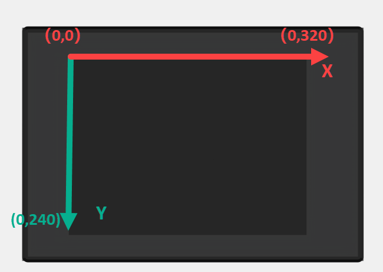

# 1. Learn K210 Module

## 1.1 Module Introduction

**1.1.1 Introduction**

The WonderMV Visual Module is a powerful and cost-effective AI vision module developed based on the K210 chip, hence also referred to as the **"K210 Vision Module"** in the following text.

It supports 12 AI vision functions, including color recognition, landmark recognition, visual line following, face recognition, mask recognition, tag recognition, QR code recognition, feature detection, number recognition and barcode recognition.

The WonderMV Visual Module features a metal shell, eliminating the use of cheap acrylic materials. The module is equipped with serial port and IIC communication interfaces, allowing it to be integrated with various control platforms such as STM32, Raspberry Pi, Arduino, 51 single-chip microcontrollers, ESP32, and more. Through the serial port or  IIC  interface, it outputs visual recognition data to be sent to an external controller. The module supports one-key learning and training, eliminating the need for understanding complex visual algorithms, significantly reducing project development time, and easily realizing various interesting AI projects.

**1.1.2 Front and Back Images**

The front features a 2.0-inch capacitive touchscreen, communicating through I2C, with a resolution of 320\*240.

The back is secured with four copper pillars and screws to fix the metal shell in place.

**1.1.3 Hardware**

| **Number** |               **Module**               |                         **Function**                         |
| :--------: | :------------------------------------: | :----------------------------------------------------------: |
|     1      |              User Button               |     Used as a customizable function button by the user.      |
|     2      |               Fill Light               | I/O port controlled fill light, customizable by the user.  |
|     3      | IIC Interface （SCL、SDA、GND、5V） | Allows communication with other devices using IIC protocol.  |
|     4      | UART Serial Port<br（TX、RX、GND、5V） | Allows communication with other devices using UART protocol. |
|     5      |                User LED                | I/O port controlled blue LED light, customizable by the user. |
|     6      |         Power Indicator Light          |    Indicates whether the onboard power voltage is normal.    |
|     7      |         Power Management Chip          |       Provides stable voltage for the K210 core board.       |
|     8      |                 Camera                 |               2 million pixels parallel camera               |
|     9      |               K210 Chip                |                      Main control chip                       |
|     10     |       128Mbit Flash Storage Chip       |                  Stores programs and data.                   |
|     11     |               Heat Sink                | Ensures the working temperature of the K210 chip and camera. |
|     12     |              TF Card Slot              | Used for external TF card to store data (Recommended to use 32GB, but should not exceed 64GB). |
|     13     |            Type-C Interface            | Power interface (supports 5V/300mA voltage and current), can be used for program download and debugging. |

**1.1.4 K210 Vision Module Coordinate System**

The resolution of the touchscreen on the  K210 Vision Module is 320\*240, and its pixel coordinates have the origin located at the top-left corner of the vision module, as shown in the diagram below:

**1.1.5 Parameter Explanation**

More parameter details about the  K210 Vision Module can be found in the path [WonderMV Vision Module->3. Chip Data & Technical Parameters & AI Model Files->2. Technical Parameters](Appendix.md).

## 1.2 Packing List

(1) WonderMV Vision Module Kit Packing List

| **No.** |                  Component                   | **Quantity** |                         **Picture**                          |
| :-----: | :------------------------------------------: | :----------: | :----------------------------------------------------------: |
|    1    |            WonderMV vision module            |      1       |      |
|    2    |          Type-C data cable (100cm)           |      1       |  |
|    3    |               4PIN wire (30cm)               |      2       |  |
|    4    |                 32GB SD card                 |      1       |  |
|    5    |                 Card reader                  |      1       |  |
|    6    |      Waste cards (4*4cm per piece)       |      12      |  |
|    7    | Traffic sign cards (6.5*6.5cm per piece) |      5       |      |
|    8    |    Number cards (6.5*6.5cm per piece)    |      5       |      |
|    9    |        Tags (6.5*6.5cm per piece)        |      3       |  |

(2) WonderMV Vision Module + Hinge Bracket Packing List

| **No.** |                  Component                   | **Quantity** |                         **Picture**                          |
| :-----: | :------------------------------------------: | :----------: | :----------------------------------------------------------: |
|    1    |            WonderMV vision module            |      1       |      |
|    2    |          Type-C data cable (100cm)           |      1       |  |
|    3    |               4PIN wire (30cm)               |      2       |  |
|    4    |                 32GB SD card                 |      1       |  |
|    5    |                 Card reader                  |      1       |  |
|    6    |      Waste cards (4*4cm per piece)       |      12      |  |
|    7    | Traffic sign cards (6.5*6.5cm per piece) |      5       |      |
|    8    |    Number cards (6.5*6.5cm per piece)    |      5       |      |
|    9    |        Tags (6.5*6.5cm per piece)        |      3       |  |
|   10    |                Hinge bracket                 |      1       |  |
|   11    |                    Screw                     |      1       |  |

## 1.3 Main Chip Introduction

**1.3.1 What is the K210 chip?**

(1) K210 is a microcontroller unit (MCU) based on the RISC-V Reduced Instruction Set Computing (RISC) architecture. Among its many features, a standout is the internally developed neural network hardware accelerator called KPU, which enables high-performance convolutional neural network operations. In terms of AI computing for MCUs, the computational power of the K210 chip is quite impressive. According to the Canaan official website, the KPUcomputational power can reach 1 TFLOPS (tera floating-point operations per second). To put this into perspective, the latest Raspberry Pi 4B  has a computational power of less than 0.1 TFLOPS, and the Jetson Nano, which emphasizes neural network processing, has 128 CUDA cores with a computational power of only 0.47 TFLOPS.

(2) In addition to the impressive computational power of the KPU, the K210 chip supports FPIOA (Field Programmable IO Array), allowing each peripheral to be flexibly mapped to any pin. This simplifies the issues of pin allocation and GPIO  wiring for developers.

(3) The K210 chip internally features a dual-core CPU with a 64-bit  RISC-V instruction set. Each core is equipped with an independent Floating-Point Unit (FPU), enabling individual floating-point operations.

(4) To better serve in machine vision and audition, the K210 chip comes with a built-in Convolutional Artificial Neural Network accelerator (KPU) for computational convolution, and an Audio Processing Unit (APU) for handling microphone arrays. These capabilities enable high-performance machine vision and auditory processing.

(5) Furthermore, K210 also incorporates a Fast Fourier Transform (FFT) accelerator for efficient complex FFT calculations.

(6) Despite its powerful performance, the K210 chip places a significant emphasis on security. It includes built-in  AES and  SHA256  algorithm accelerators, providing effective protection for user data security.

(7) Examining the attributes about MCU, the K210 chip boasts a rich set of peripheral units, including DVP, JTAG, OTP, FPIOA, GPIO, UART, SPI, RTC, I2S, I2C, WDT, TIMER, PWM. These peripherals play a significant role in practical applications, effectively meeting the requirements of most MCU peripherals.

(8) K210 also features high-performance, low-power SRAM with a total capacity of 8M, where 2M is dedicated to AI computations and 6M is allocated for programs. It includes a dedicated external FLASH interface to expand its storage capacity. The data transfer can leverage the powerful DMA, providing exceptional performance in terms of data throughput.

(9) The following is the architecture diagram of the K210 chip, provided for reference only. For detailed information, please refer to the K210 chip technical manual document in the path [Appendix->Chip Data & Technical Parameters & AI Model Files->1. Chip Data->K210 Chip Data](Appendix.md).

**1.3.2 What is the RISC-V?**

K210 is a MCU based on the RISC-V (Reduced Instruction Set Computing V) architecture. The **"V"** in RISC-V represents the fifth generation of reduced instruction set architectures, developed and improved by the University of California, Berkeley, following the enhancements of the previous four generations. The project began at the University of California, Berkeley, in 2010, and after a decade of continuous refinement with contributions from many contributors, the RISC-V instruction set has gradually gained prominence worldwide. It is anticipated that in the near future, there will be more and better  RISC-V chips emerging.  RISC-V  is characterized by the following features:

(1) Fully Open Source: Any company can freely and openly use the RISC-V instruction set to manufacture and market their own chips without the need for hefty licensing fees. Moreover, they have the flexibility to extend the instruction set based on their specific requirements. The extensions made by a company do not need to be open, allowing for differentiated development.

(2) Simplicity in Architecture: Compared to mainstream X86 and ARM architectures, RISC-V is a brand new instruction set that does not need to maintain compatibility with older products. Consequently, it appears particularly concise, with the entire foundational RISC-V instruction set comprising just over 40 instructions. When including other modular extension instructions, the total remains only a few dozen.

(3) Easy to Port: Modern operating systems separate privileged instructions, which can only be executed by the operating system, from user-level instructions that can be invoked in user mode, ensuring the stability of the operating system. RISC-V provides both privileged and user-level instructions, along with detailed specifications for RISC-V privileged and user-level instructions. This facilitates developers in porting Linux and Unix systems to the RISC-V platform.

(4) Modular Design: The RISC-V architecture can be composed of different modules with distinct functionalities, allowing flexible utilization of module combinations. This modular approach enables the customization of an MCU according to specific requirements. For instance, in embedded scenarios with limited space and low power consumption, one can opt for the RV32IC instruction set combination, utilizing only machine mode to significantly reduce power consumption and physical size. On the other hand, for high-performance application and operating system scenarios, the RV32IMFDC instruction set can be chosen, employing both machine and user modes to achieve superior performance.

(5) Comprehensive Toolchain: For a CPU, a toolchain is akin to a screwdriver for a screw. Without the tool, the screw cannot be fastened, rendering the performance of the CPU ineffective. The toolchain serves as the window for software development to interact with the CPU. Without a toolchain, software developers would be unable to make the CPU function. Fortunately, due to the dedicated contributions of many contributors over the years, the RISC-V community has provided a complete toolchain. Moreover, the RISC-V Foundation maintains and supports this toolchain.

## 1.4 Pin Description

**1.4.1 Hardware I/O Port**

:::{Note}
Hardware I/O ports refer to the physical hardware pin numbers on the chip.
:::

| **Hardware IO** | **Function**                              |
| :-------------: | :---------------------------------------- |
|     IO_RST      | Reset K210, connect hardware circuit.     |
|      IO_1       | Not used                                  |
|      IO_2       | Not used                                  |
|      IO_3       | Not used                                  |
|      IO_4       | ISP_TX, connected to Type-C transmit pin. |
|      IO_5       | ISP_RX, connected to Type-C receive pin.  |
|      IO_6       | LCD_CS                                    |
|      IO_7       | LCD_WR                                    |
|      IO_8       | LCD_DC                                    |
|      IO_9       | DVP_SIO_D, Camera IIC's SDA.              |
|      IO_10      | DVP_SIO_C，Camera IIC's SCL.              |
|      IO_11      | DVP_RESET                                 |
|      IO_12      | DVP_VSYNC                                 |
|      IO_13      | DVP_PWDN                                  |
|      IO_14      | DVP_XCLK                                  |
|      IO_15      | DVP_PCLK                                  |
|      IO_16      | BOOT, connected to hardware circuit.      |
|      IO_17      | DVP_HREF                                  |
|      IO_18      | External IIC interface SCL                |
|      IO_19      | External IIC interface SDA                |
|      IO_20      | LCD_TE                                    |
|      IO_21      | LCD_RST                                   |
|      IO_22      | LCD_RD                                    |
|      IO_23      | LCD_BL                                    |
|      IO_24      | User LED                                  |
|      IO_25      | LED fill light                            |
|      IO_26      | Button SW1                                |
|      IO_27      | External UART interface RXD               |
|      IO_28      | External UART interface TXD               |
|      IO_29      | TF_SCLK                                   |
|      IO_30      | TF_MOSI                                   |
|      IO_31      | TF_MISO                                   |
|      IO_32      | TF_CS                                     |
|      IO_33      | Not used                                  |
|      IO_34      | Not used                                  |
|      IO_35      | Not used                                  |
|      IO_36      | Not used                                  |
|      IO_37      | Not used                                  |
|      IO_38      | Not used                                  |
|      IO_39      | Not used                                  |
|      IO_40      | Not used                                  |
|      IO_41      | Touchscreen INT                           |
|      IO_42      | Not used                                  |
|      IO_43      | Not used                                  |
|      IO_44      | Not used                                  |
|      IO_45      | Not used                                  |
|      IO_46      | Touchscreen RST                           |
|      IO_47      | Button SW2                                |

| **Fixed IO** |     **Function**     |
| :----------: | :------------------: |
|   SPI0_D0    |  Connect LCD_D0 pin  |
|   SPI0_D1    | Connect LCD_D1  pin  |
|   SPI0_D2    | Connect  LCD_D2 pin  |
|   SPI0_D3    | Connect  LCD_D2 pin  |
|   SPI0_D4    |  ConnectLCD_D4 pin   |
|   SPI0_D5    | Connect  LCD_D5  pin |
|   SPI0_D6    | Connect  LCD_D6 pin  |
|   SPI0_D7    | Connect  LCD_D7 pin  |
|    DVP_D0    |  Connect camera  D0  |
|    DVP_D1    |  Connect camera  D1  |
|    DVP_D2    |  Connect camera  D2  |
|    DVP_D3    |  Connect camera  D3  |
|    DVP_D4    |  Connect camera  D4  |
|    DVP_D5    |  Connect camera D5   |
|    DVP_D6    |  Connect camera  D6  |
|    DVP_D7    |  Connect camera D7   |

**1.4.2 Function Mapping**

| **Function Number** | **Function** | **Bind to Hardware I/O** |
| :-----------------: | :----------: | :----------------------: |
|        GPIO0        |  Button SW1  |          IO_26           |
|        GPIO1        |  Button SW2  |          IO_47           |
|        GPIO2        |  Fill light  |          IO_25           |
|        GPIO3        |   User LED   |          IO_24           |
|      GPIOHS30       |   LCD_RST    |          IO_21           |
|      GPIOHS31       |    LCD_DC    |           IO_8           |
|      GPIOHS10       |    LCD_TE    |          IO_20           |
|      GPIOHS11       |    LCD_RD    |          IO_22           |
|       GPIOHS7       |    LCD_BL    |          IO_23           |

:::{Note}
The K210 chip features FPIOA (Field-Programmable IO Array), which can be controlled through software. It allows the mapping (connection) of GPIOHS (High-Speed GPIO), GPIO, SPI, and other function number interfaces to designated physical I/O ports. If not configured, the I/O ports are connected to the default function numbers.
:::

**1.4.3 Expansion Interface**

The K210 Vision Module provides two user expansion interfaces: one IIC interface and one UART  interface.

| **Interface**  |                   **Function**                   |
| :------------: | :----------------------------------------------: |
| IIC Interface  | Can communicate with other devices through IIC.  |
| UART Interface | Can communicate with other devices through URAT. |

## 1.5 Hinge Bracket Installation Instruction

The hinge bracket is as shown in the following picture:

Before installing the hinge bracket, we need to remove the two M3x5 mechanical screws underneath the K210 Vision Module.

Align the two M3 screw holes on the hinge bracket with the two screw holes on the K210 Vision Module. Securely attach the two previously removed M3x5 mechanical screws.

Next, install the bracket onto the robot by using the reserved holes beneath the hinge bracket. The reserved holes support both M3 and M4  screws.

