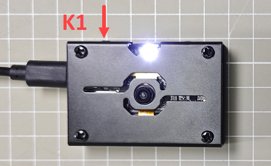
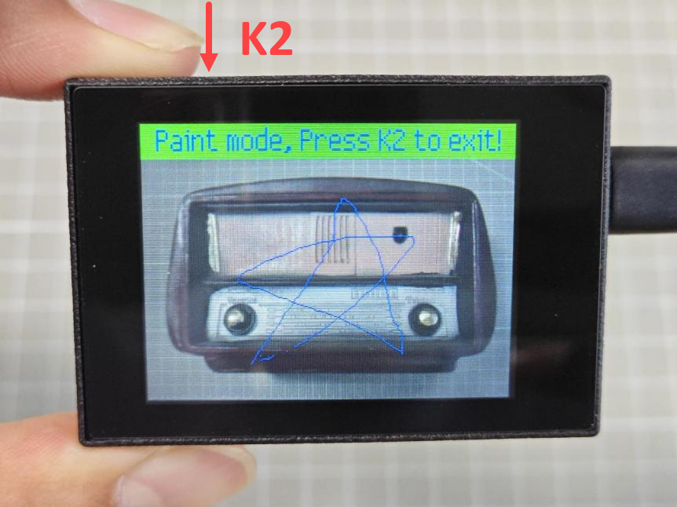

# 2. Light Up K210

The following steps will illuminate the visual module screen and test the touch screen functionality using buttons. The operation steps are as follows:

## 2.1 Module Connection

Connect the K210 Vision Module to the PC end using a Type-C data cable, as shown in the figure below:

Because the K210 visual module comes preloaded with firmware, when powered on, the screen of the K210 will light up, displaying the real-time feed from the camera.

:::{Note}

If the screen does not light up properly after connecting the power supply, please proceed to [2.3 Troubleshooting for Screen Not Lighting Up]() for further investigation.

:::

## 2.2 Hardware Function Test

(1) Press the **'K1'** button. The fill light will illuminate. Press the **'K1'** button again, and the fill light will turn off.

(2) Press the **'K2'** button. The blue LED light on the visual module will illuminate, and the current image will be frozen. At this point, you can draw lines on the screen with your finger. Press the **'K2'** button again to clear the lines, turn off the blue LED light, and resume normal display of the image.

## 2.3 Troubleshooting for Screen Not Lighting Up

If the screen does not light up after connection, please troubleshoot the following:

(1) Check if the USB cable is normal and securely plugged in.

(2) Verify that the K210 module requires a stable 5V power supply.

(3) If there are other .py programs downloaded onto the SD card, they will take priority in execution.

(4) The K210 module comes preloaded with firmware. If you has erased the firmware, please refer to [3. Getting Ready->3.6 Learn Factory Firmware Burning]() for re-flashing instructions.
