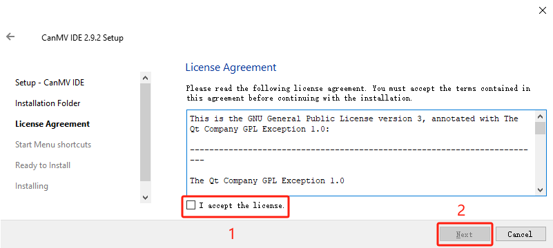
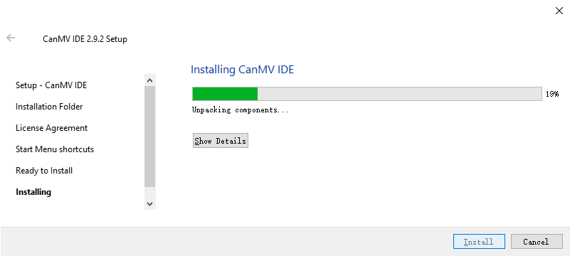
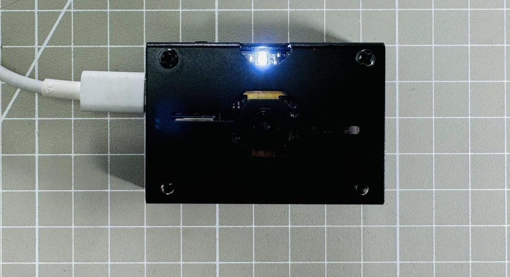

# 3. Getting Ready

## 3.1 Install CanMV IDE

### 3.1.1 Serial driver installation

(1) Connect K210 to the computer using a Type-C cable. Before installing the software, you can check if your computer already has the CH340 driver. If the computer can recognize the corresponding serial port, there is no need to install the serial port driver. You can check the ports by connecting the module to the computer and opening the **"Device Manager"**, as shown in the figure below:

(2) If the driver is not available, you can find the [Serial Driver Installation Package](Appendix.md) in the same directory as this section.

(3) The installation method is as follows: double-click to open the installation package, click **"Install"** and wait for the prompt indicating **"successful installation"**.

### 3.1.2 CanMV IDE Installation

CanMV is developed based on the OpenMV project, so CanMV IDE is essentially similar to the OpenMV IDE. The main modifications include changes in connection methods, communication protocols, and other related components. The IDE is developed using Qt Creator.

The installation process is as follows:

(1) Double-click to open the [canmv-ide-windows-v2.9.2.exe](Appendix.md) file located in the same directory as this document.

(2) Click **"Next (N)"**.

(3) Click **"Browse..."** to choose the installation path, then click **"Next (N)"**.

(4) Check the **"I accept the agreement"** option, then click **"Next (N)"**.

(5) Click **"Next (N)"**.

(6) Click **"Install"**.

(7) Wait for the installation to complete.

(8) Check **"Launch CanMV IDE"** and click **"Finish (F)"**.

(9) At this point, the installation of CanMV IDE software is complete. The software will automatically open after installation.

## 3.2 MicroPython Introduction

### 3.2.1 MicroPython Introduction

MicroPython is a streamlined and efficient implementation of the Python 3 programming language. It includes a small portion of the Python standard library and is optimized to run on microcontrollers and in constrained environments. It provides a low-level Python operating system for controlling various electronic projects.

MicroPython is rich in advanced features, such as interactive prompts, arbitrary precision integers, closures, list comprehensions, generators, and exception handling. Despite these advanced features, it is compact enough to run in just 256KB of code space and 16KB of RAM.

The goal of MicroPython is to be as compatible as possible with regular Python, allowing you to easily transition code from desktop to microcontrollers or embedded systems. This means you can use the Python language on small embedded devices.

* **Reference:**

(1) MicroPython offical website: [MicroPython - Python for microcontrollers](https://micropython.org/)

(2) MicroPython help documentation: [mPython Help Documentation](https://mpython.readthedocs.io/zh/master/index.html)

### 3.2.2 Principle of running MicroPython on K210 vision module

The firmware of the K210 Vision Module has already set up the MicroPython runtime environment. You can communicate directly using the Type-C interface and run MicroPython. The operational principle is illustrated in the following diagram:

CanMV IDE on the PC communicates with the K210 Vision Module through a serial port, transmitting the code from the editor to the module. The K210 Vision Module parses the content based on commands, invokes the MicroPython framework to execute the content, and eventually sends back runtime information and results through the serial port to the PC.

## 3.3 CanMV IDE Interface Introduction

This section provides a brief overview of the CanMV IDE interface.

### 3.3.1 CanMV IDE Interface

(1) The CanMV IDE interface (when not connected to the K210 Vision Module) is as follows:

① Menu Bar: Includes options for file operations, K210 flashing tools and visual-related tools;

② Quick Button: Provides convenient shortcuts for some commonly used development functions;

③ User Code Editing Area: Area for users to develop MicroPython programs;

④ Device Connection: The upper button is for connecting to the K210 Vision Module device, and the lower ones are for program execution and termination;

⑤ Debug Information Area: Displays debug information printed to the serial port and includes a search function;

⑥ Image Parameter Area: The upper part is the image preview area, and the lower part includes color space parameters;

⑦ Firmware Information: Displays the connected serial port number and other firmware information.

(2) The CanMV IDE interface (when connected to the K210 Vision Module) is as follows:

When connected to the K210 Vision Module, the device connection area in the bottom left corner changes to the above status.

(3) The CanMV IDE interface (when running a program after connection) is as follows:

When running a program, the device connection area in the bottom left corner changes to the above status. Press  to stop online execution.

## 3.4 CanMV IDE Basic Usage

In this section, you will learn how to import, run routines, and download them to the K210 module and SD card.

### 3.4.1 Connect K210 Vision Module

(1) Connect the PC and the K210 vision module using a Type-C data cable, as shown in the following picture:

(2) Double-click  to launch the CanMV IDE software.

(3) Click the connect icon in the lower-left corner of the device connection area to establish a connection, or use the shortcut **"Ctrl+E"**.

(4) After selecting the correct port for the K210 module, check **"Advanced Settings"** and choose **"Mode-3"** for the initial connection. Click **"OK"**.

:::{Note}
If there are multiple ports on the PC, ensure to select the correct port number for the K210 module. Otherwise, you may encounter connection issues or face difficulties in downloading programs.
:::

(5) After a successful connection, the connection icon will change to the one shown in the following picture.

### 3.4.2 Routine Test

Next, we will conduct the first test through CanMV IDE to learn importing, running online, and program downloading.

* **How to import a Routine**

(1) Through the menu bar, select **"File" -> "Open File"** to import.

(2) Open the CanMV IDE window and directly drag the program onto the interface.

After importing, the interface will look as follows:

* **Online Program Execution**

After importing the program, you can directly run it online without downloading. Click the **"Run"** button in the lower-left corner of the interface to observe the program's running effect. During execution, you will see the fill light starting to light up and blink.

To stop the program's execution, click the **"Stop"** button.

* **Program Download**

(1) Download the program into the K210 module, and it will automatically run after the module is powered up again.

:::{Note}
If an SD card is inserted into the K210 module, the program will be prioritized to be saved in the main.py file on the SD card.
:::

(2) While maintaining the connection, click on the menu bar, select **"Tools -> Save the Currently Open Script (main.py) to CanMV Cam"**.

(3) After clicking, a prompt as shown in the following picture will appear. Click **"Yes"** and wait for the completion prompt to appear.

(4) Once completed, disconnect from CanMV IDE, and the program will run automatically. The running effect will be the same as described in the previous section [3.4.2 Routine Test -> Online Program Execution](#anchor_3_4_2_2).

## 3.5 Call Custom Library File

### 3.5.1 Custom Library File Description

A Python custom library refers to Python functions or class modules that developers write according to their needs, designed to solve specific problems or accomplish particular tasks.

In this section, we will learn how to import and call custom library files in CanMV IDE.

### 3.5.2 Import the Library File

We will use the example of importing the **"LibraryDef.py"** library. There are two ways to import a custom library:

(1) Using a card reader, import the custom library file into the root directory of the TF card, and then call it after inserting the TF card.

(2) Importing through CanMV IDE. The specific steps can be found in the following text:

① After opening CanMV IDE, import the library file, connect the K210 module, and click **"Save File to CanMV Cam"**.

② In the popup window, fill in the file name and select the path in the respective fields. The library file **"LibraryDef.py"** can be found in the same directory as this document. After completing the information, click **"OK"**. 

:::{Note}

The file name must include the .py extension; otherwise, it won't take effect.

:::

### 3.5.3 Call the Library File

Import the **"use_def_test"** program test file. The program file can be found in the same directory as this document.

Then, after connecting the vision module, click , and if you see the printed information in the **"Serial Terminal"** as shown in the picture below, it means the import was successful.

## 3.6 Learn Factory Firmware Burning

Before leaving the factory, the K210 vision module has already been programmed with the factory firmware. If you encounter unexpected firmware damage during subsequent use or wish to upgrade to a newer version of the firmware, you can refer to the following tutorial.

The K210 vision module features the K210 microcontroller. Therefore, the operations on it are equivalent to reprogramming the MicroPython firmware onto the K210 MCU.

### 3.6.1 Burn Through Kflash GUI

(1) In the [kflash_gui_v1.6.5_2_windows.7z](Appendix.md) burning tool compression package in this section's directory, extract it and find the [Kflash_gui.exe](Appendix.md) software, then open it.

(2) Choose the corresponding options as shown in the following picture. The firmware is located in the same directory as this course (Hiwonder_K210_canmv_V1_1.bin). After selecting, click **"Download"** to start downloading the firmware.

(3) Wait for the successful completion of the downloading process.

### 3.6.2 Burning Effect

When the K210 is powered on, you should see the vision module displaying the current captured image.

(1) Press the **K1** button to toggle the on/off state of the fill light.

(2) Press the **K2** button to toggle the on/off state of the blue LED light.

(3) When the blue LED light is on, the current image will freeze, and the message **"Paint mode, Press K2 to exit"** will be displayed on the screen. At this point, you can draw lines freely on the touchscreen. Press the **K2** button again to clear the screen, and the real-time image display will resume with the blue LED light turned off.

## 3.7 MicroPython API Interface Specification

### 3.7.1 Peripheral Interface

The peripherals of the WonderMV Vision Module can be accessed through the HiWonder library. The following are the interface specifications for the HiWonder library.

* **Button**

<table class="docutils-nobg" border="1" style="max-width:700px;width:100%">
  <col width="34%">
  <col width="66%">
  <tr>
    <th colspan="4">hiwonder . hw_key()</th>
  </tr>
  <tr>
    <td colspan="2">Function Description</td>
    <td colspan="2">Returns a button object.</td>
  </tr>
  <tr>
    <td colspan="2">Parameter List</td>
    <td colspan="2">key_num：(1 for SW1 button, 2 for SW2 button)</td>
  </tr>
  <tr>
    <td colspan="2">Return Value</td>
    <td colspan="2">1 for pressed, 0 for released</td>
  </tr>
  <tr>
    <td colspan="2">Example</td>
    <td colspan="2">hw_key() . key_scan( key_num )</td>
  </tr>
  <tr>
    <td colspan="2">Note</td>
    <td colspan="2">/</td>
  </tr>
</table>

* **Fill Light**

<table class="docutils-nobg" border="1" style="width:100%">
  <tr>
    <th colspan="4">hiwonder . fill_light()</th>
  </tr>
  <tr>
    <td colspan="2">Function Description</td>
    <td colspan="2">Returns a fill light control object.</td>
  </tr>
  <tr>
    <td colspan="2">Parameter List</td>
    <td colspan="2">key_num：(1 for SW1 button, 2 for SW2 button)</td>
  </tr>
  <tr>
    <td colspan="2">Return Value</td>
    <td colspan="2">onoff：1 for on, 0 for off</td>
  </tr>
  <tr>
    <td colspan="2">Example</td>
    <td colspan="2"><strong>fill_light() . fill_onoff( onoff ))</strong></td>
  </tr>
  <tr>
    <td colspan="2">Note</td>
    <td colspan="2">/</td>
  </tr>
</table>

* **LED Light**

<table class="docutils-nobg" border="1" style="width:100%">
  <tr>
    <th colspan="4">hiwonder . hw_led()</th>
  </tr>
  <tr>
    <td colspan="2">Function Description</td>
    <td colspan="2">Returns an LED light control object to control the on/off state of the LED.</td>
  </tr>
  <tr>
    <td colspan="2">Parameter List</td>
    <td colspan="2">onoff：1 for on, 0 for off</td>
  </tr>
  <tr>
    <td colspan="2">Return Value</td>
    <td colspan="2">/</td>
  </tr>
  <tr>
    <td colspan="2">Example</td>
    <td colspan="2"><strong>led_onoff( onoff )</strong></td>
  </tr>
  <tr>
    <td colspan="2">Note</td>
    <td colspan="2">/</td>
  </tr>
</table>

* **IIC Interface**

<table class="docutils-nobg" border="1" style="width:100%">
  <tr>
    <th colspan="4">hiwonder . hw_i2c()</th>
  </tr>
  <tr>
    <td colspan="2">Function Description</td>
    <td colspan="2">Scan the IIC bus for slave devices and return an IIC peripheral control object.</td>
  </tr>
  <tr>
    <td colspan="2">Parameter List</td>
    <td colspan="2">onoff：1 for on, 0 for off</td>
  </tr>
  <tr>
    <td colspan="2">Return Value</td>
    <td colspan="2">A list object, containing all the slave addresses detected during the IIC bus scan.</td>
  </tr>
  <tr>
    <td colspan="2">Example</td>
    <td colspan="2"><strong>hw_i2c . scan()</strong></td>
  </tr>
  <tr>
    <td colspan="2">Note</td>
    <td colspan="2">Note: The LCD touch and the external IIC interface share the same IIC bus. Even if there is no IIC device connected, you may still detect one IIC slave address, which corresponds to the touch screen. Ensure to select the correct IIC slave address when sending data.</td>
  </tr>
</table>

<table class="docutils-nobg" border="1" style="width:100%">
  <tr>
    <th colspan="4">hw_i2c . readfrom_into( addr , buf , stop=True )</th>
  </tr>
  <tr>
    <td colspan="2">Function Description</td>
    <td colspan="2">Read data and place it into the 'buf' variable.</td>
  </tr>
  <tr>
    <td colspan="2">Parameter List</td>
    <td colspan="2"><strong>addr:</strong> Slave address. <strong>buf:</strong> bytearray type, with defined length to store the read data. <strong>stop:</strong> Whether to generate a stop signal. Reserved; currently, only the default value 'True' can be used.</td>
  </tr>
  <tr>
    <td colspan="2">Return Value</td>
    <td colspan="2">A list object containing all the slave addresses detected during the scan.</td>
  </tr>
  <tr>
    <td colspan="2">Example</td>
    <td colspan="2">/</td>
  </tr>
  <tr>
    <td colspan="2">Note</td>
    <td colspan="2">/</td>
  </tr>
</table>

<table class="docutils-nobg" border="1" style="width:100%">
  <tr>
    <th colspan="4">hw_i2c . readfrom(addr, len, stop=True)</th>
  </tr>
  <tr>
    <td colspan="2">Function Description</td>
    <td colspan="2">Read data and place it into the 'buf' variable.</td>
  </tr>
  <tr>
    <td colspan="2">Parameter List</td>
    <td colspan="2"><strong>addr:</strong> Slave address <strong>len:</strong> Type, defined length to store the read data. <strong>stop:</strong> Whether to generate a stop signal. Reserved; currently, only the default value 'True' can be used.</td>
  </tr>
  <tr>
    <td colspan="2">Return Value</td>
    <td colspan="2">The read data, in bytes type.</td>
  </tr>
  <tr>
    <td colspan="2">Example</td>
    <td colspan="2">/</td>
  </tr>
  <tr>
    <td colspan="2">Note</td>
    <td colspan="2">/</td>
  </tr>
</table>

<table class="docutils-nobg" border="1" style="width:100%">
  <tr>
    <th colspan="4">hw_i2c . readfrom_mem( addr , memaddr , nbytes , mem_size=8 )</th>
  </tr>
  <tr>
    <td colspan="2">Function Description</td>
    <td colspan="2">Read data and place it into the 'buf' variable.</td>
  </tr>
  <tr>
    <td colspan="2">Parameter List</td>
    <td colspan="2"><strong>addr:</strong> Slave address. <strong>memaddr:</strong> Slave register address. <strong>nbytes:</strong> Length to read. <strong>mem_size:</strong> Register width, default is 8 bits.</td>
  </tr>
  <tr>
    <td colspan="2">Return Value</td>
    <td colspan="2">Address value</td>
  </tr>
  <tr>
    <td colspan="2">Example</td>
    <td colspan="2">/</td>
  </tr>
  <tr>
    <td colspan="2">Note</td>
    <td colspan="2">/</td>
  </tr>
</table>

<table class="docutils-nobg" border="1" style="width:100%">
  <tr>
    <th colspan="4">hw_i2c . readfrom_mem_into(addr, memaddr, buf, mem_size=8)</th>
  </tr>
  <tr>
    <td colspan="2">Function Description</td>
    <td colspan="2">Read the value of the slave register into the specified variable.</td>
  </tr>
  <tr>
    <td colspan="2">Parameter List</td>
    <td colspan="2"><strong>addr:</strong> Slave address. <strong>memaddr:</strong> Slave register address. <strong>buf:</strong> bytearray type, with defined length to store the read data. <strong>mem_size:</strong> Register width, default is 8 bits.</td>
  </tr>
  <tr>
    <td colspan="2">Return Value</td>
    <td colspan="2">Returns the value of the slave register.</td>
  </tr>
  <tr>
    <td colspan="2">Example</td>
    <td colspan="2">/</td>
  </tr>
  <tr>
    <td colspan="2">Note</td>
    <td colspan="2">/</td>
  </tr>
</table>

<table class="docutils-nobg" border="1" style="width:100%">
  <tr>
    <th colspan="4">hw_i2c . writeto(addr, buf, stop=True)</th>
  </tr>
  <tr>
    <td colspan="2">Function Description</td>
    <td colspan="2">Write data to the target address.</td>
  </tr>
  <tr>
    <td colspan="2">Parameter List</td>
    <td colspan="2"><strong>addr:</strong> Slave address. <strong>buf:</strong> Data to be sent. <strong>stop:</strong> Whether to generate a stop signal. Reserved; currently, only the default value 'True' can be used.</td>
  </tr>
  <tr>
    <td colspan="2">Return Value</td>
    <td colspan="2">Number of bytes successfully sent.</td>
  </tr>
  <tr>
    <td colspan="2">Example</td>
    <td colspan="2">/</td>
  </tr>
  <tr>
    <td colspan="2">Note</td>
    <td colspan="2">/</td>
  </tr>
</table>

<table class="docutils-nobg" border="1" style="width:100%">
  <tr>
    <th colspan="4">hw_i2c . writeto_mem(addr, memaddr, buf, mem_size=8)</th>
  </tr>
  <tr>
    <td colspan="2">Function Description</td>
    <td colspan="2">Write data to the slave register.</td>
  </tr>
  <tr>
    <td colspan="2">Parameter List</td>
    <td colspan="2"><strong>addr:</strong> Slave address. <strong>memaddr:</strong> Slave register address. <strong>buf:</strong> Data to be written. <strong>mem_size:</strong> Register width, default is 8 bits.</td>
  </tr>
  <tr>
    <td colspan="2">Return Value</td>
    <td colspan="2">/</td>
  </tr>
  <tr>
    <td colspan="2">Example</td>
    <td colspan="2">/</td>
  </tr>
  <tr>
    <td colspan="2">Note</td>
    <td colspan="2">/</td>
  </tr>
</table>

* **UART Interface**

<table class="docutils-nobg" border="1" style="width:100%">
  <tr>
    <th colspan="4">hiwonder . hw_uart()</th>
  </tr>
  <tr>
    <td colspan="2">Function Description</td>
    <td colspan="2">Read UART information.</td>
  </tr>
  <tr>
    <td colspan="2">Parameter List</td>
    <td colspan="2"><strong>addr:</strong> Slave address. <strong>memaddr:</strong> Slave register address. <strong>buf:</strong> Data to be written. <strong>mem_size:</strong> Register width, default is 8 bits.</td>
  </tr>
  <tr>
    <td colspan="2">Return Value</td>
    <td colspan="2">Returns a UART object.</td>
  </tr>
  <tr>
    <td colspan="2">Example</td>
    <td colspan="2">/</td>
  </tr>
  <tr>
    <td colspan="2">Note</td>
    <td colspan="2">/</td>
  </tr>
</table>

<table class="docutils-nobg" border="1" style="width:100%">
  <tr>
    <th colspan="4">hw_uart() . send_bytearray( buf )</th>
  </tr>
  <tr>
    <td colspan="2">Function Description</td>
    <td colspan="2">Send buf variable data</td>
  </tr>
  <tr>
    <td colspan="2">Parameter List</td>
    <td colspan="2"><strong>buf:</strong> Data to be sent</td>
  </tr>
  <tr>
    <td colspan="2">Return Value</td>
    <td colspan="2">Bytearray type</td>
  </tr>
  <tr>
    <td colspan="2">Example</td>
    <td colspan="2">/</td>
  </tr>
  <tr>
    <td colspan="2">Note</td>
    <td colspan="2">/</td>
  </tr>
</table>

<table class="docutils-nobg" border="1" style="width:100%">
  <tr>
    <th colspan="4">hw_uart() . rec_bytes()</th>
  </tr>
  <tr>
    <td colspan="2">Function Description</td>
    <td colspan="2">Read from the serial port.</td>
  </tr>
  <tr>
    <td colspan="2">Parameter List</td>
    <td colspan="2">/</td>
  </tr>
  <tr>
    <td colspan="2">Return Value</td>
    <td colspan="2">Bytearray type</td>
  </tr>
  <tr>
    <td colspan="2">Example</td>
    <td colspan="2">/</td>
  </tr>
  <tr>
    <td colspan="2">Note</td>
    <td colspan="2">Note: Read up to 200 bytes at a time, which is generally sufficient for use.</td>
  </tr>
</table>

### 3.7.2 Standard Library

The standard library integrates functions libraries such as cmath, gc, math and uos.

For more standard library APIs, you can refer to the following link: [Python standard library and Micropython standard micro library -> CanMV Documentation](https://developer.canaan-creative.com/canmv/canmv/library/micropython/index.html)

* **cmath Module**

Provides some basic mathematical functions for complex numbers.

<table class="docutils-nobg" border="1" style="width:100%">
    <tr>
        <th colspan="2">cmath</th>
    </tr>
    <tr>
        <td>cmath.cos(z)</td>
        <td>Returns the cosine of z.</td>
    </tr>
    <tr>
        <td>cmath.exp(z)</td>
        <td>Returns the exponential of z.</td>
    </tr>
    <tr>
        <td>cmath.log(z)</td>
        <td>Returns the natural logarithm of z. Branch cut along the negative real axis.</td>
    </tr>
    <tr>
        <td>cmath.log10(z)</td>
        <td>Returns the base-10 logarithm of z. Branch cut along the negative real axis.</td>
    </tr>
    <tr>
        <td>cmath.phase(z)</td>
        <td>Returns the phase angle of the complex number "z" in the range (-pi, +pi).</td>
    </tr>
    <tr>
        <td>cmath.polar(z)</td>
        <td>Returns the polar form of z as a tuple.</td>
    </tr>
    <tr>
        <td>cmath.rect(r, phi)</td>
        <td>Returns a complex number with modulus r and phase phi of z.</td>
    </tr>
    <tr>
        <td>cmath.sin(z)</td>
        <td>Returns the sine of z.</td>
    </tr>
    <tr>
        <td>cmath.sqrt(z)</td>
        <td>Returns the square root of z.</td>
    </tr>
    <tr>
        <td>cmath.e</td>
        <td>Base of the natural logarithm.</td>
    </tr>
    <tr>
        <td>cmath.pi</td>
        <td>Ratio of the circumference of a circle to its diameter.</td>
    </tr>
</table>

* **gc Module**

Control the waste collection module.

<table class="docutils-nobg" border="1" style="width:100%">
    <tr>
        <th colspan="2">gc</th>
    </tr>
    <tr>
        <td>gc.enable()</td>
        <td>Enable automatic waste collection.</td>
    </tr>
    <tr>
        <td>gc.disable()</td>
        <td>Allocation of heap memory is still possible after disabling, and waste collection can still be manually initiated using gc.collect().</td>
    </tr>
    <tr>
        <td>gc.collect()</td>
        <td>Run waste collection.</td>
    </tr>
    <tr>
        <td>gc.mem_alloc()</td>
        <td>Return the number of bytes allocated in the heap RAM.</td>
    </tr>
    <tr>
        <td>gc.mem_free()</td>
        <td>Return the number of bytes available in the heap RAM; return -1 if the remaining waste amount is unknown.</td>
    </tr>
</table>

* **math Module**

Basic mathematical functions for handling floating-point numbers are provided.

<table class="docutils-nobg" border="1" style="width:100%">
    <tr>
        <th colspan="2">math</th>
    </tr>
    <tr>
        <td>math.acos(x)</td>
        <td>Return the arccosine value of x.</td>
    </tr>
    <tr>
        <td>math.acosh(x)</td>
        <td>Return the inverse hyperbolic cosine value of x.</td>
    </tr>
    <tr>
        <td>math.asin(x)</td>
        <td>Return the arcsine value of x.</td>
    </tr>
    <tr>
        <td>math.asinh(x)</td>
        <td>Return the inverse hyperbolic sine value of x.</td>
    </tr>
    <tr>
        <td>math.atan(x)</td>
        <td>Return the arctangent value of x.</td>
    </tr>
    <tr>
        <td>math.atan2(y, x)</td>
        <td>Return the principal value of the arctangent of y/x.</td>
    </tr>
    <tr>
        <td>math.atanh(x)</td>
        <td>Return the inverse hyperbolic tangent value of x.</td>
    </tr>
    <tr>
        <td>math.cos(x)</td>
        <td>Return the cosine value of x.</td>
    </tr>
    <tr>
        <td>math.cosh(x)</td>
        <td>Return the hyperbolic cosine value of x.</td>
    </tr>
    <tr>
        <td>math.degrees(x)</td>
        <td>Convert radians x to degrees.</td>
    </tr>
    <tr>
        <td>math.exp(x)</td>
        <td>Return the exponential value of x.</td>
    </tr>
    <tr>
        <td>math.fabs(x)</td>
        <td>Return the absolute value of x.</td>
    </tr>
    <tr>
        <td>math.fmod(x, y)</td>
        <td>Return the remainder of x/y.</td>
    </tr>
    <tr>
        <td>math.frexp(x)</td>
        <td>Decompose a floating-point number into a tuple of its mantissa and exponent, such that x == m * 2 ** e holds true. If x == 0, the function returns (0.0, 0). Otherwise, the relationship 0.5 <= abs(m) < 1 holds true.</td>
    </tr>
    <tr>
        <td>math.isnan(x)</td>
        <td>Return True if x is not a number.</td>
    </tr>
    <tr>
        <td>math.ldexp(x, exp)</td>
        <td>Return x multiplied by (2 ** exp).</td>
    </tr>
    <tr>
        <td>math.log(x)</td>
        <td>Return the natural logarithm of x.</td>
    </tr>
    <tr>
        <td>math.log10(x)</td>
        <td>Return the base-10 logarithm of x.</td>
    </tr>
    <tr>
        <td>math.log2(x)</td>
        <td>Return the base-2 logarithm of x.</td>
    </tr>
    <tr>
        <td>math.modf(x)</td>
        <td>Return a tuple of two floating-point numbers, the fraction and integer part of x. Both return values have the same sign as x.</td>
    </tr>
    <tr>
        <td>math.pow(x, y)</td>
        <td>Return x raised to the power of y.</td>
    </tr>
    <tr>
        <td>math.radians(x)</td>
        <td>Convert degrees x to radians.</td>
    </tr>
    <tr>
        <td>math.sin(x)</td>
        <td>Return the sine value of x.</td>
    </tr>
    <tr>
        <td>math.sinh(x)</td>
        <td>Return the hyperbolic sine value of x.</td>
    </tr>
    <tr>
        <td>math.sqrt(x)</td>
        <td>Return the square root of x.</td>
    </tr>
    <tr>
        <td>math.tan(x)</td>
        <td>Return the tangent value of x.</td>
    </tr>
    <tr>
        <td>math.tanh(x)</td>
        <td>Return the hyperbolic tangent value of x.</td>
    </tr>
    <tr>
        <td>math.trunc(x)</td>
        <td>Return an integer, rounding "x" towards zero.</td>
    </tr>
</table>

* **uos Module**

The `uos` module includes functions for file system access and mounting, terminal redirection and copying, as well as functions like `uname` and `urandom`.
Associated function：

<table class="docutils-nobg" border="1" style="width:100%">
    <tr>
        <th colspan="2">uos</th>
    </tr>
    <tr>
        <td>uos.urandom(n)</td>
        <td>Return a bytes object containing n random bytes. Whenever possible, it is generated by the hardware random number generator.</td>
    </tr>
    <tr>
        <td>uos.chdir(path)</td>
        <td>Change the current directory.</td>
    </tr>
    <tr>
        <td>uos.getcwd()</td>
        <td>Get the current directory.</td>
    </tr>
    <tr>
        <td>uos.listdir([dir])</td>
        <td>List the current directory if no parameters are provided. Otherwise, list the given directory.</td>
    </tr>
    <tr>
        <td>uos.mkdir(path)</td>
        <td>Create a new directory.</td>
    </tr>
    <tr>
        <td>uos.rmdir(path)</td>
        <td>Delete a directory.</td>
    </tr>
    <tr>
        <td>uos.remove(path)</td>
        <td>Delete a file.</td>
    </tr>
    <tr>
        <td>uos.rename(old_path，new_path)</td>
        <td>Rename a file.</td>
    </tr>
    <tr>
        <td>uos.stat(path)</td>
        <td>Get the status of a file or directory.</td>
    </tr>
</table>

### 3.7.3 Maix Module

The Maix module integrates libraries such as FPIOA, GPIO, KPU and freq.

For more Maix module APIs, please refer to the link: [maix.FPIOA -> CanMV Documentation](https://developer.canaan-creative.com/canmv/canmv/library/canmv/maix/maix.FPIOA.html)

* **FPIOA(Field Programmable IO Array)**

<table class="docutils-nobg" border="1" style="width:100%">
  <tr>
    <th colspan="4">FPIOA()</th>
  </tr>
  <tr>
    <td colspan="2">Function Description</td>
    <td colspan="2">Return an FPIOA object.</td>
  </tr>
  <tr>
    <td colspan="2">Parameter List</td>
    <td colspan="2">/</td>
  </tr>
  <tr>
    <td colspan="2">Return Value</td>
    <td colspan="2">FPIOA object</td>
  </tr>
  <tr>
    <td colspan="2">Example</td>
    <td colspan="2">/</td>
  </tr>
  <tr>
    <td colspan="2">Note</td>
    <td colspan="2">/</td>
  </tr>
</table>

<table class="docutils-nobg" border="1">
  <tr>
    <th colspan="4">FPIOA() . set_function(pin, func)</th>
  </tr>
  <tr>
    <td colspan="2">Function Description</td>
    <td colspan="2">Set the peripheral function corresponding to the pin(pin mapping)</td>
  </tr>
  <tr>
    <td colspan="2">Parameter List</td>
    <td colspan="2">
      <strong>pin:</strong> Pin number, ranging from 0 to 47. Please refer to the circuit diagram for specific pin connections. 
      <strong>func:</strong> Peripheral function, pass an integer value. You can check the peripheral function table by using fm.fpioa.help() or refer to the table below.
    </td>
  </tr>
  <tr>
    <td colspan="2">Return Value</td>
    <td colspan="2">FPIOA object</td>
  </tr>
  <tr>
    <td colspan="2">Example</td>
    <td colspan="2">/</td>
  </tr>
  <tr>
    <td colspan="2">Note</td>
    <td colspan="2">/</td>
  </tr>
</table>

<table class="docutils-nobg" border="1" style="width:100%">
  <tr>
    <th colspan="4">FPIOA() . get_Pin_num(func)</th>
  </tr>
  <tr>
    <td colspan="2">Function Description</td>
    <td colspan="2">Get which pin a peripheral is mapped to.</td>
  </tr>
  <tr>
    <td colspan="2">Parameter List</td>
    <td colspan="2">
      <strong>func:</strong> Peripheral function, pass an integer value. You can check the peripheral function table by using fm.fpioa.help() or by referring to the table below.
    </td>
  </tr>
  <tr>
    <td colspan="2">Return Value</td>
    <td colspan="2">Function List</td>
  </tr>
  <tr>
    <td colspan="2">Example</td>
    <td colspan="2">/</td>
  </tr>
  <tr>
    <td colspan="2">Note</td>
    <td colspan="2">/</td>
  </tr>
</table>

Partial parameters of the peripheral function table are as follows:

<table class="docutils-nobg" border="1">
<thead>
<tr>
<th style="text-align: left;">Peripheral Fucntion（func）</th>
<th style="text-align: left;">Brief Description</th>
</tr>
</thead>
<tbody>
<tr>
<td style="text-align: left;">......</td>
<td style="text-align: left;">......</td>
</tr>
<tr>
<td style="text-align: left;">GPIOHS0</td>
<td style="text-align: left;">GPIO High speed 0</td>
</tr>
<tr>
<td style="text-align: left;">GPIOHS1</td>
<td style="text-align: left;">GPIO High speed 1</td>
</tr>
<tr>
<td style="text-align: left;">GPIOHS2</td>
<td style="text-align: left;">GPIO High speed 2</td>
</tr>
<tr>
<td style="text-align: left;">GPIOHS3</td>
<td style="text-align: left;">GPIO High speed 3</td>
</tr>
<tr>
<td style="text-align: left;">GPIOHS4</td>
<td style="text-align: left;">GPIO High speed 4</td>
</tr>
<tr>
<td style="text-align: left;">GPIOHS5</td>
<td style="text-align: left;">GPIO High speed 5</td>
</tr>
<tr>
<td style="text-align: left;">GPIOHS6</td>
<td style="text-align: left;">GPIO High speed 6</td>
</tr>
<tr>
<td style="text-align: left;">GPIOHS7</td>
<td style="text-align: left;">GPIO High speed 7</td>
</tr>
<tr>
<td style="text-align: left;">GPIOHS8</td>
<td style="text-align: left;">GPIO High speed 8</td>
</tr>
<tr>
<td style="text-align: left;">GPIOHS9</td>
<td style="text-align: left;">GPIO High speed 9</td>
</tr>
<tr>
<td style="text-align: left;">GPIOHS10</td>
<td style="text-align: left;">GPIO High speed 10</td>
</tr>
<tr>
<td style="text-align: left;">GPIOHS11</td>
<td style="text-align: left;">GPIO High speed 11</td>
</tr>
<tr>
<td style="text-align: left;">GPIOHS12</td>
<td style="text-align: left;">GPIO High speed 12</td>
</tr>
<tr>
<td style="text-align: left;">GPIOHS13</td>
<td style="text-align: left;">GPIO High speed 13</td>
</tr>
<tr>
<td style="text-align: left;">GPIOHS14</td>
<td style="text-align: left;">GPIO High speed 14</td>
</tr>
<tr>
<td style="text-align: left;">GPIOHS15</td>
<td style="text-align: left;">GPIO High speed 15</td>
</tr>
<tr>
<td style="text-align: left;">GPIOHS16</td>
<td style="text-align: left;">GPIO High speed 16</td>
</tr>
<tr>
<td style="text-align: left;">GPIOHS17</td>
<td style="text-align: left;">GPIO High speed 17</td>
</tr>
<tr>
<td style="text-align: left;">GPIOHS18</td>
<td style="text-align: left;">GPIO High speed 18</td>
</tr>
<tr>
<td style="text-align: left;">GPIOHS19</td>
<td style="text-align: left;">GPIO High speed 19</td>
</tr>
<tr>
<td style="text-align: left;">GPIOHS20</td>
<td style="text-align: left;">GPIO High speed 20</td>
</tr>
<tr>
<td style="text-align: left;">GPIOHS21</td>
<td style="text-align: left;">GPIO High speed 21</td>
</tr>
<tr>
<td style="text-align: left;">GPIOHS22</td>
<td style="text-align: left;">GPIO High speed 22</td>
</tr>
<tr>
<td style="text-align: left;">GPIOHS23</td>
<td style="text-align: left;">GPIO High speed 23</td>
</tr>
<tr>
<td style="text-align: left;">GPIOHS24</td>
<td style="text-align: left;">GPIO High speed 24</td>
</tr>
<tr>
<td style="text-align: left;">GPIOHS25</td>
<td style="text-align: left;">GPIO High speed 25</td>
</tr>
<tr>
<td style="text-align: left;">GPIOHS26</td>
<td style="text-align: left;">GPIO High speed 26</td>
</tr>
<tr>
<td style="text-align: left;">GPIOHS27</td>
<td style="text-align: left;">GPIO High speed 27</td>
</tr>
<tr>
<td style="text-align: left;">GPIOHS28</td>
<td style="text-align: left;">GPIO High speed 28</td>
</tr>
<tr>
<td style="text-align: left;">GPIOHS29</td>
<td style="text-align: left;">GPIO High speed 29</td>
</tr>
<tr>
<td style="text-align: left;">GPIOHS30</td>
<td style="text-align: left;">GPIO High speed 30</td>
</tr>
<tr>
<td style="text-align: left;">GPIOHS31</td>
<td style="text-align: left;">GPIO High speed 31</td>
</tr>
<tr>
<td style="text-align: left;">GPIO0</td>
<td style="text-align: left;">GPIO pin 0</td>
</tr>
<tr>
<td style="text-align: left;">GPIO1</td>
<td style="text-align: left;">GPIO pin 1</td>
</tr>
<tr>
<td style="text-align: left;">GPIO2</td>
<td style="text-align: left;">GPIO pin 2</td>
</tr>
<tr>
<td style="text-align: left;">GPIO3</td>
<td style="text-align: left;">GPIO pin 3</td>
</tr>
<tr>
<td style="text-align: left;">GPIO4</td>
<td style="text-align: left;">GPIO pin 4</td>
</tr>
<tr>
<td style="text-align: left;">GPIO5</td>
<td style="text-align: left;">GPIO pin 5</td>
</tr>
<tr>
<td style="text-align: left;">GPIO6</td>
<td style="text-align: left;">GPIO pin 6</td>
</tr>
<tr>
<td style="text-align: left;">GPIO7</td>
<td style="text-align: left;">GPIO pin 7</td>
</tr>
<tr>
<td style="text-align: left;">UART1_RX</td>
<td style="text-align: left;">UART1 Receiver</td>
</tr>
<tr>
<td style="text-align: left;">UART1_TX</td>
<td style="text-align: left;">UART1 Transmitter</td>
</tr>
<tr>
<td style="text-align: left;">UART2_RX</td>
<td style="text-align: left;">UART2 Receiver</td>
</tr>
<tr>
<td style="text-align: left;">UART2_TX</td>
<td style="text-align: left;">UART2 Transmitter</td>
</tr>
<tr>
<td style="text-align: left;">UART3_RX</td>
<td style="text-align: left;">UART3 Receiver</td>
</tr>
<tr>
<td style="text-align: left;">UART3_TX</td>
<td style="text-align: left;">UART3 Transmitter</td>
</tr>
<tr>
<td style="text-align: left;">......</td>
<td style="text-align: left;">......</td>
</tr>
</tbody>
</table>

* **GPIO**

Bus expander, K210 has high-speed GPIO (GPIOHS) and general GPIO.

For details of this module's API interface, please refer to the following link: [maix.GPIO -> CanMV Documentation](https://developer.canaan-creative.com/canmv/canmv/library/canmv/maix/maix.GPIO.html)

<table class="docutils-nobg" border="1" style="width:100%">
  <tr>
    <th colspan="4">GPIO(ID, MODE, PULL, VALUE)</th>
  </tr>
  <tr>
    <td colspan="2">Function Description</td>
    <td colspan="2">Return a GPIO control object.</td>
  </tr>
  <tr>
    <td colspan="2">Parameter List</td>
    <td colspan="2">
      <strong>ID：</strong>GPIO pin used (be sure to use constants from GPIO to specify) 
      <strong>MODE：</strong>GPIO mode. 
      &nbsp;&nbsp;GPIO.IN input mode. 
      &nbsp;&nbsp;GPIO.OUT output mode. 
      <strong>PULL：</strong>GPIO pull-up/pull-down mode. 
      &nbsp;&nbsp;GPIO.PULL_UP pull-up. 
      &nbsp;&nbsp;GPIO.PULL_DOWN pull-down. 
      &nbsp;&nbsp;GPIO.PULL_NONE neither pull-up nor pull-down.
    </td>
  </tr>
  <tr>
    <td colspan="2">Return Value</td>
    <td colspan="2">GPIO control object.</td>
  </tr>
  <tr>
    <td colspan="2">Example</td>
    <td colspan="2">/</td>
  </tr>
  <tr>
    <td colspan="2">Note</td>
    <td colspan="2">/</td>
  </tr>
</table>

<table class="docutils-nobg" border="1" style="width:100%">
  <tr>
    <th colspan="4">GPIO.value([value])</th>
  </tr>
  <tr>
    <td colspan="2">Function Description</td>
    <td colspan="2">Modify or read the GPIO pin state.</td>
  </tr>
  <tr>
    <td colspan="2">Parameter List</td>
    <td colspan="2">
      <strong>[value]:</strong> Optional parameter, 1 for high level; 0 for low level; if this parameter is empty, it returns the current state of the GPIO pin.
    </td>
  </tr>
  <tr>
    <td colspan="2">Return Value</td>
    <td colspan="2">If the [value] parameter is empty, it returns the current state of the GPIO pin.</td>
  </tr>
  <tr>
    <td colspan="2">Example</td>
    <td colspan="2">/</td>
  </tr>
  <tr>
    <td colspan="2">Note</td>
    <td colspan="2">/</td>
  </tr>
</table>

<table class="docutils-nobg" border="1" style="width:100%">
  <tr>
    <th colspan="4">GPIO.irq(CALLBACK_FUNC, TRIGGER_CONDITION, GPIO.WAKEUP_NOT_SUPPORT, PRORITY)</th>
  </tr>
  <tr>
    <td colspan="2">Function Description</td>
    <td colspan="2">Configure an interrupt handler to be called when the trigger source of the pin is in an active state. If the pin mode is pin.in, the trigger source is the external value on the pin.</td>
  </tr>
  <tr>
    <td colspan="2">Parameter List</td>
    <td colspan="2">
      <strong>CALLBACK_FUNC:</strong> Interrupt callback function to be called when the interrupt is triggered. 
      <strong>TRIGGER_CONDITION:</strong> Interrupt trigger mode for the GPIO pin. 
      &nbsp;&nbsp;GPIO.IRQ_RISING: Rising edge trigger 
      &nbsp;&nbsp;GPIO.IRQ_FALLING: Falling edge trigger 
      &nbsp;&nbsp;GPIO.IRQ_BOTH: Both rising and falling edges trigger 
      <strong>GPIO.WAKEUP_NOT_SUPPORT:</strong> Set to interrupt mode, default to GPIO.WAKEUP_NOT_SUPPORT. 
      <strong>PRORITY:</strong> Interrupt priority.
    </td>
  </tr>
  <tr>
    <td colspan="2">Return Value</td>
    <td colspan="2">If the [value] parameter is empty, it returns the current state of the GPIO pin.</td>
  </tr>
  <tr>
    <td colspan="2">Example</td>
    <td colspan="2">/</td>
  </tr>
  <tr>
    <td colspan="2">Note</td>
    <td colspan="2">/</td>
  </tr>
</table>

<table class="docutils-nobg" border="1" style="width:100%">
  <tr>
    <th colspan="4">GPIO.disirq()</th>
  </tr>
  <tr>
    <td colspan="2">Function Description</td>
    <td colspan="2">Disable interrupts.</td>
  </tr>
  <tr>
    <td colspan="2">Parameter List</td>
    <td colspan="2">/</td>
  </tr>
  <tr>
    <td colspan="2">Return Value</td>
    <td colspan="2">/</td>
  </tr>
  <tr>
    <td colspan="2">Example</td>
    <td colspan="2">/</td>
  </tr>
  <tr>
    <td colspan="2">Note</td>
    <td colspan="2">/</td>
  </tr>
</table>

<table class="docutils-nobg" border="1" style="width:100%">
  <tr>
    <th colspan="4">GPIO.mode(MODE)</th>
  </tr>
  <tr>
    <td colspan="2">Function Description</td>
    <td colspan="2">Set GPIO input/output mode.</td>
  </tr>
  <tr>
    <td colspan="2">Parameter List</td>
    <td colspan="2">
      <strong>MODE:</strong> Mode selection. 
      &nbsp;&nbsp;GPIO.IN: Input mode 
      &nbsp;&nbsp;GPIO.PULL_UP: Pull-up input mode 
      &nbsp;&nbsp;GPIO.PULL_DOWN: Pull-down input mode 
      &nbsp;&nbsp;GPIO.OUT: Output mode
    </td>
  </tr>
  <tr>
    <td colspan="2">Return Value</td>
    <td colspan="2">/</td>
  </tr>
  <tr>
    <td colspan="2">Example</td>
    <td colspan="2">/</td>
  </tr>
  <tr>
    <td colspan="2">Note</td>
    <td colspan="2">/</td>
  </tr>
</table>

* **KPU Module**

KPU is a versatile neural network processor that can perform convolutional neural network calculations under low power consumption, providing real-time detection of the size, coordinates, and categories of detected objects, for tasks such as detecting and classifying faces or objects.

For details of this module's API interface, please refer to the link:

[maix.KPU -> CanMV Documentation](https://developer.canaan-creative.com/canmv/canmv/library/canmv/maix/maix.KPU.html)

<table class="docutils-nobg" border="1" style="width:100%">
  <tr>
    <th colspan="4">KPU.load(offset, file_path)</th>
  </tr>
  <tr>
    <td colspan="2">Function Description</td>
    <td colspan="2">Load a model from flash or the file system.</td>
  </tr>
  <tr>
    <td colspan="2">Parameter List</td>
    <td colspan="2">
      The parameters "offset" and "file_path" are mutually exclusive. Pass one of them directly as an argument, without any keywords. 
      <strong>offset:</strong> 
      Model's offset in flash, such as 0xd00000 indicating the model is burned starting from 13M, and 0x300000 indicating it's at 3M in flash. 
      <strong>file_path:</strong> 
      The file name of the model in the file system, such as "/sd/xxx.kmodel".
    </td>
  </tr>
  <tr>
    <td colspan="2">Return Value</td>
    <td colspan="2">If loaded correctly, it returns the KPU network object (kpu network). Otherwise, it raises an error.</td>
  </tr>
  <tr>
    <td colspan="2">Example</td>
    <td colspan="2">/</td>
  </tr>
  <tr>
    <td colspan="2">Note</td>
    <td colspan="2">/</td>
  </tr>
</table>

<table class="docutils-nobg" border="1" style="width:100%">
  <tr>
    <th colspan="4">KPU.load_flash(model_addr, is_dual_buf, batch_size, spi_speed)</th>
  </tr>
  <tr>
    <td colspan="2">Function Description</td>
    <td colspan="2">Load a model from flash or the file system.</td>
  </tr>
  <tr>
    <td colspan="2">Parameter List</td>
    <td colspan="2">
      <strong>model_addr:</strong> 
      The offset address of the preprocessed model burned into the flash memory. Note that a preprocessed model file description is required here. 
      <strong>is_dual_buf:</strong> 
      0 for single-buffer loading, which dynamically loads the model file with less RAM usage and slower speed. 1 for enabling dual-buffer loading, requiring more RAM and relatively faster execution speed. 
      <strong>batch_size:</strong> 
      When is_dual_buf is set to 1, batch_size needs to be configured, with a recommended value range of 0x4000 to 0x10000, which can determine the optimal value for the model. If is_dual_buf is 0, set batch_size to 0. 
      <strong>spi_speed:</strong> 
      When loading the model file using SPI flash, we temporarily set the flash to high-speed mode and set the required SPI clock frequency. This value should be <= 80000000 (actual frequency, set value may not equal actual frequency).
    </td>
  </tr>
  <tr>
    <td colspan="2">Return Value</td>
    <td colspan="2">If loaded correctly, it returns the KPU network object (kpu network). Otherwise, it raises an error.</td>
  </tr>
  <tr>
    <td colspan="2">Example</td>
    <td colspan="2">/</td>
  </tr>
  <tr>
    <td colspan="2">Note</td>
    <td colspan="2">/</td>
  </tr>
</table>

<table class="docutils-nobg" border="1" style="width:100%">
  <tr>
    <th colspan="4">KPU.init_yolo2(kpu_net, threshold, nms_value, anchor_num, anchor)</th>
  </tr>
  <tr>
    <td colspan="2">Function Description</td>
    <td colspan="2">This function initializes parameters for the YOLOv2 network model. It is only used when employing YOLOv2.</td>
  </tr>
  <tr>
    <td colspan="2">Parameter List</td>
    <td colspan="2">
      <strong>kpu_net:</strong> 
      The KPU network object, which is the model object loaded by KPU.load(). 
      <strong>Threshold:</strong> 
      Probability threshold. Only when the probability of an object exceeds this value will the result be output. Value range: [0, 1]. 
      <strong>nms_value:</strong> 
      Box IoU threshold. To prevent multiple boxes from being drawn around the same object, if the intersection over union (IoU) of two boxes drawn around the same object is less than this value, only the one with the higher probability will be retained. 
      <strong>anchor_num:</strong> 
      Number of anchor points. It is fixed to len(anchors)//2. 
      <strong>anchor:</strong> 
      Anchor parameters consistent with the model parameters. This parameter is fixed for the same model and determined during model training. It cannot be changed to other values.
    </td>
  </tr>
  <tr>
    <td colspan="2">Return Value</td>
    <td colspan="2">success：bool type, indicating whether the operation was successful.</td>
  </tr>
  <tr>
    <td colspan="2">Example</td>
    <td colspan="2">/</td>
  </tr>
  <tr>
    <td colspan="2">Note</td>
    <td colspan="2">/</td>
  </tr>
</table>

<table class="docutils-nobg" border="1" style="width:100%">
  <tr>
    <th colspan="4">KPU.deinit(kpu_net)</th>
  </tr>
  <tr>
    <td colspan="2">Function Description</td>
    <td colspan="2">Release the memory occupied by the model while keeping the variable intact. You can use del kpu_net_object to delete it.</td>
  </tr>
  <tr>
    <td colspan="2">Parameter List</td>
    <td colspan="2"><strong>kpu_net:</strong> KPU network object</td>
  </tr>
  <tr>
    <td colspan="2">Return Value</td>
    <td colspan="2"><strong>success：</strong>bool type, indicating whether the operation was successful.</td>
  </tr>
  <tr>
    <td colspan="2">Example</td>
    <td colspan="2">/</td>
  </tr>
  <tr>
    <td colspan="2">Note</td>
    <td colspan="2">/</td>
  </tr>
</table>

<table class="docutils-nobg" border="1" style="width:100%">
  <tr>
    <th colspan="4">KPU.run_with_output(img_obj)</th>
  </tr>
  <tr>
    <td colspan="2">Function Description</td>
    <td colspan="2">Run object detection model using KPU.</td>
  </tr>
  <tr>
    <td colspan="2">Parameter List</td>
    <td colspan="2">img_obj：Image object.</td>
  </tr>
  <tr>
    <td colspan="2">Return Value</td>
    <td colspan="2">/</td>
  </tr>
  <tr>
    <td colspan="2">Example</td>
    <td colspan="2">/</td>
  </tr>
  <tr>
    <td colspan="2">Note</td>
    <td colspan="2">/</td>
  </tr>
</table>

<table class="docutils-nobg" border="1" style="width:100%">
  <tr>
    <th colspan="4">KPU.regionlayer_yolo2()</th>
  </tr>
  <tr>
    <td colspan="2">Function Description</td>
    <td colspan="2">Obtain detection results.</td>
  </tr>
  <tr>
    <td colspan="2">Parameter List</td>
    <td colspan="2">
      The data includes the following six components: 
      x, y, w, h: Representing the top-left coordinates (x, y) of the bounding box, as well as its width (w) and height (h). 
      class: Class index. 
      prob: Probability value, ranging from 0 to 1.
    </td>
  </tr>
  <tr>
    <td colspan="2">Return Value</td>
    <td colspan="2">Returns a two-dimensional list, each sublist represents a recognized target object, and the target object information list package.</td>
  </tr>
  <tr>
    <td colspan="2">Example</td>
    <td colspan="2">/</td>
  </tr>
  <tr>
    <td colspan="2">Note</td>
    <td colspan="2">/</td>
  </tr>
</table>

### 3.7.4 image (Image Processing) Module

This module is ported from OpenMV and has the same functionality as OpenMV. It includes classes such as Image, Line and Circle. Please refer to the following link for API usage:

[image - Image Processing -> CanMV Documentation](https://developer.canaan-creative.com/canmv/canmv/library/canmv/image.html)

### 3.7.5 sensor（Camera）Module

The sensor module (specifically referring to the camera module) is used to control the camera module on the development board to perform imaging tasks. For details about the API interface, please refer to the link:

[sensor（Camera） -> CanMV Documentation](https://developer.canaan-creative.com/canmv/canmv/library/canmv/sensor.html)

<table class="docutils-nobg" border="1" style="width:100%">
  <tr>
    <th colspan="4">sensor.reset([, freq=24000000[, set_regs=True[, dual_buff=False]]])</th>
  </tr>
  <tr>
    <td colspan="2">Function Description</td>
    <td colspan="2">Reset and initialize a monocular camera.</td>
  </tr>
  <tr>
    <td colspan="2">Parameter List</td>
    <td colspan="2">
      <strong>freq:</strong> 
      Set the camera clock frequency. A higher frequency results in a higher frame rate, but it may degrade image quality. The default is 24MHz. If there are color spots in the camera (ov7740), you can reduce it, for example, to 20MHz. 
      <strong>set_regs:</strong> 
      Allows the program to write to camera registers. By default, it's set to True. If you need to customize the reset sequence, you can set it to False, and then use the sensor.__write_reg(addr, value) function to customize writing register sequences. 
      <strong>dual_buff:</strong> 
      Default is False. Allows the use of double buffering, which increases the frame rate but also increases memory usage (approximately 384KiB). 
      <strong>choice:</strong> 
      Specifies the type of camera to search for: ov type (1), gc type (2), mt type (3). If this parameter is not passed, it searches for all types of cameras.
    </td>
  </tr>
  <tr>
    <td colspan="2">Return Value</td>
    <td colspan="2">/</td>
  </tr>
  <tr>
    <td colspan="2">Example</td>
    <td colspan="2">/</td>
  </tr>
  <tr>
    <td colspan="2">Note</td>
    <td colspan="2">/</td>
  </tr>
</table>

<table class="docutils-nobg" border="1" style="width:100%">
  <tr>
    <th colspan="4">sensor.set_framesize(framesize[, set_regs=True])</th>
  </tr>
  <tr>
    <td colspan="2">Function Description</td>
    <td colspan="2">Used to set the frame size of the camera output. The development board's screen is configured with a resolution of 320x240 pixels. It is recommended to set it to QVGA format.</td>
  </tr>
  <tr>
    <td colspan="2">Parameter List</td>
    <td colspan="2">
      <strong>framesize:</strong> Frame size. 
      <strong>set_regs:</strong> Allows the program to write to camera registers. By default, it's set to True. If you need to customize the frame size setting sequence, you can set it to False, and then use the sensor.__write_reg(addr, value) function to customize writing register sequences.
    </td>
  </tr>
  <tr>
    <td colspan="2">Return Value</td>
    <td colspan="2"><strong>success：</strong>bool type，indicating whether the operation was successful.</td>
  </tr>
  <tr>
    <td colspan="2">Example</td>
    <td colspan="2">/</td>
  </tr>
  <tr>
    <td colspan="2">Note</td>
    <td colspan="2">/</td>
  </tr>
</table>

<table class="docutils-nobg" border="1" style="width:100%">
  <tr>
    <th colspan="4">sensor.run(enable)</th>
  </tr>
  <tr>
    <td colspan="2">Function Description</td>
    <td colspan="2">Image capture functionality control</td>
  </tr>
  <tr>
    <td colspan="2">Parameter List</td>
    <td colspan="2"><strong>enable:</strong> 1 to start capturing images; 0 to stop capturing images.</td>
  </tr>
  <tr>
    <td colspan="2">Return Value</td>
    <td colspan="2"><strong>success：</strong>bool type，indicating whether the operation was successful.</td>
  </tr>
  <tr>
    <td colspan="2">Example</td>
    <td colspan="2">/</td>
  </tr>
  <tr>
    <td colspan="2">Note</td>
    <td colspan="2">/</td>
  </tr>
</table>

<table class="docutils-nobg" border="1" style="width:100%">
  <tr>
    <th colspan="4">sensor.snapshot()</th>
  </tr>
  <tr>
    <td colspan="2">Function Description</td>
    <td colspan="2">Take a photo using the camera.</td>
  </tr>
  <tr>
    <td colspan="2">Parameter List</td>
    <td colspan="2">/</td>
  </tr>
  <tr>
    <td colspan="2">Return Value</td>
    <td colspan="2"><strong>img:</strong> The returned image object</td>
  </tr>
  <tr>
    <td colspan="2">Example</td>
    <td colspan="2">/</td>
  </tr>
  <tr>
    <td colspan="2">Note</td>
    <td colspan="2">/</td>
  </tr>
</table>

<table class="docutils-nobg" border="1" style="width:100%">
  <tr>
    <th colspan="4">sensor.shutdown(enable)</th>
  </tr>
  <tr>
    <td colspan="2">Function Description</td>
    <td colspan="2">Close camera.</td>
  </tr>
  <tr>
    <td colspan="2">Parameter List</td>
    <td colspan="2"><strong>enable:</strong> True means turning on the camera False means turning off the camera</td>
  </tr>
  <tr>
    <td colspan="2">Return Value</td>
    <td colspan="2">/</td>
  </tr>
  <tr>
    <td colspan="2">Example</td>
    <td colspan="2">/</td>
  </tr>
  <tr>
    <td colspan="2">Note</td>
    <td colspan="2">/</td>
  </tr>
</table>

<table class="docutils-nobg" border="1" style="width:100%">
  <tr>
    <th colspan="4">sensor.skip_frames(n, [, time])</th>
  </tr>
  <tr>
    <td colspan="2">Function Description</td>
    <td colspan="2">Skip a specified number of frames or skip images within a specified time interval to allow the camera image to stabilize after changing camera settings.</td>
  </tr>
  <tr>
    <td colspan="2">Parameter List</td>
    <td colspan="2">
      <strong>n:</strong> Skip n frames of images. 
      <strong>time:</strong> Skip images within the specified time interval, in milliseconds. If neither n nor time is specified, this method skips n frames but returns after waiting for time milliseconds.
    </td>
  </tr>
  <tr>
    <td colspan="2">Return Value</td>
    <td colspan="2">/</td>
  </tr>
  <tr>
    <td colspan="2">Example</td>
    <td colspan="2">/</td>
  </tr>
  <tr>
    <td colspan="2">Note</td>
    <td colspan="2">/</td>
  </tr>
</table>

### 3.7.6 LCD Module

Used for LCD screen display control. For details about the API interface of this module, please refer to the following link:

[lcd（Screen Display） -> CanMV Documentation](https://developer.canaan-creative.com/canmv/canmv/library/canmv/lcd.html)

<table class="docutils-nobg" border="1" style="width:100%">
  <tr>
    <th colspan="4">lcd.init(type=1, freq=15000000, color=lcd.BLACK, invert = 0, lcd_type = 0)</th>
  </tr>
  <tr>
    <td colspan="2">Function Description</td>
    <td colspan="2">Initialize the LCD screen display.</td>
  </tr>
  <tr>
    <td colspan="2">Parameter List</td>
    <td colspan="2">
      <strong>type:</strong> Device type (reserved for future use), can be left as default by the user. 
      <strong>freq:</strong> Frequency of the LCD (referring to the communication speed of the SPI). 
      <strong>color:</strong> Initial color for the LCD initialization. It can be a 16-bit RGB565 color value, such as 0xFFFF, or an RGB888 tuple, such as (236, 36, 36). Default is lcd.BLACK. 
      <strong>invert:</strong> Invert the display of the LCD. 
      <strong>lcd_type:</strong> LCD type, can be left as default by the user.
    </td>
  </tr>
  <tr>
    <td colspan="2">Return Value</td>
    <td colspan="2">/</td>
  </tr>
  <tr>
    <td colspan="2">Example</td>
    <td colspan="2">/</td>
  </tr>
  <tr>
    <td colspan="2">Note</td>
    <td colspan="2">/</td>
  </tr>
</table>

<table class="docutils-nobg" border="1" style="width:100%">
  <tr>
    <th colspan="4">lcd.display(image, roi=Auto, oft=(x, y))</th>
  </tr>
  <tr>
    <td colspan="2">Function Description</td>
    <td colspan="2">Display an image (GRAYSCALE or RGB565) on the LCD screen.</td>
  </tr>
  <tr>
    <td colspan="2">Parameter List</td>
    <td colspan="2">
      <strong>Image:</strong> Image object. 
      <strong>roi:</strong> A tuple representing the region of interest (ROI) rectangle ((x, y, w, h)). If not specified, it defaults to the image rectangle. 
      <strong>oft:</strong> Set the offset coordinates. If these coordinates are set, the surrounding area will not be automatically filled.
    </td>
  </tr>
  <tr>
    <td colspan="2">Return Value</td>
    <td colspan="2">/</td>
  </tr>
  <tr>
    <td colspan="2">Example</td>
    <td colspan="2">/</td>
  </tr>
  <tr>
    <td colspan="2">Note</td>
    <td colspan="2">/</td>
  </tr>
</table>

<table class="docutils-nobg" border="1" style="width:100%">
  <tr>
    <th colspan="4">lcd.clear(color)</th>
  </tr>
  <tr>
    <td colspan="2">Function Description</td>
    <td colspan="2">Clear the LCD screen to black or a specified color.</td>
  </tr>
  <tr>
    <td colspan="2">Parameter List</td>
    <td colspan="2">
      <strong>color:</strong> The color used for initializing the LCD. It can be a 16-bit RGB565 color value, such as 0xFFFF, or an RGB888 tuple, such as (236, 36, 36).
    </td>
  </tr>
  <tr>
    <td colspan="2">Return Value</td>
    <td colspan="2">/</td>
  </tr>
  <tr>
    <td colspan="2">Example</td>
    <td colspan="2">/</td>
  </tr>
  <tr>
    <td colspan="2">Note</td>
    <td colspan="2">/</td>
  </tr>
</table>

<table class="docutils-nobg" border="1" style="width:100%">
  <tr>
    <th colspan="4">lcd.rotation(dir)</th>
  </tr>
  <tr>
    <td colspan="2">Function Description</td>
    <td colspan="2">Set the orientation of the LCD screen.</td>
  </tr>
  <tr>
    <td colspan="2">Parameter List</td>
    <td colspan="2">
      <strong>dir:</strong> Value range [0, 3], representing the clockwise rotation direction from 0 to 3.
    </td>
  </tr>
  <tr>
    <td colspan="2">Return Value</td>
    <td colspan="2">The current direction, with values ranging from 0 to 3.</td>
  </tr>
  <tr>
    <td colspan="2">Example</td>
    <td colspan="2">/</td>
  </tr>
  <tr>
    <td colspan="2">Note</td>
    <td colspan="2">/</td>
  </tr>
</table>

<table class="docutils-nobg" border="1" style="width:100%">
  <tr>
    <th colspan="4">lcd.mirror(invert)</th>
  </tr>
  <tr>
    <td colspan="2">Function Description</td>
    <td colspan="2">Set whether the LCD screen is displayed in mirror mode.</td>
  </tr>
  <tr>
    <td colspan="2">Parameter List</td>
    <td colspan="2">
      <strong>invert:</strong> Whether to display the LCD screen in mirror mode. Set to True or False.
    </td>
  </tr>
  <tr>
    <td colspan="2">Return Value</td>
    <td colspan="2">The current setting for mirror display. Returns True or False.</td>
  </tr>
  <tr>
    <td colspan="2">Example</td>
    <td colspan="2">/</td>
  </tr>
  <tr>
    <td colspan="2">Note</td>
    <td colspan="2">/</td>
  </tr>
</table>

<table class="docutils-nobg" border="1" style="width:100%">
  <tr>
    <th colspan="4">lcd.fill_rectangle(x, y, w, h, color)</th>
  </tr>
  <tr>
    <td colspan="2">Function Description</td>
    <td colspan="2">Fill the specified area of the LCD.</td>
  </tr>
  <tr>
    <td colspan="2">Parameter List</td>
    <td colspan="2">
      <strong>X:</strong> Starting coordinate x. 
      <strong>Y:</strong> Starting coordinate y. 
      <strong>w:</strong> Fill width. 
      <strong>h:</strong> Fill height. 
      <strong>color:</strong> Fill color, which can be a tuple, such as (255, 255, 255), or an RGB565 uint16 value, such as red 0x00F8.
    </td>
  </tr>
  <tr>
    <td colspan="2">Return Value</td>
    <td colspan="2">The current setting for mirror display. Returns True or False.</td>
  </tr>
  <tr>
    <td colspan="2">Example</td>
    <td colspan="2">/</td>
  </tr>
  <tr>
    <td colspan="2">Note</td>
    <td colspan="2">/</td>
  </tr>
</table>

### 3.7.7 touchscreen（Touch）Module

The touchscreen module contains basic operations for reading from the touchscreen. For details about the API interface of this module, please refer to the following link:

[CanMV API Manual -> CanMV Documentation](https://developer.canaan-creative.com/canmv/main/canmv/library/index.html#canmv)

<table class="docutils-nobg" border="1" style="width:100%">
  <tr>
    <th colspan="4">touchscreen . init(i2c=None, cal=None)</th>
  </tr>
  <tr>
    <td colspan="2">Function Description</td>
    <td colspan="2">Initialize the touchscreen.</td>
  </tr>
  <tr>
    <td colspan="2">Parameter List</td>
    <td colspan="2">
      <strong>i2c:</strong> Currently supports touchscreens with I2C communication. Pass an instance object of the I2C. This parameter may be renamed or removed in the future. 
      <strong>cal:</strong> Calibration data, represented as a tuple of 7 integers. This data can be obtained through the touchscreen.calibrate() function.
    </td>
  </tr>
  <tr>
    <td colspan="2">Return Value</td>
    <td colspan="2">/</td>
  </tr>
  <tr>
    <td colspan="2">Example</td>
    <td colspan="2">/</td>
  </tr>
  <tr>
    <td colspan="2">Note</td>
    <td colspan="2">/</td>
  </tr>
</table>

<table class="docutils-nobg" border="1" style="width:100%">
  <tr>
    <th colspan="4">touchscreen . read()</th>
  </tr>
  <tr>
    <td colspan="2">Function Description</td>
    <td colspan="2">Read the current screen status and the coordinate value of the pressed point</td>
  </tr>
  <tr>
    <td colspan="2">Parameter List</td>
    <td colspan="2">/</td>
  </tr>
  <tr>
    <td colspan="2">Return Value</td>
    <td colspan="2">
      A tuple consisting of 3 integer values (status, x, y), and note that this value will maintain the previous status: 
      <strong>status:</strong> The status, with possible values: 
      - <strong>touchscreen.STATUS_PRESS:</strong> The screen is pressed 
      - <strong>touchscreen.STATUS_MOVE:</strong> The screen is being pressed and moved 
      - <strong>touchscreen.STATUS_RELEASE:</strong> The screen is released (not being pressed) 
      <strong>x:</strong> The x-axis coordinate. 
      <strong>y:</strong> The y-axis coordinate.
    </td>
  </tr>
  <tr>
    <td colspan="2">Example</td>
    <td colspan="2">/</td>
  </tr>
  <tr>
    <td colspan="2">Note</td>
    <td colspan="2">/</td>
  </tr>
</table>

## 3.8 Serial Port Assistant Installation and Usage

This section is dedicated to learning the coordination between Serial Port Assistant and the K210 Vision Module. Serial Port Assistant can be used as a tool to monitor the real-time data transmitted and received by the K210. You can find the installation package for Serial Port Assistant in this section's directory. Additionally, before getting started, you will need to prepare a USB to TTL converter tool.

### 3.8.1 How to Install

You can find the installation package [serial_port_utility_latest.exe](Appendix.md) in the same directory as this document. You can follow the installation instructions:

(1) Double-click the installation package to open it. Then, select the installation language. Click on **"Chinese (Simplified)"** and then click **"OK"**.

(2) Follow the on-screen instructions in the images to proceed with the installation.

### 3.8.2 K210 Data Transmission and Reception Test

(1) Connect the serial port of the K210 Vision Module to the USB to TTL converter tool. Power the other end with a Type-C connector. The wiring is as shown in the following diagram:

:::{Note}
Connect the RX of the K210 to the TX of the TTL tool, and the TX of the K210 to the RX, otherwise it may affect normal communication.
:::

(2) We'll use the program provided in [4. Basic Hardware Course->4.9 UART Serial Communication Experiment](4.Basic_Hardware_Course.md#uart-serial-communication-experiment) on the K210 side as an example. The program will send the following string.

For instructions on how to run or download the program, please refer to [3.4 CanMV IDE Basic Usage](#anchor_3_4).

(3) After opening the Serial Port Assistant, select the port number of the Serial Port Assistant (the port where the USB to TTL converter tool is plugged in). Set the baud rate to 115200, and choose Hex for both receive and send settings.

:::{Note}
Do not select the Type-C interface used for connecting the K210 to CanMV, otherwise it will be occupied.
:::

For example, in this test, the Type-C interface is COM34, while the USB to TTL converter tool is COM25. Port numbers may vary depending on the user's actual situation.

(4) After clicking , you should be able to see the string message sent by the K210 module.

(5) Now, we can try sending string messages to the K210 Vision Module to test its receiving function. You can send a string of characters using the Serial Port Assistant. As shown in the figure below:

(6) In the serial terminal of the CanMV IDE interface, you should see that the K210 has successfully received the data, as shown in the figure below:

## 3.9 Usage of TF Card

:::{Note}
Do not insert or remove the TF card while the K210 module is powered on.
:::

The K210 module has a TF card slot located on the right side of the module. We recommend users to use first-tier brand TF cards such as SanDisk, with a capacity of up to 64GB.

After the K210 module detects the TF card upon power-up, it will automatically mount it to the K210's file system and prioritize reading and writing operations from/to the TF card. Therefore, if you place boot.py on the TF card and insert it into the module, the boot.py from the TF card will be executed upon powering up the module.

Small files such as Python scripts within a few hundred KB can be transferred via CanMV IDE, while larger files such as AI models can be copied using a card reader.

### 3.9.1 Detection via CanMV IDE

After inserting the TF card into the K210 module, you can open CanMV IDE, connect to the port, create a new program file, and then enter the following code:

python
import os

print(os.listdir('/'))

Click on , then view the printed information in the serial terminal.

If there is no prompt indicating successful mounting, it may be due to the TF card not being detected or the TF card format being incorrect, leading to failure to recognize it. You may need to remove the TF card, clean the gold fingers of the TF card, or initialize the TF card. The method for initializing the TF card is as follows:

### 3.9.2 TF Card Initialization (Only when unable to use normally)

You can use the TF card initialization tool for this purpose, which can be found in the same directory as this program.

(1) Double-click to install it, follow the prompts, and wait for the installation to complete.

(2) After opening the TF card formatting tool, select the drive letter of the TF card, and then click on **"Format"**.

