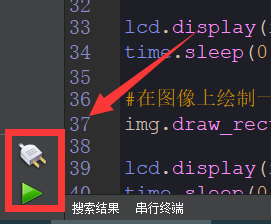
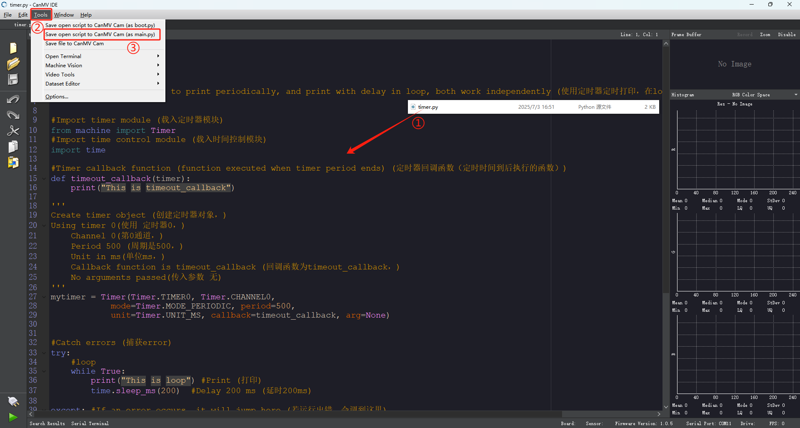
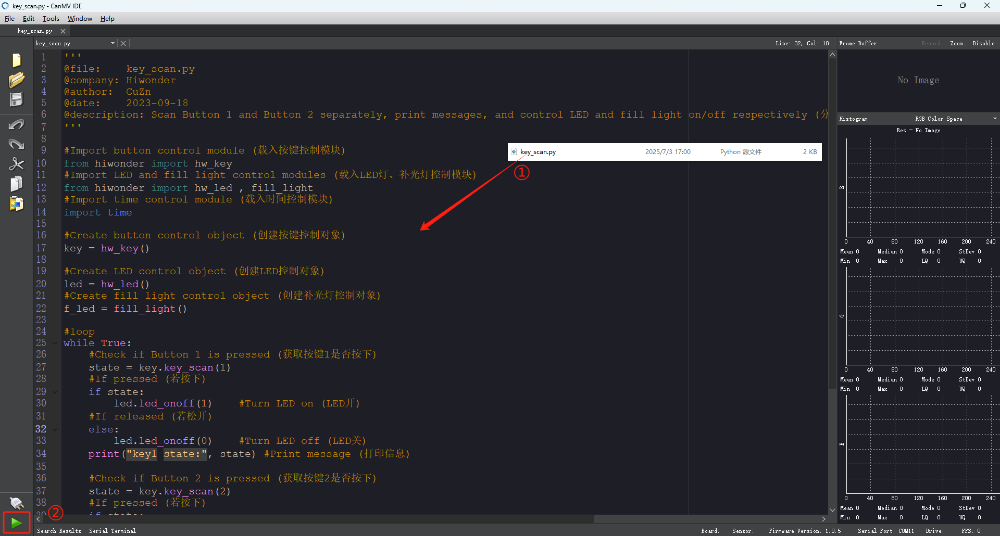
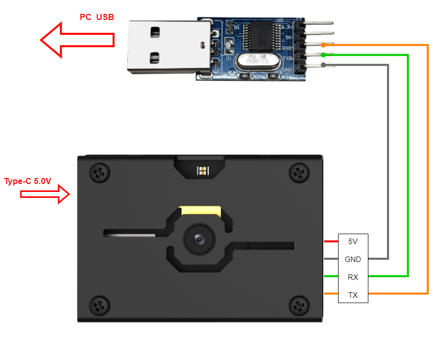
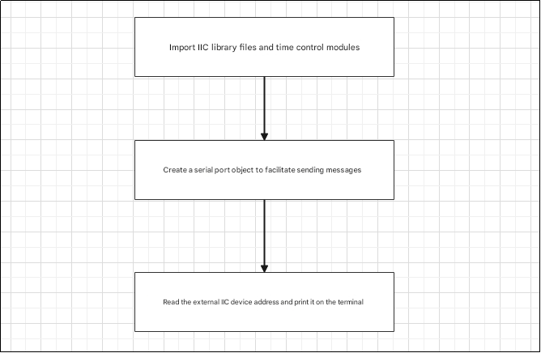

# 4. Basic Hardware Course

## 4.1 Onboard LED Experiment

### 4.1.1 Experiment Introduction

In this experiment, we will alternate the blinking of the LED light and the fill light on the K210 Vision Module using program control.


### 4.1.2 Getting Ready

*   **Module Connection**

(1) Use a Type-C data cable to connect the K210 Vision Module to the PC end, as shown in the figure below:


(2) Double-click to open the CanMV IDE development software.


(3) Click on the connection button in the bottom-left corner.


(4) Select the corresponding port number, check **"Advanced Setting"**, and choose **"Mode-3"**.


(5) Click **"OK"** and wait for the connection to establish.

 

(6) Once connected successfully, the CanMV IDE software icon at the bottom-left corner will change to the one shown in the figure below.



(7) If the connection takes more than 10 seconds, it indicates a connection failure. Click the **"Cancel"** button, and you will see the following pop-up window. Click **"OK"** to dismiss it. Then, recheck the connection.


*   **Reasons for connection failure and their solutions:**

(1) Wrong serial port selected: Disconnect other serial ports from the PC to reduce interference, then repeat the above steps and select the correct serial port.

(2) Incorrect cable used: Some Type-C cables are only for charging and do not support data transmission. Please use a Type-C cable that supports data transmission (the Type-C data cable provided by our company).

(3) Different firmware burned onto the K210: Reburn the factory firmware and then try to connect again.

*   **Program Execution and Download**

[Source Code]()

(1) Online running: After connecting, drag the program **"led.py"** from the same directory as this section to the code editing area of CanMV IDE, then click the run button  in the bottom-left corner to run the program online, as shown in the figure below:

:::{Note}
Programs run in this way will be lost after disconnection or shutdown, and will not be saved on the vision module.
:::


(2) Offline Running:

① After connecting, drag the program **"led.py"** from the same directory as this section to the code editing area of CanMV IDE. Then, click on **"Tools"** in the toolbar and select **"Save the currently open script as (main.py) to CanMV Cam"**, as shown in the figure below:


② Next, click the button **“Yes”**.


③ After successful writing, a prompt will appear. Click **"OK"**. This way, the MicroPython file will be saved to the K210 Vision Module.


By downloading in this way, you can simply power on the K210 Vision Module without connecting it later. The module will run the MicroPython file, allowing for offline execution.

### 4.1.3 Running Effect

The fill light and blue LED light alternately blink at intervals of 0.5 seconds.

### 4.1.4 Experiment Analysis
[Source Code]()

The external IO corresponding to the blue LED is IO24, and the external IO corresponding to the fill light is IO25. When the IO pin is at a high level, the LED and fill light are turned on; when the IO pin is at a low level, the LED and fill light are turned off. The programming logic of the program is as follows:


K210 supports arbitrary mapping between external IO and internal IO. The pins corresponding to peripherals (such as GPIO and I2C) on the microcontroller can be freely configured, whereas the relationship between peripherals and pins on most traditional microcontrollers is fixed, with only a few pins being reusable. Therefore, K210 offers greater flexibility.

Import the LED control module, fill light control module, and time control module for easy access in subsequent operations.

{lineno-start=9}
```python
#Import LED and fill light control modules (载入LED灯、补光灯控制模块)
from hiwonder import hw_led , fill_light
#Import time control module (载入时间控制模块)
import time
```
Create LED control object and fill light control object.

{lineno-start=14}
```python
#Create LED control object (创建LED控制对象)
led = hw_led()
#Create fill light control object (创建补光灯控制对象)
f_led = fill_light()
```
The main function is an infinite loop function. It controls the on/off of the LED light and the fill light using the  `led.led_onoff`  function and  `fill_onoff` function, respectively. In these functions, 1 represents on and 0 represents off. Then, it maintains the current on/off states using the `time.sleep` function, where 0.5 represents a duration of 0.5 seconds.

{lineno-start=19}
```python
#loop
while True:
    '''
    led_onoff() function (led_onoff()函数)
    Parameter 1: On/Off (参数1：开/关)
    0 = Off, 1 = On (0关闭，1开启)
    '''
    led.led_onoff(1)    #Turn LED on (LED开)
    f_led.fill_onoff(0) #Turn fill light off (补光灯关)
    time.sleep(0.5)  #Delay 0.5 seconds (延时0.5s)
    led.led_onoff(0)    #Turn LED off (LED关)
    f_led.fill_onoff(1) #Turn fill light on (补光灯开)
    time.sleep(0.5)  #Delay 0.5 seconds (延时0.5s)
```
---

## 4.2 Breath Light Experiment

### 4.2.1 Experiment Introduction

In this section, we control the LED light on the K210 Vision Module through programming to achieve the effect of a breathing light.


### 4.2.2 Getting Ready

*   **Module Connection**

(1) Connect the K210 Vision Module to the PC end using a Type-C data cable, as shown in the figure below:


(2) Double-click to open the CanMV IDE development software.


(3) Click on the connection button in the bottom-left corner.


(4) Select the corresponding port number, check **"Advanced Setting",** and choose **"Mode-3".**


(5) Click **"OK"** and wait for the connection to establish.

 

(6) Once connected successfully, the CanMV IDE software icon at the bottom-left corner will change to the one shown in the figure below.


(7) If the connection takes more than 10 seconds, it indicates a connection failure. Click the **"Cancel"** button, and you will see the following pop-up window. Click **"OK"** to dismiss it. Then, recheck the connection.


*   **Reasons for connection failure and their solutions:**

(1) Wrong serial port selected: Disconnect other serial ports from the PC to reduce interference, then repeat the above steps and select the correct serial port.

(2) Incorrect cable used: Some Type-C cables are only for charging and do not support data transmission. Please use a Type-C cable that supports data transmission (the Type-C data cable provided by our company).

(3) Different firmware burned onto the K210: Reburn the factory firmware and then try to connect again.

*   **Program Execution and Download**

[Source Code]()

(1) Online running: After connecting, drag the program **"led_pwm.py"** from the same directory as this section to the code editing area of CanMV IDE, then click the run button  in the bottom-left corner to run the program online, as shown in the figure below:

:::{Note}
Programs run in this way will be lost after disconnection or shutdown, and will not be saved on the vision module.
:::


(2) Offline Running:

① After connecting, drag the program **"led_pwm.py"** from the same directory as this section to the code editing area of CanMV IDE. Then, click on **"Tools"** in the toolbar and select **"Save the currently open script as (main.py) to CanMV Cam"**, as shown in the figure below:


② Next, click the button **“Yes”**.


③ After successful writing, a prompt will appear. Click **"OK"**. This way, the MicroPython file will be saved to the K210 Vision Module.


By downloading in this way, you can simply power on the K210 Vision Module without connecting it later. The module will run the MicroPython file, allowing for offline execution.

### 4.2.3 Running Effect

The LED light will blink in a breathing light pattern.

### 4.2.4 Experiment Analysis
[Source Code]()

The external IO corresponding to the blue LED is IO24. We control the LED light to display the breathing light effect through PWM duty cycle. The specific programming logic is as shown in the figure below:


K210 supports arbitrary mapping between external IO and internal IO. The pins corresponding to peripherals (such as GPIO and IIC) on the microcontroller can be freely configured, whereas the relationship between peripherals and pins on most traditional microcontrollers is fixed, with only a few pins being reusable. Therefore, K210 offers greater flexibility.

Import the timer module, PWM control module, and time control module. Also, define the pin number 24 for the LED light to be used for subsequent operations.

{lineno-start=9}
```python
#Import timer module and PWM control module (载入定时器模块，PWM控制模块)
from machine import Timer, PWM
#Import time control module (载入时间控制模块)
import time

'''
 Pin description: (引脚说明：)
    LED : 24
'''
output_led_pin = 24
```
Create a timer object using timer 0's channel 0, and create a PWM output object using the timer as the PWM source. Set parameters such as frequency, duty cycle, and pin for PWM. Define the initial value of PWM as 0, as well as the on/off state of the LED light.

{lineno-start=20}
```python
#Create timer object using timer 0 channel 0 in PWM mode (创建定时器对象，使用定时器0的第0通道，模式为PWM)
timer = Timer(Timer.TIMER0, Timer.CHANNEL0, mode=Timer.MODE_PWM)
#Create PWM output object with timer as PWM source, frequency 2000Hz, duty cycle 0%, output pin is output_led_pin (创建PWM输出对象，使用timer作为PWM源，频率2000，占空比为0%，输出引脚为output_led_pin)
pwm = PWM(timer, freq=2000, duty=0, pin=output_led_pin)

#PWM output value (输出的PWM值)
PWM_duty=0
#Direction of brightness change, True means increasing brightness (亮灭的方向，True为亮起)
onoff_dir = True

```
The main function is an infinite loop function. It determines the on/off state of the LED light using the variable `onoff_dir` and executes different actions accordingly.

When `onoff_dir` is True, it indicates that the LED light needs to be on. In this case, the duty cycle will continue to increase, making the LED light brighter.

When the duty cycle reaches the set threshold of 100, the state switches, and the duty cycle gradually decreases. Consequently, the LED light will become dimmer. This process loops continuously to achieve the breathing light effect.

{lineno-start=30}
```python
#loop
while True:
    #If onoff_dir is True (若onoff_dir为True)
    if onoff_dir:
        PWM_duty += 4 #Increase duty cycle by 4 (占空比+4)
    else:   #If onoff_dir is False (若onoff_dir为False)
        PWM_duty -= 4 #Decrease duty cycle by 4 (占空比-4)

    #If duty cycle exceeds 100%, set light to gradually turn off (若占空比大于100%，则设置灯为慢慢灭)
    if PWM_duty > 100:
        PWM_duty = 100
        onoff_dir = False
    elif PWM_duty < 0:  #If duty cycle is less than 0%, set light to gradually turn on (若占空比小于0%，则设置灯慢慢亮起)
        PWM_duty = 0
        onoff_dir = True

    pwm.duty(PWM_duty)  #Set PWM duty cycle (设置PWM占空比)
    time.sleep(0.06)    #Delay 0.06 seconds (延时0.06s)
```

## 4.3 Timer Experiment

### 4.3.1 Experiment Introduction

This section uses the timer control program to print specific content on the serial terminal below the software.

### 4.3.2 Getting Ready

*   **Module Connection**

(1) Use the Type-C data cable to connect the K210 vision module to the PC, as shown in the figure below.


(2) Double-click to open the CanMV IDE development software.


(3) Click on the connection button in the bottom-left corner.


(4) Select the corresponding port number, check **"Advanced Setting",** and choose **"Mode-3"**.


(5) Click **"OK"** and wait for the connection to establish.

 

(6) Once connected successfully, the CanMV IDE software icon at the bottom-left corner will change to the one shown in the figure below.


(7) If the connection takes more than 10 seconds, it indicates a connection failure. Click the **"Cancel"** button, and you will see the following pop-up window. Click **"OK"** to dismiss it. Then, recheck the connection.


*   **Reasons for connection failure and their solutions:**

(1) Wrong serial port selected: Disconnect other serial ports from the PC to reduce interference, then repeat the above steps and select the correct serial port.

(2) Incorrect cable used: Some Type-C cables are only for charging and do not support data transmission. Please use a Type-C cable that supports data transmission (the Type-C data cable provided by our company).

(3) Different firmware burned onto the K210: Reburn the factory firmware and then try to connect again.

*   **Program Execution and Download**

[Source Code]()

(1) Online running: After connecting, drag the program **"timer.py"** from the same directory as this section to the code editing area of CanMV IDE, then click the run button  in the bottom-left corner to run the program online, as shown in the figure below:

:::{Note}
Programs run in this way will be lost after disconnection or shutdown, and will not be saved on the vision module.
:::


(2) Offline Running:

① After connecting, drag the program **"timer.py"** from the same directory as this section to the code editing area of CanMV IDE. Then, click on **"Tools"** in the toolbar and select **"Save the currently open script as (main.py) to CanMV Cam"**, as shown in the figure below:



② Next, click the button **“Yes”**.


③ After successful writing, a prompt will appear. Click **"OK"**. This way, the MicroPython file will be saved to the K210 Vision Module.


By downloading in this way, you can simply power on the K210 Vision Module without connecting it later. The module will run the MicroPython file, allowing for offline execution.

### 4.3.3 Running Effect

When the timer is interrupted, the serial terminal prints **"This is timeout_callback"**, and if it is not interrupted, it prints **"This is loop"**.


### 4.3.4 Experiment Analysis
[Source Code]()

The timer is in the machine's `Timer` module. It can be easily programmed through MicroPython. We only need to understand its constructor object function and usage method! The programming idea for this routine is shown in the figure below:


First import the timer module and time control module to facilitate subsequent calls.

{lineno-start=9}
```python
#Import timer module (载入定时器模块)
from machine import Timer
#Import time control module (载入时间控制模块)
import time
```
Set the timer callback function. When the timer triggers an interrupt, **"This is timeout_callback"** will be printed.

Create a timer object. Set timer 0, channel 0 and timer interrupt period to 500ms, and call the callback function `timeout_callback`.

{lineno-start=14}
```python
#Timer callback function (function executed when timer period ends) (定时器回调函数（定时时间到后执行的函数）)
def timeout_callback(timer):
    print("This is timeout_callback")

'''
Create timer object (创建定时器对象，)
Using timer 0(使用 定时器0，)
    Channel 0(第0通道，)
    Period 500 (周期是500，)
    Unit in ms(单位ms，)
    Callback function is timeout_callback (回调函数为timeout_callback，)
    No arguments passed(传入参数 无)
'''
mytimer = Timer(Timer.TIMER0, Timer.CHANNEL0,
            mode=Timer.MODE_PERIODIC, period=500,
            unit=Timer.UNIT_MS, callback=timeout_callback, arg=None)
```
In the main function, the instruction to print **"This is loop"** will be continuously executed and printed every 200ms. When the timer is interrupted, the `timeout_callback` function will be triggered and the content in the function will be executed. When an error occurs, the timer will be unbound through the `mytimer.deinit` function, controlling printing to stop and destroying the timer object.

{lineno-start=33}
```python
try:
    #loop
    while True:
        print("This is loop") #Print (打印)
        time.sleep_ms(200)  #Delay 200 ms (延时200ms)

except: #If an error occurs, it will jump here (若运行出错，会调到这里)
    #Unbind timer (解绑定时器)
    mytimer.deinit()
    #Destroy timer object (销毁定时器对象)
    del mytimer
```
---

## 4.4 Button reading experiment

### 4.4.1 Experiment Introduction

This section uses a program to read the K210 vision module button status and print it on the serial terminal, while controlling the LED light and fill light status.


### 4.4.2 Getting Ready

*   **Module Connection**

(1) Connect the K210 Vision Module to the PC end using a Type-C data cable, as shown in the figure below:


(2) Double-click to open the CanMV IDE development software.


(3) Click on the connection button in the bottom-left corner.


(4) Select the corresponding port number, check **"Advanced Setting"**, and choose **"Mode-3"**.


(5) Click **"OK"** and wait for the connection to establish.

 

(6) Once connected successfully, the CanMV IDE software icon at the bottom-left corner will change to the one shown in the figure below.


(7) If the connection takes more than 10 seconds, it indicates a connection failure. Click the **"Cancel"** button, and you will see the following pop-up window. Click **"OK"** to dismiss it. Then, recheck the connection.


*   **Reasons for connection failure and their solutions:**

(1) Wrong serial port selected: Disconnect other serial ports from the PC to reduce interference, then repeat the above steps and select the correct serial port.

(2) Incorrect cable used: Some Type-C cables are only for charging and do not support data transmission. Please use a Type-C cable that supports data transmission (the Type-C data cable provided by our company).

(3) Different firmware burned onto the K210: Reburn the factory firmware and then try to connect again.

*   **Program Execution and Download**

[Source Code]()

(1) Online running: After connecting, drag the program **"key_scan.py"** from the same directory as this section to the code editing area of CanMV IDE, then click the run button  in the bottom-left corner to run the program online, as shown in the figure below:

:::{Note}
Programs run in this way will be lost after disconnection or shutdown, and will not be saved on the vision module.
:::



(2) Offline Running:

① After connecting, drag the program **"key_scan.py"** from the same directory as this section to the code editing area of CanMV IDE. Then, click on **"Tools"** in the toolbar and select **"Save the currently open script as (main.py) to CanMV Cam"**, as shown in the figure below:


② Next, click the button **“Yes”**.


③ After successful writing, a prompt will appear. Click **"OK".** This way, the MicroPython file will be saved to the K210 Vision Module.


By downloading in this way, you can simply power on the K210 Vision Module without connecting it later. The module will run the MicroPython file, allowing for offline execution.

### 4.4.3 Running Effect

The CanMV IDE serial terminal will print the status of the K1 key and the K2 key at the same time. When not pressed, it will print "key1 state: 0 key2 state: 0". When the K1 button is pressed, "key1 state: 1" will be printed; when the K2 button is pressed, "key2 state: 1" will be printed, and the fill light of the vision module will light up at the same time.


### 4.4.4 Experiment Analysis

[Source Code]()

Buttons are the most basic input device. The two function buttons of K210 are located at the positions shown in the figure below on the development board:


According to [1. Learn K210 Module -> 1.1 Module Introduction -> 1.1.3 Hardware]() the pins where the K1 and K2 buttons are located are IO_26 and IO_47.

For the programming ideas of this case, please refer to the following figure:


If we want to control the keys, we can do so by calling the library file.

First, import the buttons, LED lights, fill light modules and time control modules for subsequent calls.

{lineno-start=1}
```python
#Import button control module (载入按键控制模块)
from hiwonder import hw_key
#Import LED and fill light control modules (载入LED灯、补光灯控制模块)
from hiwonder import hw_led , fill_light
#Import time control module (载入时间控制模块)
import time
```
Create button control objects, LED control objects and fill light control objects.

{lineno-start=16}
```python
#Create button control object (创建按键控制对象)
key = hw_key()

#Create LED control object (创建LED控制对象)
led = hw_led()
#Create fill light control object (创建补光灯控制对象)
f_led = fill_light()

```
The main function is an infinite loop function that first obtains the current status of the K1 button. If the current button status is True, that is, when it is pressed, the `led.led_onoff` function is called to control the LED light to light up; otherwise, the LED light goes out. During this period, the current key information will also be printed, that is, "key1 state: 1" or "key1 state: 0".

The judgment of the K2 button is similar. When the button is pressed, the `f_led.fill_onoff` function is called to control the fill light to turn on. Otherwise, the fill light is turned off, and the terminal will also print the current K2 button status, that is, "key2 state: 1" or "key2 state: 0".

At the same time, the `time.sleep_ms` function is called to control the key status to be detected and printed every 50 milliseconds.

{lineno-start=24}
```python
#loop
while True:
    #Check if Button 1 is pressed (获取按键1是否按下)
    state = key.key_scan(1)
    #If pressed (若按下)
    if state:
        led.led_onoff(1)    #Turn LED on (LED开)
    #If released (若松开)
    else:
        led.led_onoff(0)    #Turn LED off (LED关)
    print("key1 state:", state) #Print message (打印信息)

    #Check if Button 2 is pressed (获取按键2是否按下)
    state = key.key_scan(2)
    #If pressed (若按下)
    if state:
        f_led.fill_onoff(1) #Turn fill light on (补光灯开)
    #If released (若松开)
    else:
        f_led.fill_onoff(0) #Turn fill light off (补光灯关)
    print("key2 state:", state) #Print message (打印信息)

    time.sleep_ms(50)   #Delay 50 ms (延时50ms)
```
---

## 4.5 Touchpad reading coordinate experiment

### 4.5.1 Experiment Introduction

This section uses the program to read the touch status and position of the K210 vision module capacitive screen and print it out.


### 4.5.2 Getting Ready

*   **Module Connection**

(1) Connect the K210 Vision Module to the PC end using a Type-C data cable, as shown in the figure below:


(2) Double-click to open the CanMV IDE development software.


(3) Click on the connection button in the bottom-left corner.


(4) Select the corresponding port number, check **"Advanced Setting",** and choose **"Mode-3"**.


(5) Click **"OK"** and wait for the connection to establish.

 

(6) Once connected successfully, the CanMV IDE software icon at the bottom-left corner will change to the one shown in the figure below.


(7) If the connection takes more than 10 seconds, it indicates a connection failure. Click the **"Cancel"** button, and you will see the following pop-up window. Click **"OK"** to dismiss it. Then, recheck the connection.


*   **Reasons for connection failure and their solutions:**

(1) Wrong serial port selected: Disconnect other serial ports from the PC to reduce interference, then repeat the above steps and select the correct serial port.

(2) Incorrect cable used: Some Type-C cables are only for charging and do not support data transmission. Please use a Type-C cable that supports data transmission (the Type-C data cable provided by our company).

(3) Different firmware burned onto the K210: Reburn the factory firmware and then try to connect again.

*   **Program Execution and Download**

[Source Code]()

(1) Online running: After connecting, drag the program **"touchscreen_read.py"** from the same directory as this section to the code editing area of CanMV IDE, then click the run button  in the bottom-left corner to run the program online, as shown in the figure below:

:::{Note}
Programs run in this way will be lost after disconnection or shutdown, and will not be saved on the vision module.
:::


(2) Offline Running:

① After connecting, drag the program **"touchscreen_read.py"** from the same directory as this section to the code editing area of CanMV IDE. Then, click on **"Tools"** in the toolbar and select **"Save the currently open script as (main.py) to CanMV Cam"**, as shown in the figure below:


② Next, click the button **“Yes”**.


③ After successful writing, a prompt will appear. Click **"OK"**. This way, the MicroPython file will be saved to the K210 Vision Module.


By downloading in this way, you can simply power on the K210 Vision Module without connecting it later. The module will run the MicroPython file, allowing for offline execution.

### 4.5.3 Running Effect

First of all, we need to know that the resolution of the touch screen of the K210 vision module is 320\*240, and the origin of its pixel coordinates is located in the upper left corner of the vision module, as shown in the following figure:


The terminal will print the current state of the touchscreen along with the coordinates of the touch position, as shown in the following diagram:


There are three states in total, where the leftmost numbers 1, 2, 3 represent the current state of the screen. 1 represents the screen not being touched, 2 represents the screen being touched, and 3 represents touch movement. Subsequent parameters indicate the position information of the last touch on the touchscreen. Meanwhile, the touchscreen will also display corresponding points and trajectories.

### 4.5.4 Experiment Analysis
[Source Code]()

The front of the K210 vision module features a 2.0-inch capacitive touchscreen, communicating via IIC with a resolution of 320\*240. For the programming approach regarding this case, you can refer to the diagram below:


Import the LCD screen touch module, image module, and time control module, and initialize the LCD screen and LCD touch module for subsequent touch control.

{lineno-start=9}
```python
#Import LCD touchscreen control module (载入LCD屏幕触摸控制模块)
import touchscreen as ts
#Import LCD control module (载入LCD控制模块)
import lcd
#Import image module (载入图像模块)
import image
#Import time control module (载入时间控制模块)
import time
```
Use the `image.Image` function to obtain an image object. Then, utilize the `img.draw_string` function to draw the string "Please touch the LCD" on the image. Set the color of the string to yellow and the font size to 2.

Next, assign the data obtained from the `ts.read` function to the previous touch status and position information.

{lineno-start=23}
```python
#Get image object (获取图像对象)
img = image.Image()
#Write string on the image (在图像上写字符串)
img.draw_string(50, 50, "Please touch the LCD", color=(200, 200, 0), scale=2)

#Define previous touch state (定义上一次的触摸状态)
(last_status, last_x, last_y) = ts.read()
```
The main function is an infinite loop. First, use the `ts.read` function to read the current touch status. Compare the current status with the previous status. If the statuses are different, print the data obtained.

If the current status is detected as a moving touch (status 3), display the trajectory of the current touch movement using lines.

If the current status is detected as a touch (status 2), connect the positions of the two touch points read to form a line.

:::{Note}
To achieve screen line drawing under status 2, you can use two fingers to tap different positions on the screen in sequence, one after the other. If only a single finger is used for tapping, the status will change to 1 due to the finger's idle time in the middle, thus making it impossible to draw lines between two points.
:::

{lineno-start=31}
```python
#loop
while True:
    #Read current touch state (读取当前的触摸状态)
    (status, x, y) = ts.read()

    #If state changed (若有变化)
    if last_status != status:
        #Print current touch state (打印当前的触摸状态)
        print(status, x, y)

    #If state is touch move (若状态为移动触摸)
    if status == ts.STATUS_MOVE:
        #Draw line from (x_last, y_last) to (x, y) (画线 从（x_last, y_last）到（x, y）)
        img.draw_line(last_x, last_y, x, y)
    elif status == ts.STATUS_PRESS: #If state is touch down (若状态为按下触摸)
        img.draw_line(x, y, x, y)

    #Display on LCD (显示在LCD上)
    lcd.display(img)

    #Save current touch state (保存当前的触摸状态)
    last_status = status
    last_x = x
    last_y = y
```
---

## 4.6 TF card read/write experiment

### 4.6.1 Experiment Introduction

This section reads the camera feed from the K210 vision module through a program and stores the captured frames onto a TF card.


### 4.6.2 Getting Ready

*   **Module Connection**

(1) Connect the K210 Vision Module to the PC end using a Type-C data cable, as shown in the figure below:


(2) Double-click to open the CanMV IDE development software.


(3) Click on the connection button in the bottom-left corner.


(4) Select the corresponding port number, check **"Advanced Setting",** and choose **"Mode-3"**.


(5) Click "OK" and wait for the connection to establish.

 

(6) Once connected successfully, the CanMV IDE software icon at the bottom-left corner will change to the one shown in the figure below.


(7) If the connection takes more than 10 seconds, it indicates a connection failure. Click the **"Cancel"** button, and you will see the following pop-up window. Click **"OK"** to dismiss it. Then, recheck the connection.


*   **Reasons for connection failure and their solutions:**

(1) Wrong serial port selected: Disconnect other serial ports from the PC to reduce interference, then repeat the above steps and select the correct serial port.

(2) Incorrect cable used: Some Type-C cables are only for charging and do not support data transmission. Please use a Type-C cable that supports data transmission (the Type-C data cable provided by our company).

(3) Different firmware burned onto the K210: Reburn the factory firmware and then try to connect again.

*   **Program Execution and Download**

[Source Code]()

(1) Online running: After connecting, drag the program **"SDcard_rw.py"** from the same directory as this section to the code editing area of CanMV IDE, then click the run button  in the bottom-left corner to run the program online, as shown in the figure below:

:::{Note}
Programs run in this way will be lost after disconnection or shutdown, and will not be saved on the vision module.
:::


(2) Offline Running:

① After connecting, drag the program **"SDcard_rw.py"** from the same directory as this section to the code editing area of CanMV IDE. Then, click on **"Tools"** in the toolbar and select **"Save the currently open script as (main.py) to CanMV Cam"**, as shown in the figure below:


② Next, click the button **“Yes”**.


③ After successful writing, a prompt will appear. Click **"OK".** This way, the MicroPython file will be saved to the K210 Vision Module.


By downloading in this way, you can simply power on the K210 Vision Module without connecting it later. The module will run the MicroPython file, allowing for offline execution.

### 4.6.3 Running Effect

After running the program, the live feed will appear in the top right corner. After a 3-second delay, the current frame will be captured, stored in the TF directory, and simultaneously displayed on the LCD screen.

### 4.6.4 Experiment Analysis
[Source Code]()

A TF card slot is provided for external TF card connection to store data (a 32GB card is recommended, but it should not exceed 64GB as exceeding 64GB might result in unreadable data).

For the programming approach regarding this case, you can refer to the diagram below:


Import the sensor control module, LCD control module, image module, supplementary light control module, and time control module for ease of access in subsequent calls.

{lineno-start=9}
```python
#Import sensor control module (载入传感器控制模块)
import sensor
#Import LCD control module (载入LCD控制模块)
import lcd
#Import image module (载入图像模块)
import image
#Import fill light control module (载入补光灯控制模块)
from hiwonder import fill_light
#Import time control module (载入时间控制模块)
import time
```
Create a supplementary light control object, initialize the LCD, sensor, and specify the parameters for the camera. Set the pixel format to RGB565, the image frame size to QVGA, and start the sensor's continuous data acquisition mode.

{lineno-start=22}
```python
#Create fill light control object (创建补光灯控制对象)
f_led = fill_light()
#Initialize LCD (初始化LCD)
lcd.init()
#Reset sensor (重置传感器)
sensor.reset()


#Set the pixel format of the camera (指定摄像头的像素格式)
sensor.set_pixformat(sensor.RGB565)
#Set the image frame size (设置图像帧大小)
sensor.set_framesize(sensor.QVGA)
#Start sensor in continuous capture mode (启动传感器的连续数据采集模式)
sensor.run(1)
#Skip the first 10 frames to ensure image stability (跳过第一次采集的前10帧图像，确保图像稳定)
sensor.skip_frames(10)
```
Next, turn on the supplementary light and set to take a photo after a 3-second delay. Set the name of the captured image and the save path `img_path` in the directory of the TF card. Use the `sensor.snapshot` function to capture the current image from the sensor and save it to the `img_path` directory. Once done, turn off the supplementary light.

Then, locate the saved image from the TF card path and display it on the LCD screen using the `lcd.read` function. Also, write a document to this path.

{lineno-start=39}
```python
#Turn on fill light (补光灯开)
f_led.fill_onoff(1)

#Delay 3 seconds before taking photo (延时3s后拍照)
time.sleep(3)

'''
 Capture image and save it to SD card (拍摄图像并保存到SD卡中)
'''
#Print message (打印)
print("save image...")
#Image save path — must be under /sd directory, filename can be customized (图像保存路径，要保存在/sd路径下，名字可自由定义)
img_path = "/sd/SDcard_image.jpg"
#Get current image from sensor (获取传感器的当前图像)
img = sensor.snapshot()
#Save the image to the specified path (将图像保存到该路径中)
img.save(img_path)

f_led.fill_onoff(0) #Turn off fill light (补光灯关)

'''
 Read image from SD card and display it on LCD (从SD卡中读取图像并显示在LCD上)
'''
#Print message (打印)
print("read image...")
#Read image from the path (从该路径中读取图像)
img_read = image.Image(img_path)
#Display the image on LCD (在LCD上显示该图像)
lcd.display(img_read)


#Write text file to SD card (文本文件写入SD卡)
file = open ("/sd/SDcard_test.txt", "w")
file.write("This is the test text from SDcard_rw.py \n")
file.write(img_path)
file.close()

#Read text file from SD card (从SD卡读取文本文件)
file = open("/sd/SDcard_test.txt", "r")
print(file.readline())
print(file.readline())
file.close()
```
---

## 4.7 Camera Display Experiment

### 4.7.1 Experiment Introduction

In this section, we control the K210 vision module through a program to capture frames and display them. Additionally, we display the feedback, namely the frame rate, in the terminal interface of the CanMV IDE software.

### 4.7.2 Getting Ready

*   **Module Connection**

(1) Connect the K210 Vision Module to the PC end using a Type-C data cable, as shown in the figure below:


(2) Double-click to open the CanMV IDE development software.


(3) Click on the connection button in the bottom-left corner.


(4) Select the corresponding port number, check **"Advanced Setting"**, and choose **"Mode-3"**.


(5) Click **"OK"** and wait for the connection to establish.

 

(6) Once connected successfully, the CanMV IDE software icon at the bottom-left corner will change to the one shown in the figure below.


(7) If the connection takes more than 10 seconds, it indicates a connection failure. Click the **"Cancel"** button, and you will see the following pop-up window. Click **"OK"** to dismiss it. Then, recheck the connection.


*   **Reasons for connection failure and their solutions:**

(1) Wrong serial port selected: Disconnect other serial ports from the PC to reduce interference, then repeat the above steps and select the correct serial port.

(2) Incorrect cable used: Some Type-C cables are only for charging and do not support data transmission. Please use a Type-C cable that supports data transmission (the Type-C data cable provided by our company).

(3) Different firmware burned onto the K210: Reburn the factory firmware and then try to connect again.

*   **Program Execution and Download**

[Source Code]()

(1) Online running: After connecting, drag the program **"camera_display.py"** from the same directory as this section to the code editing area of CanMV IDE, then click the run button  in the bottom-left corner to run the program online, as shown in the figure below:

:::{Note}
Programs run in this way will be lost after disconnection or shutdown, and will not be saved on the vision module.
:::


(2) Offline Running:

① After connecting, drag the program **"camera_display.py"** from the same directory as this section to the code editing area of CanMV IDE. Then, click on "Tools" in the toolbar and select **"Save the currently open script as (main.py) to CanMV Cam"**, as shown in the figure below:


② Next, click the button **“Yes”**.


③ After successful writing, a prompt will appear. Click **"OK"**. This way, the MicroPython file will be saved to the K210 Vision Module.


By downloading in this way, you can simply power on the K210 Vision Module without connecting it later. The module will run the MicroPython file, allowing for offline execution.

### 4.7.3 Running Effect

The camera's image and frame rate will be displayed on the LCD screen, and the terminal will also print the frame rate.


### 4.7.4 Experiment Analysis
[Source Code]()

The K210 vision module utilizes a 2-megapixel parallel camera.

For the programming approach regarding this case, you can refer to the diagram below:


First, import the sensor control module, LCD control module, and time control module for ease of access in subsequent calls.

{lineno-start=9}
```python
#Import sensor control module (载入传感器控制模块)
import sensor
#Import LCD control module (载入LCD控制模块)
import lcd
#Import time control module (载入时间控制模块)
import time
```
Call `lcd.init` to initialize the LCD display screen. Also, call `sensor.reset` function to reset the sensor. Set the pixel format to `RGB565`, the image frame size to `QVGA`, and start the sensor's continuous data acquisition mode.

Create a `clock` object and set the orientation of the interface to 0°, then disable mirroring display.

{lineno-start=9}
```python
#Import sensor control module (载入传感器控制模块)
import sensor
#Import LCD control module (载入LCD控制模块)
import lcd
#Import time control module (载入时间控制模块)
import time

#Initialize LCD (初始化LCD)
lcd.init()
#Reset sensor (重置传感器)
sensor.reset()

#Set the pixel format of the camera (指定摄像头的像素格式)
sensor.set_pixformat(sensor.RGB565)
#Set the image frame size (设置图像帧大小)
sensor.set_framesize(sensor.QVGA)
#Start sensor in continuous capture mode (启动传感器的连续数据采集模式)
sensor.run(1)
#Skip the first 10 frames to ensure image stability (跳过第一次采集的前10帧图像，确保图像稳定)
sensor.skip_frames(10)

#Create clock object (创建时钟对象)
clock = time.clock()

#Set display orientation to 0° (界面设置为0°显示)
lcd.rotation(0)
lcd.mirror(False)
```
The main function is an infinite loop. First, use `clock.tick` to record the current time for subsequent frame rate calculation. Then, use `sensor.snapshot` to obtain the image from the sensor.

Calculate the frames per second (fps), and use `img.draw_string` function to draw the current fps value at the top left corner of the image. Set the text color to green and font scale to 1.5.

Finally, use `lcd.display` function to display the image.

{lineno-start=37}
```python
#loop
while(True):
    #Record current time for FPS calculation (记录当前时间，用于后续计算帧率)
    clock.tick()
    #Get snapshot image from sensor (获取传感器的快照图像)
    img = sensor.snapshot()
    #Get current FPS (获取当前帧率)
    fps = clock.fps()
    #Draw FPS info on the image — this will draw the current FPS value at the top-left corner in green text with a scale of 1.5 (在图像上绘制帧率信息。这将在图像左上角绘制当前帧率值，使用绿色文本，字体缩放比例为1.5)
    img.draw_string(0, 0, "%2.1ffps" %(fps), color=(0, 255, 0), scale=1.5)
    #Display the frame image (显示该帧图像)
    lcd.display(img)
    #Print FPS (打印帧率)
    print(fps)
```
---

## 4.8 LCD Display Experiment

### 4.8.1 Experiment Introduction

In this section, we control the LCD display screen through a program to display predefined text content at different positions.

### 4.8.2 Getting Ready

*   **Module Connection**

(1) Connect the K210 Vision Module to the PC end using a Type-C data cable, as shown in the figure below:


(2) Double-click to open the CanMV IDE development software.


(3) Click on the connection button in the bottom-left corner.


(4) Select the corresponding port number, check "Advanced Setting", and choose "Mode-3".


(5) Click **"OK"** and wait for the connection to establish.

 

(6) Once connected successfully, the CanMV IDE software icon at the bottom-left corner will change to the one shown in the figure below.


(7) If the connection takes more than 10 seconds, it indicates a connection failure. Click the **"Cancel"** button, and you will see the following pop-up window. Click **"OK"** to dismiss it. Then, recheck the connection.


*   **Reasons for connection failure and their solutions:**

(1) Wrong serial port selected: Disconnect other serial ports from the PC to reduce interference, then repeat the above steps and select the correct serial port.

(2) Incorrect cable used: Some Type-C cables are only for charging and do not support data transmission. Please use a Type-C cable that supports data transmission (the Type-C data cable provided by our company).

(3) Different firmware burned onto the K210: Reburn the factory firmware and then try to connect again.

*   **Program Execution and Download**

[Source Code]()

(1) Online running: After connecting, drag the program **"LCD_display.py"** from the same directory as this section to the code editing area of CanMV IDE, then click the run button  in the bottom-left corner to run the program online, as shown in the figure below:

:::{Note}
Programs run in this way will be lost after disconnection or shutdown, and will not be saved on the vision module.
:::


(2) Offline Running:

① After connecting, drag the program **"LCD_display.py"** from the same directory as this section to the code editing area of CanMV IDE. Then, click on **"Tools"** in the toolbar and select **"Save the currently open script as (main.py) to CanMV Cam"**, as shown in the figure below:


② Next, click the button **“Yes”**.


③ After successful writing, a prompt will appear. Click **"OK"**. This way, the MicroPython file will be saved to the K210 Vision Module.


By downloading in this way, you can simply power on the K210 Vision Module without connecting it later. The module will run the MicroPython file, allowing for offline execution.

### 4.8.3 Running Effect

The LCD display screen will show the text **"hello hiwonder"** with different background colors at five positions.

### 4.8.4 Experiment Analysis
[Source Code]()

Regarding the program logic for this experiment, you can refer to the diagram below:


Import the LCD control module and the time control module for ease of access in subsequent calls.

{lineno-start=9}
```python
#Import LCD control module (载入LCD控制模块)
import lcd
#Import time control module (载入时间控制模块)
import time

#Initialize LCD (初始化LCD)
lcd.init()
#Clear LCD screen and set background color to blue (清除LCD界面，设置为蓝色)
lcd.clear(lcd.BLUE)
```
Call `lcd.init` to initialize the LCD display screen. Also, call `lcd.clear` function to clear the screen, and set the background color to blue.

{lineno-start=14}
```python
#Initialize LCD (初始化LCD)
lcd.init()
#Clear LCD screen and set background color to blue (清除LCD界面，设置为蓝色)
lcd.clear(lcd.BLUE)
```
The main function is an infinite loop. First, use the `lcd.clear` function to clear the screen. Then, use `lcd.rotation(0)` to set the interface display to 0°.

Next, use `lcd.draw_string(100, 50, "Hello, Hiwonder", lcd.WHITE, lcd.BLUE)` to display the content at position (100,50). Set the font color to white and the background color to blue.

For the text content at the other positions, you can refer to the same program explanation provided above.

{lineno-start=20}
```python
#loop
while True:
    #Clear LCD screen (清除LCD界面)
    lcd.clear(lcd.BLUE)
    #Set display orientation to 0° (界面设置为0°显示)
    lcd.rotation(0)
    #Show string (显示字符串)
    lcd.draw_string(100, 50, "Hello, Hiwonder", lcd.WHITE, lcd.BLUE)
    #Delay for 1 second (延时1s)
    time.sleep(1)


    lcd.clear(lcd.BLUE)
    #Rotate display to 90° (界面旋转为90°显示)
    lcd.rotation(1)
    lcd.draw_string(70, 50, "Hello Hiwonder", lcd.WHITE, lcd.RED)
    time.sleep(1)

    lcd.clear(lcd.BLUE)
    #Rotate display to 180° (界面旋转为180°显示)
    lcd.rotation(2)
    lcd.draw_string(100, 50, "Hello Hiwonder", lcd.WHITE, lcd.GREEN)
    time.sleep(1)

    lcd.clear(lcd.BLUE)
    #Rotate display to -90° (界面旋转为-90°显示)
    lcd.rotation(3)
    lcd.draw_string(70, 50, "Hello Hiwonder", lcd.WHITE, lcd.YELLOW)
    time.sleep(1)

    lcd.clear(lcd.BLUE)
    #Set display orientation back to 0° (界面设置为0°显示)
    lcd.rotation(0)
    lcd.draw_string(100, 100, "Hello Hiwonder", lcd.WHITE, lcd.BLACK)
    time.sleep(1)
```
---

## 4.9 UART Serial Communication Experiment

### 4.9.1 Experiment Introduction

In this section, connect the K210 vision module to an external USB-to-serial module. Send data to the K210 via serial communication and display the data sent over the serial port in the terminal.


### 4.9.2 Getting Ready

*   **Module Connection**

(1) Connect the K210 Vision Module to the PC end using a Type-C data cable, as shown in the figure below:


(2) Use DuPont wires to connect the `GND`, `RX`, and `TX` pins of the USB-to-serial module to the UART interface of the K210. Then, connect the USB-to-serial module to the PC end, as shown in the following diagram.



(3) Double-click to open the CanMV IDE development software.


(4) Click on the connection button in the bottom-left corner.


(5) Select the corresponding port number, check **"Advanced Setting"**, and choose **"Mode-3"**.


(6) Click **"OK"** and wait for the connection to establish.

 

(7) Once connected successfully, the CanMV IDE software icon at the bottom-left corner will change to the one shown in the figure below.


(8) If the connection takes more than 10 seconds, it indicates a connection failure. Click the "Cancel" button, and you will see the following pop-up window. Click **"OK"** to dismiss it. Then, recheck the connection.


*   **Reasons for connection failure and their solutions:**

(1) Wrong serial port selected: Disconnect other serial ports from the PC to reduce interference, then repeat the above steps and select the correct serial port.

(2) Incorrect cable used: Some Type-C cables are only for charging and do not support data transmission. Please use a Type-C cable that supports data transmission (the Type-C data cable provided by our company).

(3) Different firmware burned onto the K210: Reburn the factory firmware and then try to connect again.

*   **Program Execution and Download**

[Source Code]()

(1) Online running: After connecting, drag the program "serial_communication.py" from the same directory as this section to the code editing area of CanMV IDE, then click the run button  in the bottom-left corner to run the program online, as shown in the figure below:

:::{Note}
Programs run in this way will be lost after disconnection or shutdown, and will not be saved on the vision module.
:::


(2) Offline Running:

① After connecting, drag the program "serial_communication.py" from the same directory as this section to the code editing area of CanMV IDE. Then, click on "Tools" in the toolbar and select "Save the currently open script as (main.py) to CanMV Cam", as shown in the figure below:


② Next, click the button **“Yes”**.


③ After successful writing, a prompt will appear. Click **"OK"**. This way, the MicroPython file will be saved to the K210 Vision Module.


By downloading in this way, you can simply power on the K210 Vision Module without connecting it later. The module will run the MicroPython file, allowing for offline execution.

### 4.9.3 Running Effect

Send messages to the K210 vision module via a serial port tool assistant. The K210 vision module will print the received messages in its terminal.


### 4.9.4 Experiment Analysis
[Source Code]()

UART (Universal Asynchronous Receiver/Transmitter) is a common serial communication protocol used for transmitting data between devices. It is a hardware communication interface used for serial data transmission, typically to connect computers with external devices such as modems, sensors, microcontrollers, etc.

UART is an asynchronous communication protocol, meaning that data transmission does not require synchronization using a clock signal. Instead, the transmitting and receiving devices use a predetermined baud rate to coordinate the data transfer rate.

The programming approach for this case can be referenced in the diagram below:


Import the UART control module and the time control module for ease of access in subsequent calls.

{lineno-start=10}
```python
from hiwonder import hw_uart
#Import time control module (载入时间控制模块)
import time
```
Call the `hw_uart` function to create a UART object and define the string to be sent.

{lineno-start=14}
```python
#Create UART (serial) object (创建串口对象)
serial = hw_uart()


#Define string to send (定义发送字符串)
str_buf = [0x01 , 0x02 , 0x03 , 0x04]
```
The main function is an infinite loop. Use the `serial.send_bytearray` function to send the string, then use `serial.rec_bytes` to receive the relevant content. Next, use the `print` function to print the content. Define a call to the delay function to receive and print the relevant content every 0.5 seconds.

{lineno-start=21}
```python
#loop
while True:
    #Send string (发送字符串)
    serial.send_bytearray(str_buf)
    bt = serial.rec_bytes()
    print("rec:")
    print(bt)
    #Delay for 0.5 seconds (延时0.5s)
    time.sleep(0.5)
```
---

## 4.10 IIC Communication Experiment

### 4.10.1 Experiment Introduction

In this section, an IIC device such as an ultrasonic module is connected to the IIC interface of the K210 vision module. Upon activation, the IIC address data is read from the device.


### 4.10.2 Getting Ready

*   **Module Connection**

(1) Connect the K210 Vision Module to the PC end using a Type-C data cable, as shown in the figure below:


(2) Double-click to open the CanMV IDE development software.


(3) Click on the connection button in the bottom-left corner.


(4) Select the corresponding port number, check **"Advanced Setting"**, and choose **"Mode-3"**.


(5) Click **"OK"** and wait for the connection to establish.

 

(6) Once connected successfully, the CanMV IDE software icon at the bottom-left corner will change to the one shown in the figure below.


(7) If the connection takes more than 10 seconds, it indicates a connection failure. Click the **"Cancel"** button, and you will see the following pop-up window. Click **"OK"** to dismiss it. Then, recheck the connection.


*   **Reasons for connection failure and their solutions:**

(1) Wrong serial port selected: Disconnect other serial ports from the PC to reduce interference, then repeat the above steps and select the correct serial port.

(2) Incorrect cable used: Some Type-C cables are only for charging and do not support data transmission. Please use a Type-C cable that supports data transmission (the Type-C data cable provided by our company).

(3) Different firmware burned onto the K210: Reburn the factory firmware and then try to connect again.

*   **Program Execution and Download**

[Source Code]()

(1) Online running: After connecting, drag the program **"IIC_communication.py"** from the same directory as this section to the code editing area of CanMV IDE, then click the run button  in the bottom-left corner to run the program online, as shown in the figure below:

:::{Note}
Programs run in this way will be lost after disconnection or shutdown, and will not be saved on the vision module.
:::


(2) Offline Running:

① After connecting, drag the program **"IIC_communication.py"** from the same directory as this section to the code editing area of CanMV IDE. Then, click on **"Tools"** in the toolbar and select **"Save the currently open script as (main.py) to CanMV Cam"**, as shown in the figure below:


② Next, click the button **“Yes”**.


③ After successful writing, a prompt will appear. Click **"OK"**. This way, the MicroPython file will be saved to the K210 Vision Module.


By downloading in this way, you can simply power on the K210 Vision Module without connecting it later. The module will run the MicroPython file, allowing for offline execution.

### 4.10.3 Running Effect

By connecting an external IIC device and running the program, you should be able to view the address information in the terminal, indicating successful communication.


### 4.10.4 Experiment Analysis
[Source Code]()

IIC (Inter-Integrated Circuit) is a serial communication bus protocol, also known as the IIC (Inter-IC) bus. It is a simple and efficient communication protocol used to connect microcontrollers with peripheral devices such as sensors, memory and displays.

The IIC bus uses two wires for data transmission: the Serial Data Line (`SDA`) and the Serial Clock Line (`SCL`). This allows for a reduction in the number of pins required when connecting devices. IIC is a convenient serial communication protocol suitable for connecting various types of chips and devices, enabling them to exchange data quickly and reliably.

The programming approach for this section can be referenced in the diagram below:



Import the I2C control module and the time control module for ease of access in subsequent calls.

{lineno-start=10}
```python
from hiwonder import hw_i2c
#Import time control module (载入时间控制模块)
import time
from machine import I2C
```
Call the `I2C` function to create an I2C object, specifying the pins used and the frequency (set to 100000). Define the relevant arrays, addresses, etc.

{lineno-start=15}
```python
#Create I2C object (创建串口对象)
#iic = hw_i2c(freq=100000)
#iic = hw_i2c(hw_i2c.I2C3,freq=100000, scl=18, sda=19)
iic = I2C(I2C.I2C3,freq=100000, scl=18, sda=19)
'''
Note: The touchscreen's I2C and the external I2C interface share the same bus,
# so even if nothing is connected to the external port, one device (the touchscreen) will still be detected
# (注意：touchscreen的i2c 和 外接口的i2c 是同一个，所以外接口不接，也能扫描到一个设备（为touchscreen）)
'''
buf = bytearray(1)
buf[0] = 0x00
add = 0x77
size = 0x02
```
The main function is an infinite loop. Use `print(iic.scan)` to print the address information received by the I2C interface. Also, call the delay function, so that the content is received and printed every 0.5 seconds.

{lineno-start=28}
```python
#loop
while True:
    #Send string (发送字符串)
    print(iic.scan())
    #iic.writeto(add, buf)
    #print(iic.readfrom(add, size))
    #Delay for 0.5 seconds (延时0.5s)
    time.sleep(0.5)
```