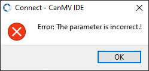
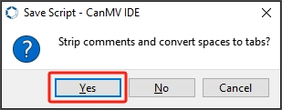
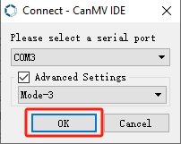

# 5.GUI Operation Course

## 5.1 Draw Graphics Experiment

### 5.1.1 Experiment Introduction

This section mainly implements the drawing and display of graphics on the LCD screen using the built-in LCD module library of the K210 vision module. First, create an image object, draw graphics on this object, and finally display the image on the LCD screen.


### 5.1.2 Getting Ready

* **Module Connection**

(1) Connect the K210 Vision Module to the PC end using a Type-C data cable, as shown in the figure below:


(2) Double-click to open the CanMV IDE development software.


(3) Click on the connection button in the bottom-left corner.


(4) Select the corresponding port number, check **"Advanced Setting"**, and choose **"Mode-3"**.


(5) Click **"OK"** and wait for the connection to establish.


(6) Once connected successfully, the CanMV IDE software icon at the bottom-left corner will change to the one shown in the figure below.


(7) If the connection takes more than 10 seconds, it indicates a connection failure. Click the **"Cancel"** button, and you will see the following pop-up window. Click **"OK"** to dismiss it. Then, recheck the connection.



* **Reasons for connection failure and their solutions:**

(1) Wrong serial port selected: Disconnect other serial ports from the PC to reduce interference, then repeat the above steps and select the correct serial port.

(2) Incorrect cable used: Some Type-C cables are only for charging and do not support data transmission. Please use a Type-C cable that supports data transmission (the Type-C data cable provided by our company).

(3) Different firmware burned onto the K210: Reburn the factory firmware and then try to connect again.

* **Program Execution and Download**

[Source Code]()

There are two ways to run K210 programs: online and offline.

(1) Online Running:

① Open the **'draw_graph.py'** MicroPython example program for the K210 vision module in this section, click the  button at the bottom left corner, and you can run the program online.

(2) Offline Running:

① Open the MicroPython example program **"draw_graph.py"** for the K210 vision module in this section. Click on the **"Tools"** option on the toolbar, then select **"Save the currently open script as (main.py) to CanMV Cam"** as shown in the image below:


② Next, click the button **"Yes"**.


③ After successful writing, a prompt will appear. Click **"OK"**.


By following these steps, you can save the MicroPython file to the K210 vision module. **If you power the K210 vision module without connecting it, it will run the MicroPython file, enabling offline execution**.

### 5.1.3 Running Effect

After running the program, the LCD screen will display the images and characters drawn by the program.


### 5.1.4 Experiment Analysis

[Source Code]()

The LCD module is a library file for controlling the LCD screen, which can manage various functions of the LCD screen, such as setting display content, clearing the screen, and adjusting display attributes. The pin numbers are SPI0_D0~SPI0_D7. For specific pin configurations, please refer to [1. Learn K210 Module -> 1. Module Introduction -> 1.4 Pin Description]().

Additionally, the touch screen resolution of the K210 vision module is 320\*240, with the origin of pixel coordinates located at the top-left corner of the vision module. The coordinates for X and Y are illustrated in the figure below:


The implementation logic of the program can be referred to the following flowchart:


(1) Load the libraries for the LCD module, image module, and time module.

{lineno-start=9}
```
#Import LCD control module (载入LCD控制模块)
import lcd
#Import image module (载入图像模块)
import image
#Import time control module (载入时间控制模块)
import time
```

(2) Initialize the LCD screen, create and initialize an image object, then display it on the LCD screen, and finally, delay for 0.5 seconds.

{lineno-start=19}
```
#Create an image object with the same size as the LCD (创建图像对象，大小与LCD一样)
img = image.Image(size=(lcd.width(), lcd.height()))
#Draw a red rectangle the same size as the LCD to use as background (绘制一个红色的矩形，大小与LCD一样，作为背景)
img.draw_rectangle((0, 0, lcd.width(), lcd.height()), fill=True, color=(255, 0, 0))

lcd.display(img) #Display the image (显示图像)
time.sleep(0.5) #Delay for 0.5 seconds (延时0.5s)
```

(3) Starting from coordinates (20, 20), draw a rectangle filled with the color blue.

{lineno-start=27}
```
#Draw a blue rectangle (绘制一个蓝色的矩形)
img.draw_rectangle((20, 20, lcd.width()-40, lcd.height()-40), fill=True, color=(0, 0, 250))
```

(4) Starting from coordinates (50, 25), write a string with the color white and font size 2.

{lineno-start=30}

```
#Write string (写字符串)
img.draw_string(50, 25, "Hello Hiwonder", color=(255, 255, 255), scale=2)
```

(5) Starting from coordinates (70, 80) and ending at coordinates (270, 50), draw a straight line with the color green and a width of 10.

{lineno-start=44}

```
img.draw_line(70, 80, 270, 50, color=(0, 255, 0), thickness=10)
```

(6) Using (170, 150) as the center, draw a circle with a radius of 40, with the color black, a line width of 2, and no fill.

{lineno-start=51}

```
img.draw_circle(170, 150, 40, color=(255, 255, 255), thickness=2, fill=False)
```

### 5.1.5 Programming Challenge

How to modify the effect yourself? You can refer to the tutorial document under [3. Getting Ready -> 3.7 MicroPython API Interface Specification]() for information on the LCD module API.

For example, if you want to draw a red horizontal line from the left side to the right side of the screen with a thickness of 3, you can find the LCD module in the [3.7 MicroPython API Interface Specification]() document. The draw_line() function can be used to draw a straight line. By following its parameter usage, you can draw the desired line.

{lineno-start=44}
``` 
img.draw_line(0, 80, 320, 80, color=(255, 0, 0), thickness=3)
```

## 5.2 Button and Click Experiment

### 5.2.1 Experiment Introduction

This section mainly implements the drawing of buttons using the LVGL library built into the K210 vision module and displaying them on the LCD screen. Clicking the buttons will increment or decrement a number.


First, create two button objects, set the logic for button presses, and finally display the buttons on the LCD screen. Then, capture touch positions to increment or decrement a number.

### 5.2.2 Getting Ready

* **Module Connection**

(1) Connect the K210 Vision Module to the PC end using a Type-C data cable, as shown in the figure below:


(2) Double-click to open the CanMV IDE development software.


(3) Click on the connection button in the bottom-left corner.


(4) Select the corresponding port number, check **"Advanced Setting"**, and choose **"Mode-3"**.


(5) Click **"OK"** and wait for the connection to establish.


(6) Once connected successfully, the CanMV IDE software icon at the bottom-left corner will change to the one shown in the figure below.


(7) If the connection takes more than 10 seconds, it indicates a connection failure. Click the **"Cancel"** button, and you will see the following pop-up window. Click **"OK"** to dismiss it. Then, recheck the connection.


* **Reasons for connection failure and their solutions:**

(1) Wrong serial port selected: Disconnect other serial ports from the PC to reduce interference, then repeat the above steps and select the correct serial port.

(2) Incorrect cable used: Some Type-C cables are only for charging and do not support data transmission. Please use a Type-C cable that supports data transmission (the Type-C data cable provided by our company).

(3) Different firmware burned onto the K210: Reburn the factory firmware and then try to connect again.

* **Program Execution and Download**

[Source Code]()

There are two ways to run K210 programs: online and offline.

(1) Online Running:

① Open the **'button.py'** MicroPython example program for the K210 vision module in this section, click the  button at the bottom left corner, and you can run the program online.

(2) Offline Running:

① Open the MicroPython example program **"button.py"** for the K210 vision module in this section. Click on the **"Tools"** option on the toolbar, then select **"Save the currently open script as (main.py) to CanMV Cam"** as shown in the image below:


② Next, click the button **"Yes"**.


③ After successful writing, a prompt will appear. Click **"OK"**.


By following these steps, you can save the MicroPython file to the K210 vision module. **If you power the K210 vision module without connecting it, it will run the MicroPython file, enabling offline execution**.

### 5.2.3 Running Effect

After running the program, two buttons will be displayed on the LCD screen. Pressing the left button will increment the number by 1, while pressing the right button will decrement the number by 1.


### 5.2.4 Experiment Analysis

[Source Code]()

The LCD module is a library file for controlling the LCD screen, which can manage various functions of the LCD screen, such as setting display content, clearing the screen, and adjusting display attributes. The pin numbers are SPI0_D0~SPI0_D7. For specific pin configurations, please refer to [1. Learn K210 Module -> 1. Module Introduction -> 1.4 Pin Description]().

The implementation logic of the program can be referred to the following flowchart:


(1) Load the libraries for the LVGL control module and its auxiliary modules, the LCD module, the image module, the timer control module, and the touch screen module.

{lineno-start=9}
``` 
#Import LVGL control module (载入LVGL控制模块)
import lvgl as lv
#Import LVGL helper control module (载入LVGL辅助控制模块)
import lvgl_helper as lv_h
#Import LCD control module (载入LCD控制模块)
import lcd
#Import time control module (载入时间控制模块)
import time
#Import timer module (载入定时器模块)
from machine import Timer
#Import LCD touch screen control module (载入LCD屏幕触摸控制模块)
import touchscreen as ts
```

(2) Initialize the LCD screen, touch screen, and LVGL module.

{lineno-start=23}
``` 
#Initialize LCD (初始化LCD)
lcd.init()
#Initialize touch module (初始化触摸模块)
ts.init()
#Initialize LVGL (初始化LVGL)
lv.init()
```

(3) Create an LVGL buffer.

{lineno-start=31}
``` 
#Create LVGL display buffer object (创建LVGL显示缓冲区对象)
dis_buf_obj = lv.disp_buf_t()
#Create memory for display buffer (创建显示缓冲区的内存)
dis_buf = bytearray(320*10)
#Initialize display buffer (初始化缓冲区)
lv.disp_buf_init(dis_buf_obj, dis_buf, None, len(dis_buf)//4)
```

(4) Register the display driver for LVGL objects, and set parameters such as the buffer and resolution.

{lineno-start=38}
``` 
#Create LVGL display driver object (创建LVGL显示驱动对象)
dis_drv_obj = lv.disp_drv_t()
#Initialize LVGL display driver object (初始化LVGL显示驱动对象)
lv.disp_drv_init(dis_drv_obj)
#Configure LVGL display driver buffer (配置LVGL显示驱动对象的缓冲区)
dis_drv_obj.buffer = dis_buf_obj
#Configure LVGL display driver flush callback (配置LVGL显示驱动对象的刷新函数)
dis_drv_obj.flush_cb = lv_h.flush
#Set display driver horizontal resolution and vertical resolution to 320 and 240 (设置显示驱动的水平分辨率和垂直分辨率分别为320和240)
dis_drv_obj.hor_res = 320
dis_drv_obj.ver_res = 240
#Register display driver object to LVGL (将显示驱动对象注册到LVGL中,供LVGL使用)
lv.disp_drv_register(dis_drv_obj)
```

(5) Register the touch driver for LVGL objects along with its callback function.

{lineno-start=53}
``` 
#Create LVGL input device driver object (创建LVGL输入设备驱动对象)
in_drv_obj = lv.indev_drv_t()
#Create LVGL input device driver object (创建LVGL输入设备驱动对象)
lv.indev_drv_init(in_drv_obj)
#Set input device type to pointer (touch screen) (设置输入设备类型为指针（触摸屏）)
in_drv_obj.type = lv.INDEV_TYPE.POINTER
#Set input device driver read callback (设置输入设备驱动的读取回调函数)
in_drv_obj.read_cb = lv_h.read
#Register input device driver object to LVGL (将输入设备驱动对象注册到LVGL中,供LVGL使用)
lv.indev_drv_register(in_drv_obj)
```

(6) Define the logic for button presses: the left button will increment the number by 1, and the right button will decrement the number by 1.

{lineno-start=68}
``` 
# Left button release event callback function (左边按钮的释放事件回调函数)
def on_left_btn_cb(obj, event):
    global count
    if event == lv.EVENT.RELEASED:
        count += 1
        label_left.set_text(str(count))
        label_right.set_text(str(count))
        print("Button Press:", count)

# Right button click event callback function (右边按钮的点击事件回调函数)
def on_right_btn_cb(obj, event):
    global count
    if event == lv.EVENT.CLICKED:
        count -= 1
        label_left.set_text(str(count))
        label_right.set_text(str(count))
        print("Button Press:", count)

```

(7) Create an LVGL window object, set its parameters, arrange the display interface, and then display the window on the LCD screen.

{lineno-start=87}
``` 
#Create LVGL window object (创建LVGL窗口对象)
scr = lv.obj()

# Create left button (创建左边的按钮)
btn_left = lv.btn(scr)
#Set alignment to top left with offset (10,10) (设置为左上角对齐，偏移（10,10）)
btn_left.align(None, lv.ALIGN.IN_TOP_LEFT, 30, 80)
#Create text on button (在按钮上创建一个文本)
label_left = lv.label(btn_left)
#Set label size to 20x20 pixels (设置标签的大小为20x20像素)
label_left.set_size(20,20)
#Set text content (设置文本内容)
label_left.set_text("++")
#Set button callback function (设置按钮的回调函数)
btn_left.set_event_cb(on_left_btn_cb)

# Create right button (创建右边的按钮)
btn_right = lv.btn(scr)
#Set alignment to top right with offset (-10,10) (设置为右上角对齐，偏移（-10,10）)
btn_right.align(None, lv.ALIGN.IN_TOP_RIGHT, -30, 80)
label_right = lv.label(btn_right)
label_right.set_size(20,20)
label_right.set_text("--")
btn_right.set_event_cb(on_right_btn_cb)

#Load window to LCD (将窗口加载到LCD上)
lv.scr_load(scr)

```

(8) Finally, in the while loop, refresh the LVGL task display.

Use the time.ticks_ms() function to check if the current time differs from the last timing time by more than 5 milliseconds. If the time difference is greater than 5 milliseconds, update tim (the last timing time) to the current time. Call lv.task_handler() to handle LVGL tasks, and use lv.tick_inc(5) to simulate the increase of the LVGL internal time counter by 5 milliseconds, ensuring the normal operation of the LVGL library.

{lineno-start=115}
``` 
#Save current time (保存当前时间)
tim = time.ticks_ms()
#loop
while True:
    #Check if current time minus last time > 5ms to control loop frequency (检查当前时间是否与上一次计时时间相差大于5毫秒，以控制循环的频率)
    if time.ticks_ms()-tim > 5:
        #Update last time to current time (将计时时间更新为当前时间)
        tim = time.ticks_ms()
        #Call LVGL task handler (调用LVGL的任务)
        lv.task_handler()
        #Add 5ms to LVGL internal tick (给LVGL内部时间计数器加5ms，保证LVGL正常工作)
        lv.tick_inc(5)
```

### 5.2.5 Programming Challenge

How to add a button? You can add a button callback function in the 7th step mentioned in the previous section, **"Experiment Analysis"**. Then, in step 8, draw a button object and register the newly added button callback function to the newly drawn button.

## 5.3 Slider Experiment

### 5.3.1 Experiment Introduction

This section mainly implements drawing a slider on the LCD screen using the LVGL module library built into the K210 vision module. The slider can be controlled by touch to adjust its position and the size of a number.


First, configure the LVGL object's LCD driver and touch screen driver. Then, draw a slider on the LVGL buffer, and control the slider's value and the number's change by obtaining touch coordinates. Finally, display the result on the LCD screen.

### 5.3.2 Getting Ready

* **Module Connection**

(1) Connect the K210 Vision Module to the PC end using a Type-C data cable, as shown in the figure below:


(2) Double-click to open the CanMV IDE development software.


(3) Click on the connection button in the bottom-left corner.


(4) Select the corresponding port number, check **"Advanced Setting"**, and choose **"Mode-3"**.


(5) Click **"OK"** and wait for the connection to establish.


(6) Once connected successfully, the CanMV IDE software icon at the bottom-left corner will change to the one shown in the figure below.


(7) If the connection takes more than 10 seconds, it indicates a connection failure. Click the **"Cancel"** button, and you will see the following pop-up window. Click **"OK"** to dismiss it. Then, recheck the connection.


* **Reasons for connection failure and their solutions:**

(1) Wrong serial port selected: Disconnect other serial ports from the PC to reduce interference, then repeat the above steps and select the correct serial port.

(2) Incorrect cable used: Some Type-C cables are only for charging and do not support data transmission. Please use a Type-C cable that supports data transmission (the Type-C data cable provided by our company).

(3) Different firmware burned onto the K210: Reburn the factory firmware and then try to connect again.

* **Program Execution and Download**

[Source Code]()

There are two ways to run K210 programs: online and offline.

(1) Online Running:

① Open the **'slider.py'** MicroPython example program for the K210 vision module in this section, click the  button at the bottom left corner, and you can run the program online.

(2) Offline Running:

① Open the MicroPython example program **"slider.py"** for the K210 vision module in this section. Click on the **"Tools"** option on the toolbar, then select **"Save the currently open script as (main.py) to CanMV Cam"** as shown in the image below:


② Next, click the button **"Yes"**.


③ After successful writing, a prompt will appear. Click **"OK"**.


By following these steps, you can save the MicroPython file to the K210 vision module. **If you power the K210 vision module without connecting it, it will run the MicroPython file, enabling offline execution**.

### 5.3.3 Running Effect

After running the program, the LCD screen will display the drawn slider and the numerical value.


### 5.3.4 Experiment Analysis

[Source Code]()

The implementation logic of the program can be referred to the following flowchart:


(1) Load the libraries for the LVGL module, LCD module, timer module, and time module.

The LVGL library provides a rich set of controls, themes, animations, fonts, images, and other elements, allowing for the creation of visually appealing, low-memory embedded GUIs.

The LCD module is a library file for controlling the LCD screen, enabling control over various functions such as setting display content, clearing the screen, and adjusting display properties. The pin numbers are SPI0_D0~SPI0_D7. For specific pin configurations, you can refer to [3. Getting Ready -> 3.7 MicroPython API Interface Specification]().

{lineno-start=10}
``` 
#Import LVGL control module (载入LVGL控制模块)
import lvgl as lv
#Import LVGL helper control module (载入LVGL辅助控制模块)
import lvgl_helper as lv_h
#Import LCD control module (载入LCD控制模块)
import lcd
#Import time control module (载入时间控制模块)
import time
#Import timer module (载入定时器模块)
from machine import Timer
#Import LCD touch screen control module (载入LCD屏幕触摸控制模块)
import touchscreen as lt
```

(2) Initialize the LCD screen, touch module, and LVGL library.

{lineno-start=24}
``` 
#Initialize LCD (初始化LCD)
lcd.init()
#Initialize touch module (初始化触摸模块)
lt.init()
#Initialize LVGL (初始化LVGL)
lv.init()
```

(3) Create and configure the display buffer, then register the display driver.

{lineno-start=32}
``` 
#Create LVGL display buffer object (创建LVGL显示缓冲区对象)
dis_buf_obj = lv.disp_buf_t()
#Create memory for display buffer (创建显示缓冲区的内存)
dis_buf = bytearray(320*10)
#Initialize display buffer (初始化缓冲区)
lv.disp_buf_init(dis_buf_obj, dis_buf, None, len(dis_buf)//4)

#Create LVGL display driver object (创建LVGL显示驱动对象)
dis_drv_obj = lv.disp_drv_t()
#Initialize LVGL display driver object (初始化LVGL显示驱动对象)
lv.disp_drv_init(dis_drv_obj)
#Configure LVGL display driver buffer (配置LVGL显示驱动对象的缓冲区)
dis_drv_obj.buffer = dis_buf_obj
#Configure LVGL display driver flush callback (配置LVGL显示驱动对象的刷新函数)
dis_drv_obj.flush_cb = lv_h.flush
#Set display driver horizontal resolution and vertical resolution to 320 and 240 (设置显示驱动的水平分辨率和垂直分辨率分别为320和240)
dis_drv_obj.hor_res = 320
dis_drv_obj.ver_res = 240
#Register display driver object to LVGL (将显示驱动对象注册到LVGL中,供LVGL使用)
lv.disp_drv_register(dis_drv_obj)
```

Use the lv.disp_buf_init function to initialize the display buffer object dis_buf_obj. Create a bytearray object as the memory for the display buffer. Set the buffer of the display driver object to dis_buf_obj.

Then, use the lv.disp_drv_init function to initialize the display driver object dis_drv_obj. Set the refresh callback function to lv_h.flush. Set the horizontal resolution of the display driver to 320 and the vertical resolution to 240. Finally, register the display driver object with LVGL.

(4) Create LVGL display, input device, and driver objects.

{lineno-start=54}
``` 
#Create LVGL input device driver object (创建LVGL输入设备驱动对象)
in_drv_obj = lv.indev_drv_t()
#Initialize input device driver object (初始化输入设备驱动对象)
lv.indev_drv_init(in_drv_obj)
#Set input device type to pointer (touch screen) (设置输入设备类型为指针（触摸屏）)
in_drv_obj.type = lv.INDEV_TYPE.POINTER
#Set input device driver read callback (设置输入设备驱动的读取回调函数)
in_drv_obj.read_cb = lv_h.read
#Register input device driver object to LVGL (将输入设备驱动对象注册到LVGL中,供LVGL使用)
lv.indev_drv_register(in_drv_obj)


#Create window object (创建窗口对象)
screen = lv.obj()


#Create label (for displaying slider value) (创建文本，用于显示滑条当前值)
dis_slider_val = lv.label(screen)
#Set alignment to center horizontally and vertically, offset left by 50 and up by 50 (设置水平和垂直都居中对齐，同时水平向左偏移50，垂直向上偏移50)
dis_slider_val.align(lv.scr_act(), lv.ALIGN.CENTER, -10, -50)
#Set label text content (设置文本内容)
dis_slider_val.set_text("Value:50")

```

(5) Create a touch slider logic function. The callback function on_slider_changed is called when the value of the slider changes. That is, when the user touches and moves the slider, the function is triggered.

{lineno-start=78}
``` 
#Slider event callback function (触摸滑条时的回调函数)
def on_slider_changed(self, obj=None, event=-1):
    #Get current slider value (获取滑动条当前值)
    slider_val = slider_obj.get_value()
    #Update label text content (更新文本内容)
    dis_slider_val.set_text("Value: %d" % (slider_val))
    #Print value (打印)
    print("slider value: ", slider_val)
```

First, use slider_obj.get_value to retrieve the current value of the slider. Then, use dis_slider_val.set_text to update the text content of the previously created text object dis_slider_val to display the current slider value. Finally, use a print statement to print the current slider value.

(6) Create a slider.

{lineno-start=88}
``` 
#Create slider object (创建滑条对象)
slider_obj = lv.slider(screen)
#Set center alignment (设置居中对齐)
slider_obj.align(lv.scr_act(), lv.ALIGN.CENTER, -20, 0)
#Set width and height (in pixels) (设置宽度、高度（像素）)
slider_obj.set_width(250)
slider_obj.set_height(50)
#Set value range (设置取值范围)
slider_obj.set_range(0, 100)
#Set initial value to 50, parameter 2: 1 for animation, 0 for no animation (设置初始值为50，参数2为过渡动画，1为有，0为无)
slider_obj.set_value(50, 1)
#Set slider event callback (设置滑条的回调函数)
slider_obj.set_event_cb(on_slider_changed)


#Load window to LCD (将窗口加载到LCD上)
lv.scr_load(screen)

#Save current time (保存当前时间)
time_old = time.ticks_ms()
#loop
```

First, create a slider object slider_obj. The slider is a commonly used component in the LVGL library, allowing users to change its value by touch or click. Use the slider_obj.align function to align the slider object to the center position of the current active screen, with a horizontal offset of -20 pixels.

Next, set the width of the slider to 250 pixels and the height to 50 pixels. Set the range of values for the slider to be from 0 to 100, allowing users to slide the slider within this range to select a value.

Then, set the initial value of the slider to 50 and enable transition animation. This means that when users first see the slider, it will smoothly move from its initial position to the middle position.

Finally, associate the previously defined callback function on_slider_changed with the slider object. This means that when the value of the slider changes, the on_slider_changed function will be called.

(7) Refresh LVGL tasks in the loop function.

{lineno-start=109}
``` 
while True:
    #Check if current time minus last time > 5 ms to control loop frequency (检查当前时间是否与上一次计时时间相差大于5毫秒，以控制循环的频率)
    if time.ticks_ms()-time_old > 5:
        #Update last time to current time (将计时时间更新为当前时间)
        time_old = time.ticks_ms()
        #Call LVGL task handler (调用LVGL的任务)
        lv.task_handler()
        #Add 5 ms to LVGL internal tick (给LVGL内部时间计数器加5ms，保证LVGL正常工作)
        lv.tick_inc(5)
```

This part of the code controls the execution frequency of the loop. First, it checks if the time difference exceeds 5 milliseconds to ensure that the program does not run too fast, thus protecting the hardware and ensuring system stability.

Additionally, it processes the LVGL task queue by calling the lv.task_handler function, ensuring that GUI updates and other tasks can proceed normally. Finally, it increments the internal time counter of LVGL using lv.tick_inc to ensure the normal operation of the system.

### 5.3.5 Programming Challenge

How to modify the effects yourself? You can refer to the tutorial document under [3. Getting Ready -> 3.7 MicroPython API Interface Specification]() for information on the LCD module API.

If you want to change the displayed value, initial position, and transition effect of the slider, you can refer to the following illustration. **"Value: 50"** and **"50"** represent the displayed value and initial position of the slider, respectively, while **"1"** indicates that there will be a transition effect when powered on.

{lineno-start=75}
``` 
dis_slider_val.set_text("Value:50")
```

{lineno-start=98}
``` 
slider_obj.set_value(50, 1)
```

Try to change the value to 20 and 0. This means the initial position of the slider will start from 20, and we'll also disable the transition effect.

{lineno-start=75}
``` 
dis_slider_val.set_text("Value:20")
```

{lineno-start=98}
``` 
slider_obj.set_value(20, 1)
```

## 5.4 Chart Animation Experiment

### 5.4.1 Experiment Introduction

This section mainly implements drawing chart animations on the LCD screen using the LVGL module library built into the K210 vision module. You can change the speed of the chart animation by sliding the right slider.


First, configure the LVGL object's LCD driver and touch screen driver. Then, draw a slider on the LVGL buffer, and control the slider's movement and the chart's changes by obtaining touch coordinates.

### 5.4.2 Getting Ready

* **Module Connection**

(1) Connect the K210 Vision Module to the PC end using a Type-C data cable, as shown in the figure below:


(2) Double-click to open the CanMV IDE development software.


(3) Click on the connection button in the bottom-left corner.


(4) Select the corresponding port number, check **"Advanced Setting"**, and choose **"Mode-3"**.


(5) Click **"OK"** and wait for the connection to establish.


(6) Once connected successfully, the CanMV IDE software icon at the bottom-left corner will change to the one shown in the figure below.


(7) If the connection takes more than 10 seconds, it indicates a connection failure. Click the **"Cancel"** button, and you will see the following pop-up window. Click **"OK"** to dismiss it. Then, recheck the connection.


* **Reasons for connection failure and their solutions:**

(1) Wrong serial port selected: Disconnect other serial ports from the PC to reduce interference, then repeat the above steps and select the correct serial port.

(2) Incorrect cable used: Some Type-C cables are only for charging and do not support data transmission. Please use a Type-C cable that supports data transmission (the Type-C data cable provided by our company).

(3) Different firmware burned onto the K210: Reburn the factory firmware and then try to connect again.

* **Program Execution and Download**

[Source Code]()

There are two ways to run K210 programs: online and offline.

(1) Online Running:

① Open the **'chart_animation.py'** MicroPython example program for the K210 vision module in this section, click the  button at the bottom left corner, and you can run the program online.

(2) Offline Running:

① Open the MicroPython example program **"chart_animation.py"** for the K210 vision module in this section. Click on the **"Tools"** option on the toolbar, then select **"Save the currently open script as (main.py) to CanMV Cam"** as shown in the image below:


② Next, click the button **"Yes"**.


③ After successful writing, a prompt will appear. Click **"OK"**.


By following these steps, you can save the MicroPython file to the K210 vision module. **If you power the K210 vision module without connecting it, it will run the MicroPython file, enabling offline execution**.

### 5.4.3 Running Effect

After running the program, a chart will be displayed in the middle of the LCD screen. The curve inside the chart will fluctuate, and by sliding the slider on the right side, you can change the speed of the curve's changes.


### 5.4.4 Experiment Analysis

[Source Code]()

The LCD module is a library file for controlling the LCD screen, which can manage various functions of the LCD screen, such as setting display content, clearing the screen, and adjusting display attributes. The pin numbers are SPI0_D0~SPI0_D7. For specific pin configurations, please refer to [3. Getting Ready -> 3.7 MicroPython API Interface Specification]().

The implementation logic of the program can be referred to the following flowchart:


(1) Load the libraries for the LVGL control module and its auxiliary modules, the LCD module, the image module, the timer control module, and the touch screen module.

{lineno-start=10}
``` 
#Import LVGL control module (载入LVGL控制模块)
import lvgl as lv
#Import LVGL helper control module (载入LVGL辅助控制模块)
import lvgl_helper as lv_h
#Import LCD control module (载入LCD控制模块)
import lcd
#Import time control module (载入时间控制模块)
import time
#Import LCD touch screen control module (载入LCD屏幕触摸控制模块)
import touchscreen as lt
```

(2) Initialize the LCD screen, touch module, and LVGL library.

{lineno-start=22}

```
#Initialize LCD (初始化LCD)
lcd.init()
#Initialize touch module (初始化触摸模块)
lt.init()
#Initialize LVGL (初始化LVGL)
lv.init()
```

(3) Register the display driver for LVGL objects, and set parameters such as the buffer and resolution.

{lineno-start=30}

``` 
#Create LVGL display buffer object (创建LVGL显示缓冲区对象)
dis_buf_obj = lv.disp_buf_t()
#Create memory for display buffer (创建显示缓冲区的内存)
dis_buf = bytearray(320*10)
#Initialize display buffer (初始化缓冲区)
lv.disp_buf_init(dis_buf_obj, dis_buf, None, len(dis_buf)//4)

#Create LVGL display driver object (创建LVGL显示驱动对象)
dis_drv_obj = lv.disp_drv_t()
#Initialize LVGL display driver object (初始化LVGL显示驱动对象)
lv.disp_drv_init(dis_drv_obj)
#Configure LVGL display driver buffer (配置LVGL显示驱动对象的缓冲区)
dis_drv_obj.buffer = dis_buf_obj
#Configure LVGL display driver flush callback (配置LVGL显示驱动对象的刷新函数)
dis_drv_obj.flush_cb = lv_h.flush
#Set display driver horizontal and vertical resolution to 320 and 240 (设置显示驱动的水平分辨率和垂直分辨率分别为320和240)
dis_drv_obj.hor_res = 320
dis_drv_obj.ver_res = 240
#Register display driver to LVGL (将显示驱动对象注册到LVGL中,供LVGL使用)
lv.disp_drv_register(dis_drv_obj)
```

(4) Register the touch driver for LVGL objects along with its callback function.

{lineno-start=52}
```
#Create LVGL input device driver object (创建LVGL输入设备驱动对象)
in_drv_obj = lv.indev_drv_t()
#Initialize input device driver object (初始化输入设备驱动对象)
lv.indev_drv_init(in_drv_obj)
#Set input device type to pointer (touch screen) (设置输入设备类型为指针（触摸屏）)
in_drv_obj.type = lv.INDEV_TYPE.POINTER
#Set input device driver read callback (设置输入设备驱动的读取回调函数)
in_drv_obj.read_cb = lv_h.read
#Register input device driver to LVGL (将输入设备驱动对象注册到LVGL中,供LVGL使用)
lv.indev_drv_register(in_drv_obj)
```

(5) Define an animation class named Anim, which inherits from the lv.anim_t class, the base class for LVGL animations.

The __init__ initialization function is used to create an animation object.

The parameters are as follows:

① `obj`: The object (UI element) to which the animation will be applied.

② `val`: The starting value of the animation.

③ `size`: The change in value for the animation.

④ `exec_cb`: The callback function or method to be executed during the animation.

⑤ `path_cb`: The path function for the animation.

⑥`time`: The duration of the animation in milliseconds, default is 500 milliseconds.

⑦ `playback`: Whether to use playback mode, default is False.

⑧ `ready_cb`: The callback function to be executed after the animation completes.

{lineno-start=78}

```
class Anim(lv.anim_t):
    def __init__(self, obj, val, size, exec_cb, path_cb, time=500, playback = False, ready_cb=None):
        super().__init__()
        lv.anim_init(self)
        lv.anim_set_time(self, time, 0)
        lv.anim_set_values(self, val, val+size)
        if callable(exec_cb):
            lv.anim_set_custom_exec_cb(self, exec_cb)
        else:
            lv.anim_set_exec_cb(self, obj, exec_cb)
        lv.anim_set_path_cb(self, path_cb )
        if playback: lv.anim_set_playback(self, 0)
        if ready_cb: lv.anim_set_ready_cb(self, ready_cb)
        lv.anim_create(self)
```

(6) Defined a chart class named AnimatedChart, inheriting from the lv.chart class, used to create a chart object with animation effects.

The initialization method is used to create a chart object with animation effects. The parameters are as follows:

① `parent`: The parent object of the chart, i.e., the parent container to which the chart will be added.

② `val`: The starting value of the chart.

③ `size`: The change in value for the chart.

Call the initialization method of the parent class, complete the initialization of the chart object, and bind it to the parent object.

Execute animation effect function 1.

{lineno-start=97}

``` 
class AnimatedChart(lv.chart):
    '''
    Initialization method to create the animated chart object. Parameters are as follows:(初始化方法，用于创建带有动画效果的图表对象。参数如下：)
    parent: The parent object of the chart, i.e., the container to which the chart will be added.(parent：图表的父对象，即图表要添加到的父容器。)
    val: The starting value of the chart.(val：图表的起始值。)
    size: The range of value change of the chart.(size：图表值的变化大小。)
    '''
    def __init__(self, parent, val, size):
        #Call the parent class’s initialization method to complete the chart object setup and bind it to the parent object(调用父类的初始化方法，完成图表对象的初始化，并绑定到parent对象中)
        super().__init__(parent)
        self.val = val
        self.size = size
        self.max = 2000
        self.min = 500
        self.factor = 100
        #Execute animation effect function 1(执行动画效果函数1)
        self.anim_phase1()
```

(7) The range of the chart will gradually change according to the specified path function lv.anim_path_ease_in.

It's a built-in path function in LVGL: it makes the animation change speed slow at the beginning and then gradually accelerates, presenting a smooth transition effect.

{lineno-start=119}
```
    def anim_phase1(self):
        Anim(
            self,
            self.val,
            self.size,
            lambda a, val: self.set_range(0, val),
            #A built-in LVGL path function: starts slow and then gradually accelerates, creating a smooth transition effect (LVGL 中的一个内置路径函数：让动画的变化速度在开始时较慢，然后逐渐加速，呈现出一种平滑的过渡效果)
            lv.anim_path_ease_in,
            ready_cb=lambda a:self.anim_phase2(),
            time= (self.max * self.factor) // 100 )
```

(8) During this stage, the range of the chart will gradually change according to the specified path function lv.anim_path_ease_out.

It's a built-in path function in LVGL: the animation changes quickly at the beginning and then gradually decelerates, presenting a smooth deceleration transition effect.

{lineno-start=133}
```
    def anim_phase2(self):
        Anim(
            self,
            self.val+self.size,
            -self.size,
            lambda a, val: self.set_range(0, val),
            #A built-in LVGL path function: changes quickly at the beginning and then gradually slows down, creating a smooth deceleration transition effect (LVGL 中的一个内置路径函数：在动画的初始阶段变化较快，然后逐渐减速，呈现出一种平滑的减速过渡效果)
            lv.anim_path_ease_out,
            ready_cb=lambda a:self.anim_phase1(),
            time= (self.min * self.factor) // 100 )
```

(9) Create a chart based on LVGL and set its display type to a bar chart to prepare for displaying data series.

Using the LVGL library, a chart object is created and configured as follows:

① Created a window object.

② Created a dynamic chart object named chart_obj with an initial value of 100 and a change in size of 1000.

③ Set the width and height of the chart object.

④ Aligned the chart object horizontally and vertically centered on the window object.

⑤ Added a data series named series1 and set its color to red (0xFF0000).

⑥ Set the type of the chart object to a bar chart so that the data will be presented in a bar format.

{lineno-start=145}
``` 
#Create window object (创建窗口对象)
screen = lv.obj()
#Create chart object, start value 100, change size 1000 (创建图表对象，起始值为100，变化大小为1000)
chart_obj = AnimatedChart(screen, 100, 1000)
#Set width and height (设置宽度和高度)
chart_obj.set_width(screen.get_width() - 100)
chart_obj.set_height(screen.get_height() - 60)
#Set center alignment (设置水平和垂直居中对齐)
chart_obj.align(screen, lv.ALIGN.CENTER, 0, 0)
#Add data series (series1) and set color (添加一个数据系列并设置颜色)
series1 = chart_obj.add_series(lv.color_hex(0xFF0000))

#Set the type to column chart; options: point: chart_obj.TYPE.POINT, line: chart_obj.TYPE.LINE, column: chart_obj.TYPE.COLUMN (设置类型为柱状图；点：chart_obj.TYPE.POINT，线：chart_obj.TYPE.LINE，柱状：chart_obj.TYPE.COLUMN)
chart_obj.set_type(chart_obj.TYPE.COLUMN) #柱状图
```

(10) Set up and initialize operations are used to adjust the display and style of the chart, including the line width of data series, data range, data points, tick text, tick line length, and the number of division lines. This helps to better present data and interface.

{lineno-start=145}
``` 
#Create window object (创建窗口对象)
screen = lv.obj()
#Create chart object, start value 100, change size 1000 (创建图表对象，起始值为100，变化大小为1000)
chart_obj = AnimatedChart(screen, 100, 1000)
#Set width and height (设置宽度和高度)
chart_obj.set_width(screen.get_width() - 100)
chart_obj.set_height(screen.get_height() - 60)
#Set center alignment (设置水平和垂直居中对齐)
chart_obj.align(screen, lv.ALIGN.CENTER, 0, 0)
#Add data series (series1) and set color (添加一个数据系列并设置颜色)
series1 = chart_obj.add_series(lv.color_hex(0xFF0000))

#Set the type to column chart; options: point: chart_obj.TYPE.POINT, line: chart_obj.TYPE.LINE, column: chart_obj.TYPE.COLUMN (设置类型为柱状图；点：chart_obj.TYPE.POINT，线：chart_obj.TYPE.LINE，柱状：chart_obj.TYPE.COLUMN)
chart_obj.set_type(chart_obj.TYPE.COLUMN) #柱状图
```

(11) The callback function when the touch slider is moved. It is called when the value of the slider changes. When the value is less than or equal to 50, it switches to a linear chart. When the value is greater than 50, it switches to a bar chart.

{lineno-start=183}
``` 
def on_slider_changed(self, obj=None, event=-1):
    chart_obj.factor = slider_obj.get_value()
    if slider_obj.get_value() > 50:
        chart_obj.set_type(chart_obj.TYPE.COLUMN) #Column chart (柱状图)
    else:
        chart_obj.set_type(chart_obj.TYPE.POINT | chart_obj.TYPE.LINE) #Line chart (线性图)
```

(12) Create a slider object above the right side of the chart object chart_obj to control the range of numerical changes, and set up corresponding event callback functions to respond to operations when the slider value changes.

{lineno-start=192}
``` 
#Create slider object (创建滑条对象)
slider_obj = lv.slider(screen)
#Set external alignment to top right, offset (10, 0) (设置右上方外部对齐，水平和垂直偏移量为(10, 0))
slider_obj.align(chart_obj, lv.ALIGN.OUT_RIGHT_TOP, 10, 0)
#Set slider width and height (设置滑条的宽度、高度)
slider_obj.set_width(30)
slider_obj.set_height(chart_obj.get_height())
#Set slider value range (设置滑条的取值范围)
slider_obj.set_range(10, 100)
#Set current value of slider (设置滑条的当前值)
slider_obj.set_value(chart_obj.factor, 0)
#Set slider event callback function (设置滑条的事件回调函数)
slider_obj.set_event_cb(on_slider_changed)
```

(13) Load the previously created screen window object onto the LCD to display the graphical interface created by LVGL.

Enter the while loop. The purpose of this loop structure is to execute LVGL task handling and update the time counter at approximately 5-millisecond intervals to ensure the normal operation of LVGL. This way, LVGL can continuously monitor the state of the interface and update the screen content to achieve dynamic display of the graphical interface.

{lineno-start=207}

```
#Load window to LCD (将窗口加载到LCD上)
lv.scr_load(screen)


#Save current time (保存当前时间)
time_old = time.ticks_ms()
#loop
while True:
    #Check if current time minus last time > 5 ms to control loop frequency (检查当前时间是否与上一次计时时间相差大于 5 毫秒，以控制循环的频率)
    if time.ticks_ms()-time_old > 5:
        #Update last time to current time (将计时时间更新为当前时间)
        time_old = time.ticks_ms()
        #Call LVGL task handler (调用LVGL的任务)
        lv.task_handler()
        #Add 5 ms to LVGL internal tick to keep it running properly (给LVGL内部时间计数器加5ms，保证LVGL正常工作)
        lv.tick_inc(5)
```

### 5.4.5 Programming Challenge

How to modify the effects yourself? You can refer to the tutorial document under [3.Getting Ready -> 3.7 MicroPython API Interface Specification]() for information on the LCD module API.

If you want to draw a red horizontal line from the left side to the right side of the screen with a thickness of 3, you can refer to the [3.7 MicroPython API Interface Specification]() to find the `draw_line()` function in the LCD module. Use it with the appropriate parameters to draw the desired line accordingly.


## 5.5 Rolling Selection Window

### 5.5.1 Experiment Introduction

This section mainly implements drawing an option bar on the LCD screen using the LVGL module library built into the K210 vision module. You can scroll and select **"Month"** by touch.


First, configure the LCD driver and touch screen driver for the LVGL object, draw a slider on the LVGL buffer, and control the value of the slider in combination with the option bar by obtaining touch coordinates.

### 5.5.2 Getting Ready

* **Module Connection**

(1) Connect the K210 Vision Module to the PC end using a Type-C data cable, as shown in the figure below:


(2) Double-click to open the CanMV IDE development software.


(3) Click on the connection button in the bottom-left corner.


(4) Select the corresponding port number, check **"Advanced Setting"**, and choose **"Mode-3"**.


(5) Click **"OK"** and wait for the connection to establish.


(6) Once connected successfully, the CanMV IDE software icon at the bottom-left corner will change to the one shown in the figure below.


(7) If the connection takes more than 10 seconds, it indicates a connection failure. Click the **"Cancel"** button, and you will see the following pop-up window. Click **"OK"** to dismiss it. Then, recheck the connection.


* **Reasons for connection failure and their solutions:**

(1) Wrong serial port selected: Disconnect other serial ports from the PC to reduce interference, then repeat the above steps and select the correct serial port.

(2) Incorrect cable used: Some Type-C cables are only for charging and do not support data transmission. Please use a Type-C cable that supports data transmission (the Type-C data cable provided by our company).

(3) Different firmware burned onto the K210: Reburn the factory firmware and then try to connect again.

* **Program Execution and Download**

[Source Code]()

There are two ways to run K210 programs: online and offline.

(1) Online Running:

① Open the **'roller.py'** MicroPython example program for the K210 vision module in this section, click the  button at the bottom left corner, and you can run the program online.

(2) Offline Running:

① Open the MicroPython example program **"roller.py"** for the K210 vision module in this section. Click on the **"Tools"** option on the toolbar, then select **"Save the currently open script as (main.py) to CanMV Cam"** as shown in the image below:


② Next, click the button **"Yes"**.



③ After successful writing, a prompt will appear. Click **"OK"**.


By following these steps, you can save the MicroPython file to the K210 vision module. **If you power the K210 vision module without connecting it, it will run the MicroPython file, enabling offline execution**.

### 5.5.3 Running Effect

After running the program, the option bar of the program will be displayed on the LCD screen. Users can select the month options by scrolling the wheel.


### 5.5.4 Experiment Analysis

[Source Code]()

The implementation logic of the program can be referred to the following flowchart:


The program refers to the **"roller.py"** file located in the same directory.

(1) Import the libraries for the LVGL control module and its auxiliary modules, LCD module, image module, timer control module, and touch screen module.

{lineno-start=10}
```
#Import LVGL control module (载入LVGL控制模块)
import lvgl as lv
#Import LVGL helper control module (载入LVGL辅助控制模块)
import lvgl_helper as lv_h
#Import LCD control module (载入LCD控制模块)
import lcd
#Import time control module (载入时间控制模块)
import time
#Import timer module (载入定时器模块)
from machine import Timer
#Import LCD touch control module (载入LCD屏幕触摸控制模块)
import touchscreen as lt
```

(2) Initialize the LCD screen, touch module, and LVGL library.

{lineno-start=24}
``` 
#Initialize LCD (初始化LCD)
lcd.init()
#Initialize touch module (初始化触摸模块)
lt.init()
#Initialize LVGL (初始化LVGL)
lv.init()
```

(3) Create the LVGL buffer.

{lineno-start=32}
```
#Create LVGL display buffer object (创建LVGL显示缓冲区对象)
dis_buf_obj = lv.disp_buf_t()
#Create memory for display buffer (创建显示缓冲区的内存)
dis_buf = bytearray(320*10)
#Initialize buffer (初始化缓冲区)
lv.disp_buf_init(dis_buf_obj, dis_buf, None, len(dis_buf)//4)
```

(4) Register the display driver for LVGL objects, configure the buffer and resolution.

{lineno-start=39}
``` 
#Create LVGL display driver object (创建LVGL显示驱动对象)
dis_drv_obj = lv.disp_drv_t()
#Initialize LVGL display driver object (初始化LVGL显示驱动对象)
lv.disp_drv_init(dis_drv_obj)
#Configure display driver's buffer (配置LVGL显示驱动对象的缓冲区)
dis_drv_obj.buffer = dis_buf_obj
#Configure display driver's flush function (配置LVGL显示驱动对象的刷新函数)
dis_drv_obj.flush_cb = lv_h.flush
#Set display driver horizontal and vertical resolutions to 320 and 240 (设置显示驱动的水平分辨率和垂直分辨率分别为320和240)
dis_drv_obj.hor_res = 320
dis_drv_obj.ver_res = 240
#Register display driver to LVGL (将显示驱动对象注册到LVGL中,供LVGL使用)
lv.disp_drv_register(dis_drv_obj)
```

(5) Register the touch driver for LVGL objects and its callback function.

{lineno-start=54}
```
#Create LVGL input device driver object (创建LVGL输入设备驱动对象)
in_drv_obj = lv.indev_drv_t()
#Initialize input device driver object (初始化输入设备驱动对象)
lv.indev_drv_init(in_drv_obj)
#Set input device type to pointer (touch screen) (设置输入设备类型为指针（触摸屏）)
in_drv_obj.type = lv.INDEV_TYPE.POINTER
#Set input device driver's read callback function (设置输入设备驱动的读取回调函数)
in_drv_obj.read_cb = lv_h.read
#Register input device driver to LVGL (将输入设备驱动对象注册到LVGL中,供LVGL使用)
lv.indev_drv_register(in_drv_obj)
```

(6) Created a scroll wheel interface element capable of selecting months, and set its appearance and behavior to display it in the center of the screen. The event handler event_handler is specified to trigger when the user selects a month.

`screen = lv.obj()`: Created an LVGL object screen as the container for the interface.

Defined an event handler function `event_handler(e)` to handle events of the scroll wheel object. When the event type is lv.EVENT.VALUE_CHANGED (value changed), it retrieves the currently selected month and prints it out.

Created a scroll wheel object `roller1 = lv.roller(screen)`: Set the options for the scroll wheel, including the months of the year (from January to December).

`roller1.set_align(1)`: Set the alignment to center alignment.

`roller1.set_selected(0, 0)`: Set the initial selection to January.

`roller1.set_visible_row_count(5)`: Set the number of visible rows to 5.

`roller1.set_fix_width(150)`: Set the fixed width of the scroll wheel to 150.

`style = roller1.get_style(1)` and `roller1.set_style(1, style)`: Get and set the style of the scroll wheel.

`roller1.align(lv.scr_act(), lv.ALIGN.CENTER, 0, 0)`: Align the scroll wheel object to the center of the screen.

{lineno-start=66}
``` 
#Create window object (创建窗口对象)
screen = lv.obj()

def event_handler(e):
    code = e.get_code()
    obj = e.get_target()
    if code == lv.EVENT.VALUE_CHANGED:
        option = " "*10
        obj.get_selected_str(option, len(option))
        print("Selected month: " + option.strip())

roller1 = lv.roller(screen)
roller1.set_options("\n".join([
    "January",
    "February",
    "March",
    "April",
    "May",
    "June",
    "July",
    "August",
    "September",
    "October",
    "November",
    "December"]),1)
roller1.set_align(1)
roller1.set_selected(0,0)
roller1.set_visible_row_count(5)
roller1.set_fix_width(150)
style = roller1.get_style(1)
roller1.set_style(1,style)
roller1.align(lv.scr_act(), lv.ALIGN.CENTER, 0, 0)

```

(7) Load the previously created screen window object onto the LCD to display the graphical interface created by LVGL.

Enter the while loop. The purpose of this loop structure is to execute LVGL's task processing and time counter updates at approximately 5 milliseconds intervals to ensure the normal operation of LVGL. This way, LVGL can continuously monitor the interface's status and update the screen content, achieving dynamic display of the graphical interface.

{lineno-start=101}
``` 
#Load window onto LCD (将窗口加载到LCD上)
lv.scr_load(screen)

#Save current time (保存当前时间)
time_old = time.ticks_ms()
#loop
while True:
    #Check if current time minus last time > 5 ms to control loop frequency (检查当前时间是否与上一次计时时间相差大于 5 毫秒，以控制循环的频率)
    if time.ticks_ms()-time_old > 5:
        #Update last time to current time (将计时时间更新为当前时间)
        time_old = time.ticks_ms()
        #Call LVGL task handler (调用LVGL的任务)
        lv.task_handler()
        #Add 5 ms to LVGL internal tick to ensure smooth operation (给LVGL内部时间计数器加5ms，保证LVGL正常工作)
        lv.tick_inc(5)

```

## 5.6 Pointer Gauge

### 5.6.1 Experiment Introduction

This section mainly implements drawing a speedometer on the LCD screen using the LVGL module library built into the K210 vision module. Meanwhile, the pointer on the speedometer will slowly change from 0 to 100.


### 5.6.2 Getting Ready

* **Module Connection**

(1) Connect the K210 Vision Module to the PC end using a Type-C data cable, as shown in the figure below:


(2) Double-click to open the CanMV IDE development software.


(3) Click on the connection button in the bottom-left corner.


(4) Select the corresponding port number, check **"Advanced Setting"**, and choose **"Mode-3"**.


(5) Click **"OK"** and wait for the connection to establish.


(6) Once connected successfully, the CanMV IDE software icon at the bottom-left corner will change to the one shown in the figure below.


(7) If the connection takes more than 10 seconds, it indicates a connection failure. Click the **"Cancel"** button, and you will see the following pop-up window. Click **"OK"** to dismiss it. Then, recheck the connection.


* **Reasons for connection failure and their solutions:**

(1) Wrong serial port selected: Disconnect other serial ports from the PC to reduce interference, then repeat the above steps and select the correct serial port.

(2) Incorrect cable used: Some Type-C cables are only for charging and do not support data transmission. Please use a Type-C cable that supports data transmission (the Type-C data cable provided by our company).

(3) Different firmware burned onto the K210: Reburn the factory firmware and then try to connect again.

* **Program Execution and Download**

[Source Code]()

There are two ways to run K210 programs: online and offline.

(1) Online Running:

① Open the **'gauge.py'** MicroPython example program for the K210 vision module in this section, click the  button at the bottom left corner, and you can run the program online.

(2) Offline Running:

① Open the MicroPython example program **"gauge.py"** for the K210 vision module in this section. Click on the **"Tools"** option on the toolbar, then select **"Save the currently open script as (main.py) to CanMV Cam"** as shown in the image below:


② Next, click the button **"Yes"**.


③ After successful writing, a prompt will appear. Click **"OK"**.


By following these steps, you can save the MicroPython file to the K210 vision module. If you power the K210 vision module without connecting it, it will run the MicroPython file, enabling offline execution.

### 5.6.3 Running Effect

After the program runs, a speedometer will be displayed on the LCD screen, with the pointer slowly moving from 0 to 100, then returning to 0 once it reaches 100, repeating this cycle continuously.


### 5.6.4 Experiment Analysis

[Source Code]()

The implementation logic of the program can be referred to the following flowchart:


The program refers to the `gauge.py` file located in the same directory.

(1) Import the libraries for the LVGL control module and its auxiliary modules, LCD module, image module, timer control module, and touch screen module.

{lineno-start=10}
``` 
#Import LVGL control module (载入LVGL控制模块)
import lvgl as lv
#Import LVGL helper control module (载入LVGL辅助控制模块)
import lvgl_helper as lv_h
#Import LCD control module (载入LCD控制模块)
import lcd
#Import time control module (载入时间控制模块)
import time
#Import timer module (载入定时器模块)
from machine import Timer
#Import LCD touch control module (载入LCD屏幕触摸控制模块)
import touchscreen as lt
```

(2) Initialize the LCD screen, touch module, and LVGL library.

{lineno-start=24}
``` 
#Initialize LCD (初始化LCD)
lcd.init()
#Initialize touch module (初始化触摸模块)
lt.init()
#Initialize LVGL (初始化LVGL)
lv.init()
```

(3) Create the LVGL buffer.

{lineno-start=32}
``` 
#Create LVGL display buffer object (创建LVGL显示缓冲区对象)
dis_buf_obj = lv.disp_buf_t()
#Create memory for display buffer (创建显示缓冲区的内存)
dis_buf = bytearray(320*10)
#Initialize buffer (初始化缓冲区)
lv.disp_buf_init(dis_buf_obj, dis_buf, None, len(dis_buf)//4)
```

(4) Register the display driver for LVGL objects, configure the buffer and resolution.

{lineno-start=39}
``` 
#Create LVGL display driver object (创建LVGL显示驱动对象)
dis_drv_obj = lv.disp_drv_t()
#Initialize LVGL display driver object (初始化LVGL显示驱动对象)
lv.disp_drv_init(dis_drv_obj)
#Configure display driver's buffer (配置LVGL显示驱动对象的缓冲区)
dis_drv_obj.buffer = dis_buf_obj
#Configure display driver's flush function (配置LVGL显示驱动对象的刷新函数)
dis_drv_obj.flush_cb = lv_h.flush
#Set display driver horizontal and vertical resolutions to 320 and 240 (设置显示驱动的水平分辨率和垂直分辨率分别为320和240)
dis_drv_obj.hor_res = 320
dis_drv_obj.ver_res = 240
#Register display driver to LVGL (将显示驱动对象注册到LVGL中,供LVGL使用)
lv.disp_drv_register(dis_drv_obj)
```

(5) Register the touch driver for LVGL objects and its callback function.

{lineno-start=39}

```
#Create LVGL display driver object (创建LVGL显示驱动对象)
dis_drv_obj = lv.disp_drv_t()
#Initialize LVGL display driver object (初始化LVGL显示驱动对象)
lv.disp_drv_init(dis_drv_obj)
#Configure display driver's buffer (配置LVGL显示驱动对象的缓冲区)
dis_drv_obj.buffer = dis_buf_obj
#Configure display driver's flush function (配置LVGL显示驱动对象的刷新函数)
dis_drv_obj.flush_cb = lv_h.flush
#Set display driver horizontal and vertical resolutions to 320 and 240 (设置显示驱动的水平分辨率和垂直分辨率分别为320和240)
dis_drv_obj.hor_res = 320
dis_drv_obj.ver_res = 240
#Register display driver to LVGL (将显示驱动对象注册到LVGL中,供LVGL使用)
lv.disp_drv_register(dis_drv_obj)
```

(6) Created a gauge object, configured various properties such as color, range, and scale, and displayed it in the center of the screen.

`screen = lv.obj()`: Created an LVGL object named screen, serving as the interface container.

`color = lv.color_t()`: Created a color object named color.

`color.ch.blue = 0` and `color.ch.red = 255`: Set the blue channel of the color object to 0 and the red channel to 255, creating a red color object.

`ga = lv.gauge(screen)`: Created a gauge object named ga and added it to the screen object.

`ga.set_needle_count(1, color)`: Set the needle count of the gauge to 1 and the color of the needle to the previously created red color.

`ga.set_value(0, 50)`: Sets the value of the gauge to 50.

`ga.set_range(0, 100)`: Sets the range of the gauge from 0 to 100.

`ga.set_critical_value(80)`: Sets the critical value of the gauge to 80.

`ga.set_scale(180, 11, 11)`: Sets the scale of the gauge, where the parameters likely represent the angle range, the number of major ticks, and the number of minor ticks.

`ga.align(screen, lv.ALIGN.CENTER, 0, 30)`: Aligns the gauge object centrally on the screen and vertically offsets it by 30 pixels.

`lv.scr_load(screen)`: Loads the created window object onto the LCD to display the gauge interface.

{lineno-start=54}
``` 
#Create window object (创建窗口对象)
screen = lv.obj()


color = lv.color_t()
color.ch.blue = 0
color.ch.red = 255
ga = lv.gauge(screen)
ga.set_needle_count(1,color)
ga.set_value(0,50)
ga.set_range(0,100)
ga.set_critical_value(80)
ga.set_scale(180,11,11)
#typle = ga.get_typle()
ga.align(screen, lv.ALIGN.CENTER, 0, 30)

#Load window onto LCD (将窗口加载到LCD上)
lv.scr_load(screen)

```

(7) Save the current time and initialize the variables value and count to 0.

{lineno-start=75}
``` 
#Save current time (保存当前时间)
time_old = time.ticks_ms()
value = 0
count = 0
```

(8) Enter a while loop and update the value of the LVGL gauge object at fixed time intervals (at least 5 milliseconds). Control the number of updates each time using a counter to achieve dynamic interface updates.

{lineno-start=80}
``` 
#loop
while True:
    #Check if current time minus last time > 5 ms to control loop frequency (检查当前时间是否与上一次计时时间相差大于 5 毫秒，以控制循环的频率)
    if time.ticks_ms()-time_old > 5:
        #Update last time to current time (将计时时间更新为当前时间)
        time_old = time.ticks_ms()
        if count > 6:
            ga.set_value(0,value)
            value = value + 1
            if value > 100 :
                value = 0
            count = 0
        count = count + 1
        #Call LVGL task handler (调用LVGL的任务)
        lv.task_handler()
        #Add 5 ms to LVGL internal tick to ensure smooth operation (给LVGL内部时间计数器加5ms，保证LVGL正常工作)
        lv.tick_inc(5)

```

## 5.7 Multiple Tab Layout Experiment

### 5.7.1 Experiment Introduction

This section mainly integrates the previous three experiments, using the LVGL module library provided by the K210 vision module to draw three tab bars on the LCD screen, enabling functionality such as button increment/decrement clicks, slider sliding, and chart animation.


Firstly, configure the LVGL object's LCD driver and touchscreen driver. Then draw a button on the LVGL buffer and combine it with the slider value and tab bar by obtaining touch coordinates to control.

### 5.7.2 Getting Ready

* **Module Connection**

(1) Connect the K210 Vision Module to the PC end using a Type-C data cable, as shown in the figure below:


(2) Double-click to open the CanMV IDE development software.


(3) Click on the connection button in the bottom-left corner.


(4) Select the corresponding port number, check **"Advanced Setting"**, and choose **"Mode-3"**.


(5) Click **"OK"** and wait for the connection to establish.




(6) Once connected successfully, the CanMV IDE software icon at the bottom-left corner will change to the one shown in the figure below.


(7) If the connection takes more than 10 seconds, it indicates a connection failure. Click the **"Cancel"** button, and you will see the following pop-up window. Click **"OK"** to dismiss it. Then, recheck the connection.


* **Reasons for connection failure and their solutions:**

(1) Wrong serial port selected: Disconnect other serial ports from the PC to reduce interference, then repeat the above steps and select the correct serial port.

(2) Incorrect cable used: Some Type-C cables are only for charging and do not support data transmission. Please use a Type-C cable that supports data transmission (the Type-C data cable provided by our company).

(3) Different firmware burned onto the K210: Reburn the factory firmware and then try to connect again.

* **Program Execution and Download**

[Source Code]()

There are two ways to run K210 programs: online and offline.

(1) Online Running:

① Open the **'multi_label.py'** MicroPython example program for the K210 vision module in this section, click the  button at the bottom left corner, and you can run the program online.

(2) Offline Running:

① Open the MicroPython example program **"multi_label.py"** for the K210 vision module in this section. Click on the **"Tools"** option on the toolbar, then select **"Save the currently open script as (main.py) to CanMV Cam"** as shown in the image below:


② Next, click the button **"Yes"**.


③ After successful writing, a prompt will appear. Click **"OK"**.


By following these steps, you can save the MicroPython file to the K210 vision module. If you power the K210 vision module without connecting it, it will run the MicroPython file, enabling offline execution.

### 5.7.3 Running Effect

After running the program, the LCD screen will display two rows of patterns. The first row consists of options for three modes: button click, slider sliding, and chart animation. The second row displays the corresponding animations for each mode.

The first mode is **"Button Click"**. There are two buttons on the screen. Pressing the button on the left will increase the numerical value, while pressing the button on the right will decrease the numerical value.


The second mode is **"Slider Sliding"**. There is a slider and its corresponding numerical value displayed on the screen. By touching the screen with a finger, you can drag the slider, and the numerical value above the slider will change accordingly.


The third mode is **"Chart Animation"**. There is a chart and a slider on the screen. The line chart will continuously fluctuate. By dragging the slider, you can adjust the speed of the line chart's fluctuation.


### 5.7.4 Experiment Analysis

[Source Code]()

The implementation logic of the program can be referred to the following flowchart:


The program refers to the `multi_label.py` file located in the same directory.

(1) Import the libraries for the LVGL control module and its auxiliary modules, LCD module, image module, timer control module, and touch screen module.

{lineno-start=10}
``` 
#Import LVGL control module (载入LVGL控制模块)
import lvgl as lv
#Import LVGL helper control module (载入LVGL辅助控制模块)
import lvgl_helper as lv_h
#Import LCD control module (载入LCD控制模块)
import lcd
#Import time control module (载入时间控制模块)
import time
#Import LCD touch control module (载入LCD屏幕触摸控制模块)
import touchscreen as lt
```

(2) Initialize the LCD screen, touch module, and LVGL library.

{lineno-start=22}
``` 
#Initialize LCD (初始化LCD)
lcd.init()
#Initialize touch module (初始化触摸模块)
lt.init()
#Initialize LVGL (初始化LVGL)
lv.init()

```

(3) Create the LVGL buffer.

{lineno-start=}
``` 
#Create LVGL display buffer object (创建LVGL显示缓冲区对象)
dis_buf_obj = lv.disp_buf_t()
#Create memory for display buffer (创建显示缓冲区的内存)
dis_buf = bytearray(320*10)
#Initialize buffer (初始化缓冲区)
lv.disp_buf_init(dis_buf_obj, dis_buf, None, len(dis_buf)//4)
```

(4) Register the display driver for LVGL objects, configure the buffer and resolution.

{lineno-start=37}
``` 
#Create LVGL display driver object (创建LVGL显示驱动对象)
dis_drv_obj = lv.disp_drv_t()
#Initialize LVGL display driver object (初始化LVGL显示驱动对象)
lv.disp_drv_init(dis_drv_obj)
#Configure display driver's buffer (配置LVGL显示驱动对象的缓冲区)
dis_drv_obj.buffer = dis_buf_obj
#Configure display driver's flush function (配置LVGL显示驱动对象的刷新函数)
dis_drv_obj.flush_cb = lv_h.flush
#Set display driver horizontal and vertical resolutions to 320 and 240 (设置显示驱动的水平分辨率和垂直分辨率分别为 320 和 240)
dis_drv_obj.hor_res = 320
dis_drv_obj.ver_res = 240
#Register display driver to LVGL (将显示驱动对象注册到LVGL中,供LVGL使用)
lv.disp_drv_register(dis_drv_obj)
```

(5) Register the touch driver for LVGL objects and its callback function.

{lineno-start=52}
``` 
#Create LVGL input device driver object (创建LVGL输入设备驱动对象)
in_drv_obj = lv.indev_drv_t()
#Initialize input device driver object (初始化输入设备驱动对象)
lv.indev_drv_init(in_drv_obj)
#Set input device type to pointer (touch screen) (设置输入设备类型为指针（触摸屏）)
in_drv_obj.type = lv.INDEV_TYPE.POINTER
#Set input device driver's read callback function (设置输入设备驱动的读取回调函数)
in_drv_obj.read_cb = lv_h.read
#Register input device driver to LVGL (将输入设备驱动对象注册到LVGL中,供LVGL使用)
lv.indev_drv_register(in_drv_obj)
```

(6) Defined a page button management class to handle button click events, update the text displayed on buttons, and record the number of button clicks.

Initialized the app and page attributes to represent the application and page.

`self.counter = 0`: Initialized a counter named counter to track the number of button clicks.

`self.btn_left = lv.btn(page)`: Created a button object btn_left and placed it on the page.

`self.btn_left_label.set_text('++')`: Set the text displayed on the btn_left button to **'++'**.

`self.btn_left.set_event_cb(self.on_left_btn_cb)`: Set a callback function on_left_btn_cb for the left button, which is triggered when the button is clicked.

`on_left_btn_cb` and `on_right_btn_cb` are callback functions for button click events. They are called when the buttons are clicked, and they respectively increment or decrement the counter based on the click event, updating the text displayed on the buttons to the current counter value.

{lineno-start=64}
``` 
#Button objects (按键对象)
class Page_Buttons:
    def __init__(self, app, page):
        self.app = app
        self.page = page

        self.counter = 0

        #Create left button (创建左按键)
        self.btn_left = lv.btn(page)
        self.btn_left.set_size(100,60)
        self.btn_left.align(page, lv.ALIGN.IN_TOP_LEFT, 40, 50)
        self.btn_left_label = lv.label(self.btn_left)
        self.btn_left_label.set_text('++')
        self.btn_left.set_event_cb(self.on_left_btn_cb)


        #Create right button (创建右按键)
        self.btn_right = lv.btn(page)
        self.btn_right.set_size(100,60)
        self.btn_right.align(page, lv.ALIGN.IN_TOP_RIGHT, -40, 50)
        self.btn_right_label = lv.label(self.btn_right)
        self.btn_right_label.set_text('--')
        self.btn_right.set_event_cb(self.on_right_btn_cb)


    #Left button callback function (左按键回调函数)
    def on_left_btn_cb(self, obj, event):
        if event == lv.EVENT.CLICKED:
            self.counter += 1
            self.btn_left_label.set_text(str(self.counter))
            self.btn_right_label.set_text(str(self.counter))

    #Right button callback function (右按键回调函数)
    def on_right_btn_cb(self, obj, event):
        if event == lv.EVENT.CLICKED:
            self.counter -= 1
            self.btn_left_label.set_text(str(self.counter))
            self.btn_right_label.set_text(str(self.counter))
```

(7) Defined a page slider management class to handle slider value change events and update the text displayed on the interface in real-time. Initialized the app and page attributes, representing the application and page.

`self.slider = lv.slider(page)`: Created a slider object slider and placed it on the page.

`self.slider.align(page, lv.ALIGN.CENTER, 0, 0)`: Aligned the slider to the center of the page.

`self.slider_label = lv.label(page)`: Created a label object slider_label and placed it on the page.

`self.slider_label.align(self.slider, lv.ALIGN.CENTER, 0, -20)`: Aligned the label centered below the slider, with a slight offset of 20 pixels upwards.

`self.slider.set_event_cb(self.on_slider_changed)`: Set an event callback function on_slider_changed for the slider, which is triggered when the slider's value changes.

`self.on_slider_changed(None)`: Called the on_slider_changed method once during initialization to initialize the label to display the current value of the slider.

`on_slider_changed(self, obj=None, event=-1)`: This is the callback function for slider change events. It is called when the slider's value changes. It updates the text displayed on the slider_label to reflect the current value of the slider.

{lineno-start=104}
``` 
#Slider class (滑条类)
class Page_Slider:
    def __init__(self, app, page):
        self.app = app
        self.page = page

        # slider
        self.slider = lv.slider(page)
        self.slider.align(page, lv.ALIGN.CENTER, 0, 0)
        self.slider_label = lv.label(page)
        self.slider_label.align(self.slider, lv.ALIGN.CENTER, 0, -20)
        self.slider.set_event_cb(self.on_slider_changed)
        self.on_slider_changed(None)

    def on_slider_changed(self, obj=None, event=-1):
        self.slider_label.set_text(str(self.slider.get_value()))
```

(8) Created a generic animation object that controls the change of object properties and customizes the behavior and effects of the animation by setting callback functions and path functions.

This Anim class is used to create animation objects. It accepts a series of parameters to configure the animation:

① `obj`: The object to animate.

② `val`: The initial value of the animation.

③ `size`: The amount of change in the animation value.

④ `exec_cb`: The callback function or object method to execute during the animation.

⑤ `path_cb`: The path function that controls the animation value change.

⑥ `time`: The duration of the animation, defaulting to 500 milliseconds.

⑦ `playback`: Whether to enable playback mode, defaulting to false.

⑧ `ready_cb`: The callback function when the animation is ready.

It uses the LittlevGL animation API to set various properties of the animation based on the passed parameters and ultimately creates and starts the animation.

{lineno-start=121}
``` 
#Define animation effect class (定义动画效果类)
class Anim(lv.anim_t):
    def __init__(self, obj, val, size, exec_cb, path_cb, time=500, playback = False, ready_cb=None):
        super().__init__()
        lv.anim_init(self)
        lv.anim_set_time(self, time, 0)
        lv.anim_set_values(self, val, val+size)
        if callable(exec_cb):
            lv.anim_set_custom_exec_cb(self, exec_cb)
        else:
            lv.anim_set_exec_cb(self, obj, exec_cb)
        lv.anim_set_path_cb(self, path_cb )
        if playback: lv.anim_set_playback(self, 0)
        if ready_cb: lv.anim_set_ready_cb(self, ready_cb)
        lv.anim_create(self)
```

(9) Create a chart object with two alternating animation effects. The methods anim_phase1() and anim_phase2() respectively control two different animation effects, and they trigger each other after completion, achieving an alternating loop animation effect.

`def __init__(self, parent, val, size)`: This is the constructor of the class. It accepts parent(parent object), val(value), and size as parameters.

`super().__init__(parent)`: Calls the constructor of the parent class lv.chart to initialize the chart object.

Sets some initial values, including val, size, max, min, and factor.

Calls the `anim_phase1()` method to start the first animation effect.

`def anim_phase1(self)`: This method defines the first animation effect.

Creates an animation object using the Anim() class, specifying the object to execute the animation, initial value, change amount, execution function and path function.

When the animation is ready, sets a callback function self.anim_phase2() to start the second animation effect.

`def anim_phase2(self)`: This method defines the second animation effect.

Similarly, creates an animation object using the Anim() class, sets the object to execute the animation, initial value, change amount, execution function and path function.

When the animation is ready, sets a callback function self.anim_phase1() to start the first animation effect.

The purpose of this class is to create a chart object with two alternating animation effects. The methods anim_phase1() and anim_phase2() respectively control two different animation effects, and they trigger each other after completion, achieving an alternating loop animation effect.

{lineno-start=138}
``` 
#Define chart class (定义图表类)
class AnimatedChart(lv.chart):

    #Define initialization function (定义初始化函数)
    def __init__(self, parent, val, size):
        super().__init__(parent)
        self.val = val
        self.size = size
        self.max = 2000
        self.min = 500
        self.factor = 100
        self.anim_phase1()

    #Define animation effect 1 (定义动画效果1)
    def anim_phase1(self):
        Anim(
            self,
            self.val,
            self.size,
            lambda a, val: self.set_range(0, val),
            lv.anim_path_ease_in,
            ready_cb=lambda a:self.anim_phase2(),
            time=(self.max * self.factor) // 100)

    #Define animation effect 2 (定义动画效果2)
    def anim_phase2(self):
        Anim(
            self,
            self.val+self.size,
            -self.size,
            lambda a, val: self.set_range(0, val),
            lv.anim_path_ease_out,
            ready_cb=lambda a:self.anim_phase1(),
            time=(self.min * self.factor) // 100)
```

(10) Create a chart page and implement dynamic switching of chart types using a slider. The slider's changes will affect the display type of the chart. When the slider value is greater than 50, a bar chart is displayed; otherwise, a line chart is displayed.

`def __init__(self, app, page)`: This is the constructor of the class, accepting app and page as parameters.

It initializes the app and page attributes, representing the application and page.

It creates an AnimatedChart object self.chart, sets its size, width, height, and other properties, and adds a data series.

It creates a slider object self.slider, and sets its position, size, value range, and event callback function.

def on_slider_changed(self, obj=None, event=-1): This is the callback function for slider events. When the slider value changes, it updates self.chart.factor to the current value of the slider.

If the slider value is greater than 50, it sets the chart type to bar chart; otherwise, it sets the chart type to line chart.

{lineno-start=174}
``` 
#Create chart page class (创建图表页 类)
class Page_Chart():
    #Initialize chart page (图表页的初始化)
    def __init__(self, app, page):
        self.app = app
        self.page = page

        self.chart = AnimatedChart(page, 100, 1000)
        self.chart.set_width(page.get_width() - 100)
        self.chart.set_height(page.get_height() - 30)
        self.chart.align(page, lv.ALIGN.CENTER, 0, 0)
        self.series1 = self.chart.add_series(lv.color_hex(0xFF0000))
        self.chart.set_type(self.chart.TYPE.POINT | self.chart.TYPE.LINE)
        self.chart.set_series_width(3)
        self.chart.set_range(0,100)
        self.chart.init_points(self.series1, 10)
        self.chart.set_points(self.series1, [10,20,30,20,10,40,50,80,95,80])
        self.chart.set_x_tick_texts('a\nb\nc\nd\ne', 2, lv.chart.AXIS.DRAW_LAST_TICK)
        self.chart.set_x_tick_length(10, 5)
        self.chart.set_y_tick_texts('1\n2\n3\n4\n5', 2, lv.chart.AXIS.DRAW_LAST_TICK)
        self.chart.set_y_tick_length(10, 5)
        self.chart.set_div_line_count(3, 3)
        self.chart.set_margin(30)

        self.slider = lv.slider(page)
        self.slider.align(self.chart, lv.ALIGN.OUT_RIGHT_TOP, 10, 0)
        self.slider.set_width(30)
        self.slider.set_height(self.chart.get_height())
        self.slider.set_range(10, 200)
        self.slider.set_value(self.chart.factor, 0)
        self.slider.set_event_cb(self.on_slider_changed)

    #Slider callback function (滑条的回调函数)
    def on_slider_changed(self, obj=None, event=-1):
        self.chart.factor = self.slider.get_value()
        if self.slider.get_value() > 50:
            self.chart.set_type(self.chart.TYPE.COLUMN) #Column chart(柱状图)
        else:
            self.chart.set_type(self.chart.TYPE.POINT | self.chart.TYPE.LINE) #Line chart (线性图)

```

(11) Defined a Screen_Main class, inheriting from the lv.obj class in LittlevGL, used for managing the main screen layout and components. The following is a description of its functionality:

`def __init__(self(self, app, *args, **kwds))`: This is the constructor of the class, which accepts an argument named app and other optional parameters.

It initializes the attribute app(application). The constructor of the parent class lv.obj is called to initialize the main screen object. An lv.tabview object named self.tabview is created to display multiple tabs. The background style of tabview is set to a solid color style.

Three tabs are created, each containing Page_Buttons, Page_Slider, and Page_Chart objects, respectively used for displaying and managing buttons, sliders, and charts.

Then, in the latter part of the code, an instance named Screen_Main is created as screen_main and loaded onto the LCD. Subsequently, a loop is used to continuously call LVGL's task processing function to ensure the normal operation of the interface.

{lineno-start=215}
``` 
class Screen_Main(lv.obj):
    def __init__(self, app, *args, **kwds):
        self.app = app
        super().__init__(*args, **kwds)

        self.tabview = lv.tabview(self)
        self.tabview.set_style(lv.tabview.STYLE.BG, lv.style_plain_color)
        #bg_style = lv.style_plain_color.copy()
        #bg_style.body.main_color = lv.color_hex(0xE0E0E0)  # Light gray color (浅灰色)
        #self.tabview.set_style(lv.tabview.STYLE.BG, bg_style)

        #Define and add label objects (定义并添加标签对象)
        self.page_buttons = Page_Buttons(self.app, self.tabview.add_tab('button'))
        self.page_slider = Page_Slider(self.app, self.tabview.add_tab('slider'))
        self.page_chart = Page_Chart(self.app, self.tabview.add_tab('chart'))


#Create a window display object (创建一个窗口显示对象)
screen_main = Screen_Main(lv.obj())

#Load window to LCD (将窗口加载到LCD上)
lv.scr_load(screen_main)


#Save current time (保存当前时间)
time_old = time.ticks_ms()
#loop
while True:
    #Check if current time minus last time > 5 ms to control loop frequency (检查当前时间是否与上一次计时时间相差大于 5 毫秒，以控制循环的频率)
    if time.ticks_ms()-time_old > 5:
        #Update last time to current time (将计时时间更新为当前时间)
        time_old = time.ticks_ms()
        #Call LVGL task handler (调用LVGL的任务)
        lv.task_handler()
        #Add 5 ms to LVGL internal tick to ensure smooth operation (给LVGL内部时间计数器加5ms，保证LVGL正常工作)
        lv.tick_inc(5)
```
