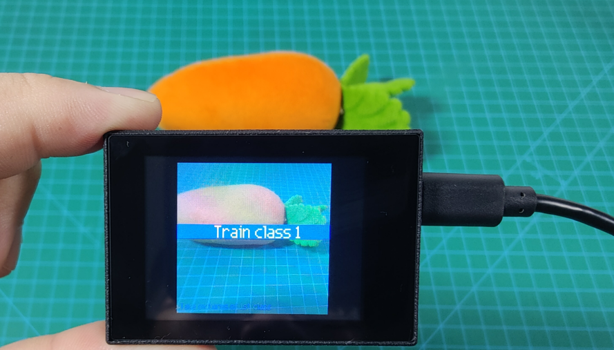

# 6. AI Vision Games

## 6.1 Color Acquisition and Recognition

### 6.1.1 Game Introduction

In this lesson, program the WonderMV vision module to capture and recognize a single color and three colors respectively. When a color is recognized, it will be highlighted with a white box and cross.

Different K210 programs need to be loaded for single-color and three-color collection and recognition. The programs can be found in the same folder as this lesson.


### 6.1.2 Getting Ready

* **Device Connection**

Connect the vision module to a computer with a Type-C data cable.


* **Download and Run Program**

[Source Code](../_static/source_code/AI_Vision_Games.zip)

(1) Double-click the icon to open the software.

(2) Click the icon in the bottom left corner.

(3) Select the corresponding serial port number. Check **"Advanced Settings"**, and select **"Mode-3"**.


(4) Click **"OK"** and wait for the connection to be completed.


(5) After the connection is successful, the **"CanMV IDE"** displays the icon in the bottom left corner.

(6) If the connection takes more than 10 seconds, it indicates a connection failure. Click **"Cancel"**, and a pop-up window shown below appears. Click **"OK"** and re-check the connection.


:::{Note}

* The selected serial port number is wrong. Please unplug other serial ports connected to your PC. Try the above steps again to select the correct serial port number.

* The cable used for the connection is not a data cable. Use a Type-C data cable that supports data transmission. A Type-C data cable is included in the package before delivery.

* Other K210 firmware is flashed. Reflash the factory firmware, and then proceed with the connection.
:::

There are two ways to run K210 programs: online and offline.

(1) Online operation:

After connecting successfully, drag the program under the same folder as this lesson to the code editor area of **"CanMV IDE"**. Click the icon at the bottom left corner to run the program online.

:::{Note}
Programs run in this way will be lost when the connection is disconnected or the device is shut down. They will not be saved on the K210 vision module.
:::


(2) Offline operation:

① After connecting, drag the program under the same directory to the **"CanMV IDE"** code editing area. Click **"Tools"** on the toolbar. Select **"Save open script to CanMV Cam (as main.py)"**.


② Click **"Yes"**.


③ Once the writing is successful, a window shown below will appear. Click **"OK"**. This saves the MicroPython file into the K210 Vision Module.


By downloading in this way, after powering on the K210 Vision Module without connecting, it will run the MicroPython file, enabling offline operation.

### 6.1.3 Notes

(1) The colors to be learned should be bright and highly saturated, such as pure red, green, and blue. For more details about learning colors, please refer to the following sections.

(2) The colors to be learned should significantly differ from the color of the background. For example, avoid yellow background when using yellow.

(3) Avoid learning colors such as white and mixed colors. Ensure adequate ambient lightness. If the lightness is insufficient, turn on fill light.

(4) Adjust the lighting to make the white frame stable; and adjust the angle to ensure that the color to be recognized is fully covered inside the white frame.

### 6.1.4 Program Outcome

After the program is successfully downloaded, place the object to be learned and recognized under the camera. Take a red block as an example.

(1) Move the red block into the white box. The area inside the box is for color learning.


(2) Click the **"K1"** button on the module. Align the green box that appears with the object to be learned and recognized. The area inside the box is for color learning.


(3) After the learning is successful, the green box will disappear. The recognized red object will be outlined with a white box and a cross.


If you want to change the recognition color, restart the K210 module to learn the new color again. If you need to learn multiple colors (up to three colors are supported), download or run the program **"multi_color_recognition"** under the same directory as this lesson. The learning method is the same as described above.

### 6.1.5 Program Analysis

[Source Code](../_static/source_code/AI_Vision_Games.zip)

For the implementation logic of the program, you can refer to the following flowchart.


(1) Load the relevant libraries, among which the `hw_key` module is a library used for button control.

{lineno-start=13}
```python
import sensor
import image
import time
import lcd

#载入按键控制模块(load button control module)
from hiwonder import hw_key
```

(2) Initialize the LCD screen. Restart and configure the camera module. Set the pixel mode to `RGB565` and image size to `QVGA`.

{lineno-start=21}
```python
#初始化LCD(initialize LCD)
lcd.init()
#以下是初始化传感器(initialize sensors)
sensor.reset()
sensor.set_pixformat(sensor.RGB565)
sensor.set_framesize(sensor.QVGA)
sensor.skip_frames(time = 100)
```

(3) Create an object of frame rate clock. It is used to calculate the frame rate.

{lineno-start=30}
```python
#帧率时钟(frame rate clock)
clock = time.clock()
```

(4) Wait for the button to be pressed, and display the image.

{lineno-start=41}
```python
#显示图像，等待按键按下(display images and wait for the button to be pressed)
while (state == 0):
    state = key.key_scan(1)
    img = sensor.snapshot()
    img.draw_rectangle(r)
    lcd.display(img)
```

(5) Initialize storage variables for color learning.

{lineno-start=52}
```python
#第一次赋值(initial assignment)
img = sensor.snapshot()
hist = img.get_histogram(roi=r)
lo = hist.get_percentile(0.01) #获得直方图在1%范围内的CDF(根据需要调整)!(Obtain the CDF of the histogram within a 1% range (adjust as needed)!)
hi = hist.get_percentile(0.99) #获得直方图在99%范围内的CDF(根据需要调整)!(Obtain the CDF of the histogram within a 99% range (adjust as needed)!)
threshold[0] = (threshold[0] + lo.l_value()) // 2
threshold[1] = (threshold[1] + hi.l_value()) // 2
threshold[2] = (threshold[2] + lo.a_value())
threshold[3] = (threshold[3] + hi.a_value())
threshold[4] = (threshold[4] + lo.b_value())
threshold[5] = (threshold[5] + hi.b_value())
```

(6) Continuously collect image color data of the center box, with a finer threshold. Only collect color data of the center box.

{lineno-start=66}
```python
#连续捕捉了50张图像学习阶段(A continuous capture of 50 images during the learning phase)
for i in range(50):
    img = sensor.snapshot()
    hist = img.get_histogram(roi=r)
    lo = hist.get_percentile(0.01) #获得直方图在1%范围内的CDF(根据需要调整)!(Obtain the CDF of the histogram within a 1% range (adjust as needed)!)
    hi = hist.get_percentile(0.99) #获得直方图在99%范围内的CDF(根据需要调整)!(Obtain the CDF of the histogram within a 99% range (adjust as needed)!)
    #以百分位数表示的平均值(the average represented in percentiles)
    threshold[0] = (threshold[0] + lo.l_value()) // 2
    threshold[1] = (threshold[1] + hi.l_value()) // 2
    threshold[2] = (threshold[2] + lo.a_value()) // 2
    threshold[3] = (threshold[3] + hi.a_value()) // 2
    threshold[4] = (threshold[4] + lo.b_value()) // 2
    threshold[5] = (threshold[5] + hi.b_value()) // 2
    #将识别区域用方框圈出来(enclose the recognized regions within bounding boxes)
    for blob in img.find_blobs([threshold], pixels_threshold=100, area_threshold=100, merge=True, margin=10):
        img.draw_rectangle(blob.rect())
        img.draw_cross(blob.cx(), blob.cy())
        img.draw_rectangle(r, color=(0,255,0))
    lcd.display(img)
```

(7) Enter a `while` loop: retrieve the camera image, perform color recognition, and highlight the recognized area. Display the image on the LCD screen.

① While loop:

② The program enters an infinite loop and captures an image in each iteration.

③ Use the `find_blobs` method to traverse all defined color thresholds and recognize color blocks in the image.

④ For each recognized color, draw a rectangle, a cross, and display the color name next to it.

⑤ Display the processed image on the `LCD` and print the current frame rate.

{lineno-start=91}
```python
#loop
while(True):
    #用于计算帧率的函数，这里表示开始计时(The function is used for calculating frame rate, indicating the start of timing)
    clock.tick()
    #从传感器捕获一张图像(capture an image from the sensor)
    img = sensor.snapshot()
    #遍历图像中找到的颜色区块(iterate through the color blocks found in the image)
    for blob in img.find_blobs([threshold], pixels_threshold=100, area_threshold=100, merge=True, margin=10):
        #绘制矩形和十字标记(draw a rectangle and cross)
        img.draw_rectangle(blob.rect())
        img.draw_cross(blob.cx(), blob.cy())
    #显示在LCD上(display on the LCD)
    lcd.display(img)
    #打印帧率(print the frame rate)
    print(clock.fps())

```

## 6.2 Multiple Colors Recognition

### 6.2.1 Game Introduction

In this program, the color thresholds have been predefined. It can directly recognize five colors: red, green, blue, yellow, and purple without the need of learning. When these five colors are recognized, they will be highlighted with boxes and labeled with the corresponding color.


### 6.2.2 Getting Ready

* **Device Connection**

Connect the K210 vision module to a computer with a Type-C data cable.


* **Download and Run Program**

[Source Code](../_static/source_code/AI_Vision_Games.zip)

(1) Double-click the icon to open the software.

(2) Click the icon in the bottom left corner.

(3) Select the corresponding serial port number. Check **"Advanced Settings"**, and select **"Mode-3"**.


(4) Click **"OK"** and wait for the connection to be completed.


(5) After the connection is successful, the **"CanMV IDE"** displays the icon in the bottom left corner.

(6) If the connection takes more than 10 seconds, it indicates a connection failure. Click **"Cancel"**, and a pop-up window shown below appears. Click **"OK"** and re-check the connection.


:::{Note}

* The selected serial port number is wrong. Please unplug other serial ports connected to your PC. Try the above steps again to select the correct serial port number.
* The cable used for the connection is not a data cable. Use a Type-C data cable that supports data transmission. A Type-C data cable is included in the package before delivery.
* Other K210 firmware is flashed. Reflash the factory firmware, and then proceed with the connection.
:::

There are two ways to run K210 programs: online and offline.

**Online operation:**

After connecting successfully, drag the program under the same folder as this lesson to the code editor area of **"CanMV IDE"**. Click the icon at the bottom left corner to run the program online.

:::{Note}
Programs run in this way will be lost when the connection is disconnected or the device is shut down. They will not be saved on the K210 vision module.
:::


**Offline operation:**

① After connecting, drag the program under the same directory to the **"CanMV IDE"** code editing area. Click **"Tools"** on the toolbar. Select **"Save open script to CanMV Cam (as main.py)"**.


② Click **"Yes"**.


③ Once the writing is successful, a window shown below will appear. Click **"OK"**. This saves the MicroPython file into the K210 Vision Module.


By downloading in this way, after powering on the K210 Vision Module without connecting, it will run the MicroPython file, enabling offline operation.

### 6.2.3 Notes

(1) The colors to be learned should be bright and highly saturated, such as pure red, green, and blue. For more details about learning colors, please refer to the following sections.

(2) Adjust the lighting to make the white frame stable; and adjust the angle to ensure that the color to be recognized is fully covered inside the white frame.

### 6.2.4 Program Outcome

The program in the tutorial has already written the color thresholds for the five colors **"red, green, blue, yellow, and purple"**. After the program runs, you can place objects of these five colors within the recognition range of the K210 vision module. The K210 vision module will highlight the recognized objects with boxes, as shown in the following figure.


<p id="anchor_6_2_6"></p>

### 6.2.5 Program Analysis

[Source Code](../_static/source_code/AI_Vision_Games.zip)

For the implementation logic of the program, you can refer to the following flowchart.


(1) Load the relevant libraries, including `sensor`, `image`, `time`, and `LCD`.

{lineno-start=10}
```python
import sensor
import image
import time
import lcd
```

(2) Initialize the LCD screen. Restart and set up the camera module. Set the pixel mode to `RGB565` and the image size to `QVGA`. Turn off automatic gain and automatic white balance.

{lineno-start=15}
```python
#初始化LCD(initialize LCD)
lcd.init()
#以下是初始化传感器(initialize sensors)
sensor.reset()
sensor.set_pixformat(sensor.RGB565)
sensor.set_framesize(sensor.QVGA)
sensor.skip_frames(time = 100)
sensor.set_auto_gain(False)
sensor.set_auto_whitebal(False)xxxxxxxxxx paste source code here.#初始化LCD(initialize LCD)lcd.init()#以下是初始化传感器(initialize sensors)sensor.reset()sensor.set_pixformat(sensor.RGB565)sensor.set_framesize(sensor.QVGA)sensor.skip_frames(time = 100)sensor.set_auto_gain(False)sensor.set_auto_whitebal(False)
```

(3) Create a frame rate clock object for frame rate calculation.

{lineno-start=24}
```python
#帧率时钟(frame rate clock)
clock = time.clock()
```

(4) Set the `LAB` threshold values used to recognize different colors. Store the `LAB` threshold values for the five colors. Define color strings for displaying the name of the recognized color.

{lineno-start=31}
```python
# 储存6种颜色的LAB阈值(store the LAB threshold of the six colors)
color_thresholds = [
    (20,80,20,62,20,35), # Red
    (14, 61, -39, -6, 0, 14),  # Green
    (21,50,-7,8,-35,-11), # Blue
    (65, 78, -10, -5, 38, 50),     # Yellow
    (20, 50, 17, 37, -34, -14),      # purple
]

color_strings = ['Red', 'Green', 'Blue', 'Yellow', 'purple']
```

(5) Enter the `while` loop to perform multi-color recognition. The program logic is as follows:

① While loop:

② The program enters an infinite loop and captures an image in each iteration.

③ Use the `find_blobs` method to traverse all defined color thresholds and recognize color blocks in the image.

④ For each recognized color, draw a rectangle, a cross, and display the color name next to it.

⑤ Display the processed image on the `LCD` and print the current frame rate.

{lineno-start=44}
```python
#loop
while True:
    #用于计算帧率的函数，这里表示开始计时(The function is used for calculating frame rate, indicating the start of timing)
    clock.tick()
    #从传感器捕获一张图像(capture an image from the sensor)
    img = sensor.snapshot()
    #遍历多种颜色(iterate through multiple colors)
    for color_idx, threshold in enumerate(color_thresholds):
        #遍历图像中找到的颜色区块(iterate through the color blocks found in the image)
        blobs = img.find_blobs([threshold], pixels_threshold=100, area_threshold=100, merge=True, margin=10)
        #是否找到(whether the target is found)
        if blobs:
            #画方框(draw box)
            for blob in blobs:
                color_new = (255 , 255,255)
                if color_idx == 0 :
                    color_new = (255 , 0,0)
                elif color_idx == 1:
                    color_new = ( 0,255 ,0)
                elif color_idx == 2:
                    color_new = ( 0,0,255)
                img.draw_rectangle(blob.rect(), color=color_new,thickness = 3)
                img.draw_cross(blob.cx(), blob.cy(), color=color_new)
                img.draw_string(blob.cx() + 10, blob.cy() - 10, color_strings[color_idx], color=color_new)
    #显示在LCD上(display on the LCD)
    lcd.display(img)
    #打印帧率(print the frame rate)
    print(clock.fps())

```

### 6.2.6 Function Extension

* **Add new colors for recognition**

If you want to add new colors for recognition, you can add the `LAB` threshold values for the desired color in step (3) of the [6.2.5 Program Analysis](#anchor_6_2_6).

* **Obtain the LAB threshold of the color to be added**

If you want to obtain the `LAB` threshold values for a new color, you can use the **"CanMV IDE"**.

(1) Double-click to open the **"CanMV IDE"**. Click **"Tool"** → **"Machine Vision"** → **"Threshold Editor"** to select the threshold editor tool.


(2) Click **"Image File"**.


(3) Choose an image containing the color you want to add. It's best to choose an image with a clean background and no other color interference.


(4) Adjust the slider until the color area is all white and the other areas are black. Then, record the `LAB` threshold values obtained.


## 6.3 Barcode Recognition

### 6.3.1 Game Introduction

A barcode is a symbol composed of lines and spaces that are combined according to a certain coding rule to represent information such as letters and numbers.

Common barcodes consist of parallel lines of black bars and white spaces with a large difference in reflectivity. Barcodes can indicate many pieces of information about a product, such as the country of origin, manufacturer, production date, book classification number, and start and end points of mail. Therefore, it is widely used in many fields, such as product circulation, library management, postal management, and banking systems.

In this section, the K210 visual module is used to recognize barcodes on the captured image, draw boxes around the recognized barcodes, and display the barcode information on the LCD screen.

### 6.3.2 Getting Ready

* **Device Connection**

Connect the K210 vision module to a computer with a Type-C data cable.


* **Download and Run Program**

[Source Code](../_static/source_code/AI_Vision_Games.zip)

(1) Double-click the icon to open the software.

(2) Click the icon in the bottom left corner.

(3) Select the corresponding serial port number. Check **"Advanced Settings"**, and select **"Mode-3"**.


(4) Click **"OK"** and wait for the connection to be completed.


(5) After the connection is successful, the **"CanMV IDE"** displays the icon in the bottom left corner.

(6) If the connection takes more than 10 seconds, it indicates a connection failure. Click **"Cancel"**, and a pop-up window shown below appears. Click **"OK"** and re-check the connection.


:::{Note}

* The selected serial port number is wrong. Please unplug other serial ports connected to your PC. Try the above steps again to select the correct serial port number.
* The cable used for the connection is not a data cable. Use a Type-C data cable that supports data transmission. A Type-C data cable is included in the package before delivery.
* Other K210 firmware is flashed. Reflash the factory firmware, and then proceed with the connection.
:::

There are two ways to run K210 programs: online and offline.

**Online operation:**

After connecting successfully, drag the program under the same folder as this lesson to the code editor area of **"CanMV IDE"**. Click the icon at the bottom left corner to run the program online.

:::{Note}
Programs run in this way will be lost when the connection is disconnected or the device is shut down. They will not be saved on the K210 vision module.
:::


**Offline operation:**

① After connecting, drag the program under the same directory to the **"CanMV IDE"** code editing area. Click **"Tools"** on the toolbar. Select **"Save open script to CanMV Cam (as main.py)"**.


② Click **"Yes"**.


③ Once the writing is successful, a window shown below will appear. Click **"OK"**. This saves the MicroPython file into the K210 Vision Module.


By downloading in this way, after powering on the K210 Vision Module without connecting, it will run the MicroPython file, enabling offline operation.

### 6.3.3 Notes

(1) Please keep an appropriate distance between the barcode and the module, making it within the module's recognition range. If the barcode is too far away from the K210 module or too small in the captured image, the module may not be able to recognize it.

(2) The area near the barcode should ideally have a white background or be fully white. A dark background may make it difficult for the K210 module to recognize the barcode.

(3) As the K210 chip does not have a built-in Chinese character library, Chinese characters cannot be displayed in the recognized barcode information.

(4) Due to limitations in the display screen size, custom-created barcode content should not exceed 25 numbers or letters. Otherwise, the entire barcode content may not be displayed on the screen.

### 6.3.4 Program Outcome

Place the barcode within the field of view of the K210 module. Once the target barcode is detected, it will be highlighted with a green box. The content of the barcode will be displayed in purple text at the upper left corner of the box.


### 6.3.5 Program Analysis

[Source Code](../_static/source_code/AI_Vision_Games.zip)

For the implementation logic of the program, you can refer to the following flowchart.


(1) Load the camera module for capturing images;

① load the image module for barcode processing and buffering;

② load the time module for frame rate calculation;

③ load the math module for necessary mathematical calculations;

④ and load the LCD module library for displaying images on the LCD screen.

{lineno-start=10}
```python
import sensor
import image
import time
import math
import lcd
```

(2) Initialize the LCD screen. Restart and set up the camera module by setting the pixel mode to `RGB565`, the image size to `QVGA`. Skip the first 100 images before program execution. Set the camera to automatically adjust the gain for light sensitivity.

{lineno-start=17}
```python
#初始化LCD(initialize LCD)
lcd.init()
#以下是初始化传感器(initialize sensors)
sensor.reset()
sensor.set_pixformat(sensor.RGB565)
sensor.set_framesize(sensor.QVGA)
sensor.skip_frames(time = 100)
sensor.set_auto_gain(True)
```

(3) Create a frame rate clock for measuring the frame rate.

{lineno-start=26}
```python
#帧率时钟(frame rate clock)
clock = time.clock()
```

(4) Enter the `while` loop, which continuously recognizes barcodes from camera images.

{lineno-start=31}
```python
#loop
while True:
```

(5) Start the timer for frame rate computation.

{lineno-start=33}
```python
    #用于计算帧率的函数，这里表示开始计时(The function is used for calculating frame rate, indicating the start of timing)
    clock.tick()
```

(6) Capture an image from the camera using the `snapshot()` function. Detect barcodes in the image using the `find_barcodes()` function from the image module.

{lineno-start=35}
```python
    #获取传感器图像(obtain sensor image)
    img = sensor.snapshot()
    #尝试从图像中识别条形码(try to recognize the barcode from the image)
    barcodes = img.find_barcodes()
```

(7) If a barcode is detected, select the whole barcode region and draw relevant data.

{lineno-start=40}
```python
    if barcodes:
        for code in barcodes:
            img.draw_rectangle(code.rect(), color=(0, 255, 0))
            img.draw_string(code.x(), code.y(),"%s"%(code.payload()), color=(255, 0, 255),scale=2)
            print(code)
```

(8) Display the processed image on the LCD screen and print the frame rate.

{lineno-start=45}
```python
    #在LCD上显示处理后的图像(display the processed image on the LCD)
    lcd.display(img)
    #打印帧率(print the frame rate)
    #print(clock.fps())
```

### 6.3.6 Function Extension

* **Method for creating the custom barcode**

For creating custom barcodes, you can use the following website:<https://www.wetools.com/barcode#/_blank>

Access the website from a browser. Input the desired barcode content in the **"Barcode Content"** field. Click the **"Generate Barcode"** button to generate the corresponding barcode. You can choose to **"Save to Local"** or **"Print"** the barcode.


## 6.4 QR Code Recognition

### 6.4.1 Game Introduction

In this lesson, program the WonderMV to recognize the `QR Code` and draw a box around the detected `QR Code` region and display it on the `LCD` screen.

The `QR Code` recognition feature can detect and display `QR Codes` in the image, as well as retrieve data regarding the contents of the code and its position on the screen through the `I2C` interface. `QR Codes` are matrix two-dimensional codes developed by Denso in September 1994, which have the advantages of high information capacity and reliability that one-dimensional and other two-dimensional codes also have.

`QR Codes` are widely used in commercial activities, particularly in high-tech industries, storage and transportation, wholesale and retail industries, among others requiring low-cost and efficient ways of marking information related to goods.

### 6.4.2 Getting Ready

* **Device Connection**

Connect the K210 vision module to a computer with a Type-C data cable.


* **Download and Run Program**

[Source Code](../_static/source_code/AI_Vision_Games.zip)

(1) Double-click the icon to open the software.

(2) Click the icon in the bottom left corner.

(3) Select the corresponding serial port number. Check **"Advanced Settings"**, and select **"Mode-3"**.


(4) Click **"OK"** and wait for the connection to be completed.


(5) After the connection is successful, the **"CanMV IDE"** displays the icon in the bottom left corner.

(6) If the connection takes more than 10 seconds, it indicates a connection failure. Click **"Cancel"**, and a pop-up window shown below appears. Click **"OK"** and re-check the connection.


:::{Note}

* The selected serial port number is wrong. Please unplug other serial ports connected to your PC. Try the above steps again to select the correct serial port number.
* The cable used for the connection is not a data cable. Use a Type-C data cable that supports data transmission. A Type-C data cable is included in the package before delivery.
* Other K210 firmware is flashed. Reflash the factory firmware, and then proceed with the connection.
:::

There are two ways to run K210 programs: online and offline.

**Online operation:**

After connecting successfully, drag the program under the same folder as this lesson to the code editor area of **"CanMV IDE"**. Click the icon at the bottom left corner to run the program online.

:::{Note}
Programs run in this way will be lost when the connection is disconnected or the device is shut down. They will not be saved on the K210 vision module.
:::


**Offline operation:**

① After connecting, drag the program under the same directory to the **"CanMV IDE"** code editing area. Click **"Tools"** on the toolbar. Select **"Save open script to CanMV Cam (as main.py)"**.


② Click **"Yes"**.


③ Once the writing is successful, a window shown below will appear. Click **"OK"**. This saves the MicroPython file into the K210 Vision Module.


By downloading in this way, after powering on the K210 Vision Module without connecting, it will run the MicroPython file, enabling offline operation.

### 6.4.3 Notes

(1) Please keep an appropriate distance between the `QR Code` and the WonderMV, making the module recognize and box it. If the distance between them is too far or the code is too small in the image, the vision module may not be able to recognize it properly.

(2) It's recommended that the area surrounding the `QR Code` be a white background or entirely white. A dark background may cause the K210 vision module to fail to recognize the `QR code`.

(3) The K210 chip does not have a built-in Chinese font library. If the content of the `QR code` includes Chinese characters, they cannot be displayed.

(4) Due to the limited screen size, custom `QR Code` content cannot exceed 25 numbers or letters. Otherwise, the content will not be displayed completely on the screen.

### 6.4.4 Program Outcome

Place the `QR Code` within the field of view of the K210 vision module. After the `QR code` is recognized, a green box will outline it. The content of the `QR Code` will be displayed in yellow font in the upper left corner of the box.


### 6.4.5 Program Analysis

[Source Code](../_static/source_code/AI_Vision_Games.zip)

For the implementation logic of the program, you can refer to the following flowchart.


(1) Load the required libraries for the relevant modules.

{lineno-start=10}
```python
import sensor
import image
import time
import lcd
```

(2) Initialize the LCD screen. Reboot the camera module. Set its pixel mode to `RGB565` and image size to `QVGA`.

{lineno-start=16}
```python
#初始化LCD(initialize LCD)
lcd.init()
#以下是初始化传感器(initialize sensors)
sensor.reset()
sensor.set_pixformat(sensor.RGB565)
sensor.set_framesize(sensor.QVGA)
sensor.skip_frames(time = 100)xxxxxxxxxx #初始化LCD(initialize LCD)lcd.init()#以下是初始化传感器(initialize sensors)sensor.reset()sensor.set_pixformat(sensor.RGB565)sensor.set_framesize(sensor.QVGA)sensor.skip_frames(time = 100)paste source code here.
```

(3) Create a clock object for frame rate calculation.

{lineno-start=23}
```python
#帧率时钟(frame rate clock)
clock = time.clock()
```

(4) Enter a `while` loop to continuously capture images and recognize `QR codes`. The program logic is as follows:

① While Loop:

② Capture an image in every iteration;

③ Use the `find_qrcodes` method to recognize `QR codes` in the image;

④ For each recognized `QR code`, draw a rectangle and display its content next to it;

⑤ Display the processed image on the `LCD`, and print the current frame rate.

{lineno-start=27}
```python
#loop
while(True):
    #用于计算帧率的函数，这里表示开始计时(The function is used for calculating frame rate, indicating the start of timing)
    clock.tick()
    #获取传感器图像(obtain sensor image)
    img = sensor.snapshot()
    qr_code = img.find_qrcodes()

    # 如果识别到二维码，处理识别结果(If the QR code is recognized, process the recognition result)
    if qr_code:
        for code in qr_code:
            img.draw_rectangle(code.rect(), color=(0, 255, 0),thickness=3)
            img.draw_string(code.x(), code.y(), code.payload(), color=(255, 255, 0),scale=2)
    #在LCD上显示处理后的图像(display the processed image on the LCD)
    lcd.display(img)
    #打印帧率(print the frame rate)
    print(clock.fps())
```

### 6.4.6 Function Extension

* **Custom QR code**

If you want to custom a `QR code`, the website <https://cli.im/text/other> can be used.

(1) Access the website from a browser. Input the content of the `QR code` to be created in the content box. Click **"Generate QR code"** to generate the corresponding `QR code`.


## 6.5 AprilTag Recognition

### 6.5.1 Game Introduction

In this lesson, the WonderMV will be programmed to box the information of the recognized `AprilTag` and display it on the screen.

`AprilTag` is a visual fiducial system, useful for a wide variety of tasks including augmented reality, robotics, and camera calibration. Targets can be created from an ordinary printer. The `AprilTag` detection software computes the precise 3D position, orientation, and identity of the tags relative to the camera.

For more details about `AprilTag`, please access the `AprilTag` official website at <https://april.eecs.umich.edu/software/apriltag.html#/_blank>.

### 6.5.2 Getting Ready

* **Device Connection**

Connect the K210 vision module to a computer with a Type-C data cable.


* **Download and Run Program**

[Source Code](../_static/source_code/AI_Vision_Games.zip)

(1) Double-click the icon to open the software.

(2) Click the icon in the bottom left corner.

(3) Select the corresponding serial port number. Check **"Advanced Settings"**, and select **"Mode-3"**.


(4) Click **"OK"** and wait for the connection to be completed.


(5) After the connection is successful, the **"CanMV IDE"** displays the icon in the bottom left corner.

(6) If the connection takes more than 10 seconds, it indicates a connection failure. Click **"Cancel"**, and a pop-up window shown below appears. Click **"OK"** and re-check the connection.


:::{Note}

* The selected serial port number is wrong. Please unplug other serial ports connected to your PC. Try the above steps again to select the correct serial port number.
* The cable used for the connection is not a data cable. Use a Type-C data cable that supports data transmission. A Type-C data cable is included in the package before delivery.
* Other K210 firmware is flashed. Reflash the factory firmware, and then proceed with the connection.
:::

There are two ways to run K210 programs: online and offline.

**Online operation:**

After connecting successfully, drag the program under the same folder as this lesson to the code editor area of **"CanMV IDE"**. Click the icon at the bottom left corner to run the program online.

:::{Note}
Programs run in this way will be lost when the connection is disconnected or the device is shut down. They will not be saved on the K210 vision module.
:::


**Offline operation:**

① After connecting, drag the program under the same directory to the **"CanMV IDE"** code editing area. Click **"Tools"** on the toolbar. Select **"Save open script to CanMV Cam (as main.py)"**.


② Click **"Yes"**.


③ Once the writing is successful, a window shown below will appear. Click **"OK"**. This saves the MicroPython file into the K210 Vision Module.


By downloading in this way, after powering on the K210 Vision Module without connecting, it will run the MicroPython file, enabling offline operation.

### 6.5.3 Notes

(1) There are 200 tags provided within the **"AprilTag Collection"**, which can be found in the same directory as this lesson. You do not need to download tag materials online.

(2) Please place the tag within the detection range of the WonderMV, and maintain an appropriate distance between them. If the tag is too far away from the vision module or too small in the image, the vision module cannot recognize it.

(3) The area next to the tag is better to have a white background or an all-white background. A dark background will make the K210 vision module unable to recognize it.

(4) This game will consume a lot of memory during operation. Therefore, the live camera feed of the K210 display may be relatively small. If there are black edges when running this game, it is normal.

### 6.5.4 Program Outcome

Place the `AprilTag` within the field of view of the K210 vision module. Once the `AprilTag` is recognized, it will be highlighted by a red box. A green cross will appear at the center of the code.


### 6.5.5 Program Analysis

[Source Code](../_static/source_code/AI_Vision_Games.zip)

For the implementation logic of the program, you can refer to the following flowchart.


(1) Load the libraries of the relevant modules.

{lineno-start=10}
```python
import sensor       #导入相机模块，用于图像采集(import the camera module for image acquisition)
import image        #导入图像处理模块，用于图像处理操作(import the image processing module for image processing)
import time         #导入时间模块，用于时间相关操作(import the time module for time-related operations)
import math         #导入数学模块，用于数学计算(import the math module for mathematical calculations)
import lcd          #导入LCD模块，用于图像显示(import the LCD module for image display)
```

(2) Initialize the LCD screen. Restart the camera module. Set its pixel mode to `RGB565` and image size to `QVGA`. Disable auto gain and auto white balance.

{lineno-start=17}
```python
#初始化LCD(initialize LCD)
lcd.init()
#以下是初始化传感器(initialize sensors)
sensor.reset()
sensor.set_pixformat(sensor.RGB565)
sensor.set_framesize(sensor.QQVGA)
#sensor.set_framesize(sensor.QVGA)
sensor.skip_frames(time = 100)
sensor.set_auto_gain(False)
sensor.set_auto_whitebal(False)
```

(3) Create a clock object for calculating the frame rate.

{lineno-start=27}
```python
#帧率时钟(frame rate clock)
clock = time.clock()
```

(4) Set the mask to specify the `AprilTag` to be recognized.

{lineno-start=31}
```python
#设置机器码掩码(set the AprilTag mask)
tag_families = 0
tag_families |= image.TAG16H5   # comment out to disable this family
tag_families |= image.TAG25H7   # comment out to disable this family
tag_families |= image.TAG25H9   # comment out to disable this family
tag_families |= image.TAG36H10  # comment out to disable this family
tag_families |= image.TAG36H11  # comment out to disable this family (default family)
tag_families |= image.ARTOOLKIT # comment out to disable this family
```

① AprilTag family name conversion function:

② Define the function `family_str` to convert the recognized `AprilTag` family into an easily readable string format.

{lineno-start=41}
```python
#机器码转换成字符串(convert the AprilTag to string)
def family_str(tag):
    if(tag.family() == image.TAG16H5):
        return "TAG16H5"
    if(tag.family() == image.TAG25H7):
        return "TAG25H7"
    if(tag.family() == image.TAG25H9):
        return "TAG25H9"
    if(tag.family() == image.TAG36H10):
        return "TAG36H10"
    if(tag.family() == image.TAG36H11):
        return "TAG36H11"
    if(tag.family() == image.ARTOOLKIT):
        return "ARTOOLKIT"
```

(5) Enter a `while` loop, repeatedly capture images, and recognize `AprilTag`. The program logic is as follows:

① While loop:

② Capture an image on each iteration.

③ Use the `find_apriltags` method to recognize the set `AprilTag` families.

④ For each recognized `AprilTag`, draw a red box and a green cross. Print out the `AprilTag`'s family name, `ID`, and rotation angle.

⑤ Display the processed image on the `LCD` screen and print the current frame rate.

{lineno-start=57}
```python
#loop
while(True):
    #用于计算帧率的函数，这里表示开始计时(The function is used for calculating frame rate, indicating the start of timing)
    clock.tick()
    #获取传感器图像(obtain sensor image)
    img = sensor.snapshot()

    #从图像中识别机器码(try to recognize the AprilTag from the image)
    for code in img.find_apriltags(families=tag_families):
        #绘制矩形和十字标记(draw a rectangle and cross)
        img.draw_rectangle(code.rect(), color = (255, 0, 0))
        img.draw_cross(code.cx(), code.cy(), color = (0, 255, 0))
        ##打印机器码 名称，ID，角度(print the name, ID, and angle of the AprilTag)
        print("%s, ID %d, rotation %f (degrees)" % (family_str(code),
                                                        code.id(),
                                                        (180 * code.rotation()) / math.pi) )

    #显示在LCD上(display the result on the LCD)
    lcd.display(img)
    #打印帧率(print the frame rate)
    print(clock.fps())
```

### 6.5.6 Function Extension

* **Custom the AprilTag content**

If you need to generate other `AprilTags`, you can use the tools in the **"CanMV IDE"**.

(1) Open the **"CanMV IDE"**. Click **"Tools"** → **"Machine Vision"** → **"AprilTag".** to select the required tags.


(2) Choose the required parts of the image, and click **"OK."**


(3) Select the location where the `AprilTag` image will be stored.


(4) Once the generation is complete, click **"OK"**. The generated `AprilTag` image can be found in the designated storage location.


## 6.6 KPU & Model Training Instruction

### 6.6.1 K210 Model Training and Importing

This lesson aims on how to train and import models through an online model training platform. The training for the model of garbage classification detection is used for demonstration.

* **Obtain DataSet**

(1) Create a folder named **"image"** in the SD card.


(2) Within the folder, create folders named **"1"** to **"12"**. Then, insert the SD card into the K210 module.


(3) Connect the K210 module to a PC with a Type-C data cable. Download the **"Dataset.py"** in the **"Dataset Obtaining Program"** located in the same path as this lesson onto the K210, and run the program.


(4) The image on the top left corner displays the current folder name and image number. Short pressing the **"K2"** button allows you to toggle between folders, while long pressing it can switch the K210's fill light on or off. Pressing the **"K1"** button will capture the current image and save it in the corresponding folder. When capturing photos, it is recommended to place the objects in a clean and well-lit environment. For better training results, try to capture as many photos as possible to use as training data.


(5) After collecting enough image data, power off the K210 and remove the SD card. Insert the SD card into a card reader and connect it to a computer. Rename the corresponding image folders with their respective tags.


(6) In the data collection program's code, there are three folders to save the captured images. Here, we will use the modification of saving images in five folders as an example. Add two more folders `4` and `5` in the code for the `K1` button.


(7) Change the variable that limits the number of folders in the code for the `K2` button to `5`.


* **Create Model Training Project**

(1) Enter the Canaan developer community model training to view the model training process.


(2) Click the **"Dataset"** on the left side. After entering the dataset creation interface, click **"Create dataset."**


(3) Enter the name of the dataset to be created, using waste classification detection as an example. The dataset is in **"Waste Classification Detection Dataset and Training Result"**, located in the same path as this lesson. Choose the type of labeling and click **"Submit"**. The K210 only supports image classification and object detection.

:::{Note}

* Image classification classifies only the category of the image;
* Object detection detects if the target to be detected exists in the image, and if so, selects the corresponding tag.
:::


(4) After creating the dataset, click the created dataset to enter the dataset image upload interface.


(5) Upload the sorted image files obtained from **"1. Obtain Dataset"**, and then click **"label"**. If there are already labeled data, please refer to the compression format instructions on the webpage and upload it in a compressed package.


(6) Click **"New label,"** enter a label name, and click **"OK"**. Select the contour of the target to be recognized in the image and then click **"Save label."**


(7) After completing the labeling of all images that need to be recognized, click **"Train."**


(8) Click **"Train"** on the right side to start training the model. After the model training is completed, the training results will be sent to the registered email, and the training log can be viewed in the training records.


* **Import Model**

(1) Unzip the training results and extract the test set, model, and image detection program files to your local computer.


(2) Place the `det.kmodel` model file from the training results into an SD card or use the `kflash_gui` in [Appendix → Burning Tools](Appendix.md) to download it to address `0x300000`.


(3) Open the `det.py` file using **"CanMV IDE"**. Change the data in **"labels"** in order to the values in **"label.txt."** Then, change the data in **"anchor"** to the second line value in **"anchor.txt"**. The `anchor` parameters are consistent with the model parameters and are fixed for the same model, determined during training. It cannot be set to other values.


(4) After setting the model file to be loaded from the SD card or flash, the size of the model needs to be filled in when loading from flash. If you are not sure of the model's size, you can right-click on the model file and click **"Properties"** to view it. In the code, the byte size needs to be filled in. In the example, the model is loaded from the SD card.


(5) After modifying the data according to the above steps, the code can be downloaded into the K210 board to achieve object classification detection.


<p id="anchor_6_2_6"></p>

### 6.6.2 KPU & Model Training Instruction

* **KPU Introduction**

The simple image processing functions introduced in the previous lessons, such as color collection recognition, barcode recognition, and `QR code` recognition, can be performed without `KPU`. However, more advanced machine vision functions, such as face, object, and number recognition, require the use of `KPU`.

`KPU` is one of the built-in hardware acceleration units in the K210 chip. It can be considered as the `GPU` of a computer and is capable of high-speed image calculation. The `KPU` can achieve the calculation of convolutional neural networks with a low-power consumption. It can obtain the size, coordinates, and category of the detected target in real time, enabling the detection and classification of faces or objects.

In addition, the `KPU` has the following characteristics:

① Support fixed-point models trained by mainstream training frameworks according to specific restrictions.

② No direct limit on the number of network layers. Each convolutional neural network layer parameter can be individually configured, including input/output channel numbers, input/output row and column widths, etc.

③ Supports two types of convolution kernels: `1x1` and `3x3`.

④ Supports any form of activation function.

⑤ The maximum size of the neural network parameters supported in real-time operation range from `5.5MiB` to `5.9MiB`.

⑥ The maximum size of network parameters supported in non-real-time operation depends on the flash memory capacity and software volume.

Currently, the `KPU` on the K210 mainly runs on the `YOLO` (You Only Look Once) target detection algorithm framework. It can be easily used through `micropython` encapsulation.

* **KPU Object**

(1) Construction function

`kpu = maix.KPU`

Create a `KPU` class to perform image calculations and obtain calculation results.

(2) Method for run model:

`kpu.load_kmodel("/sd/KPU/yolo_face_detect/yolo_face_detect.kmodel")`

① Load the model from the SD card. It is recommended to use the SD card to store the model to facilitate copying.

`file_path`: The file name of the model on the SD card, such as **"/sd/yolo_face_detect.kmodel"**.

`kpu.init_yolo2(anchor, anchor_num=9, img_w=320, img_h=240, net_w=320, net_h=256, layer_w=10, layer_h=8, threshold=0.75, nms_value=0.3, classes=1)`

For example: Passes initialization parameters to the `yolo2` network model, which is used for `yolo2` only.

 `anchor`: Anchor parameters that are consistent with the model parameters and are determined at the time of model training. This parameter is fixed and cannot be changed to other values for the same model.

 `anchor_num`: The number of anchor points for `anchor`. This parameter is fixed at `len(anchors)//2`, and the default value is `5`.

 `img_w`: The width of the input image, which determines the boundaries of the frame. If the image sent to `KPU` is expanded from a small-size image, this value can be set to the width of the original image, with a default value of `320`.

 `img_h`: The height of the input image, which determines the boundaries of the frame. If the image sent to `KPU` is expanded from a small-size image, this value can be set to the height of the original image, with a default value of `240`.

`net_w`: The width of the image required by the model, which is determined by the trained model with a default value of `320`.

 `net_h`: The height of the image required by the model, which is determined by the trained model and has a default value of `240`.

`layer_w`: The width of the model layer, which is determined by the trained model and has a default value of `10`.

`layer_h`: The height of the model layer, which is determined by the trained model and has a default value of `8`.

`threshold`: The probability threshold. Only when the probability of the object being detected is higher than this value, will the result be output. The value range is `[0,1]`, and the default value is `0.7`.

 `nms_value`: The `IOU` threshold of non-maximum suppression. It is used to prevent multiple frames from being drawn on the same object. If two frames are drawn on the same object, and the intersection area of the two frames accounts for less than this value, the frame with the highest probability will be chosen. The default value is `0.4`.

 `classes`: The number of target categories, which is determined by the trained model with a default value of `1`.

② Run `YOLO2` Network:

 `img`: The image captured from the sensor or the image file path.

 `getlist`: If `True`, it returns a float number list; if `False`, it returns an empty list. The default value is `False`.

`get_feature`: If `True`, it returns the normalized 256 floating-point feature values, which are used in the self-learning classification example. The default value is `False`.

`kpu.regionlayer_yolo2()`

③ Calculate the `YOLO2` and obtain the results.

It returns a two-dimensional list, where each sub-list represents a recognized object, and the object information list contains the following six pieces of data: `x`, `y`, `w`, `h`, representing the x and y coordinates of the upper left corner of the object frame, and the width and height of the frame; `class`: category index; `prob`: probability value, range: `[0,1]`.

For more information about `KPU` usage, you can refer to the official documentation provided in the following link:<https://developer.canaan-creative.com/canmv/main/canmv/library/canmv/maix/maix.KPU.html>

* **Model Training**

K210 Vision Module supports user-trained models. You can visit the Canaan official website for model training.

For information about model training tutorials, please refer to the link below:

Model Training Website: <https://developer.canaan-creative.com/model/training>


## 6.7 Face Detection

### 6.7.1 Game Introduction

This section mainly demonstrates on how to use the K210 vision module to detect face. First, the camera takes a photo of the face, then it recognizes whether there is a face in the photo. If there is a face, it is highlighted with a box and displayed on the LCD screen.

This program uses the KPU processor. For more details about the KPU processor, please refer to [6.6.2 KPU & Model Training Instruction](#anchor_6_2_6).

### 6.7.2 Getting Ready

* **Device Connection**

Connect the K210 vision module to a computer with a Type-C data cable.


* **Download and Run Program**

[Source Code](../_static/source_code/AI_Vision_Games.zip)

(1) Double-click the icon to open the software.

(2) Click the icon in the bottom left corner.

(3) Select the corresponding serial port number. Check **"Advanced Settings"**, and select **"Mode-3"**.


(4) Click **"OK"** and wait for the connection to be completed.


(5) After the connection is successful, the **"CanMV IDE"** displays the icon in the bottom left corner.

(6) If the connection takes more than 10 seconds, it indicates a connection failure. Click **"Cancel"**, and a pop-up window shown below appears. Click **"OK"** and re-check the connection.


:::{Note}

* The selected serial port number is wrong. Please unplug other serial ports connected to your PC. Try the above steps again to select the correct serial port number.
* The cable used for the connection is not a data cable. Use a Type-C data cable that supports data transmission. A Type-C data cable is included in the package before delivery.
* Other K210 firmware is flashed. Reflash the factory firmware, and then proceed with the connection.
:::

There are two ways to run K210 programs: online and offline.

**Online operation:**

After connecting successfully, drag the program under the same folder as this lesson to the code editor area of **"CanMV IDE"**. Click the icon at the bottom left corner to run the program online.

:::{Note}
Programs run in this way will be lost when the connection is disconnected or the device is shut down. They will not be saved on the K210 vision module.
:::


**Offline operation:**

① After connecting, drag the program under the same directory to the **"CanMV IDE"** code editing area. Click **"Tools"** on the toolbar. Select **"Save open script to CanMV Cam (as main.py)"**.


② Click **"Yes"**.


③ Once the writing is successful, a window shown below will appear. Click **"OK"**. This saves the MicroPython file into the K210 Vision Module.


By downloading in this way, after powering on the K210 Vision Module without connecting, it will run the MicroPython file, enabling offline operation.

### 6.7.3 Notes

(1) When performing face recognition, it is best to have a white background in the surrounding area or all-white background. This avoids interference on the recognition.

(2) This game can recognize multiple faces simultaneously.

### 6.7.4 Program Outcome

Place the face within the field of view of the K210 vision module. When the target is recognized, it will be highlighted with a green box. The upper left corner will display the frame rate of the live camera feed.


### 6.7.5 Program Analysis

[Source Code](../_static/source_code/AI_Vision_Games.zip)


(1) Load the required libraries, including the `KPU` module which is a library dedicated to model loading and processing.

{lineno-start=10}
```python
import sensor  #导入相机模块(import vision module)
import image   #导入图像处理模块(import image processing module)
import time    #导入时间模块(import time module)
import lcd     #导入 LCD 屏幕模块(import LCD screen module)
#加载KPU模块(load KPU module)
from maix import KPU
```

(2) Initialize the LCD screen. Restart the camera module. Set its pixel mode to `RGB565` and the image size to `QVGA`.

{lineno-start=18}
```python
#初始化LCD(initialize LCD)
lcd.init()
#以下是初始化传感器(initialize LCD)
sensor.reset()
sensor.set_pixformat(sensor.RGB565)
sensor.set_framesize(sensor.QVGA)
sensor.skip_frames(time = 100)
```

(3) Create a frame rate clock object for subsequent frame rate calculation.

{lineno-start=25}
```python
#帧率时钟(frame rate clock)
clock = time.clock()
```

(4) Create an image buffer object to store the camera's captured and processed images.

{lineno-start=28}
```python
#创建图像对象(create image object)
img_obj = image.Image(size=(320,256))
```

(5) Create the necessary parameters for the face detection model, which are fixed and cannot be changed.

{lineno-start=31}
```python
#创建锚框的尺寸列表，用于目标检测(create a list of anchor box sizes for target detection)
anchor = (0.893, 1.463, 0.245, 0.389, 1.55, 2.58, 0.375, 0.594, 3.099, 5.038, 0.057, 0.090, 0.567, 0.904, 0.101, 0.160, 0.159, 0.255)
```

(6) Create a `KPU` object and load the corresponding model file from the specified path.

{lineno-start=35}
```python
#创建 KPU 模型对象(create KPU model object)
kpu = KPU()

#加载 YOLO 目标检测模型文件（.kmodel 格式）(load YOLO target detection model file in .kmodel format)
kpu.load_kmodel("/sd/KPU/yolo_face_detect/yolo_face_detect.kmodel")
```

(7) Initialize the `YOLO` model parameters.

{lineno-start=41}
```python
#使用 init_yolo2 初始化 YOLO 模型参数(initialize YOLO model parameters using init_yolo2)
#anchor: 锚框的尺寸列表，用于目标检测(list of anchor box sizes for object detection)
#anchor_num: 锚框的数量(number of anchor boxes)
#img_w, img_h: 输入图像的宽度和高度(width and height of the input image)
#net_w, net_h: 模型输入的宽度和高度(width and height of the model input)
#layer_w, layer_h: 模型最终层的宽度和高度(width and height of the final layer of the model)
#threshold: 检测目标的置信度阈值(confidence threshold for detecting objects)
#nms_value: 非最大抑制的 IOU 阈值(IOU threshold for non-maximum suppression)
#classes: 目标类别数量(number of target classes)
kpu.init_yolo2(anchor, anchor_num=9, img_w=320, img_h=240, net_w=320, net_h=256, layer_w=10, layer_h=8, threshold=0.75, nms_value=0.3, classes=1)
```

The `init_yolo2()` function is used to initialize the `YOLO` model parameters, with the following parameters:

 `anchor`: a list of anchor box sizes used for object detection

 `anchor_num`: the number of anchor boxes

`img_w` and `img_h`: the width and height of the input image

 `net_w` and `net_h`: the width and height of the model's input

 `layer_w` and `layer_h`: the width and height of the final layer of the model

`threshold`: the confidence threshold for detecting objects

 `nms_value`: the `IOU` threshold for non-maximum suppression

 `classes`: the number of target classes

(8)  Enter a `while` loop to start recognizing images.

{lineno-start=55}
```python
    #loop
    while True:
```

(9) Start the timer for subsequent frame rate calculation.

{lineno-start=57}
```python
        clock.tick()  #计算每秒帧率(calculate the frame rate per second)
```

(10) Use the `snapshot()` function to obtain the camera image. Copy and preprocess the image, and recognize it with the previously loaded model.

{lineno-start=58}
```python
        img = sensor.snapshot()  #从相机获取图像(obtain image from camera)
        #将图像数据复制到 img_obj 对象中，以便传递给 KPU 运行(copy the image data to the img_obj object for passing it to the KPU for execution)
        img_obj.draw_image(img, 0, 0)
        img_obj.pix_to_ai()
        #使用 KPU 运行目标检测模型(use KPU to run the target detection model)
        kpu.run_with_output(img_obj)
```

(11) Get the detection results. If a face is detected, draw a box to mark the detected face.

{lineno-start=64}
```python
        #获取检测结果(obtain detection result)
        dect = kpu.regionlayer_yolo2()
        #计算帧率(calculate frame rate)
        fps = clock.fps()
        #如果检测到目标(if the target is detected)
        if len(dect) > 0:
            for l in dect:
                #在图像上绘制检测到的目标框(draw the detected target box on the image)
                img.draw_rectangle(l[0], l[1], l[2], l[3], color=(0, 255, 0))
        #在图像上显示帧率(display the frame rate on the image)
        img.draw_string(0, 0, "%2.1ffps" % (fps), color=(100, 150, 255), scale=2.0)
```

(12) Display the processed image on the LCD screen.

{lineno-start=75}
```python
        #在 LCD 上显示处理后的图像(display the processed image on the LCD)
        lcd.display(img)
```

(13) The final capture is to destroy the relevant processor resources after any program errors. This prevents the device from freezing.

{lineno-start=78}
```python
#捕获错误并处理(capture and process errors)
except Exception as e:
    raise e
finally:
    #若出现错误，则释放 KPU 资源(If there is an error, release the KPU resource)
    kpu.deinit()
```

## 6.8 Face Recognition

### 6.8.1 Game Introduction

In this section, the K210 vision module is used to recognize the learned face and select the recognized face with a box. The process involves capturing face image from the camera, learning the face information from the image, storing the facial data, and then capturing face image again. If a captured face matches a previously learned face, it will be displayed with a colored bounding box on the screen.

This program uses the KPU processor. For more details about the KPU processor, please refer to [6.6.2 KPU & Model Training Instruction](#anchor_6_2_6).

### 6.8.2 Getting Ready

* **Device Connection**

Connect the K210 vision module to a computer with a Type-C data cable.


* **Import Model File**

(1) Insert the TF card into the card reader on your computer. Import the **"KPU"** model folder directly into the TF card.


Insert the TF card back into the K210 vision module.

* **Download and Run Program**

[Source Code](../_static/source_code/AI_Vision_Games.zip)

(1) Double-click the icon to open the software.

(2) Click the icon in the bottom left corner.

(3) Select the corresponding serial port number. Check **"Advanced Settings"**, and select **"Mode-3"**.


(4) Click **"OK"** and wait for the connection to be completed.


(5) After the connection is successful, the **"CanMV IDE"** displays the icon in the bottom left corner.

(6) If the connection takes more than 10 seconds, it indicates a connection failure. Click **"Cancel"**, and a pop-up window shown below appears. Click **"OK"** and re-check the connection.


:::{Note}
* The selected serial port number is wrong. Please unplug other serial ports connected to your PC. Try the above steps again to select the correct serial port number.
* The cable used for the connection is not a data cable. Use a Type-C data cable that supports data transmission. A Type-C data cable is included in the package before delivery.
* Other K210 firmware is flashed. Reflash the factory firmware, and then proceed with the connection.
:::

There are two ways to run K210 programs: online and offline.

(1) Online operation:

After connecting successfully, drag the program under the same folder as this lesson to the code editor area of **"CanMV IDE"**. Click the icon at the bottom left corner to run the program online.

:::{Note}
Programs run in this way will be lost when the connection is disconnected or the device is shut down. They will not be saved on the K210 vision module.
:::


(2) Offline operation:

① After connecting, drag the program under the same directory to the **"CanMV IDE"** code editing area. Click **"Tools"** on the toolbar. Select **"Save open script to CanMV Cam (as main.py)"**.


② Click **"Yes"**.


③ Once the writing is successful, a window shown below will appear. Click **"OK"**. This saves the MicroPython file into the K210 Vision Module.


By downloading in this way, after powering on the K210 Vision Module without connecting, it will run the MicroPython file, enabling offline operation.

### 6.8.3 Notes

(1) This game can learn multiple faces. However, it is recommended to have only one face in the background during recognition. This avoids potential misrecognition.

(2) Please start the face learning process after the white box stabilizes within the LCD screen.

### 6.8.4 Program Outcome

(1) The vision module displays the message **"press key1 to regist face"** below, prompting you to register the face information. When the vision module identifies a face for the first time, it will select the face with a white box.


(2) Press the **"K1"** button on the vision module, allowing it to learn the currently recognized face. The module will simultaneously display the face number and the confidence score.


(3) If an unknown face is recognized, it will be indicated as **"unregistered"**.


(4) Pressing the **"K1"** button again will enable the learning process for the current face. The corresponding information below will be updated.


:::{Note}
Long pressing the **"K2"** button will clear the captured information. The object information needs to be learned again.
:::

### 6.8.5 Program Analysis

[Source Code](../_static/source_code/AI_Vision_Games.zip)

For the implementation logic of the program, you can refer to the following flowchart.


(1) Load the required libraries.

{lineno-start=11}
```python
#载入相关模块(load relevant models)
import sensor, image, time, lcd
import gc
from maix import KPU
from maix import GPIO, utils
from fpioa_manager import fm
from hiwonder import hw_uart
import time
import binascii
```

(2) Initialize the LCD screen. Restart the camera module. Set its pixel mode to `RGB565` and the image size to `QVGA`.

{lineno-start=22}
```python
#初始化LCD(initialize LCD)
lcd.init()
#以下是初始化传感器(initialize sensors)
sensor.reset()
sensor.set_pixformat(sensor.RGB565)
sensor.set_framesize(sensor.QVGA)
sensor.skip_frames(time = 100)
```

(3) Create a frame rate clock object for subsequent frame rate calculation.

{lineno-start=30}
```python
#帧率时钟(frame rate clock)
clock = time.clock()
```

(4) Configure the facial recognition parameters and load the models.

① Create an image object for feature extraction.

② Define the size of the face images and the coordinates of facial keypoints.

③ Initialize the parameters for the `YOLO` model and the face recognition model.

{lineno-start=34}
```python
# 创建一个64x64的图像对象，设置不拷贝到帧缓存(create a 64x64 image object without copying it to the frame buffer)
feature_img = image.Image(size=(64,64), copy_to_fb=False)
feature_img.pix_to_ai()

# 人脸图片的大小(the size of the face image)
FACE_PIC_SIZE = 64

# 人脸关键点坐标(the coordinates of the ficial keypoints)
dst_point =[(int(38.2946 * FACE_PIC_SIZE / 112), int(51.6963 * FACE_PIC_SIZE / 112)),
            (int(73.5318 * FACE_PIC_SIZE / 112), int(51.5014 * FACE_PIC_SIZE / 112)),
            (int(56.0252 * FACE_PIC_SIZE / 112), int(71.7366 * FACE_PIC_SIZE / 112)),
            (int(41.5493 * FACE_PIC_SIZE / 112), int(92.3655 * FACE_PIC_SIZE / 112)),
            (int(70.7299 * FACE_PIC_SIZE / 112), int(92.2041 * FACE_PIC_SIZE / 112)) ]

# YOLO模型的锚点和参数初始化(initialize YOLO model anchor points and parameters)
anchor = (0.1075, 0.126875, 0.126875, 0.175, 0.1465625, 0.2246875, 0.1953125, 0.25375, 0.2440625, 0.351875, 0.341875, 0.4721875, 0.5078125, 0.6696875, 0.8984375, 1.099687, 2.129062, 2.425937)
kpu = KPU()
kpu.load_kmodel("/sd/KPU/yolo_face_detect/face_detect_320x240.kmodel")
kpu.init_yolo2(anchor, anchor_num=9, img_w=320, img_h=240, net_w=320 , net_h=240 ,layer_w=10 ,layer_h=8, threshold=0.7, nms_value=0.2, classes=1)

# 加载人脸识别模型(load face recognition model)
ld5_kpu = KPU()
print("ready load model")
ld5_kpu.load_kmodel("/sd/KPU/face_recognization/ld5.kmodel")

# 加载特征提取模型(load feature extracting model)
fea_kpu = KPU()
print("ready load model")
fea_kpu.load_kmodel("/sd/KPU/face_recognization/feature_extraction.kmodel")
```

(5) Enter the `while` loop to perform face recognition. The program logic is as follows:

① While loop:

② Capture an image and perform face detection using the `KPU` model.

③ For each detected face, perform cropping, scaling, facial landmark detection, and feature extraction. Compare them with the recorded features.

④ Based on the identification result, draw corresponding rectangles and information on the image.

⑤ Display the processed image and the frame rate information.

{lineno-start=113}
```python
    #loop
    while True:
        # 手动触发垃圾回收(manually trigger waste collection)
        gc.collect()
        # print("mem free:",gc.mem_free())
        # print("heap free:",utils.heap_free())
        #从相机获取图像(obtain image from the camera)
        clock.tick()
        # 获取摄像头拍摄的图像(obtain the captured image from the camera)
        img = sensor.snapshot()
        # 使用KPU模型运行人脸检测(use the KPU model to run the face detection)
        kpu.run_with_output(img)
        # 获取人脸检测结果(obtain face detection result)
        dect = kpu.regionlayer_yolo2()
        # 获取帧率(obtain frame rate)
        fps = clock.fps()
```

{lineno-start=130}
```python
        # 如果有检测到人脸(if a face is detected)
        if len(dect) > 0:
            # 遍历(iterate)
            for l in dect :
```

{lineno-start=187}
```python
                if recog_flag: # 识别到(if the target is recognized)
                    img.draw_rectangle(l[0],l[1],l[2],l[3], color=(0, 255, 0))
```

{lineno-start=201}
```python
        lcd.display(img) # 显示图像(display image)
```

(6) Handle errors and release resources.

{lineno-start=203}
```python
#捕获错误并处理(capture errors and handle them)
except Exception as e:
    raise e
finally:
    #若出现错误，则释放 KPU 资源(If there is an error, release KPU resource)
    kpu.deinit()
    ld5_kpu.deinit()
    fea_kpu.deinit()	
```

## 6.9 Face Feature Recognition

### 6.9.1 Game Introduction

In this section, the program utilizes the `KPU+YOLO2` network. The main difference from the previous section is the use of two models for recognition: the face detection model and the model for detecting 68 facial keypoints. The program extracts facial features and overlays them on the recognized faces, displaying them on the LCD screen.

This program uses the KPU processor. For more details about the KPU processor, please refer to [6.6.2 KPU & Model Training Instruction](#anchor_6_2_6).

### 6.9.2 Getting Ready

* **Device Connection**

Connect the K210 vision module to a computer with a Type-C data cable.


* **Download and Run Program**

[Source Code](../_static/source_code/AI_Vision_Games.zip)

(1) Double-click the icon to open the software.

(2) Click the icon in the bottom left corner.

(3) Select the corresponding serial port number. Check **"Advanced Settings"**, and select **"Mode-3"**.


(4) Click **"OK"** and wait for the connection to be completed.


(5) After the connection is successful, the **"CanMV IDE"** displays the icon in the bottom left corner.

(6) If the connection takes more than 10 seconds, it indicates a connection failure. Click **"Cancel"**, and a pop-up window shown below appears. Click **"OK"** and re-check the connection.


:::{Note}
* The selected serial port number is wrong. Please unplug other serial ports connected to your PC. Try the above steps again to select the correct serial port number.
*  The cable used for the connection is not a data cable. Use a Type-C data cable that supports data transmission. A Type-C data cable is included in the package before delivery.
* Other K210 firmware is flashed. Reflash the factory firmware, and then proceed with the connection.
:::

There are two ways to run K210 programs: online and offline.

(1) Online operation:

After connecting successfully, drag the program under the same folder as this lesson to the code editor area of **"CanMV IDE"**. Click the icon at the bottom left corner to run the program online.

:::{Note}
Programs run in this way will be lost when the connection is disconnected or the device is shut down. They will not be saved on the K210 vision module.
:::


(2) Offline operation:

① After connecting, drag the program under the same directory to the **"CanMV IDE"** code editing area. Click **"Tools"** on the toolbar. Select **"Save open script to CanMV Cam (as main.py)"**.


② Click **"Yes"**.


③ Once the writing is successful, a window shown below will appear. Click **"OK"**. This saves the MicroPython file into the K210 Vision Module.


By downloading in this way, after powering on the K210 Vision Module without connecting, it will run the MicroPython file, enabling offline operation.

### 6.9.3 Notes

(1) It is recommended to maintain a distance of approximately 30cm between the target and the camera for optimal face recognition. Additionally, please avoid dim lighting conditions, and it's better to have a pure (white) background.

(2) This game can recognize multiple facial features. Please ensure that the background does not contain any distracting objects during the recognition. This avoids interference that may affect the accuracy of the recognition.

### 6.9.4 Program Outcome

After running the program, the frame rate of the live camera feed will be displayed in the top left corner of the LCD screen. Once a face is detected, the program will draw the facial features with 68 facial keypoints. The distribution of these 68 keypoints is as follows:

Eyebrows: Each eyebrow consists of 5 keypoints, uniformly sampled from the left border to the right border, totaling 10 keypoints (5 key points per eyebrow).

Eyes: Each eye consists of 6 key points, including the left and right borders, as well as the upper and lower eyelids, evenly sampled. This amounts to 12 key points (6 key points per eye).

Nose: The nose comprises of 9 keypoints, including 4 key points on the bridge of the nose and 5 keypoints on the tip of the nose.

Mouth: The mouth consists of 20 keypoints, encompassing the upper and lower lips, external boundaries, and internal boundaries, all evenly sampled. This corresponds to 20 keypoints (5 key points for each outer boundary, 3 key points for each internal boundary, and 2 key points for each lip corner).

Facial contour: The facial contour is evenly sampled with 17 keypoints.


### 6.9.5 Program Analysis

[Source Code](../_static/source_code/AI_Vision_Games.zip)

The program logic is shown below:


(1) Import the relevant libraries, including the `KPU` module, which is specifically designed for model loading and processing.

{lineno-start=10}
```python
import sensor  #导入相机模块(import vision module)
import image   #导入图像处理模块(import image processing module)
import time    #导入时间模块(import time module)
import lcd     #导入 LCD 屏幕模块(import LCD screen module)
#加载KPU模块(load KPU module)
from maix import KPU
```

(2) Initialize the LCD screen. Restart the camera module. Set its pixel mode to `RGB565` and the image size to `QVGA`.

{lineno-start=18}
```python
#初始化LCD(initialize LCD)
lcd.init()
#以下是初始化传感器(initialize sensors)
sensor.reset()
sensor.set_pixformat(sensor.RGB565)
sensor.set_framesize(sensor.QVGA)
sensor.skip_frames(time = 100)
```

(3) Create a frame rate clock object for subsequent frame rate calculation.

{lineno-start=25}
```python
#帧率时钟(frame rate clock)
clock = time.clock()
```

(4) Set the `YOLO` object detection model and the facial landmark detection model:

{lineno-start=28}
```python
#创建锚框的尺寸列表，用于目标检测(create a list of anchor box sizes for target detection)
anchor = (0.1075, 0.126875, 0.126875, 0.175, 0.1465625,
 0.2246875, 0.1953125, 0.25375, 0.2440625, 0.351875, 0.341875, 
 0.4721875, 0.5078125, 0.6696875, 0.8984375, 1.099687, 2.129062, 2.425937)

#创建 KPU 模型对象(create KPU model object)
kpu = KPU()

#加载 YOLO 目标检测模型文件（.kmodel 格式）(load YOLO target detection model file in .kmodel format)
kpu.load_kmodel("/sd/KPU/yolo_face_detect/face_detect_320x240.kmodel")
```

① Create a list of anchor sizes for the `YOLO` model, which is used for object detection.

② Load the `YOLO` face detection model and the model for detecting the 68 facial keypoints.

{lineno-start=39}
```python
#使用 init_yolo2 初始化 YOLO 模型参数(initialize YOLO model parameters using init_yolo2)
#anchor: 锚框的尺寸列表，用于目标检测(list of anchor box sizes for object detection)
#anchor_num: 锚框的数量(number of anchor boxes)
#img_w, img_h: 输入图像的宽度和高度(width and height of the input image)
#net_w, net_h: 模型输入的宽度和高度(width and height of the model input)
#layer_w, layer_h: 模型最终层的宽度和高度(width and height of the final layer of the model)
#threshold: 检测目标的置信度阈值(confidence threshold for detecting objects)
#nms_value: 非最大抑制的 IOU 阈值(IOU threshold for non-maximum suppression)
#classes: 目标类别数量(number of target classes)
kpu.init_yolo2(anchor, anchor_num=9, img_w=320, img_h=240, net_w=320 , net_h=240 ,layer_w=10 ,layer_h=8, threshold=0.7, nms_value=0.2, classes=1)


lm68_kpu = KPU()
print("ready load model")
#加载人脸特征检测模型文件（.kmodel 格式）用于进行人脸检测和 68 个关键点的检测(load the facial feature detection model file (.kmodel format) for performing face detection and detection of 68 facial keypoints)
lm68_kpu.load_kmodel("/sd/KPU/face_detect_with_68landmark/landmark68.kmodel")

```

(5) Enter the `while` loop to continuously perform facial feature recognition. The logic of the program is as follows:

① The `while` loop:

② Capture an image and use the `YOLO` model for face detection.

③ For each detected face, expand the bounding box and extract the face image.

④ Resize the face image and use the landmark detection model to extract 68 facial landmarks.

⑤ Draw the detected landmarks on the image.

⑥ Display the processed image and the frame rate information.

{lineno-start=86}
```python
    while True:
        clock.tick()  #计算每秒帧率(calculate the frame rate per second)
        img = sensor.snapshot()  #捕获摄像头图像(capture image from the camera)
        kpu.run_with_output(img) #使用KPU模型运行人脸检测(use KPU model to perform face detection)
        dect = kpu.regionlayer_yolo2()  #获取检测到的人脸框列表(obtain the list of detected face bounding boxes)
        fps = clock.fps()  #获取帧率(obtain frame rate)
```

{lineno-start=93}
```python
        if len(dect) > 0:
            #遍历检测到的人脸框(iterate through the detected face bounding boxes)
            for l in dect:
```

{lineno-start=108}
```python
                    img.draw_circle(x, y, 2, color=(0, 0, 255), fill=True)
```

{lineno-start=113}
```python
        #在图像上显示帧率(display the frame rate on the image)
        img.draw_string(0, 0, "%2.1ffps" % fps, color=(0, 60, 255), scale=2.0)
        lcd.display(img)  #在LCD上显示图像(display the image on the LCD)
```

(6) Handle error and release resource.

{lineno-start=117}
```python
#捕获错误并处理(capture and process errors)
except Exception as e:
    raise e
finally:
    #若出现错误，则释放 KPU 资源(If there is an error, release the KPU resource)
    kpu.deinit()
    lm68_kpu.deinit()
```

## 6.10 Mask Identification

### 6.10.1 Game Introduction

This game utilizes the `YOLO2` network combined with a mask detection model to recognize whether a face is wearing a mask or not. The mask wearing information is then displayed on the LCD screen.

The KPU processor is used in this program. For more details about the KPU processor, please refer to [6.6.2 KPU & Model Training Instruction](#anchor_6_2_6).

### 6.10.2 Getting Ready

* **Device Connection**

Connect the K210 vision module to a computer with a Type-C data cable.


* **Import Model File**

(1) Insert the TF card into the card reader on your computer. Import the **"KPU"** model folder directly into the TF card.


(2) Insert the TF card back into the K210 vision module.

* **Download and Run Program**

[Source Code](../_static/source_code/AI_Vision_Games.zip)

(1) Double-click the icon to open the software.

(2) Click the icon in the bottom left corner.

(3) Select the corresponding serial port number. Check **"Advanced Settings"**, and select **"Mode-3"**.


(4) Click **"OK"** and wait for the connection to be completed.


(5) After the connection is successful, the **"CanMV IDE"** displays the icon in the bottom left corner.

(6) If the connection takes more than 10 seconds, it indicates a connection failure. Click **"Cancel"**, and a pop-up window shown below appears. Click **"OK"** and re-check the connection.


:::{Note}

* The selected serial port number is wrong. Please unplug other serial ports connected to your PC. Try the above steps again to select the correct serial port number.
* The cable used for the connection is not a data cable. Use a Type-C data cable that supports data transmission. A Type-C data cable is included in the package before delivery.
* Other K210 firmware is flashed. Reflash the factory firmware, and then proceed with the connection.
:::

There are two ways to run K210 programs: online and offline.

**Online operation:**

After connecting successfully, drag the program under the same folder as this lesson to the code editor area of **"CanMV IDE"**. Click the icon at the bottom left corner to run the program online.

:::{Note}
Programs run in this way will be lost when the connection is disconnected or the device is shut down. They will not be saved on the K210 vision module.
:::


**Offline operation:**

① After connecting, drag the program under the same directory to the **"CanMV IDE"** code editing area. Click **"Tools"** on the toolbar. Select **"Save open script to CanMV Cam (as main.py)"**.


② Click **"Yes"**.


③ Once the writing is successful, a window shown below will appear. Click **"OK"**. This saves the MicroPython file into the K210 Vision Module.


By downloading in this way, after powering on the K210 Vision Module without connecting, it will run the MicroPython file, enabling offline operation.

### 6.10.3 Notes

(1) It is recommended to maintain a distance of approximately 4cm between the face and the camera for optimal face recognition.

(2) This game can recognize multiple targets and display the recognition result. Please ensure that the background does not contain any distracting objects during the recognition.

### 6.10.4 Program Outcome

(1) After running the program, the top left corner of the vision module's LCD screen will display the frame rate of the live camera feed. Place the face within the current image. If the recognized face is wearing a mask, it will be boxed in green, with the text **"with mask"** displayed above.


(2) If the recognized face is not wearing a mask, it will be boxed in red, with the text **"without mask"** displayed above.


### 6.10.5 Program Analysis

[Source Code](../_static/source_code/AI_Vision_Games.zip)

The program logic is shown below:


(1) Import the relevant libraries, including the `KPU` module, which is specifically designed for model loading and processing.

{lineno-start=10}
```python
import sensor  #导入相机模块(import vision module)
import image   #导入图像处理模块(import image processing module)
import time    #导入时间模块(import time module)
import lcd     #导入 LCD 屏幕模块(import LCD screen module)
#加载KPU模块(load KPU module)
from maix import KPU
```

(2) Initialize the LCD screen. Restart the camera module. Set its pixel mode to `RGB565` and the image size to `QVGA`.

{lineno-start=18}
```python
#初始化LCD(initialize LCD)
lcd.init()
#以下是初始化传感器(initialize sensors)
sensor.reset()
sensor.set_pixformat(sensor.RGB565)
sensor.set_framesize(sensor.QVGA)
sensor.skip_frames(time = 100)
```

(3) Create a frame rate clock object for subsequent frame rate calculation.

{lineno-start=25}
```python
#帧率时钟(frame rate clock)
clock = time.clock()
```

(4) Create anchor boxes and image object:

① Define a list of anchor box sizes for object detection.

② Create an image object for processing and displaying the image.

{lineno-start=28}
```python
#创建锚框的尺寸列表，用于目标检测(create a list of anchor box sizes for target detection)
anchor = (0.156250, 0.222548, 0.361328, 0.489583, 0.781250, 0.983133, 1.621094, 1.964286, 3.574219, 3.94000)

#创建图像对象(create image object)
img_obj = image.Image(size=(320,256), copy_to_fb=False)
```

(5) Initialize the `KPU` model:

① Create a `KPU` model object.

② Load the mask detection model file and initialize it using the `YOLO` model parameters.

{lineno-start=34}
```python
#创建 KPU 模型对象(create KPU model object)
kpu = KPU()

#加载口罩检测模型文件（.kmodel 格式）(load mask detection model file in .kmodel format)
kpu.load_kmodel("/sd/KPU/face_mask_detect/detect_5.kmodel")paste source code here.
```

{lineno-start=40}
```python
#使用 init_yolo2 初始化 YOLO 模型参数(initialize YOLO model parameters using init_yolo2)
#anchor: 锚框的尺寸列表，用于目标检测(list of anchor box sizes for object detection)
#anchor_num: 锚框的数量(number of anchor boxes)
#img_w, img_h: 输入图像的宽度和高度(width and height of the input image)
#net_w, net_h: 模型输入的宽度和高度(width and height of the model input)
#layer_w, layer_h: 模型最终层的宽度和高度(width and height of the final layer of the model)
#threshold: 检测目标的置信度阈值(confidence threshold for detecting objects)
#nms_value: 非最大抑制的 IOU 阈值(IOU threshold for non-maximum suppression)
#classes: 目标类别数量(number of target classes)
kpu.init_yolo2(anchor, anchor_num=5, img_w=320, img_h=240, net_w=320 , net_h=256 ,layer_w=10 ,layer_h=8, threshold=0.7, nms_value=0.4, classes=2)
```

(6) Enter the `while` loop to continuously detect face masks. The program logic is as follows:

① While loop:

② Capture an image, then copy the image to an image object and convert it to `KPU` format.

③ Use the `KPU` model to perform mask detection and obtain the detection results. Based on the detection results, determine if the face is wearing a mask. Box it in corresponding color and display the result above.

④ Display the processed image and frame rate information.

{lineno-start=53}
```python
    #loop
    while True:
        #计算每秒帧率(calculate the frame rate per second)
        clock.tick()
        #捕获摄像头图像(obtain image from camera)
        img = sensor.snapshot()
        #将图像复制到图像对象并转换像素为KPU格式(copy the image to an image object and convert the pixels to KPU format)
        img_obj.draw_image(img, 0, 0)
        img_obj.pix_to_ai()
        #运行KPU模型，获取检测结果(Run the KPU model and obtain detection result)
        kpu.run_with_output(img_obj)
```

{lineno-start=81}
```python
        #在LCD上显示图像(display the image on the LCD)
        lcd.display(img)xxxxxxxxxx #在LCD上显示图像(display the image on the LCD)  lcd.display(img)paste source code here.
```

(7) Create a `KPU` object and load the model file from the corresponding path.

{lineno-start=34}
```python
#创建 KPU 模型对象(create KPU model object)
kpu = KPU()

#加载口罩检测模型文件（.kmodel 格式）(load mask detection model file in .kmodel format)
kpu.load_kmodel("/sd/KPU/face_mask_detect/detect_5.kmodel")
```

(8) Handle error and release resource.

{lineno-start=86}
```python
#捕获错误并处理(capture and process errors)
except Exception as e:
    raise e
finally:
    #若出现错误，则释放 KPU 资源(If there is an error, release the KPU resource)
    kpu.deinit()
```

## 6.11 Object Recognition

### 6.11.1 Game Introduction

In this section, the K210 vision module will be used to detect 20 different objects. The recognized object will be boxed and annotated. The process involves capturing an image via the camera, then identifying if the image contains one of the 20 specified objects. If a specified object is detected, it will be selected with a bounding box and the result will be displayed on the LCD screen.

Currently, the object recognition system can identify the following 20 objects: airplane, bicycle, bird, boat, bus, car, cat, chair, cow, dining table, dog, motorcycle, person, potted plant, sofa, train, television, sheep, bottle, and horse.

The KPU processor is used in this program. For more details about the KPU processor, please refer to [6.6.2 KPU & Model Training Instruction](#anchor_6_2_6).

### 6.11.2 Getting Ready

* **Device Connection**

Connect the K210 vision module to a computer with a Type-C data cable.


* **Import Model File**

(1) Insert the TF card into the card reader on your computer. Import the **"KPU"** model folder directly into the TF card.


(2) Insert the TF card back into the K210 vision module.

* **Download and Run Program**

[Source Code](../_static/source_code/AI_Vision_Games.zip)

(1) Double-click the icon to open the software.

(2) Click the icon in the bottom left corner.

(3) Select the corresponding serial port number. Check **"Advanced Settings"**, and select **"Mode-3"**.


(4) Click **"OK"** and wait for the connection to be completed.


(5) After the connection is successful, the **"CanMV IDE"** displays the icon in the bottom left corner.

(6) If the connection takes more than 10 seconds, it indicates a connection failure. Click **"Cancel"**, and a pop-up window shown below appears. Click **"OK"** and re-check the connection.


:::{Note}

* The selected serial port number is wrong. Please unplug other serial ports connected to your PC. Try the above steps again to select the correct serial port number.
* The cable used for the connection is not a data cable. Use a Type-C data cable that supports data transmission. A Type-C data cable is included in the package before delivery.
* Other K210 firmware is flashed. Reflash the factory firmware, and then proceed with the connection.
:::

There are two ways to run K210 programs: online and offline.

**Online operation:**

After connecting successfully, drag the program under the same folder as this lesson to the code editor area of **"CanMV IDE"**. Click the icon at the bottom left corner to run the program online.

:::{Note}

Programs run in this way will be lost when the connection is disconnected or the device is shut down. They will not be saved on the K210 vision module.
:::


**Offline operation:**

① After connecting, drag the program under the same directory to the **"CanMV IDE"** code editing area. Click **"Tools"** on the toolbar. Select **"Save open script to CanMV Cam (as main.py)"**.


② Click **"Yes"**.


③ Once the writing is successful, a window shown below will appear. Click **"OK"**. This saves the MicroPython file into the K210 Vision Module.


By downloading in this way, after powering on the K210 Vision Module without connecting, it will run the MicroPython file, enabling offline operation.

### 6.11.3 Notes

(1) It is preferable to have a prominent and clear background for optimal object recognition. A pure background is better for the recognition.

(2) If the vision module fails to identify an object, please try to adjust the distance or angle during the process.

(3) The vision module can simultaneously detect multiple objects.

### 6.11.4 Program Outcome

Aim the K210 Vision Module at the specified object(s) to run the object recognition function, as shown in the following images:


Once the K210 Vision Module recognizes an object, it will highlight the target with a green bounding box. Additionally, the class name of the identified object will be displayed in the top left corner of the box. The table below provides a reference for the recognized object categories:

| Target Object | Recognition Result | Target Object | Recognition Result |
|:---:|:---:|:---:|:---:|
|  | bus |  | sheep |
|  | cat |  | motorbike |
|  | horse |  | bird |
|  | bottle |  | cow |
|  | sofa |  | potted |
|  | chair |  | dining table |
|  | TV monitor |  | dog |
|  | bicycle |  | aeroplane |
|  | boat |  | person |
|  | car |  | train |

### 6.11.5 Program Analysis

[Source Code](../_static/source_code/AI_Vision_Games.zip)

The program logic is shown below:


(1) Import the relevant libraries, including the `KPU` module, which is specifically designed for model loading and processing.

{lineno-start=10}
```python
import sensor  #导入相机模块(import vision module)
import image   #导入图像处理模块(import image processing module)
import time    #导入时间模块(import time module)
import lcd     #导入 LCD 屏幕模块(import LCD screen module)
#加载KPU模块(load KPU module)
from maix import KPU
```

(2) Initialize the LCD screen. Restart the camera module. Set its pixel mode to `RGB565` and the image size to `QVGA`.

{lineno-start=18}
```python
#初始化LCD(initialize LCD)
lcd.init()
#以下是初始化传感器(initialize sensors)
sensor.reset()
sensor.set_pixformat(sensor.RGB565)
sensor.set_framesize(sensor.QVGA)
sensor.skip_frames(time = 100)
```

(3) Create a frame rate clock object for subsequent frame rate calculation.

{lineno-start=25}
```python
#帧率时钟(frame rate clock)
clock = time.clock()
```

(4) The model used in this program can recognize 20 kinds of object tags.

{lineno-start=28}
```python
#物体名称(object name)
obj_name = ("aeroplane", "bicycle", "bird", "boat", "bottle", "bus", "car", "cat", "chair", "cow", "diningtable", "dog", "horse", "motorbike", "person", "potted", "sheep", "sofa", "train", "tvmonitor")
```

(5) Create an image buffer object to store the captured and processed images from the camera.

{lineno-start=31}
```python
#创建图像对象(create image object)
img_obj = image.Image(size=(320,256))
```

(6) Create the necessary parameters for the object detection model, which are fixed and cannot be changed.

{lineno-start=34}
```python
#创建锚框的尺寸列表，用于目标检测(create a list of anchor box sizes for target detection)
anchor = (1.3221, 1.73145, 3.19275, 4.00944, 5.05587, 8.09892, 9.47112, 4.84053, 11.2364, 10.0071)

```

(7) Create a `KPU` object and load the model file from the corresponding path.

{lineno-start=37}
```python
#创建 KPU 模型对象(create KPU model object)
kpu = KPU()

#加载物体检测模型文件（.kmodel 格式）(load object detection model file in .kmodel format)
kpu.load_kmodel("/sd/KPU/voc20_object_detect/voc20_detect.kmodel")
```

(8) Initialize `YOLO` model parameters.

{lineno-start=52}
```python
kpu.init_yolo2(anchor, anchor_num=5, img_w=320, img_h=240, net_w=320 , net_h=256 ,layer_w=10 ,layer_h=8, threshold=0.7, nms_value=0.2, classes=20)

```

① The function `init_yolo2()` initializes the `YOLO` model parameters.

② `anchor`: A list of anchor box sizes used in object detection.

③ `anchor_num`: The number of anchor boxes.

④ `img_w`, `img_h`: The width and height of the input image.

⑤ `net_w`, `net_h`: The width and height of the input model.

⑥ `layer_w`, `layer_h`: The width and height of the final layer in the model.

⑦ `threshold`: The confidence threshold for detecting objects.

⑧ `nms_value`: The `IOU` threshold for non-maximum suppression.

⑨ `classes`: The number of target classes.

(9) Enter the `while` loop to recognize images.

{lineno-start=56}
```python
    #loop
    while True:
```

(10) Start timing to calculate the following frame rate.

{lineno-start=58}
```python
        #计算每秒帧率(calculate the frame rate per second)
        clock.tick()
```

(11) Use the `snapshot()` function to capture an image from the camera. Make a copy of the image, and perform preliminary processing before passing it to the preloaded model for recognition.

{lineno-start=60}
```python
        #捕获摄像头图像(capture image from the camera)
        img = sensor.snapshot()
        #将图像复制到图像对象并转换像素为KPU格式(transfer the image to an image object and convert the pixels to KPU format)
        img_obj.draw_image(img, 0,0)
        img_obj.pix_to_ai()
        #运行KPU模型，获取检测结果(run KPU model to obtain the detection result)
        kpu.run_with_output(img_obj)
```

(12) Obtain the detection result. If any corresponding object is detected, draw a bounding box and label the detected object.

{lineno-start=67}
```python
        dect = kpu.regionlayer_yolo2()
        #计算帧率(calculate frame rate)
        fps = clock.fps()
        #如果检测到目标(if the target is detected)
        if len(dect) > 0:
            print("dect:",dect)
            #遍历(iterate through)
            for l in dect :
                #绘制检测框(draw detection box)
                img.draw_rectangle(l[0],l[1],l[2],l[3], color=(0, 255, 0))
                #绘制检测结果文字(display detection result)
                img.draw_string(l[0],l[1], obj_name[l[4]], color=(0, 255, 0), scale=1.5)
```

(13) Display the frame rate information and show the processed image on the LCD screen.

{lineno-start=79}
```python
        #绘制帧率信息(draw the frame rate information)
        img.draw_string(0, 0, "%2.1ffps" %(fps), color=(0, 60, 128), scale=2.0)
        #在LCD上显示图像(display the image on the LCD)
        lcd.display(img)
```

(14) The final capture is performed to destroy relevant processor resources in case of program execution errors, preventing device freezing.

{lineno-start=86}
```python
#捕获错误并处理(capture and process errors)
except Exception as e:
    raise e
finally:
    #若出现错误，则释放 KPU 资源(If there is an error, release the KPU resource)
    kpu.deinit()
```

## 6.12 Autonomous Learning and Classification

### 6.12.1 Game Introduction

In this program, autonomous learning classification is performed using the `KPU` neural network. Autonomous learning classification requires capturing multiple images of the same object, extracting the same features from these images, and then training the model to recognize and classify the object. Afterwards, the program compares the currently captured image with the recorded images to determine the similarity. Based on the similarity, it identifies the corresponding class and prints the relevant class name.

The KPU processor is used in this program. For more details about the KPU processor, please refer to [6.6.2 KPU & Model Training Instruction](#anchor_6_2_6).

### 6.12.2 Getting Ready

* **Device Connection**

Connect the K210 vision module to a computer with a Type-C data cable.


* **Import Model File**

(1) Insert the TF card into the card reader on your computer. Import the **"KPU"** model folder directly into the TF card.


(2) Insert the TF card back into the K210 vision module.

* **Download and Run Program**

[Source Code](../_static/source_code/AI_Vision_Games.zip)

(1) Double-click the icon to open the software.

(2) Click the icon in the bottom left corner.

(3) Select the corresponding serial port number. Check **"Advanced Settings"**, and select **"Mode-3"**.


(4) Click **"OK"** and wait for the connection to be completed.


(5) After the connection is successful, the **"CanMV IDE"** displays the icon in the bottom left corner.

(6) If the connection takes more than 10 seconds, it indicates a connection failure. Click **"Cancel"**, and a pop-up window shown below appears. Click **"OK"** and re-check the connection.


:::{Note}

* The selected serial port number is wrong. Please unplug other serial ports connected to your PC. Try the above steps again to select the correct serial port number.
* The cable used for the connection is not a data cable. Use a Type-C data cable that supports data transmission. A Type-C data cable is included in the package before delivery.
* Other K210 firmware is flashed. Reflash the factory firmware, and then proceed with the connection.
:::

There are two ways to run K210 programs: online and offline.

**Online operation:**

After connecting successfully, drag the program under the same folder as this lesson to the code editor area of **"CanMV IDE"**. Click the icon at the bottom left corner to run the program online.

:::{Note}
Programs run in this way will be lost when the connection is disconnected or the device is shut down. They will not be saved on the K210 vision module.
:::


**Offline operation:**

① After connecting, drag the program under the same directory to the **"CanMV IDE"** code editing area. Click **"Tools"** on the toolbar. Select **"Save open script to CanMV Cam (as main.py)"**.


② Click **"Yes"**.


③ Once the writing is successful, a window shown below will appear. Click **"OK"**. This saves the MicroPython file into the K210 Vision Module.


By downloading in this way, after powering on the K210 Vision Module without connecting, it will run the MicroPython file, enabling offline operation.

### 6.12.3 Notes

(1) During the learning process, if a reset operation is performed, such as a power interruption or long-pressing the **"K2"** button, the learned information will be cleared. It will be necessary to relearn the objects.

(2) If you want the vision module to learn multiple objects, the objects need have distinct differences. Otherwise, it may affect the recognition accuracy. It is advised to perform the learning process in a pure (white) background.

(3) This game can only recognize a single object at a time.Do not simultaneously place multiple objects within the field of view. This may impact the recognition accuracy.

### 6.12.4 Program Outcome

(1) Upon running the program, it enters the image initialization mode.


(2) Press the **"K2"** button to access to the training mode. Continuing to press the button can capture images. Each press captures one image, and a total of 5 images are needed for each group. After capturing the five images, the program proceeds to capture the next group. A total of 3 groups can be captured like this.




(3) Once the capturing process is completed, if a learned target is recognized, its assigned number and confidence level will be displayed in the bottom left corner.

The class: `1` represents the first class learned, and the score: `99.2` indicates the confidence level which ranges from 0 to 100. The higher the score, the closer to the learned target.


(4) During the capturing or recognition process, a long press of the **"K2"** button will reset the captured content and return to the initialization interface.


:::{Note}
Long pressing the **"K2"** button will clear the captured information. The object information needs to be learned again.
:::

### 6.12.5 Program Analysis

[Source Code](../_static/source_code/AI_Vision_Games.zip)

The program logic is shown below:


(1) Import the relevant libraries.

{lineno-start=1}
```python
import lcd
import sensor
import time
from maix import GPIO
from maix import KPU
from board import board_info
from fpioa_manager import fm
from image import Image
from hiwonder import hw_key
```

(2) Define state and event. Create enumerations for `STATE` and `EVENT` to manage the different states and triggered events of the state machine.

{lineno-start=35}
```python
# 定义状态枚举类 STATE，用于标识状态(Define the enumeration class STATE to identify states)
class STATE(object):
    IDLE = 0          # 空闲状态(idle state)
    INIT = 1          # 初始化状态(initial state)
    TRAIN_CLASS_1 = 2 # 训练类别 1 状态(training state for class 1)
    TRAIN_CLASS_2 = 3 # 训练类别 2 状态(training state for class 2)
    TRAIN_CLASS_3 = 4 # 训练类别 3 状态(training state for class 3)
    CLASSIFY = 5      # 分类状态(classification state)
    STATE_MAX = 6     # 状态的最大值(the maximum value for state)

# 定义事件枚举类 EVENT，用于标识事件(define the enumeration class EVENT to identify events)
class EVENT(object):
    POWER_ON = 0            # 上电事件(power-on event)
    BOOT_KEY = 1            # 按下启动键事件(boot button press event)
    BOOT_KEY_LONG_PRESS = 2 # 长按启动键事件(boot button long press event)
    EVENT_NEXT_MODE = 3     # 切换到下一个模式事件(switch to the next mode event)
    EVENT_MAX = 4           # 事件的最大值(the maximum value for event)
```

(3) The autonomous learning statemachine class is as follows:

{lineno-start=54}
```python
# 定义状态机类 StateMachine(Define state machine class StateMachine)
class StateMachine(object):
    def __init__(self, state_handlers, event_handlers, transitions):
        # 初始状态为IDLE(initial state is IDLE)
        self.previous_state = STATE.IDLE
        self.current_state = STATE.IDLE
        # 存储状态处理函数、事件处理函数和状态转换的列表(Store lists of state handle function, event handle function, and state transition)
        self.state_handlers = state_handlers
        self.event_handlers = event_handlers
        self.transitions = transitions

    # 重置状态机(reset state machine)
    def reset(self):
        self.previous_state = STATE.IDLE
        self.current_state = STATE.IDLE

```

① Define a `StateMachine` class to handle actions and state transitions in different states.

{lineno-start=80}
```python
    def get_next_state(self, cur_state, cur_event):
```

② The state machine includes functions for handling states and events, and a list of state transitions.

{lineno-start=92}
```python
    def enter_state_action(self, state, event):
```

{lineno-start=114}
```python
    '''
    执行当前状态的退出action(execute the exiting action of the current state)
        param state: 当前状态(the current state)
        param event: 当前event(the current event)
    '''
    def exit_state_action(self, state, event):
```

(4) State actions and event responses:

① For each state, enter, execute, and exit actions have been defined.

② Response actions have been defined for specific events, such as button press and long press.

{lineno-start=161}
```python
# 进入空闲状态时的动作(the action performed upon entering the idle state)
def enter_state_idle(self, state, event):
    print("enter state: idle")


# 退出空闲状态时的动作(the action performed upon exiting the idle state)
def exit_state_idle(self, state, event):
    print("exit state: idle")
```

(5) State transition logic:

① State transitions are triggered by states and events. For example, the transition from the initialization state to the training state is triggered by a specific event, such as a button press.

{lineno-start=381}
```python
# 过渡表(transition table)
transitions = [
    [STATE.IDLE, STATE.INIT, EVENT.POWER_ON],
    [STATE.INIT, STATE.TRAIN_CLASS_1, EVENT.EVENT_NEXT_MODE],
    [STATE.TRAIN_CLASS_1, STATE.TRAIN_CLASS_2, EVENT.EVENT_NEXT_MODE],
    [STATE.TRAIN_CLASS_2, STATE.TRAIN_CLASS_3, EVENT.EVENT_NEXT_MODE],
    [STATE.TRAIN_CLASS_3, STATE.CLASSIFY, EVENT.EVENT_NEXT_MODE]
]
```

(6) Create a `KPU` object and load the model file from the corresponding path.

{lineno-start=539}
```python
# 初始化KPU模型(initialize the KPU model)
kpu = KPU()
print("ready load model")
kpu.load_kmodel("/sd/KPU/self_learn_classifier/mb-0.25.kmodel")
```

(7) Initialize `YOLO` model parameters.

{lineno-start=458}
```python
# 未启用 state machine 的主循环，所以这里将需要循环执行的函数放在while True里(The function that needs to be executed in a loop can be placed within a while True loop since there is no state machine's main loop enabled)
def loop_init():
    if state_machine.current_state != STATE.INIT:
        return

    # 在初始阶段绘制图像(draw image at the initial stage)
    img_init.draw_rectangle(0, 0, lcd.width(), lcd.height(), color=(0, 0, 255), fill=True, thickness=2)
    img_init.draw_string(65, 90, "Self Learning Demo", color=(255, 255, 255), scale=2)
    img_init.draw_string(5, 210, "Short press:  next", color=(255, 255, 255), scale=1)
    img_init.draw_string(5, 225, "Long press:    restart", color=(255, 255, 255), scale=1)
    lcd.display(img_init)
```

① Loop processing for specific states:

② Specific loop processing functions have been defined for different states, such as initialization, training, and classification.

{lineno-start=485}
```python
#分类阶段的循环函数(the loop function of the classification stage)
def loop_classify():
    global central_msg, bottom_msg
    img = sensor.snapshot()

    scores = []
    feature = kpu.run_with_output(img, get_feature=True)
    high = 0
    index = 0
```

(8) Main loop and button logic:

① A main loop has been implemented. It includes detecting the button state and executing the corresponding state machine actions.

② Button actions, such as short press or long press, are handled based on the current state of the state machine.

{lineno-start=557}
```python
    # 检测引脚状态以检测按键动作(detect pins state to detect button action)
    if boot_gpio.key_scan(2) == 1:
        boot_btn.key_down(delta)
    else:
        boot_btn.key_up(delta)


    # 根据状态执行不同的循环函数(execute different loop functions based on the state)
    if state_machine.current_state == STATE.INIT:
        loop_init()
    elif state_machine.current_state == STATE.CLASSIFY:
        loop_classify()
    elif state_machine.current_state == STATE.TRAIN_CLASS_1 \
            or state_machine.current_state == STATE.TRAIN_CLASS_2 \
            or state_machine.current_state == STATE.TRAIN_CLASS_3:
        loop_capture()
```

## 6.13 Handwritten Number Recognition

### 6.13.1 Game Introduction

This program uses the WonderMV vision module to recognize the handwritten numbers 0 to 9, and display the recognition result.

The KPU processor is used in this program. For more details about the KPU processor, please refer to [6.6.2 KPU & Model Training Instruction](#anchor_6_2_6).


### 6.13.2 Getting Ready

* **Device Connection**

Connect the K210 vision module to a computer with a Type-C data cable.


* **Download and Run Program**

[Source Code](../_static/source_code/AI_Vision_Games.zip)

(1) Double-click the icon to open the software.

(2) Click the icon in the bottom left corner.

(3) Select the corresponding serial port number. Check **"Advanced Settings"**, and select **"Mode-3"**.


(4) Click **"OK"** and wait for the connection to be completed.


(5) After the connection is successful, the **"CanMV IDE"** displays the icon in the bottom left corner.

(6) If the connection takes more than 10 seconds, it indicates a connection failure. Click **"Cancel"**, and a pop-up window shown below appears. Click **"OK"** and re-check the connection.


:::{Note}

* The selected serial port number is wrong. Please unplug other serial ports connected to your PC. Try the above steps again to select the correct serial port number.
* The cable used for the connection is not a data cable. Use a Type-C data cable that supports data transmission. A Type-C data cable is included in the package before delivery.
* Other K210 firmware is flashed. Reflash the factory firmware, and then proceed with the connection.
:::

There are two ways to run K210 programs: online and offline.

**Online operation:**

After connecting successfully, drag the program under the same folder as this lesson to the code editor area of **"CanMV IDE"**. Click the icon at the bottom left corner to run the program online.

:::{Note}

Programs run in this way will be lost when the connection is disconnected or the device is shut down. They will not be saved on the K210 vision module.
:::


**Offline operation:**

① After connecting, drag the program under the same directory to the **"CanMV IDE"** code editing area. Click **"Tools"** on the toolbar. Select **"Save open script to CanMV Cam (as main.py)"**.


② Click **"Yes"**.


③ Once the writing is successful, a window shown below will appear. Click **"OK"**. This saves the MicroPython file into the K210 Vision Module.


By downloading in this way, after powering on the K210 Vision Module without connecting, it will run the MicroPython file, enabling offline operation.

### 6.13.3 Notes

(1) It is optimal to maintain a distance of approximately 15 to 20cm between the handwritten number and the camera. Additionally, try to avoid dim lighting conditions and use the pure (white) background.

(2) This game can only recognize a single number at a time. Do not place multiple numbers within the field of view, which may lead to misrecognition.

### 6.13.4 Program Outcome

After running the program, you can write a number (0-9) on a white paper. Once the corresponding number is recognized, the LCD display will show the recognition result in the top-left corner.

| Number | Recognition Result |
|:------:|:------------------:|
| 1 | num:1 |
| 2 | num:2 |
| 3 | num:3 |
| 4 | num:4 |
| 5 | num:5 |
| 6 | num:6 |
| 7 | num:7 |
| 8 | num:8 |
| 9 | num:9 |

### 6.13.5 Program Analysis

[Source Code](../_static/source_code/AI_Vision_Games.zip)

The program logic is shown below:


(1) Import the relevant libraries, including the `KPU` module, which is specifically designed for model loading and processing.

{lineno-start=}
```python
import sensor  #导入相机模块(import vision module)
import image   #导入图像处理模块(import image processing module)
import time    #导入时间模块(import time module)
import lcd     #导入 LCD 屏幕模块(import LCD screen module)
#加载KPU模块(load KPU module)
from maix import KPU
#导入回收模块(import gc module)
import gc
```

(2) Initialize the LCD screen. Restart the camera module. Set its pixel mode to `RGB565` and the image size to `QVGA`.

{lineno-start=}
```python
#初始化LCD(initialize LCD)
lcd.init()
#以下是初始化传感器(initialize LCD)
sensor.reset()
sensor.set_pixformat(sensor.RGB565)
sensor.set_framesize(sensor.QVGA)
sensor.set_windowing((224, 224))
sensor.skip_frames(time = 100)
```

(3) Create a frame rate clock object for subsequent frame rate calculation.

{lineno-start=28}
```python
#帧率时钟(frame rate clock)
clock = time.clock()
```

(4) Initialize the `KPU` model:

① Create the `KPU` model object.

② Load the model file for number detection. It is used for recognizing handwritten numbers.

{lineno-start=32}
```python
#创建 KPU 模型对象(create KPU model object)
kpu = KPU()
#加载检测模型文件（.kmodel 格式）(load detection model file in .kmodel format)
kpu.load_kmodel("/sd/KPU/mnist/uint8_mnist_cnn_model.kmodel")
```

(5) Enter the `while` loop to perform number detection. The program logic is as follows:

① While loop:

② Capture an image from the camera.

③ Process the captured image, converting it to grayscale, resizing, inverting colors, and stretching contrast. This meet the input requirements of the model.

④ Convert the processed image to the `AI` format and perform number detection using the `KPU` model.

⑤ The detection result is the index of the number category and the confidence score.

⑥ If the recognized number is `1` or `5` and the confidence score is above a set threshold, such as `0.999`, the recognized number will be displayed on the image.

⑦ Display the processed image and frame rate information.

{lineno-start=42}
```python
        # 进行垃圾回收以释放内存(perform waste collection to free up memory)
        gc.collect()
        # 从摄像头传感器捕获图像(capture an image from the vision module)
        img = sensor.snapshot()
```

Image processing:

{lineno-start=48}
```python
        # 将图像调整大小为特定尺寸（112x112）(adjust the image to a specific size (112x112))
        img_mnist2=img_mnist1.resize(112,112)
        # 反转图像的颜色(invert the colors of the image)
        img_mnist2.invert()
        # 对图像应用对比度拉伸以增强图像特征(apply contrast stretching to the image to enhance image features)
        img_mnist2.strech_char(1)
        # 将处理后的图像转换为AI格式(convert the processed image to AI format)
        img_mnist2.pix_to_ai()
        # 在处理后的图像上运行AI模型并获取输出列表(run the AI model on the processed image and obtain the output list)
        out = kpu.run_with_output(img_mnist2, getlist=True)
        # 在输出列表中找到最大值及其索引(find the maximum value and its index in the output list)
        max_mnist = max(out)
```

Recognized number processing:

{lineno-start=59}
```python
        max_mnist = max(out)
        index_mnist = out.index(max_mnist)
        # 对最大值应用Sigmoid函数以获得置信度分数(apply the Sigmoid function to the maximum value to obtain a confidence score)
        score = KPU.sigmoid(max_mnist)

        # 检查识别出的数字是否为1或5(check if the recognized number is 1 or 5)
        if index_mnist == 1:
            if score > 0.999:
```

Display the recognition result:

{lineno-start=80}
```python
        # 在LCD屏幕上显示图像(display the processed image on the LCD)
        lcd.display(img)
```

(6) Process errors and release resources:

{lineno-start=85}
```python
#捕获错误并处理(capture and process errors)
except Exception as e:
    raise e
finally:
    #若出现错误，则释放 KPU 资源(If there is an error, release the KPU resource)
    kpu.deinit()
```