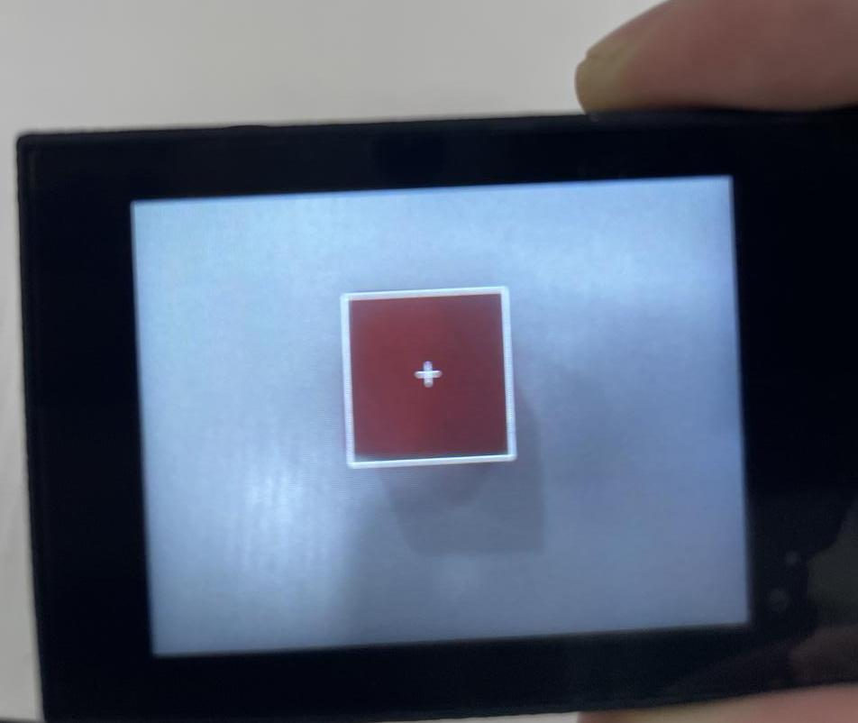
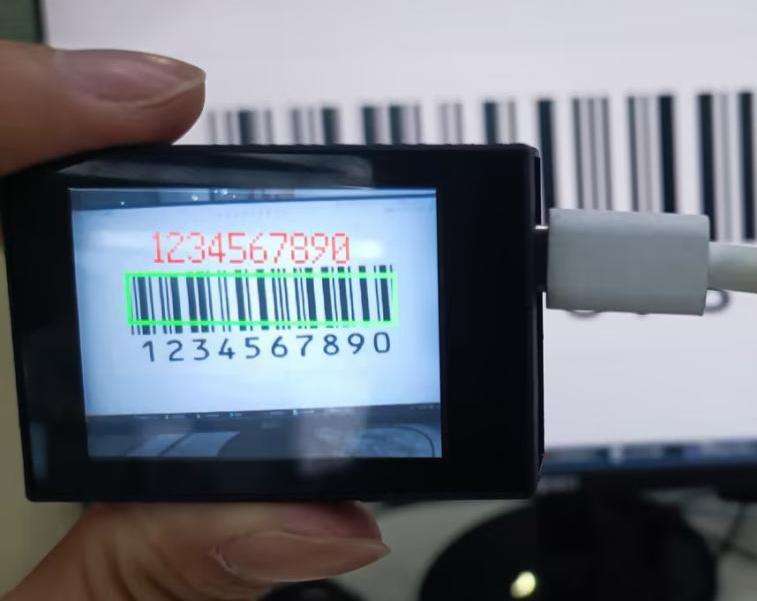
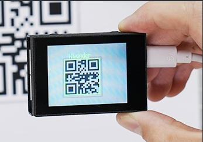
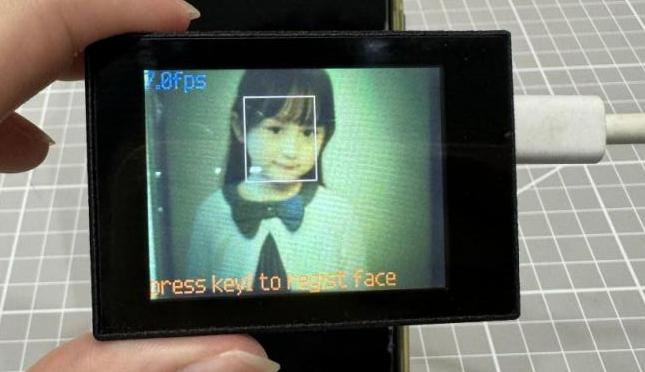
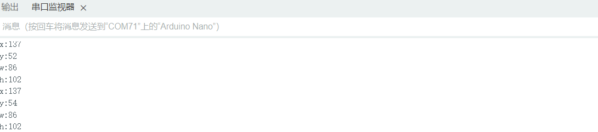
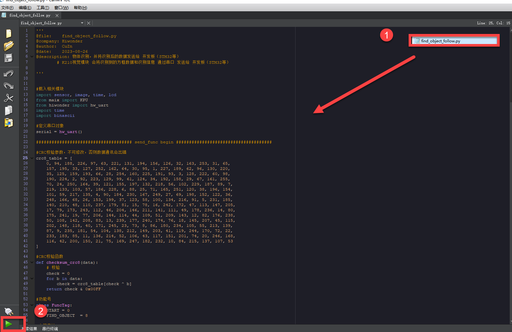
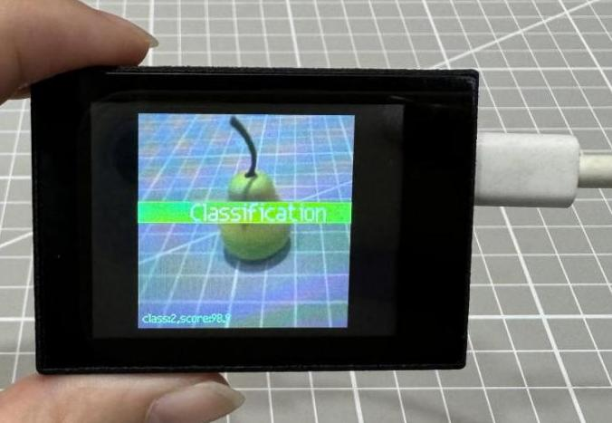
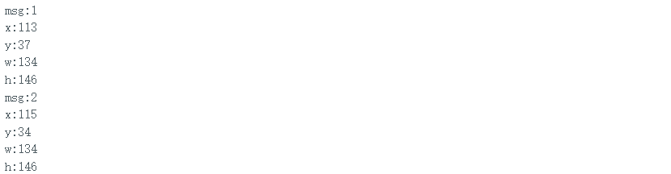

# 7. Multiple Controller UART Communication Course

## 7.1 Master-Slave Device Communication Principles

### 7.1.1 Introduction

This section aims to introduce you to detailed information about the master-slave relationship between the WonderMV and different devices (such as STM32, 51 microcontroller, Arduino, and Raspberry Pi) during communication. It helps you understand how WonderMV communicates as a subordinate device with other devices and how other devices control WonderMV as a master device.

Understand the position and function of WonderMV within the entire system. This will facilitate the effective integration of this module, realizing the desired image processing and recognition functions.

In this chapter, WonderMV is typically utilized as a subordinate device. It uses the UART serial port to transmit the information to other devices.

### 7.1.2 Master-Slave Relationship

In a master-slave control system, WonderMV acts as a subordinate device and other devices such as microcontrollers act as master devices.

* **WonderMV Functions**

(1) Image processing and recognition

The intelligent algorithms need specialized vision processors to accelerate the processing. Microcontrollers like the 51 microcontroller or Arduino cannot easily achieve image processing and recognition. The WonderMV vision module is specifically designed to execute image processing and recognition algorithms. It has dedicated intelligent processing hardware units, which can accelerate the processing of results.

(2) Generation of recognition results

WonderMV is responsible for generating visual recognition results. This may include information about detected objects, shapes, colors, and more.

(3) Data encapsulation and communication

WonderMV encapsulates the recognition results into data packets according to a predefined communication protocol, enabling them to be transmitted to the master device.

* **Other Master Devices**

(1) Control coordination

The master is responsible for coordinating the entire system, ensuring there are no conflicts in communication and operation between WonderMV and other devices to maintain a stable working state.

(2) Data reception

The master receives the recognition result sent by WonderMV via the UART serial port. It verifies the integrity and accuracy of the received data and parses the data packet for extracting useful information.

(3) Result processing
The master device analyzes the relevant results and responds to the information. For example:

① If a 51 microcontroller development board receives recognition information of the red ball from WonderMV, the positional information of the ball will be printed.

② If a LeArm robotic arm receives face recognition information from WonderMV, the specific location of the face will be parsed to control the robotic arm to track the face.

③ If a Tonybot humanoid robot receives waste card recognition information from WonderMV, the recognized waste will be classified. The classification result will be broadcasted.

### 7.1.3 Hardware Connection

The wiring methods for communication between the WonderMV and other different master devices are as follows.

The wiring for the WonderMV and the Arduino development board.


The wiring for the WonderMV and the STM32 development board.


The wiring for the WonderMV and the ESP32 development board.


The wiring for the WonderMV and the Raspberry Pi.


### 7.1.4 Data Transmission Format

The default UART serial data transmission format of WonderMV is as follows:

| Baud rate | Data bits | Parity | Stop bits |
|:---------:|:---------:|:------:|:---------:|
|   115200  | 8 |  None  | 1 |

### 7.1.5 Communication Protocol

| Header | Function Code | Data Length | Data Information | CRC Checksum |
|:------:|:-------------:|:-----------:|:----------------:|:------------:|
| 0xAA 0x55 | func  | len |   data   | crc  |

Header: When the header is received, it indicates the presence of data transmission;

Function Code: It indicates the function of an information frame;

Data Length: It indicates the amount of data that follows;

Data Information: It indicates the transmitted data information;

CRC Checksum: Calculate all the data from the function code to the data information to obtain CRC checksum value, and retain only the lower 8 bits.

### 7.1.6 Note

(1) The host device and the WonderMV can have different power sources, but they must share a common ground when connected to ensure stable communication voltage.

(2) When you wire the devices, ensure that the TX and RX pins of the UART serial port are crossed, otherwise communication will not be possible.

## 7.2 Color Learning Recognition

### 7.2.1 K210

* **Game Introduction**

In this section, program the K120 vision module to establish serial communication with the host device, enabling color acquisition and recognition. The coordinates of the recognized object's bounding box and the corresponding result will be printed on the terminal. Additionally, the recognition result will be sent to the host device via the UART serial port.

* **Getting Ready**

(1) Device Connection

Connect the K210 vision module to a computer with a Type-C data cable.


Power the other master devices with their respective power interfaces, and connect the UART interfaces with DuPont cables.

For example, connect the ESP32 to the PC with a USB data cable. Then, connect the K210 vision module to the ESP32's serial port with a DuPont cable.


(2) Download and Run K210 Program

① Double-click  to open the software.

② Click  in the bottom left corner.

③ Select the corresponding serial port number. Check **"Advanced Settings"**, and select **"Mode-3"**.


④ Click **"OK"** and wait for the connection to be completed.


⑤ After the connection is successful, the CanMV IDE displays the  icon in the bottom left corner.

⑥ If the connection takes more than 10 seconds, it indicates a connection failure. Click **"Cancel"**, and a pop-up window shown below appears. Click **"OK"** and re-check the connection.

:::{Note}
Tips for connection failure:

*   The selected serial port number is wrong.

Please unplug other serial ports connected to your PC. Try the above steps again to select the correct serial port number.

*   The cable used for the connection is not a data cable.

Use a Type-C data cable that supports data transmission. A Type-C data cable is included in the package before delivery.

*   Other K210 firmware is flashed.

Reflash the factory firmware, and then proceed with the connection.
:::

There are two ways to run K210 programs: online and offline.

**Online operation:**

After connecting successfully, drag the program under the same folder as this lesson to the code editor area of CanMV IDE. Click the  at the bottom left corner to run the program online.

:::{Note}
Programs run in this way will be lost when the connection is disconnected or the device is shut down. They will not be saved on the K210 vision module.
:::


**Offline operation:**

① After connecting, drag the program under the same directory to the CanMV IDE code editing area. Click **"Tools"** on the toolbar. Select **"Save open script to CanMV Cam (as main.py)"**.


② Click **"Yes"**.


③ Once the writing is successful, a window shown below will appear. Click **"OK"**. This saves the MicroPython file into the K210 Vision Module.


By downloading in this way, after powering on the K210 Vision Module without connecting, it will run the MicroPython file, enabling offline operation.

(3) Download and Run Master Device Program

Please refer to the relevant tutorial to download and run the master device program.

* **Program Outcome**

(1) K210 Vision Module

After downloading the program, place the object to be recognized, such as a red block, within the field of view of the vision module.

① Move the red block into the white box. Only the area within the box is used for color acquisition.


② Click the **"K1"** button on the module to aim the appearing green box at the object to be captured and recognized. Only the area within the central box is used for color acquisition.


③ Once the object is successfully recognized, the green box will disappear. The recognized red object will be highlighted with a white box and a cross.



If you want to change the color to be recognized, you can restart the K210 module to start a new capture. If you want to capture multiple colors (up to three colors are supported), please access the directory of this program and download or run **"multi_color_recognition"**. The capture method remains the same as described above.

(2) Mater Device

Upon the program is downloaded, the master device will print the detailed information that is received and parsed. Take the ESP32 as an example.

After downloading the program, the ESP32 will print the coordinates of the bounding box and the detection results in the terminal. Additionally, the message **"crc ok"** indicates that the checksum is correct.


* **Program Analysis**

[Source Code]()

Let's focus on the program analysis for the K210 vision module on the transmitter end. For an analysis of the program on the receiver end, please refer to the [ 6. AI Vision Games -> 6.11 Object Recognition](6.AI_Vision_Games.md#object-recognition) .

(1) Load the vision module to obtain camera images.

Load the image module for image buffering and barcode processing.

Load the time module for calculating video frame rates.

Load the LCD module library for displaying images on an LCD screen.

Load the hw_uart module from the hiwonder library for serial communication.

Load the binascii module for byte processing.

{lineno-start=14}
```python
#载入相关模块(load relevant modules)
import sensor, image, time, lcd
from hiwonder import hw_uart
import time
import binascii
```

(2) Define the serial port transmission object.

{lineno-start=20}
```python
#定义串口对象(define serial port object)
serial = hw_uart()
```

(3) Define a serial port transmission function. It encapsulates the recognized information based on the defined data format and transmits it via the serial port.

{lineno-start=68}
```python
def send_data(x,y,w,h,msg):
    '''
    0xAA  0x55  功能号(function number)  数据长度(data length)  data  CRC
    '''
    START_1 = 0xAA
    START_2 = 0x55
    FUNC_num = FuncTag.COLOR_RECOGNITION #功能编号(function number)
    Length = 0  #数据长度(data length)
    crc = 0 #校验位(checksum bit)
    data = [] #数据组(dataset)

    #参数都为0(all parameters are set to 0)
    if x==0 and y==0 and w==0 and h ==0:
        pass
    else:
        #x(小端模式)(little-endian mode)
        low = x & 0xFF #低位(low byte)
        high = x >> 8& 0xFF #高位(high byte)
        data.append(low)
        data.append(high)

        #y(小端模式)(little-endian mode)
        low = y & 0xFF #低位(low byte)
        high = y >> 8& 0xFF #高位(high byte)
        data.append(low)
        data.append(high)
```

{lineno-start=95}
```python
        #w(小端模式)(little-endian mode)
        low = w & 0xFF #低位(low byte)
        high = w >> 8& 0xFF #高位(high byte)
        data.append(low)
        data.append(high)

        #h(小端模式)(little-endian mode)
        low = h & 0xFF #低位(low byte)
        high = h >> 8& 0xFF #高位(high byte)
        data.append(low)
        data.append(high)

    #msg
    if msg != None:
        for i in range(len(msg)):
            msg_int = str_2_int(msg[i])
            data.append(msg_int)

    Length += len(data)
    send_buf = [FUNC_num,Length]
    for i in range(len(data)):
        send_buf.append(data[i])

    #进行CRC运算(perform a CRC calculation)
    crc = checksum_crc8(send_buf)

    send_buf.insert(0,START_1) #插入协议头1(insert protocol header 1)
    send_buf.insert(1,START_2) #插入协议头2(insert protocol header 1)
    send_buf.append(crc) #加入CRC校验码(incorporate the CRC checksum)

    print(send_buf) #打印数据(print data)
    serial.send_bytearray(send_buf) #发送数据(send data)
```

(4) Define the sent data storage variables. The `send_x` and `send_y` represent the x and y values of the top-left corner coordinates of the recognition bounding box. The `send_msg` represents the specific information extracted from the image.

{lineno-start=130}
```python
#定义发送数据(define the transmitted data) 
send_x = 0
send_y = 0
send_w = 0
send_h = 0
send_msg = ""
```

(5) Initialize the LCD screen and the camera.

{lineno-start=138}
```python
#初始化LCD(initialize LCD)
lcd.init()
#以下是初始化传感器(initialize sensors)
sensor.reset()
sensor.set_pixformat(sensor.RGB565)
sensor.set_framesize(sensor.QVGA)
sensor.skip_frames(time = 100)
sensor.set_auto_gain(False)
sensor.set_auto_whitebal(False)
```

(6) Define a clock counter for calculating frame rate.

{lineno-start=147}
```python
#帧率时钟(frame rate clock)
clock = time.clock()
```

(7) Define parameters for the bounding box and display the initial bounding box.

{lineno-start=150}
```python
#方框参数(box parameters)
r = [(320//2)-(50//2), (240//2)-(50//2), 50, 50]

#显示方框(display box)
for i in range(50):
    img = sensor.snapshot()
    img.draw_rectangle(r)
    lcd.display(img)
```

(8) Continuously obtain images and perform the average learning for the recognized color within the bounding box.

{lineno-start=159}
```python
#开始学习(start learning)
print("Start learning ...")

threshold = [50, 50, 0, 0, 0, 0] # L、A、B 值(L, A, and B values)
for i in range(50):
    img = sensor.snapshot()
    hist = img.get_histogram(roi=r) # 获取图像的直方图(obtain the histogram of an image)
    lo = hist.get_percentile(0.01)  # 获取直方图在1%范围内的累积分布函数（根据需要进行调整）！(obtain the cumulative distribution function of the histogram within a 1% range (adjust as needed)!)
    hi = hist.get_percentile(0.99)  # 获取直方图在99%范围内的累积分布函数（根据需要进行调整）！(obtain the cumulative distribution function of the histogram within a 99% range (adjust as needed)!)

    # 将百分位值进行平均。(calculate the average of the percentile values)
    threshold[0] = (threshold[0] + lo.l_value()) // 2
    threshold[1] = (threshold[1] + hi.l_value()) // 2
    threshold[2] = (threshold[2] + lo.a_value()) // 2
    threshold[3] = (threshold[3] + hi.a_value()) // 2
    threshold[4] = (threshold[4] + lo.b_value()) // 2
    threshold[5] = (threshold[5] + hi.b_value()) // 2

    # 在图像中找到颜色块(locate the color block in the image)
    for blob in img.find_blobs([threshold], pixels_threshold=100, area_threshold=100, merge=True, margin=10):
        img.draw_rectangle(blob.rect()) # 在颜色块的位置绘制矩形(draw a rectangle at the location of the color block)
        img.draw_cross(blob.cx(), blob.cy()) # 在颜色块的中心位置绘制十字(draw a cross at the center of the color block)
        img.draw_rectangle(r, color=(0,255,0)) # 在 ROI 区域绘制矩形，标记学习的区域(draw a rectangle in the ROI region to mark the learned region)

    # 在 LCD 屏幕上显示图像(display image on the LCD screen)
    lcd.display(img)
```

(9) After the learning process is completed, enter the main loop.

{lineno-start=159}
```python
#loop
while(True):
```

(10) Obtain the image from the sensor and perform color recognition.

{lineno-start=195}
```python
    #从传感器捕获一张图像(capture an image from the sensor)
    img = sensor.snapshot()
```

(11) Locate the corresponding color threshold area within the recognized image. Once the corresponding color area is detected, enclose it with a bounding box on the image.

{lineno-start=197}
```python
    #遍历图像中找到的颜色区块(iterate through the color blocks found in the image)
    for blob in img.find_blobs([threshold], pixels_threshold=100, area_threshold=100, merge=True, margin=10):
        #绘制矩形和十字标记(draw a rectangle and cross)
        img.draw_rectangle(blob.rect())
        img.draw_cross(blob.cx(), blob.cy())
        #将方框数据与消息赋值(assign values to box data and message)
        send_x = blob.x()
        send_y = blob.y()
        send_w = blob.w()
        send_h = blob.h()
        send_msg = 'u'
```

(12) Upon detecting information, use the `send_data()` function to transmit the information via the serial port.

{lineno-start=209}
```python
    # 当消息标志为 'u' 时，发送数据（注意，即使x、y、w、h数据不变也会进入此条件）(When the message flag is set to 'u', transmit the data (note that this condition is triggered even if the x, y, w, and h data remain unchanged))
    if send_msg == 'u':
        #发送数据(send data)
        send_data(send_x,send_y,send_w,send_h,None)
        send_msg = ""  # 清空消息变量(clear message variables)
    lcd.display(img) #显示在LCD上(display on the LCD)
    print(clock.fps()) #打印帧率(print the frame rate)
```

(13) Display the image on the LCD screen and print the frame rate.

{lineno-start=214}
```python
    lcd.display(img) #显示在LCD上(display on the LCD)
    print(clock.fps()) #打印帧率(print the frame 
```

### 7.2.2 Arduino UNO

For the instructions on downloading the program to K210 and analyzing the K210-related code, please refer to the **"K210"** located in the same directory as this tutorial. This lesson only analyzes the data transmitted by K210 and received by Arduino UNO.

* **Game Introduction**

Send the learned color data to Arduino UNO via the K210 vision module.

* **Getting Ready**

(1) Module Connection

① Connect the K210 vision module to a computer with a Type-C data cable.

② Connect the GND, RX, and TX pins of the K210's UART interface to the corresponding GND, D6, and D7 pins on the Arduino UNO with a DuPont wire.


(2) Download and Run Program

① Locate and open **"color_recognition"** program file in the same folder as this lesson.


② In the **"Select board"** option, select the corresponding Arduino development board and port. Take **"Arduino Uno"** and **"COM8"** as an example to demonstrate. The COM port is not unique. You can check the COM port number in the computer's device manager.


③ Click  button to compile the program. After the compilation is completed, click  to upload the program into the Arduino development board.

* **Program Outcome**

After downloading the program, place the object to be recognized, such as a red block, within the field of view of the vision module.

① Move the red block into the white box. Only the area within the box is used for color acquisition.


② Click the **"K1"** button on the module to aim the appearing green box at the object to be captured and recognized. Only the area within the central box is used for color acquisition.


③ Once the object is successfully recognized, the green box will disappear. The recognized red object will be highlighted with a white box and a cross.


If you want to change the color to be recognized, you can restart the K210 module to start a new capture.

Open the **Arduino IDE**, the coordinates information of the red block is visible. Select the baud rate to 115200.


The touch screen of K210 vision module has a resolution of 320\*240. The origin of its pixel coordinates located at the top left corner of the module, as illustrated in the diagram below:


The `x` and `y` represent the pixel coordinates of the red block along the X and Y axes, respectively. The `h` and `w` denote the height and width of the block in units of px.

* **Program Analysis**

[Source Code]()

(1) Initialize program

The program begins by initializing the communication through the serial port, with the baud rate set to 115200. This establishes a connection for communication with the K210 controller via the serial port.

{lineno-start=16}
```c++
void setup() {
  Serial.begin(115200);
  //开启串口接收(enable serial port receiving)
  wk.serial_begin();  
}
```

The function `Wk.serial_begin()` is used to initialize the serial communication on the K210, enabling the MCU to establish a connection with the K210 through serial communication.

(2) Loop to obtain the latest color recognition

{lineno-start=23}
```c++
void loop() {
  //更新消息(updata message)
  wk.update_data();
  //获取消息(obtain message)
  bool rt = wk.recive_box(&result , K210_COLOR_RECOGNITION);
  //若获取到新的消息(if a new message is obtained)
```

After entering the `loop()` function, use the `wk.update_data()` function to continuously obtain the latest color recognition results from the K210 vision module. Then, acquire and parse the data of the latest recognized frame's structure, storing it in the result variable.

(3) Print result information

If a new result is obtained (`rt` is true), the serial port will print detailed coordinates and dimensions of the recognition frame.

{lineno-start=23}
```c++
void loop() {
  //更新消息(updata message)
  wk.update_data();
  //获取消息(obtain message)
  bool rt = wk.recive_box(&result , K210_COLOR_RECOGNITION);
  //若获取到新的消息(if a new message is obtained)
  if(rt)
  {
    Serial.print("x:");
    Serial.println(result.x);
    Serial.print("y:");
    Serial.println(result.y);
    Serial.print("w:");
    Serial.println(result.w);
    Serial.print("h:");
    Serial.println(result.h);
  }
}
```

### 7.2.3 ESP32

* **Game Introduction**

In this section, program the K120 vision module to establish serial communication with the ESP32, enabling color learning recognition. The coordinates of the recognized object's bounding box will be printed on the terminal.

* **Getting Ready**

(1) Wiring Instruction

① Connect the K210 vision module to a computer with a Type-C data cable.

② Connect the ESP32 to the PC with a USB data cable. Then, connect the K210 vision module to the ESP32's serial port with a 4PIN wire.


(2) Download and Run K210 Program

① Double-click  to open the software.

② Click  in the bottom left corner.

③ Select the corresponding serial port number. Check **"Advanced Settings"**, and select **"Mode-3"**.


④ Click **"OK"** and wait for the connection to be completed.


⑤ After the connection is successful, the CanMV IDE displays the  icon in the bottom left corner.

⑥ If the connection takes more than 10 seconds, it indicates a connection failure. Click **"Cancel"**, and a pop-up window shown below appears. Click **"OK"** and re-check the connection.

:::{Note}

Tips for connection failure:

*   The selected serial port number is wrong.

Please unplug other serial ports connected to your PC. Try the above steps again to select the correct serial port number.

*   The cable used for the connection is not a data cable.

Use a Type-C data cable that supports data transmission. A Type-C data cable is included in the package before delivery.

*   Other K210 firmware is flashed.

Reflash the factory firmware, and then proceed with the connection.
:::

There are two ways to run K210 programs: online and offline.

**Online operation:**

After connecting successfully, drag the program under the same folder as this lesson to the code editor area of CanMV IDE. Click the  at the bottom left corner to run the program online.

:::{Note}
Programs run in this way will be lost when the connection is disconnected or the device is shut down. They will not be saved on the K210 vision module.
:::


**Offline operation:**

① After connecting, drag the program under the same directory to the CanMV IDE code editing area. Click **"Tools"** on the toolbar. Select **"Save open script to CanMV Cam (as main.py)"**.


② Click **"Yes"**.


③ Once the writing is successful, a window shown below will appear. Click **"OK"**. This saves the MicroPython file into the K210 Vision Module.


By downloading in this way, after powering on the K210 Vision Module without connecting, it will run the MicroPython file, enabling offline operation.

(3) Download and Run ESP32 Program

① Connect the ESP32 controller to the computer with a USB data cable. Open the Python editor. Drag the programs **"WonderK210.py"** and **"main.py"** into the editor interface.


② Select the  or click **"Connect"** in the menu bar to choose the corresponding COM port. Let's use **"COM15"** as an example. The COM port is not unique. You can check the COM port number in the computer's device manager.


:::{Note}
To avoid encountering any unexpected anomalies during the flashing process, please strictly follow the operation steps.

In you encounter difficulties in properly reading the COM port or downloading the program, please refer to the **"ESP32 Board Firmware Recovery Method"** to reflash the firmware.
:::

③ After the connection is established, click  or **"Run - Download and Run"** to download the program into the controller and execute it.

* **Program Outcome**

Print the coordinates of the bounding box for the recognized object in the terminal.


* **Program Analysis**

[Source Code]()

Let's focus on the ESP32 program analysis on the receiver end. For an analysis of the K210 program on the transmitted end, please refer to the [6. AI Vision Games -> 6.1 Color Acquisition and Recognition](6.AI_Vision_Games.md#color-acquisition-and-recognition) .

(1) Import Module

Import the time module, the WonderK210 communication class, and the message format classes ( `Find_Box_Msg_st`, `Find_Box_st`, and `Find_Msg_st`) for subsequent usage.

{lineno-start=}
```python
# 载入时间模块(load time module)
import time
# 载入K210通信类(load K210 communication class)（WonderK210），消息格式类(message format class)（Find_Box_Msg_st , Find_Box_st , Find_Msg_st）
from WonderK210 import WonderK210 , Find_Box_Msg_st , Find_Box_st , Find_Msg_st
```

(2) Establish Communication

Instantiate the K210 communication class.

{lineno-start=14}
```python
# 实例化K210通信类(instantiate K210 communication class)
wk = WonderK210()
```

Enable the serial port.

{lineno-start=17}
```python
# 开启串口(start serial port)
wk.serial_begin()
```

(3) Main Function

Enter a while loop to continuously update and receive messages. The function `wk.find_color_recognition()` searches for specific color in the data and retrieve the received messages.

{lineno-start=21}
```python
while True:
  # 更新接收消息(update receiving message)
  wk.update_data()
  # 获取接收消息(obtain receiving message)
  ret = wk.find_color_recognition()
```

If a recognition result is found (`ret` is not `None`), the coordinates of the bounding box for the recognized object will be printed. The `x` and `y` represent the top-left coordinates of the box in the image, the `w` denotes the width of the box, and the `h` represents the height of the box.

{lineno-start=26}
```python
  # 若有新消息获取到(if a new message is obtained)
  if ret is not None:
    # 打印消息内容(print message content)
    print(ret.x)
    print(ret.y)
    print(ret.w)
    print(ret.h)
  # 延时10ms(delay for 10ms)
  time.sleep_ms(10)
```

(4) Information Obtaining Function

{lineno-start=230}
```python
  # 颜色学习识别 box(color learning recognition box)
  def find_color_recognition(self):
    if True == self.__read_succeed: # 若有新消息(if there is a new message)
      if k210_PACKET_FUNCTION.COLOR_RECOGNITION == self.__pk_result.function: # 是否为该功能消息(if it is the function message)
        print("find_color_recognition()")
        self.__read_succeed = False
        ret = Find_Box_st()
        ret.function = self.__pk_result.function
        ret.x = (self.__pk_result.data[0] & 0x00FF) | ((self.__pk_result.data[1] << 8 ) & 0xFF00)
        ret.y = (self.__pk_result.data[2] & 0x00FF) | ((self.__pk_result.data[3] << 8 ) & 0xFF00)
        ret.w = (self.__pk_result.data[4] & 0x00FF) | ((self.__pk_result.data[5] << 8 ) & 0xFF00)
        ret.h = (self.__pk_result.data[6] & 0x00FF) | ((self.__pk_result.data[7] << 8 ) & 0xFF00)
        # 清除存储变量(clear storage variables)
        self.__pk_result.data.clear()
        return ret
      else:
        return None
    else:
      return None
```

When a new message of the color recognition is received, this function will extract the position information of the recognized color box.

Firstly, it checks if the `self.__read_succeed` is `True`. If the message reading is successful, it then verifies if the `self.__pk_result.function` is the predefined `COLOR_RECOGNITION` function message. If it is a color recognition message, the following steps are performed:

① Print a message indicating that a color recognition message has been found.

② Set the `self.__read_succeed` to `False`, indicating that this message has been successfully processed.

③ Create an object named `ret`, which is an instance of the `Find_Box_st` class.

④ Extract the coordinate and dimension information from the color recognition result, and assign them to the corresponding attributes (`x`, `y`, `w`, and `h`) of the `ret` object.

⑤ Clear the variable `self.__pk_result.data` that stores message data.

⑥ Return the `ret` object containing the extracted recognition result information.

⑦ If a new message is not successfully read or the received message is not a color recognition message, return `None`.

### 7.2.4 STM32

For the instructions on downloading the program to K210 and analyzing the K210-related code, please refer to the **"K210"** located in the same directory as this tutorial. This lesson only analyzes the data transmitted by K210 and received by STM32.

* **Game Introduction**

Send the learned color data to STM32 via the K210 vision module.

* **Getting Ready**

(1) Module Connection

Connect the K210 vision module to a computer with a Type-C data cable.


Connect the GND, RX, and TX pins of the K210's UART interface to the corresponding pins on the STM32 with a DuPont wire.

(2) Download and Run Program

① Locate and open **"RosRobotControllerM4.uvprojx"** program file in the same folder as this lesson.


② Click  to perform compiling. After the compiling is completed, click  to download the program to the STM32 board.


* **Program Outcome**

Once the program runs, the STM32 will obtain the coordinates of the learned color from the K210 vision module. After running the program, open the  located in [Appendix-&gt;Serial Port Utility](Appendix.md) to view the printed information.


* **Program Analysis**

[Source Code]()

(1) Initial Settings

{lineno-start=1}
```c
#include "k210_packet.h"
#include "global.h"
```

The **"k210_packet.h"** consists of data structure definitions, function declarations, and macros related to the K210. It is used to handle data packets, communication protocols, or device control related to the K210. The file **"global.h"** contains global constants, variables, and more.

{lineno-start=7}
```c
typedef struct {
	uint16_t  x;
	uint16_t  y;
	uint16_t  w;
	uint16_t  h;
}BoxData;
```

Struct `BoxData`: a structure `BoxData` is defined. It contains four `uint16_t` type member variables: `x`, `y`, `w`, and `h`. These variables represent the position and size of a rectangular box.

{lineno-start=14}
```c
//只有方框数据(only includes box data)
typedef struct {
	BoxData box;
}Find_Box_st;
```

Struct `Find_Box_st`: a structure `Find_Box_st` is defined. It contains a variable `box` of `BoxData` type. This structure represents a data type that includes only the information of a rectangular box, excluding other message data.

{lineno-start=20}
```c
//有方框数据和消息数据(include box data and message data)
typedef struct {
	BoxData box;
	uint8_t msg[100];
}Find_Box_Msg_st;
```

Struct `Find_Box_Msg_st`: a structure `Find_Box_Msg_st` is defined. It contains a variable of type `BoxData` named `box` and an array of `uint8_t` type with a length of 100 named `msg`. This structure represents a data type that includes both the information of a rectangular box and a message data with a length of 100.

{lineno-start=26}
```c
//只有消息数据(only includes message data)
typedef struct {
	uint8_t msg[100];
}Find_Msg_st;
```

Struct `Find_Msg_st`: a structure `Find_Msg_st` is defined. It contains a single array of `uint8_t` type with a length of 100 named `msg`. This structure represents a data type that includes only the message data with a length of 100 and does not include the information of a rectangular box.

(2) Message Data Processing

{lineno-start=34}
```c
/**
* @brief 只有方框数据 的回调处理(callback processing for only including box data)
* @param frame 数据帧(data frame)
* @retval void
*/
static void k210_Box_cb(struct k210_PacketRawFrame *frame)
{
    Find_Box_st *rec = (Find_Box_st*)frame->data_and_checksum;
	printf("x:%d,y:%d,w:%d,h:%d\n",rec->box.x,rec->box.y,rec->box.w,rec->box.h);
}
```

`k210_Box_cb`: handles data frames that only contain box data. It extracts data of type `Find_Box_st` from the data frame. It prints the position and size information of the box based on the extracted data.

{lineno-start=46}
```c
/**
* @brief 有方框数据和消息数据 的回调处理(callback processing for including box data and message data)
* @param frame 数据帧(data frame)
* @retval void
*/
static void k210_Box_Msg_cb(struct k210_PacketRawFrame *frame)
{
    Find_Box_Msg_st *rec = (Find_Box_Msg_st*)frame->data_and_checksum;
	printf("x:%d,y:%d,w:%d,h:%d\n",rec->box.x,rec->box.y,rec->box.w,rec->box.h);
	rec->msg[frame->data_length - 8] = '\0'; //将check位清除(clear check bit)
	printf("msg:%s\n",rec->msg);
}
```

`k210_Box_Msg_cb`: handles data frames that contain both box data and message data.

It extracts data of type `Find_Box_Msg_st` from the data frame. It prints the position and size information of the box based on the extracted data. It clears the checksum of the message data and then prints the message content.

{lineno-start=60}
```c
/**
* @brief 只有消息数据 的回调处理(callback processing for only including message data)
* @param frame 数据帧(data frame)
* @retval void
*/
static void k210_Msg_cb(struct k210_PacketRawFrame *frame)
{
    Find_Msg_st *rec = (Find_Msg_st*)frame->data_and_checksum;
	rec->msg[frame->data_length] = '\0'; //将check位清除(clear check bit)
	printf("msg:%s\n",rec->msg);
}
```

`k210_Msg_cb`: handles data frames that only contain message data. It extracts data of type `Find_Msg_st` from the data frame. It clears the checksum of the message data and then prints the message content. These functions serve as callback functions. When receiving specific types of data frames, these functions are called to process the data within the frames.

(3) Callback Function

{lineno-start=73}
```c
//注册回调函数(register callback function)
void k210_packet_handle_init(void)
{
    k210_packet_register_callback(&k210_packet_controller, K210_COLOR_RECOGNITION, k210_Box_cb); //颜色识别(color recognition)
	k210_packet_register_callback(&k210_packet_controller, K210_FIND_BARCODES, k210_Box_Msg_cb); //条形码识别(barcode recognition)
	k210_packet_register_callback(&k210_packet_controller, K210_FIND_QRCODES, k210_Box_Msg_cb);	 //二维码识别(QR code recognition)
	k210_packet_register_callback(&k210_packet_controller, K210_FIND_APRILTAGS, k210_Box_Msg_cb);//机器码识别(AprilTag recognition)
	k210_packet_register_callback(&k210_packet_controller, K210_FIND_FACE_YOLO, k210_Box_cb); 	 //人脸检测(face detection)
	k210_packet_register_callback(&k210_packet_controller, K210_FIND_FACEFEATURE, k210_Box_cb);  //人脸特征识别(face feature recognition)
	k210_packet_register_callback(&k210_packet_controller, K210_FIND_FACEMASK, k210_Box_Msg_cb); //口罩识别(mask recognition)
	k210_packet_register_callback(&k210_packet_controller, K210_FIND_OBJECT, k210_Box_Msg_cb);	 //物体识别(object recognition)
	k210_packet_register_callback(&k210_packet_controller, K210_FIND_SELF_LEARNING, k210_Msg_cb);//自主学习分类(autonomous learning and classification)
	k210_packet_register_callback(&k210_packet_controller, K210_FIND_DIGITAL, k210_Msg_cb);      //手写数字识别(handwritten number recognition)
	k210_packet_register_callback(&k210_packet_controller, K210_FIND_FACE_RECOGNITION, k210_Box_Msg_cb); //物体识别(object recognition)
    
    k210_packet_register_callback(&k210_packet_controller, K210_FIND_RED_FOLLOW, k210_Box_cb); //红色追踪(red tracking)
    k210_packet_register_callback(&k210_packet_controller, K210_FIND_SIGNPOST_FOLLOW, k210_Box_Msg_cb); //路标追踪(road sign tracking)
    k210_packet_register_callback(&k210_packet_controller, K210_FIND_DIGITAL_CARD, k210_Box_Msg_cb); //数字卡片识别(number card recognition)
    k210_packet_register_callback(&k210_packet_controller, K210_GARBAGE_SORTING, k210_Box_Msg_cb); //垃圾分类(waste classification)
    k210_packet_register_callback(&k210_packet_controller, K210_COLOR_SORTING, k210_Box_Msg_cb); //多种颜色识别(multiple colors recognition)
}
```

Multiple callback functions are registered through the function `k210_packet_handle_init`. Each callback function corresponds to a different processing program. These callback functions are associated with different functional modules related to the K210. Each module corresponds to a different recognition or data processing task.

Each call to `k210_packet_register_callback` associates a specific task's processing function with the K210 controller. For example:

① `K210_COLOR_RECOGNITION` corresponds to the color recognition task and uses the function `k210_Box_cb` to process the data.

② `K210_FIND_BARCODES` corresponds to the barcode recognition task and uses the function `k210_Box_Msg_cb` to process the data.

Similar cases exist for other tasks. Take `k210_packet_register_callback(&k210_packet_controller, K210_COLOR_RECOGNITION, k210_Box_cb)` as an example:

① The `k210_packet_register_callback` function is used to associate the callback function `k210_Box_cb` with a specific task type `K210_COLOR_RECOGNITION`.

② `&k210_packet_controller` is a pointer to the K210 controller. It provides interfaces and methods for handling different tasks.

③ `K210_COLOR_RECOGNITION` is a specific function code. It represents the function that K210 needs to perform.

④ `k210_Box_cb` is a callback function. It will be called when data associated with the task type `K210_COLOR_RECOGNITION` is received.

Each callback function receives data frames from the K210 controller and uses specific processing functions based on the task type to handle the data.

### 7.2.5 Raspberry Pi

For the instructions on downloading the program to K210 and analyzing the K210-related code, please refer to the **"K210"** located in the same directory as this tutorial. This lesson only analyzes the data transmitted by K210 and received by Raspberry Pi.

* **Game Introduction**

Send the learned color data to Raspberry Pi via the K210 vision module.

* **Getting Ready**

(1) Module Connection

① Connect the K210 vision module to a computer with a Type-C data cable.


② Connect the GND, RX, and TX pins of the K210's UART interface to the corresponding pins on the Raspberry Pi with a DuPont wire.

(2) Download and Run Program

① Move the program files **"main.py"** and **"WonderK210.py"** from the current directory to Raspberry Pi via a USB drive.


② Press **"Ctrl+Alt+T"** in the Raspberry Pi system to open the command line terminal.

③ In the command line terminal, enter the command to navigate to the directory where the program is located:

```
cd Desktop/
```

④ Enter the command to start the program:

```
python3 main.py
```

* **Program Outcome**

Once the program is started, the Raspberry Pi will retrieve the coordinate information of learned color from the K210 vision module and print it in the terminal.


* **Program Analysis**

[Source Code]()

(1) Initial Settings

{lineno-start=9}
```python
# 载入时间模块(load time module)
import time
# 载入K210通信类(load K210 communication class)（WonderK210），消息格式类(message format class)（Find_Box_Msg_st , Find_Box_st , Find_Msg_st），K210识别类型类（k210_PACKET_FUNCTION）
from WonderK210 import WonderK210 , Find_Box_Msg_st , Find_Box_st , Find_Msg_st , k210_PACKET_FUNCTION
```

Load the K210 communication class (`WonderK210`), message format class (`Find_Box_Msg_st`, `Find_Box_st`, `Find_Msg_st`), and K210 recognition type class (`k210_PACKET_FUNCTION`).

(2) Create Object

Instantiate the K210 communication class, and simultaneously activate the serial port.

{lineno-start=14}
```python
# 实例化K210通信类(instantiate K210 communication class)
wk = WonderK210()

# 开启串口(start serial port)
wk.serial_begin()
```

(3) Main Function

Use the function `wk.update_dat()` to update data. Call the function `wk.find_box()` to obtain the received message.

When a new message is obtained, the contents related to the target color will be printed.

{lineno-start=20}
```python
#loop
while True:
    # 更新接收消息(update receiving message)
    wk.update_data()
    # 获取接收消息(obtain receiving message)
    ret = wk.find_box(k210_PACKET_FUNCTION.COLOR_RECOGNITION)
    # 若有新消息获取到(if a new message is obtained)
    if ret is not None:
        # 打印消息内容(print message content)
        print("ret.x = {}".format(ret.x))
        print("ret.y = {}".format(ret.y))
        print("ret.w = {}".format(ret.w))
        print("ret.h = {}".format(ret.h))
```

## 7.3 Multiple Colors Recognition

### 7.3.1 K210

* **Game Introduction**

In this program, the color thresholds have been predefined. It can directly recognize five colors: red, green, blue, yellow, and purple without the need of capturing. When these five colors are recognized, they will be highlighted in green boxes. The recognized data will be sent to the master device via the serial port.

* **Getting Ready**

(1) Device Connection

Connect the K210 vision module to a computer with a Type-C data cable.


Power the other master devices with their respective power interfaces, and connect the UART interfaces with DuPont cables.

For example, connect the ESP32 to the PC with a USB data cable. Then, connect the K210 vision module to the ESP32's serial port with a DuPont cable.


(2) Download and Run K210 Program

① Double-click  to open the software.

② Click  in the bottom left corner.

③ Select the corresponding serial port number. Check **"Advanced Settings"**, and select **"Mode-3"**.


⑤ Click **"OK"** and wait for the connection to be completed.


 

⑥ After the connection is successful, the CanMV IDE displays the  icon in the bottom left corner.

⑦ If the connection takes more than 10 seconds, it indicates a connection failure. Click **"Cancel"**, and a pop-up window shown below appears. Click **"OK"** and re-check the connection.

:::{Note}
Tips for connection failure:

*   The selected serial port number is wrong.

Please unplug other serial ports connected to your PC. Try the above steps again to select the correct serial port number.

*   The cable used for the connection is not a data cable.

Use a Type-C data cable that supports data transmission. A Type-C data cable is included in the package before delivery.

*   Other K210 firmware is flashed.

Reflash the factory firmware, and then proceed with the connection.
:::

There are two ways to run K210 programs: online and offline.
**Online operation:**

After connecting successfully, drag the program under the same folder as this lesson to the code editor area of CanMV IDE. Click the  at the bottom left corner to run the program online.

:::{Note}
Programs run in this way will be lost when the connection is disconnected or the device is shut down. They will not be saved on the K210 vision module.
:::


**Offline operation:**

① After connecting, drag the program under the same directory to the CanMV IDE code editing area. Click **"Tools"** on the toolbar. Select **"Save open script to CanMV Cam (as main.py)"**.


② Click **"Yes"**.


③ Once the writing is successful, a window shown below will appear. Click **"OK"**. This saves the MicroPython file into the K210 Vision Module.


By downloading in this way, after powering on the K210 Vision Module without connecting, it will run the MicroPython file, enabling offline operation.

* **Program Outcome**

(1) K210 Vision Module

After running the program, the K210 vision module will select the recognized objects in the color of red, green, blue, yellow, and purple with boxes, as shown below:


(2) Mater Device

Upon the program is downloaded, the master device will print the detailed information that is received and parsed. Take the ESP32 as an example.

After downloading the program, the ESP32 will print the coordinates of the bounding box and the detection results in the terminal. Additionally, the message **"crc ok"** indicates that the checksum is correct.


* **Program Analysis**

[Source Code]()

(1) Load the `hw_uart` module from the `hiwonder` library for serial communication.

Load the vision module to obtain camera images.

Load the image module for image buffering and barcode processing.

Load the time module for calculating video frame rates.

Load the LCD module library for displaying images on an LCD screen.

Load the `binascii` module for byte processing.

{lineno-start=10}
```python
from hiwonder import hw_uart
import sensor
import image
import time
import lcd
import binascii
```

(2) Define the serial port transmission object.

{lineno-start=18}
```python
#定义串口对象(define serial port object)
serial = hw_uart()
```

(3) Define a serial port transmission function. It encapsulates the recognized information based on the defined data format and transmits it via the serial port.

{lineno-start=66}
```python
def send_data(x,y,w,h,msg):
    '''
    0xAA  0x55  功能号  数据长度  data  CRC
    '''
    START_1 = 0xAA
    START_2 = 0x55
    FUNC_num = FuncTag.COLOR_RECOGNITION #功能编号(function number)
    Length = 0  #数据长度(data length)
    crc = 0 #校验位(checksum bit)
    data = [] #数据组(dataset)

    #参数都为0(all parameters are set to 0)
    if x==0 and y==0 and w==0 and h ==0:
        pass
    else:
        #x(小端模式)(little-endian mode)
        low = x & 0xFF #低位(low byte)
        high = x >> 8& 0xFF #高位(high byte)
        data.append(low)
        data.append(high)

        #y(小端模式)(little-endian mode)
        low = y & 0xFF #低位(low byte)
        high = y >> 8& 0xFF #高位(high byte)
        data.append(low)
        data.append(high)

        #w(小端模式)(little-endian mode)
        low = w & 0xFF #低位(low byte)
        high = w >> 8& 0xFF #高位(high byte)
        data.append(low)
        data.append(high)

        #h(小端模式)(little-endian mode)
        low = h & 0xFF #低位(low byte)
        high = h >> 8& 0xFF #高位(high byte)
        data.append(low)
        data.append(high)
```

{lineno-start=87}
```python
        #y(小端模式)(little-endian mode)
        low = y & 0xFF #低位(low byte)
        high = y >> 8& 0xFF #高位(high byte)
        data.append(low)
        data.append(high)

        #w(小端模式)(little-endian mode)
        low = w & 0xFF #低位(low byte)
        high = w >> 8& 0xFF #高位(high byte)
        data.append(low)
        data.append(high)

        #h(小端模式)(little-endian mode)
        low = h & 0xFF #低位(low byte)
        high = h >> 8& 0xFF #高位(high byte)
        data.append(low)
        data.append(high)

    #msg
    if msg != None:
        for i in range(len(msg)):
            msg_int = str_2_int(msg[i])
            data.append(msg_int)

    Length += len(data)
    send_buf = [FUNC_num,Length]
    for i in range(len(data)):
        send_buf.append(data[i])

    #进行CRC运算(perform a CRC calculation)
    crc = checksum_crc8(send_buf)
```

(4) Define the sent data storage variables. The `send_x` and `send_y` represent the x and y values of the top-left corner coordinates of the recognition bounding box. The `send_msg` represents the specific information extracted from the image.

{lineno-start=128}
```python
#定义发送数据(define the transmitted data) 
send_x = 0
send_y = 0
send_w = 0
send_h = 0
send_msg = ""
```

(5) Initialize the LCD screen. Restart the camera module. Set its pixel mode to RGB565 and the image size to QVGA. Disable automatic gain and automatic white balance.

{lineno-start=136}
```python
#初始化LCD(initialize LCD)
lcd.init()
#以下是初始化传感器(initialize sensors)
sensor.reset()
sensor.set_pixformat(sensor.RGB565)
sensor.set_framesize(sensor.QVGA)
sensor.skip_frames(time = 100)
sensor.set_auto_gain(False)
sensor.set_auto_whitebal(False)
```

(6) Define a clock object for calculating frame rate.

{lineno-start=145}
```python
#帧率时钟(frame rate clock)
clock = time.clock()
```

(7) Set LAB thresholds for recognizing different colors. Store LAB thresholds for five colors. Define a color string for displaying the recognized color name.

{lineno-start=152}
```python
# 储存6种颜色的LAB阈值(store the LAB threshold of the six colors)
color_thresholds = [
    (15,80,15,62,15,35), # Red
    (14, 61, -39, -6, 0, 14),  # Green
    (21,50,-7,8,-35,-11), # Blue
    (65, 78, -10, -5, 38, 50),     # Yellow
    (20, 50, 17, 37, -34, -14),      # purple
]

color_strings = ['Red', 'Green', 'Blue', 'Yellow', 'purple']
```

(8) Create a color recognition loop:

The program enters an infinite loop, capturing an image in each iteration.

Use the `find_blobs` method to iterate through all the defined color thresholds and identify color regions in the image.

For each recognized color, draw a rectangle and a cross, display the color name next to it, and send out the recognized data via the UART serial port.

Display the processed image on the LCD screen and print the current frame rate.

{lineno-start=165}
```python
#loop
while True:
    #用于计算帧率的函数，这里表示开始计时(The function for calculating the frame rate, indicating the start of timing)
    #clock.tick()
    #从传感器捕获一张图像(capture an image from the sensor)
    img = sensor.snapshot()
    #遍历多种颜色(iterate through multiple colors)
    for color_idx, threshold in enumerate(color_thresholds):
        #遍历图像中找到的颜色区块(iterate through the color blocks found in the image)
        blobs = img.find_blobs([threshold], pixels_threshold=100, area_threshold=100, merge=True, margin=10)
        #是否找到(whether it is found)
        if blobs:
            area_max = 0
            blob_max = blobs[0]
            #寻找最大的颜色块(find the largest color block)
            for blob in blobs:
                area = blob.w()*blob.h()
                if(area_max < area):
                    blob_max = blob
                    area_max = area
            if area_max < 2000:
                continue
            #画方框(draw box)
            img.draw_rectangle(blob_max.rect())
            img.draw_cross(blob_max.cx(), blob_max.cy())
            img.draw_string(blob_max.cx() + 10, blob_max.cy() - 10, color_strings[color_idx], color=(255, 255, 255))
            #将方框数据与消息赋值(assign values to box data and message)
            send_x = blob_max.x()
            send_y = blob_max.y()
            send_w = blob_max.w()
            send_h = blob_max.h()
            #发送数据(send data)
            send_data(send_x,send_y,send_w,send_h,color_strings[color_idx])
    #显示在LCD上(display on the LCD)
    lcd.display(img)
    #打印帧率(print the frame rate)
    #print(clock.fps())
```

### 7.3.2 Arduino UNO

For the instructions on downloading the program to K210 and analyzing the K210-related code, please refer to the **"K210"** located in the same directory as this tutorial. This lesson only analyzes the data transmitted by K210 and received by Arduino UNO.

* **Game Introduction**

Send the recognized color data to Arduino UNO via the K210 vision module.

* **Getting Ready**

(1) Module Connection

Connect the K210 vision module to a computer with a Type-C data cable.

Connect the GND, RX, and TX pins of the K210's UART interface to the corresponding GND, D6, and D7 pins on the Arduino UNO with a DuPont wire.


(2) Download and Run Program

① Locate and open the **"5.3.2 find_multi_color.ino"** program file in the same folder as this lesson.


② In the **"Select board"** option, select the corresponding Arduino development board and port. Take **"Arduino Uno"** and **"COM8"** as an example to demonstrate. The COM port is not unique. You can check the COM port number in the computer's device manager.


③ Click  button to compile the program. After the compilation is completed, click  to upload the program into the Arduino development board.

* **Program Outcome**

After running the program, the K210 vision module will select the recognized objects in the color of red, green, blue, yellow, and purple with boxes, as shown below:


Open the **Arduino IDE** serial monitor, the coordinates information of the recognized block is visible. Select the baud rate to 115200.


The touch screen of K210 vision module has a resolution of 320\*240. The origin of its pixel coordinates located at the top left corner of the module, as illustrated in the diagram below:


The `msg` represents the color name of the recognized target. If green is recognized, print **"Green"**. The `x` and `y` represent the pixel coordinates of the target's center along the X and Y axes, respectively. The `h` and `w` denote the height and width of the block in units of px.

* **Program Analysis**

[Source Code]()

(1) Initial Settings

The program begins by initializing the communication through the serial port, with the baud rate set to 115200. This establishes a connection for communication with the K210 controller via the serial port.

{lineno-start=16}
```c++
void setup() {
  Serial.begin(115200);
  //分配内存(allocate memory)
  wk = malloc(sizeof(WonderK210));
  //开启串口接收(enable serial port receiving)
  //这里不需要再调用初始化串口函数 Serial.begin(115200); 在 serial_begin() 函数里已经初始化了(Since the initialization of the serial port has already been performed within the serial_begin() function, there is no need to call Serial.begin(115200))
  wk->serial_begin();  
  //分配内存(allocate memory)
  result = malloc(sizeof(Find_Box_Msg_st));
}
```

The function `Wk.serial_begin()` is used to initialize the serial communication on the K210, enabling the MCU to establish a connection with the K210 through serial communication.

(2) Loop to obtain the latest color recognition

{lineno-start=28}
```c++
void loop() {
  //更新消息(updata message)
  wk.update_data();
  //获取消息(obtain message)
  bool rt = wk.recive_box(&result , K210_COLOR_RECOGNITION);
```

After entering the `loop()` function, use the `wk.update_data()` function to continuously obtain the latest color recognition results from the K210 vision module. Then, acquire and parse the data of the latest recognized frame's structure, storing it in the result variable.

(3) Printing result information

If a new result is obtained (`rt` is true), the serial port will print detailed coordinates and dimensions of the recognition frame.

{lineno-start=28}
```c++
void loop() {
  //更新消息(updata message)
  wk.update_data();
  //获取消息(obtain message)
  bool rt = wk.recive_box(&result , K210_COLOR_RECOGNITION);
  //若获取到新的消息(if a new message is obtained)
  if(rt)
  {
    Serial.print("x:");
    Serial.println(result->x);
    Serial.print("y:");
    Serial.println(result->y);
    Serial.print("w:");
    Serial.println(result->w);
    Serial.print("h:");
    Serial.println(result->h);
    Serial.print("msg:");
    Serial.println(result->msg);
  }
}
```

### 7.3.3 ESP32

* **Game Introduction**

In this section, program the K120 vision module to establish serial communication with the ESP32, enabling multiple colors recognition. The coordinates of the recognized color and recognition result will be printed on the terminal.

* **Getting Ready**

(1) Wiring Instruction

Connect the K210 vision module to a computer with a Type-C data cable.

Connect the ESP32 to the PC with a USB data cable. Then, connect the K210 vision module to the ESP32's serial port with a 4PIN wire.


(2) Download and Run Program

① Download and Run K210 Program

② Double-click  to open the software.

③ Click  in the bottom left corner.

④ Select the corresponding serial port number. Check **"Advanced Settings"**, and select **"Mode-3"**.


⑤ Click **"OK"** and wait for the connection to be completed.


 

⑥ After the connection is successful, the CanMV IDE displays the  icon in the bottom left corner.

⑦ If the connection takes more than 10 seconds, it indicates a connection failure. Click **"Cancel"**, and a pop-up window shown below appears. Click **"OK"** and re-check the connection.

:::{Note}

Tips for connection failure:

*   The selected serial port number is wrong.

Please unplug other serial ports connected to your PC. Try the above steps again to select the correct serial port number.

*   The cable used for the connection is not a data cable.

Use a Type-C data cable that supports data transmission. A Type-C data cable is included in the package before delivery.

*   Other K210 firmware is flashed.

Reflash the factory firmware, and then proceed with the connection.
:::

There are two ways to run K210 programs: online and offline.

**Online operation:**

After connecting successfully, drag the program under the same folder as this lesson to the code editor area of CanMV IDE. Click the  at the bottom left corner to run the program online.

:::{Note}
Programs run in this way will be lost when the connection is disconnected or the device is shut down. They will not be saved on the K210 vision module.
:::


**Offline operation:**

① After connecting, drag the program under the same directory to the CanMV IDE code editing area. Click **"Tools"** on the toolbar. Select **"Save open script to CanMV Cam (as main.py)"**.


② Click **"Yes"**.


③ Once the writing is successful, a window shown below will appear. Click **"OK"**. This saves the MicroPython file into the K210 Vision Module.


By downloading in this way, after powering on the K210 Vision Module without connecting, it will run the MicroPython file, enabling offline operation.

(3) Download and Run ESP32 Program

① Connect the ESP32 controller to the computer with a USB data cable. Open the Python editor. Drag the programs **"WonderK210.py"** and **"main.py"** into the editor interface.


② Select the  or click **"Connect"** in the menu bar to choose the corresponding COM port. Let's use **"COM15"** as an example. The COM port is not unique. You can check the COM port number in the computer's device manager.


:::{Note}

To avoid encountering any unexpected anomalies during the flashing process, please strictly follow the operation steps.

In you encounter difficulties in properly reading the COM port or downloading the program, please refer to the **"ESP32 Board Firmware Recovery Method"** to reflash the firmware.
:::

① After the connection is established, click  or **"Run - Download and Run"** to download the program into the controller and execute it.

* **Program Outcome**

After downloading the program, the ESP32 will print the coordinates of the recognized color and the detection results in the terminal. Additionally, the message **"crc ok"** indicates that the checksum is correct.


* **Program Analysis**

[Source Code]()

Let's focus on the ESP32 program analysis on the receiver end. For an analysis of the K210 program on the transmitted end, please refer to the [ 6. AI Vision Games -> 6.2 Multiple Colors Recognition](6.AI_Vision_Games.md#multiple-colors-recognition) .

(1) Import Module

Import the time module, the WonderK210 communication class, and the message format classes (`Find_Box_Msg_st`, `Find_Box_st`, and `Find_Msg_st`) for subsequent usage.

{lineno-start=9}
```python
# 载入时间模块(load time module)
import time
# 载入K210通信类(load K210 communication class)（WonderK210），消息格式类(message format class)（Find_Box_Msg_st , Find_Box_st , Find_Msg_st）, 功能号(function number)（k210_PACKET_FUNCTION）
from WonderK210 import WonderK210 , Find_Box_Msg_st , Find_Box_st , Find_Msg_st , k210_PACKET_FUNCTION
```

(2) Establish Communication

Instantiate the K210 communication class.

{lineno-start=14}
```python
# 实例化K210通信类(instantiate K210 communication class)
wk = WonderK210()
```

Enable the serial port.

{lineno-start=17}
```python
# 开启串口(start serial port)
wk.serial_begin()
```

(3) Main Function

Enter a while loop to continuously update and receive messages. The function `ret = wk.find_box_msg (k210_PACKET_FUNCTION.K210_COLOR_SORTING)` searches for target in the data and retrieve the received messages.

{lineno-start=20}
```python
#loop
while True:
  # 更新接收消息(update receiving message)
  wk.update_data()
  # 获取接收消息(obtain receiving message)
  ret = wk.find_box_msg(k210_PACKET_FUNCTION.K210_COLOR_SORTING)
```

If a recognition result is found (`ret` is not `None`), the recognition result will be printed. The `x` and `y` represent the top-left coordinates of the box in the image, the `w` denotes the width of the box, the `h` represents the height of the box, and the `msg` is the recognition result.

{lineno-start=26}
```python
  # 若有新消息获取到(if a new message is obtained)
  if ret is not None:
    # 打印消息内容(print message content)
    print(ret.x)
    print(ret.y)
    print(ret.w)
    print(ret.h)
    print(ret.msg)
  # 延时10ms(delay for 10ms)
  time.sleep_ms(10)
```

(4) Information Obtaining Function

{lineno-start=113}
```python
# 有方框数据和消息数据(there is data for the box and the message)
class Find_Box_Msg_st:
  def __init__(self):
    self.function = 0
    self.x = 0
    self.y = 0
    self.w = 0
    self.h = 0
    self.msg = [0x00] * 200
```

The class `Find_Box_st` is defined, which has the following attributes:

`function`: Represents a specific function or state.

`x`: Represents the x-coordinate of the box.

`y`: Represents the y-coordinate of the box.

`w`: Represents the width of the box.

`h`: Represents the height of the box.

`msg`: A list with a length of 200, used to store message data.

### 7.3.4 STM32

For the instructions on downloading the program to K210 and analyzing the K210-related code, please refer to the **"K210"** located in the same directory as this tutorial. This lesson only analyzes the data transmitted by K210 and received by STM32.

* **Game Introduction**

Send the recognized color data to STM32 via the K210 vision module.

* **Getting Ready**

(1) Module Connection

① Connect the K210 vision module to a computer with a Type-C data cable.


② Connect the GND, RX, and TX pins of the K210's UART interface to the corresponding pins on the STM32 with a DuPont wire.

(2) Download and Run Program

① Locate and open **"RosRobotControllerM4.uvprojx"** program file in the same folder as this lesson.


② Click  to perform compiling. After the compiling is completed, click  to download the program to the STM32 board.


* **Program Outcome**

Once the program runs, the STM32 will obtain the coordinates of the learned color from the K210 vision module. After running the program, open the  located in [Appendix-&gt;Serial Port Utility](Appendix.md) to view the printed information.


* **Program Analysis**

[Source Code]()

(1) Initial Settings

{lineno-start=1}
```c
#include "k210_packet.h"
#include "global.h"
```

The **"k210_packet.h"** consists of data structure definitions, function declarations, and macros related to the K210. It is used to handle data packets, communication protocols, or device control related to the K210. The file **"global.h"** contains global constants, variables, and more.

{lineno-start=7}
```c
typedef struct {
	uint16_t  x;
	uint16_t  y;
	uint16_t  w;
	uint16_t  h;
}BoxData;
```

Struct `BoxData`: a structure `BoxData` is defined. It contains four `uint16_t` type member variables: `x`, `y`, `w`, and `h`. These variables represent the position and size of a rectangular box.

{lineno-start=14}
```c
//只有方框数据(only includes box data)
typedef struct {
	BoxData box;
}Find_Box_st;
```

Struct `Find_Box_st`: a structure `Find_Box_st` is defined. It contains a variable `box` of `BoxData` type. This structure represents a data type that includes only the information of a rectangular box, excluding other message data.

{lineno-start=20}
```c
//有方框数据和消息数据(include box data and message data)
typedef struct {
	BoxData box;
	uint8_t msg[100];
}Find_Box_Msg_st;
```

Struct `Find_Box_Msg_st`: a structure `Find_Box_Msg_st` is defined. It contains a variable of type `BoxData` named `box` and an array of `uint8_t` type with a length of 100 named `msg`. This structure represents a data type that includes both the information of a rectangular box and a message data with a length of 100.

{lineno-start=26}
```c
//只有消息数据(only includes message data)
typedef struct {
	uint8_t msg[100];
}Find_Msg_st;
```

Struct `Find_Msg_st`: a structure `Find_Msg_st` is defined. It contains a single array of `uint8_t` type with a length of 100 named `msg`. This structure represents a data type that includes only the message data with a length of 100 and does not include the information of a rectangular box.

(2) Message Data Processing

{lineno-start=34}
```c
/**
* @brief 只有方框数据 的回调处理(callback processing for only including box data)
* @param frame 数据帧(data frame)
* @retval void
*/
static void k210_Box_cb(struct k210_PacketRawFrame *frame)
{
    Find_Box_st *rec = (Find_Box_st*)frame->data_and_checksum;
	printf("x:%d,y:%d,w:%d,h:%d\n",rec->box.x,rec->box.y,rec->box.w,rec->box.h);
}
```

`k210_Box_cb`: handles data frames that only contain box data. It extracts data of type `Find_Box_st` from the data frame. It prints the position and size information of the box based on the extracted data.

{lineno-start=46}
```c
/**
* @brief 有方框数据和消息数据 的回调处理(callback processing for including box data and message data)
* @param frame 数据帧(data frame)
* @retval void
*/
static void k210_Box_Msg_cb(struct k210_PacketRawFrame *frame)
{
    Find_Box_Msg_st *rec = (Find_Box_Msg_st*)frame->data_and_checksum;
	printf("x:%d,y:%d,w:%d,h:%d\n",rec->box.x,rec->box.y,rec->box.w,rec->box.h);
	rec->msg[frame->data_length - 8] = '\0'; //将check位清除(clear check bit)
	printf("msg:%s\n",rec->msg);
}
```

It extracts data of type `Find_Box_Msg_st` from the data frame. It prints the position and size information of the box based on the extracted data. It clears the checksum of the message data and then prints the message content.

{lineno-start=60}
```c
/**
* @brief 只有消息数据 的回调处理(callback processing for only including message data)
* @param frame 数据帧(data frame)
* @retval void
*/
static void k210_Msg_cb(struct k210_PacketRawFrame *frame)
{
    Find_Msg_st *rec = (Find_Msg_st*)frame->data_and_checksum;
	rec->msg[frame->data_length] = '\0'; //将check位清除(clear check bit)
	printf("msg:%s\n",rec->msg);
}
```

`k210_Msg_cb`: handles data frames that only contain message data. It extracts data of type `Find_Msg_st` from the data frame. It clears the checksum of the message data and then prints the message content. These functions serve as callback functions. When receiving specific types of data frames, these functions are called to process the data within the frames.

(3) Callback Function

{lineno-start=73}
```c
//注册回调函数(register callback function)
void k210_packet_handle_init(void)
{
    k210_packet_register_callback(&k210_packet_controller, K210_COLOR_RECOGNITION, k210_Box_cb); //颜色识别(color recognition)
	k210_packet_register_callback(&k210_packet_controller, K210_FIND_BARCODES, k210_Box_Msg_cb); //条形码识别(barcode recognition)
	k210_packet_register_callback(&k210_packet_controller, K210_FIND_QRCODES, k210_Box_Msg_cb);	 //二维码识别(QR code recognition)
	k210_packet_register_callback(&k210_packet_controller, K210_FIND_APRILTAGS, k210_Box_Msg_cb);//机器码识别(AprilTag recognition)
	k210_packet_register_callback(&k210_packet_controller, K210_FIND_FACE_YOLO, k210_Box_cb); 	 //人脸检测(face detection)
	k210_packet_register_callback(&k210_packet_controller, K210_FIND_FACEFEATURE, k210_Box_cb);  //人脸特征识别(face feature recognition)
	k210_packet_register_callback(&k210_packet_controller, K210_FIND_FACEMASK, k210_Box_Msg_cb); //口罩识别(mask recognition)
	k210_packet_register_callback(&k210_packet_controller, K210_FIND_OBJECT, k210_Box_Msg_cb);	 //物体识别(object recognition)
	k210_packet_register_callback(&k210_packet_controller, K210_FIND_SELF_LEARNING, k210_Msg_cb);//自主学习分类(autonomous learning and classification)
	k210_packet_register_callback(&k210_packet_controller, K210_FIND_DIGITAL, k210_Msg_cb);      //手写数字识别(handwritten number recognition)
	k210_packet_register_callback(&k210_packet_controller, K210_FIND_FACE_RECOGNITION, k210_Box_Msg_cb); //物体识别(object recognition)
    
    k210_packet_register_callback(&k210_packet_controller, K210_FIND_RED_FOLLOW, k210_Box_cb); //红色追踪(red tracking)
    k210_packet_register_callback(&k210_packet_controller, K210_FIND_SIGNPOST_FOLLOW, k210_Box_Msg_cb); //路标追踪(road sign tracking)
    k210_packet_register_callback(&k210_packet_controller, K210_FIND_DIGITAL_CARD, k210_Box_Msg_cb); //数字卡片识别(number card recognition)
    k210_packet_register_callback(&k210_packet_controller, K210_GARBAGE_SORTING, k210_Box_Msg_cb); //垃圾分类(waste classification)
    k210_packet_register_callback(&k210_packet_controller, K210_COLOR_SORTING, k210_Box_Msg_cb); //多种颜色识别(multiple colors recognition)
}
```

Multiple callback functions are registered through the function `k210_packet_handle_init`. Each callback function corresponds to a different processing program. These callback functions are associated with different functional modules related to the K210. Each module corresponds to a different recognition or data processing task.

Each call to `k210_packet_register_callback` associates a specific task's processing function with the K210 controller. For example:

① `K210_COLOR_RECOGNITION` corresponds to the color recognition task and uses the function `k210_Box_cb` to process the data.

② `K210_FIND_BARCODES` corresponds to the barcode recognition task and uses the function `k210_Box_Msg_cb` to process the data.

Similar cases exist for other tasks. Take `k210_packet_register_callback(&k210_packet_controller, K210_COLOR_RECOGNITION, k210_Box_cb)` as an example:

① The `k210_packet_register_callback` function is used to associate the callback function `k210_Box_cb` with a specific task type `K210_COLOR_RECOGNITION`.

② `&k210_packet_controller` is a pointer to the K210 controller. It provides interfaces and methods for handling different tasks.

③ `K210_COLOR_RECOGNITION` is a specific function code. It represents the function that K210 needs to perform.

④`k210_Box_cb` is a callback function. It will be called when data associated with the task type `K210_COLOR_RECOGNITION` is received.

Each callback function receives data frames from the K210 controller and uses specific processing functions based on the task type to handle the data.

### 7.3.5 Raspberry Pi

For the instructions on downloading the program to K210 and analyzing the K210-related code, please refer to the **"K210"** located in the same directory as this tutorial. This lesson only analyzes the data transmitted by K210 and received by Raspberry Pi.

* **Game Introduction**

Send the recognized color data to Raspberry Pi via the K210 vision module.

* **Getting Ready**

(1) Module Connection

① Connect the K210 vision module to a computer with a Type-C data cable.


② Connect the GND, RX, and TX pins of the K210's UART interface to the corresponding pins on the Raspberry Pi with a DuPont wire.

(2) Download and Run Program

① Move the program files **"main.py"** and **"WonderK210.py"** from the current directory to Raspberry Pi via a USB drive.


② Press **"Ctrl+Alt+T"** in the Raspberry Pi system to open the command line terminal.

③ In the command line terminal, enter the command to navigate to the directory where the program is located:

```
cd Desktop/
```

④ Enter the command to start the program:

```
python3 main.py
```

* **Program Outcome**

Once the program is started, the Raspberry Pi will retrieve the coordinate information of learned color from the K210 vision module and print it in the terminal.


* **Program Analysis**

[Source Code]()

(1) Initial Settings

{lineno-start=9}
```python
# 载入时间模块(load time module)
import time
# 载入K210通信类(load K210 communication class)（WonderK210），消息格式类(message format class)（Find_Box_Msg_st , Find_Box_st , Find_Msg_st）, 功能号(function number)（k210_PACKET_FUNCTION）
from WonderK210 import WonderK210 , Find_Box_Msg_st , Find_Box_st , Find_Msg_st , k210_PACKET_FUNCTION
```
Load the K210 communication class (`WonderK210`), message format class (`Find_Box_Msg_st`, `Find_Box_st`, `Find_Msg_st`), and K210 recognition type class (`k210_PACKET_FUNCTION`).

(2) Create Object

Instantiate the K210 communication class, and simultaneously activate the serial port.

{lineno-start=14}
```python
# 实例化K210通信类(instantiate K210 communication class)
wk = WonderK210()

# 开启串口(start serial port)
wk.serial_begin()
```
(3) Main Function

Use the function `wk.update_dat()` to update data. Call the function `wk.find_box()` to obtain the received message.

When a new message is obtained, the contents related to the target color will be printed.

{lineno-start=20}
```python
#loop
while True:
  # 更新接收消息(update receiving message)
  wk.update_data()
  # 获取接收消息(obtain receiving message)
  ret = wk.find_box_msg(k210_PACKET_FUNCTION.K210_COLOR_SORTING)
  # 若有新消息获取到(if a new message is obtained)
  if ret is not None:
    # 打印消息内容(print message content)
        print("ret.x = {}".format(ret.x))
        print("ret.y = {}".format(ret.y))
        print("ret.w = {}".format(ret.w))
        print("ret.h = {}".format(ret.h))
        print("ret.msg = {}".format(ret.msg))
```
## 7.4 Barcode Recognition

### 7.4.1 K210

* **Game Introduction**

In this section, the K210 vision module is used to recognize the barcode. If the barcode is recognized, it will be selected with a box. The coordinates of the recognized object's bounding box and the recognition result will be printed on the terminal. Additionally, the recognition result will be sent to the master device via the serial port.

* **Getting Ready**

(1) Device Connection

Connect the K210 vision module to a computer with a Type-C data cable.


Power the other master devices with their respective power interfaces, and connect the UART interfaces with DuPont cables.

For example, connect the ESP32 to the PC with a USB data cable. Then, connect the K210 vision module to the ESP32's serial port with a DuPont cable.


(2) Download and Run K210 Program

① Double-click  to open the software.

② Click  in the bottom left corner.

③ Select the corresponding serial port number. Check **"Advanced Settings"**, and select **"Mode-3"**.


④ Click **"OK"** and wait for the connection to be completed.


⑤ After the connection is successful, the CanMV IDE displays the  icon in the bottom left corner.

⑥ If the connection takes more than 10 seconds, it indicates a connection failure. Click **"Cancel"**, and a pop-up window shown below appears. Click **"OK"** and re-check the connection.

:::{Note}

Tips for connection failure:

*   The selected serial port number is wrong.

Please unplug other serial ports connected to your PC. Try the above steps again to select the correct serial port number.

*   The cable used for the connection is not a data cable.

Use a Type-C data cable that supports data transmission. A Type-C data cable is included in the package before delivery.

*   Other K210 firmware is flashed.

Reflash the factory firmware, and then proceed with the connection.
:::

There are two ways to run K210 programs: online and offline.

**Online operation:**

After connecting successfully, drag the program under the same folder as this lesson to the code editor area of CanMV IDE. Click the  at the bottom left corner to run the program online.

:::{Note}
Programs run in this way will be lost when the connection is disconnected or the device is shut down. They will not be saved on the K210 vision module.
:::


Offline operation:

① After connecting, drag the program under the same directory to the CanMV IDE code editing area. Click **"Tools"** on the toolbar. Select **"Save open script to CanMV Cam (as main.py)"**.


② Click **"Yes"**.


③ Once the writing is successful, a window shown below will appear. Click **"OK"**. This saves the MicroPython file into the K210 Vision Module.


By downloading in this way, after powering on the K210 Vision Module without connecting, it will run the MicroPython file, enabling offline operation.

* **Program Outcome**

(1) K210 Vision Module

After running the program, the program will select the recognized barcode with a rectangle box and display the recognized result on the LCD screen.


(2) Mater Device

Upon the program is downloaded, the master device will print the detailed information that is received and parsed. Take the ESP32 as an example.

After downloading the program, the ESP32 will print the coordinates of the bounding box and the detection results in the terminal. Additionally, the message **"crc ok"** indicates that the checksum is correct.


* **Program Analysis**

[Source Code]()

(1) Load the vision module to obtain camera images.

Load the image module for image buffering and barcode processing.

Load the time module for calculating video frame rates.

Load the LCD module library for displaying images on an LCD screen.

Load the `hw_uart` module from the `hiwonder` library for serial communication.

Load the `binascii` module for byte processing.

{lineno-start=12}
```python
#载入相关模块(load relevant modules)
import sensor, image, time, math, lcd
from hiwonder import hw_uart
import binascii
```

(2) Define the serial port transmission object.

{lineno-start=18}
```python
#定义串口对象(define serial port object)
serial = hw_uart()
```

(3) Define a serial port transmission function. It encapsulates the recognized information based on the defined data format and transmits it via the serial port.

{lineno-start=67}
```python
def send_data(x,y,w,h,msg):
    '''
    0xAA  0x55  功能号(function number)  数据长度(data length)  data  CRC
    '''
    START_1 = 0xAA
    START_2 = 0x55
    FUNC_num = FuncTag.FIND_BARCODES #功能编号(function number)
    Length = 0  #数据长度(data length)
    crc = 0 #校验位(checksum bit)
    data = [] #数据组(dataset)

    #参数都为0(all parameters are set to 0)
    if x==0 and y==0 and w==0 and h ==0:
        pass
    else:
        #x(小端模式)(little-endian mode)
        low = x & 0xFF #低位(low byte)
        high = x >> 8& 0xFF #高位(high byte)
        data.append(low)
        data.append(high)

        #y(小端模式)(little-endian mode)
        low = y & 0xFF #低位(low byte)
        high = y >> 8& 0xFF #高位(high byte)
        data.append(low)
        data.append(high)

        #w(小端模式)(little-endian mode)
        low = w & 0xFF #低位(low byte)
        high = w >> 8& 0xFF #高位(high byte)
        data.append(low)
        data.append(high)
```

{lineno-start=88}
```python
       #y(小端模式)(little-endian mode)
        low = y & 0xFF #低位(low byte)
        high = y >> 8& 0xFF #高位(high byte)
        data.append(low)
        data.append(high)

        #w(小端模式)(little-endian mode)
        low = w & 0xFF #低位(low byte)
        high = w >> 8& 0xFF #高位(high byte)
        data.append(low)
        data.append(high)

        #h(小端模式)(little-endian mode)
        low = h & 0xFF #低位(low byte)
        high = h >> 8& 0xFF #高位(high byte)
        data.append(low)
        data.append(high)

    #msg
    if msg != None:
        for i in range(len(msg)):
            msg_int = str_2_int(msg[i])
            data.append(msg_int)

    Length += len(data)
    send_buf = [FUNC_num,Length]
    for i in range(len(data)):
        send_buf.append(data[i])

    #进行CRC运算(perform a CRC calculation)
    crc = checksum_crc8(send_buf)
```

(4) Define the sent data storage variables. The `send_x` and `send_y` represent the x and y values of the top-left corner coordinates of the recognition bounding box. The `send_msg` represents the specific information extracted from the image.

{lineno-start=129}
```python
#定义发送数据(define the transmitted data) 
send_x = 0
send_y = 0
send_w = 0
send_h = 0
send_msg = ""
```

(5) Initialize the LCD screen. Restart and set up the camera module by setting the pixel mode to RGB565, the image size to QVGA. Skip the first 100 images before program execution. Set the camera to automatically adjust the gain for light sensitivity.

{lineno-start=138}
```python
#初始化LCD(initialize LCD)
lcd.init()
#以下是初始化传感器(initialize sensors)
sensor.reset()
sensor.set_pixformat(sensor.RGB565) #GRAYSCALE
sensor.set_framesize(sensor.QVGA)
sensor.skip_frames(time = 100)
sensor.set_auto_gain(True)
```

(6) Create a frame rate clock for measuring the frame rate.

{lineno-start=147}
```python
#帧率时钟(frame rate clock)
clock = time.clock()
```

(7) Enter the while loop, which continuously recognizes barcodes from camera images.

{lineno-start=151}
```python
#loop
while True:
```

(8) Start the timer for frame rate computation.

{lineno-start=153}
```python
    #用于计算帧率的函数，这里表示开始计时(The function for calculating the frame rate, indicating the start of timing)
    clock.tick()
```

(9) Capture an image from the camera using the `snapshot()` function. Detect barcodes in the image using the `find_barcodes()` function from the image module.

{lineno-start=155}
```python
    #获取传感器图像(obtain sensor image)
    img = sensor.snapshot()
    #计算帧率(calculate frame rate)
    fps = clock.fps()
    #尝试从图像中识别条形码(try to recognize the barcode from the image)
    barcodes = img.find_barcodes()
```

(10) If a barcode is detected, select the whole barcode region and draw relevant data.

Then, send out the data via UART serial port.

{lineno-start=162}
```python
    if barcodes:
        for code in barcodes:
            #绘制矩形(draw rectangle)
            img.draw_rectangle(code.rect(), color=(0, 255, 0))
            #将方框数据与消息赋值(assign values to box data and message)
            send_x = code.x()
            send_y = code.y()
            send_w = code.w()
            send_h = code.h()
            send_msg = code.payload()

    # 当消息标志不为 '' 时，发送数据(When the message flag is not '', transmit the data)
    if send_msg != '':
        send_data(send_x,send_y,send_w,send_h,send_msg)
        send_msg = '' # 清空消息变量(clear message variables)

    #在LCD上显示帧率(display frame rate on the LCD)
    img.draw_string(0, 0, "%2.1ffps" %(fps), color=(0, 60, 128), scale=2.0)
    #显示在LCD上(display on the LCD)
    lcd.display(img)
```

(11) Display the frame rate and show the processed image on the LCD screen.

{lineno-start=178}
```python
    #在LCD上显示帧率(display frame rate on the LCD)
    img.draw_string(0, 0, "%2.1ffps" %(fps), color=(0, 60, 128), scale=2.0)
    #显示在LCD上(display on the LCD)
    lcd.display(img)
```

### 7.4.2 Arduino UNO

For the instructions on downloading the program to K210 and analyzing the K210-related code, please refer to the **"K210"** located in the same directory as this tutorial. This lesson only analyzes the data transmitted by K210 and received by Arduino UNO.

* **Game Introduction**

Send the recognized color data to Arduino UNO via the K210 vision module.

* **Getting Ready**

(1) Module Connection

① Connect the K210 vision module to a computer with a Type-C data cable.

② Connect the GND, RX, and TX pins of the K210's UART interface to the corresponding GND, D6, and D7 pins on the Arduino UNO with a DuPont wire.


(2) Download and Run Program

① Locate and open the **"5.4.2_find_barcodes.ino"** program file in the same folder as this lesson.


② In the **"Select board"** option, select the corresponding Arduino development board and port. Take **"Arduino Uno"** and **"COM8"** as an example to demonstrate. The COM port is not unique. You can check the COM port number in the computer's device manager.


① Click  button to compile the program. After the compilation is completed, click  to upload the program into the Arduino development board.

* **Program Outcome**

After running the program, the program will select the recognized barcode with a rectangle box and display the recognized result on the LCD screen.



Open the **Arduino IDE** serial monitor, the recognition result and the coordinates information of the recognized barcode are visible. Select the baud rate to 115200.


The touch screen of K210 vision module has a resolution of 320\*240. The origin of its pixel coordinates located at the top left corner of the module, as illustrated in the diagram below:


The `msg` represents the content of the recognized target barcode. The `x` and `y` represent the pixel coordinates of the target's center along the X and Y axes, respectively. The `h` and `w` denote the height and width of the target's center in units of px.

* **Program Analysis**

[Source Code]()

(1) Initial Settings

The program begins by initializing the communication through the serial port, with the baud rate set to 115200. This establishes a connection for communication with the K210 controller via the serial port.

{lineno-start=16}
```c++
void setup() {
  Serial.begin(115200);
  //分配内存(allocate memory)
  wk = malloc(sizeof(WonderK210));
  //开启串口接收(enable serial port receiving)
  wk->serial_begin();  
  //分配内存(allocate memory)
  result = malloc(sizeof(Find_Box_Msg_st));
}
```

The function `Wk.serial_begin()` is used to initialize the serial communication on the K210, enabling the MCU to establish a connection with the K210 through serial communication.

(2) Loop to obtain the latest color recognition

{lineno-start=27}
```c++
void loop() {
  //更新消息(updata message)
  wk.update_data();
  //获取消息(obtain message)
  bool rt = wk.recive_box(&result , K210_COLOR_RECOGNITION);
```

After entering the `loop()` function, use the `wk.update_data()` function to continuously obtain the latest color recognition results from the K210 vision module. Then, acquire and parse the data of the latest recognized frame's structure, storing it in the result variable.

(3) Printing result information

If a new result is obtained (`rt` is true), the serial port will print detailed coordinates and dimensions of the recognition frame.

{lineno-start=27}
```c++
void loop() {
  //更新消息(updata message)
  wk.update_data();
  //获取消息(obtain message)
  bool rt = wk.recive_box(&result , K210_COLOR_RECOGNITION);
  //若获取到新的消息(if a new message is obtained)
  if(rt)
  {
    Serial.print("x:");
    Serial.println(result->x);
    Serial.print("y:");
    Serial.println(result->y);
    Serial.print("w:");
    Serial.println(result->w);
    Serial.print("h:");
    Serial.println(result->h);
    Serial.print("msg:");
    Serial.println(result->msg);
  }
}
```

### 7.4.3 ESP32

* **Game Introduction**

In this section, program the K120 vision module to establish serial communication with the ESP32, enabling barcode recognition. The coordinates of the recognized bounding box for the barcode and the recognition result will be printed on the terminal.

* **Getting Ready**

(1) Wiring Instruction

① Connect the K210 vision module to a computer with a Type-C data cable.

② Connect the ESP32 to the PC with a USB data cable. Then, connect the K210 vision module to the ESP32's serial port with a 4PIN wire.


(2) Download and Run Program

① Download and Run K210 Program

② Double-click  to open the software.

③ Click  in the bottom left corner.

④ Select the corresponding serial port number. Check **"Advanced Settings"**, and select **"Mode-3"**.


⑤ Click **"OK"** and wait for the connection to be completed.


 

⑥ After the connection is successful, the CanMV IDE displays the  icon in the bottom left corner.

⑦ If the connection takes more than 10 seconds, it indicates a connection failure. Click **"Cancel"**, and a pop-up window shown below appears. Click **"OK"** and re-check the connection.

:::{Note}

Tips for connection failure:

*   The selected serial port number is wrong.

Please unplug other serial ports connected to your PC. Try the above steps again to select the correct serial port number.

*   The cable used for the connection is not a data cable.

Use a Type-C data cable that supports data transmission. A Type-C data cable is included in the package before delivery.

*   Other K210 firmware is flashed.

Reflash the factory firmware, and then proceed with the connection.
:::

There are two ways to run K210 programs: online and offline.

**Online operation:**

After connecting successfully, drag the program under the same folder as this lesson to the code editor area of CanMV IDE. Click the  at the bottom left corner to run the program online.

:::{Note}
Programs run in this way will be lost when the connection is disconnected or the device is shut down. They will not be saved on the K210 vision module.
:::


**Offline operation:**

① After connecting, drag the program under the same directory to the CanMV IDE code editing area. Click **"Tools"** on the toolbar. Select **"Save open script to CanMV Cam (as main.py)"**.


② Click **"Yes"**.


③ Once the writing is successful, a window shown below will appear. Click **"OK"**. This saves the MicroPython file into the K210 Vision Module.


By downloading in this way, after powering on the K210 Vision Module without connecting, it will run the MicroPython file, enabling offline operation.

(3) Download and Run ESP32 Program

① Connect the ESP32 controller to the computer with a USB data cable. Open the Python editor. Drag the programs **"WonderK210.py"** and **"main.py"** into the editor interface.


② Select the  or click **"Connect"** in the menu bar to choose the corresponding COM port. Let's use **"COM15"** as an example. The COM port is not unique. You can check the COM port number in the computer's device manager.


:::{Note}
To avoid encountering any unexpected anomalies during the flashing process, please strictly follow the operation steps.

In you encounter difficulties in properly reading the COM port or downloading the program, please refer to the **"ESP32 Board Firmware Recovery Method"** to reflash the firmware.
:::

③ After the connection is established, click  or **"Run - Download and Run"** to download the program into the controller and execute it.

* **Program Outcome**

After downloading the program, the ESP32 will print the coordinates of the recognized bounding box of the barcode and the detection result in the terminal. Additionally, the message **"crc ok"** indicates that the checksum is correct.


* **Program Analysis**

[Source Code]()

Let's focus on the ESP32 program analysis on the receiver end. For an analysis of the K210 program on the transmitted end, please refer to the [ 6.AI Vision Games -> 6.3 Barcode Recognition](6.AI_Vision_Games.md#barcode-recognition) .

(1) Import Module

Import the time module, the WonderK210 communication class, and the message format classes (`Find_Box_Msg_st`, `Find_Box_st`, and `Find_Msg_st`) for subsequent usage.

{lineno-start=9}
```python
# 载入时间模块(load time module)
import time
# 载入K210通信类(load K210 communication class)（WonderK210），消息格式类(message format class)（Find_Box_Msg_st , Find_Box_st , Find_Msg_st）
from WonderK210 import WonderK210 , Find_Box_Msg_st , Find_Box_st , Find_Msg_st
```

(2) Establish Communication

Instantiate the K210 communication class.

{lineno-start=11}
```python
# 实例化K210通信类(instantiate K210 communication class)
wk = WonderK210()
```

Enable the serial port.

{lineno-start=17}
```python
# 开启串口(start serial port)
wk.serial_begin()
```

(3) Main Function

Enter a while loop to continuously update and receive messages. The function `wk.find_barcodes()` searches for barcode in the data and retrieve the received messages.

{lineno-start=20}
```python
#loop
while True:
  # 更新接收消息(update receiving message)
  wk.update_data()
  # 获取接收消息(obtain receiving message)
  ret = wk.find_barcodes()
```

If a recognition result is found (`ret` is not `None`), the recognition result will be printed. The `x` and `y` represent the top-left coordinates of the box in the image, the `w` denotes the width of the box, the `h` represents the height of the box, and the `msg` is the recognition result.

{lineno-start=27}
```python
  if ret is not None:
    # 打印消息内容(print message content)
    print(ret.x)
    print(ret.y)
    print(ret.w)
    print(ret.h)
    print(ret.msg)
  # 延时10ms(delay for 10ms)
  time.sleep_ms(10)
```

(4) Information Obtaining Function

{lineno-start=251}
```python
  # 条形码识别 box msg(barcode recognition box msg)
  def find_barcodes(self):
    if True == self.__read_succeed: # 若有新消息(if there is a new message)
      if k210_PACKET_FUNCTION.FIND_BARCODES == self.__pk_result.function: # 是否为该功能消息(if it is the function message)
        print("find_barcodes()")
        self.__read_succeed = False
        ret = Find_Box_Msg_st()
        ret.function = self.__pk_result.function
        ret.x = (self.__pk_result.data[0] & 0x00FF) | ((self.__pk_result.data[1] << 8 ) & 0xFF00)
        ret.y = (self.__pk_result.data[2] & 0x00FF) | ((self.__pk_result.data[3] << 8 ) & 0xFF00)
        ret.w = (self.__pk_result.data[4] & 0x00FF) | ((self.__pk_result.data[5] << 8 ) & 0xFF00)
        ret.h = (self.__pk_result.data[6] & 0x00FF) | ((self.__pk_result.data[7] << 8 ) & 0xFF00)
        if self.__pk_result.data_length > 8:
          ret.msg = ''.join(chr(value) for value in self.__pk_result.data[8:])
        # 清除存储变量(clear storage variables)
        self.__pk_result.data.clear()
        return ret
      else:
        return None
    else:
      return None
```

This function is used to extract the position information of the recognized barcode frame when a new message is received and the message type is barcode recognition.

Firstly, it checks if `self.__read_succeed` is `True`. If the message is successfully read, it checks if `self.__pk_result.function` is a predefined `COLOR_RECOGNITION` function message. If it is a barcode message, the following steps are performed:

① Print a message indicating that a barcode message has been found.

② Set `self.__read_succeed` to `False`, indicating that this message has been successfully processed.

③ Create an object named `ret`, which is an instance of the `Find_Box_st` class.

④ Extract the coordinate and size information from the barcode recognition result. Assign them to the corresponding attributes (`x`, `y`, `w`, `h`) of the `ret` object.

⑤ If the length of the message data is greater than 8, convert the remaining part of the data into a string. Assign it to the `msg` attribute of the `ret` object.

⑥ Clear the variable `self.__pk_result.data` that stores the message data.

⑦ Return the  `ret` object that contains the extracted recognition result information.

If a new message is not successfully read or the received message is not a barcode recognition message, `None` is returned.

### 7.4.4 STM32

For the instructions on downloading the program to K210 and analyzing the K210-related code, please refer to the **"K210"** located in the same directory as this tutorial. This lesson only analyzes the data transmitted by K210 and received by STM32.

* **Game Introduction**

Send the recognized barcode information to STM32 via the K210 vision module.

* **Getting Ready**

(1) Module Connection

① Connect the K210 vision module to a computer with a Type-C data cable.


② Connect the GND, RX, and TX pins of the K210's UART interface to the corresponding pins on the STM32 with a DuPont wire.

(2) Download and Run Program

① Locate and open **"RosRobotControllerM4.uvprojx"** program file in the same folder as this lesson.


② Click  to perform compiling. After the compiling is completed, click  to download the program to the STM32 board.


* **Program Outcome**

Once the program runs, the STM32 will obtain the recognized barcode information from the K210 vision module. After running the program, open the  located in [Appendix-&gt;Serial Port Utility](Appendix.md) to view the printed information.


* **Program Analysis**

[Source Code]()

(1) Initial Settings

{lineno-start=1}
```c
#include "k210_packet.h"
#include "global.h"
```

The **"k210_packet.h"** consists of data structure definitions, function declarations, and macros related to the K210. It is used to handle data packets, communication protocols, or device control related to the K210. The file **"global.h"** contains global constants, variables, and more.

{lineno-start=7}
```c
typedef struct {
	uint16_t  x;
	uint16_t  y;
	uint16_t  w;
	uint16_t  h;
}BoxData;
```

Struct `BoxData`: a structure `BoxData` is defined. It contains four `uint16_t` type member variables: `x`, `y`, `w`, and `h`. These variables represent the position and size of a rectangular box.

{lineno-start=14}
```c
//只有方框数据(only includes box data)
typedef struct {
	BoxData box;
}Find_Box_st;
```

Struct `Find_Box_st`: a structure `Find_Box_st` is defined. It contains a variable `box` of `BoxData` type. This structure represents a data type that includes only the information of a rectangular box, excluding other message data.

{lineno-start=20}
```c
//有方框数据和消息数据(include box data and message data)
typedef struct {
	BoxData box;
	uint8_t msg[100];
}Find_Box_Msg_st;
```

Struct `Find_Box_Msg_st`: a structure `Find_Box_Msg_st` is defined. It contains a variable of type `BoxData` named `box` and an array of `uint8_t` type with a length of 100 named `msg`. This structure represents a data type that includes both the information of a rectangular box and a message data with a length of 100.

{lineno-start=26}
```c
//只有消息数据(only includes message data)
typedef struct {
	uint8_t msg[100];
}Find_Msg_st;
```

Struct `Find_Msg_st`: a structure `Find_Msg_st` is defined. It contains a single array of `uint8_t` type with a length of 100 named `msg`. This structure represents a data type that includes only the message data with a length of 100 and does not include the information of a rectangular box.

(2) Message Data Processing

{lineno-start=34}
```c
/**
* @brief 只有方框数据 的回调处理(callback processing for only including box data)
* @param frame 数据帧(data frame)
* @retval void
*/
static void k210_Box_cb(struct k210_PacketRawFrame *frame)
{
    Find_Box_st *rec = (Find_Box_st*)frame->data_and_checksum;
	printf("x:%d,y:%d,w:%d,h:%d\n",rec->box.x,rec->box.y,rec->box.w,rec->box.h);
}
```

`k210_Box_cb`: handles data frames that only contain box data. It extracts data of type `Find_Box_st` from the data frame. It prints the position and size information of the box based on the extracted data.

{lineno-start=46}
```c
/**
* @brief 有方框数据和消息数据 的回调处理(callback processing for including box data and message data)
* @param frame 数据帧(data frame)
* @retval void
*/
static void k210_Box_Msg_cb(struct k210_PacketRawFrame *frame)
{
    Find_Box_Msg_st *rec = (Find_Box_Msg_st*)frame->data_and_checksum;
	printf("x:%d,y:%d,w:%d,h:%d\n",rec->box.x,rec->box.y,rec->box.w,rec->box.h);
	rec->msg[frame->data_length - 8] = '\0'; //将check位清除(clear check bit)
	printf("msg:%s\n",rec->msg);
}
```

It extracts data of type `Find_Box_Msg_st` from the data frame. It prints the position and size information of the box based on the extracted data. It clears the checksum of the message data and then prints the message content.

{lineno-start=60}
```c
/**
* @brief 只有消息数据 的回调处理(callback processing for only including message data)
* @param frame 数据帧(data frame)
* @retval void
*/
static void k210_Msg_cb(struct k210_PacketRawFrame *frame)
{
    Find_Msg_st *rec = (Find_Msg_st*)frame->data_and_checksum;
	rec->msg[frame->data_length] = '\0'; //将check位清除(clear check bit)
	printf("msg:%s\n",rec->msg);
}
```

`k210_Msg_cb`: handles data frames that only contain message data. It extracts data of type `Find_Msg_st` from the data frame. It clears the checksum of the message data and then prints the message content. These functions serve as callback functions. When receiving specific types of data frames, these functions are called to process the data within the frames.

(3) Callback Function

{lineno-start=73}
```c
//注册回调函数(register callback function)
void k210_packet_handle_init(void)
{
    k210_packet_register_callback(&k210_packet_controller, K210_COLOR_RECOGNITION, k210_Box_cb); //颜色识别(color recognition)
	k210_packet_register_callback(&k210_packet_controller, K210_FIND_BARCODES, k210_Box_Msg_cb); //条形码识别(barcode recognition)
	k210_packet_register_callback(&k210_packet_controller, K210_FIND_QRCODES, k210_Box_Msg_cb);	 //二维码识别(QR code recognition)
	k210_packet_register_callback(&k210_packet_controller, K210_FIND_APRILTAGS, k210_Box_Msg_cb);//机器码识别(AprilTag recognition)
	k210_packet_register_callback(&k210_packet_controller, K210_FIND_FACE_YOLO, k210_Box_cb); 	 //人脸检测(face detection)
	k210_packet_register_callback(&k210_packet_controller, K210_FIND_FACEFEATURE, k210_Box_cb);  //人脸特征识别(face feature recognition)
	k210_packet_register_callback(&k210_packet_controller, K210_FIND_FACEMASK, k210_Box_Msg_cb); //口罩识别(mask recognition)
	k210_packet_register_callback(&k210_packet_controller, K210_FIND_OBJECT, k210_Box_Msg_cb);	 //物体识别(object recognition)
	k210_packet_register_callback(&k210_packet_controller, K210_FIND_SELF_LEARNING, k210_Msg_cb);//自主学习分类(autonomous learning and classification)
	k210_packet_register_callback(&k210_packet_controller, K210_FIND_DIGITAL, k210_Msg_cb);      //手写数字识别(handwritten number recognition)
	k210_packet_register_callback(&k210_packet_controller, K210_FIND_FACE_RECOGNITION, k210_Box_Msg_cb); //物体识别(object recognition)
    
    k210_packet_register_callback(&k210_packet_controller, K210_FIND_RED_FOLLOW, k210_Box_cb); //红色追踪(red tracking)
    k210_packet_register_callback(&k210_packet_controller, K210_FIND_SIGNPOST_FOLLOW, k210_Box_Msg_cb); //路标追踪(road sign tracking)
    k210_packet_register_callback(&k210_packet_controller, K210_FIND_DIGITAL_CARD, k210_Box_Msg_cb); //数字卡片识别(number card recognition)
    k210_packet_register_callback(&k210_packet_controller, K210_GARBAGE_SORTING, k210_Box_Msg_cb); //垃圾分类(waste classification)
    k210_packet_register_callback(&k210_packet_controller, K210_COLOR_SORTING, k210_Box_Msg_cb); //多种颜色识别(multiple colors recognition)
}
```

Multiple callback functions are registered through the function `k210_packet_handle_init`. Each callback function corresponds to a different processing program. These callback functions are associated with different functional modules related to the K210. Each module corresponds to a different recognition or data processing task.

Each call to `k210_packet_register_callback` associates a specific task's processing function with the K210 controller. For example:

① `K210_COLOR_RECOGNITION` corresponds to the color recognition task and uses the function `k210_Box_cb` to process the data.

② `K210_FIND_BARCODES` corresponds to the barcode recognition task and uses the function `k210_Box_Msg_cb` to process the data.

Similar cases exist for other tasks. Take `k210_packet_register_callback(&k210_packet_controller, K210_COLOR_RECOGNITION, k210_Box_cb)` as an example:

① The `k210_packet_register_callback` function is used to associate the callback function `k210_Box_cb` with a specific task type `K210_COLOR_RECOGNITION`.

② `&k210_packet_controller` is a pointer to the K210 controller. It provides interfaces and methods for handling different tasks.

③ `K210_COLOR_RECOGNITION` is a specific function code. It represents the function that K210 needs to perform.

④ `k210_Box_cb` is a callback function. It will be called when data associated with the task type `K210_COLOR_RECOGNITION` is received.

Each callback function receives data frames from the K210 controller and uses specific processing functions based on the task type to handle the data.

### 7.4.5 Raspberry Pi

For the instructions on downloading the program to K210 and analyzing the K210-related code, please refer to the **"K210"** located in the same directory as this tutorial. This lesson only analyzes the data transmitted by K210 and received by Raspberry Pi.

* **Game Introduction**

Send the recognized color data to Raspberry Pi via the K210 vision module.

* **Getting Ready**

(1) Module Connection

① Connect the K210 vision module to a computer with a Type-C data cable.


② Connect the GND, RX, and TX pins of the K210's UART interface to the corresponding pins on the Raspberry Pi with a DuPont wire.

(2) Download and Run Program

① Move the program files **"main.py"** and **"WonderK210.py"** from the current directory to Raspberry Pi via a USB drive.


② Press **"Ctrl+Alt+T"** in the Raspberry Pi system to open the command line terminal.

③ In the command line terminal, enter the command to navigate to the directory where the program is located:

```
cd Desktop/
```

④ Enter the command to start the program:

```
python3 main.py
```

* **Program Outcome**

Once the program is started, the Raspberry Pi will retrieve the coordinate information and content of the recognized barcode from the K210 vision module and print it in the terminal.


* **Program Analysis**

[Source Code]()

(1) Initial Settings

{lineno-start=9}
```python
# 载入时间模块(load time module)
import time
# 载入K210通信类(load K210 communication class)（WonderK210），消息格式类(message format class)（Find_Box_Msg_st , Find_Box_st , Find_Msg_st），K210识别类型(K210 recognition class)（k210_PACKET_FUNCTION）
from WonderK210 import WonderK210 , Find_Box_Msg_st , Find_Box_st , Find_Msg_st , k210_PACKET_FUNCTION
```

Load the K210 communication class (`WonderK210`), message format class (`Find_Box_Msg_st`, `Find_Box_st`, `Find_Msg_st`), and K210 recognition type class (`k210_PACKET_FUNCTION`).

(2) Create Object

Instantiate the K210 communication class, and simultaneously activate the serial port.

{lineno-start=14}
```python
# 实例化K210通信类(instantiate K210 communication class)
wk = WonderK210()

# 开启串口(start serial port)
wk.serial_begin()
```

(3) Main Function

Use the function `wk.update_dat()` to update data. Call the function `wk.find_box()` to obtain the received message.

When a new message is obtained, the detection result of the recognized barcode will be printed. It includes the position (`x`, `y`, `w`, `h`) of the barcode and its recognized content.

{lineno-start=20}
```python
#loop
while True:
    # 更新接收消息(update receiving message)
    wk.update_data()
    # 获取接收消息(obtain receiving message)
    ret = wk.find_box_msg(k210_PACKET_FUNCTION.FIND_BARCODES)
    # 若有新消息获取到(if a new message is obtained)
    if ret is not None:
        # 打印消息内容(print message content)
        print("ret.x = {}".format(ret.x))
        print("ret.y = {}".format(ret.y))
        print("ret.w = {}".format(ret.w))
        print("ret.h = {}".format(ret.h))
        print("ret.msg = {}".format(ret.msg))
```

## 7.5 QR Code Recognition

### 7.5.1 K210

* **Game Introduction**

In this section, the K210 vision module is used to recognize the QR code. If the QR code is recognized, it will be selected with a box and displayed on the vision module. Additionally, the recognition result will be sent to the master device via the UART serial port.

* **Getting Ready**

(1) Device Connection

Connect the K210 vision module to a computer with a Type-C data cable.


Power the other master devices with their respective power interfaces, and connect the UART interfaces with DuPont cables.

For example, connect the ESP32 to the PC with a USB data cable. Then, connect the K210 vision module to the ESP32's serial port with a DuPont cable.


(2) Download and Run Program

① Download and Run K210 Program

② Double-click  to open the software.

③ Click  in the bottom left corner.

④ Select the corresponding serial port number. Check **"Advanced Settings"**, and select **"Mode-3"**.


⑤ Click **"OK"** and wait for the connection to be completed.


⑥ After the connection is successful, the CanMV IDE displays the  icon in the bottom left corner.

⑦ If the connection takes more than 10 seconds, it indicates a connection failure. Click **"Cancel"**, and a pop-up window shown below appears. Click **"OK"** and re-check the connection.

:::{Note}

Tips for connection failure:

*   The selected serial port number is wrong.

Please unplug other serial ports connected to your PC. Try the above steps again to select the correct serial port number.

*   The cable used for the connection is not a data cable.

Use a Type-C data cable that supports data transmission. A Type-C data cable is included in the package before delivery.

*   Other K210 firmware is flashed.

Reflash the factory firmware, and then proceed with the connection.
:::

There are two ways to run K210 programs: online and offline.

(1) Online operation:

After connecting successfully, drag the program under the same folder as this lesson to the code editor area of CanMV IDE. Click the  at the bottom left corner to run the program online.

:::{Note}

Programs run in this way will be lost when the connection is disconnected or the device is shut down. They will not be saved on the K210 vision module.
:::


(2) Offline operation:

① After connecting, drag the program under the same directory to the CanMV IDE code editing area. Click **"Tools"** on the toolbar. Select **"Save open script to CanMV Cam (as main.py)"**.


① Click **"Yes"**.


② Once the writing is successful, a window shown below will appear. Click **"OK"**. This saves the MicroPython file into the K210 Vision Module.


By downloading in this way, after powering on the K210 Vision Module without connecting, it will run the MicroPython file, enabling offline operation.

* **Program Outcome**

(1) K210 Vision Module

After running the program, the K210 vision module will highlight the recognized QR code with a box and display the recognition result on the screen.



(2) Mater Device

Upon the program is downloaded, the master device will print the detailed information that is received and parsed. Take the ESP32 as an example.

After downloading the program, the ESP32 will print the coordinates of the bounding box and the detection results in the terminal. Additionally, the message **"crc ok"** indicates that the checksum is correct.


* **Program Analysis**

[Source Code]()

(1) Load the vision module to obtain camera images.

Load the image module for image buffering and barcode processing.

Load the time module for calculating video frame rates.

Load the LCD module library for displaying images on an LCD screen.

Load the `hw_uart` module from the `hiwonder` library for serial communication.

Load the `binascii` module for byte processing.

{lineno-start=11}
```python
#载入相关模块(load relevant modules)
import sensor, image, time, lcd
from hiwonder import hw_uart
import binascii
```

(2) Define the serial port transmission object.

{lineno-start=16}
```python
#定义串口对象(define serial port object)
serial = hw_uart()
```

(3) Define a serial port transmission function. It encapsulates the recognized information based on the defined data format and transmits it via the serial port.

{lineno-start=65}
```python
def send_data(x,y,w,h,msg):
    '''
    0xAA  0x55  功能号(function number)  数据长度(data length)  data  CRC
    '''
    START_1 = 0xAA
    START_2 = 0x55
    FUNC_num = FuncTag.FIND_QRCODES #功能编号(function number)
    Length = 0  #数据长度(data length)
    crc = 0 #校验位(checksum bit)
    data = [] #数据组(dataset)

    #参数都为0(all parameters are set to 0)
    if x==0 and y==0 and w==0 and h ==0:
        pass
    else:
        #x(小端模式)(little-endian mode)
        low = x & 0xFF #低位(low byte)
        high = x >> 8& 0xFF #高位(high byte)
        data.append(low)
        data.append(high)

        #y(小端模式)(little-endian mode)
        low = y & 0xFF #低位(low byte)
        high = y >> 8& 0xFF #高位(high byte)
        data.append(low)
        data.append(high)
```

{lineno-start=86}
```python
        #y(小端模式)(little-endian mode)
        low = y & 0xFF #低位(low byte)
        high = y >> 8& 0xFF #高位(high byte)
        data.append(low)
        data.append(high)

        #w(小端模式)(little-endian mode)
        low = w & 0xFF #低位(low byte)
        high = w >> 8& 0xFF #高位(high byte)
        data.append(low)
        data.append(high)

        #h(小端模式)(little-endian mode)
        low = h & 0xFF #低位(low byte)
        high = h >> 8& 0xFF #高位(high byte)
        data.append(low)
        data.append(high)

    #msg
    if msg != None:
        for i in range(len(msg)):
            msg_int = str_2_int(msg[i])
            data.append(msg_int)
```

(4) Define the sent data storage variables. The `send_x` and `send_y` represent the x and y values of the top-left corner coordinates of the bounding box. The `send_msg` represents the specific information extracted from the image.

{lineno-start=127}
```python
#定义发送数据(define the transmitted data) 
send_x = 0
send_y = 0
send_w = 0
send_h = 0
send_msg = ""
```

(5) Initialize the LCD screen. Restart and set up the camera module by setting the pixel mode to RGB565, the image size to QVGA. Skip the first 100 images before program execution. Set the camera to automatically adjust the gain for light sensitivity.

{lineno-start=136}
```python
#初始化LCD(initialize LCD)
lcd.init()
#以下是初始化传感器(initialize sensors)
sensor.reset()
sensor.set_pixformat(sensor.RGB565)
sensor.set_framesize(sensor.QVGA)
sensor.skip_frames(time = 100)
#帧率时钟(frame rate clock)
clock = time.clock()
```

(6) Create a frame rate clock for measuring the frame rate.

{lineno-start=143}
```python
#帧率时钟(frame rate clock)
clock = time.clock()
```

(7) Enter the while loop to perform image recognition.

{lineno-start=147}
```python
#loop
while(True):
```

(8) Start the timer for frame rate computation.

{lineno-start=149}
```python
    #用于计算帧率的函数，这里表示开始计时(The function for calculating the frame rate, indicating the start of timing)
    clock.tick()
```

(9) Capture an image from the camera using the `snapshot()` function.

{lineno-start=151}
```python
    #从传感器捕获一张图像(capture an image from the sensor)
    img = sensor.snapshot()
```

(10) If a QR code is detected, select the whole QR code region and display relevant data. Then, send out the data via UART serial port. 

{lineno-start=151}
```python
    #从传感器捕获一张图像(capture an image from the sensor)
    img = sensor.snapshot()
    #遍历图像中找到的二维码(interate through images to fine QR code)
    for code in img.find_qrcodes():
        #绘制矩形和识别出的信息(draw rectangle and recognized information)
        img.draw_rectangle(code.rect(), color = 127, thickness=3)
        img.draw_string(code.x(),code.y()-20,code.payload(),color=(255,0,0),scale=2)
        #将方框数据与消息赋值(assign values to box data and message)
        send_x = code.x()
        send_y = code.y()
        send_w = code.w()
        send_h = code.h()
        send_msg = code.payload()

    # 当消息标志不为 '' 时，发送数据(When the message flag is not '', transmit the data)
    if send_msg != "":
        #发送数据(send data)
        send_data(send_x,send_y,send_w,send_h,send_msg)
        send_msg = ""   # 清空消息变量(clear message variable)
```

(11) Display the frame rate and show the processed image on the LCD screen.

{lineno-start=171}
```python
    #显示在LCD上(display on the LCD)
    lcd.display(img)
    print(clock.fps()) #打印帧率(print the frame rate)
```

### 7.5.2 Arduino UNO

For the instructions on downloading the program to K210 and analyzing the K210-related code, please refer to the **"K210"** located in the same directory as this tutorial. This lesson only analyzes the data transmitted by K210 and received by Arduino UNO.

* **Game Introduction**

Send the recognized color data to Arduino UNO via the K210 vision module.

* **Getting Ready**

(1) Module Connection

Connect the K210 vision module to a computer with a Type-C data cable.

Connect the GND, RX, and TX pins of the K210's UART interface to the corresponding GND, D6, and D7 pins on the Arduino UNO with a DuPont wire.


(2) Download and Run Program

① Locate and open the **"5.5.2_find_qrcodes.ino"** program file in the same folder as this lesson.


② In the **"Select board"** option, select the corresponding Arduino development board and port. Take **"Arduino Uno"** and **"COM8"** as an example to demonstrate. The COM port is not unique. You can check the COM port number in the computer's device manager.


③ Click  button to compile the program. After the compilation is completed, click  to upload the program into the Arduino development board.

* **Program Outcome**

After running the program, the K210 vision module will highlight the recognized QR code with a box. The recognition result will be displayed on its screen.


Open the **Arduino IDE** serial monitor, the recognition result and the coordinates information of the recognized QR code are visible. Select the baud rate to 115200.


The touch screen of K210 vision module has a resolution of 320\*240. The origin of its pixel coordinates located at the top left corner of the module, as illustrated in the diagram below:


The `msg` represents the content of the recognized target QR code. The `x` and `y` represent the pixel coordinates of the target's center along the X and Y axes, respectively. The `h` and `w` denote the height and width of the target's center in units of px.

* **Program Analysis**

[Source Code]()

(1) Initial Settings

The program begins by initializing the communication through the serial port, with the baud rate set to 115200. This establishes a connection for communication with the K210 controller via the serial port.

{lineno-start=16}
```c++
void setup() {
  Serial.begin(115200);
  //分配内存(allocate memory)
  wk = malloc(sizeof(WonderK210));
  //开启串口接收(enable serial port receiving)
  //这里不需要再调用初始化串口函数 Serial.begin(115200); 在 serial_begin() 函数里已经初始化了(Since the initialization of the serial port has already been performed within the serial_begin() function, there is no need to call Serial.begin(115200))  
  wk->serial_begin();  
  //分配内存(allocate memory)
  result = malloc(sizeof(Find_Box_Msg_st));
}
```

The function `Wk.serial_begin()` is used to initialize the serial communication on the K210, enabling the MCU to establish a connection with the K210 through serial communication.

(2) Loop to obtain the latest color recognition

{lineno-start=28}
```c++
void loop() {
  //更新消息(updata message)
  wk->update_data();
  //获取消息(obtain message)
  bool rt = wk->recive_box_msg(result , K210_FIND_QRCODES);
```

After entering the `loop()` function, use the `wk.update_data()` function to continuously obtain the latest color recognition results from the K210 vision module. Then, acquire and parse the data of the latest recognized frame's structure, storing it in the result variable.

(3) Printing result information

If a new result is obtained (`rt` is true), the serial port will print detailed coordinates and dimensions of the recognition frame.

{lineno-start=28}
```c++
void loop() {
  //更新消息(updata message)
  wk->update_data();
  //获取消息(obtain message)
  bool rt = wk->recive_box_msg(result , K210_FIND_QRCODES);
  //若获取到新的消息(if a new message is obtained)
  if(rt)
  {
    Serial.print("x:");
    Serial.println(result->x);
    Serial.print("y:");
    Serial.println(result->y);
    Serial.print("w:");
    Serial.println(result->w);
    Serial.print("h:");
    Serial.println(result->h);
    Serial.print("msg:");
    Serial.println(result->msg);
  }
}
```

### 7.5.3 ESP32

* **Game Introduction**

In this section, program the K120 vision module to establish serial communication with the ESP32, enabling QR code recognition. The coordinates of the recognized bounding box for the QR code and the recognition result will be printed on the terminal.

* **Getting Ready**

(1) Wiring Instruction

Connect the K210 vision module to a computer with a Type-C data cable.

Connect the ESP32 to the PC with a USB data cable. Then, connect the K210 vision module to the ESP32's serial port with a 4PIN wire.


(2) Download and Run Program

① Download and Run K210 Program

② Double-click  to open the software.

③ Click  in the bottom left corner.

④ Select the corresponding serial port number. Check **"Advanced Settings"**, and select **"Mode-3"**.


⑤ Click **"OK"** and wait for the connection to be completed.


⑥ After the connection is successful, the CanMV IDE displays the  icon in the bottom left corner.

⑦ If the connection takes more than 10 seconds, it indicates a connection failure. Click **"Cancel"**, and a pop-up window shown below appears. Click **"OK"** and re-check the connection.

:::{Note}

Tips for connection failure:

*   The selected serial port number is wrong.

Please unplug other serial ports connected to your PC. Try the above steps again to select the correct serial port number.

*   The cable used for the connection is not a data cable.

Use a Type-C data cable that supports data transmission. A Type-C data cable is included in the package before delivery.

*   Other K210 firmware is flashed.

Reflash the factory firmware, and then proceed with the connection.
:::

There are two ways to run K210 programs: online and offline.

(1) Online operation:

After connecting successfully, drag the program under the same folder as this lesson to the code editor area of CanMV IDE. Click the  at the bottom left corner to run the program online.

:::{Note}
Programs run in this way will be lost when the connection is disconnected or the device is shut down. They will not be saved on the K210 vision module.
:::


(2) Offline operation:

① After connecting, drag the program under the same directory to the CanMV IDE code editing area. Click **"Tools"** on the toolbar. Select **"Save open script to CanMV Cam (as main.py)"**.


② Click **"Yes"**.


③ Once the writing is successful, a window shown below will appear. Click **"OK"**. This saves the MicroPython file into the K210 Vision Module.


By downloading in this way, after powering on the K210 Vision Module without connecting, it will run the MicroPython file, enabling offline operation.

(3) Download and Run ESP32 Program

① Connect the ESP32 controller to the computer with a USB data cable. Open the Python editor. Drag the programs **"WonderK210.py"** and **"main.py"** into the editor interface.


② Select the  or click **"Connect"** in the menu bar to choose the corresponding COM port. Let's use **"COM15"** as an example. The COM port is not unique. You can check the COM port number in the computer's device manager.


:::{Note}
To avoid encountering any unexpected anomalies during the flashing process, please strictly follow the operation steps.

In you encounter difficulties in properly reading the COM port or downloading the program, please refer to the **"ESP32 Board Firmware Recovery Method"** to reflash the firmware.
:::

③ After the connection is established, click  or **"Run - Download and Run"** to download the program into the controller and execute it.

* **Program Outcome**

After downloading the program, the ESP32 will print the coordinates of the recognized bounding box of the QR code and the detection result in the terminal. Additionally, the message **"crc ok"** indicates that the checksum is correct.


* **Program Analysis**

[Source Code]()

Let's focus on the ESP32 program analysis on the receiver end. For an analysis of the K210 program on the transmitted end, please refer to the [ 6. AI Vision Games -> 6.4 QR code Recognition](6.AI_Vision_Games.md#qr-code-recognition) .

(1) Import Module

Import the time module, the WonderK210 communication class, and the message format classes (`Find_Box_Msg_st`, `Find_Box_st`, and `Find_Msg_st`) for subsequent usage.

{lineno-start=9}
```python
# 载入时间模块(load time module)
import time
# 载入K210通信类(load K210 communication class)（WonderK210），消息格式类(message format class)（Find_Box_Msg_st , Find_Box_st , Find_Msg_st）
from WonderK210 import WonderK210 , Find_Box_Msg_st , Find_Box_st , Find_Msg_st
```

(2) Establish Communication

Instantiate the K210 communication class.

{lineno-start=14}
```python
# 实例化K210通信类(instantiate K210 communication class)
wk = WonderK210()
```

Enable the serial port.

{lineno-start=17}
```python
# 开启串口(start serial port)
wk.serial_begin()
```

(3) Main Function

Enter a while loop to continuously update and receive messages. The function `wk.find_QR codes()` searches for QR code in the data and retrieve the received messages.

{lineno-start=21}
```python
while True:
  # 更新接收消息(update receiving message)
  wk.update_data()
  # 获取接收消息(obtain receiving message)
  ret = wk.find_qrcodes()
```

If a recognition result is found (`ret` is not `None`), the recognition result will be printed. The `x` and `y` represent the top-left coordinates of the box in the image, the `w` denotes the width of the box, the `h` represents the height of the box, and the `msg` is the recognition result.

{lineno-start=26}
```python
  # 若有新消息获取到(if a new message is obtained)
  if ret is not None:
    # 打印消息内容(print message content)
    print(ret.x)
    print(ret.y)
    print(ret.w)
    print(ret.h)
    print(ret.msg)
  # 延时10ms(delay for 10ms)
  time.sleep_ms(10)
```

(4) Information Obtaining Function

{lineno-start=251}
```python
  # 条形码识别 box msg(barcode recognition box msg)
  def find_barcodes(self):
    if True == self.__read_succeed: # 若有新消息(if there is a new message)
      if k210_PACKET_FUNCTION.FIND_BARCODES == self.__pk_result.function: # 是否为该功能消息(if it is the function message)
        print("find_barcodes()")
        self.__read_succeed = False
        ret = Find_Box_Msg_st()
        ret.function = self.__pk_result.function
        ret.x = (self.__pk_result.data[0] & 0x00FF) | ((self.__pk_result.data[1] << 8 ) & 0xFF00)
        ret.y = (self.__pk_result.data[2] & 0x00FF) | ((self.__pk_result.data[3] << 8 ) & 0xFF00)
        ret.w = (self.__pk_result.data[4] & 0x00FF) | ((self.__pk_result.data[5] << 8 ) & 0xFF00)
        ret.h = (self.__pk_result.data[6] & 0x00FF) | ((self.__pk_result.data[7] << 8 ) & 0xFF00)
        if self.__pk_result.data_length > 8:
          ret.msg = ''.join(chr(value) for value in self.__pk_result.data[8:])
        # 清除存储变量(clear storage variables)
        self.__pk_result.data.clear()
        return ret
      else:
        return None
    else:
      return None
```

This function is used to extract the position information of the recognized QR code frame when a new message is received and the message type is QR code recognition.

Firstly, it checks if `self.__read_succeed` is `True`. If the message is successfully read, it checks if `self.__pk_result.function` is a predefined `COLOR_RECOGNITION` function message. If it is a QR code message, the following steps are performed:

Print a message indicating that a QR code message has been found.

① Set `self.__read_succeed` to `False`, indicating that this message has been successfully processed.

② Create an object named `ret`, which is an instance of the `Find_Box_st` class.

③ Extract the coordinate and size information from the QR code recognition result. Assign them to the corresponding attributes (`x`, `y`, `w`, `h`) of the `ret` object.

④ If the length of the message data is greater than 8, convert the remaining part of the data into a string. Assign it to the `msg` attribute of the `ret` object.

⑤ Clear the variable `self.__pk_result.data` that stores the message data.

⑥ Return the `ret` object that contains the extracted recognition result information.

⑦ If a new message is not successfully read or the received message is not a QR code recognition message, `None` is returned.

### 7.5.4 STM32

For the instructions on downloading the program to K210 and analyzing the K210-related code, please refer to the **"K210"** located in the same directory as this tutorial. This lesson only analyzes the data transmitted by K210 and received by STM32.

* **Game Introduction**

Send the recognized barcode information to STM32 via the K210 vision module.

* **Getting Ready**

(1) Module Connection

① Connect the K210 vision module to a computer with a Type-C data cable.


② Connect the GND, RX, and TX pins of the K210's UART interface to the corresponding pins on the STM32 with a DuPont wire.

(2) Download and Run Program

① Locate and open **"RosRobotControllerM4.uvprojx"** program file in the same folder as this lesson.


② Click  to perform compiling. After the compiling is completed, click  to download the program to the STM32 board.


* **Program Outcome**

Once the program runs, the STM32 will obtain the recognized barcode information from the K210 vision module. After running the program, open the  located in [Appendix-&gt;Serial Port Utility](Appendix.md) to view the printed information.


* **Program Analysis**

[Source Code]()

(1) Initial Settings

{lineno-start=1}
```c
#include "k210_packet.h"
#include "global.h"
```

The **"k210_packet.h"** consists of data structure definitions, function declarations, and macros related to the K210. It is used to handle data packets, communication protocols, or device control related to the K210. The file **"global.h"** contains global constants, variables, and more.

{lineno-start=7}
```c
typedef struct {
	uint16_t  x;
	uint16_t  y;
	uint16_t  w;
	uint16_t  h;
}BoxData;
```

Struct `BoxData`: a structure `BoxData` is defined. It contains four `uint16_t` type member variables: `x`, `y`, `w`, and `h`. These variables represent the position and size of a rectangular box.

{lineno-start=14}
```c
//只有方框数据(only includes box data)
typedef struct {
	BoxData box;
}Find_Box_st;
```

Struct `Find_Box_st`: a structure `Find_Box_st` is defined. It contains a variable `box` of `BoxData` type. This structure represents a data type that includes only the information of a rectangular box, excluding other message data.

{lineno-start=20}
```c
//有方框数据和消息数据(include box data and message data)
typedef struct {
	BoxData box;
	uint8_t msg[100];
}Find_Box_Msg_st;
```

Struct `Find_Box_Msg_st`: a structure `Find_Box_Msg_st` is defined. It contains a variable of type `BoxData` named `box` and an array of `uint8_t` type with a length of 100 named `msg`. This structure represents a data type that includes both the information of a rectangular box and a message data with a length of 100.

{lineno-start=26}
```c
//只有消息数据(only includes message data)
typedef struct {
	uint8_t msg[100];
}Find_Msg_st;
```

Struct `Find_Msg_st`: a structure `Find_Msg_st` is defined. It contains a single array of `uint8_t` type with a length of 100 named `msg`. This structure represents a data type that includes only the message data with a length of 100 and does not include the information of a rectangular box.

(2) Message Data Processing

{lineno-start=34}
```c
/**
* @brief 只有方框数据 的回调处理(callback processing for only including box data)
* @param frame 数据帧(data frame)
* @retval void
*/
static void k210_Box_cb(struct k210_PacketRawFrame *frame)
{
    Find_Box_st *rec = (Find_Box_st*)frame->data_and_checksum;
	printf("x:%d,y:%d,w:%d,h:%d\n",rec->box.x,rec->box.y,rec->box.w,rec->box.h);
}
```

`k210_Box_cb`: handles data frames that only contain box data. It extracts data of type `Find_Box_st` from the data frame. It prints the position and size information of the box based on the extracted data.

{lineno-start=46}
```c
/**
* @brief 有方框数据和消息数据 的回调处理(callback processing for including box data and message data)
* @param frame 数据帧(data frame)
* @retval void
*/
static void k210_Box_Msg_cb(struct k210_PacketRawFrame *frame)
{
    Find_Box_Msg_st *rec = (Find_Box_Msg_st*)frame->data_and_checksum;
	printf("x:%d,y:%d,w:%d,h:%d\n",rec->box.x,rec->box.y,rec->box.w,rec->box.h);
	rec->msg[frame->data_length - 8] = '\0'; //将check位清除(clear check bit)
	printf("msg:%s\n",rec->msg);
}
```

It extracts data of type `Find_Box_Msg_st` from the data frame. It prints the position and size information of the box based on the extracted data. It clears the checksum of the message data and then prints the message content.

{lineno-start=60}
```c
/**
* @brief 只有消息数据 的回调处理(callback processing for only including message data)
* @param frame 数据帧(data frame)
* @retval void
*/
static void k210_Msg_cb(struct k210_PacketRawFrame *frame)
{
    Find_Msg_st *rec = (Find_Msg_st*)frame->data_and_checksum;
	rec->msg[frame->data_length] = '\0'; //将check位清除(clear check bit)
	printf("msg:%s\n",rec->msg);
}
```

`k210_Msg_cb`: handles data frames that only contain message data. It extracts data of type `Find_Msg_st` from the data frame. It clears the checksum of the message data and then prints the message content. These functions serve as callback functions. When receiving specific types of data frames, these functions are called to process the data within the frames.

(3) Callback Function

{lineno-start=73}
```c
//注册回调函数(register callback function)
void k210_packet_handle_init(void)
{
    k210_packet_register_callback(&k210_packet_controller, K210_COLOR_RECOGNITION, k210_Box_cb); //颜色识别(color recognition)
	k210_packet_register_callback(&k210_packet_controller, K210_FIND_BARCODES, k210_Box_Msg_cb); //条形码识别(barcode recognition)
	k210_packet_register_callback(&k210_packet_controller, K210_FIND_QRCODES, k210_Box_Msg_cb);	 //二维码识别(QR code recognition)
	k210_packet_register_callback(&k210_packet_controller, K210_FIND_APRILTAGS, k210_Box_Msg_cb);//机器码识别(AprilTag recognition)
	k210_packet_register_callback(&k210_packet_controller, K210_FIND_FACE_YOLO, k210_Box_cb); 	 //人脸检测(face detection)
	k210_packet_register_callback(&k210_packet_controller, K210_FIND_FACEFEATURE, k210_Box_cb);  //人脸特征识别(face feature recognition)
	k210_packet_register_callback(&k210_packet_controller, K210_FIND_FACEMASK, k210_Box_Msg_cb); //口罩识别(mask recognition)
	k210_packet_register_callback(&k210_packet_controller, K210_FIND_OBJECT, k210_Box_Msg_cb);	 //物体识别(object recognition)
	k210_packet_register_callback(&k210_packet_controller, K210_FIND_SELF_LEARNING, k210_Msg_cb);//自主学习分类(autonomous learning and classification)
	k210_packet_register_callback(&k210_packet_controller, K210_FIND_DIGITAL, k210_Msg_cb);      //手写数字识别(handwritten number recognition)
	k210_packet_register_callback(&k210_packet_controller, K210_FIND_FACE_RECOGNITION, k210_Box_Msg_cb); //物体识别(object recognition)
    
    k210_packet_register_callback(&k210_packet_controller, K210_FIND_RED_FOLLOW, k210_Box_cb); //红色追踪(red tracking)
    k210_packet_register_callback(&k210_packet_controller, K210_FIND_SIGNPOST_FOLLOW, k210_Box_Msg_cb); //路标追踪(road sign tracking)
    k210_packet_register_callback(&k210_packet_controller, K210_FIND_DIGITAL_CARD, k210_Box_Msg_cb); //数字卡片识别(number card recognition)
    k210_packet_register_callback(&k210_packet_controller, K210_GARBAGE_SORTING, k210_Box_Msg_cb); //垃圾分类(waste classification)
    k210_packet_register_callback(&k210_packet_controller, K210_COLOR_SORTING, k210_Box_Msg_cb); //多种颜色识别(multiple colors recognition)
}
```

Multiple callback functions are registered through the function `k210_packet_handle_init`. Each callback function corresponds to a different processing program. These callback functions are associated with different functional modules related to the K210. Each module corresponds to a different recognition or data processing task.

Each call to `k210_packet_register_callback` associates a specific task's processing function with the K210 controller. For example:

① `K210_COLOR_RECOGNITION` corresponds to the color recognition task and uses the function `k210_Box_cb` to process the data.

② `K210_FIND_BARCODES` corresponds to the barcode recognition task and uses the function `k210_Box_Msg_cb` to process the data.

Similar cases exist for other tasks. Take `k210_packet_register_callback(&k210_packet_controller, K210_COLOR_RECOGNITION, k210_Box_cb)` as an example:

① The `k210_packet_register_callback` function is used to associate the callback function `k210_Box_cb` with a specific task type `K210_COLOR_RECOGNITION`.

② `&k210_packet_controller` is a pointer to the K210 controller. It provides interfaces and methods for handling different tasks.

③ `K210_COLOR_RECOGNITION` is a specific function code. It represents the function that K210 needs to perform.

④ `k210_Box_cb` is a callback function. It will be called when data associated with the task type `K210_COLOR_RECOGNITION` is received.

⑤ Each callback function receives data frames from the K210 controller and uses specific processing functions based on the task type to handle the data.

### 7.5.5 Raspberry Pi

For the instructions on downloading the program to K210 and analyzing the K210-related code, please refer to the **"K210"** located in the same directory as this tutorial. This lesson only analyzes the data transmitted by K210 and received by Raspberry Pi.

* **Game Introduction**

Send the recognized QR code data to Raspberry Pi via the K210 vision module.

* **Getting Ready**

(1) Module Connection

① Connect the K210 vision module to a computer with a Type-C data cable.


② Connect the GND, RX, and TX pins of the K210's UART interface to the corresponding pins on the Raspberry Pi with a DuPont wire.

(2) Download and Run Program

① Move the program files **"main.py"** and **"WonderK210.py"** from the current directory to Raspberry Pi via a USB drive.


② Press **"Ctrl+Alt+T"** in the Raspberry Pi system to open the command line terminal.

③ In the command line terminal, enter the command to navigate to the directory where the program is located:

```
cd Desktop/
```

④  Enter the command to start the program:

```
python3 main.py
```

* **Program Outcome**

Once the program is started, the Raspberry Pi will retrieve the coordinate information and content of the recognized QR code from the K210 vision module and print it in the terminal.


* **Program Analysis**

[Source Code]()

(1) Initial Settings

{lineno-start=9}
```python
# 载入时间模块(load time module)
import time
# 载入K210通信类(load K210 communication class)（WonderK210），消息格式类(message format class)（Find_Box_Msg_st , Find_Box_st , Find_Msg_st），K210识别类型类(K210 recognition class)（k210_PACKET_FUNCTION）
from WonderK210 import WonderK210 , Find_Box_Msg_st , Find_Box_st , Find_Msg_st , k210_PACKET_FUNCTION

```

Load the K210 communication class (`WonderK210`), message format class (`Find_Box_Msg_st`, `Find_Box_st`, `Find_Msg_st`), and K210 recognition type class (`k210_PACKET_FUNCTION`).

(2) Create Object

Instantiate the K210 communication class, and simultaneously activate the serial port.

{lineno-start=14}
```python
# 实例化K210通信类(instantiate K210 communication class)
wk = WonderK210()

# 开启串口(start serial port)
wk.serial_begin()
```

(3) Main Function

Use the function `wk.update_dat()` to update data. Call the function `wk.find_box()` to obtain the received message.

When a new message is obtained, the detection result of the recognized QR code will be printed. It includes the position (`x`, `y`, `w`, `h`) of the QR code and its recognized content.

{lineno-start=20}
```python
#loop
while True:
    # 更新接收消息(update receiving message)
    wk.update_data()
    # 获取接收消息(obtain receiving message)
    ret = wk.find_box_msg(k210_PACKET_FUNCTION.FIND_QRCODES)
    # 若有新消息获取到(if a new message is obtained)
    if ret is not None:
        # 打印消息内容(print message content)
        print("ret.x = {}".format(ret.x))
        print("ret.y = {}".format(ret.y))
        print("ret.w = {}".format(ret.w))
        print("ret.h = {}".format(ret.h))
        print("ret.msg = {}".format(ret.msg))
```

## 7.6 AprilTag Recognition

### 7.6.1 K210

* **Game Introduction**

AprilTag is a visual fiducial system, useful for a wide variety of tasks including augmented reality, robotics, and camera calibration. Targets can be created from an ordinary printer. The AprilTag detection software computes the precise 3D position, orientation, and identity of the tags relative to the camera.

For more details about AprilTag, please access the AprilTag official website at <https://april.eecs.umich.edu/software/apriltag.html>.

In this lesson, the WonderMV will be programmed to box the information of the recognized AprilTag and display it on the screen. Additionally, the recognition result will be sent to the master device via the serial port.

* **Getting Ready**

(1) Device Connection

Connect the K210 vision module to a computer with a Type-C data cable.


Power the other master devices with their respective power interfaces, and connect the UART interfaces with DuPont cables.

For example, connect the ESP32 to the PC with a USB data cable. Then, connect the K210 vision module to the ESP32's serial port with a DuPont cable.


(2) Download and Run K210 Program

① Double-click  to open the software.

② Click  in the bottom left corner.

③ Select the corresponding serial port number. Check **"Advanced Settings"**, and select **"Mode-3"**.


④ Click **"OK"** and wait for the connection to be completed.


 

⑤ After the connection is successful, the CanMV IDE displays the  icon in the bottom left corner.

⑥ If the connection takes more than 10 seconds, it indicates a connection failure. Click **"Cancel"**, and a pop-up window shown below appears. Click **"OK"** and re-check the connection.

:::{Note}

Tips for connection failure:

*   The selected serial port number is wrong.

Please unplug other serial ports connected to your PC. Try the above steps again to select the correct serial port number.

*   The cable used for the connection is not a data cable.

Use a Type-C data cable that supports data transmission. A Type-C data cable is included in the package before delivery.

*   Other K210 firmware is flashed.

Reflash the factory firmware, and then proceed with the connection.
:::

There are two ways to run K210 programs: online and offline.

(1) Online operation:

After connecting successfully, drag the program under the same folder as this lesson to the code editor area of CanMV IDE. Click the  at the bottom left corner to run the program online.

:::{Note}
Programs run in this way will be lost when the connection is disconnected or the device is shut down. They will not be saved on the K210 vision module.
:::


(3) Offline operation:

① After connecting, drag the program under the same directory to the CanMV IDE code editing area. Click **"Tools"** on the toolbar. Select **"Save open script to CanMV Cam (as main.py)"**.


② Click **"Yes"**.


③ Once the writing is successful, a window shown below will appear. Click **"OK"**. This saves the MicroPython file into the K210 Vision Module.


By downloading in this way, after powering on the K210 Vision Module without connecting, it will run the MicroPython file, enabling offline operation.

* **Program Outcome**

(1) K210 Vision Module

After running the program, the K210 vision module will select the recognized AprilTag with a box.


(2) Mater Device

Upon the program is downloaded, the master device will print the detailed information that is received and parsed. Take the ESP32 as an example.

It prints the coordinates of the AprilTag's bounding box and the detection results on the terminal. The message **"crc ok"** indicates that the checksum is correct.


* **Program Analysis**

[Source Code]()

(1) Load the vision module to obtain camera images.

Load the image module for image buffering and AprilTag processing.

Load the time module for calculating video frame rates.

Load the LCD module library for displaying images on an LCD screen.

Load the `hw_uart` module from the `hiwonder` library for serial communication.

Load the `binascii` module for byte processing.

{lineno-start=11}
```python
#载入相关模块(load relevant modules)
import sensor, image, time, math, lcd
from hiwonder import hw_uart
import time
import binascii
```

(2) Define the serial port transmission object.

{lineno-start=17}
```python
#定义串口对象(define serial port object)
serial = hw_uart()
```

(3) Define a serial port transmission function. It encapsulates the recognized information based on the defined data format and transmits it via the serial port.

{lineno-start=66}
```python
def send_data(x,y,w,h,msg):
    '''
    0xAA  0x55  功能号(function number)  数据长度(data length)  data  CRC
    '''
    START_1 = 0xAA
    START_2 = 0x55
    FUNC_num = FuncTag.FIND_APRILTAGS #功能编号(function number)
    Length = 0  #数据长度(data length)
    crc = 0 #校验位(checksum bit)
    data = [] #数据组(dataset)

    #参数都为0(all parameters are set to 0)
    if x==0 and y==0 and w==0 and h ==0:
        pass
    else:
        #x(小端模式)(little-endian mode)
        low = x & 0xFF #低位(low byte)
        high = x >> 8& 0xFF #高位(high byte)
        data.append(low)
        data.append(high)

        #y(小端模式)(little-endian mode)
        low = y & 0xFF #低位(low byte)
        high = y >> 8& 0xFF #高位(high byte)
        data.append(low)
        data.append(high)
```

{lineno-start=87}
```python
       #y(小端模式)(little-endian mode)
        low = y & 0xFF #低位(low byte)
        high = y >> 8& 0xFF #高位(high byte)
        data.append(low)
        data.append(high)

        #w(小端模式)(little-endian mode)
        low = w & 0xFF #低位(low byte)
        high = w >> 8& 0xFF #高位(high byte)
        data.append(low)
        data.append(high)

        #h(小端模式)(little-endian mode)
        low = h & 0xFF #低位(low byte)
        high = h >> 8& 0xFF #高位(high byte)
        data.append(low)
        data.append(high)

    #msg
    if msg != None:
        for i in range(len(msg)):
            msg_int = str_2_int(msg[i])
            data.append(msg_int)

    Length += len(data)
    send_buf = [FUNC_num,Length]
    for i in range(len(data)):
        send_buf.append(data[i])

     #进行CRC运算(perform a CRC calculation)
    crc = checksum_crc8(send_buf)

```

(4) Define the sent data storage variables. The `send_x` and `send_y` represent the x and y values of the top-left corner coordinates of the recognition box. The `send_msg` represents the specific information extracted from the image.

{lineno-start=128}
```python
#定义发送数据(define the transmitted data) 
send_x = 0
send_y = 0
send_w = 0
send_h = 0
send_msg = ""
```

(5) Initialize the LCD screen. Restart the camera module. Set its pixel mode to RGB565 and the image size to QVGA. Skip the first 100 images before program execution. Set the camera to automatically adjust the gain for light sensitivity.

{lineno-start=136}
```python
#初始化LCD(initialize LCD)
lcd.init()
#以下是初始化传感器(initialize sensors)
sensor.reset()
sensor.set_pixformat(sensor.RGB565)
sensor.set_framesize(sensor.QQVGA)
#sensor.set_framesize(sensor.QVGA)
sensor.skip_frames(time = 100)
sensor.set_auto_gain(False)
sensor.set_auto_whitebal(False)
#帧率时钟(frame rate clock)
clock = time.clock()
```

(6) Create a frame rate clock for measuring the frame rate.

{lineno-start=146}
```python
#帧率时钟(frame rate clock)
clock = time.clock()
```

(7) Set a mask to specify the AprilTag that the program will recognize.

{lineno-start=150}
```python
#设置机器码掩码(set AprilTag mask)
tag_families = 0
tag_families |= image.TAG16H5   # comment out to disable this family
tag_families |= image.TAG25H7   # comment out to disable this family
tag_families |= image.TAG25H9   # comment out to disable this family
tag_families |= image.TAG36H10  # comment out to disable this family
tag_families |= image.TAG36H11  # comment out to disable this family (default family)
tag_families |= image.ARTOOLKIT # comment out to disable this family
```

(8) Function for converting the AprilTag name:

Define a function, `family_str`, to convert the recognized AprilTag into a readable string.

{lineno-start=160}
```python
#机器码转换成字符串(convert AprilTag to string)
def family_name(tag):
    if(tag.family() == image.TAG16H5):
        return "TAG16H5"
    if(tag.family() == image.TAG25H7):
        return "TAG25H7"
    if(tag.family() == image.TAG25H9):
        return "TAG25H9"
    if(tag.family() == image.TAG36H10):
        return "TAG36H10"
    if(tag.family() == image.TAG36H11):
        return "TAG36H11"
    if(tag.family() == image.ARTOOLKIT):
        return "ARTOOLKIT"
```

(9) Enter the while loop to continuously capture images. Recognize AprilTags. The program logic is as follows:

While loop:

① Capture an image during each iteration.

② Use the `find_apriltags` method to recognize the specified AprilTags.

③ For each recognized AprilTag, draw a bounding box and a cross, and print the name, ID, and rotation angle.

④ Display the processed image on the LCD and print the current frame rate.

{lineno-start=176}
```python
#loop
while(True):
    #用于计算帧率的函数，这里表示开始计时(The function for calculating the frame rate, indicating the start of timing)
    clock.tick()
    #获取传感器图像(obtain sensor image)
    img = sensor.snapshot()

    #从图像中识别机器码(recognize AprilTag from the image)
    for code in img.find_apriltags(families=tag_families):
        #绘制矩形和十字标记(draw rectangle and cross)
        img.draw_rectangle(code.rect(), color = (255, 0, 0))
        img.draw_cross(code.cx(), code.cy(), color = (0, 255, 0))
        #print_args = (family_name(code), code.id(), (180 * code.rotation()) / math.pi)
        #print("Tag Family %s, Tag ID %d, rotation %f (degrees)" % print_args)
        #将方框数据与消息赋值(assign values to box data and message)
        send_x  = code.x()
        send_y  = code.y()
        send_w  = code.w()
        send_h  = code.h()
        if (code.id()<10):
            send_msg  = '0'+str(code.id())+ str(family_name(code))
        else:
            send_msg  = str(code.id())+ str(family_name(code))
        #打印数据(print data)
        #print(send_msg)


    #当消息标志不为 '' 时，发送数据(When the message flag is not '', transmit the data)
    if send_msg != '' :
        #发送数据(send data)
        send_data(send_x,send_y,send_w,send_h,send_msg)
        send_msg = '' # 清空消息变量(clear message variable)

    #显示在LCD上(display on the LCD)
    lcd.display(img)
    #打印帧率(print the frame rate)
    print(clock.fps())

```

### 7.6.2 Arduino UNO

For the instructions on downloading the program to K210 and analyzing the K210-related code, please refer to the **"K210"** located in the same directory as this tutorial. This lesson only analyzes the data transmitted by K210 and received by Arduino UNO.

* **Game Introduction**

Send the recognized color data to Arduino UNO via the K210 vision module.

* **Getting Ready**

(1) Module Connection

Connect the K210 vision module to a computer with a Type-C data cable.

Connect the GND, RX, and TX pins of the K210's UART interface to the corresponding GND, D6, and D7 pins on the Arduino UNO with a DuPont wire.


(2) Download and Run Program

① Locate and open the **"5.6.2_find_apriltags.ino"** program file in the same folder as this lesson.


② In the **"Select board"** option, select the corresponding Arduino development board and port. Take **"Arduino Uno"** and **"COM8"** as an example to demonstrate. The COM port is not unique. You can check the COM port number in the computer's device manager.


③ Click  button to compile the program. After the compilation is completed, click  to upload the program into the Arduino development board.

* **Program Outcome**

After running the program, the K210 vision module will select the recognized AprilTag with a box.


Open the **Arduino IDE** serial monitor, the recognition result and the coordinates information of the recognized AprilTag are visible. Select the baud rate to 115200.


The touch screen of K210 vision module has a resolution of 320\*240. The origin of its pixel coordinates located at the top left corner of the module, as illustrated in the diagram below:


The `msg` represents the content of the recognized target AprilTag barcode. The `x` and `y` represent the pixel coordinates of the target's center along the X and Y axes, respectively. The `h` and `w` denote the height and width of the target's center in units of px.

* **Program Analysis**

[Source Code]()

(1) Initial Settings

The program begins by initializing the communication through the serial port, with the baud rate set to 115200. This establishes a connection for communication with the K210 controller via the serial port.

{lineno-start=16}
```c++
void setup() {
  Serial.begin(115200);
  //分配内存(allocate memory)
  wk = malloc(sizeof(WonderK210));
  //开启串口接收(enable serial port receiving)
  wk->serial_begin();  
  //分配内存(allocate memory)
  result = malloc(sizeof(Find_Box_Msg_st));
}
```

The function `Wk.serial_begin()` is used to initialize the serial communication on the K210, enabling the MCU to establish a connection with the K210 through serial communication.

(2) Loop to obtain the latest color recognition

{lineno-start=27}
```c++
void loop() {
  //更新消息(updata message)
  wk->update_data();
  //获取消息(obtain message)
  bool rt = wk->recive_box_msg(result , K210_FIND_APRILTAGS);
```

After entering the `loop()` function, use the `wk.update_data()` function to continuously obtain the latest color recognition results from the K210 vision module. Then, acquire and parse the data of the latest recognized frame's structure, storing it in the result variable.

(3) Printing result information

If a new result is obtained (`rt` is true), the serial port will print detailed coordinates and dimensions of the recognition frame.

{lineno-start=27}
```c++
void loop() {
  //更新消息(updata message)
  wk->update_data();
  //获取消息(obtain message)
  bool rt = wk->recive_box_msg(result , K210_FIND_APRILTAGS);
  //若获取到新的消息(if a new message is obtained)
  if(rt)
  {
    Serial.print("x:");
    Serial.println(result->x);
    Serial.print("y:");
    Serial.println(result->y);
    Serial.print("w:");
    Serial.println(result->w);
    Serial.print("h:");
    Serial.println(result->h);
    Serial.print("msg:");
    Serial.println(result->msg);
  }
}
```

### 7.6.3 ESP32

* **Game Introduction**

In this section, program the K120 vision module to establish serial communication with the ESP32, enabling AprilTag recognition. The coordinates of the recognized bounding box for the AprilTag and the recognition result will be printed on the terminal.

* **Getting Ready**

(1) Wiring Instruction

① Connect the K210 vision module to a computer with a Type-C data cable.

② Connect the ESP32 to the PC with a USB data cable. Then, connect the K210 vision module to the ESP32's serial port with a 4PIN wire.


(2)  Download and Run K210 Program

① Double-click  to open the software.

② Click  in the bottom left corner.

③ Select the corresponding serial port number. Check **"Advanced Settings"**, and select **"Mode-3"**.


④ Click **"OK"** and wait for the connection to be completed.


 

⑤ After the connection is successful, the CanMV IDE displays the  icon in the bottom left corner.

⑥ If the connection takes more than 10 seconds, it indicates a connection failure. Click **"Cancel"**, and a pop-up window shown below appears. Click **"OK"** and re-check the connection.

:::{Note}

Tips for connection failure:

*   The selected serial port number is wrong.

Please unplug other serial ports connected to your PC. Try the above steps again to select the correct serial port number.

*   The cable used for the connection is not a data cable.

Use a Type-C data cable that supports data transmission. A Type-C data cable is included in the package before delivery.

*   Other K210 firmware is flashed.

Reflash the factory firmware, and then proceed with the connection.
:::

There are two ways to run K210 programs: online and offline.

**Online operation:**

After connecting successfully, drag the program under the same folder as this lesson to the code editor area of CanMV IDE. Click the  at the bottom left corner to run the program online.

:::{Note}
Programs run in this way will be lost when the connection is disconnected or the device is shut down. They will not be saved on the K210 vision module.
:::


**Offline operation:**

① After connecting, drag the program under the same directory to the CanMV IDE code editing area. Click **"Tools"** on the toolbar. Select **"Save open script to CanMV Cam (as main.py)"**.


② Click **"Yes"**.


③ Once the writing is successful, a window shown below will appear. Click **"OK"**. This saves the MicroPython file into the K210 Vision Module.


By downloading in this way, after powering on the K210 Vision Module without connecting, it will run the MicroPython file, enabling offline operation.

(3) Download and Run ESP32 Program

① Connect the ESP32 controller to the computer with a USB data cable. Open the Python editor. Drag the programs **"WonderK210.py"** and **"main.py"** into the editor interface.


② Select the  or click **"Connect"** in the menu bar to choose the corresponding COM port. Let's use **"COM15"** as an example. The COM port is not unique. You can check the COM port number in the computer's device manager.


:::{Note}

To avoid encountering any unexpected anomalies during the flashing process, please strictly follow the operation steps.

In you encounter difficulties in properly reading the COM port or downloading the program, please refer to the **"ESP32 Board Firmware Recovery Method"** to reflash the firmware.
:::

③ After the connection is established, click  or **"Run - Download and Run"** to download the program into the controller and execute it.

* **Program Outcome**

After downloading the program, the ESP32 will print the coordinates of the recognized bounding box of the AprilTag and the detection result in the terminal. Additionally, the message **"crc ok"** indicates that the checksum is correct.


* **Program Analysis**

[Source Code]()

Let's focus on the ESP32 program analysis on the receiver end. For an analysis of the K210 program on the transmitted end, please refer to the [ 6. AI Vision Games -> 6.5 AprilTag Recognition](6.AI_Vision_Games.md#apriltag-recognition) .

(1) Import Module

Import the time module, the WonderK210 communication class, and the message format classes (`Find_Box_Msg_st`, `Find_Box_st`, and `Find_Msg_st`) for subsequent usage.

{lineno-start=9}
```python
# 载入时间模块(load time module)
import time
# 载入K210通信类(load K210 communication class)（WonderK210），消息格式类(message format class)（Find_Box_Msg_st , Find_Box_st , Find_Msg_st）
from WonderK210 import WonderK210 , Find_Box_Msg_st , Find_Box_st , Find_Msg_st
```

(2) Establish Communication

Instantiate the K210 communication class.

{lineno-start=14}
```python
# 实例化K210通信类(instantiate K210 communication class)
wk = WonderK210()
```

Enable the serial port.

{lineno-start=17}
```python
# 开启串口(start serial port)
wk.serial_begin()
```

(3) Main Function

Enter a while loop to continuously update and receive messages. The function `wk.find_apriltags()` searches for AprilTag in the data and retrieve the received messages.

{lineno-start=21}
```python
while True:
  # 更新接收消息(update receiving message)
  wk.update_data()
  # 获取接收消息(obtain receiving message)
  ret = wk.find_apriltags()
```

If a recognition result is found (`ret` is not `None`), the recognition result will be printed. The `x` and `y` represent the top-left coordinates of the box in the image, the `w` denotes the width of the box, the `h` represents the height of the box, and the `msg` is the content of the AprilTag.

{lineno-start=27}
```python
  if ret is not None:
    # 打印消息内容(print message content)
    print(ret.x)
    print(ret.y)
    print(ret.w)
    print(ret.h)
    print(ret.msg)
  # 延时10ms(delay for 10ms)
  time.sleep_ms(10)
```
(4) Information Obtaining Function

{lineno-start=297}
```python
  # 机器码识别 box msg(AprilTag recognition box msg)
  def find_apriltags(self):
    if True == self.__read_succeed: # 若有新消息(if there is a new message)
      if k210_PACKET_FUNCTION.FIND_APRILTAGS == self.__pk_result.function: # 是否为该功能消息(if it is the function message)
        print("find_apriltags()")
        self.__read_succeed = False
        ret = Find_Box_Msg_st()
        ret.function = self.__pk_result.function
        ret.x = (self.__pk_result.data[0] & 0x00FF) | ((self.__pk_result.data[1] << 8 ) & 0xFF00)
        ret.y = (self.__pk_result.data[2] & 0x00FF) | ((self.__pk_result.data[3] << 8 ) & 0xFF00)
        ret.w = (self.__pk_result.data[4] & 0x00FF) | ((self.__pk_result.data[5] << 8 ) & 0xFF00)
        ret.h = (self.__pk_result.data[6] & 0x00FF) | ((self.__pk_result.data[7] << 8 ) & 0xFF00)
        if self.__pk_result.data_length > 8:
          ret.msg = ''.join(chr(value) for value in self.__pk_result.data[8:])
        # 清除存储变量(clear storage variables)
        self.__pk_result.data.clear()
        return ret
      else:
        return None
    else:
      return None
```

This function is used to extract the position information of the recognized AprilTag frame when a new message is received and the message type is AprilTag recognition.

Firstly, it checks if `self.__read_succeed` is `True`. If the message is successfully read, it checks if `self.__pk_result.function` is a predefined `COLOR_RECOGNITION` function message. If it is a AprilTag message, the following steps are performed:

① Print a message indicating that a AprilTag message has been found.

② Set `self.__read_succeed` to `False`, indicating that this message has been successfully processed.

③ Create an object named `ret`, which is an instance of the `Find_Box_st` class.

④ Extract the coordinate and size information from the AprilTag recognition result. Assign them to the corresponding attributes (`x`, `y`, `w`, `h`) of the `ret` object.

⑤ If the length of the message data is greater than 8, convert the remaining part of the data into a string. Assign it to the `msg` attribute of the `ret` object.

⑥ Clear the variable `self.__pk_result.data` that stores the message data.

⑦ Return the `ret` object that contains the extracted recognition result information.

⑧ If a new message is not successfully read or the received message is not a AprilTag recognition message, `None` is returned.

### 7.6.4 STM32

For the instructions on downloading the program to K210 and analyzing the K210-related code, please refer to the **"K210"** located in the same directory as this tutorial. This lesson only analyzes the data transmitted by K210 and received by STM32.

* **Game Introduction**

Send the recognized AprilTag information to STM32 via the K210 vision module.

* **Getting Ready**

(1) Module Connection

① Connect the K210 vision module to a computer with a Type-C data cable.


② Connect the GND, RX, and TX pins of the K210's UART interface to the corresponding pins on the STM32 with a DuPont wire.

(2) Download and Run Program

① Locate and open **"RosRobotControllerM4.uvprojx"** program file in the same folder as this lesson.


② Click  to perform compiling. After the compiling is completed, click  to download the program to the STM32 board.


* **Program Outcome**

Once the program runs, the STM32 will obtain the recognized AprilTag information from the K210 vision module. After running the program, open the  located in [Appendix-&gt;Serial Port Utility](Appendix.md) to view the printed information.


* **Program Analysis**

[Source Code]()

(1) Initial Settings

{lineno-start=1}
```c
#include "k210_packet.h"
#include "global.h"
```

The **"k210_packet.h"** consists of data structure definitions, function declarations, and macros related to the K210. It is used to handle data packets, communication protocols, or device control related to the K210. The file **"global.h"** contains global constants, variables, and more.

{lineno-start=7}
```c
typedef struct {
	uint16_t  x;
	uint16_t  y;
	uint16_t  w;
	uint16_t  h;
}BoxData;
```

Struct `BoxData`: a structure `BoxData` is defined. It contains four `uint16_t` type member variables: `x`, `y`, `w`, and `h`. These variables represent the position and size of a rectangular box.

{lineno-start=14}
```c
//只有方框数据(only includes box data)
typedef struct {
	BoxData box;
}Find_Box_st;
```

Struct `Find_Box_st`: a structure `Find_Box_st` is defined. It contains a variable `box` of `BoxData` type. This structure represents a data type that includes only the information of a rectangular box, excluding other message data.

{lineno-start=20}
```c
//有方框数据和消息数据(include box data and message data)
typedef struct {
	BoxData box;
	uint8_t msg[100];
}Find_Box_Msg_st;
```

Struct `Find_Box_Msg_st`: a structure `Find_Box_Msg_st` is defined. It contains a variable of type `BoxData` named `box` and an array of `uint8_t` type with a length of 100 named `msg`. This structure represents a data type that includes both the information of a rectangular box and a message data with a length of 100.

{lineno-start=26}
```c
//只有消息数据(only includes message data)
typedef struct {
	uint8_t msg[100];
}Find_Msg_st;
```

Struct `Find_Msg_st`: a structure `Find_Msg_st` is defined. It contains a single array of `uint8_t` type with a length of 100 named `msg`. This structure represents a data type that includes only the message data with a length of 100 and does not include the information of a rectangular box.

(2) Message Data Processing

{lineno-start=34}
```c
/**
* @brief 只有方框数据 的回调处理(callback processing for only including box data)
* @param frame 数据帧(data frame)
* @retval void
*/
static void k210_Box_cb(struct k210_PacketRawFrame *frame)
{
    Find_Box_st *rec = (Find_Box_st*)frame->data_and_checksum;
	printf("x:%d,y:%d,w:%d,h:%d\n",rec->box.x,rec->box.y,rec->box.w,rec->box.h);
}
```

`k210_Box_cb`: handles data frames that only contain box data. It extracts data of type `Find_Box_st` from the data frame. It prints the position and size information of the box based on the extracted data.

{lineno-start=46}
```c
/**
* @brief 有方框数据和消息数据 的回调处理(callback processing for including box data and message data)
* @param frame 数据帧(data frame)
* @retval void
*/
static void k210_Box_Msg_cb(struct k210_PacketRawFrame *frame)
{
    Find_Box_Msg_st *rec = (Find_Box_Msg_st*)frame->data_and_checksum;
	printf("x:%d,y:%d,w:%d,h:%d\n",rec->box.x,rec->box.y,rec->box.w,rec->box.h);
	rec->msg[frame->data_length - 8] = '\0'; //将check位清除(clear check bit)
	printf("msg:%s\n",rec->msg);
}
```

It extracts data of type `k210_Box_Msg_cb` from the data frame. It prints the position and size information of the box based on the extracted data. It clears the checksum of the message data and then prints the message content.

{lineno-start=60}
```c
/**
* @brief 只有消息数据 的回调处理(callback processing for only including message data)
* @param frame 数据帧(data frame)
* @retval void
*/
static void k210_Msg_cb(struct k210_PacketRawFrame *frame)
{
    Find_Msg_st *rec = (Find_Msg_st*)frame->data_and_checksum;
	rec->msg[frame->data_length] = '\0'; //将check位清除(clear check bit)
	printf("msg:%s\n",rec->msg);
}

```

`k210_Msg_cb`: handles data frames that only contain message data. It extracts data of type `Find_Msg_st` from the data frame. It clears the checksum of the message data and then prints the message content. These functions serve as callback functions. When receiving specific types of data frames, these functions are called to process the data within the frames.

(3) Callback Function

{lineno-start=73}
```c
//注册回调函数(register callback function)
void k210_packet_handle_init(void)
{
    k210_packet_register_callback(&k210_packet_controller, K210_COLOR_RECOGNITION, k210_Box_cb); //颜色识别(color recognition)
	k210_packet_register_callback(&k210_packet_controller, K210_FIND_BARCODES, k210_Box_Msg_cb); //条形码识别(barcode recognition)
	k210_packet_register_callback(&k210_packet_controller, K210_FIND_QRCODES, k210_Box_Msg_cb);	 //二维码识别(QR code recognition)
	k210_packet_register_callback(&k210_packet_controller, K210_FIND_APRILTAGS, k210_Box_Msg_cb);//机器码识别(AprilTag recognition)
	k210_packet_register_callback(&k210_packet_controller, K210_FIND_FACE_YOLO, k210_Box_cb); 	 //人脸检测(face detection)
	k210_packet_register_callback(&k210_packet_controller, K210_FIND_FACEFEATURE, k210_Box_cb);  //人脸特征识别(face feature recognition)
	k210_packet_register_callback(&k210_packet_controller, K210_FIND_FACEMASK, k210_Box_Msg_cb); //口罩识别(mask recognition)
	k210_packet_register_callback(&k210_packet_controller, K210_FIND_OBJECT, k210_Box_Msg_cb);	 //物体识别(object recognition)
	k210_packet_register_callback(&k210_packet_controller, K210_FIND_SELF_LEARNING, k210_Msg_cb);//自主学习分类(autonomous learning and classification)
	k210_packet_register_callback(&k210_packet_controller, K210_FIND_DIGITAL, k210_Msg_cb);      //手写数字识别(handwritten number recognition)
	k210_packet_register_callback(&k210_packet_controller, K210_FIND_FACE_RECOGNITION, k210_Box_Msg_cb); //物体识别(object recognition)
    
    k210_packet_register_callback(&k210_packet_controller, K210_FIND_RED_FOLLOW, k210_Box_cb); //红色追踪(red tracking)
    k210_packet_register_callback(&k210_packet_controller, K210_FIND_SIGNPOST_FOLLOW, k210_Box_Msg_cb); //路标追踪(road sign tracking)
    k210_packet_register_callback(&k210_packet_controller, K210_FIND_DIGITAL_CARD, k210_Box_Msg_cb); //数字卡片识别(number card recognition)
    k210_packet_register_callback(&k210_packet_controller, K210_GARBAGE_SORTING, k210_Box_Msg_cb); //垃圾分类(waste classification)
    k210_packet_register_callback(&k210_packet_controller, K210_COLOR_SORTING, k210_Box_Msg_cb); //多种颜色识别(multiple colors recognition)
}
```

Multiple callback functions are registered through the function `k210_packet_handle_init`. Each callback function corresponds to a different processing program. These callback functions are associated with different functional modules related to the K210. Each module corresponds to a different recognition or data processing task.

Each call to `k210_packet_register_callback` associates a specific task's processing function with the K210 controller. For example:

① `K210_COLOR_RECOGNITION` corresponds to the color recognition task and uses the function `k210_Box_cb` to process the data.

② `K210_FIND_BARCODES` corresponds to the AprilTag recognition task and uses the function `k210_Box_Msg_cb` to process the data.

Similar cases exist for other tasks. Take `k210_packet_register_callback(&k210_packet_controller, K210_COLOR_RECOGNITION, k210_Box_cb)` as an example:

① The `k210_packet_register_callback` function is used to associate the callback function `k210_Box_cb` with a specific task type `K210_COLOR_RECOGNITION`.

② `&k210_packet_controller` is a pointer to the K210 controller. It provides interfaces and methods for handling different tasks.

③`K210_COLOR_RECOGNITION` is a specific function code. It represents the function that K210 needs to perform.

④ `k210_Box_cb` is a callback function. It will be called when data associated with the task type `K210_FIND_RED_FOLLOW` is received.

Each callback function receives data frames from the K210 controller and uses specific processing functions based on the task type to handle the data.

### 7.6.5 Raspberry Pi

For the instructions on downloading the program to K210 and analyzing the K210-related code, please refer to the **"K210"** located in the same directory as this tutorial. This lesson only analyzes the data transmitted by K210 and received by Raspberry Pi.

* **Game Introduction**

Send the recognized AprilTag data to Raspberry Pi via the K210 vision module.

* **Getting Ready**

(1) Module Connection

① Connect the K210 vision module to a computer with a Type-C data cable.


② Connect the GND, RX, and TX pins of the K210's UART interface to the corresponding pins on the Raspberry Pi with a DuPont wire.

(2) Download and Run Program

① Move the program files **"main.py"** and **"WonderK210.py"** from the current directory to Raspberry Pi via a USB drive.


② Press **"Ctrl+Alt+T"** in the Raspberry Pi system to open the command line terminal.

③ In the command line terminal, enter the command to navigate to the directory where the program is located:

```
cd Desktop/
```

④ Enter the command to start the program:

```
python3 main.py
```

* **Program Outcome**

Once the program is started, the Raspberry Pi will retrieve the coordinate information and content of the recognized AprilTag from the K210 vision module and print it in the terminal.


* **Program Analysis**

[Source Code]()

(1) Initial Settings

{lineno-start=9}
```python
# 载入时间模块(load time module)
import time
# 载入K210通信类(load K210 communication class)（WonderK210），消息格式类（Find_Box_Msg_st , Find_Box_st , Find_Msg_st），K210识别类型类(K210 recognition class)（k210_PACKET_FUNCTION）
from WonderK210 import WonderK210 , Find_Box_Msg_st , Find_Box_st , Find_Msg_st , k210_PACKET_FUNCTION
```

Load the K210 communication class (`WonderK210`), message format class (`Find_Box_Msg_st`, `Find_Box_st`, `Find_Msg_st`), and K210 recognition type class (`k210_PACKET_FUNCTION`).

(2) Create Object

Instantiate the K210 communication class, and simultaneously activate the serial port.

{lineno-start=14}
```python
# 实例化K210通信类(instantiate K210 communication class)
wk = WonderK210()

# 开启串口(start serial port)
wk.serial_begin()
```

(3) Main Function

Use the function `wk.update_dat()` to update data. Call the function `wk.find_box_msg()` to obtain the received message.

When a new message is obtained, the detection result of the recognized AprilTag will be printed. It includes the position (`x`, `y`, `w`, `h`) of the AprilTag and its recognized content.

{lineno-start=20}
```python
#loop
while True:
    # 更新接收消息(update receiving message)
    wk.update_data()
    # 获取接收消息(obtain receiving message)
    ret = wk.find_box_msg(k210_PACKET_FUNCTION.FIND_APRILTAGS)
    # 若有新消息获取到(if a new message is obtained)
    if ret is not None:
        # 打印消息内容(print message content)
        print("ret.x = {}".format(ret.x))
        print("ret.y = {}".format(ret.y))
        print("ret.w = {}".format(ret.w))
        print("ret.h = {}".format(ret.h))
        print("ret.msg = {}".format(ret.msg))
```

## 7.7 Face Detection

### 7.7.1 K210

* **Game Introduction**

This section demonstrates on how to use the K210 vision module to implement face detection and select the identified face with a box. Firstly, the vision module captures an image. Then, the image is checked for the presence of a face. If a face is detected, it is highlighted with a box and displayed on the LCD screen. The detected data is sent to the master device via the serial port.

* **Getting Ready**

(1) Device Connection

Connect the K210 vision module to a computer with a Type-C data cable.


Power the other master devices with their respective power interfaces, and connect the UART interfaces with DuPont cables.

For example, connect the ESP32 to the PC with a USB data cable. Then, connect the K210 vision module to the ESP32's serial port with a DuPont cable.


(2) Download and Run Program

Download and Run K210 Program

① Double-click  to open the software.

② Click  in the bottom left corner.

③ Select the corresponding serial port number. Check **"Advanced Settings"**, and select **"Mode-3"**.


④ Click **"OK"** and wait for the connection to be completed.


⑤ After the connection is successful, the CanMV IDE displays the  icon in the bottom left corner.

⑥ If the connection takes more than 10 seconds, it indicates a connection failure. Click "Cancel", and a pop-up window shown below appears. Click "OK" and re-check the connection.


:::{Note}

Tips for connection failure:

* The selected serial port number is wrong.

Please unplug other serial ports connected to your PC. Try the above steps again to select the correct serial port number.

* The cable used for the connection is not a data cable.

Use a Type-C data cable that supports data transmission. A Type-C data cable is included in the package before delivery.

* Other K210 firmware is flashed.

Reflash the factory firmware, and then proceed with the connection.

:::

There are two ways to run K210 programs: online and offline.  

**Online operation:**

After connecting successfully, drag the program under the same folder as this lesson to the code editor area of CanMV IDE. Click the  at the bottom left corner to run the program online.

:::{Note}

Programs run in this way will be lost when the connection is disconnected or the device is shut down. They will not be saved on the K210 vision module.

:::


**Offline operation:**

(1) After connecting, drag the program under the same directory to the CanMV IDE code editing area. Click "Tools" on the toolbar. Select "Save open script to CanMV Cam (as main.py)".


(2) Click **"Yes"**.


(3) Once the writing is successful, a window shown below will appear. Click "OK". This saves the MicroPython file into the K210 Vision Module.


By downloading in this way, after powering on the K210 Vision Module without connecting, it will run the MicroPython file, enabling offline operation.

* **Program Outcome**

(1) K210 Vision Module

After running the program, the K210 vision module will highlight the recognized face on its LCD screen.


(2) Mater Device

Upon the program is downloaded, the master device will print the detailed information that is received and parsed. Take the ESP32 as an example.

It prints the coordinates of the recognized face's bounding box on the terminal. The message **"crc ok"** indicates that the checksum is correct.


* **Program Analysis**

(1) Load the vision module to obtain camera images.

Load the image module for image buffering and AprilTag processing.  

Load the time module for calculating video frame rates.  

Load the LCD module library for displaying images on an LCD screen.

Import the KPU library to load and process the model.

Load the hw_uart module from the hiwonder library for serial communication.  

(2) Load the binascii module for byte processing.

{lineno-start=11}

```
#载入相关模块(load relevant modules)
import sensor, image, time, lcd
from maix import KPU
from hiwonder import hw_uart
import binascii
```

Define the serial port transmission object.

{lineno-start=17}

```
#定义串口对象(define serial port object)
serial = hw_uart()
```

(3) Define a serial port transmission function. It encapsulates the recognized information based on the defined data format and transmits it via the serial port.

{lineno-start=67}

```
def send_data(x,y,w,h,msg):
    '''
    0xAA  0x55  功能号(function number)  数据长度(data length)  data  CRC
    '''
    START_1 = 0xAA
    START_2 = 0x55
    FUNC_num = FuncTag.FIND_FACE_YOLO #功能编号(function number)
    Length = 0  #数据长度(data length)
    crc = 0 #校验位(checksum bit)
    data = [] #数据组(dataset)

    #参数都为0(all parameters are set to 0)
    if x==0 and y==0 and w==0 and h ==0:
        pass
    else:
        #x(小端模式)(little-endian mode)
        low = x & 0xFF #低位(low byte)
        high = x >> 8& 0xFF #高位(high byte)
        data.append(low)
        data.append(high)

        #y(小端模式)(little-endian mode)
        low = y & 0xFF #低位(low byte)
        high = y >> 8& 0xFF #高位(high byte)
        data.append(low)
        data.append(high)

        #w(小端模式)(little-endian mode)
        low = w & 0xFF #低位(low byte)
        high = w >> 8& 0xFF #高位(high byte)
        data.append(low)
        data.append(high)

        #h(小端模式)(little-endian mode)
        low = h & 0xFF #低位(low byte)
        high = h >> 8& 0xFF #高位(high byte)
        data.append(low)
        data.append(high)
```

{lineno-start=88}

```
        #y(小端模式)(little-endian mode)
        low = y & 0xFF #低位(low byte)
        high = y >> 8& 0xFF #高位(high byte)
        data.append(low)
        data.append(high)

        #w(小端模式)(little-endian mode)
        low = w & 0xFF #低位(low byte)
        high = w >> 8& 0xFF #高位(high byte)
        data.append(low)
        data.append(high)

        #h(小端模式)(little-endian mode)
        low = h & 0xFF #低位(low byte)
        high = h >> 8& 0xFF #高位(high byte)
        data.append(low)
        data.append(high)

    #msg
    if msg != None:
        for i in range(len(msg)):
            msg_int = str_2_int(msg[i])
            data.append(msg_int)

    Length += len(data)
    send_buf = [FUNC_num,Length]
    for i in range(len(data)):
        send_buf.append(data[i])

    #进行CRC运算(perform a CRC calculation)
    crc = checksum_crc8(send_buf)
```

(4) Define the sent data storage variables. The "send_x" and "send_y" represent the x and y values of the top-left corner coordinates of the recognition box. The "send_msg" represents the specific information extracted from the image.

{lineno-start=129}

```
#定义发送数据(define the transmitted data)
send_x = 0
send_y = 0
send_w = 0
send_h = 0
send_msg = ""

```

(5) Initialize the LCD screen. Restart the camera module. Set its pixel mode to RGB565 and the image size to QVGA.

{lineno-start=138}

```
#初始化LCD(initialize LCD)
lcd.init()
#以下是初始化传感器(initialize sensors)
sensor.reset()
sensor.set_pixformat(sensor.RGB565)
sensor.set_framesize(sensor.QVGA)
sensor.skip_frames(time = 100)

#帧率时钟(frame rate clock)
clock = time.clock()
```

(6) Create a frame rate clock for measuring the frame rate.

{lineno-start=146}

```
#帧率时钟(frame rate clock)
clock = time.clock()
```

(7) Create an image buffer object to store the captured and processed images from the camera.

{lineno-start=150}

```
#创建图像对象(create image object)
img_obj = image.Image(size=(320,256))
```

(8) Create the required parameters for the face detection model. These parameters are fixed and cannot be changed.

{lineno-start=153}

```
#创建锚框的尺寸列表，用于目标检测(create the size list of the anchor box to detect target)
anchor = (0.893, 1.463, 0.245, 0.389, 1.55, 2.58, 0.375, 0.594, 3.099, 5.038, 0.057, 0.090, 0.567, 0.904, 0.101, 0.160, 0.159, 0.255)

```

(9) Create a KPU object and load the corresponding model file from the specified path.

{lineno-start=156}

```
#创建 KPU 模型对象(create KPU model object)
kpu = KPU()

#加载 YOLO 目标检测模型文件（.kmodel 格式）(load YOLO target detection model file in .kmodel format)
kpu.load_kmodel("/sd/KPU/yolo_face_detect/yolo_face_detect.kmodel")

```

(10) Initialize the YOLO model parameters.

{lineno-start=171}

```
kpu.init_yolo2(anchor, anchor_num=9, img_w=320, img_h=240, net_w=320, net_h=256, layer_w=10, layer_h=8, threshold=0.7, nms_value=0.3, classes=1)

```

Use the `init_yolo2()` function to initialize the parameters of the YOLO model. The parameters are shown below:

`anchor`: A list of anchor box sizes used for object detection.

`anchor_num`: The number of anchor boxes.

`img_w`, `img_h`: The width and height of the input image.

`net_w`, `net_h`: The width and height of the model input.

`layer_w`, `layer_h`: The width and height of the final model layer.

`threshold`: The confidence threshold for detecting objects.

`nms_value`: The IOU threshold for non-maximum suppression.

`classes`: The number of object classes.

(11) Enter the while loop to recognize images.

{lineno-start=175}

```
    #loop
    while True:
```

(12) Start the timer for calculating the frame rate.

{lineno-start=177}

```
        clock.tick()  #计算每秒帧率(calculate the frame rate per second)
```

(13) Use the snapshot() function to capture an image from the camera. Copy and preprocess the image, and then feed it to the preloaded model for recognition.

{lineno-start=178}

```
        img = sensor.snapshot()  #从相机获取图像(obtain image from camera)
        #将图像数据复制到 img_obj 对象中，以便传递给 KPU 运行(copy the image data to the img_obj object for passing it to the KPU for execution)
        img_obj.draw_image(img, 0, 0)
        img_obj.pix_to_ai()
        #使用 KPU 运行目标检测模型(use KPU to run the target detection model)
        kpu.run_with_output(img_obj)
```

(14) Retrieve the detection result. If any face is detected, draw a bounding box to highlight the detected face.

{lineno-start=184}

```
        #获取检测结果(obtain detection result)
        dect = kpu.regionlayer_yolo2()
        #计算帧率(calculate frame rate)
        fps = clock.fps()
        #如果检测到目标(if the target is detected)
        if len(dect) > 0:
            for l in dect :
                #在图像上绘制检测到的目标框(draw the detected target box on the image)
                img.draw_rectangle(l[0],l[1],l[2],l[3], color=(0, 255, 0))
```

(15) Display the processed image on the LCD screen.

{lineno-start=203}

```
        #在 LCD 上显示处理后的图像(display the processed image on the LCD)
        lcd.display(img)
```

(16) Capture program errors to destroy relevant processor resources. This prevents device freezing.

{lineno-start=207}

```
#捕获错误并处理(capture and process errors)
except Exception as e:
    raise e
finally:
    #若出现错误，则释放 KPU 资源(If there is an error, release the KPU resource)
    kpu.deinit()
```

### 7.7.2 Arduino UNO

For the instructions on downloading the program to K210 and analyzing the K210-related code, please refer to the "**K210**" located in the same directory as this tutorial. This lesson only analyzes the data transmitted by K210 and received by Arduino UNO.

* **Game Introduction**

Send the recognized color data to Arduino UNO via the K210 vision module.

* **Getting Ready**

(1) Module Connection

Connect the K210 vision module to a computer with a Type-C data cable.

Connect the GND, RX, and TX pins of the K210's UART interface to the corresponding GND, D6, and D7 pins on the Arduino UNO with a DuPont wire.


(2) Download and Run Program

① Locate and open the "**5.7.2_find_face_yolo.ino**" program file in the same folder as this lesson.


② In the **"Select board"** option, select the corresponding Arduino development board and port. Take **"Arduino Uno"** and **"COM8"** as an example to demonstrate. The COM port is not unique. You can check the COM port number in the computer's device manager.


③ Click  button to compile the program. After the compilation is completed, click  to upload the program into the Arduino development board.

* **Program Outcome**

After running the program, the K210 vision module will highlight the recognized face on its LCD screen.


Open the Arduino IDE serial monitor, the coordinates information of the recognized face is visible. Select the baud rate to 115200.


The touch screen of K210 vision module has a resolution of 320\*240. The origin of its pixel coordinates located at the top left corner of the module, as illustrated in the diagram below:


The x and y represent the pixel coordinates of the target's center along the X and Y axes, respectively. The h and w denote the height and width of the target's center in units of px.

* **Program Analysis**

(1) Import Header File

{lineno-start=9}

```
#include "WonderK210.h"
```

WonderK210.h is a header file that contains declarations, definitions, function prototypes, and other necessary information related to the WonderK210 controller. This header file is used for functions and structure definitions that operate the WonderK210 controller.

(2) Declare Variables

{lineno-start=11}

```
//接收控制器(receive controller)
WonderK210* wk;
//消息存储变量(message storage variable)
Find_Box_st* result;
```

WonderK210\* wk: Declares a pointer named "**wk**" of type WonderK210. This pointer represents an instance or object of the WonderK210 controller.

Find_Box_st\* result: Declares a pointer named "**result**" of type Find_Box_st. This pointer stores or points to a data structure of type Find_Box_st, which is used to store information about the detected boxes.

(3) Initial Settings

{lineno-start=16}

```
void setup() {
  Serial.begin(115200);
  //分配内存(allocate memory)
  wk = malloc(sizeof(WonderK210));
  //开启串口接收(enable serial port receiving)
  wk->serial_begin();  
  //分配内存(allocate memory)
  result = malloc(sizeof(Find_Box_st));
}
```

Serial.begin(115200): initializes serial communication. The baud rate is set to 115200.

malloc(sizeof(WonderK210)): allocates the memory with the size of the WonderK210 type, and assigns the address to the wk pointer.

wk-\>serial_begin(): calls the serial_begin() function via wk pointer to initialize serial communication.

malloc(sizeof(Find_Box_st)): allocates memory of the size of the Find_Box_st type, and the address is assigned to the result pointer.

(4) Loop to obtain the latest information from K210

{lineno-start=27}

```
void loop() {
  //更新消息(updata message)
  wk->update_data();
  //获取消息(obtain message)
  bool rt = wk->recive_box(result , K210_FIND_FACE_YOLO);
```

After entering the "**loop()**" function, use the "**wk.update_data()**" function to continuously obtain the latest recognition results from the K210 vision module. Then, acquire and parse the data of the latest recognized frame's structure, storing it in the result variable.

(5) Printing result information

If a new result is obtained (rt is true), the serial port will print detailed coordinates and dimensions of the recognition frame.

{lineno-start=27}

```
void loop() {
  //更新消息(updata message)
  wk->update_data();
  //获取消息(obtain message)
  bool rt = wk->recive_box(result , K210_FIND_FACE_YOLO);
  //若获取到新的消息(if a new message is obtained)
  if(rt)
  {
    Serial.print("x:");
    Serial.println(result->x);
    Serial.print("y:");
    Serial.println(result->y);
    Serial.print("w:");
    Serial.println(result->w);
    Serial.print("h:");
    Serial.println(result->h);
  }
}
```

### 7.7.3 ESP32

* **Game Introduction**

In this section, program the K120 vision module to establish serial communication with the ESP32, enabling face detection. The coordinates of the bounding box for the recognized face and the recognition result will be printed on the terminal.

* **Getting Ready**

(1) Wiring Instruction

Connect the K210 vision module to a computer with a Type-C data cable.

Connect the ESP32 to the PC with a USB data cable. Then, connect the K210 vision module to the ESP32's serial port with a 4PIN wire.


(2) Download and Run K210 Program

① Double-click  to open the software.

② Click  in the bottom left corner.

③ Select the corresponding serial port number. Check **"Advanced Settings"**, and select **"Mode-3"**.


④ Click **"OK"** and wait for the connection to be completed.


 

⑤ After the connection is successful, the CanMV IDE displays the  icon in the bottom left corner.

⑥ If the connection takes more than 10 seconds, it indicates a connection failure. Click "**Cancel**", and a pop-up window shown below appears. Click "**OK**" and re-check the connection.


:::{Note}

Tips for connection failure:

* The selected serial port number is wrong.

Please unplug other serial ports connected to your PC. Try the above steps again to select the correct serial port number.

* The cable used for the connection is not a data cable.

Use a Type-C data cable that supports data transmission. A Type-C data cable is included in the package before delivery.

* Other K210 firmware is flashed.

Reflash the factory firmware, and then proceed with the connection.

:::

There are two ways to run K210 programs: online and offline.  

**Online operation:**

After connecting successfully, drag the program under the same folder as this lesson to the code editor area of CanMV IDE. Click the  at the bottom left corner to run the program online.

:::{Note}

Programs run in this way will be lost when the connection is disconnected or the device is shut down. They will not be saved on the K210 vision module.

:::


**Offline operation:**

① After connecting, drag the program under the same directory to the CanMV IDE code editing area. Click **"Tools"** on the toolbar. Select **"Save open script to CanMV Cam (as main.py)"**.


② Click "**Yes**".


③ Once the writing is successful, a window shown below will appear. Click **"OK"**. This saves the MicroPython file into the K210 Vision Module.


By downloading in this way, after powering on the K210 Vision Module without connecting, it will run the MicroPython file, enabling offline operation.

(3) Download and Run ESP32 Program

① Connect the ESP32 controller to the computer with a USB data cable. Open the Python editor. Drag the programs "**WonderK210.py**" and "**main.py**" into the editor interface.


② Select the  or click **"Connect"** in the menu bar to choose the corresponding COM port. Let's use **"COM15"** as an example. The COM port is not unique. You can check the COM port number in the computer's device manager.


:::{Note}

To avoid encountering any unexpected anomalies during the flashing process, please strictly follow the operation steps.

In you encounter difficulties in properly reading the COM port or downloading the program, please refer to the "**ESP32 Board Firmware Recovery Method**" to reflash the firmware.

:::

After the connection is established, click  or "**Run - Download and Run**" to download the program into the controller and execute it.

* **Program Outcome**

After downloading the program, the ESP32 will print the coordinates of the recognized bounding box of the barcode and the detection result in the terminal. Additionally, the message "**crc ok**" indicates that the checksum is correct.


* **Program Analysis**

Let's focus on the ESP32 program analysis on the receiver end. For an analysis of the K210 program on the transmitted end, please refer to the [6. AI Vision Games->6.7 Face Detection](6.AI_Vision_Games.md#face-detection).

(1) Import Module

Import the time module, the WonderK210 communication class, and the message format classes (Find_Box_Msg_st, Find_Box_st, and Find_Msg_st) for subsequent usage.

{lineno-start=9}

```
# 载入时间模块(load time module)
import time
# 载入K210通信类(load K210 communication class)（WonderK210），消息格式类(message format class)（Find_Box_Msg_st , Find_Box_st , Find_Msg_st）
from WonderK210 import WonderK210 , Find_Box_Msg_st , Find_Box_st , Find_Msg_st
```

(2) Establish Communication

Instantiate the K210 communication class.

{lineno-start=14}

```
# 实例化K210通信类(instantiate K210 communication class)
wk = WonderK210()
```

Enable the serial port.

{lineno-start=17}

```
# 开启串口(start serial port)
wk.serial_begin()
```

(3) Main Function

Enter a while loop to continuously update and receive messages. The function "**wk.find_face_yolo()**" searches for face in the data and retrieve the received messages.

{lineno-start=20}

```
#loop
while True:
  # 更新接收消息(update receiving message)
  wk.update_data()
  # 获取接收消息(obtain receiving message)
  ret = wk.find_face_yolo()
```

If a recognition result is found (ret is not None), the recognition result will be printed. The x and y represent the top-left coordinates of the box in the image. The w denotes the width of the box, and the h represents the height of the box.

{lineno-start=27}

```
  if ret is not None:
    # 打印消息内容(print message content)
    print(ret.x)
    print(ret.y)
    print(ret.w)
    print(ret.h)
  # 延时10ms(delay for 10ms)
  time.sleep_ms(10)
```

(4) Information Obtaining Function

{lineno-start=362}

```
  # 口罩检测 box msg(mask detection box msg)
  def find_facemask(self):
    if True == self.__read_succeed: # 若有新消息(if there is a new message)
      if k210_PACKET_FUNCTION.FIND_FACEMASK == self.__pk_result.function: # 是否为该功能消息(if it is the function message)
        print("find_facemask()")
        self.__read_succeed = False
        ret = Find_Box_Msg_st()
        ret.function = self.__pk_result.function
        ret.x = (self.__pk_result.data[0] & 0x00FF) | ((self.__pk_result.data[1] << 8 ) & 0xFF00)
        ret.y = (self.__pk_result.data[2] & 0x00FF) | ((self.__pk_result.data[3] << 8 ) & 0xFF00)
        ret.w = (self.__pk_result.data[4] & 0x00FF) | ((self.__pk_result.data[5] << 8 ) & 0xFF00)
        ret.h = (self.__pk_result.data[6] & 0x00FF) | ((self.__pk_result.data[7] << 8 ) & 0xFF00)
        if self.__pk_result.data_length > 8:
          ret.msg = ''.join(chr(value) for value in self.__pk_result.data[8:])
        # 清除存储变量(clear storage variables)
        self.__pk_result.data.clear()
        return ret
      else:
        return None
    else:
      return None
```

This function is used to extract the position information of the recognized face frame when a new message is received and the message type is face detection.

Firstly, it checks if "**self.\_\_read_succeed**" is True. If the message is successfully read, it checks if "**self.\_\_pk_result.function**" is a predefined "**COLOR_RECOGNITION**" function message. If it is a face detection message, the following steps are performed:

Print a message indicating that a face detection message has been found.

Set "**self.\_\_read_succeed**" to False, indicating that this message has been successfully processed.

Create an object named ret, which is an instance of the "**Find_Box_st class**".

Extract the coordinate and size information from the face detection result. Assign them to the corresponding attributes (x, y, w, h) of the ret object.

If the length of the message data is greater than 8, convert the remaining part of the data into a string. Assign it to the msg attribute of the ret object.

Clear the variable "**self.\_\_pk_result.data**" that stores the message data.

Return the ret object that contains the extracted recognition result information.

If a new message is not successfully read or the received message is not a face detection message, None is returned.

### 7.7.4 STM32

For the instructions on downloading the program to K210 and analyzing the K210-related code, please refer to the "**K210**" located in the same directory as this tutorial. This lesson only analyzes the data transmitted by K210 and received by STM32.

* **Game Introduction**

Send the recognized face information to STM32 via the K210 vision module.

* **Getting Ready**

(1) Module Connection

① Connect the K210 vision module to a computer with a Type-C data cable.


② Connect the GND, RX, and TX pins of the K210's UART interface to the corresponding pins on the STM32 with a DuPont wire.

(2) Download and Run Program

① Locate and open "**RosRobotControllerM4.uvprojx**" program file in the same folder as this lesson.


② Click  to perform compiling. After the compiling is completed, click  to download the program to the STM32 board.


* **Program Outcome**

Once the program runs, the STM32 will obtain the recognized face information from the K210 vision module. After running the program, open the located in [Appendix-&gt;Serial Port Utility](Appendix.md) to view the printed information.


* **Program Analysis**

(1) Initial Settings

{lineno-start=1}

```
#include "k210_packet.h"
#include "global.h"
```

The **"k210_packet.h"** consists of data structure definitions, function declarations, and macros related to the K210. It is used to handle data packets, communication protocols, or device control related to the K210. The file **"global.h"** contains global constants, variables, and more.

{lineno-start=7}

```
typedef struct {
	uint16_t  x;
	uint16_t  y;
	uint16_t  w;
	uint16_t  h;
}BoxData;
```

Struct **"BoxData"**: a structure **"BoxData"** is defined. It contains four uint16_t type member variables: x, y, w, and h. These variables represent the position and size of a rectangular box.

{lineno-start=14}

```
//只有方框数据(only includes box data)
typedef struct {
	BoxData box;
}Find_Box_st;
```

Struct "**Find_Box_st**": a structure "**Find_Box_st**" is defined. It contains a variable "**box**" of "**BoxData**" type. This structure represents a data type that includes only the information of a rectangular box, excluding other message data.

{lineno-start=20}

```
//有方框数据和消息数据(include box data and message data)
typedef struct {
	BoxData box;
	uint8_t msg[100];
}Find_Box_Msg_st;
```

Struct **"Find_Box_Msg_st"**: a structure **"Find_Box_Msg_st"** is defined. It contains a variable of type **"BoxData"** named **"box"** and an array of uint8_t type with a length of 100 named **"msg"**. This structure represents a data type that includes both the information of a rectangular box and a message data with a length of 100.

{lineno-start=26}

```
//只有消息数据(only includes message data)
typedef struct {
	uint8_t msg[100];
}Find_Msg_st;
```

Struct **"Find_Msg_st"**: a structure **"Find_Msg_st"** is defined. It contains a single array of uint8_t type with a length of 100 named **"msg"**. This structure represents a data type that includes only the message data with a length of 100 and does not include the information of a rectangular box.

(2) Message Data Processing

{lineno-start=34}

```
/**
* @brief 只有方框数据 的回调处理(callback processing for only including box data)
* @param frame 数据帧(data frame)
* @retval void
*/
static void k210_Box_cb(struct k210_PacketRawFrame *frame)
{
    Find_Box_st *rec = (Find_Box_st*)frame->data_and_checksum;
	printf("x:%d,y:%d,w:%d,h:%d\n",rec->box.x,rec->box.y,rec->box.w,rec->box.h);
}
```

k210_Box_cb: handles data frames that only contain box data. It extracts data of type "**Find_Box_st**" from the data frame. It prints the position and size information of the box based on the extracted data.

{lineno-start=46}

```
/**
* @brief 有方框数据和消息数据 的回调处理(callback processing for including box data and message data)
* @param frame 数据帧(data frame)
* @retval void
*/
static void k210_Box_Msg_cb(struct k210_PacketRawFrame *frame)
{
    Find_Box_Msg_st *rec = (Find_Box_Msg_st*)frame->data_and_checksum;
	printf("x:%d,y:%d,w:%d,h:%d\n",rec->box.x,rec->box.y,rec->box.w,rec->box.h);
	rec->msg[frame->data_length - 8] = '\0'; //将check位清除(clear check bit)
	printf("msg:%s\n",rec->msg);
}
```

It extracts data of type "**Find_Box_Msg_st**" from the data frame. It prints the position and size information of the box based on the extracted data. It clears the checksum of the message data and then prints the message content.

{lineno-start=60}

```
/**
* @brief 只有消息数据 的回调处理(callback processing for only including message data)
* @param frame 数据帧(data frame)
* @retval void
*/
static void k210_Msg_cb(struct k210_PacketRawFrame *frame)
{
    Find_Msg_st *rec = (Find_Msg_st*)frame->data_and_checksum;
	rec->msg[frame->data_length] = '\0'; //将check位清除(clear check bit)
	printf("msg:%s\n",rec->msg);
}
```

"**k210_Msg_cb**": handles data frames that only contain message data. It extracts data of type "**Find_Msg_st**" from the data frame. It clears the checksum of the message data and then prints the message content. These functions serve as callback functions. When receiving specific types of data frames, these functions are called to process the data within the frames.

(3) Callback Function

{lineno-start=73}

```
//注册回调函数(register callback function)
void k210_packet_handle_init(void)
{
    k210_packet_register_callback(&k210_packet_controller, K210_COLOR_RECOGNITION, k210_Box_cb); //颜色识别(color recognition)
	k210_packet_register_callback(&k210_packet_controller, K210_FIND_BARCODES, k210_Box_Msg_cb); //条形码识别(barcode recognition)
	k210_packet_register_callback(&k210_packet_controller, K210_FIND_QRCODES, k210_Box_Msg_cb);	 //二维码识别(QR code recognition)
	k210_packet_register_callback(&k210_packet_controller, K210_FIND_APRILTAGS, k210_Box_Msg_cb);//机器码识别(AprilTag recognition)
	k210_packet_register_callback(&k210_packet_controller, K210_FIND_FACE_YOLO, k210_Box_cb); 	 //人脸检测(face detection)
	k210_packet_register_callback(&k210_packet_controller, K210_FIND_FACEFEATURE, k210_Box_cb);  //人脸特征识别(face feature recognition)
	k210_packet_register_callback(&k210_packet_controller, K210_FIND_FACEMASK, k210_Box_Msg_cb); //口罩识别(mask recognition)
	k210_packet_register_callback(&k210_packet_controller, K210_FIND_OBJECT, k210_Box_Msg_cb);	 //物体识别(object recognition)
	k210_packet_register_callback(&k210_packet_controller, K210_FIND_SELF_LEARNING, k210_Msg_cb);//自主学习分类(autonomous learning and classification)
	k210_packet_register_callback(&k210_packet_controller, K210_FIND_DIGITAL, k210_Msg_cb);      //手写数字识别(handwritten number recognition)
	k210_packet_register_callback(&k210_packet_controller, K210_FIND_FACE_RECOGNITION, k210_Box_Msg_cb); //物体识别(object recognition)
    
    k210_packet_register_callback(&k210_packet_controller, K210_FIND_RED_FOLLOW, k210_Box_cb); //红色追踪(red tracking)
    k210_packet_register_callback(&k210_packet_controller, K210_FIND_SIGNPOST_FOLLOW, k210_Box_Msg_cb); //路标追踪(road sign tracking)
    k210_packet_register_callback(&k210_packet_controller, K210_FIND_DIGITAL_CARD, k210_Box_Msg_cb); //数字卡片识别(number card recognition)
    k210_packet_register_callback(&k210_packet_controller, K210_GARBAGE_SORTING, k210_Box_Msg_cb); //垃圾分类(waste classification)
    k210_packet_register_callback(&k210_packet_controller, K210_COLOR_SORTING, k210_Box_Msg_cb); //多种颜色识别(multiple colors recognition)
}
```

Multiple callback functions are registered through the function k210_packet_handle_init. Each callback function corresponds to a different processing program. These callback functions are associated with different functional modules related to the K210. Each module corresponds to a different recognition or data processing task.

Each call to k210_packet_register_callback associates a specific task's processing function with the K210 controller. For example:

K210_COLOR_RECOGNITION corresponds to the color recognition task and uses the function k210_Box_cb to process the data.

K210_FIND_BARCODES corresponds to the barcode recognition task and uses the function k210_Box_Msg_cb to process the data.

Similar cases exist for other tasks. Take "**k210_packet_register_callback(&k210_packet_controller, K210_COLOR_RECOGNITION, k210_Box_cb**" as an example:

The k210_packet_register_callback function is used to associate the callback function k210_Box_cb with a specific task type K210_COLOR_RECOGNITION.

&k210_packet_controller is a pointer to the K210 controller. It provides interfaces and methods for handling different tasks.

K210_COLOR_RECOGNITION is a specific function code. It represents the function that K210 needs to perform.

k210_Box_cb is a callback function. It will be called when data associated with the task type K210_COLOR_RECOGNITION is received.

Each callback function receives data frames from the K210 controller and uses specific processing functions based on the task type to handle the data.

### 7.7.5 Raspberry Pi

For the instructions on downloading the program to K210 and analyzing the K210-related code, please refer to the "**K210**" located in the same directory as this tutorial. This lesson only analyzes the data transmitted by K210 and received by Raspberry Pi.

* **Game Introduction**

Send the detected face data to Raspberry Pi via the K210 vision module.

* **Getting Ready**

(1) Module Connection

① Connect the K210 vision module to a computer with a Type-C data cable.


② Connect the GND, RX, and TX pins of the K210's UART interface to the corresponding pins on the Raspberry Pi with a DuPont wire.

(2) Download and Run Program

① Move the program files **"main.py"** and **"WonderK210.py"** from the current directory to Raspberry Pi via a USB drive.


② Press **"Ctrl+Alt+T"** in the Raspberry Pi system to open the command line terminal.

③ In the command line terminal, enter the command "**cd Desktop/**" to navigate to the directory where the program is located.

```
cd Desktop/
```

④ Enter the command "**python3 main.py**" to start the program.

```
python3 main.py
```

* **Program Outcome**

Once the program is started, the Raspberry Pi will retrieve the detected face data from the K210 vision module and print it in the terminal.


* **Program Analysis**

(1) Initial Settings

{lineno-start=9}

```
# 载入时间模块(load time module)
import time
# 载入K210通信类(load K210 communication class)（WonderK210），消息格式类(message format class)（Find_Box_Msg_st , Find_Box_st , Find_Msg_st），K210识别类型(K210 recognition class)（k210_PACKET_FUNCTION）
from WonderK210 import WonderK210 , Find_Box_Msg_st , Find_Box_st , Find_Msg_st , k210_PACKET_FUNCTION

```

Load the K210 communication class (WonderK210), message format class (Find_Box_Msg_st, Find_Box_st, Find_Msg_st), and K210 recognition type class (k210_PACKET_FUNCTION).

(2) Create Object

Instantiate the K210 communication class, and simultaneously activate the serial port.

{lineno-start=14}

```
# 实例化K210通信类(instantiate K210 communication class)
wk = WonderK210()

# 开启串口(start serial port)
wk.serial_begin()
```

(3) Main Function

Use the function `wk.update_data()` to update data. Call the function `wk.find_box_msg()` to obtain the received message.

When a new message is obtained, the position (x, y, w, h) of detected face will be displayed.

{lineno-start=20}

```
#loop
while True:
    # 更新接收消息(update receiving message)
    wk.update_data()
    # 获取接收消息(obtain receiving message)
    ret = wk.find_box(k210_PACKET_FUNCTION.FIND_FACE_YOLO)
    # 若有新消息获取到(if a new message is obtained)
    if ret is not None:
        # 打印消息内容(print message content)
        print("ret.x = {}".format(ret.x))
        print("ret.y = {}".format(ret.y))
        print("ret.w = {}".format(ret.w))
        print("ret.h = {}".format(ret.h))
```

## 7.8 Face Recognition

### 7.8.1 K210

* **Game Introduction**

This section implements face recognition using the K210 vision module. Press the K1 button to capture a face image. Then, the vision module learns the facial information from the captured image and registers it. Capture another face image. If the facial information matches a previously learned face, the identified face will be boxed on the display screen. The detected data will be sent to the host device through the serial port.

* **Getting Ready**

(1) Device Connection

① Connect the K210 vision module to a computer with a Type-C data cable.


② Power the other master devices with their respective power interfaces, and connect the UART interfaces with DuPont cables.

③ For example, connect the ESP32 to the PC with a USB data cable. Then, connect the K210 vision module to the ESP32's serial port with a DuPont cable.


(2) Download and Run K210 Program

① Double-click  to open the software.

② Click  in the bottom left corner.

③ Select the corresponding serial port number. Check **"Advanced Settings"**, and select **"Mode-3"**.


④ Click **"OK"** and wait for the connection to be completed.


⑤ After the connection is successful, the CanMV IDE displays the  icon in the bottom left corner.

⑥ If the connection takes more than 10 seconds, it indicates a connection failure. Click **"Cancel"**, and a pop-up window shown below appears. Click **"OK"** and re-check the connection.


:::{Note}

Tips for connection failure:

* The selected serial port number is wrong.

Please unplug other serial ports connected to your PC. Try the above steps again to select the correct serial port number.

* The cable used for the connection is not a data cable.

Use a Type-C data cable that supports data transmission. A Type-C data cable is included in the package before delivery.

* Other K210 firmware is flashed.

Reflash the factory firmware, and then proceed with the connection.

:::

There are two ways to run K210 programs: online and offline.

**Online operation:**

After connecting successfully, drag the program under the same folder as this lesson to the code editor area of CanMV IDE. Click the  at the bottom left corner to run the program online.

:::Note}
Programs run in this way will be lost when the connection is disconnected or the device is shut down. They will not be saved on the K210 vision module.
:::


**Offline operation:**

① After connecting, drag the program under the same directory to the CanMV IDE code editing area. Click **"Tools"** on the toolbar. Select **"Save open script to CanMV Cam (as main.py)"**.


② Click **"Yes"**.


③ Once the writing is successful, a window shown below will appear. Click **"OK"**. This saves the MicroPython file into the K210 Vision Module.


By downloading in this way, after powering on the K210 Vision Module without connecting, it will run the MicroPython file, enabling offline operation.

* **Program Outcome**

(1) K210 Vision Module

After running the program, the K210 vision module will select the recognized face with a box. If it is an unregistered face, it will be highlighted with a white box. Press K1 button on the vision module to register the face information.



(2) Master Device

Upon the program is downloaded, the master device will print the detailed information that is received and parsed. Take the ESP32 as an example.

After the program is downloaded, aim the vision module at the face to be recognized. Press the `K1` button to record the face data. When the face is recognized, the coordinates of the face's recognition box and `Y` will be printed on the terminal. If the face is not recognized, the coordinates of the face's recognition box and `N` are printed on terminal. The message **"crc ok"** indicates that the checksum is correct.


* **Program Analysis**

[Source Code]()

(1) Load the vision module to obtain camera images.

Load the `image` module for image buffering and AprilTag processing.

Load the `time` module for calculating video frame rates.

Load the `LCD` module library for displaying images on an LCD screen.

Import the `gc` module for memory management.

Import the `KPU` library for model loading and processing.

Import the `GPIO` library for controlling input/output states of pins, reading sensor data, and controlling external devices.

Import the `utils` library for hardware and system interaction.

Load the `hw_uart` module from the `hiwonder` library for serial communication.

Load the `binascii` module for byte processing.

{lineno-start=11}

```python
#载入相关模块(load relevant modules)
import sensor, image, time, lcd
from maix import KPU
from hiwonder import hw_uart
import binascii
```

(2) Define the serial port transmission object.

{lineno-start=17}

```python
#定义串口对象(define serial port object)
serial = hw_uart()
```

(3) Define a serial port transmission function. It encapsulates the recognized information based on the defined data format and transmits it via the serial port.

{lineno-start=67}

```python
def send_data(x,y,w,h,msg):
    '''
    0xAA  0x55  功能号(function number)  数据长度(data length)  data  CRC
    '''
    START_1 = 0xAA
    START_2 = 0x55
    FUNC_num = FuncTag.FIND_FACE_YOLO #功能编号(function number)
    Length = 0  #数据长度(data length)
    crc = 0 #校验位(checksum bit)
    data = [] #数据组(dataset)

    #参数都为0(all parameters are set to 0)
    if x==0 and y==0 and w==0 and h ==0:
        pass
    else:
        #x(小端模式)(little-endian mode)
        low = x & 0xFF #低位(low byte)
        high = x >> 8& 0xFF #高位(high byte)
        data.append(low)
        data.append(high)

        #y(小端模式)(little-endian mode)
        low = y & 0xFF #低位(low byte)
        high = y >> 8& 0xFF #高位(high byte)
        data.append(low)
        data.append(high)
```

{lineno-start=88}

```python
       #y(小端模式)(little-endian mode)
        low = y & 0xFF #低位(low byte)
        high = y >> 8& 0xFF #高位(high byte)
        data.append(low)
        data.append(high)

        #w(小端模式)(little-endian mode)
        low = w & 0xFF #低位(low byte)
        high = w >> 8& 0xFF #高位(high byte)
        data.append(low)
        data.append(high)

        #h(小端模式)(little-endian mode)
        low = h & 0xFF #低位(low byte)
        high = h >> 8& 0xFF #高位(high byte)
        data.append(low)
        data.append(high)

    #msg
    if msg != None:
        for i in range(len(msg)):
            msg_int = str_2_int(msg[i])
            data.append(msg_int)

    Length += len(data)
    send_buf = [FUNC_num,Length]
    for i in range(len(data)):
        send_buf.append(data[i])

    #进行CRC运算(perform a CRC calculation)
    crc = checksum_crc8(send_buf)
```

(4) Define the sent data storage variables. The `send_x` and `send_y` represent the x and y values of the top-left corner coordinates of the recognition box. The `send_msg` represents the specific information extracted from the image.

{lineno-start=129}

```python
#定义发送数据(define the transmitted data)
send_x = 0
send_y = 0
send_w = 0
send_h = 0
send_msg = ""
```

(5) Initialize the LCD screen. Restart the camera module. Set its pixel mode to `RGB565` and the image size to `QVGA`. Skip the first `100` images before program execution.

{lineno-start=128}

```python
#初始化LCD(initialize LCD)
lcd.init()
#以下是初始化传感器(initialize sensors)
sensor.reset()
sensor.set_pixformat(sensor.RGB565)
sensor.set_framesize(sensor.QVGA)
sensor.skip_frames(time = 100)
```

(6) Create a frame rate clock for measuring the frame rate.

{lineno-start=146}

```python
#帧率时钟(frame rate clock)
clock = time.clock()
```

(7) Set the relevant parameters for face recognition and load the model.

Create an image object for feature extraction.

Define the size of face images and the coordinates of keypoints.

Initialize the parameters for the YOLO model and the face recognition model.

{lineno-start=153}

```python
# 创建一个64x64的图像对象，设置不拷贝到帧缓存(create a 64x64 image object without copying it to the frame buffer)
feature_img = image.Image(size=(64,64), copy_to_fb=False)
feature_img.pix_to_ai()

# 人脸图片的大小(the size of the face image)
FACE_PIC_SIZE = 64

# 人脸关键点坐标(the coordinates of the ficial keypoints)
dst_point =[(int(38.2946 * FACE_PIC_SIZE / 112), int(51.6963 * FACE_PIC_SIZE / 112)),
            (int(73.5318 * FACE_PIC_SIZE / 112), int(51.5014 * FACE_PIC_SIZE / 112)),
            (int(56.0252 * FACE_PIC_SIZE / 112), int(71.7366 * FACE_PIC_SIZE / 112)),
            (int(41.5493 * FACE_PIC_SIZE / 112), int(92.3655 * FACE_PIC_SIZE / 112)),
            (int(70.7299 * FACE_PIC_SIZE / 112), int(92.2041 * FACE_PIC_SIZE / 112)) ]

# YOLO模型的锚点和参数初始化(initialize YOLO model anchor points and parameters)
anchor = (0.1075, 0.126875, 0.126875, 0.175, 0.1465625, 0.2246875, 0.1953125, 0.25375, 0.2440625, 0.351875, 0.341875, 0.4721875, 0.5078125, 0.6696875, 0.8984375, 1.099687, 2.129062, 2.425937)
kpu = KPU()
kpu.load_kmodel("/sd/KPU/yolo_face_detect/face_detect_320x240.kmodel")
kpu.init_yolo2(anchor, anchor_num=9, img_w=320, img_h=240, net_w=320 , net_h=240 ,layer_w=10 ,layer_h=8, threshold=0.7, nms_value=0.2, classes=1)

# 加载人脸识别模型
ld5_kpu = KPU()
print("ready load model")
ld5_kpu.load_kmodel("/sd/KPU/face_recognization/ld5.kmodel")

# 加载人脸识别模型(load face recognition model)
ld5_kpu = KPU()
print("ready load model")
fea_kpu.load_kmodel("/sd/KPU/face_recognization/feature_extraction.kmodel")

```

(8) Face recognition main loop:

In the loop, first capture an image and perform face detection using the `KPU` model.

For the detected face, perform cropping, resizing, keypoint detection, and feature extraction. Compare the extracted features with the pre-recorded features.

Based on the recognition result, draw corresponding rectangular box and information on the image.

Display the processed image and frame rate information.

{lineno-start=232}

```python
    #loop
    while True:
        # 手动触发垃圾回收(manually trigger waste collection)
        gc.collect()
        # print("mem free:",gc.mem_free())
        # print("heap free:",utils.heap_free())
        #从相机获取图像(obtain image from the camera)
        clock.tick()
        # 获取摄像头拍摄的图像(obtain the captured image from the camera)
        img = sensor.snapshot()
        # 使用KPU模型运行人脸检测(use the KPU model to run the face detection)
        kpu.run_with_output(img)
        # 获取人脸检测结果(obtain face detection result)
        dect = kpu.regionlayer_yolo2()
        # 获取帧率(obtain frame rate)
        fps = clock.fps()
```

{lineno-start=249}

```python
        # 如果有检测到人脸(if a face is detected)
        if len(dect) > 0:
            # 遍历(iterate)
            for l in dect :
```

{lineno-start=312}

```python
                if recog_flag: # 识别到(if the target is recognized)
                    img.draw_rectangle(l[0],l[1],l[2],l[3], color=(0, 255, 0))
```

{lineno-start=329}

```python
        lcd.display(img) # 显示图像(display image)
```

(9) Process errors and release resources.

{lineno-start=331}

```python
#捕获错误并处理(capture errors and handle them)
except Exception as e:
    raise e
finally:
    #若出现错误，则释放 KPU 资源(If there is an error, release KPU resource)
    kpu.deinit()
    ld5_kpu.deinit()
    fea_kpu.deinit()
```

### 7.8.2 Arduino UNO

* **Game Introduction**

Send the recognized color data to Arduino UNO via the K210 vision module.

* **Getting Ready**

(1) Module Connection

Connect the K210 vision module to a computer with a Type-C data cable.


Connect the `GND`, `RX`, and `TX` pins of the K210's UART interface to the corresponding `GND`, `D6`, and `D7` pins on the Arduino UNO with a DuPont wire.

(2) Download and Run Program

[Source Code]()

① Locate and open the **"5.8.2_find_face_recogize.ino"** program file in the same folder as this lesson.


② In the **"Select board"** option, select the corresponding Arduino development board and port. Take **"Arduino Uno"** and **"COM8"** as an example to demonstrate. The COM port is not unique. You can check the COM port number in the computer's device manager.


③ Click  button to compile the program. After the compilation is completed, click  to upload the program into the Arduino development board.

* **Program Outcome**

After running the program, the K210 vision module will select the recognized face with a box. If it is an unregistered face, it will be highlighted with a white box. Press K1 button on the vision module to register the face information.


Open the **"Arduino IDE"** serial monitor. The recognition prompt for registered face and the corresponding coordinate information appears. Set the baud rate to `115200`.


The touch screen of K210 vision module has a resolution of `320*240`. The origin of its pixel coordinates located at the top left corner of the module, as illustrated in the diagram below:


The `msg` represents whether the registered face is recognized. The `Y` indicates the face is recognized; the `N` means it is not recognized. The `x` and `y` represent the pixel coordinates of the target's center along the X and Y axes, respectively. The `h` and `w` denote the height and width of the target's center in units of px.

* **Program Analysis**

[Source Code]()

(1) Import Header File

{lineno-start=9}

```cpp
#include "WonderK210.h"
```

`WonderK210.h` is a header file that contains declarations, definitions, function prototypes, and other necessary information related to the `WonderK210` controller. This header file is used for functions and structure definitions that operate the `WonderK210` controller.

(2) Declare Variables

{lineno-start=11}

```cpp
//接收控制器(receive controller)
WonderK210* wk;
//消息存储变量(message storage variable)
Find_Box_Msg_st* result;
```

`WonderK210* wk`: Declares a pointer named `"wk"` of type `WonderK210`. This pointer represents an instance or object of the `WonderK210` controller.

`Find_Box_st* result`: Declares a pointer named `"result"` of type `Find_Box_st`. This pointer stores or points to a data structure of type `Find_Box_st`, which is used to store information about the detected boxes.

(3) Initial Settings

{lineno-start=16}

```cpp
void setup() {
  Serial.begin(115200);
  //分配内存(allocate memory)
  wk = malloc(sizeof(WonderK210));
  //开启串口接收(enable serial port receiving)
  //这里不需要再调用初始化串口函数 Serial.begin(115200); 在 serial_begin() 函数里已经初始化了(Since the initialization of the serial port has already been performed within the serial_begin() function, there is no need to call Serial.begin(115200))  
  wk->serial_begin();  
  //分配内存(allocate memory)
  result = malloc(sizeof(Find_Box_Msg_st));
}
```

`Serial.begin(115200)`: initializes serial communication. The baud rate is set to `115200`.

`malloc(sizeof(WonderK210))`: allocates the memory with the size of the `WonderK210` type, and assigns the address to the `wk` pointer.

`wk->serial_begin()`: calls the `serial_begin()` function via `wk` pointer to initialize serial communication.

`malloc(sizeof(Find_Box_Msg_st))`: allocates memory of the size of the `Find_Box_Msg_st` type, and the address is assigned to the `result` pointer.

(4) Loop to obtain the latest information from K210

{lineno-start=28}

```cpp
void loop() {
  //更新消息(updata message)
  wk->update_data();
  //获取消息(obtain message)
  bool rt = wk->recive_box_msg(result , K210_FIND_FACE_RECOGNITION);
```

After entering the `loop()` function, use the `wk.update_data()` function to continuously obtain the latest recognition results from the K210 vision module. Then, acquire and parse the data of the latest recognized frame's structure, storing it in the `result` variable.

(5) Printing result information

If a new result is obtained (`rt` is true), the serial port will print the position coordinates, size information, and recognition result of the recognition box's top-left corner.

{lineno-start=33}

```cpp
  //若获取到新的消息(if a new message is obtained)
  if(rt)
  {
    Serial.print("x:");
    Serial.println(result->x);
    Serial.print("y:");
    Serial.println(result->y);
    Serial.print("w:");
    Serial.println(result->w);
    Serial.print("h:");
    Serial.println(result->h);
    Serial.print("msg:");
    Serial.println(result->msg);
  }
}
```

### 7.8.3 ESP32

* **Game Introduction**

In this section, program the K120 vision module to establish serial communication with the ESP32, enabling face recognition. The coordinates of the bounding box for the recognized face and the recognition result will be printed on the terminal.

* **Getting Ready**

(1) Wiring Instruction

Connect the K210 vision module to a computer with a Type-C data cable.


Connect the ESP32 to the PC with a USB data cable. Then, connect the K210 vision module to the ESP32's serial port with a `4PIN` wire.

(2) Download and Run K210 Program

① Double-click  to open the software.

② Click  in the bottom left corner.

③ Select the corresponding serial port number. Check **"Advanced Settings"**, and select **"Mode-3"**.


④ Click **"OK"** and wait for the connection to be completed.


 

⑤  After the connection is successful, the CanMV IDE displays the  icon in the bottom left corner.

⑥ If the connection takes more than 10 seconds, it indicates a connection failure. Click **"Cancel"**, and a pop-up window shown below appears. Click **"OK"** and re-check the connection.


:::{Note}

**Tips for connection failure:**

* The selected serial port number is wrong.

Please unplug other serial ports connected to your PC. Try the above steps again to select the correct serial port number.

* The cable used for the connection is not a data cable.

Use a Type-C data cable that supports data transmission. A Type-C data cable is included in the package before delivery.

* Other K210 firmware is flashed.

Reflash the factory firmware, and then proceed with the connection.

:::

There are two ways to run K210 programs: online and offline.

**Online operation:**

After connecting successfully, drag the program under the same folder as this lesson to the code editor area of CanMV IDE. Click the  at the bottom left corner to run the program online.

:::Note}
Programs run in this way will be lost when the connection is disconnected or the device is shut down. They will not be saved on the K210 vision module.
:::


**Offline operation:**

① After connecting, drag the program under the same directory to the CanMV IDE code editing area. Click **"Tools"** on the toolbar. Select **"Save open script to CanMV Cam (as main.py)"**.


② Click **"Yes"**.


③ Once the writing is successful, a window shown below will appear. Click **"OK"**. This saves the MicroPython file into the K210 Vision Module.


By downloading in this way, after powering on the K210 Vision Module without connecting, it will run the MicroPython file, enabling offline operation.

(3) Download and Run ESP32 Program

[Source Code]()

① Connect the ESP32 controller to the computer with a USB data cable. Open the Python editor. Drag the programs **"WonderK210.py"** and **"main.py"** into the editor interface.


② Select the  or click **"Connect"** in the menu bar to choose the corresponding COM port. Let's use **"COM15"** as an example. The COM port is not unique. You can check the COM port number in the computer's device manager.


:::Note}
To avoid encountering any unexpected anomalies during the flashing process, please strictly follow the operation steps.

In you encounter difficulties in properly reading the COM port or downloading the program, please refer to the [ESP32 Board Firmware Recovery Method]() to reflash the firmware.
:::

(3) After the connection is established, click  or **"Run - Download and Run"** to download the program into the controller and execute it.

* **Program Outcome**

After downloading the program, aim the K210 vision module at the target face. Press the **"K1"** button to record face data. When the recorded face is recognized, the coordinates of the recognized box of the face and `Y` will be printed in the terminal. When it is not recognized, the coordinates of the recognized box for the current face and `N` will be printed in the terminal. Additionally, the message **"crc ok"** indicates that the checksum is correct.


* **Program Analysis**

[Source Code]()

Let's focus on the ESP32 program analysis on the receiver end. For an analysis of the K210 program on the transmitted end, please refer to the [6. AI Vision Games->6.8 Face Recognition](6.AI_Vision_Games.md#face-recognition)

(1) Import Module

Import the `time` module, the `WonderK210` communication class, and the message format classes (`Find_Box_Msg_st`, `Find_Box_st`, and `Find_Msg_st`) for subsequent usage.

{lineno-start=9}

```python
# 载入时间模块(load time module)
import time
# 载入K210通信类(load K210 communication class)（WonderK210），消息格式类(message format class)（Find_Box_Msg_st , Find_Box_st , Find_Msg_st）
from WonderK210 import WonderK210 , Find_Box_Msg_st , Find_Box_st , Find_Msg_st

```

(2) Establish Communication

Instantiate the `K210` communication class.

{lineno-start=14}

```python
# 实例化K210通信类(instantiate K210 communication class)
wk = WonderK210()
```

Enable the serial port.

{lineno-start=17}

```python
# 开启串口(start serial port)
wk.serial_begin()
```

(3) Main Function

Enter a `while` loop to continuously update and receive messages. The function `wk.find_face_recognition()` searches for face in the data and retrieve the received messages.

{lineno-start=20}

```python
#loop
while True:
  # 更新接收消息(update receiving message)
  wk.update_data()
  # 获取接收消息(obtain receiving message)
  ret = wk.find_face_recognition()
```

If a recognition result is found (`ret` is not `None`), the recognition result will be printed. The `x` and `y` represent the top-left coordinates of the box in the image. The `w` denotes the width of the box, the `h` represents the height of the box, and the `msg` is the recognition result.

{lineno-start=27}

```python
  if ret is not None:
    # 打印消息内容(print message content)
    print(ret.x)
    print(ret.y)
    print(ret.w)
    print(ret.h)
    print(ret.msg)
  # 延时10ms(delay for 10ms)
  time.sleep_ms(10)
```

(4) Information Obtaining Function

{lineno-start=446}

```python
  # 人脸识别 box msg(face recognition box msg)
  def find_face_recognition(self):
    if True == self.__read_succeed: # 若有新消息(if there is a new message)
      if k210_PACKET_FUNCTION.FIND_FACE_RECOGNITION == self.__pk_result.function: # 是否为该功能消息(if it is the function message)
        print("find_face_recognition()")
        self.__read_succeed = False
        ret = Find_Box_Msg_st()
        ret.function = self.__pk_result.function
        ret.x = (self.__pk_result.data[0] & 0x00FF) | ((self.__pk_result.data[1] << 8 ) & 0xFF00)
        ret.y = (self.__pk_result.data[2] & 0x00FF) | ((self.__pk_result.data[3] << 8 ) & 0xFF00)
        ret.w = (self.__pk_result.data[4] & 0x00FF) | ((self.__pk_result.data[5] << 8 ) & 0xFF00)
        ret.h = (self.__pk_result.data[6] & 0x00FF) | ((self.__pk_result.data[7] << 8 ) & 0xFF00)
        if self.__pk_result.data_length > 8:
          ret.msg = ''.join(chr(value) for value in self.__pk_result.data[8:])
        # 清除存储变量(clear storage variables)
        self.__pk_result.data.clear()
        return ret
      else:
        return None
    else:
      return None
```

This function is used to extract the position information of the recognized face frame when a new message is received and the message type is face recognition.

(1) Firstly, it checks if `self.__read_succeed` is `True`. If the message is successfully read, it checks if `self.__pk_result.function` is a predefined `"COLOR_RECOGNITION"` function message. If it is a face recognition message, the following steps are performed:

(2) Print a message indicating that a face recognition message has been found.

(3) Set `self.__read_succeed` to `False`, indicating that this message has been successfully processed.

(4) Create an object named `ret`, which is an instance of the `Find_Box_st` class.

(5) Extract the coordinate and size information from the barcode recognition result. Assign them to the corresponding attributes (`x`, `y`, `w`, `h`) of the `ret` object.

(6) If the length of the message data is greater than `8`, convert the remaining part of the data into a string. Assign it to the `msg` attribute of the `ret` object.

(7) Clear the variable `self.__pk_result.data` that stores the message data.

(8) Return the `ret` object that contains the extracted recognition result information.

(9) If a new message is not successfully read or the received message is not a face recognition message, `None` is returned.

### 7.8.4 STM32

* **Game Introduction**

Send the learned face information to STM32 via the K210 vision module.

* **Getting Ready**

(1) Module Connection

(1) Connect the K210 vision module to a computer with a Type-C data cable.


(2) Connect the `GND`, `RX`, and `TX` pins of the K210's UART interface to the corresponding pins on the STM32 with a DuPont wire.

(2) Download and Run Program

[Source Code]()

(1) Locate and open **"RosRobotControllerM4.uvprojx"** program file in the same folder as this lesson.


(2) Click  to perform compiling. After the compiling is completed, click  to download the program to the STM32 board.


* **Program Outcome**

Once the program runs, the STM32 will obtain the recognized face information from the K210 vision module. After running the program, open the  located in **"2.Software Tools/Serial Port Utility"** to view the printed information.


* **Program Analysis**

[Source Code]()

(1) Initial Settings

{lineno-start=1}

```c
#include "k210_packet.h"
#include "global.h"
```

The **"k210_packet.h"** consists of data structure definitions, function declarations, and macros related to the K210. It is used to handle data packets, communication protocols, or device control related to the K210. The file **"global.h"** contains global constants, variables, and more.

{lineno-start=7}

```c
typedef struct {
	uint16_t  x;
	uint16_t  y;
	uint16_t  w;
	uint16_t  h;
}BoxData;
```

Struct `BoxData`: a structure `BoxData` is defined. It contains four `uint16_t` type member variables: `x`, `y`, `w`, and `h`. These variables represent the position and size of a rectangular box.

{lineno-start=14}

```c
//只有方框数据(only includes box data)
typedef struct {
	BoxData box;
}Find_Box_st;xxxxxxxxxx //只有方框数据(only includes box data)typedef struct {    BoxData box;}Find_Box_st;paste source code here.
```

Struct `Find_Box_st`: a structure `Find_Box_st` is defined. It contains a variable`"box"` of `BoxData` type. This structure represents a data type that includes only the information of a rectangular box, excluding other message data.

{lineno-start=20}

```c
//有方框数据和消息数据(include box data and message data)
typedef struct {
	BoxData box;
	uint8_t msg[100];
}Find_Box_Msg_st;
```

Struct `Find_Box_Msg_st`: a structure `Find_Box_Msg_st` is defined. It contains a variable of type `BoxData` named `"box"` and an array of `uint8_t` type with a length of `100` named `"msg"`. This structure represents a data type that includes both the information of a rectangular box and a message data with a length of `100`.

{lineno-start=26}

```c
//只有消息数据(only includes message data)
typedef struct {
	uint8_t msg[100];
}Find_Msg_st;
```

Struct `Find_Msg_st`: a structure `Find_Msg_st` is defined. It contains a single array of `uint8_t` type with a length of `100` named `"msg"`. This structure represents a data type that includes only the message data with a length of `100` and does not include the information of a rectangular box.

(2) Message Data Processing

{lineno-start=34}

```c
/**
* @brief 只有方框数据 的回调处理(callback processing for only including box data)
* @param frame 数据帧(data frame)
* @retval void
*/
static void k210_Box_cb(struct k210_PacketRawFrame *frame)
{
    Find_Box_st *rec = (Find_Box_st*)frame->data_and_checksum;
	printf("x:%d,y:%d,w:%d,h:%d\n",rec->box.x,rec->box.y,rec->box.w,rec->box.h);
}
```

`k210_Box_cb`: handles data frames that only contain box data. It extracts data of type `Find_Box_st` from the data frame. It prints the position and size information of the box based on the extracted data.

{lineno-start=46}

```c
/**
* @brief 有方框数据和消息数据 的回调处理(callback processing for including box data and message data)
* @param frame 数据帧(data frame)
* @retval void
*/
static void k210_Box_Msg_cb(struct k210_PacketRawFrame *frame)
{
    Find_Box_Msg_st *rec = (Find_Box_Msg_st*)frame->data_and_checksum;
	printf("x:%d,y:%d,w:%d,h:%d\n",rec->box.x,rec->box.y,rec->box.w,rec->box.h);
	rec->msg[frame->data_length - 8] = '\0'; //将check位清除(clear check bit)
	printf("msg:%s\n",rec->msg);
}
```

It extracts data of type `Find_Box_Msg_st` from the data frame. It prints the position and size information of the box based on the extracted data. It clears the checksum of the message data and then prints the message content.

{lineno-start=60}

```c
/**
* @brief 只有消息数据 的回调处理(callback processing for only including message data)
* @param frame 数据帧(data frame)
* @retval void
*/
static void k210_Msg_cb(struct k210_PacketRawFrame *frame)
{
    Find_Msg_st *rec = (Find_Msg_st*)frame->data_and_checksum;
	rec->msg[frame->data_length] = '\0'; //将check位清除(clear check bit)
	printf("msg:%s\n",rec->msg);
}
```

**"k210_Msg_cb"**: handles data frames that only contain message data. It extracts data of type `Find_Msg_st` from the data frame. It clears the checksum of the message data and then prints the message content. These functions serve as callback functions. When receiving specific types of data frames, these functions are called to process the data within the frames.

(3) Callback Function

{lineno-start=73}

```c
//注册回调函数(register callback function)
void k210_packet_handle_init(void)
{
    k210_packet_register_callback(&k210_packet_controller, K210_COLOR_RECOGNITION, k210_Box_cb); //颜色识别(color recognition)
	k210_packet_register_callback(&k210_packet_controller, K210_FIND_BARCODES, k210_Box_Msg_cb); //条形码识别(barcode recognition)
	k210_packet_register_callback(&k210_packet_controller, K210_FIND_QRCODES, k210_Box_Msg_cb);	 //二维码识别(QR code recognition)
	k210_packet_register_callback(&k210_packet_controller, K210_FIND_APRILTAGS, k210_Box_Msg_cb);//机器码识别(AprilTag recognition)
	k210_packet_register_callback(&k210_packet_controller, K210_FIND_FACE_YOLO, k210_Box_cb); 	 //人脸检测(face detection)
	k210_packet_register_callback(&k210_packet_controller, K210_FIND_FACEFEATURE, k210_Box_cb);  //人脸特征识别(face feature recognition)
	k210_packet_register_callback(&k210_packet_controller, K210_FIND_FACEMASK, k210_Box_Msg_cb); //口罩识别(mask recognition)
	k210_packet_register_callback(&k210_packet_controller, K210_FIND_OBJECT, k210_Box_Msg_cb);	 //物体识别(object recognition)
	k210_packet_register_callback(&k210_packet_controller, K210_FIND_SELF_LEARNING, k210_Msg_cb);//自主学习分类(autonomous learning and classification)
	k210_packet_register_callback(&k210_packet_controller, K210_FIND_DIGITAL, k210_Msg_cb);      //手写数字识别(handwritten number recognition)
	k210_packet_register_callback(&k210_packet_controller, K210_FIND_FACE_RECOGNITION, k210_Box_Msg_cb); //物体识别(object recognition)
    
    k210_packet_register_callback(&k210_packet_controller, K210_FIND_RED_FOLLOW, k210_Box_cb); //红色追踪(red tracking)
    k210_packet_register_callback(&k210_packet_controller, K210_FIND_SIGNPOST_FOLLOW, k210_Box_Msg_cb); //路标追踪(road sign tracking)
    k210_packet_register_callback(&k210_packet_controller, K210_FIND_DIGITAL_CARD, k210_Box_Msg_cb); //数字卡片识别(number card recognition)
    k210_packet_register_callback(&k210_packet_controller, K210_GARBAGE_SORTING, k210_Box_Msg_cb); //垃圾分类(waste classification)
    k210_packet_register_callback(&k210_packet_controller, K210_COLOR_SORTING, k210_Box_Msg_cb); //多种颜色识别(multiple colors recognition)
}
```

Multiple callback functions are registered through the function `k210_packet_handle_init`. Each callback function corresponds to a different processing program. These callback functions are associated with different functional modules related to the K210. Each module corresponds to a different recognition or data processing task.

Each call to `k210_packet_register_callback` associates a specific task's processing function with the K210 controller. For example:

①  `K210_COLOR_RECOGNITION` corresponds to the color recognition task and uses the function `k210_Box_cb` to process the data.

② `K210_FIND_BARCODES` corresponds to the barcode recognition task and uses the function `k210_Box_Msg_cb` to process the data.

Similar cases exist for other tasks. Take `"k210_packet_register_callback(&k210_packet_controller, K210_COLOR_RECOGNITION, k210_Box_cb"` as an example:

① The `k210_packet_register_callback` function is used to associate the callback function `k210_Box_cb` with a specific task type `K210_COLOR_RECOGNITION`.

② `&k210_packet_controller` is a pointer to the K210 controller. It provides interfaces and methods for handling different tasks.

③ `K210_COLOR_RECOGNITION` is a specific function code. It represents the function that K210 needs to perform.

④ `k210_Box_cb` is a callback function. It will be called when data associated with the task type `K210_COLOR_RECOGNITION` is received.

Each callback function receives data frames from the K210 controller and uses specific processing functions based on the task type to handle the data.

### 7.8.5 Raspberry Pi

* **Game Introduction**

Use the K210 vision module to recognize the learned face, sending the detection result to the Raspberry Pi.

* **Getting Ready**

(1) Module Connection

① Connect the K210 vision module to a computer with a Type-C data cable.


②  Connect the `GND`, `RX`, and `TX` pins of the K210's UART interface to the corresponding pins on the Raspberry Pi with a DuPont wire.

(2) Download and Run Program

[Source Code]()

① Move the program files **"main.py"** and **"WonderK210.py"** from the current directory to Raspberry Pi via a USB drive.


② Press **"Ctrl+Alt+T"** in the Raspberry Pi system to open the command line terminal.

③ In the command line terminal, enter the command to navigate to the directory where the program is located.

```bash
cd Desktop/
```

④ Enter the command to start the program.

```bash
python3 main.py
```

* **Program Outcome**

Once the program is started, the Raspberry Pi will retrieve the face data from the K210 vision module and print it in the terminal.


* **Program Analysis**

[Source Code]()

(1) Initial Settings

Import the `K210` communication class (`WonderK210`), message format class (`Find_Box_Msg_st`, `Find_Box_st`, `Find_Msg_st`), and K210 recognition type class (`k210_PACKET_FUNCTION`).

{lineno-start=9}

```python
# 载入时间模块(load time module)
import time
# 载入K210通信类(load K210 communication class)（WonderK210），消息格式类(message format class)（Find_Box_Msg_st , Find_Box_st , Find_Msg_st），K210识别类型(K210 recognition class)（k210_PACKET_FUNCTION）
from WonderK210 import WonderK210 , Find_Box_Msg_st , Find_Box_st , Find_Msg_st , k210_PACKET_FUNCTION

```

(2) Create Object

Instantiate the `K210` communication class, and simultaneously activate the serial port.

{lineno-start=14}

```python
# 实例化K210通信类(instantiate K210 communication class)
wk = WonderK210()

# 开启串口(start serial port)
wk.serial_begin()
```

(3) Main Function

Use the function `wk.update_dat()` to update data. Call the function `wk.find_box_msg()` to obtain the received message.

When a new message is obtained, the position (`x`, `y`, `w`, `h`) of the recognized face will be displayed. The recognition result will be printed in the terminal.

{lineno-start=20}

```python
#loop
while True:
    # 更新接收消息(update receiving message)
    wk.update_data()
    # 获取接收消息(obtain receiving message)
    ret = wk.find_box_msg(k210_PACKET_FUNCTION.FIND_FACE_RECOGNITION)
    # 若有新消息获取到(if a new message is obtained)
    if ret is not None:
        # 打印消息内容(print message content)
        print("ret.x = {}".format(ret.x))
        print("ret.y = {}".format(ret.y))
        print("ret.w = {}".format(ret.w))
        print("ret.h = {}".format(ret.h))
        print("ret.msg = {}".format(ret.msg))
```

## 7.9 Face Feature Detection

### 7.9.1 K210

* **Game Introduction**

In this lesson, the K210 vision module will draw the keypoints of the recognized face. Additionally, the recognition result will be sent to the master device via the serial port.

* **Getting Ready**

(1) Device Connection

Connect the K210 vision module to a computer with a Type-C data cable.


Power the other master devices with their respective power interfaces, and connect the UART interfaces with DuPont cables.

For example, connect the ESP32 to the PC with a USB data cable. Then, connect the K210 vision module to the ESP32's serial port with a DuPont cable.


(2) Download and Run K210 Program

① Double-click  to open the software.

② Click  in the bottom left corner.

③ Select the corresponding serial port number. Check **"Advanced Settings"**, and select **"Mode-3"**.


④ Click **"OK"** and wait for the connection to be completed.


 

⑤ After the connection is successful, the CanMV IDE displays the  icon in the bottom left corner.

⑥ If the connection takes more than 10 seconds, it indicates a connection failure. Click **"Cancel"**, and a pop-up window shown below appears. Click **"OK"** and re-check the connection.


:::{Note}

**Tips for connection failure:**

* The selected serial port number is wrong.

Please unplug other serial ports connected to your PC. Try the above steps again to select the correct serial port number.

* The cable used for the connection is not a data cable.

Use a Type-C data cable that supports data transmission. A Type-C data cable is included in the package before delivery.

* Other K210 firmware is flashed.

Reflash the factory firmware, and then proceed with the connection.

:::

There are two ways to run K210 programs: online and offline.

**Online operation:**

After connecting successfully, drag the program under the same folder as this lesson to the code editor area of CanMV IDE. Click the  at the bottom left corner to run the program online.

:::Note}
Programs run in this way will be lost when the connection is disconnected or the device is shut down. They will not be saved on the K210 vision module.
:::


**Offline operation:**

① After connecting, drag the program under the same directory to the CanMV IDE code editing area. Click **"Tools"** on the toolbar. Select **"Save open script to CanMV Cam (as main.py)"**.


② Click **"Yes"**.


③ Once the writing is successful, a window shown below will appear. Click **"OK"**. This saves the MicroPython file into the K210 Vision Module.


By downloading in this way, after powering on the K210 Vision Module without connecting, it will run the MicroPython file, enabling offline operation.

* **Program Outcome**

(1) K210 Vision Module

After running the program, the K210 vision module will draw the keypoints of the recognized face. The recognition result will be sent to the master device via the UART serial port.


(2) Master Device

Upon the program is downloaded, the master device will print the detailed information that is received and parsed. Take the ESP32 as an example.

After the program is downloaded, aim the K210 vision module at the face to be recognized. When the vision module recognizes facial features, it will display them on the screen and print the coordinates of the face recognition bounding box in the terminal. The message **"crc ok"** indicates that the checksum is correct.


* **Program Analysis**

[Source Code]()

(1) Load the vision module to obtain camera images.

Load the `image` module for image buffering and AprilTag processing.

Load the `time` module for calculating video frame rates.

Load the `LCD` module library for displaying images on an LCD screen.

Import the `KPU` library for model loading and processing.

Import the `utils` library for hardware and system interaction.

Load the `hw_uart` module from the `hiwonder` library for serial communication.

Load the `binascii` module for byte processing.

{lineno-start=12}

```python
#载入相关模块(load relevant modules)
import sensor, image, time, lcd
from maix import KPU
from hiwonder import hw_uart
import time
import binascii
```

(2) Define the serial port transmission object.

{lineno-start=19}

```python
#定义串口对象(define serial port object)
serial = hw_uart()
```

(3) Define a serial port transmission function. It encapsulates the recognized information based on the defined data format and transmits it via the serial port.

{lineno-start=68}

```python
def send_data(x,y,w,h,msg):
    '''
    0xAA  0x55  功能号(function number)  数据长度(data length)  data  CRC
    '''
    START_1 = 0xAA
    START_2 = 0x55
    FUNC_num = FuncTag.FIND_FACE_FEATURE #功能编号(function number)
    Length = 0  #数据长度(data length)
    crc = 0 #校验位(checksum bit)
    data = [] #数据组(dataset)

    #参数都为0(all parameters are set to 0)
    if x==0 and y==0 and w==0 and h ==0:
        pass
    else:
        #x(小端模式)(little-endian mode)
        low = x & 0xFF #低位(low byte)
        high = x >> 8& 0xFF #高位(high byte)
        data.append(low)
        data.append(high)

        #y(小端模式)(little-endian mode)
        low = y & 0xFF #低位(low byte)
        high = y >> 8& 0xFF #高位(high byte)
        data.append(low)
        data.append(high)
```

{lineno-start=95}

```python
        #w(小端模式)(little-endian mode)
        low = w & 0xFF #低位(low byte)
        high = w >> 8& 0xFF #高位(high byte)
        data.append(low)
        data.append(high)

        #h(小端模式)(little-endian mode)
        low = h & 0xFF #低位(low byte)
        high = h >> 8& 0xFF #高位(high byte)
        data.append(low)
        data.append(high)

    #msg
    if msg != None:
        for i in range(len(msg)):
            msg_int = str_2_int(msg[i])
            data.append(msg_int)

    Length += len(data)
    send_buf = [FUNC_num,Length]
    for i in range(len(data)):
        send_buf.append(data[i])

    #进行CRC运算(perform a CRC calculation)
    crc = checksum_crc8(send_buf)
```

(4) Define the sent data storage variables. The `send_x` and `send_y` represent the x and y values of the top-left corner coordinates of the recognition box. The `send_msg` represents the specific information extracted from the image.

{lineno-start=130}

```python
#定义发送数据(define the transmitted data)
send_x = 0
send_y = 0
send_w = 0
send_h = 0
send_msg = ""
```

(5) Initialize the LCD screen. Restart the camera module. Set its pixel mode to `RGB565` and the image size to `QVGA`.

{lineno-start=139}

```python
#初始化LCD(initialize LCD)
lcd.init()
#以下是初始化传感器(initialize sensors)
sensor.reset()
sensor.set_pixformat(sensor.RGB565)
sensor.set_framesize(sensor.QVGA)
sensor.skip_frames(time = 100)
```

(6) Create a frame rate clock for measuring the frame rate.

{lineno-start=147}

```python
#帧率时钟(frame rate clock)
clock = time.clock()
```

(7) Set the YOLO object detection model and the facial landmark detection model:

Create a list of anchor sizes for the YOLO model, which is used for object detection.

Load the YOLO face detection model and the model for detecting the `68` facial keypoints.

{lineno-start=150}

```python
#创建锚框的尺寸列表，用于目标检测(create the size list of the anchor box to detect target)
anchor = (0.1075, 0.126875, 0.126875, 0.175, 0.1465625, 0.2246875, 0.1953125, 0.25375, 0.2440625, 0.351875, 0.341875, 0.4721875, 0.5078125, 0.6696875, 0.8984375, 1.099687, 2.129062, 2.425937)

#创建 KPU 模型对象(create KPU model object)
kpu = KPU()
```

{lineno-start=159}

```python
#使用 init_yolo2 初始化 YOLO 模型参数(initialize YOLO model parameters using init_yolo2)
#anchor: 锚框的尺寸列表，用于目标检测(list of anchor box sizes for object detection)
#anchor_num: 锚框的数量(number of anchor boxes)
#img_w, img_h: 输入图像的宽度和高度(width and height of the input image)
#net_w, net_h: 模型输入的宽度和高度(width and height of the model input)
#layer_w, layer_h: 模型最终层的宽度和高度(width and height of the final layer of the model)
#threshold: 检测目标的置信度阈值(confidence threshold for detecting objects)
#nms_value: 非最大抑制的 IOU 阈值(IOU threshold for non-maximum suppression)
#classes: 目标类别数量(number of target classes)
kpu.init_yolo2(anchor, anchor_num=9, img_w=320, img_h=240, net_w=320 , net_h=240 ,layer_w=10 ,layer_h=8, threshold=0.7, nms_value=0.2, classes=1)


lm68_kpu = KPU()
print("ready load model")
#加载人脸特征检测模型文件（.kmodel 格式）用于进行人脸检测和 68 个关键点的检测(load the facial feature detection model file (.kmodel format) for performing face detection and detection of 68 facial keypoints)
lm68_kpu.load_kmodel("/sd/KPU/face_detect_with_68landmark/landmark68.kmodel")
```

(8) Enter the `while` loop to continuously perform facial feature recognition:

The `while` loop:

① Capture an image and use the YOLO model for face detection.

② For each detected face, expand the bounding box and extract the face image.

③ Resize the face image and use the landmark detection model to extract `68` facial landmarks.

④ Draw the detected landmarks on the image.

⑤ Display the processed image and the frame rate information.

{lineno-start=200}

```python
    #loop
    while True:
        clock.tick() #计算每秒帧率(calculate the frame rate per second)
        img = sensor.snapshot() #捕获摄像头图像(capture image from the camera)

        try: #捕捉 输入图像错误，防止程序崩溃(capture input image error to prevent the program from crashing)
            kpu.run_with_output(img) #使用KPU模型运行人脸检测(use KPU model to run face detection)
        except ValueError as e:
            print("img input error.")
            continue

        dect = kpu.regionlayer_yolo2() #获取检测到的人脸框列表(obtain the l)
        fps = clock.fps() #获取帧率(obtain frame rate)
```

{lineno-start=214}

```python
        if len(dect) > 0:
            #遍历检测到的人脸框(iterate through detected face box)
            for l in dect :
```

{lineno-start=247}

```python
        img.draw_string(0, 0, "%2.1ffps" %(fps), color=(0, 60, 255), scale=2.0)
```

{lineno-start=246}

```python
        #在图像上显示帧率(display the frame rate on the image)
        img.draw_string(0, 0, "%2.1ffps" %(fps), color=(0, 60, 255), scale=2.0)
        lcd.display(img) #在LCD上显示图像(display the image on the LCD)
```

(9) Handle error and release resource.

{lineno-start=251}

```python
#捕获错误并处理(capture and process errors)
except Exception as e:
    raise e
finally:
    #若出现错误，则释放 KPU 资源(If there is an error, release the KPU resource)
    kpu.deinit()
    lm68_kpu.deinit()
```

### 7.9.2 Arduino UNO

* **Game Introduction**

Send the recognized color data to Arduino UNO via the K210 vision module.

* **Getting Ready**

(1) Module Connection

① Connect the K210 vision module to a computer with a Type-C data cable.


② Connect the `GND`, `RX`, and `TX` pins of the K210's UART interface to the corresponding `GND`, `D6`, and `D7` pins on the Arduino UNO with a DuPont wire.

(2) Download and Run Program

[Source Code]()

① Locate and open the **"5.9.2_find_facefeature.ino"** program file in the same folder as this lesson.


② In the **"Select board"** option, select the corresponding Arduino development board and port. Take **"Arduino Uno"** and **"COM8"** as an example to demonstrate. The COM port is not unique. You can check the COM port number in the computer's device manager.


③ Click  button to compile the program. After the compilation is completed, click  to upload the program into the Arduino development board.

* **Program Outcome**

After running the program, the K210 vision module will draw the keypoints of the recognized face. The recognition result will be sent to the master device via the UART serial port.


Open the **"Arduino IDE"** serial monitor, and the coordinate information of the recognized face is visible. Select the baud rate to `115200`.



The touch screen of K210 vision module has a resolution of `320*240`. The origin of its pixel coordinates located at the top left corner of the module, as illustrated in the diagram below:


The `x` and `y` represent the pixel coordinates of the target's center along the X and Y axes, respectively. The `h` and `w` denote the height and width of the target's center in units of px.

* **Program Analysis**

[Source Code]()

(1) Import Header File

{lineno-start=9}

```cpp
#include "WonderK210.h"
```

`WonderK210.h` is a header file that contains declarations, definitions, function prototypes, and other necessary information related to the `WonderK210` controller. This header file is used for functions and structure definitions that operate the `WonderK210` controller.

(2) Declare Variables

{lineno-start=11}

```cpp
//接收控制器(receive controller)
WonderK210* wk;
//消息存储变量(message storage variable)
Find_Box_st* result;
```

`WonderK210* wk`: Declares a pointer named `"wk"` of type `WonderK210`. This pointer represents an instance or object of the `WonderK210` controller.

`Find_Box_st* result`: Declares a pointer named `"result"` of type `Find_Box_st`. This pointer stores or points to a data structure of type `Find_Box_st`, which is used to store information about the detected boxes.

(3) Initial Settings

{lineno-start=16}

```cpp
void setup() {
  Serial.begin(115200);
  //分配内存(allocate memory)
  wk = malloc(sizeof(WonderK210));
  //开启串口接收(enable serial port receiving)
  wk->serial_begin();  
  //分配内存(allocate memory)
  result = malloc(sizeof(Find_Box_st));
}
```

`Serial.begin(115200)`: initializes serial communication. The baud rate is set to `115200`.

`malloc(sizeof(WonderK210))`: allocates the memory with the size of the `WonderK210` type, and assigns the address to the `wk` pointer.

`wk->serial_begin()`: calls the `serial_begin()` function via `wk` pointer to initialize serial communication.

`malloc(sizeof(Find_Box_st))`: allocates memory of the size of the `Find_Box_st` type, and the address is assigned to the `result` pointer.

(4) Loop to obtain the latest information from K210

{lineno-start=27}

```cpp
void loop() {
  //更新消息(updata message)
  wk->update_data();
  //获取消息(obtain message)
  bool rt = wk->recive_box(result , K210_FIND_FACEFEATURE);
```

After entering the `loop()` function, use the `wk.update_data()` function to continuously obtain the latest recognition results from the K210 vision module. Then, acquire and parse the data of the latest recognized frame's structure, storing it in the `result` variable.

(5) Print result information

If a new result is obtained (`rt` is true), the serial port will print the position coordinates and size information of the recognition box's top-left corner.

{lineno-start=27}

```cpp
void loop() {
  //更新消息(updata message)
  wk->update_data();
  //获取消息(obtain message)
  bool rt = wk->recive_box(result , K210_FIND_FACEFEATURE);
  //若获取到新的消息(if a new message is obtained)
  if(rt)
  {
    Serial.print("x:");
    Serial.println(result->x);
    Serial.print("y:");
    Serial.println(result->y);
    Serial.print("w:");
    Serial.println(result->w);
    Serial.print("h:");
    Serial.println(result->h);
  }
}
```

### 7.9.3 ESP32

* **Game Introduction**

In this section, program the K120 vision module to establish serial communication with the ESP32, enabling face feature recognition. The coordinates of the recognized bounding box for the face feature on the terminal.

* **Getting Ready**

(1) Wiring Instruction

Connect the K210 vision module to a computer with a Type-C data cable.


Connect the ESP32 to the PC with a USB data cable. Then, connect the K210 vision module to the ESP32's serial port with a `4PIN` wire.

(2) Download and Run K210 Program

① Double-click  to open the software.

② Click  in the bottom left corner.

③ Select the corresponding serial port number. Check **"Advanced Settings"**, and select **"Mode-3"**.


④ Click **"OK"** and wait for the connection to be completed.


⑤ After the connection is successful, the CanMV IDE displays the  icon in the bottom left corner.

⑥ If the connection takes more than 10 seconds, it indicates a connection failure. Click **"Cancel"**, and a pop-up window shown below appears. Click **"OK"** and re-check the connection.


:::{Note}

**Tips for connection failure:**

* The selected serial port number is wrong.

Please unplug other serial ports connected to your PC. Try the above steps again to select the correct serial port number.

* The cable used for the connection is not a data cable.

Use a Type-C data cable that supports data transmission. A Type-C data cable is included in the package before delivery.

* Other K210 firmware is flashed.

Reflash the factory firmware, and then proceed with the connection.

:::

There are two ways to run K210 programs: online and offline.

**Online operation:**

After connecting successfully, drag the program under the same folder as this lesson to the code editor area of CanMV IDE. Click the  at the bottom left corner to run the program online.

:::{Note}
Programs run in this way will be lost when the connection is disconnected or the device is shut down. They will not be saved on the K210 vision module.
:::


**Offline operation:**

① After connecting, drag the program under the same directory to the CanMV IDE code editing area. Click **"Tools"** on the toolbar. Select **"Save open script to CanMV Cam (as main.py)"**.


② Click **"Yes"**.


③ Once the writing is successful, a window shown below will appear. Click **"OK"**. This saves the MicroPython file into the K210 Vision Module.


By downloading in this way, after powering on the K210 Vision Module without connecting, it will run the MicroPython file, enabling offline operation.

(3) Download and Run ESP32 Program

[Source Code]()

① Connect the ESP32 controller to the computer with a USB data cable. Open the Python editor. Drag the programs **"WonderK210.py"** and **"main.py"** into the editor interface.


② Select the  or click **"Connect"** in the menu bar to choose the corresponding COM port. Let's use **"COM15"** as an example. The COM port is not unique. You can check the COM port number in the computer's device manager.


:::{Note}
To avoid encountering any unexpected anomalies during the flashing process, please strictly follow the operation steps.

In you encounter difficulties in properly reading the COM port or downloading the program, please refer to the [ESP32 Board Firmware Recovery Method]() to reflash the firmware.
:::

(3) After the connection is established, click  or **"Run - Download and Run"** to download the program into the controller and execute it.

* **Program Outcome**

After downloading the program, aim the K210 vision module at the face to be recognized. When the face feature is detected, the recognition result will be displayed on the terminal. Additionally, the message **"crc ok"** indicates that the checksum is correct.


* **Program Analysis**

[Source Code]()

Let's focus on the ESP32 program analysis on the receiver end. For an analysis of the K210 program on the transmitted end, please refer to the [ 6. AI Vision Games->6.9 Face Feature Recognition](6.AI_Vision_Games.md#face-feature-recognition)

(1) Import Module

Import the `time` module, the `WonderK210` communication class, and the message format classes (`Find_Box_Msg_st`, `Find_Box_st`, and `Find_Msg_st`) for subsequent usage.

{lineno-start=9}

```python
# 载入时间模块(load time module)
import time
# 载入K210通信类(load K210 communication class)（WonderK210），消息格式类(message format class)（Find_Box_Msg_st , Find_Box_st , Find_Msg_st）
from WonderK210 import WonderK210 , Find_Box_Msg_st , Find_Box_st , Find_Msg_st

```

(2) Establish Communication

Instantiate the `K210` communication class.

{lineno-start=14}

```python
# 实例化K210通信类(instantiate K210 communication class)
wk = WonderK210()
```

Enable the serial port.

{lineno-start=17}

```python
# 开启串口(start serial port)
wk.serial_begin()
```

(3) Main Function

Enter a `while` loop to continuously update and receive messages. The function `wk.find_facefeature()` searches for face feature in the data and retrieve the received messages.

{lineno-start=20}

```python
#loop
while True:
  # 更新接收消息(update receiving message)
  wk.update_data()
  # 获取接收消息(obtain receiving message)
  ret = wk.find_facefeature()
```

If a recognition result is found (`ret` is not `None`), the recognition result will be printed. The `x` and `y` represent the top-left coordinates of the box in the image. The `w` denotes the width of the box, and the `h` represents the height of the box.

{lineno-start=27}

```python
  if ret is not None:
    # 打印消息内容(print message content)
    print(ret.x)
    print(ret.y)
    print(ret.w)
    print(ret.h)
  # 延时10ms(delay for 10ms)
  time.sleep_ms(10)
```

(4) Information Obtaining Function

{lineno-start=320}

```python
  # 人脸检测 box(face detection box)
  def find_face_yolo(self):
    if True == self.__read_succeed: # 若有新消息(if there is a new message)
      if k210_PACKET_FUNCTION.FIND_FACE_YOLO == self.__pk_result.function: # 是否为该功能消息(if it is the function message)
        print("find_face_yolo()")
        self.__read_succeed = False
        ret = Find_Box_st()
        ret.function = self.__pk_result.function
        ret.x = (self.__pk_result.data[0] & 0x00FF) | ((self.__pk_result.data[1] << 8 ) & 0xFF00)
        ret.y = (self.__pk_result.data[2] & 0x00FF) | ((self.__pk_result.data[3] << 8 ) & 0xFF00)
        ret.w = (self.__pk_result.data[4] & 0x00FF) | ((self.__pk_result.data[5] << 8 ) & 0xFF00)
        ret.h = (self.__pk_result.data[6] & 0x00FF) | ((self.__pk_result.data[7] << 8 ) & 0xFF00)
        # 清除存储变量(clear storage variables)
        self.__pk_result.data.clear()
        return ret
      else:
        return None
    else:
      return None
```

This function is used to extract the position information of the recognized face frame when a new message is received and the message type is face feature recognition.

Firstly, it checks if `self.__read_succeed` is `True`. If the message is successfully read, it checks if `self.__pk_result.function` is a predefined `"COLOR_RECOGNITION"` function message. If it is a face feature detection message, the following steps are performed:

Print a message indicating that a face feature detection message has been found.

Set `self.__read_succeed` to `False`, indicating that this message has been successfully processed.

Create an object named `ret`, which is an instance of the `Find_Box_st` class.

Extract the coordinate and size information from the face feature detection result. Assign them to the corresponding attributes (`x`, `y`, `w`, `h`) of the `ret` object.

If the length of the message data is greater than `8`, convert the remaining part of the data into a string. Assign it to the `msg` attribute of the `ret` object.

Clear the variable `self.__pk_result.data` that stores the message data.

Return the `ret` object that contains the extracted recognition result information.

If a new message is not successfully read or the received message is not a face feature detection message, `None` is returned.

### 7.9.4 STM32

* **Game Introduction**

Send the recognized face feature information to STM32 via the K210 vision module.

* **Getting Ready**

(1) Module Connection

① Connect the K210 vision module to a computer with a Type-C data cable.


② Connect the `GND`, `RX`, and `TX` pins of the K210's UART interface to the corresponding pins on the STM32 with a DuPont wire.

(2) Download and Run Program

[Source Code]()

① Locate and open **"RosRobotControllerM4.uvprojx"** program file in the same folder as this lesson.


② Click  to perform compiling. After the compiling is completed, click  to download the program to the STM32 board.


* **Program Outcome**

Once the program runs, the STM32 will obtain the recognized face feature information from the K210 vision module. After running the program, open the  located in [Appendix-&gt;Serial Port Utility](Appendix.md) to view the printed information.


* **Program Analysis**

[Source Code]()

(1) Initial Settings

{lineno-start=1}

```c
#include "k210_packet.h"
#include "global.h"
```

The **"k210_packet.h"** consists of data structure definitions, function declarations, and macros related to the K210. It is used to handle data packets, communication protocols, or device control related to the K210. The file **"global.h"** contains global constants, variables, and more.

{lineno-start=7}

```c
typedef struct {
	uint16_t  x;
	uint16_t  y;
	uint16_t  w;
	uint16_t  h;
}BoxData;
```

Struct `BoxData`: a structure `BoxData` is defined. It contains four `uint16_t` type member variables: `x`, `y`, `w`, and `h`. These variables represent the position and size of a rectangular box.

{lineno-start=14}

```c
//只有方框数据(only includes box data)
typedef struct {
	BoxData box;
}Find_Box_st;
```

Struct `Find_Box_st`: a structure `Find_Box_st` is defined. It contains a variable`"box"` of `BoxData` type. This structure represents a data type that includes only the information of a rectangular box, excluding other message data.

{lineno-start=20}

```c
//有方框数据和消息数据(include box data and message data)
typedef struct {
	BoxData box;
	uint8_t msg[100];
}Find_Box_Msg_st;
```

Struct `Find_Box_Msg_st`: a structure `Find_Box_Msg_st` is defined. It contains a variable of type `BoxData` named `"box"` and an array of `uint8_t` type with a length of `100` named `"msg"`. This structure represents a data type that includes both the information of a rectangular box and a message data with a length of `100`.

{lineno-start=26}

```c
//只有消息数据(only includes message data)
typedef struct {
	uint8_t msg[100];
}Find_Msg_st;
```

Struct `Find_Msg_st`: a structure `Find_Msg_st` is defined. It contains a single array of `uint8_t` type with a length of `100` named `"msg"`. This structure represents a data type that includes only the message data with a length of `100` and does not include the information of a rectangular box.

(2) Message Data Processing

{lineno-start=34}

```c
/**
* @brief 只有方框数据 的回调处理(callback processing for only including box data)
* @param frame 数据帧(data frame)
* @retval void
*/
static void k210_Box_cb(struct k210_PacketRawFrame *frame)
{
    Find_Box_st *rec = (Find_Box_st*)frame->data_and_checksum;
	printf("x:%d,y:%d,w:%d,h:%d\n",rec->box.x,rec->box.y,rec->box.w,rec->box.h);
}
```

`k210_Box_cb`: handles data frames that only contain box data. It extracts data of type `Find_Box_st` from the data frame. It prints the position and size information of the box based on the extracted data.

{lineno-start=46}

```c
/**
* @brief 有方框数据和消息数据 的回调处理(callback processing for including box data and message data)
* @param frame 数据帧(data frame)
* @retval void
*/
static void k210_Box_Msg_cb(struct k210_PacketRawFrame *frame)
{
    Find_Box_Msg_st *rec = (Find_Box_Msg_st*)frame->data_and_checksum;
	printf("x:%d,y:%d,w:%d,h:%d\n",rec->box.x,rec->box.y,rec->box.w,rec->box.h);
	rec->msg[frame->data_length - 8] = '\0'; //将check位清除(clear check bit)
	printf("msg:%s\n",rec->msg);
}
```

It extracts data of type `Find_Box_Msg_st` from the data frame. It prints the position and size information of the box based on the extracted data. It clears the checksum of the message data and then prints the message content.

{lineno-start=60}

```c
/**
* @brief 只有消息数据 的回调处理(callback processing for only including message data)
* @param frame 数据帧(data frame)
* @retval void
*/
static void k210_Msg_cb(struct k210_PacketRawFrame *frame)
{
    Find_Msg_st *rec = (Find_Msg_st*)frame->data_and_checksum;
	rec->msg[frame->data_length] = '\0'; //将check位清除(clear check bit)
	printf("msg:%s\n",rec->msg);
}
```

**"k210_Msg_cb"**: handles data frames that only contain message data. It extracts data of type `Find_Msg_st` from the data frame. It clears the checksum of the message data and then prints the message content. These functions serve as callback functions. When receiving specific types of data frames, these functions are called to process the data within the frames.

(3) Callback Function

{lineno-start=73}

```c
//注册回调函数(register callback function)
void k210_packet_handle_init(void)
{
    k210_packet_register_callback(&k210_packet_controller, K210_COLOR_RECOGNITION, k210_Box_cb); //颜色识别(color recognition)
	k210_packet_register_callback(&k210_packet_controller, K210_FIND_BARCODES, k210_Box_Msg_cb); //条形码识别(barcode recognition)
	k210_packet_register_callback(&k210_packet_controller, K210_FIND_QRCODES, k210_Box_Msg_cb);	 //二维码识别(QR code recognition)
	k210_packet_register_callback(&k210_packet_controller, K210_FIND_APRILTAGS, k210_Box_Msg_cb);//机器码识别(AprilTag recognition)
	k210_packet_register_callback(&k210_packet_controller, K210_FIND_FACE_YOLO, k210_Box_cb); 	 //人脸检测(face detection)
	k210_packet_register_callback(&k210_packet_controller, K210_FIND_FACEFEATURE, k210_Box_cb);  //人脸特征识别(face feature recognition)
	k210_packet_register_callback(&k210_packet_controller, K210_FIND_FACEMASK, k210_Box_Msg_cb); //口罩识别(mask recognition)
	k210_packet_register_callback(&k210_packet_controller, K210_FIND_OBJECT, k210_Box_Msg_cb);	 //物体识别(object recognition)
	k210_packet_register_callback(&k210_packet_controller, K210_FIND_SELF_LEARNING, k210_Msg_cb);//自主学习分类(autonomous learning and classification)
	k210_packet_register_callback(&k210_packet_controller, K210_FIND_DIGITAL, k210_Msg_cb);      //手写数字识别(handwritten number recognition)
	k210_packet_register_callback(&k210_packet_controller, K210_FIND_FACE_RECOGNITION, k210_Box_Msg_cb); //物体识别(object recognition)
    
    k210_packet_register_callback(&k210_packet_controller, K210_FIND_RED_FOLLOW, k210_Box_cb); //红色追踪(red tracking)
    k210_packet_register_callback(&k210_packet_controller, K210_FIND_SIGNPOST_FOLLOW, k210_Box_Msg_cb); //路标追踪(road sign tracking)
    k210_packet_register_callback(&k210_packet_controller, K210_FIND_DIGITAL_CARD, k210_Box_Msg_cb); //数字卡片识别(number card recognition)
    k210_packet_register_callback(&k210_packet_controller, K210_GARBAGE_SORTING, k210_Box_Msg_cb); //垃圾分类(waste classification)
    k210_packet_register_callback(&k210_packet_controller, K210_COLOR_SORTING, k210_Box_Msg_cb); //多种颜色识别(multiple colors recognition)
}
```

Multiple callback functions are registered through the function `k210_packet_handle_init`. Each callback function corresponds to a different processing program. These callback functions are associated with different functional modules related to the K210. Each module corresponds to a different recognition or data processing task.

Each call to `k210_packet_register_callback` associates a specific task's processing function with the K210 controller. For example:

① `K210_COLOR_RECOGNITION` corresponds to the color recognition task and uses the function `k210_Box_cb` to process the data.

② `K210_FIND_BARCODES` corresponds to the barcode recognition task and uses the function `k210_Box_Msg_cb` to process the data.

Similar cases exist for other tasks. Take `"k210_packet_register_callback(&k210_packet_controller, K210_COLOR_RECOGNITION, k210_Box_cb"` as an example:

① The `k210_packet_register_callback` function is used to associate the callback function `k210_Box_cb` with a specific task type `K210_COLOR_RECOGNITION`.

② `&k210_packet_controller` is a pointer to the K210 controller. It provides interfaces and methods for handling different tasks.

③ `K210_COLOR_RECOGNITION` is a specific function code. It represents the function that K210 needs to perform.

④ `k210_Box_cb` is a callback function. It will be called when data associated with the task type `K210_COLOR_RECOGNITION` is received.

Each callback function receives data frames from the K210 controller and uses specific processing functions based on the task type to handle the data.

### 7.9.5 Raspberry Pi

* **Game Introduction**

Send the detected face feature data to Raspberry Pi via the K210 vision module.

* **Getting Ready**

(1) Module Connection

① Connect the K210 vision module to a computer with a Type-C data cable.


② Connect the `GND`, `RX`, and `TX` pins of the K210's UART interface to the corresponding pins on the Raspberry Pi with a DuPont wire.

(2) Download and Run Program

[Source Code]()

① Move the program files **"main.py"** and **"WonderK210.py"** from the current directory to Raspberry Pi via a USB drive.


② Press **"Ctrl+Alt+T"** in the Raspberry Pi system to open the command line terminal.

③ In the command line terminal, enter the command to navigate to the directory where the program is located.

```bash
cd Desktop/
```

④ Enter the command to start the program.

```bash
python3 main.py
```

* **Program Outcome**

Once the program is started, the Raspberry Pi will retrieve the detected face feature information from the K210 vision module and print it in the terminal.


* **Program Analysis**

[Source Code]()

(1) Initial Settings

Import the `K210` communication class (`WonderK210`), message format class (`Find_Box_Msg_st`, `Find_Box_st`, `Find_Msg_st`), and K210 recognition type class (`k210_PACKET_FUNCTION`).

{lineno-start=9}

```python
# 载入时间模块(load time module)
import time
# 载入K210通信类(load K210 communication class)（WonderK210），消息格式类(message format class)（Find_Box_Msg_st , Find_Box_st , Find_Msg_st），K210识别类型(K210 recognition class)（k210_PACKET_FUNCTION）
from WonderK210 import WonderK210 , Find_Box_Msg_st , Find_Box_st , Find_Msg_st , k210_PACKET_FUNCTION
```

(2) Create Object

Instantiate the `K210` communication class, and simultaneously activate the serial port.

{lineno-start=14}

```python
# 实例化K210通信类(instantiate K210 communication class)
wk = WonderK210()

# 开启串口(start serial port)
wk.serial_begin()
```

(3) Main Function

Use the function `wk.update_dat()` to update data. Call the function `wk.find_box_msg()` to obtain the received message.

When a new message is obtained, the position (`x`, `y`, `w`, `h`) of the detected face feature will be displayed.

{lineno-start=20}

```python
#loop
while True:
    # 更新接收消息(update receiving message)
    wk.update_data()
    # 获取接收消息(obtain receiving message)
    ret = wk.find_box(k210_PACKET_FUNCTION.FIND_FACEFEATURE)
    # 若有新消息获取到(if a new message is obtained)
    if ret is not None:
        # 打印消息内容(print message content)
        print("ret.x = {}".format(ret.x))
        print("ret.y = {}".format(ret.y))
        print("ret.w = {}".format(ret.w))
        print("ret.h = {}".format(ret.h))
```

## 7.10 Mask Identification

### 7.10.1 K210

* **Game Introduction**

In this lesson, the vision module will be programmed to detect whether the recognized face is wearing a mask and display the recognition result on the screen. Additionally, the relevant information will be sent to the master device via the serial port.

* **Getting Ready**

(1) Device Connection

Connect the K210 vision module to a computer with a Type-C data cable.


Power the other master devices with their respective power interfaces, and connect the UART interfaces with DuPont cables.

For example, connect the ESP32 to the PC with a USB data cable. Then, connect the K210 vision module to the ESP32's serial port with a DuPont cable.


(2) Download and Run K210 Program

① Double-click  to open the software.

② Click  in the bottom left corner.

③ Select the corresponding serial port number. Check **"Advanced Settings"**, and select **"Mode-3"**.


④ Click **"OK"** and wait for the connection to be completed.


 

⑤ After the connection is successful, the CanMV IDE displays the  icon in the bottom left corner.

⑥ If the connection takes more than 10 seconds, it indicates a connection failure. Click **"Cancel"**, and a pop-up window shown below appears. Click **"OK"** and re-check the connection.


:::{Note}

**Tips for connection failure:**

* The selected serial port number is wrong.

Please unplug other serial ports connected to your PC. Try the above steps again to select the correct serial port number.

* The cable used for the connection is not a data cable.

Use a Type-C data cable that supports data transmission. A Type-C data cable is included in the package before delivery.

* Other K210 firmware is flashed.

Reflash the factory firmware, and then proceed with the connection.

:::

There are two ways to run K210 programs: online and offline.

**Online operation:**

After connecting successfully, drag the program under the same folder as this lesson to the code editor area of CanMV IDE. Click the  at the bottom left corner to run the program online.

:::{Note}
Programs run in this way will be lost when the connection is disconnected or the device is shut down. They will not be saved on the K210 vision module.
:::


Offline operation:

① After connecting, drag the program under the same directory to the CanMV IDE code editing area. Click **"Tools"** on the toolbar. Select **"Save open script to CanMV Cam (as main.py)"**.


② Click **"Yes"**.


③ Once the writing is successful, a window shown below will appear. Click **"OK"**. This saves the MicroPython file into the K210 Vision Module.


By downloading in this way, after powering on the K210 Vision Module without connecting, it will run the MicroPython file, enabling offline operation.

* **Program Outcome**

(1) K210 Vision Module

After running the program, the K210 vision module will display the information regarding mask-wearing detection. The relevant information will be sent to the master device.


(2) Master Device

Upon the program is downloaded, the master device will print the detailed information that is received and parsed. Take the ESP32 as an example.

After the program is downloaded, the K210 vision module can recognize whether the face is wearing a mask or not, displaying the detection result on the screen. The relevant information will be printed in the terminal. The message **"crc ok"** indicates that the checksum is correct.


* **Program Analysis**

[Source Code]()

(1) Load the vision module to obtain camera images.

Load the `image` module for image buffering and AprilTag processing.

Load the `time` module for calculating video frame rates.

Load the `LCD` module library for displaying images on an LCD screen.

Import the `KPU` library for model loading and processing.

Load the `hw_uart` module from the `hiwonder` library for serial communication.

Load the `binascii` module for byte processing.

{lineno-start=12}

```python
#载入相关模块(load relevant modules)
import sensor, image, time, lcd
from maix import KPU
from hiwonder import hw_uart
import time
import binascii
```

(2) Define the serial port transmission object.

{lineno-start=12}

```python
#定义串口对象(define serial port object)
serial = hw_uart()
```

(3) Define a serial port transmission function. It encapsulates the recognized information based on the defined data format and transmits it via the serial port.

{lineno-start=68}

```python
def send_data(x,y,w,h,msg):
    '''
    0xAA  0x55  功能号(function number)  数据长度(data length)  data  CRC
    '''
    START_1 = 0xAA
    START_2 = 0x55
    FUNC_num = FuncTag.FIND_FACE_MASK #功能编号(function number)
    Length = 0  #数据长度(data length)
    crc = 0 #校验位(checksum bit)
    data = [] #数据组(dataset)

    #参数都为0(all parameters are set to 0)
    if x==0 and y==0 and w==0 and h ==0:
        pass
    else:
        #x(小端模式)(little-endian mode)
        low = x & 0xFF #低位(low byte)
        high = x >> 8& 0xFF #高位(high byte)
        data.append(low)
        data.append(high)

        #y(小端模式)(little-endian mode)
        low = y & 0xFF #低位(low byte)
        high = y >> 8& 0xFF #高位(high byte)
        data.append(low)
        data.append(high)
```

{lineno-start=89}

```python
        #y(小端模式)(little-endian mode)
        low = y & 0xFF #低位(low byte)
        high = y >> 8& 0xFF #高位(high byte)
        data.append(low)
        data.append(high)

        #w(小端模式)(little-endian mode)
        low = w & 0xFF #低位(low byte)
        high = w >> 8& 0xFF #高位(high byte)
        data.append(low)
        data.append(high)

        #h(小端模式)(little-endian mode)
        low = h & 0xFF #低位(low byte)
        high = h >> 8& 0xFF #高位(high byte)
        data.append(low)
        data.append(high)

    #msg
    if msg != None:
        for i in range(len(msg)):
            msg_int = str_2_int(msg[i])
            data.append(msg_int)

    Length += len(data)
    send_buf = [FUNC_num,Length]
    for i in range(len(data)):
        send_buf.append(data[i])

    #进行CRC运算(perform a CRC calculation)
    crc = checksum_crc8(send_buf)

```

(4) Define the sent data storage variables. The `send_x` and `send_y` represent the x and y values of the top-left corner coordinates of the recognition box. The `send_msg` represents the specific information extracted from the image.

{lineno-start=130}

```python
#定义发送数据(define the transmitted data)
send_x = 0
send_y = 0
send_w = 0
send_h = 0
send_msg = ""
```

(5) Initialize the LCD screen. Restart the camera module. Set its pixel mode to `RGB565` and the image size to `QVGA`.

{lineno-start=139}

```python
#初始化LCD(initialize LCD)
lcd.init()
#以下是初始化传感器(initialize sensors)
sensor.reset()
sensor.set_pixformat(sensor.RGB565)
sensor.set_framesize(sensor.QVGA)
sensor.skip_frames(time = 1000)
```

(6) Create a frame rate clock for measuring the frame rate.

{lineno-start=147}

```python
#帧率时钟(frame rate clock)
clock = time.clock()
```

(7) Create anchor boxes and image object:

Define a list of anchor box sizes for object detection.

Create an image object for processing and displaying the image.

{lineno-start=151}

```python
#创建锚框的尺寸列表，用于目标检测(create the size list of the anchor box to detect target)
anchor = (0.156250, 0.222548, 0.361328, 0.489583, 0.781250, 0.983133, 1.621094, 1.964286, 3.574219, 3.94000)

#创建图像对象(create KPU model object)
img_obj = image.Image(size=(320,256), copy_to_fb=False)
```

(8) Initialize the `KPU` model:

Create a `KPU` model object.

Load the mask detection model file and initialize it using the YOLO model parameters.

{lineno-start=157}

```python
#创建 KPU 模型对象(create KPU model object)
kpu = KPU()


#加载口罩检测模型文件（.kmodel 格式）(load mask detection model file in .kmodel format)
kpu.load_kmodel("/sd/KPU/face_mask_detect/detect_5.kmodel")
```

{lineno-start=164}

```python
#使用 init_yolo2 初始化 YOLO 模型参数(initialize YOLO model parameters using init_yolo2)
#anchor: 锚框的尺寸列表，用于目标检测(list of anchor box sizes for object detection)
#anchor_num: 锚框的数量(number of anchor boxes)
#img_w, img_h: 输入图像的宽度和高度(width and height of the input image)
#net_w, net_h: 模型输入的宽度和高度(width and height of the model input)
#layer_w, layer_h: 模型最终层的宽度和高度(width and height of the final layer of the model)
#threshold: 检测目标的置信度阈值(confidence threshold for detecting objects)
#nms_value: 非最大抑制的 IOU 阈值(IOU threshold for non-maximum suppression)
#classes: 目标类别数量(number of target classes)
kpu.init_yolo2(anchor, anchor_num=5, img_w=320, img_h=240, net_w=320 , net_h=256 ,layer_w=10 ,layer_h=8, threshold=0.7, nms_value=0.4, classes=2)

```

(9) Enter the `while` loop to continuously detect face masks:

`While` loop:

Capture an image, then copy the image to an image object and convert it to `KPU` format.

Use the `KPU` model to perform mask detection and obtain the detection results.

Based on the detection results, determine if the face is wearing a mask. Box it in corresponding color and display the result above.

Display the processed image and frame rate information.

{lineno-start=179}

```python
    #loop
    while True:
        clock.tick() #计算每秒帧率(calculate the frame rate per second)
        img = sensor.snapshot() #捕获摄像头图像(obtain image from camera)
        #将图像复制到图像对象并转换像素为KPU格式(copy the image to an image object and convert the pixels to KPU format)
        img_obj.draw_image(img, 0,0)
        img_obj.pix_to_ai()
        #运行KPU模型，获取检测结果(run the KPU model and obtain detection result)
        kpu.run_with_output(img_obj)
        dect = kpu.regionlayer_yolo2()
```

{lineno-start=216}

```python
        lcd.display(img) #在LCD上显示图像(display the image on the LCD)
```

(10) Create a `KPU` object and load the model file from the corresponding path.

{lineno-start=157}

```python
#创建 KPU 模型对象(create KPU model object)
kpu = KPU()


#加载口罩检测模型文件（.kmodel 格式）(load mask detection model file in .kmodel format)
kpu.load_kmodel("/sd/KPU/face_mask_detect/detect_5.kmodel")
```

(11) Handle error and release resource.

{lineno-start=220}

```python
#捕获错误并处理(capture and process errors)
except Exception as e:
    raise e
finally:
    #若出现错误，则释放 KPU 资源(If there is an error, release the KPU resource)
    kpu.deinit()
```

### 7.10.2 Arduino UNO

* **Game Introduction**

For the instructions on downloading the program to K210 and analyzing the K210-related code, please refer to the [K210]() located in the same directory as this tutorial. This lesson only analyzes the data transmitted by K210 and received by Arduino UNO.

* **Getting Ready**

Send the recognized color data to Arduino UNO via the K210 vision module.

(1) Module Connection

Connect the K210 vision module to a computer with a Type-C data cable.


Connect the `GND`, `RX`, and `TX` pins of the K210's UART interface to the corresponding `GND`, `D6`, and `D7` pins on the Arduino UNO with a DuPont wire.

(2) Download and Run Program

[Source Code]()

① Locate and open the **"5.10.2_find_facemask.ino"** program file in the same folder as this lesson.


② In the **"Select board"** option, select the corresponding Arduino development board and port. Take **"Arduino Uno"** and **"COM8"** as an example to demonstrate. The COM port is not unique. You can check the COM port number in the computer's device manager.


③ Click  button to compile the program. After the compilation is completed, click  to upload the program into the Arduino development board.

* **Program Outcome**

After running the program, the K210 vision module will display the information regarding mask-wearing detection. The relevant information will be sent to the master device.


Open the **"Arduino IDE"** serial monitor, the recognition result of mask-wearing status and the coordinates of the recognized face are visible. Select the baud rate to `115200`.


The touch screen of K210 vision module has a resolution of `320*240`. The origin of its pixel coordinates located at the top left corner of the module, as illustrated in the diagram below:


The `msg` is an abbreviation used to represent the assessment of mask-wearing. **"Y"** signifies that a mask has been worn, and **"N"** indicates the absence of a mask. The `x` and `y` represent the pixel coordinates of the target's center along the X and Y axes, respectively. The `h` and `w` denote the height and width of the target's center in units of px.

* **Program Analysis**

[Source Code]()

(1) Import Header File

{lineno-start=9}

```cpp
#include "WonderK210.h"
```

`WonderK210.h` is a header file that contains declarations, definitions, function prototypes, and other necessary information related to the `WonderK210` controller. This header file is used for functions and structure definitions that operate the `WonderK210` controller.

(2) Declare Variables

{lineno-start=11}

```cpp
//接收控制器(receive controller)
WonderK210* wk;
//消息存储变量(message storage variable)
Find_Box_Msg_st* result;
```

`WonderK210* wk`: Declares a pointer named `"wk"` of type `WonderK210`. This pointer represents an instance or object of the `WonderK210` controller.

`Find_Box_st* result`: Declares a pointer named `"result"` of type `Find_Box_st`. This pointer stores or points to a data structure of type `Find_Box_st`, which is used to store information about the detected boxes.

(3) Initial Settings

{lineno-start=16}

```cpp
void setup() {
  Serial.begin(115200);
  //分配内存(allocate memory)
  wk = malloc(sizeof(WonderK210));
  //开启串口接收(enable serial port receiving)
  //这里不需要再调用初始化串口函数 Serial.begin(115200); 在 serial_begin() 函数里已经初始化了(Since the initialization of the serial port has already been performed within the serial_begin() function, there is no need to call Serial.begin(115200))  
  wk->serial_begin();  
  //分配内存(allocate memory)
  result = malloc(sizeof(Find_Box_Msg_st));
}
```

`Serial.begin(115200)`: initializes serial communication. The baud rate is set to `115200`.

`malloc(sizeof(WonderK210))`: allocates the memory with the size of the `WonderK210` type, and assigns the address to the `wk` pointer.

`wk->serial_begin()`: calls the `serial_begin()` function via `wk` pointer to initialize serial communication.

`malloc(sizeof(Find_Box_Msg_st))`: allocates memory of the size of the `Find_Box_Msg_st` type, and the address is assigned to the `result` pointer.

(4) Loop to obtain the latest information from K210

{lineno-start=28}

```cpp
void loop() {
  //更新消息(updata message)
  wk->update_data();
  //获取消息(obtain message)
  bool rt = wk->recive_box_msg(result , K210_FIND_FACEMASK);
```

After entering the `loop()` function, use the `wk.update_data()` function to continuously obtain the latest recognition results from the K210 vision module. Then, acquire and parse the data of the latest recognized frame's structure, storing it in the `result` variable.

(5) Printing result information

If a new result is obtained (`rt` is true), the serial port will print the position coordinates and size information of the recognition box's top-left corner.

{lineno-start=33}

```cpp
  //若获取到新的消息(if a new message is obtained)
  if(rt)
  {
    Serial.print("x:");
    Serial.println(result->x);
    Serial.print("y:");
    Serial.println(result->y);
    Serial.print("w:");
    Serial.println(result->w);
    Serial.print("h:");
    Serial.println(result->h);
    Serial.print("msg:");
    Serial.println(result->msg);
  }
}
```

### 7.10.3 ESP32

* **Game Introduction**

In this section, program the K120 vision module to establish serial communication with the ESP32, enabling mask identification. The coordinates of the recognized bounding box for the mask will be printed on the terminal.

* **Getting Ready**

(1) Wiring Instruction

Connect the K210 vision module to a computer with a Type-C data cable.


Connect the ESP32 to the PC with a USB data cable. Then, connect the K210 vision module to the ESP32's serial port with a `4PIN` wire.

(2) Download and Run K210 Program

① Double-click  to open the software.

② Click  in the bottom left corner.

③ Select the corresponding serial port number. Check **"Advanced Settings"**, and select **"Mode-3"**.


④ Click **"OK"** and wait for the connection to be completed.


 

⑤ After the connection is successful, the CanMV IDE displays the  icon in the bottom left corner.

⑥ If the connection takes more than 10 seconds, it indicates a connection failure. Click **"Cancel"**, and a pop-up window shown below appears. Click **"OK"** and re-check the connection.


:::{Note}

**Tips for connection failure:**

* The selected serial port number is wrong.

Please unplug other serial ports connected to your PC. Try the above steps again to select the correct serial port number.

* The cable used for the connection is not a data cable.

Use a Type-C data cable that supports data transmission. A Type-C data cable is included in the package before delivery.

* Other K210 firmware is flashed.

Reflash the factory firmware, and then proceed with the connection.

:::

There are two ways to run K210 programs: online and offline.

**Online operation:**

After connecting successfully, drag the program under the same folder as this lesson to the code editor area of CanMV IDE. Click the  at the bottom left corner to run the program online.

:::Note}
Programs run in this way will be lost when the connection is disconnected or the device is shut down. They will not be saved on the K210 vision module.
:::


**Offline operation:**

① After connecting, drag the program under the same directory to the CanMV IDE code editing area. Click **"Tools"** on the toolbar. Select **"Save open script to CanMV Cam (as main.py)"**.


② Click **"Yes"**.


③ Once the writing is successful, a window shown below will appear. Click **"OK"**. This saves the MicroPython file into the K210 Vision Module.


By downloading in this way, after powering on the K210 Vision Module without connecting, it will run the MicroPython file, enabling offline operation.

(3) Download and Run ESP32 Program

[Source Code]()

① Connect the ESP32 controller to the computer with a USB data cable. Open the Python editor. Drag the programs **"WonderK210.py"** and **"main.py"** into the editor interface.


② Select the  or click **"Connect"** in the menu bar to choose the corresponding COM port. Let's use **"COM15"** as an example. The COM port is not unique. You can check the COM port number in the computer's device manager.


:::Note}
To avoid encountering any unexpected anomalies during the flashing process, please strictly follow the operation steps.

In you encounter difficulties in properly reading the COM port or downloading the program, please refer to the [ESP32 Board Firmware Recovery Method]() to reflash the firmware.
:::

③ After the connection is established, click  or **"Run - Download and Run"** to download the program into the controller and execute it.

* **Program Outcome**

After downloading the program, the K210 vision module can identify whether a face is wearing a mask and display the result on the screen. It will print the coordinates of the facial recognition bounding box and the detection result on the terminal. Additionally, the message **"crc ok"** indicates that the checksum is correct.


* **Program Analysis**

[Source Code]()

Let's focus on the ESP32 program analysis on the receiver end. For an analysis of the K210 program on the transmitted end, please refer to the [6. AI Vision Games->6.10 Mask Identification](6.AI_Vision_Games.md#mask-identification)

(1) Import Module

Import the `time` module, the `WonderK210` communication class, and the message format classes (`Find_Box_Msg_st`, `Find_Box_st`, and `Find_Msg_st`) for subsequent usage.

{lineno-start=9}

```python

import time

from WonderK210 import WonderK210 , Find_Box_Msg_st , Find_Box_st , Find_Msg_st

```

(2) Establish Communication

Instantiate the `K210` communication class.

{lineno-start=14}

```python
wk = WonderK210()
```

Enable the serial port.

{lineno-start=17}

```python
wk.serial_begin()
```

(3) Main Function

Enter a `while` loop to continuously update and receive messages. The function `wk.find_facemask()` searches for mask in the data and retrieve the received messages.

{lineno-start=20}

```python
#loop
while True:
  
  wk.update_data()
  
  ret = wk.find_facemask()
```

If a recognition result is found (`ret` is not `None`), the recognition result will be printed. The `x` and `y` represent the top-left coordinates of the box in the image. The `w` denotes the width of the box, the `h` represents the height of the box, and the `msg` is the recognition result.

{lineno-start=27}

```python
  if ret is not None:
  
    print(ret.x)
    print(ret.y)
    print(ret.w)
    print(ret.h)
    print(ret.msg)

  time.sleep_ms(10)

```

(4) Information Obtaining Function

{lineno-start=362}

```python
  # 口罩检测 box msg(mask detection box msg)
  def find_facemask(self):
    if True == self.__read_succeed: # 若有新消息(if there is a new message)
      if k210_PACKET_FUNCTION.FIND_FACEMASK == self.__pk_result.function: # 是否为该功能消息(if it is the function message)
        print("find_facemask()")
        self.__read_succeed = False
        ret = Find_Box_Msg_st()
        ret.function = self.__pk_result.function
        ret.x = (self.__pk_result.data[0] & 0x00FF) | ((self.__pk_result.data[1] << 8 ) & 0xFF00)
        ret.y = (self.__pk_result.data[2] & 0x00FF) | ((self.__pk_result.data[3] << 8 ) & 0xFF00)
        ret.w = (self.__pk_result.data[4] & 0x00FF) | ((self.__pk_result.data[5] << 8 ) & 0xFF00)
        ret.h = (self.__pk_result.data[6] & 0x00FF) | ((self.__pk_result.data[7] << 8 ) & 0xFF00)
        if self.__pk_result.data_length > 8:
          ret.msg = ''.join(chr(value) for value in self.__pk_result.data[8:])
        # 清除存储变量(clear storage variables)
        self.__pk_result.data.clear()
        return ret
      else:
        return None
    else:
      return None
```

This function is used to extract the position information of the recognized mask frame when a new message is received and the message type is mask recognition.

(1) Firstly, it checks if `self.__read_succeed` is `True`. If the message is successfully read, it checks if `self.__pk_result.function` is a predefined `"COLOR_RECOGNITION"` function message. If it is a mask recognition message, the following steps are performed:

(2) Print a message indicating that a mask recognition message has been found.

(3) Set `self.__read_succeed` to `False`, indicating that this message has been successfully processed.

(4) Create an object named `ret`, which is an instance of the `Find_Box_st` class.

(5) Extract the coordinate and size information from the mask recognition result. Assign them to the corresponding attributes (`x`, `y`, `w`, `h`) of the `ret` object.

(6) If the length of the message data is greater than `8`, convert the remaining part of the data into a string. Assign it to the `msg` attribute of the `ret` object.

(7) Clear the variable `self.__pk_result.data` that stores the message data.

(8) Return the `ret` object that contains the extracted recognition result information.

(9) If a new message is not successfully read or the received message is not a mask recognition message, `None` is returned.

### 7.10.4 STM32

* **Game Introduction**

For the instructions on downloading the program to K210 and analyzing the K210-related code, please refer to the [K210]() located in the same directory as this tutorial. This lesson only analyzes the data transmitted by K210 and received by STM32.

* **Getting Ready**

Send the recognized information on the presence of a mask to STM32 via the K210 vision module.

(1) Module Connection

① Connect the K210 vision module to a computer with a Type-C data cable.


② Connect the `GND`, `RX`, and `TX` pins of the K210's UART interface to the corresponding pins on the STM32 with a DuPont wire.

(2) Download and Run Program

[Source Code]()

① Locate and open **"RosRobotControllerM4.uvprojx"** program file in the same folder as this lesson.


② Click  to perform compiling. After the compiling is completed, click  to download the program to the STM32 board.


* **Program Outcome**

Once the program runs, the STM32 will obtain the recognized information on the presence of a mask from the K210 vision module. After running the program, open the  located in [Appendix-&gt;Serial Port Utility](Appendix.md) to view the printed information.


* **Program Analysis**

[Source Code]()

(1) Initial Settings

{lineno-start=1}

```c
#include "k210_packet.h"
#include "global.h"
```

The **"k210_packet.h"** consists of data structure definitions, function declarations, and macros related to the K210. It is used to handle data packets, communication protocols, or device control related to the K210. The file **"global.h"** contains global constants, variables, and more.

{lineno-start=7}

```c
typedef struct {
	uint16_t  x;
	uint16_t  y;
	uint16_t  w;
	uint16_t  h;
}BoxData;
```

Struct `BoxData`: a structure `BoxData` is defined. It contains four `uint16_t` type member variables: `x`, `y`, `w`, and `h`. These variables represent the position and size of a rectangular box.

{lineno-start=14}

```c
//只有方框数据(only includes box data)
typedef struct {
	BoxData box;
}Find_Box_st;
```

Struct `Find_Box_st`: a structure `Find_Box_st` is defined. It contains a variable`"box"` of `BoxData` type. This structure represents a data type that includes only the information of a rectangular box, excluding other message data.

{lineno-start=20}

```c
//有方框数据和消息数据(include box data and message data)
typedef struct {
	BoxData box;
	uint8_t msg[100];
}Find_Box_Msg_st;
```

Struct `Find_Box_Msg_st`: a structure `Find_Box_Msg_st` is defined. It contains a variable of type `BoxData` named `"box"` and an array of `uint8_t` type with a length of `100` named `"msg"`. This structure represents a data type that includes both the information of a rectangular box and a message data with a length of `100`.

{lineno-start=26}

```c
//只有消息数据(only includes message data)
typedef struct {
	uint8_t msg[100];
}Find_Msg_st;
```

Struct `Find_Msg_st`: a structure `Find_Msg_st` is defined. It contains a single array of `uint8_t` type with a length of `100` named `"msg"`. This structure represents a data type that includes only the message data with a length of `100` and does not include the information of a rectangular box.

(2) Message Data Processing

{lineno-start=34}

```c
/**
* @brief 只有方框数据 的回调处理(callback processing for only including box data)
* @param frame 数据帧(data frame)
* @retval void
*/
static void k210_Box_cb(struct k210_PacketRawFrame *frame)
{
    Find_Box_st *rec = (Find_Box_st*)frame->data_and_checksum;
	printf("x:%d,y:%d,w:%d,h:%d\n",rec->box.x,rec->box.y,rec->box.w,rec->box.h);
}
```

`k210_Box_cb`: handles data frames that only contain box data. It extracts data of type `Find_Box_st` from the data frame. It prints the position and size information of the box based on the extracted data.

{lineno-start=46}

```c
/**
* @brief 有方框数据和消息数据 的回调处理(callback processing for including box data and message data)
* @param frame 数据帧(data frame)
* @retval void
*/
static void k210_Box_Msg_cb(struct k210_PacketRawFrame *frame)
{
    Find_Box_Msg_st *rec = (Find_Box_Msg_st*)frame->data_and_checksum;
	printf("x:%d,y:%d,w:%d,h:%d\n",rec->box.x,rec->box.y,rec->box.w,rec->box.h);
	rec->msg[frame->data_length - 8] = '\0'; //将check位清除(clear check bit)
	printf("msg:%s\n",rec->msg);
}
```

It extracts data of type `Find_Box_Msg_st` from the data frame. It prints the position and size information of the box based on the extracted data. It clears the checksum of the message data and then prints the message content.

{lineno-start=60}

```c
/**
* @brief 只有消息数据 的回调处理(callback processing for only including message data)
* @param frame 数据帧(data frame)
* @retval void
*/
static void k210_Msg_cb(struct k210_PacketRawFrame *frame)
{
    Find_Msg_st *rec = (Find_Msg_st*)frame->data_and_checksum;
	rec->msg[frame->data_length] = '\0'; //将check位清除(clear check bit)
	printf("msg:%s\n",rec->msg);
}
```

**"k210_Msg_cb"**: handles data frames that only contain message data. It extracts data of type `Find_Msg_st` from the data frame. It clears the checksum of the message data and then prints the message content. These functions serve as callback functions. When receiving specific types of data frames, these functions are called to process the data within the frames.

(3) Callback Function

{lineno-start=73}

```c
//注册回调函数(register callback function)
void k210_packet_handle_init(void)
{
    k210_packet_register_callback(&k210_packet_controller, K210_COLOR_RECOGNITION, k210_Box_cb); //颜色识别(color recognition)
	k210_packet_register_callback(&k210_packet_controller, K210_FIND_BARCODES, k210_Box_Msg_cb); //条形码识别(barcode recognition)
	k210_packet_register_callback(&k210_packet_controller, K210_FIND_QRCODES, k210_Box_Msg_cb);	 //二维码识别(QR code recognition)
	k210_packet_register_callback(&k210_packet_controller, K210_FIND_APRILTAGS, k210_Box_Msg_cb);//机器码识别(AprilTag recognition)
	k210_packet_register_callback(&k210_packet_controller, K210_FIND_FACE_YOLO, k210_Box_cb); 	 //人脸检测(face detection)
	k210_packet_register_callback(&k210_packet_controller, K210_FIND_FACEFEATURE, k210_Box_cb);  //人脸特征识别(face feature recognition)
	k210_packet_register_callback(&k210_packet_controller, K210_FIND_FACEMASK, k210_Box_Msg_cb); //口罩识别(mask recognition)
	k210_packet_register_callback(&k210_packet_controller, K210_FIND_OBJECT, k210_Box_Msg_cb);	 //物体识别(object recognition)
	k210_packet_register_callback(&k210_packet_controller, K210_FIND_SELF_LEARNING, k210_Msg_cb);//自主学习分类(autonomous learning and classification)
	k210_packet_register_callback(&k210_packet_controller, K210_FIND_DIGITAL, k210_Msg_cb);      //手写数字识别(handwritten number recognition)
	k210_packet_register_callback(&k210_packet_controller, K210_FIND_FACE_RECOGNITION, k210_Box_Msg_cb); //物体识别(object recognition)
    
    k210_packet_register_callback(&k210_packet_controller, K210_FIND_RED_FOLLOW, k210_Box_cb); //红色追踪(red tracking)
    k210_packet_register_callback(&k210_packet_controller, K210_FIND_SIGNPOST_FOLLOW, k210_Box_Msg_cb); //路标追踪(road sign tracking)
    k210_packet_register_callback(&k210_packet_controller, K210_FIND_DIGITAL_CARD, k210_Box_Msg_cb); //数字卡片识别(number card recognition)
    k210_packet_register_callback(&k210_packet_controller, K210_GARBAGE_SORTING, k210_Box_Msg_cb); //垃圾分类(waste classification)
    k210_packet_register_callback(&k210_packet_controller, K210_COLOR_SORTING, k210_Box_Msg_cb); //多种颜色识别(multiple colors recognition)
}
```

Multiple callback functions are registered through the function `k210_packet_handle_init`. Each callback function corresponds to a different processing program. These callback functions are associated with different functional modules related to the K210. Each module corresponds to a different recognition or data processing task.

Each call to `k210_packet_register_callback` associates a specific task's processing function with the K210 controller. For example:

① `K210_COLOR_RECOGNITION` corresponds to the color recognition task and uses the function `k210_Box_cb` to process the data.

② `K210_FIND_BARCODES` corresponds to the barcode recognition task and uses the function `k210_Box_Msg_cb` to process the data.

Similar cases exist for other tasks. Take `"k210_packet_register_callback(&k210_packet_controller, K210_COLOR_RECOGNITION, k210_Box_cb"` as an example:

① The `k210_packet_register_callback` function is used to associate the callback function `k210_Box_cb` with a specific task type `K210_COLOR_RECOGNITION`.

② `&k210_packet_controller` is a pointer to the K210 controller. It provides interfaces and methods for handling different tasks.

③ `K210_COLOR_RECOGNITION` is a specific function code. It represents the function that K210 needs to perform.

④ `k210_Box_cb` is a callback function. It will be called when data associated with the task type `K210_COLOR_RECOGNITION` is received.

Each callback function receives data frames from the K210 controller and uses specific processing functions based on the task type to handle the data.

### 7.10.5 Raspberry Pi

* **Game Introduction**

For the instructions on downloading the program to K210 and analyzing the K210-related code, please refer to the [K210]() located in the same directory as this tutorial. This lesson only analyzes the data transmitted by K210 and received by Raspberry Pi.

* **Getting Ready**

Send the recognized object data to Raspberry Pi via the K210 vision module.

(1) Module Connection

① Connect the K210 vision module to a computer with a Type-C data cable.


② Connect the `GND`, `RX`, and `TX` pins of the K210's UART interface to the corresponding pins on the Raspberry Pi with a DuPont wire.

(2) Download and Run Program

[Source Code]()

① Move the program files **"main.py"** and **"WonderK210.py"** from the current directory to Raspberry Pi via a USB drive.


② Press **"Ctrl+Alt+T"** in the Raspberry Pi system to open the command line terminal.

③ In the command line terminal, enter the command to navigate to the directory where the program is located.

```bash
cd Desktop/
```

④ Enter the command to start the program.

```bash
python3 main.py
```

* **Program Outcome**

Once the program is started, the Raspberry Pi will obtain the detect object information from the K210 vision module and print it in the terminal.


* **Program Analysis**

[Source Code]()

(1) Initial Settings

Import the `K210` communication class (`WonderK210`), message format class (`Find_Box_Msg_st`, `Find_Box_st`, `Find_Msg_st`), and K210 recognition type class (`k210_PACKET_FUNCTION`).

{lineno-start=9}

```python
# 载入时间模块(load time module)
import time
# 载入K210通信类(load K210 communication class)（WonderK210），消息格式类(message format class)（Find_Box_Msg_st , Find_Box_st , Find_Msg_st），K210识别类型(K210 recognition class)（k210_PACKET_FUNCTION）
from WonderK210 import WonderK210 , Find_Box_Msg_st , Find_Box_st , Find_Msg_st , k210_PACKET_FUNCTION
```

(2) Create Object

Instantiate the `K210` communication class, and simultaneously activate the serial port.

{lineno-start=14}

```python
# 实例化K210通信类(instantiate K210 communication class)
wk = WonderK210()

# 开启串口(start serial port)
wk.serial_begin()
```

(3) Main Function

Use the function `wk.update_dat()` to update data. Call the function `wk.find_box_msg()` to obtain the received message.

When a new message is obtained, the position (`x`, `y`, `w`, `h`) of the detected object will be displayed. The object name will be printed in the terminal.

{lineno-start=20}

```python
#loop
while True:
    # 更新接收消息(update receiving message)
    wk.update_data()
    # 获取接收消息(obtain receiving message)
    ret = wk.find_box_msg(k210_PACKET_FUNCTION.FIND_FACEMASK)
    # 若有新消息获取到(if a new message is obtained)
    if ret is not None:
        # 打印消息内容(print message content)
        print("ret.x = {}".format(ret.x))
        print("ret.y = {}".format(ret.y))
        print("ret.w = {}".format(ret.w))
        print("ret.h = {}".format(ret.h))
        print("ret.msg = {}".format(ret.msg))
```

## 7.11 Object Detection

### 7.11.1 K210

* **Game Introduction**

In this section, the K210 vision module will be used to detect 20 different objects and highlight them with bounding boxes and labels. Initially, the module captures an image and detects if any of the 20 predefined objects are present. Upon detection, the corresponding object is highlighted with a bounding box and labeled accordingly. Next, the recognition result is displayed on the LCD screen.

* **Getting Ready**

(1) Device Connection

Connect the K210 vision module to a computer with a Type-C data cable.


Power the other master devices with their respective power interfaces, and connect the UART interfaces with DuPont cables.

For example, connect the ESP32 to the PC with a USB data cable. Then, connect the K210 vision module to the ESP32's serial port with a DuPont cable.


(2)  Download and Run K210 Program

① Double-click  to open the software.

② Click  in the bottom left corner.

③ Select the corresponding serial port number. Check **"Advanced Settings"**, and select **"Mode-3"**.


④ Click **"OK"** and wait for the connection to be completed.


 

⑤ After the connection is successful, the CanMV IDE displays the  icon in the bottom left corner.

⑥ If the connection takes more than 10 seconds, it indicates a connection failure. Click **"Cancel"**, and a pop-up window shown below appears. Click **"OK"** and re-check the connection.


:::{Note}

**Tips for connection failure:**

* The selected serial port number is wrong.

Please unplug other serial ports connected to your PC. Try the above steps again to select the correct serial port number.

* The cable used for the connection is not a data cable.

Use a Type-C data cable that supports data transmission. A Type-C data cable is included in the package before delivery.

* Other K210 firmware is flashed.

Reflash the factory firmware, and then proceed with the connection.

:::

There are two ways to run K210 programs: online and offline.

**Online operation:**

After connecting successfully, drag the program under the same folder as this lesson to the code editor area of CanMV IDE. Click the  at the bottom left corner to run the program online.

:::{Note}
Programs run in this way will be lost when the connection is disconnected or the device is shut down. They will not be saved on the K210 vision module.
:::



**Offline operation:**

① After connecting, drag the program under the same directory to the CanMV IDE code editing area. Click **"Tools"** on the toolbar. Select **"Save open script to CanMV Cam (as main.py)"**.


② Click **"Yes"**.


③ Once the writing is successful, a window shown below will appear. Click **"OK"**. This saves the MicroPython file into the K210 Vision Module.


By downloading in this way, after powering on the K210 Vision Module without connecting, it will run the MicroPython file, enabling offline operation.

* **Program Outcome**

(1) K210 Vision Module

After running the program, the K210 vision module will highlight the recognized object with a box and display the object category on its screen.


(2) Master Device

Upon the program is downloaded, the master device will print the detailed information that is received and parsed. Take the ESP32 as an example.

It prints the coordinates of the recognized object's bounding box and the detection results on the terminal. The message **"crc ok"** indicates that the checksum is correct.


* **Program Analysis**

[Source Code]()

(1) Load the vision module to obtain camera images.

Load the `image` module for image buffering and AprilTag processing.

Load the `time` module for calculating video frame rates.

Load the `LCD` module library for displaying images on an LCD screen.

Import the `KPU` library for model loading and processing.

Load the `hw_uart` module from the `hiwonder` library for serial communication.

Load the `binascii` module for byte processing.

{lineno-start=12}

```python
#载入相关模块(load relevant modules)
import sensor, image, time, lcd
from maix import KPU
from hiwonder import hw_uart
import time
import binascii
```

(2) Define the serial port transmission object.

{lineno-start=19}

```python
#定义串口对象(define serial port object)
serial = hw_uart()
```

(3) Define a serial port transmission function. It encapsulates the recognized information based on the defined data format and transmits it via the serial port.

{lineno-start=66}

```python
def send_data(x,y,w,h,msg):
    '''
    0xAA  0x55  功能号(function number)  数据长度(data length)  data  CRC
    '''
    START_1 = 0xAA
    START_2 = 0x55
    FUNC_num = FuncTag.FIND_OBJECT #功能编号(function number)
    Length = 0  #数据长度(data length)
    crc = 0 #校验位(checksum bit)
    data = [] #数据组(dataset)

    #参数都为0(all parameters are set to 0)
    if x==0 and y==0 and w==0 and h ==0:
        pass
    else:
        #x(小端模式)(little-endian mode)
        low = x & 0xFF #低位(low byte)
        high = x >> 8& 0xFF #高位(high byte)
        data.append(low)
        data.append(high)

        #y(小端模式)(little-endian mode)
        low = y & 0xFF #低位(low byte)
        high = y >> 8& 0xFF #高位(high byte)
        data.append(low)
        data.append(high)

        #w(小端模式)(little-endian mode)
        low = w & 0xFF #低位(low byte)
        high = w >> 8& 0xFF #高位(high byte)
        data.append(low)
        data.append(high)
```

{lineno-start=99}

```python
        #h(小端模式)(little-endian mode)
        low = h & 0xFF #低位(low byte)
        high = h >> 8& 0xFF #高位(high byte)
        data.append(low)
        data.append(high)

    #msg
    if msg != None:
        for i in range(len(msg)):
            msg_int = str_2_int(msg[i])
            data.append(msg_int)

    Length += len(data)
    send_buf = [FUNC_num,Length]
    for i in range(len(data)):
        send_buf.append(data[i])

    #进行CRC运算(perform a CRC calculation)
    crc = checksum_crc8(send_buf)

    send_buf.insert(0,START_1) #插入协议头1(insert protocol header 1)
    send_buf.insert(1,START_2) #插入协议头2(insert protocol header 1)
    send_buf.append(crc) #加入CRC校验码(incorporate the CRC checksum)

    print(send_buf) #打印数据(print data)
    serial.send_bytearray(send_buf) #发送数据(send data)
```

(4) Define the sent data storage variables. The `send_x` and `send_y` represent the x and y values of the top-left corner coordinates of the recognition box. The `send_msg` represents the specific information extracted from the image.

{lineno-start=128}

```python
#定义发送数据(define the transmitted data)
send_x = 0
send_y = 0
send_w = 0
send_h = 0
send_msg = ""
```

(5) Initialize the LCD screen. Restart the camera module. Set its pixel mode to `RGB565` and the image size to `QVGA`.

{lineno-start=137}

```python
#初始化LCD(initialize LCD)
lcd.init()
#以下是初始化传感器(initialize sensors)
sensor.reset()
sensor.set_pixformat(sensor.RGB565)
sensor.set_framesize(sensor.QVGA)
sensor.skip_frames(time = 100)
```

(6) Create a frame rate clock for measuring the frame rate.

{lineno-start=145}

```python
#帧率时钟(frame rate clock)
clock = time.clock()
```

(7) The model used in this program can recognize `20` kinds of object tags.

{lineno-start=148}

```python
#物体名称(object name)
obj_name = ("aeroplane", "bicycle", "bird", "boat", "bottle", "bus", "car", "cat", "chair", "cow", "diningtable", "dog", "horse", "motorbike", "person", "potted", "sheep", "sofa", "train", "tvmonitor")

```

(8) Create an image buffer object to store the captured and processed images from the camera.

{lineno-start=151}

```python
#创建图像对象(create KPU model object)
img_obj = image.Image(size=(320,256))
```

(9) Create the necessary parameters for the object detection model, which are fixed and cannot be changed.

{lineno-start=154}

```python
#创建锚框的尺寸列表，用于目标检测(create the size list of the anchor box to detect target)
anchor = (1.3221, 1.73145, 3.19275, 4.00944, 5.05587, 8.09892, 9.47112, 4.84053, 11.2364, 10.0071)

```

(10) Create a `KPU` object and load the model file from the corresponding path.

{lineno-start=157}

```python
#创建 KPU 模型对象(create KPU model object)
kpu = KPU()

#加载物体检测模型文件（.kmodel 格式）(load object detection model file in .kmodel format)
kpu.load_kmodel("/sd/KPU/voc20_object_detect/voc20_detect.kmodel")

```

(11) Initialize YOLO model parameters.

{lineno-start=172}

```python
kpu.init_yolo2(anchor, anchor_num=5, img_w=320, img_h=240, net_w=320 , net_h=256 ,layer_w=10 ,layer_h=8, threshold=0.7, nms_value=0.2, classes=20)

```

The function `init_yolo2()` initializes the YOLO model parameters.

`anchor`: A list of anchor box sizes used in object detection.

`anchor_num`: The number of anchor boxes.

`img_w`, `img_h`: The width and height of the input image.

`net_w`, `net_h`: The width and height of the input model.

`layer_w`, `layer_h`: The width and height of the final layer in the model.

`threshold`: The confidence threshold for detecting objects.

`nms_value`: The IOU threshold for non-maximum suppression.

`classes`: The number of target classes.

(12) Enter the `while` loop to recognize images.

{lineno-start=177}

```python
    #loop
    while True:
```

(13) Start timing to calculate the following frame rate.

{lineno-start=179}

```python
        clock.tick() #计算每秒帧率(calculate the frame rate per second)
```

(14) Use the `snapshot()` function to capture an image from the camera. Make a copy of the image, and perform preliminary processing before passing it to the preloaded model for recognition.

{lineno-start=180}

```python
        img = sensor.snapshot()
        #将图像复制到图像对象并转换像素为KPU格式(copy the image to an image object and convert the pixels to KPU format)
        img_obj.draw_image(img, 0,0)
        img_obj.pix_to_ai()
        #运行KPU模型，获取检测结果(run the KPU model and obtain detection result)
        kpu.run_with_output(img_obj)
```

(15) Obtain the detection result. If any corresponding object is detected, draw a bounding box and label the detected object.

{lineno-start=186}

```python
        dect = kpu.regionlayer_yolo2()
        #计算帧率(calculate frame rate)
        fps = clock.fps()
        #如果检测到目标(if the target is detected)
        if len(dect) > 0:
            #print("dect:",dect)
            #遍历(iterate through)
            for l in dect :
                #绘制检测框(draw detection box)
                img.draw_rectangle(l[0],l[1],l[2],l[3], color=(0, 255, 0))
                img.draw_string(l[0],l[1], obj_name[l[4]], color=(0, 255, 0), scale=1.5)
                #print(type(obj_name[l[4]])) #打印物体名称(print object name)
```

(16) Display the frame rate information and show the processed image on the LCD screen.

{lineno-start=209}

```python
        #在图像上绘制帧率信息(draw the frame rate information)
        img.draw_string(0, 0, "%2.1ffps" %(fps), color=(0, 60, 128), scale=2.0)
        lcd.display(img) #在LCD上显示图像(display the image on the LCD)
```

(17) The final capture is performed to destroy relevant processor resources in case of program execution errors, preventing device freezing.

{lineno-start=215}

```python
#捕获错误并处理(capture and process errors)
except Exception as e:
    raise e
finally:
    #若出现错误，则释放 KPU 资源(If there is an error, release the KPU resource)
    kpu.deinit()

```

### 7.11.2 Arduino UNO

* **Game Introduction**

For the instructions on downloading the program to K210 and analyzing the K210-related code, please refer to the [K210]() located in the same directory as this tutorial. This lesson only analyzes the data transmitted by K210 and received by Arduino UNO.

* **Getting Ready**

Send the recognized color data to Arduino UNO via the K210 vision module.

(1) Module Connection

Connect the K210 vision module to a computer with a Type-C data cable.


Connect the `GND`, `RX`, and `TX` pins of the K210's UART interface to the corresponding `GND`, `D6`, and `D7` pins on the Arduino UNO with a DuPont wire.

(2) Download and Run Program

[Source Code]()

① Locate and open the **"5.11.2_find_object.ino"** program file in the same folder as this lesson.


② In the **"Select board"** option, select the corresponding Arduino development board and port. Take **"Arduino Uno"** and **"COM8"** as an example to demonstrate. The COM port is not unique. You can check the COM port number in the computer's device manager.


③ Click  button to compile the program. After the compilation is completed, click  to upload the program into the Arduino development board.

* **Program Outcome**

After running the program, the K210 vision module will highlight the recognized object with a box and display the object category on its screen.


Open the **"Arduino IDE"** serial monitor, the recognition result and the coordinates information of the recognized object are visible. Select the baud rate to `115200`.


The touch screen of K210 vision module has a resolution of `320*240`. The origin of its pixel coordinates located at the top left corner of the module, as illustrated in the diagram below:


The `msg` represents the name of the recognized object. The `x` and `y` represent the pixel coordinates of the target's center along the X and Y axes, respectively. The `h` and `w` denote the height and width of the target's center in units of px.

* **Program Analysis**

[Source Code]()

(1) Import Header File

{lineno-start=9}

```cpp
#include "WonderK210.h"
```

`WonderK210.h` is a header file that contains declarations, definitions, function prototypes, and other necessary information related to the `WonderK210` controller. This header file is used for functions and structure definitions that operate the `WonderK210` controller.

(2) Declare Variables

{lineno-start=11}

```cpp
//接收控制器(receive controller)
WonderK210* wk;
//消息存储变量(message storage variable)
Find_Box_Msg_st* result;
```

`WonderK210* wk`: Declares a pointer named `"wk"` of type `WonderK210`. This pointer represents an instance or object of the `WonderK210` controller.

`Find_Box_st* result`: Declares a pointer named `"result"` of type `Find_Box_st`. This pointer stores or points to a data structure of type `Find_Box_st`, which is used to store information about the detected boxes.

(3) Initial Settings

{lineno-start=16}

```cpp
void setup() {
  Serial.begin(115200);
  //分配内存(allocate memory)
  wk = malloc(sizeof(WonderK210));
  //开启串口接收(enable serial port receiving)
  wk->serial_begin();  
  //分配内存(allocate memory)
  result = malloc(sizeof(Find_Box_Msg_st));
}
```

`Serial.begin(115200)`: initializes serial communication. The baud rate is set to `115200`.

`malloc(sizeof(WonderK210))`: allocates the memory with the size of the `WonderK210` type, and assigns the address to the `wk` pointer.

`wk->serial_begin()`: calls the `serial_begin()` function via `wk` pointer to initialize serial communication.

`malloc(sizeof(Find_Box_Msg_st))`: allocates memory of the size of the `Find_Box_Msg_st` type, and the address is assigned to the `result` pointer.

(4) Loop to obtain the latest information from K210

{lineno-start=27}

```cpp
void loop() {
  //更新消息(updata message)
  wk->update_data();
  //获取消息(obtain message)
  bool rt = wk->recive_box_msg(result , K210_FIND_OBJECT);
```

After entering the `loop()` function, use the `wk.update_data()` function to continuously obtain the latest recognition results from the K210 vision module. Then, acquire and parse the data of the latest recognized frame's structure, storing it in the `result` variable.

(5) Printing result information

If a new result is obtained (`rt` is true), the serial port will print the position coordinates and size information of the recognition box's top-left corner.

{lineno-start=27}

```cpp
void loop() {
  //更新消息(updata message)
  wk->update_data();
  //获取消息(obtain message)
  bool rt = wk->recive_box_msg(result , K210_FIND_OBJECT);
  //若获取到新的消息(if a new message is obtained)
  if(rt)
  {
    Serial.print("x:");
    Serial.println(result->x);
    Serial.print("y:");
    Serial.println(result->y);
    Serial.print("w:");
    Serial.println(result->w);
    Serial.print("h:");
    Serial.println(result->h);
    Serial.print("msg:");
    Serial.println(result->msg);
  }
}
```

### 7.11.3 ESP32

* **Game Introduction**

In this section, program the K120 vision module to establish serial communication with the ESP32, enabling object detection. The coordinates of the bounding box for the detected object and the recognition result will be printed on the terminal.

* **Getting Ready**

(1) Wiring Instruction

Connect the K210 vision module to a computer with a Type-C data cable.


Connect the ESP32 to the PC with a USB data cable. Then, connect the K210 vision module to the ESP32's serial port with a `4PIN` wire.

(2) Download and Run K210 Program

① Double-click  to open the software.

② Click  in the bottom left corner.

③ Select the corresponding serial port number. Check **"Advanced Settings"**, and select **"Mode-3"**.


④Click **"OK"** and wait for the connection to be completed.


⑤ After the connection is successful, the CanMV IDE displays the  icon in the bottom left corner.

⑥ If the connection takes more than 10 seconds, it indicates a connection failure. Click **"Cancel"**, and a pop-up window shown below appears. Click **"OK"** and re-check the connection.


:::{Note}

**Tips for connection failure:**

* The selected serial port number is wrong.

Please unplug other serial ports connected to your PC. Try the above steps again to select the correct serial port number.

* The cable used for the connection is not a data cable.

Use a Type-C data cable that supports data transmission. A Type-C data cable is included in the package before delivery.

* Other K210 firmware is flashed.

Reflash the factory firmware, and then proceed with the connection.

:::

There are two ways to run K210 programs: online and offline.

**Online operation:**

After connecting successfully, drag the program under the same folder as this lesson to the code editor area of CanMV IDE. Click the  at the bottom left corner to run the program online.

:::{Note}
Programs run in this way will be lost when the connection is disconnected or the device is shut down. They will not be saved on the K210 vision module.
:::


**Offline operation:**

① After connecting, drag the program under the same directory to the CanMV IDE code editing area. Click **"Tools"** on the toolbar. Select **"Save open script to CanMV Cam (as main.py)"**.


② Click **"Yes"**.


③ Once the writing is successful, a window shown below will appear. Click **"OK"**. This saves the MicroPython file into the K210 Vision Module.


By downloading in this way, after powering on the K210 Vision Module without connecting, it will run the MicroPython file, enabling offline operation.

(3) Download and Run ESP32 Program

[Source Code]()

① Connect the ESP32 controller to the computer with a USB data cable. Open the Python editor. Drag the programs **"WonderK210.py"** and **"main.py"** into the editor interface.


② Select the  or click **"Connect"** in the menu bar to choose the corresponding COM port. Let's use **"COM15"** as an example. The COM port is not unique. You can check the COM port number in the computer's device manager.


:::Note}
To avoid encountering any unexpected anomalies during the flashing process, please strictly follow the operation steps.

In you encounter difficulties in properly reading the COM port or downloading the program, please refer to the [ESP32 Board Firmware Recovery Method]() to reflash the firmware.
:::

③ After the connection is established, click  or **"Run - Download and Run"** to download the program into the controller and execute it.

* **Program Outcome**

After downloading the program, the K210 vision module will perform the object detection and display the recognized result on the screen. It will also print the coordinates of the object recognition bounding box and the detection outcome on the terminal. Additionally, the message **"crc ok"** indicates that the checksum is correct.


* **Program Analysis**

[Source Code]()

Let's focus on the ESP32 program analysis on the receiver end. For an analysis of the K210 program on the transmitted end, please refer to the [6. AI Vision Games->6.11 Object Recognition](6.AI_Vision_Games.md#object-recognition)

(1) Import Module

Import the `time` module, the `WonderK210` communication class, and the message format classes (`Find_Box_Msg_st`, `Find_Box_st`, and `Find_Msg_st`) for subsequent usage.

{lineno-start=9}

```python
# 载入时间模块(load time module)
import time
# 载入K210通信类(load K210 communication class)（WonderK210），消息格式类(message format class)（Find_Box_Msg_st , Find_Box_st , Find_Msg_st）
from WonderK210 import WonderK210 , Find_Box_Msg_st , Find_Box_st , Find_Msg_st
```

(2) Establish Communication

Instantiate the `K210` communication class.

{lineno-start=14}

```python
# 实例化K210通信类(instantiate K210 communication class)
wk = WonderK210()
```

Enable the serial port.

{lineno-start=17}

```python
# 开启串口(start serial port)
wk.serial_begin()
```

(3) Main Function

Enter a `while` loop to continuously update and receive messages. The function `wk.find_object()` searches for object in the data and retrieve the received messages.

{lineno-start=20}

```python
#loop
while True:
  # 更新接收消息(update receiving message)
  wk.update_data()
  # 获取接收消息(obtain receiving message)
  ret = wk.find_object()
```

If a recognition result is found (`ret` is not `None`), the recognition result will be printed. The `x` and `y` represent the top-left coordinates of the box in the image. The `w` denotes the width of the box, the `h` represents the height of the box, and the `msg` is the recognition result.

{lineno-start=27}

```python
  if ret is not None:
    # 打印消息内容(print message content)
    print(ret.x)
    print(ret.y)
    print(ret.w)
    print(ret.h)
    print(ret.msg)
  # 延时10ms(delay for 10ms)
  time.sleep_ms(10)
```

(4) Information Obtaining Function

{lineno-start=385}

```python
  # 物体识别 box msg(object recognition box msg)
  def find_object(self):
    if True == self.__read_succeed: # 若有新消息(if there is a new message)
      if k210_PACKET_FUNCTION.FIND_OBJECT == self.__pk_result.function: # 是否为该功能消息(if it is the function message)
        print("find_object()")
        self.__read_succeed = False
        ret = Find_Box_Msg_st()
        ret.function = self.__pk_result.function
        ret.x = (self.__pk_result.data[0] & 0x00FF) | ((self.__pk_result.data[1] << 8 ) & 0xFF00)
        ret.y = (self.__pk_result.data[2] & 0x00FF) | ((self.__pk_result.data[3] << 8 ) & 0xFF00)
        ret.w = (self.__pk_result.data[4] & 0x00FF) | ((self.__pk_result.data[5] << 8 ) & 0xFF00)
        ret.h = (self.__pk_result.data[6] & 0x00FF) | ((self.__pk_result.data[7] << 8 ) & 0xFF00)
        if self.__pk_result.data_length > 8:
          ret.msg = ''.join(chr(value) for value in self.__pk_result.data[8:])
        # 清除存储变量(clear storage variables)
        self.__pk_result.data.clear()
        return ret
      else:
        return None
    else:
      return None
```

This function is used to extract the position information of the recognized object frame when a new message is received and the message type is object detection.

(1) Firstly, it checks if `self.__read_succeed` is `True`. If the message is successfully read, it checks if `self.__pk_result.function` is a predefined `"COLOR_RECOGNITION"` function message. If it is a object detection message, the following steps are performed:

(2) Print a message indicating that a object detection message has been found.

(3) Set `self.__read_succeed` to `False`, indicating that this message has been successfully processed.

(4) Create an object named `ret`, which is an instance of the `Find_Box_st` class.

(5) Extract the coordinate and size information from the object detection result. Assign them to the corresponding attributes (`x`, `y`, `w`, `h`) of the `ret` object.

(6) If the length of the message data is greater than `8`, convert the remaining part of the data into a string. Assign it to the `msg` attribute of the `ret` object.

(7) Clear the variable `self.__pk_result.data` that stores the message data.

(8) Return the `ret` object that contains the extracted recognition result information.

(9) If a new message is not successfully read or the received message is not a object detection message, `None` is returned.

### 7.11.4 STM32

* **Game Introduction**

For the instructions on downloading the program to K210 and analyzing the K210-related code, please refer to the [K210]() located in the same directory as this tutorial. This lesson only analyzes the data transmitted by K210 and received by STM32.

* **Getting Ready**

Send the recognized object information to STM32 via the K210 vision module.

(1) Module Connection

① Connect the K210 vision module to a computer with a Type-C data cable.


② Connect the `GND`, `RX`, and `TX` pins of the K210's UART interface to the corresponding pins on the STM32 with a DuPont wire.

(2) Download and Run Program

[Source Code]()

① Locate and open **"RosRobotControllerM4.uvprojx"** program file in the same folder as this lesson.


② Click  to perform compiling. After the compiling is completed, click  to download the program to the STM32 board.


* **Program Outcome**

Once the program runs, the STM32 will obtain the recognized object information from the K210 vision module. After running the program, open the  located in [Appendix-&gt;Serial Port Utility](Appendix.md) to view the printed information.


* **Program Analysis**

[Source Code]()

(1) Initial Settings

{lineno-start=1}

```c
#include "k210_packet.h"
#include "global.h"
```

The **"k210_packet.h"** consists of data structure definitions, function declarations, and macros related to the K210. It is used to handle data packets, communication protocols, or device control related to the K210. The file **"global.h"** contains global constants, variables, and more.

{lineno-start=7}

```c
typedef struct {
	uint16_t  x;
	uint16_t  y;
	uint16_t  w;
	uint16_t  h;
}BoxData;
```

Struct `BoxData`: a structure `BoxData` is defined. It contains four `uint16_t` type member variables: `x`, `y`, `w`, and `h`. These variables represent the position and size of a rectangular box.

{lineno-start=14}

```c
//只有方框数据(only includes box data)
typedef struct {
	BoxData box;
}Find_Box_st;
```

Struct `Find_Box_st`: a structure `Find_Box_st` is defined. It contains a variable`"box"` of `BoxData` type. This structure represents a data type that includes only the information of a rectangular box, excluding other message data.

{lineno-start=20}

```c
//有方框数据和消息数据(include box data and message data)
typedef struct {
	BoxData box;
	uint8_t msg[100];
}Find_Box_Msg_st;
```

Struct `Find_Box_Msg_st`: a structure `Find_Box_Msg_st` is defined. It contains a variable of type `BoxData` named `"box"` and an array of `uint8_t` type with a length of `100` named `"msg"`. This structure represents a data type that includes both the information of a rectangular box and a message data with a length of `100`.

{lineno-start=26}

```c
//只有消息数据(only includes message data)
typedef struct {
	uint8_t msg[100];
}Find_Msg_st;
```

Struct `Find_Msg_st`: a structure `Find_Msg_st` is defined. It contains a single array of `uint8_t` type with a length of `100` named `"msg"`. This structure represents a data type that includes only the message data with a length of `100` and does not include the information of a rectangular box.

(2) Message Data Processing

{lineno-start=34}

```c
/**
* @brief 只有方框数据 的回调处理(callback processing for only including box data)
* @param frame 数据帧(data frame)
* @retval void
*/
static void k210_Box_cb(struct k210_PacketRawFrame *frame)
{
    Find_Box_st *rec = (Find_Box_st*)frame->data_and_checksum;
	printf("x:%d,y:%d,w:%d,h:%d\n",rec->box.x,rec->box.y,rec->box.w,rec->box.h);
}
```

`k210_Box_cb`: handles data frames that only contain box data. It extracts data of type `Find_Box_st` from the data frame. It prints the position and size information of the box based on the extracted data.

{lineno-start=46}

```c
/**
* @brief 有方框数据和消息数据 的回调处理(callback processing for including box data and message data)
* @param frame 数据帧(data frame)
* @retval void
*/
static void k210_Box_Msg_cb(struct k210_PacketRawFrame *frame)
{
    Find_Box_Msg_st *rec = (Find_Box_Msg_st*)frame->data_and_checksum;
	printf("x:%d,y:%d,w:%d,h:%d\n",rec->box.x,rec->box.y,rec->box.w,rec->box.h);
	rec->msg[frame->data_length - 8] = '\0'; //将check位清除(clear check bit)
	printf("msg:%s\n",rec->msg);
}
```

It extracts data of type `Find_Box_Msg_st` from the data frame. It prints the position and size information of the box based on the extracted data. It clears the checksum of the message data and then prints the message content.

{lineno-start=60}

```c
/**
* @brief 只有消息数据 的回调处理(callback processing for only including message data)
* @param frame 数据帧(data frame)
* @retval void
*/
static void k210_Msg_cb(struct k210_PacketRawFrame *frame)
{
    Find_Msg_st *rec = (Find_Msg_st*)frame->data_and_checksum;
	rec->msg[frame->data_length] = '\0'; //将check位清除(clear check bit)
	printf("msg:%s\n",rec->msg);
}
```

**"k210_Msg_cb"**: handles data frames that only contain message data. It extracts data of type `Find_Msg_st` from the data frame. It clears the checksum of the message data and then prints the message content. These functions serve as callback functions. When receiving specific types of data frames, these functions are called to process the data within the frames.

(3) Callback Function

{lineno-start=73}

```c
//注册回调函数(register callback function)
void k210_packet_handle_init(void)
{
    k210_packet_register_callback(&k210_packet_controller, K210_COLOR_RECOGNITION, k210_Box_cb); //颜色识别(color recognition)
	k210_packet_register_callback(&k210_packet_controller, K210_FIND_BARCODES, k210_Box_Msg_cb); //条形码识别(barcode recognition)
	k210_packet_register_callback(&k210_packet_controller, K210_FIND_QRCODES, k210_Box_Msg_cb);	 //二维码识别(QR code recognition)
	k210_packet_register_callback(&k210_packet_controller, K210_FIND_APRILTAGS, k210_Box_Msg_cb);//机器码识别(AprilTag recognition)
	k210_packet_register_callback(&k210_packet_controller, K210_FIND_FACE_YOLO, k210_Box_cb); 	 //人脸检测(face detection)
	k210_packet_register_callback(&k210_packet_controller, K210_FIND_FACEFEATURE, k210_Box_cb);  //人脸特征识别(face feature recognition)
	k210_packet_register_callback(&k210_packet_controller, K210_FIND_FACEMASK, k210_Box_Msg_cb); //口罩识别(mask recognition)
	k210_packet_register_callback(&k210_packet_controller, K210_FIND_OBJECT, k210_Box_Msg_cb);	 //物体识别(object recognition)
	k210_packet_register_callback(&k210_packet_controller, K210_FIND_SELF_LEARNING, k210_Msg_cb);//自主学习分类(autonomous learning and classification)
	k210_packet_register_callback(&k210_packet_controller, K210_FIND_DIGITAL, k210_Msg_cb);      //手写数字识别(handwritten number recognition)
	k210_packet_register_callback(&k210_packet_controller, K210_FIND_FACE_RECOGNITION, k210_Box_Msg_cb); //物体识别(object recognition)
    
    k210_packet_register_callback(&k210_packet_controller, K210_FIND_RED_FOLLOW, k210_Box_cb); //红色追踪(red tracking)
    k210_packet_register_callback(&k210_packet_controller, K210_FIND_SIGNPOST_FOLLOW, k210_Box_Msg_cb); //路标追踪(road sign tracking)
    k210_packet_register_callback(&k210_packet_controller, K210_FIND_DIGITAL_CARD, k210_Box_Msg_cb); //数字卡片识别(number card recognition)
    k210_packet_register_callback(&k210_packet_controller, K210_GARBAGE_SORTING, k210_Box_Msg_cb); //垃圾分类(waste classification)
    k210_packet_register_callback(&k210_packet_controller, K210_COLOR_SORTING, k210_Box_Msg_cb); //多种颜色识别(multiple colors recognition)
}
```

Multiple callback functions are registered through the function `k210_packet_handle_init`. Each callback function corresponds to a different processing program. These callback functions are associated with different functional modules related to the K210. Each module corresponds to a different recognition or data processing task.

Each call to `k210_packet_register_callback` associates a specific task's processing function with the K210 controller. For example:

① `K210_COLOR_RECOGNITION` corresponds to the color recognition task and uses the function `k210_Box_cb` to process the data.

② `K210_FIND_BARCODES` corresponds to the barcode recognition task and uses the function `k210_Box_Msg_cb` to process the data.

Similar cases exist for other tasks. Take `"k210_packet_register_callback(&k210_packet_controller, K210_COLOR_RECOGNITION, k210_Box_cb"` as an example:

① The `k210_packet_register_callback` function is used to associate the callback function `k210_Box_cb` with a specific task type `K210_COLOR_RECOGNITION`.

② `&k210_packet_controller` is a pointer to the K210 controller. It provides interfaces and methods for handling different tasks.

③`K210_COLOR_RECOGNITION` is a specific function code. It represents the function that K210 needs to perform.

④`k210_Box_cb` is a callback function. It will be called when data associated with the task type `K210_COLOR_RECOGNITION` is received.

Each callback function receives data frames from the K210 controller and uses specific processing functions based on the task type to handle the data.

### 7.11.5 Raspberry Pi

* **Game Introduction**

Send the recognized object data to Raspberry Pi via the K210 vision module.

* **Getting Ready**

(1) Module Connection

① Connect the K210 vision module to a computer with a Type-C data cable.


② Connect the `GND`, `RX`, and `TX` pins of the K210's UART interface to the corresponding pins on the Raspberry Pi with a DuPont wire.

(2) Download and Run Program

[Source Code]()

① Move the program files **"main.py"** and **"WonderK210.py"** from the current directory to Raspberry Pi via a USB drive.


② Press **"Ctrl+Alt+T"** in the Raspberry Pi system to open the command line terminal.

③ In the command line terminal, enter the command to navigate to the directory where the program is located.

```bash
cd Desktop/
```

④ Enter the command to start the program.

```bash
python3 main.py
```

* **Program Outcome**

Once the program is started, the Raspberry Pi will obtain the detect object information from the K210 vision module and print it in the terminal.


* **Program Analysis**

[Source Code]()

(1) Initial Settings

Import the `K210` communication class (`WonderK210`), message format class (`Find_Box_Msg_st`, `Find_Box_st`, `Find_Msg_st`), and K210 recognition type class (`k210_PACKET_FUNCTION`).

{lineno-start=9}

```python
# 载入时间模块(load time module)
import time
# 载入K210通信类(load K210 communication class)（WonderK210），消息格式类(message format class)（Find_Box_Msg_st , Find_Box_st , Find_Msg_st），K210识别类型(K210 recognition class)（k210_PACKET_FUNCTION）
from WonderK210 import WonderK210 , Find_Box_Msg_st , Find_Box_st , Find_Msg_st , k210_PACKET_FUNCTION

```

(2) Create Object

Instantiate the `K210` communication class, and simultaneously activate the serial port.

{lineno-start=14}

```python
# 实例化K210通信类(instantiate K210 communication class)
wk = WonderK210()

# 开启串口(start serial port)
wk.serial_begin()
```

(3) Main Function

Use the function `wk.update_dat()` to update data. Call the function `wk.find_box_msg()` to obtain the received message.

When a new message is obtained, the position (`x`, `y`, `w`, `h`) of the detected object will be displayed. The object name will be printed in the terminal.

{lineno-start=20}

```python
#loop
while True:
    # 更新接收消息(update receiving message)
    wk.update_data()
    # 获取接收消息(obtain receiving message)
    ret = wk.find_box_msg(k210_PACKET_FUNCTION.FIND_OBJECT)
    # 若有新消息获取到(if a new message is obtained)
    if ret is not None:
        # 打印消息内容(print message content)
        print("ret.x = {}".format(ret.x))
        print("ret.y = {}".format(ret.y))
        print("ret.w = {}".format(ret.w))
        print("ret.h = {}".format(ret.h))
        print("ret.msg = {}".format(ret.msg))
```

## 7.12 Autonomous Learning and Classification

### 7.12.1 K210

* **Game Introduction**

This program performs self learning classification via `KPU` neural network. The game needs to capture multiple images of an object, extract the common features from these images, and train the vision module to recognize and classify the object. Then, the similarity between the current image captured by the module and the recorded images is compared. Based on the degree of similarity, the module determines the corresponding class and prints the relevant class name.

* **Getting Ready**

(1) Device Connection

Connect the K210 vision module to a computer with a Type-C data cable.


Power the other master devices with their respective power interfaces, and connect the UART interfaces with DuPont cables.

For example, connect the ESP32 to the PC with a USB data cable. Then, connect the K210 vision module to the ESP32's serial port with a DuPont cable.


(2) Download and Run K210 Program

① Double-click  to open the software.

② Click  in the bottom left corner.

③ Select the corresponding serial port number. Check **"Advanced Settings"**, and select **"Mode-3"**.


④ Click **"OK"** and wait for the connection to be completed.


 

⑤ After the connection is successful, the CanMV IDE displays the  icon in the bottom left corner.

⑥ If the connection takes more than 10 seconds, it indicates a connection failure. Click **"Cancel"**, and a pop-up window shown below appears. Click **"OK"** and re-check the connection.


:::{Note}

**Tips for connection failure:**

* The selected serial port number is wrong.

Please unplug other serial ports connected to your PC. Try the above steps again to select the correct serial port number.

* The cable used for the connection is not a data cable.

Use a Type-C data cable that supports data transmission. A Type-C data cable is included in the package before delivery.

* Other K210 firmware is flashed.

Reflash the factory firmware, and then proceed with the connection.

:::

There are two ways to run K210 programs: online and offline.

**Online operation:**

After connecting successfully, drag the program under the same folder as this lesson to the code editor area of CanMV IDE. Click the  at the bottom left corner to run the program online.

:::{Note}
Programs run in this way will be lost when the connection is disconnected or the device is shut down. They will not be saved on the K210 vision module.
:::


**Offline operation:**

① After connecting, drag the program under the same directory to the CanMV IDE code editing area. Click **"Tools"** on the toolbar. Select **"Save open script to CanMV Cam (as main.py)"**.


② Click **"Yes"**.


③ Once the writing is successful, a window shown below will appear. Click **"OK"**. This saves the MicroPython file into the K210 Vision Module.


By downloading in this way, after powering on the K210 Vision Module without connecting, it will run the MicroPython file, enabling offline operation.

* **Program Outcome**

(1) K210 Vision Module

After the program runs, it enters the image initialization mode.

Press the **"K2"** button to enter the training mode. Continue to press the **"K2"** to capture images. Each press captures one image, and a total of `5` images need to be captured per group. You can capture `3` groups in total.

For the subsequent two groups, you can follow the same steps. Long-press the **"K2"** button can reset.





(2) Master Device

Upon the program is downloaded, the master device will print the detailed information that is received and parsed. Take the ESP32 as an example.

After the program is downloaded, the vision module can perform self learning classification and print the detection result on the terminal. The message **"crc ok"** indicates that the checksum is correct.


* **Program Analysis**

[Source Code]()

(1) Load the vision module to obtain camera images.

Load the `image` module for image buffering and AprilTag processing.

Load the `time` module for calculating video frame rates.

Load the `LCD` module library for displaying images on an LCD screen.

Import the `GPIO` library for controlling input/output states of pins, reading sensor data, and controlling external devices.

Import the `KPU` library for model loading and processing.

Import the `board` for obtaining the development board or device information.

Import the `fm` for managing pin allocations and allowing mapping hardware signals or functions to specific pins.

Import the `utils` to provide function for hardware and system interactions.

Load the `hw_uart` module from the `hiwonder` library for serial communication.

Load the `binascii` module for byte processing.

{lineno-start=24}

```python
#导入所需的库(import the required libraries)
import lcd
import sensor
import time
from maix import GPIO
from maix import KPU
from board import board_info
from fpioa_manager import fm
from image import Image

from hiwonder import hw_uart , hw_key
import time
import binascii

#定义串口对象(define serial port object)
serial = hw_uart()
```

(2) Define the serial port transmission object.

{lineno-start=38}

```python
#定义串口对象(define serial port object)
serial = hw_uart()
```

(3) Define a serial port transmission function. It encapsulates the recognized information based on the defined data format and transmits it via the serial port.

{lineno-start=86}

```python
def send_data(x,y,w,h,msg):
    '''
    0xAA  0x55 功能号(function number)  数据长度(data length)  data  CRC
    '''
    START_1 = 0xAA
    START_2 = 0x55
    FUNC_num = FuncTag.FIND_SELF_LEARNING #功能编号(function number)
    Length = 0  #数据长度(data length)
    crc = 0 #校验位(checksum bit)
    data = [] #数据组(dataset)

    #参数都为0(all parameters are set to 0)
    if x==0 and y==0 and w==0 and h ==0:
        pass
    else:
        #x(小端模式)(little-endian mode)
        low = x & 0xFF #低位(low byte)
        high = x >> 8& 0xFF #高位(high byte)
        data.append(low)
        data.append(high)

        #y(小端模式)(little-endian mode)
        low = y & 0xFF #低位(low byte)
        high = y >> 8& 0xFF #高位(high byte)
        data.append(low)
        data.append(high)
```

{lineno-start=137}

```python
        #w(小端模式)(little-endian mode)
        low = w & 0xFF #低位(low byte)
        high = w >> 8& 0xFF #高位(high byte)
        data.append(low)
        data.append(high)

        #h(小端模式)(little-endian mode)
        low = h & 0xFF #低位(low byte)
        high = h >> 8& 0xFF #高位(high byte)
        data.append(low)
        data.append(high)

    #msg
    if msg != None:
        for i in range(len(msg)):
            msg_int = str_2_int(msg[i])
            data.append(msg_int)

    Length += len(data)
    send_buf = [FUNC_num,Length]
    for i in range(len(data)):
        send_buf.append(data[i])

    #进行CRC运算(perform a CRC calculation)
    crc = checksum_crc8(send_buf)
```

(4) Define state and event. Create enumerations for `STATE` and `EVENT` to manage the different states and triggered events of the state machine.

{lineno-start=149}

```python
############################## define state and func begin ##############################
# 定义状态枚举类 STATE，用于标识状态(Define the enumeration class STATE to identify states)
class STATE(object):
    IDLE = 0          # 空闲状态(idle state)
    INIT = 1          # 初始化状态(initial state)
    TRAIN_CLASS_1 = 2 # 训练类别 1 状态(training state for class 1)
    TRAIN_CLASS_2 = 3 # 训练类别 2 状态(training state for class 2)
    TRAIN_CLASS_3 = 4 # 训练类别 3 状态(training state for class 3)
    CLASSIFY = 5      # 分类状态(classification state)
    STATE_MAX = 6     # 状态的最大值(the maximum value for state)

# 定义事件枚举类 EVENT，用于标识事件(define the enumeration class EVENT to identify events)
class EVENT(object):
    POWER_ON = 0            # 上电事件(power-on event)
    BOOT_KEY = 1            # 按下启动键事件(boot button press event)
    BOOT_KEY_LONG_PRESS = 2 # 长按启动键事件(boot button long press event)
    EVENT_NEXT_MODE = 3     # 切换到下一个模式事件(switch to the next mode event)
    EVENT_MAX = 4           # 事件的最大值(the maximum value for event)
```

(5) The state machine logic is as follows:

Define a `StateMachine` class to handle actions and state transitions in different states.

The state machine includes functions for handling states and events, and a list of state transitions.

{lineno-start=169}

```python
# 定义状态机类 StateMachine(Define state machine class StateMachine)
class StateMachine(object):
    def __init__(self, state_handlers, event_handlers, transitions):
        # 初始状态为IDLE(initial state is IDLE)
        self.previous_state = STATE.IDLE
        self.current_state = STATE.IDLE
        # 存储状态处理函数、事件处理函数和状态转换的列表(Store lists of state handle function, event handle function, and state transition)
        self.state_handlers = state_handlers
        self.event_handlers = event_handlers
        self.transitions = transitions

    # 重置状态机(reset state machine)
    def reset(self):
        self.previous_state = STATE.IDLE
        self.current_state = STATE.IDLE
```

{lineno-start=195}

```python
    def get_next_state(self, cur_state, cur_event):
```

{lineno-start=207}

```python
    def enter_state_action(self, state, event):
```

{lineno-start=243}

```python
    '''
    发送event。根据当前状态和event，查找下一个状态，然后执行对应的action。(Send an event. Find the next state based on the current state and event, then execute the corresponding action)
        param event: 要发送的event(the event to be sent)
    '''
    def emit_event(self, event):
```

(6) State actions and event responses:

For each state, enter, execute, and exit actions have been defined.

Response actions have been defined for specific events, such as button press and long press.

{lineno-start=276}

```python
# 进入空闲状态时的动作(the action performed upon entering the idle state)
def enter_state_idle(self, state, event):
    print("enter state: idle")


# 退出空闲状态时的动作(the action performed upon exiting the idle state)
def exit_state_idle(self, state, event):
    print("exit state: idle")
```

(7) State transition logic:

State transitions are triggered by states and events. For example, the transition from the initialization state to the training state is triggered by a specific event, such as a button press.

{lineno-start=496}

```python
# 过渡表(transition table)
transitions = [
    [STATE.IDLE, STATE.INIT, EVENT.POWER_ON],
    [STATE.INIT, STATE.TRAIN_CLASS_1, EVENT.EVENT_NEXT_MODE],
    [STATE.TRAIN_CLASS_1, STATE.TRAIN_CLASS_2, EVENT.EVENT_NEXT_MODE],
    [STATE.TRAIN_CLASS_2, STATE.TRAIN_CLASS_3, EVENT.EVENT_NEXT_MODE],
    [STATE.TRAIN_CLASS_3, STATE.CLASSIFY, EVENT.EVENT_NEXT_MODE]
]
```

(8) Main loop and button logic:

A main loop has been implemented. It includes detecting the button state and executing the corresponding state machine actions.

Button actions, such as short press or long press, are handled based on the current state of the state machine.

{lineno-start=679}

```python
while True:
    btn_ticks_cur = time.ticks_ms()
    delta = time.ticks_diff(btn_ticks_cur, btn_ticks_prev)
    btn_ticks_prev = btn_ticks_cur

    # 检测引脚状态以检测按键动作(detect pins state to detect button action)
    if boot_gpio.key_scan(2) == 1:
        boot_btn.key_down(delta)
    else:
        boot_btn.key_up(delta)


    # 根据状态执行不同的循环函数(execute different loop functions based on the state)
    if state_machine.current_state == STATE.INIT:
        loop_init()
    elif state_machine.current_state == STATE.CLASSIFY:
        loop_classify()
    elif state_machine.current_state == STATE.TRAIN_CLASS_1 \
            or state_machine.current_state == STATE.TRAIN_CLASS_2 \
            or state_machine.current_state == STATE.TRAIN_CLASS_3:
        loop_capture()

```

(9) Create a `KPU` object and load the model file from the corresponding path.

{lineno-start=}

```python
# 初始化KPU模型(initialize the KPU model)
kpu = KPU()
print("ready load model")
kpu.load_kmodel("/sd/KPU/self_learn_classifier/mb-0.25.kmodel")
```

(10) Initialize YOLO model parameters.

Loop processing for specific states:

Specific loop processing functions have been defined for different states, such as initialization, training, and classification.

{lineno-start=574}

```python
################################# define Button begin #################################


####################################################################################################################
# 未启用 state machine 的主循环，所以这里将需要循环执行的函数放在while True里(The function that needs to be executed in a loop can be placed within a while True loop since there is no state machine's main loop enabled)
def loop_init():
    if state_machine.current_state != STATE.INIT:
        return

    # 在初始阶段绘制图像(draw image at the initial stage)
    img_init.draw_rectangle(0, 0, lcd.width(), lcd.height(), color=(0, 0, 255), fill=True, thickness=2)
    img_init.draw_string(65, 90, "Self Learning Demo", color=(255, 255, 255), scale=2)
    img_init.draw_string(5, 210, "Short press:  next", color=(255, 255, 255), scale=1)
    img_init.draw_string(5, 225, "Long press:    restart", color=(255, 255, 255), scale=1)
    lcd.display(img_init)
```

{lineno-start=605}

```python
#分类阶段的循环函数(the loop function of the classification stage)
def loop_classify():
    global central_msg, bottom_msg,send_msg
    img = sensor.snapshot()

    scores = []
    feature = kpu.run_with_output(img, get_feature=True)
    high = 0
    index = 0
```

### 7.12.2 Arduino UNO

* **Game Introduction**

For the instructions on downloading the program to K210 and analyzing the K210-related code, please refer to the [K210]() located in the same directory as this tutorial. This lesson only analyzes the data transmitted by K210 and received by Arduino UNO.

* **Getting Ready**

Send the recognized color data to Arduino UNO via the K210 vision module.

(1) Module Connection

Connect the K210 vision module to a computer with a Type-C data cable.


Connect the `GND`, `RX`, and `TX` pins of the K210's UART interface to the corresponding `GND`, `D6`, and `D7` pins on the Arduino UNO with a DuPont wire.

(2) Download and Run Program

[Source Code]()

① Locate and open the **"5.12.2_find_self_learning.ino"** program file in the same folder as this lesson.


② In the **"Select board"** option, select the corresponding Arduino development board and port. Take **"Arduino Uno"** and **"COM8"** as an example to demonstrate. The COM port is not unique. You can check the COM port number in the computer's device manager.


③ Click  button to compile the program. After the compilation is completed, click  to upload the program into the Arduino development board.

* **Program Outcome**

After the program runs, it enters the image initialization mode.

Press the **"K2"** button to enter the training mode. Continue to press the **"K2"** to capture images. Each press captures one image, and a total of `5` images need to be captured per group. You can capture `3` groups in total.

For the subsequent two groups, you can follow the same steps. Long-press the **"K2"** button can reset.


Open the **"Arduino IDE"** serial monitor. The number of the self-learning target (the content of `msg`) can be checked. Select the baud rate to `115200`.


* **Program Analysis**

[Source Code]()

(1) Import Header File

{lineno-start=9}

```cpp
#include "WonderK210.h"
```

`WonderK210.h` is a header file that contains declarations, definitions, function prototypes, and other necessary information related to the `WonderK210` controller. This header file is used for functions and structure definitions that operate the `WonderK210` controller.

(2) Declare Variables

{lineno-start=11}

```cpp
//接收控制器(receive controller)
WonderK210* wk;
//消息存储变量(message storage variable)
Find_Msg_st* result;
```

`WonderK210* wk`: Declares a pointer named `"wk"` of type `WonderK210`. This pointer represents an instance or object of the `WonderK210` controller.

`Find_Box_st* result`: Declares a pointer named `"result"` of type `Find_Box_st`. This pointer stores or points to a data structure of type `Find_Box_st`, which is used to store information about the detected boxes.

(3) Initial Settings

{lineno-start=16}

```cpp
void setup() {
  Serial.begin(115200);
  //分配内存(allocate memory)
  wk = malloc(sizeof(WonderK210));
  //开启串口接收(enable serial port receiving)
  wk->serial_begin();  
  //分配内存(allocate memory)
  result = malloc(sizeof(Find_Msg_st));
}
```

`Serial.begin(115200)`: initializes serial communication. The baud rate is set to `115200`.

`malloc(sizeof(WonderK210))`: allocates the memory with the size of the `WonderK210` type, and assigns the address to the `wk` pointer.

`wk->serial_begin()`: calls the `serial_begin()` function via `wk` pointer to initialize serial communication.

`malloc(sizeof((Find_Msg_st))`: allocates memory of the size of the `Find_Msg_st` type, and the address is assigned to the `result` pointer.

(4) Loop to obtain the latest information from K210

{lineno-start=27}

```cpp
void loop() {
  //更新消息(updata message)
  wk->update_data();
  //获取消息(obtain message)
  bool rt = wk->recive_msg(result , K210_FIND_SELF_LEARNING);
```

After entering the `loop()` function, use the `wk.update_data()` function to continuously obtain the latest recognition results from the K210 vision module. Then, acquire and parse the data of the latest recognized frame's structure, storing it in the `result` variable.

(5) Print Result Information

If a new result is obtained (`rt` is true), the serial port will print the recognition result.

{lineno-start=32}

```cpp
  //若获取到新的消息(if a new message is obtained)
  if(rt)
  {
    Serial.print("msg:");
    Serial.println(result->msg);
  }
}
```

### 7.12.3 ESP32

* **Game Introduction**

In this section, program the K120 vision module to establish serial communication with the ESP32, enabling self learning classification. The recognition result will be printed on the terminal.

* **Getting Ready**

(1) Wiring Instruction

Connect the K210 vision module to a computer with a Type-C data cable.


Connect the ESP32 to the PC with a USB data cable. Then, connect the K210 vision module to the ESP32's serial port with a `4PIN` wire.

(2) Download and Run K210 Program

① Double-click  to open the software.

② Click  in the bottom left corner.

③ Select the corresponding serial port number. Check **"Advanced Settings"**, and select **"Mode-3"**.


④ Click **"OK"** and wait for the connection to be completed.


⑤ After the connection is successful, the CanMV IDE displays the  icon in the bottom left corner.

⑥ If the connection takes more than 10 seconds, it indicates a connection failure. Click **"Cancel"**, and a pop-up window shown below appears. Click **"OK"** and re-check the connection.


:::{Note}

**Tips for connection failure:**

* The selected serial port number is wrong.

Please unplug other serial ports connected to your PC. Try the above steps again to select the correct serial port number.

* The cable used for the connection is not a data cable.

Use a Type-C data cable that supports data transmission. A Type-C data cable is included in the package before delivery.

* Other K210 firmware is flashed.

Reflash the factory firmware, and then proceed with the connection.

:::

There are two ways to run K210 programs: online and offline.

(2) Online operation:

After connecting successfully, drag the program under the same folder as this lesson to the code editor area of CanMV IDE. Click the  at the bottom left corner to run the program online.

:::Note}
Programs run in this way will be lost when the connection is disconnected or the device is shut down. They will not be saved on the K210 vision module.
:::


**Offline operation:**

① After connecting, drag the program under the same directory to the CanMV IDE code editing area. Click **"Tools"** on the toolbar. Select **"Save open script to CanMV Cam (as main.py)"**.


② Click **"Yes"**.


③ Once the writing is successful, a window shown below will appear. Click **"OK"**. This saves the MicroPython file into the K210 Vision Module.


By downloading in this way, after powering on the K210 Vision Module without connecting, it will run the MicroPython file, enabling offline operation.

(3) Download and Run ESP32 Program

[Source Code]()

① Connect the ESP32 controller to the computer with a USB data cable. Open the Python editor. Drag the programs **"WonderK210.py"** and **"main.py"** into the editor interface.


② Select the  or click **"Connect"** in the menu bar to choose the corresponding COM port. Let's use **"COM15"** as an example. The COM port is not unique. You can check the COM port number in the computer's device manager.


:::{Note}

To avoid encountering any unexpected anomalies during the flashing process, please strictly follow the operation steps.

In you encounter difficulties in properly reading the COM port or downloading the program, please refer to the [ESP32 Board Firmware Recovery Method]() to reflash the firmware.
:::

③ After the connection is established, click  or **"Run - Download and Run"** to download the program into the controller and execute it.

* **Program Outcome**

After downloading the program, the K210 vision module will perform self learning classification and display the detection result in the terminal. Additionally, the message **"crc ok"** indicates that the checksum is correct.


* **Program Analysis**

[Source Code]()

Let's focus on the ESP32 program analysis on the receiver end. For an analysis of the K210 program on the transmitted end, please refer to the [6. AI Vision Games->6.12 Autonomous Learning and Classification](6.AI_Vision_Games.md#autonomous-learning-and-classification)

(1) Import Module

Import the `time` module, the `WonderK210` communication class, and the message format classes (`Find_Box_Msg_st`, `Find_Box_st`, and `Find_Msg_st`) for subsequent usage.

{lineno-start=9}

```python
# 载入时间模块(load time module)
import time
# 载入K210通信类(load K210 communication class)（WonderK210），消息格式类(message format class)（Find_Box_Msg_st , Find_Box_st , Find_Msg_st）
from WonderK210 import WonderK210 , Find_Box_Msg_st , Find_Box_st , Find_Msg_st

```

(2) Establish Communication

Instantiate the `K210` communication class.

{lineno-start=14}

```python
# 实例化K210通信类(instantiate K210 communication class)
wk = WonderK210()
```

Enable the serial port.

{lineno-start=17}

```python
# 开启串口(start serial port)
wk.serial_begin()
```

(3) Main Function

Enter a `while` loop to continuously update and receive messages. The function `wk.find_self_learning()` searches for target in the data and retrieve the received messages.

{lineno-start=20}

```python
#loop
while True:
  # 更新接收消息(update receiving message)
  wk.update_data()
  # 获取接收消息(obtain receiving message)
  ret = wk.find_self_learning()
```

If a recognition result is found (`ret` is not `None`), the recognition result will be printed.

{lineno-start=27}

```python
  if ret is not None:
    # 打印消息内容(print message content)
    print(ret.msg)
  # 延时10ms(delay for 10ms)
  time.sleep_ms(10)

```

(4) Information Obtaining Function

{lineno-start=408}

```python
  # 自主学习识别 msg(autonomous learning and recognition msg)
  def find_self_learning(self):
    if True == self.__read_succeed: # 若有新消息(if there is a new message)
      if k210_PACKET_FUNCTION.FIND_SELF_LEARNING == self.__pk_result.function: # 是否为该功能消息(if it is the function message)
        print("find_self_learning()")
        self.__read_succeed = False
        ret = Find_Msg_st()
        ret.function = self.__pk_result.function
        if self.__pk_result.data_length > 0:
          ret.msg = ''.join(chr(value) for value in self.__pk_result.data[:])
        # 清除存储变量(clear storage variables)
        self.__pk_result.data.clear()
        return ret
      else:
        return None
    else:
      return Nonexxxxxxxxxx   
```

This function is used to extract the position information of the recognized self learning classification target when a new message is received and the message type is self learning classification.

(1) Firstly, it checks if `self.__read_succeed` is `True`. If the message is successfully read, it checks if `self.__pk_result.function` is a predefined `"COLOR_RECOGNITION"` function message. If it is a self learning classification message, the following steps are performed:

(2) Print a message indicating that a self learning classification message has been found.

(3) Set `self.__read_succeed` to `False`, indicating that this message has been successfully processed.

(4) Create an object named `ret`, which is an instance of the `Find_Box_st` class.

(5) Extract the coordinate and size information from the self learning classification result. Assign them to the corresponding attributes (`x`, `y`, `w`, `h`) of the `ret` object.

(6) If the length of the message data is greater than `8`, convert the remaining part of the data into a string. Assign it to the `msg` attribute of the `ret` object.

(7) Clear the variable `self.__pk_result.data` that stores the message data.

(8) Return the `ret` object that contains the extracted recognition result information.

(9) If a new message is not successfully read or the received message is not a self learning classification message, `None` is returned.

### 7.12.4 STM32

* **Game Introduction**

For the instructions on downloading the program to K210 and analyzing the K210-related code, please refer to the [K210]() located in the same directory as this tutorial. This lesson only analyzes the data transmitted by K210 and received by STM32.

* **Getting Ready**

Send the recognized object classification information to STM32 via the K210 vision module.

(1) Module Connection

① Connect the K210 vision module to a computer with a Type-C data cable.


② Connect the `GND`, `RX`, and `TX` pins of the K210's UART interface to the corresponding pins on the STM32 with a DuPont wire.

(2) Download and Run Program

[Source Code]()

① Locate and open **"RosRobotControllerM4.uvprojx"** program file in the same folder as this lesson.


② Click  to perform compiling. After the compiling is completed, click  to download the program to the STM32 board.


* **Program Outcome**

Once the program runs, the STM32 will obtain the recognized object classification information from the K210 vision module. After running the program, open the  located in [Appendix-&gt;Serial Port Utility](Appendix.md) to view the printed information.


* **Program Analysis**

[Source Code]()

(1) Initial Settings

{lineno-start=1}

```c
#include "k210_packet.h"
#include "global.h"
```

The **"k210_packet.h"** consists of data structure definitions, function declarations, and macros related to the K210. It is used to handle data packets, communication protocols, or device control related to the K210. The file **"global.h"** contains global constants, variables, and more.

{lineno-start=7}

```c
typedef struct {
	uint16_t  x;
	uint16_t  y;
	uint16_t  w;
	uint16_t  h;
}BoxData;
```

Struct `BoxData`: a structure `BoxData` is defined. It contains four `uint16_t` type member variables: `x`, `y`, `w`, and `h`. These variables represent the position and size of a rectangular box.

{lineno-start=14}

```c
//只有方框数据(only includes box data)
typedef struct {
	BoxData box;
}Find_Box_st;
```

Struct `Find_Box_st`: a structure `Find_Box_st` is defined. It contains a variable`"box"` of `BoxData` type. This structure represents a data type that includes only the information of a rectangular box, excluding other message data.

{lineno-start=20}

```c
//有方框数据和消息数据(include box data and message data)
typedef struct {
	BoxData box;
	uint8_t msg[100];
}Find_Box_Msg_st;
```

Struct `Find_Box_Msg_st`: a structure `Find_Box_Msg_st` is defined. It contains a variable of type `BoxData` named `"box"` and an array of `uint8_t` type with a length of `100` named `"msg"`. This structure represents a data type that includes both the information of a rectangular box and a message data with a length of `100`.

{lineno-start=26}

```c
//只有消息数据(only includes message data)
typedef struct {
	uint8_t msg[100];
}Find_Msg_st;
```

Struct `Find_Msg_st`: a structure `Find_Msg_st` is defined. It contains a single array of `uint8_t` type with a length of `100` named `"msg"`. This structure represents a data type that includes only the message data with a length of `100` and does not include the information of a rectangular box.

(2) Message Data Processing

{lineno-start=34}

```c
/**
* @brief 只有方框数据 的回调处理(callback processing for only including box data)
* @param frame 数据帧(data frame)
* @retval void
*/
static void k210_Box_cb(struct k210_PacketRawFrame *frame)
{
    Find_Box_st *rec = (Find_Box_st*)frame->data_and_checksum;
	printf("x:%d,y:%d,w:%d,h:%d\n",rec->box.x,rec->box.y,rec->box.w,rec->box.h);
}
```

`k210_Box_cb`: handles data frames that only contain box data. It extracts data of type `Find_Box_st` from the data frame. It prints the position and size information of the box based on the extracted data.

{lineno-start=46}

```c
/**
* @brief 有方框数据和消息数据 的回调处理(callback processing for including box data and message data)
* @param frame 数据帧(data frame)
* @retval void
*/
static void k210_Box_Msg_cb(struct k210_PacketRawFrame *frame)
{
    Find_Box_Msg_st *rec = (Find_Box_Msg_st*)frame->data_and_checksum;
	printf("x:%d,y:%d,w:%d,h:%d\n",rec->box.x,rec->box.y,rec->box.w,rec->box.h);
	rec->msg[frame->data_length - 8] = '\0'; //将check位清除(clear check bit)
	printf("msg:%s\n",rec->msg);
}
```

It extracts data of type `Find_Box_Msg_st` from the data frame. It prints the position and size information of the box based on the extracted data. It clears the checksum of the message data and then prints the message content.

{lineno-start=60}

```c
/**
* @brief 只有消息数据 的回调处理(callback processing for only including message data)
* @param frame 数据帧(data frame)
* @retval void
*/
static void k210_Msg_cb(struct k210_PacketRawFrame *frame)
{
    Find_Msg_st *rec = (Find_Msg_st*)frame->data_and_checksum;
	rec->msg[frame->data_length] = '\0'; //将check位清除(clear check bit)
	printf("msg:%s\n",rec->msg);
}
```

**"k210_Msg_cb"**: handles data frames that only contain message data. It extracts data of type `Find_Msg_st` from the data frame. It clears the checksum of the message data and then prints the message content. These functions serve as callback functions. When receiving specific types of data frames, these functions are called to process the data within the frames.

(3) Callback Function

{lineno-start=73}

```c
//注册回调函数(register callback function)
void k210_packet_handle_init(void)
{
    k210_packet_register_callback(&k210_packet_controller, K210_COLOR_RECOGNITION, k210_Box_cb); //颜色识别(color recognition)
	k210_packet_register_callback(&k210_packet_controller, K210_FIND_BARCODES, k210_Box_Msg_cb); //条形码识别(barcode recognition)
	k210_packet_register_callback(&k210_packet_controller, K210_FIND_QRCODES, k210_Box_Msg_cb);	 //二维码识别(QR code recognition)
	k210_packet_register_callback(&k210_packet_controller, K210_FIND_APRILTAGS, k210_Box_Msg_cb);//机器码识别(AprilTag recognition)
	k210_packet_register_callback(&k210_packet_controller, K210_FIND_FACE_YOLO, k210_Box_cb); 	 //人脸检测(face detection)
	k210_packet_register_callback(&k210_packet_controller, K210_FIND_FACEFEATURE, k210_Box_cb);  //人脸特征识别(face feature recognition)
	k210_packet_register_callback(&k210_packet_controller, K210_FIND_FACEMASK, k210_Box_Msg_cb); //口罩识别(mask recognition)
	k210_packet_register_callback(&k210_packet_controller, K210_FIND_OBJECT, k210_Box_Msg_cb);	 //物体识别(object recognition)
	k210_packet_register_callback(&k210_packet_controller, K210_FIND_SELF_LEARNING, k210_Msg_cb);//自主学习分类(autonomous learning and classification)
	k210_packet_register_callback(&k210_packet_controller, K210_FIND_DIGITAL, k210_Msg_cb);      //手写数字识别(handwritten number recognition)
	k210_packet_register_callback(&k210_packet_controller, K210_FIND_FACE_RECOGNITION, k210_Box_Msg_cb); //物体识别(object recognition)
    
    k210_packet_register_callback(&k210_packet_controller, K210_FIND_RED_FOLLOW, k210_Box_cb); //红色追踪(red tracking)
    k210_packet_register_callback(&k210_packet_controller, K210_FIND_SIGNPOST_FOLLOW, k210_Box_Msg_cb); //路标追踪(road sign tracking)
    k210_packet_register_callback(&k210_packet_controller, K210_FIND_DIGITAL_CARD, k210_Box_Msg_cb); //数字卡片识别(number card recognition)
    k210_packet_register_callback(&k210_packet_controller, K210_GARBAGE_SORTING, k210_Box_Msg_cb); //垃圾分类(waste classification)
    k210_packet_register_callback(&k210_packet_controller, K210_COLOR_SORTING, k210_Box_Msg_cb); //多种颜色识别(multiple colors recognition)
}
```

Multiple callback functions are registered through the function `k210_packet_handle_init`. Each callback function corresponds to a different processing program. These callback functions are associated with different functional modules related to the K210. Each module corresponds to a different recognition or data processing task.

Each call to `k210_packet_register_callback` associates a specific task's processing function with the K210 controller. For example:

① `K210_COLOR_RECOGNITION` corresponds to the color recognition task and uses the function `k210_Box_cb` to process the data.

② `K210_FIND_BARCODES` corresponds to the barcode recognition task and uses the function `k210_Box_Msg_cb` to process the data.

Similar cases exist for other tasks. Take `"k210_packet_register_callback(&k210_packet_controller, K210_COLOR_RECOGNITION, k210_Box_cb"` as an example:

① The `k210_packet_register_callback` function is used to associate the callback function `k210_Box_cb` with a specific task type `K210_COLOR_RECOGNITION`.

② `&k210_packet_controller` is a pointer to the K210 controller. It provides interfaces and methods for handling different tasks.

③ `K210_COLOR_RECOGNITION` is a specific function code. It represents the function that K210 needs to perform.

④ `k210_Box_cb` is a callback function. It will be called when data associated with the task type `K210_COLOR_RECOGNITION` is received.

Each callback function receives data frames from the K210 controller and uses specific processing functions based on the task type to handle the data.

### 7.12.5 Raspberry Pi

* **Game Introduction**

Send the recognition result of the self learning classification to Raspberry Pi via the K210 vision module.

* **Getting Ready**

(1) Module Connection

① Connect the K210 vision module to a computer with a Type-C data cable.


② Connect the `GND`, `RX`, and `TX` pins of the K210's UART interface to the corresponding pins on the Raspberry Pi with a DuPont wire.

(2) Download and Run Program

[Source Code]()

① Move the program files **"main.py"** and **"WonderK210.py"** from the current directory to Raspberry Pi via a USB drive.


② Press **"Ctrl+Alt+T"** in the Raspberry Pi system to open the command line terminal.

③ In the command line terminal, enter the command to navigate to the directory where the program is located.

```bash
cd Desktop/
```

④ Enter the command to start the program.

```bash
python3 main.py
```

* **Program Outcome**

Once the program is started, the Raspberry Pi will obtain the detection result of the self learning classification and print it in the terminal.


* **Program Analysis**

[Source Code]()

(1) Initial Settings

Import the `K210` communication class (`WonderK210`), message format class (`Find_Box_Msg_st`, `Find_Box_st`, `Find_Msg_st`), and K210 recognition type class (`k210_PACKET_FUNCTION`).

{lineno-start=9}

```python
# 载入时间模块(load time module)
import time
# 载入K210通信类(load K210 communication class)（WonderK210），消息格式类(message format class)（Find_Box_Msg_st , Find_Box_st , Find_Msg_st），K210识别类型(K210 recognition class)（k210_PACKET_FUNCTION）
from WonderK210 import WonderK210 , Find_Box_Msg_st , Find_Box_st , Find_Msg_st , k210_PACKET_FUNCTION

```

(2) Create Object

Instantiate the `K210` communication class, and simultaneously activate the serial port.

{lineno-start=14}

```python
# 实例化K210通信类(instantiate K210 communication class)
wk = WonderK210()

# 开启串口(start serial port)
wk.serial_begin()
```

## 7.13 Handwritten Number Recognition

### 7.13.1 K210

* **Game Introduction**

(1) This program uses the **WonderMV vision module** to recognize the handwritten numbers 0 to 9, and display the recognition result on the screen. Then, the recognized data is sent to the host device through the serial port.

* **Getting Ready**

(1) Device Connection

① Connect the **K210 vision module** to a computer with a **Type-C** data cable.


② Power the other master devices with their respective power interfaces, and connect the `UART` interfaces with **DuPont** cables.

③ For example, connect the **ESP32** to the **PC** with a **USB** data cable. Then, connect the **K210 vision module** to the **ESP32's** serial port with a **DuPont** cable.


(2)  Download and Run K210 Program

① Double-click  to open the software.

② Click  in the bottom left corner.

③ Select the corresponding serial port number. Check **"Advanced Settings"**, and select **"Mode-3"**.


④ Click **"OK"** and wait for the connection to be completed.


⑤ After the connection is successful, the **CanMV IDE** displays the  icon in the bottom left corner.

⑥ If the connection takes more than 10 seconds, it indicates a connection failure. Click **"Cancel"**, and a pop-up window shown below appears. Click **"OK"** and re-check the connection.


:::{Note}

Tips for connection failure:

* The selected serial port number is wrong.

Please unplug other serial ports connected to your **PC**. Try the above steps again to select the correct serial port number.

* The cable used for the connection is not a data cable.

Use a **Type-C** data cable that supports data transmission. A **Type-C** data cable is included in the package before delivery.

* Other **K210** firmware is flashed.

Reflash the factory firmware, and then proceed with the connection.

:::

There are two ways to run **K210** programs: online and offline.

**Online operation:**

After connecting successfully, drag the program under the same folder as this lesson to the code editor area of **CanMV IDE**. Click the  at the bottom left corner to run the program online.

::: {Note}
Programs run in this way will be lost when the connection is disconnected or the device is shut down. They will not be saved on the **K210 vision module**.
:::


**Offline operation:**

① After connecting, drag the program under the same directory to the **CanMV IDE** code editing area. Click **"Tools"** on the toolbar. Select **"Save open script to CanMV Cam (as main.py)"**.


② Click **"Yes"**.


③ Once the writing is successful, a window shown below will appear. Click **"OK"**. This saves the **MicroPython** file into the **K210 Vision Module**.


④ By downloading in this way, after powering on the **K210 Vision Module** without connecting, it will run the **MicroPython** file, enabling offline operation.

* **Program Outcome**

(1) K210 Vision Module

① After running the program, you can write a number (0 to 9) on a piece of white paper. Once the number is recognized, the recognition result will be displayed on the screen.


(2) Mater Device

① Upon the program is downloaded, the master device will print the detailed information that is received and parsed. Take the **ESP32** as an example.

② After the program is downloaded, the **K210 vision module** can recognize the handwritten number and display the detection result on the screen. The relevant information is printed in the terminal. The message **"crc ok"** indicates that the checksum is correct.


* **Program Analysis**

[Source Code]()

(1) Load the vision module to obtain camera images.

① Load the `image` module for image buffering and `AprilTag` processing.

② Load the `time` module for calculating video frame rates.

③ Load the `LCD` module library for displaying images on an `LCD` screen.

④ Load the `KPU` library for loading and processing the model.

⑤ Load the `hw_uart` module from the `hiwonder` library for serial communication.

{lineno-start=12}
```python
#载入相关模块(load relevant modules)
import sensor, image, time, lcd
from maix import KPU
import gc
from hiwonder import hw_uart
import time
import binascii


#定义串口对象(define serial port object)
serial = hw_uart()paste source code here.
```

(2) Define the serial port transmission object.

{lineno-start=21}
```python
#定义串口对象(define serial port object)
serial = hw_uart()
```

(3) Define a serial port transmission function. It encapsulates the recognized information based on the defined data format and transmits it via the serial port.

{lineno-start=68}
```python
def send_data(x,y,w,h,msg):
    '''
    0xAA  0x55  功能号(function number)  数据长度(data length)  data  CRC
    '''
    START_1 = 0xAA
    START_2 = 0x55
    FUNC_num = FuncTag.FIND_DIGITAL #功能编号(function number)
    Length = 0  #数据长度(data length)
    crc = 0 #校验位(checksum bit)
    data = [] #数据组(dataset)

    #参数都为0(all parameters are set to 0)
    if x==0 and y==0 and w==0 and h ==0:
        pass
    else:
        #x(小端模式)(little-endian mode)
        low = x & 0xFF #低位(low byte)
        high = x >> 8& 0xFF #高位(high byte)
        data.append(low)
        data.append(high)

        #y(小端模式)(little-endian mode)
        low = y & 0xFF #低位(low byte)
        high = y >> 8& 0xFF #高位(high byte)
        data.append(low)
        data.append(high)
```

{lineno-start=89}
```python
        #y(小端模式)(little-endian mode)
        low = y & 0xFF #低位(low byte)
        high = y >> 8& 0xFF #高位(high byte)
        data.append(low)
        data.append(high)

        #w(小端模式)(little-endian mode)
        low = w & 0xFF #低位(low byte)
        high = w >> 8& 0xFF #高位(high byte)
        data.append(low)
        data.append(high)

        #h(小端模式)(little-endian mode)
        low = h & 0xFF #低位(low byte)
        high = h >> 8& 0xFF #高位(high byte)
        data.append(low)
        data.append(high)

    #msg
    if msg != None:
        for i in range(len(msg)):
            msg_int = str_2_int(msg[i])
            data.append(msg_int)

    Length += len(data)
    send_buf = [FUNC_num,Length]
    for i in range(len(data)):
        send_buf.append(data[i])

    #进行CRC运算(perform a CRC calculation)
    crc = checksum_crc8(send_buf)
```

(4) Define the sent data storage variables. The **"send_x"** and **"send_y"** represent the x and y values of the top-left corner coordinates of the recognition box. The **"send_msg"** represents the specific information extracted from the image.

{lineno-start=130}
```python
#定义发送数据(define the transmitted data)
#send_x = 0
#send_y = 0
#send_w = 0
#send_h = 0
send_msg = ""
```

(5) Initialize the `LCD` screen. Restart the camera module. Set its pixel mode to `RGB565` and the image size to `QVGA`.

{lineno-start=139}
```python
#初始化LCD(initialize LCD)
lcd.init()
#以下是初始化传感器(initialize sensors)
sensor.reset()
sensor.set_pixformat(sensor.RGB565)
sensor.set_framesize(sensor.QVGA)
sensor.set_windowing((224, 224))
sensor.skip_frames(time = 100)
```

(6) Create a frame rate clock for measuring the frame rate.

{lineno-start=148}
```python
#帧率时钟(frame rate clock)
clock = time.clock()
```

(7) Initialize the `KPU` model:

① Create the `KPU` model object.

② Load the model file for number detection. It is used for recognizing handwritten numbers.

{lineno-start=152}
```python
#创建 KPU 模型对象(create KPU model object)
kpu = KPU()
#加载检测模型文件（.kmodel 格式）(load detection model file in .kmodel format)
kpu.load_kmodel("/sd/KPU/mnist/uint8_mnist_cnn_model.kmodel")
```

(8) Enter the `while` loop to perform number detection. The program logic is as follows:

① `While` loop:

* Capture an image from the camera.

* Process the captured image, converting it to grayscale, resizing, inverting colors, and stretching contrast. This meet the input requirements of the model.

* Convert the processed image to the `AI` format and perform number detection using the `KPU` model.

* The detection result is the index of the number category and the confidence score.

* If the recognized number is 1 or 5 and the confidence score is above a set threshold, such as 0.999, the recognized number will be displayed on the image.

* Display the processed image and frame rate information.

{lineno-start=160}
```python
    #loop
    while True:
        # 进行垃圾回收以释放内存(perform waste collection to free up memory)
        gc.collect()
        # 从摄像头传感器捕获图像(capture an image from the vision module)
        img = sensor.snapshot()
```

② Image processing:

{lineno-start=168}
```python
        # 将图像调整大小为特定尺寸（112x112）(adjust the image to a specific size (112x112))
        img_mnist2=img_mnist1.resize(112,112)
        # 反转图像的颜色(invert the colors of the image)
        img_mnist2.invert()
        # 对图像应用对比度拉伸以增强图像特征(apply contrast stretching to the image to enhance image features)
        img_mnist2.strech_char(1)
        # 将处理后的图像转换为AI格式(convert the processed image to AI format)
        img_mnist2.pix_to_ai()
        # 在处理后的图像上运行AI模型并获取输出列表(run the AI model on the processed image and obtain the output list)
        out = kpu.run_with_output(img_mnist2, getlist=True)
        # 在输出列表中找到最大值及其索引(find the maximum value and its index in the output list)
        max_mnist = max(out)
```

③ Recognized number processing:

{lineno-start=179}
```python
        max_mnist = max(out)
        index_mnist = out.index(max_mnist)

        send_msg = str(index_mnist) #转换数据(convert data)
        send_data(0,0,0,0,send_msg) #发送数据(send data)

        # 对最大值应用Sigmoid函数以获得置信度分数(apply the Sigmoid function to the maximum value to obtain a confidence score)
        score = KPU.sigmoid(max_mnist)

        # 检查识别出的数字是否为1或5(check if the recognized number is 1 or 5)
        if index_mnist == 1:
            if score > 0.999:
```

④ Display the recognition result:

{lineno-start=204}
```python
        # 在LCD屏幕上显示图像(display the processed image on the LCD)
        lcd.display(img)
```

(9) Process errors and release resources:

{lineno-start=209}
```python
#捕获错误并处理(capture and process errors)
except Exception as e:
    raise e
finally:
    #若出现错误，则释放 KPU 资源(If there is an error, release the KPU resource)
    kpu.deinit()
```

### 7.13.2 Arduino UNO

* **Game Introduction**

(1) Send the recognized color data to **Arduino UNO** via the **K210 vision module**.

* **Getting Ready**

(1) Module Connection

① Connect the **K210 vision module** to a computer with a **Type-C** data cable.

② Connect the `GND`, `RX`, and `TX` pins of the **K210's UART** interface to the corresponding `GND`, `D6`, and `D7` pins on the **Arduino UNO** with a **DuPont** wire.


(2) Download and Run Program

① Locate and open the **"5.13.2_find_digital.ino"** program file in the same folder as this lesson.


② In the **"Select board"** option, select the corresponding **Arduino** development board and port. Take **"Arduino Uno"** and **"COM8"** as an example to demonstrate. The **COM** port is not unique. You can check the **COM** port number in the computer's **device manager**.


③ Click  button to compile the program. After the compilation is completed, click  to upload the program into the **Arduino** development board.

* **Program Outcome**

(1) After running the program, you can write a number (0 to 9) on a piece of white paper. Once the number is recognized, the recognition result will be displayed on the screen.


(2) Open the **"Arduino IDE"** serial monitor to see the content of the recognized number, which is the content of `msg`. Select the baud rate to `115200`.


(3) The touch screen of **K210 vision module** has a resolution of `320*240`. The origin of its pixel coordinates located at the top left corner of the module, as illustrated in the diagram below:


(4) The `msg` represents the content of the recognized target **QR** code. The `x` and `y` represent the pixel coordinates of the target's center along the **X** and **Y** axes, respectively. The `h` and `w` denote the height and width of the target's center in units of `px`.

* **Program Analysis**

[Source Code]()

(1) Import Header File

{lineno-start=9}
```cpp
#include "WonderK210.h"
```

① `WonderK210.h` is a header file that contains declarations, definitions, function prototypes, and other necessary information related to the **WonderK210** controller. This header file is used for functions and structure definitions that operate the **WonderK210** controller.

(2) Declare Variables

{lineno-start=11}
```cpp
//接收控制器(receive controller)
WonderK210* wk;
//消息存储变量(message storage variable)
Find_Msg_st* result;
```

① `WonderK210* wk`: Declares a pointer named **"wk"** of type `WonderK210`. This pointer represents an instance or object of the **WonderK210** controller.

② `Find_Box_st* result`: Declares a pointer named **"result"** of type `Find_Box_st`. This pointer stores or points to a data structure of type `Find_Box_st`, which is used to store information about the detected boxes.

(3) Initial Settings

{lineno-start=16}
```cpp
void setup() {
  Serial.begin(115200);
  //分配内存(allocate memory)
  wk = malloc(sizeof(WonderK210));
  //开启串口接收(enable serial port receiving) 
  wk->serial_begin();  
  //分配内存(allocate memory)
  result = malloc(sizeof(Find_Msg_st));
}
```

① `Serial.begin(115200)`: initializes serial communication. The baud rate is set to `115200`.

② `malloc(sizeof(WonderK210))`: allocates the memory with the size of the `WonderK210` type, and assigns the address to the `wk` pointer.

③ `wk->serial_begin()`: calls the `serial_begin()` function via `wk` pointer to initialize serial communication.

④ `malloc(sizeof((Find_Msg_st))`: allocates memory of the size of the `Find_Msg_st` type, and the address is assigned to the `result` pointer.
(4) Loop to obtain the latest information from K210

{lineno-start=27}
```cpp
void loop() {
  //更新消息(updata message)
  wk.update_data();
  //获取消息(obtain message)
  bool rt = wk->recive_msg(result , K210_FIND_DIGITAL);
```

① After entering the **"loop()"** function, use the **"wk.update_data()"** function to continuously obtain the latest recognition results from the **K210 vision module**. Then, acquire and parse the data of the latest recognized frame's structure, storing it in the `result` variable.

(5) Print Result Information

{lineno-start=32}
```cpp
  //若获取到新的消息(if a new message is obtained)
  if(rt)
  {
    Serial.print("msg:");
    Serial.println(result->msg);
  }
}
```

① If a new result is obtained (`rt` is true), the serial port will print the recognition result.

### 7.13.3 ESP32

* **Game Introduction**

(1) In this section, program the **K120 vision module** to establish serial communication with the **ESP32**, enabling handwritten number recognition. The recognition result will be printed on the terminal.

* **Getting Ready**

(1) Wiring Instruction

① Connect the **K210 vision module** to a computer with a **Type-C** data cable.

② Connect the **ESP32** to the **PC** with a **USB** data cable. Then, connect the **K210 vision module** to the **ESP32's** serial port with a **4PIN** wire.


(2) Download and Run K210 Program

① Double-click  to open the software.

② Click  in the bottom left corner.

③ Select the corresponding serial port number. Check **"Advanced Settings"**, and select **"Mode-3"**.


④ Click **"OK"** and wait for the connection to be completed.


⑤ After the connection is successful, the **CanMV IDE** displays the  icon in the bottom left corner.

⑥ If the connection takes more than 10 seconds, it indicates a connection failure. Click **"Cancel"**, and a pop-up window shown below appears. Click **"OK"** and re-check the connection.


:::{Note}

Tips for connection failure:

* The selected serial port number is wrong.

Please unplug other serial ports connected to your **PC**. Try the above steps again to select the correct serial port number.

* The cable used for the connection is not a data cable.

Use a **Type-C** data cable that supports data transmission. A **Type-C** data cable is included in the package before delivery.

* Other **K210** firmware is flashed.

Reflash the factory firmware, and then proceed with the connection.

:::

There are two ways to run **K210** programs: online and offline.

**Online operation:**

After connecting successfully, drag the program under the same folder as this lesson to the code editor area of **CanMV IDE**. Click the  at the bottom left corner to run the program online.

::: {Note}
Programs run in this way will be lost when the connection is disconnected or the device is shut down. They will not be saved on the **K210 vision module**.
:::


**Offline operation:**

After connecting, drag the program under the same directory to the **CanMV IDE** code editing area. Click **"Tools"** on the toolbar. Select **"Save open script to CanMV Cam (as main.py)"**.


① Click **"Yes"**.


② Once the writing is successful, a window shown below will appear. Click **"OK"**. This saves the **MicroPython** file into the **K210 Vision Module**.


③ By downloading in this way, after powering on the **K210 Vision Module** without connecting, it will run the **MicroPython** file, enabling offline operation.

(3) Download and Run ESP32 Program

① Connect the **ESP32** controller to the computer with a **USB** data cable. Open the **Python** editor. Drag the programs **"WonderK210.py"** and **"main.py"** into the editor interface.


② Select the  or click **"Connect"** in the menu bar to choose the corresponding **COM** port. Let's use **"COM15"** as an example. The **COM** port is not unique. You can check the **COM** port number in the computer's **device manager**.


::: {Note}

* To avoid encountering any unexpected anomalies during the flashing process, please strictly follow the operation steps.

* In you encounter difficulties in properly reading the **COM** port or downloading the program, please refer to the **"ESP32 Board Firmware Recovery Method"** to reflash the firmware.
  :::

③ After the connection is established, click  or **"Run - Download and Run"** to download the program into the controller and execute it.

* **Program Outcome**

After downloading the program, the **K210 vision module** will recognize the handwritten number and print the recognition result on the terminal. Additionally, the message **"crc ok"** indicates that the checksum is correct.


* **Program Analysis**

[Source Code]()

(1) Let's focus on the **ESP32** program analysis on the receiver end. For an analysis of the **K210** program on the transmitted end, please refer to the [6. AI Vision Games->6.13 Handwritten Number Recognition](6.AI_Vision_Games.md#handwritten-number-recognition)

(2) Import Module

① Import the `time` module, the `WonderK210` communication class, and the message format classes (`Find_Box_Msg_st`, `Find_Box_st`, and `Find_Msg_st`) for subsequent usage.

{lineno-start=9}
```python
# 载入时间模块(load time module)
import time
# 载入K210通信类(load K210 communication class)（WonderK210），消息格式类(message format class)（Find_Box_Msg_st , Find_Box_st , Find_Msg_st）
from WonderK210 import WonderK210 , Find_Box_Msg_st , Find_Box_st , Find_Msg_st

```

(3) Establish Communication

① Instantiate the `K210` communication class.

{lineno-start=14}
```python
# 实例化K210通信类(instantiate K210 communication class)
wk = WonderK210()
```

② Enable the serial port.

{lineno-start=17}
```python
# 开启串口(start serial port)
wk.serial_begin()
```

(4) Main Function

① Enter a `while` loop to continuously update and receive messages. The function `wk.find_digital()` searches for target in the data and retrieve the received messages.

{lineno-start=21}
```python
while True:
  # 更新接收消息(update receiving message)
  wk.update_data()
  # 获取接收消息(obtain receiving message)
  ret = wk.find_digital()
```

② If a recognition result is found (`ret` is not None), the recognition result will be printed.

{lineno-start=25}
```python
  # 若有新消息获取到(if a new message is obtained)
  if ret is not None:
    # 打印消息内容(print message content)
    print(ret.msg)
  # 延时10ms(delay for 10ms)
  time.sleep_ms(10)
```

(5) Information Obtaining Function

{lineno-start=427}
```python
  # 数字识别 msg(number recognition msg)
  def find_digital(self):
    if True == self.__read_succeed: # 若有新消息(if there is a new message)
      if k210_PACKET_FUNCTION.FIND_DIGITAL == self.__pk_result.function: # 是否为该功能消息(if it is the function message)
        print("find_digital()")
        self.__read_succeed = False
        ret = Find_Msg_st()
        ret.function = self.__pk_result.function
        if self.__pk_result.data_length > 0:
          ret.msg = ''.join(chr(value) for value in self.__pk_result.data[:])
        # 清除存储变量(clear storage variables)
        self.__pk_result.data.clear()
        return ret
      else:
        return None
    else:
      return None
```

① This function is used to extract the position information of the recognized handwritten number frame when a new message is received and the message type is handwritten number recognition.

② Firstly, it checks if `self.__read_succeed` is `True`. If the message is successfully read, it checks if `self.__pk_result.function` is a predefined `COLOR_RECOGNITION` function message. If it is a handwritten number recognition message, the following steps are performed:

* Print a message indicating that a handwritten number recognition message has been found.

* Set `self.__read_succeed` to `False`, indicating that this message has been successfully processed.

* Create an object named `ret`, which is an instance of the `Find_Box_st` class.

* Extract the coordinate and size information from the handwritten number recognition result. Assign them to the corresponding attributes (`x`, `y`, `w`, `h`) of the `ret` object.

* If the length of the message data is greater than 8, convert the remaining part of the data into a string. Assign it to the `msg` attribute of the `ret` object.

* Clear the variable `self.__pk_result.data` that stores the message data.

* Return the `ret` object that contains the extracted recognition result information.

* If a new message is not successfully read or the received message is not a handwritten number recognition message, `None` is returned.

### 7.13.4 STM32

* **Game Introduction**

(1) For the instructions on downloading the program to **K210** and analyzing the **K210**-related code, please refer to the **"K210"** located in the same directory as this tutorial. This lesson only analyzes the data transmitted by **K210** and received by **STM32**.

* **Game Introduction**

Send the recognized handwritten number information to **STM32** via the **K210 vision module**.

* **Getting Ready**

(1) Module Connection

① Connect the **K210 vision module** to a computer with a **Type-C** data cable.


② Connect the `GND`, `RX`, and `TX` pins of the **K210's UART** interface to the corresponding pins on the **STM32** with a **DuPont** wire.

(2) Download and Run Program

① Locate and open **"RosRobotControllerM4.uvprojx"** program file in the same folder as this lesson.


② Click  to perform compiling. After the compiling is completed, click  to download the program to the **STM32** board.


* **Program Outcome**

(1) Once the program runs, the **STM32** will obtain the recognized handwritten number information from the **K210 vision module**. After running the program, open the  located in [Appendix-&gt;Serial Port Utility](Appendix.md) to view the printed information.


* **Program Analysis**

[Source Code]()

(1) Initial Settings

{lineno-start=1}
```c
#include "k210_packet.h"
#include "global.h"
```

① The **"k210_packet.h"** consists of data structure definitions, function declarations, and macros related to the **K210**. It is used to handle data packets, communication protocols, or device control related to the **K210**. The file **"global.h"** contains global constants, variables, and more.

{lineno-start=7}

```c
typedef struct {
	uint16_t  x;
	uint16_t  y;
	uint16_t  w;
	uint16_t  h;
}BoxData;
```

② Struct **"BoxData"**: a structure **"BoxData"** is defined. It contains four `uint16_t` type member variables: `x`, `y`, `w`, and `h`. These variables represent the position and size of a rectangular box.

{lineno-start=14}
```c
//只有方框数据(only includes box data)
typedef struct {
	BoxData box;
}Find_Box_st;
```

③ Struct **"Find_Box_st"**: a structure **"Find_Box_st"** is defined. It contains a variable **"box"** of **"BoxData"** type. This structure represents a data type that includes only the information of a rectangular box, excluding other message data.

{lineno-start=20}
```c
//有方框数据和消息数据(include box data and message data)
typedef struct {
	BoxData box;
	uint8_t msg[100];
}Find_Box_Msg_st;
```

④ Struct **"Find_Box_Msg_st"**: a structure **"Find_Box_Msg_st"** is defined. It contains a variable of type **"BoxData"** named **"box"** and an array of `uint8_t` type with a length of 100 named **"msg"**. This structure represents a data type that includes both the information of a rectangular box and a message data with a length of 100.

{lineno-start=26}
```c
//只有消息数据(only includes message data)
typedef struct {
	uint8_t msg[100];
}Find_Msg_st;
```

⑤ Struct **"Find_Msg_st"**: a structure **"Find_Msg_st"** is defined. It contains a single array of `uint8_t` type with a length of 100 named **"msg"**. This structure represents a data type that includes only the message data with a length of 100 and does not include the information of a rectangular box.

(2) Message Data Processing

{lineno-start=34}
```c
/**
* @brief 只有方框数据 的回调处理(callback processing for only including box data)
* @param frame 数据帧(data frame)
* @retval void
*/
static void k210_Box_cb(struct k210_PacketRawFrame *frame)
{
    Find_Box_st *rec = (Find_Box_st*)frame->data_and_checksum;
	printf("x:%d,y:%d,w:%d,h:%d\n",rec->box.x,rec->box.y,rec->box.w,rec->box.h);
}
```

① `k210_Box_cb`: handles data frames that only contain box data. It extracts data of type `Find_Box_st` from the data frame. It prints the position and size information of the box based on the extracted data.

{lineno-start=46}
```c
/**
* @brief 有方框数据和消息数据 的回调处理(callback processing for including box data and message data)
* @param frame 数据帧(data frame)
* @retval void
*/
static void k210_Box_Msg_cb(struct k210_PacketRawFrame *frame)
{
    Find_Box_Msg_st *rec = (Find_Box_Msg_st*)frame->data_and_checksum;
	printf("x:%d,y:%d,w:%d,h:%d\n",rec->box.x,rec->box.y,rec->box.w,rec->box.h);
	rec->msg[frame->data_length - 8] = '\0'; //将check位清除(clear check bit)
	printf("msg:%s\n",rec->msg);
}
```

② It extracts data of type `Find_Box_Msg_st` from the data frame. It prints the position and size information of the box based on the extracted data. It clears the checksum of the message data and then prints the message content.

{lineno-start=60}
```c
/**
* @brief 只有消息数据 的回调处理(callback processing for only including message data)
* @param frame 数据帧(data frame)
* @retval void
*/
static void k210_Msg_cb(struct k210_PacketRawFrame *frame)
{
    Find_Msg_st *rec = (Find_Msg_st*)frame->data_and_checksum;
	rec->msg[frame->data_length] = '\0'; //将check位清除(clear check bit)
	printf("msg:%s\n",rec->msg);
}
```

③ **"k210_Msg_cb"**: handles data frames that only contain message data. It extracts data of type `Find_Msg_st` from the data frame. It clears the checksum of the message data and then prints the message content. These functions serve as callback functions. When receiving specific types of data frames, these functions are called to process the data within the frames.

(3) Callback Function

{lineno-start=73}
```c
//注册回调函数(register callback function)
void k210_packet_handle_init(void)
{
    k210_packet_register_callback(&k210_packet_controller, K210_COLOR_RECOGNITION, k210_Box_cb); //颜色识别(color recognition)
	k210_packet_register_callback(&k210_packet_controller, K210_FIND_BARCODES, k210_Box_Msg_cb); //条形码识别(barcode recognition)
	k210_packet_register_callback(&k210_packet_controller, K210_FIND_QRCODES, k210_Box_Msg_cb);	 //二维码识别(QR code recognition)
	k210_packet_register_callback(&k210_packet_controller, K210_FIND_APRILTAGS, k210_Box_Msg_cb);//机器码识别(AprilTag recognition)
	k210_packet_register_callback(&k210_packet_controller, K210_FIND_FACE_YOLO, k210_Box_cb); 	 //人脸检测(face detection)
	k210_packet_register_callback(&k210_packet_controller, K210_FIND_FACEFEATURE, k210_Box_cb);  //人脸特征识别(face feature recognition)
	k210_packet_register_callback(&k210_packet_controller, K210_FIND_FACEMASK, k210_Box_Msg_cb); //口罩识别(mask recognition)
	k210_packet_register_callback(&k210_packet_controller, K210_FIND_OBJECT, k210_Box_Msg_cb);	 //物体识别(object recognition)
	k210_packet_register_callback(&k210_packet_controller, K210_FIND_SELF_LEARNING, k210_Msg_cb);//自主学习分类(autonomous learning and classification)
	k210_packet_register_callback(&k210_packet_controller, K210_FIND_DIGITAL, k210_Msg_cb);      //手写数字识别(handwritten number recognition)
	k210_packet_register_callback(&k210_packet_controller, K210_FIND_FACE_RECOGNITION, k210_Box_Msg_cb); //物体识别(object recognition)
    
    k210_packet_register_callback(&k210_packet_controller, K210_FIND_RED_FOLLOW, k210_Box_cb); //红色追踪(red tracking)
    k210_packet_register_callback(&k210_packet_controller, K210_FIND_SIGNPOST_FOLLOW, k210_Box_Msg_cb); //路标追踪(road sign tracking)
    k210_packet_register_callback(&k210_packet_controller, K210_FIND_DIGITAL_CARD, k210_Box_Msg_cb); //数字卡片识别(number card recognition)
    k210_packet_register_callback(&k210_packet_controller, K210_GARBAGE_SORTING, k210_Box_Msg_cb); //垃圾分类(waste classification)
    k210_packet_register_callback(&k210_packet_controller, K210_COLOR_SORTING, k210_Box_Msg_cb); //多种颜色识别(multiple colors recognition)
}
```

① Multiple callback functions are registered through the function `k210_packet_handle_init`. Each callback function corresponds to a different processing program. These callback functions are associated with different functional modules related to the **K210**. Each module corresponds to a different recognition or data processing task.

② Each call to `k210_packet_register_callback` associates a specific task's processing function with the **K210** controller. For example:

* `K210_COLOR_RECOGNITION` corresponds to the color recognition task and uses the function `k210_Box_cb` to process the data.

* `K210_FIND_BARCODES` corresponds to the barcode recognition task and uses the function `k210_Box_Msg_cb` to process the data.

* Similar cases exist for other tasks. Take **"k210_packet_register_callback(&k210_packet_controller, K210_COLOR_RECOGNITION, k210_Box_cb"** as an example:

* The `k210_packet_register_callback` function is used to associate the callback function `k210_Box_cb` with a specific task type `K210_COLOR_RECOGNITION`.

* `&k210_packet_controller` is a pointer to the **K210** controller. It provides interfaces and methods for handling different tasks.

* `K210_COLOR_RECOGNITION` is a specific function code. It represents the function that **K210** needs to perform.

* `k210_Box_cb` is a callback function. It will be called when data associated with the task type `K210_COLOR_RECOGNITION` is received.

* Each callback function receives data frames from the **K210** controller and uses specific processing functions based on the task type to handle the data.

### 7.13.5 Raspberry Pi

* **Game Introduction**

(1) For the instructions on downloading the program to **K210** and analyzing the **K210**-related code, please refer to the **"K210"** located in the same directory as this tutorial. This lesson only analyzes the data transmitted by **K210** and received by **Raspberry Pi**.

* **Game Introduction**

(1) Send the recognized information of the handwritten number to **Raspberry Pi** via the **K210 vision module**.

* **Getting Ready**

(1) Module Connection

① Connect the **K210 vision module** to a computer with a **Type-C** data cable.


② Connect the `GND`, `RX`, and `TX` pins of the **K210's UART** interface to the corresponding pins on the **Raspberry Pi** with a **DuPont** wire.

(2) Download and Run Program

① Move the program files **"main.py"** and **"WonderK210.py"** from the current directory to **Raspberry Pi** via a **USB** drive.


② Press **"Ctrl+Alt+T"** in the **Raspberry Pi** system to open the command line terminal.

③ In the command line terminal, enter the command to navigate to the directory where the program is located.

```bash
cd Desktop/
```

④ Enter the command to start the program.

```bash
python3 main.py
```

* **Program Outcome**

Once the program is started, the **Raspberry Pi** will obtain the recognition result of the handwritten number and print it in the terminal.


* **Program Analysis**

[Source Code]()

(1) Initial Settings

{lineno-start=9}
```python
# 载入时间模块(load time module)
import time
# 载入K210通信类(load K210 communication class)（WonderK210），消息格式类(message format class)（Find_Box_Msg_st , Find_Box_st , Find_Msg_st），K210识别类型(K210 recognition class)（k210_PACKET_FUNCTION）
from WonderK210 import WonderK210 , Find_Box_Msg_st , Find_Box_st , Find_Msg_st , k210_PACKET_FUNCTION
```

① Load the `K210` communication class (`WonderK210`), message format class (`Find_Box_Msg_st`, `Find_Box_st`, `Find_Msg_st`), and `K210` recognition type class (`k210_PACKET_FUNCTION`).

(2) Create Object

① Instantiate the `K210` communication class, and simultaneously activate the serial port.

{lineno-start=14}
```python
# 实例化K210通信类(instantiate K210 communication class)
wk = WonderK210()

# 开启串口(start serial port)
wk.serial_begin()
```

(3) Main Function

① Use the function `wk.update_dat()` to update data. Call the function `wk.find_msg()` to obtain the received message.

② When a new message is obtained, the detection result of the handwritten number will be printed.

{lineno-start=20}
```python
#loop
while True:
    # 更新接收消息(update receiving message)
    wk.update_data()
    # 获取接收消息(obtain receiving message)
    ret = wk.find_msg(k210_PACKET_FUNCTION.FIND_DIGITAL)
    # 若有新消息获取到(if a new message is obtained)
    if ret is not None:
        # 打印消息内容(print message content)
        print("ret.msg = {}".format(ret.msg))
```

<p id="anchor_7_14"></p>

## 7.14 Red Ball Tracking

### 7.14.1 K210

* **Game Introduction**

(1) In this program, a red threshold is already set, and the recognition for the red ball can be directly performed. When red is detected, it will be highlighted with a bounding box. The recognized data will be sent to the host device through the serial port.

* **Getting Ready**

(1) Device Connection

① Connect the **K210 vision module** to a computer with a **Type-C** data cable.


② Power the other master devices with their respective power interfaces, and connect the `UART` interfaces with **DuPont** cables.

③ For example, connect the **ESP32** to the **PC** with a **USB** data cable. Then, connect the **K210 vision module** to the **ESP32's** serial port with a **DuPont** cable.


(2) Download and Run Program

① Download and Run K210 Program

② Double-click  to open the software.

③ Click  in the bottom left corner.

④ Select the corresponding serial port number. Check **"Advanced Settings"**, and select **"Mode-3"**.


⑤ Click **"OK"** and wait for the connection to be completed.


⑥ After the connection is successful, the **CanMV IDE** displays the  icon in the bottom left corner.

⑦ If the connection takes more than 10 seconds, it indicates a connection failure. Click **"Cancel"**, and a pop-up window shown below appears. Click **"OK"** and re-check the connection.


:::{Note}

Tips for connection failure:

* The selected serial port number is wrong.

Please unplug other serial ports connected to your **PC**. Try the above steps again to select the correct serial port number.

* The cable used for the connection is not a data cable.

Use a **Type-C** data cable that supports data transmission. A **Type-C** data cable is included in the package before delivery.

* Other **K210** firmware is flashed.

Reflash the factory firmware, and then proceed with the connection.

:::

There are two ways to run **K210** programs: online and offline.

**Online operation:**

① After connecting successfully, drag the program under the same folder as this lesson to the code editor area of **CanMV IDE**. Click the  at the bottom left corner to run the program online.

::: {Note}
Programs run in this way will be lost when the connection is disconnected or the device is shut down. They will not be saved on the **K210 vision module**.
:::


**Offline operation:**

After connecting, drag the program under the same directory to the **CanMV IDE** code editing area. Click **"Tools"** on the toolbar. Select **"Save open script to CanMV Cam (as main.py)"**.


① Click **"Yes"**.


② Once the writing is successful, a window shown below will appear. Click **"OK"**. This saves the **MicroPython** file into the **K210 Vision Module**.


③ By downloading in this way, after powering on the **K210 Vision Module** without connecting, it will run the **MicroPython** file, enabling offline operation.

* **Program Outcome**

(1) K210 Vision Module

① After running the program, the **K210 vision module** will highlight the recognized red object with a box, as shown below:


(2) Mater Device

① Upon the program is downloaded, the master device will print the detailed information that is received and parsed. Take the **ESP32** as an example.

② It prints the coordinates of the red ball's bounding box and the detection results on the terminal. The message **"crc ok"** indicates that the checksum is correct.


* **Program Analysis**

[Source Code]()

(1) Load the vision module to obtain camera images.

① Load the `image` module for image buffering and `AprilTag` processing.

② Load the `time` module for calculating video frame rates.

③ Load the `LCD` module library for displaying images on an `LCD` screen.

④ Import the `KPU` library for model loading and processing.

⑤ Load the `hw_uart` module from the `hiwonder` library for serial communication.

⑥ Load the `binascii` module for byte processing.

{lineno-start=9}
```python
from hiwonder import hw_uart
import sensor
import image
import time
import lcd
import binascii
```

(2) Define the serial port transmission object.

{lineno-start=18}
```python
#定义串口对象(define serial port object)
serial = hw_uart()
```

(3) Define a serial port transmission function. It encapsulates the recognized information based on the defined data format and transmits it via the serial port.

{lineno-start=66}
```python
def send_data(x,y,w,h,msg):
    '''
    0xAA  0x55  功能号(function number)  数据长度(data length)  data  CRC
    '''
    START_1 = 0xAA
    START_2 = 0x55
    FUNC_num = FuncTag.FIND_RED_FOLLOW #功能编号(function number)
    Length = 0  #数据长度(data length)
    crc = 0 #校验位(checksum bit)
    data = [] #数据组(dataset)

    #参数都为0(all parameters are set to 0)
    if x==0 and y==0 and w==0 and h ==0:
        pass
    else:
        #x(小端模式)(little-endian mode)
        low = x & 0xFF #低位(low byte)
        high = x >> 8& 0xFF #高位(high byte)
        data.append(low)
        data.append(high)

        #y(小端模式)(little-endian mode)
        low = y & 0xFF #低位(low byte)
        high = y >> 8& 0xFF #高位(high byte)
        data.append(low)
        data.append(high)
```

{lineno-start=93}
```python
        #w(小端模式)(little-endian mode)
        low = w & 0xFF #低位(low byte)
        high = w >> 8& 0xFF #高位(high byte)
        data.append(low)
        data.append(high)

        #h(小端模式)(little-endian mode)
        low = h & 0xFF #低位(low byte)
        high = h >> 8& 0xFF #高位(high byte)
        data.append(low)
        data.append(high)

    #msg
    if msg != None:
        for i in range(len(msg)):
            msg_int = str_2_int(msg[i])
            data.append(msg_int)

    Length += len(data)
    send_buf = [FUNC_num,Length]
    for i in range(len(data)):
        send_buf.append(data[i])

    #进行CRC运算(perform a CRC calculation)
    crc = checksum_crc8(send_buf)

```

(4) Define the sent data storage variables. The **"send_x"** and **"send_y"** represent the x and y values of the top-left corner coordinates of the recognition box. The **"send_msg"** represents the specific information extracted from the image.

{lineno-start=128}
```python
#定义发送数据(define the transmitted data)
send_x = 0
send_y = 0
send_w = 0
send_h = 0
```

(5) Initialize the `LCD` screen and the vision module.

{lineno-start=136}
```python
#初始化LCD(initialize LCD)
lcd.init()
#以下是初始化传感器(initialize sensors)
sensor.reset()
sensor.set_pixformat(sensor.RGB565)
sensor.set_framesize(sensor.QVGA)
sensor.skip_frames(time = 100)
sensor.set_auto_gain(False)
sensor.set_auto_whitebal(False)
```

(6) Create a frame rate clock for measuring the frame rate.

{lineno-start=145}
```python
#帧率时钟(frame rate clock)
clock = time.clock()
```

(7) Define parameters for the bounding box.

{lineno-start=148}
```python
#方框参数(box parameters)
r = [(320//2)-(50//2), (240//2)-(50//2), 50, 50]
```

(8) Set the color threshold for red recognition.

{lineno-start=153}
```python
color_thresholds = [
    (20,80,20,62,20,35), # Red
]
```

(9) Enter the main loop.

{lineno-start=159}
```python
#loop
while True:
```

(10) Capture sensor image for subsequent color recognition.

{lineno-start=153}
```python
    #从传感器捕获一张图像(capture an image from the vision module)
    img = sensor.snapshot()
```

(11) Search for the corresponding color threshold region in the recognized image. Once the corresponding color region is detected, enclose the largest area of the identified color with a bounding box on the image and send the recognition information via `UART` serial port.

{lineno-start=167}
```python
    for color_idx, threshold in enumerate(color_thresholds):
        #遍历图像中找到的颜色区块(iterate through the image to find the color block)
        blobs = img.find_blobs([threshold], pixels_threshold=100, area_threshold=100, merge=True, margin=10)
        #是否找到(whether it is found)
        if blobs:
            area_max = 0
            blob_max = blobs[0]
            #寻找最大的颜色块(find the maximum color block)
            for blob in blobs:
                area = blob.w()*blob.h()
                if(area_max < area):
                    blob_max = blob
                    area_max = area
            if area_max < 200: # 限制识别到的方框大小(limit the size of the recognized box)
                continue
            #画方框(draw box)
            img.draw_rectangle(blob_max.rect())
            img.draw_cross(blob_max.cx(), blob_max.cy())
            img.draw_string(blob_max.cx() + 10, blob_max.cy() - 10, 'Red', color=(255, 255, 255))
            #将方框数据与消息赋值(assign values to box data and message)
            send_x = blob_max.x()
            send_y = blob_max.y()
            send_w = blob_max.w()
            send_h = blob_max.h()
            #发送数据(send data)
            send_data(send_x,send_y,send_w,send_h,None)
```

(12) Display the image on the `LCD`.

{lineno-start=195}
```python
    lcd.display(img)
```

### 7.14.2 Arduino UNO

* **Game Introduction**

For the instructions on downloading the program to **K210** and analyzing the **K210**-related code, please refer to the **"K210"** located in the same directory as this tutorial. This lesson only analyzes the data transmitted by **K210** and received by **Arduino UNO**.

* **Game Introduction**

Send the recognized color data to **Arduino UNO** via the **K210 vision module**.

* **Getting Ready**

(1) Module Connection

① Connect the **K210 vision module** to a computer with a **Type-C** data cable.

② Connect the `GND`, `RX`, and `TX` pins of the **K210's UART** interface to the corresponding `GND`, `D6`, and `D7` pins on the **Arduino UNO** with a **DuPont** wire.


(2) Download and Run Program

① Locate and open the **"5.14.2_find_red_follow.ino"** program file in the same folder as this lesson.


② In the **"Select board"** option, select the corresponding **Arduino** development board and port. Take **"Arduino Uno"** and **"COM8"** as an example to demonstrate. The **COM** port is not unique. You can check the **COM** port number in the computer's **device manager**.


③ Click  button to compile the program. After the compilation is completed, click  to upload the program into the **Arduino** development board.

* **Program Outcome**

After running the program, the **K210 vision module** will highlight the recognized red object with a box, as shown below:


(2) Open the **"Arduino IDE"** serial monitor to view the coordinate information of the recognized red ball. Select the baud rate to `115200`.


(3) The touch screen of **K210 vision module** has a resolution of `320*240`. The origin of its pixel coordinates located at the top left corner of the module, as illustrated in the diagram below:


(4) The `x` and `y` represent the pixel coordinates of the target's center along the **X** and **Y** axes, respectively. The `h` and `w` denote the height and width of the target's center in units of `px`.

* **Program Analysis**

[Source Code]()

(1) Import Header File

{lineno-start=9}
```cpp
#include "WonderK210.h"
```

① `WonderK210.h` is a header file that contains declarations, definitions, function prototypes, and other necessary information related to the **WonderK210** controller. This header file is used for functions and structure definitions that operate the **WonderK210** controller.

(2) Declare Variables

{lineno-start=11}
```cpp
//接收控制器(receive controller)
WonderK210* wk;
//消息存储变量(message storage variable)
Find_Box_st* result;
```
① `WonderK210* wk`: Declares a pointer named **"wk"** of type `WonderK210`. This pointer represents an instance or object of the **WonderK210** controller.

② `Find_Box_st* result`: Declares a pointer named **"result"** of type `Find_Box_st`. This pointer stores or points to a data structure of type `Find_Box_st`, which is used to store information about the detected boxes.

(3) Initial Settings

{lineno-start=16}
```cpp
void setup() {
  Serial.begin(115200);
  //分配内存(allocate memory)
  wk = malloc(sizeof(WonderK210));
  //开启串口接收(enable serial port receiving)
  //这里不需要再调用初始化串口函数 Serial.begin(115200); 在 serial_begin() 函数里已经初始化了(Since the initialization of the serial port has already been performed within the serial_begin() function, there is no need to call Serial.begin(115200))  
  wk->serial_begin();  
  //分配内存(allocate memory)
  result = malloc(sizeof(Find_Box_st));
}
```

① `Serial.begin(115200)`: initializes serial communication. The baud rate is set to `115200`.

② `malloc(sizeof(WonderK210))`: allocates the memory with the size of the `WonderK210` type, and assigns the address to the `wk` pointer.

③ `wk->serial_begin()`: calls the `serial_begin()` function via `wk` pointer to initialize serial communication.

④ `malloc(sizeof(Find_Box_st)`: allocates memory of the size of the `Find_Box_st` type, and the address is assigned to the `result` pointer.
(4) Loop to obtain the latest information from K210

{lineno-start=28}
```cpp
void loop() {
  //更新消息(updata message)
  wk->update_data();
  //获取消息(obtain message)
  bool rt = wk->recive_box(result , K210_FIND_RED_FOLLOW);
```

① After entering the **"loop()"** function, use the **"wk.update_data()"** function to continuously obtain the latest recognition results from the **K210 vision module**. Then, acquire and parse the data of the latest recognized frame's structure, storing it in the `result` variable.

(5) Print Result Information

{lineno-start=28}
```cpp
void loop() {
  //更新消息(updata message)
  wk->update_data();
  //获取消息(obtain message)
  bool rt = wk->recive_box(result , K210_FIND_RED_FOLLOW);
  //若获取到新的消息(if a new message is obtained)
  if(rt)
  {
    Serial.print("x:");
    Serial.println(result->x);
    Serial.print("y:");
    Serial.println(result->y);
    Serial.print("w:");
    Serial.println(result->w);
    Serial.print("h:");
    Serial.println(result->h);
  }
}
```

① If a new result is obtained (`rt` is true), the serial port will print the position coordinates and size information of the recognition box's top-left corner.

### 7.14.3 ESP32

* **Game Introduction**

In this section, program the **K120 vision module** to establish serial communication with the **ESP32**, enabling the red ball tracking function. The coordinates of the recognized bounding box for the red ball will be printed on the terminal.

* **Getting Ready**

(1) Wiring Instruction

① Connect the **K210 vision module** to a computer with a **Type-C** data cable.

② Connect the **ESP32** to the **PC** with a **USB** data cable. Then, connect the **K210 vision module** to the **ESP32's** serial port with a **4PIN** wire.


(2) Download and Run K210 Program

① Double-click  to open the software.

② Click  in the bottom left corner.

③ Select the corresponding serial port number. Check **"Advanced Settings"**, and select **"Mode-3"**.


④ Click **"OK"** and wait for the connection to be completed.

 


⑤ After the connection is successful, the **CanMV IDE** displays the  icon in the bottom left corner.

⑥ If the connection takes more than 10 seconds, it indicates a connection failure. Click **"Cancel"**, and a pop-up window shown below appears. Click **"OK"** and re-check the connection.


:::{Note}

Tips for connection failure:

* The selected serial port number is wrong.

Please unplug other serial ports connected to your **PC**. Try the above steps again to select the correct serial port number.

* The cable used for the connection is not a data cable.

Use a **Type-C** data cable that supports data transmission. A **Type-C** data cable is included in the package before delivery.

* Other **K210** firmware is flashed.

Reflash the factory firmware, and then proceed with the connection.

:::

There are two ways to run **K210** programs: online and offline.

**Online operation:**

① After connecting successfully, drag the program under the same folder as this lesson to the code editor area of **CanMV IDE**. Click the  at the bottom left corner to run the program online.

::: {Note}
Programs run in this way will be lost when the connection is disconnected or the device is shut down. They will not be saved on the **K210 vision module**.
:::


**Offline operation:**

① After connecting, drag the program under the same directory to the **CanMV IDE** code editing area. Click **"Tools"** on the toolbar. Select **"Save open script to CanMV Cam (as main.py)"**.


② Click **"Yes"**.


③ Once the writing is successful, a window shown below will appear. Click **"OK"**. This saves the **MicroPython** file into the **K210 Vision Module**.


By downloading in this way, after powering on the **K210 Vision Module** without connecting, it will run the **MicroPython** file, enabling offline operation.

(3) Download and Run ESP32 Program

① Connect the **ESP32** controller to the computer with a **USB** data cable. Open the **Python** editor. Drag the programs **"WonderK210.py"** and **"main.py"** into the editor interface.


② Select the  or click **"Connect"** in the menu bar to choose the corresponding **COM** port. Let's use **"COM15"** as an example. The **COM** port is not unique. You can check the **COM** port number in the computer's **device manager**.


::: {Note}

* To avoid encountering any unexpected anomalies during the flashing process, please strictly follow the operation steps.

* In you encounter difficulties in properly reading the **COM** port or downloading the program, please refer to the **"ESP32 Board Firmware Recovery Method"** to reflash the firmware.
:::

③ After the connection is established, click  or **"Run - Download and Run"** to download the program into the controller and execute it.

* **Program Outcome**

After downloading the program, the **K210 vision module** will track the red ball and print the detected bounding box coordinates for the red ball on the terminal. Additionally, the message **"crc ok"** indicates that the checksum is correct.


* **Program Analysis**

[Source Code]()

(1) Let's focus on the **ESP32** program analysis on the receiver end. For an analysis of the **K210** program on the transmitted end, please refer to the [7.14 Red Ball Tracking](#anchor_7_14)

(2) Import Module

① Import the `time` module, the `WonderK210` communication class, and the message format classes (`Find_Box_Msg_st`, `Find_Box_st`, and `Find_Msg_st`) for subsequent usage.

{lineno-start=9}
```python
# 载入时间模块(load time module)
import time
# 载入K210通信类(load K210 communication class)（WonderK210），消息格式类(message format class)（Find_Box_Msg_st , Find_Box_st , Find_Msg_st），功能号(function number)（k210_PACKET_FUNCTION）
from WonderK210 import WonderK210 , Find_Box_Msg_st , Find_Box_st , Find_Msg_st , k210_PACKET_FUNCTION

```

(3) Establish Communication

① Instantiate the `K210` communication class.

{lineno-start=14}
```python
# 实例化K210通信类(instantiate K210 communication class)
wk = WonderK210()
```

② Enable the serial port.

{lineno-start=17}
```python
# 开启串口(start serial port)
wk.serial_begin()
```

(4) Main Function

① Enter a `while` loop to continuously update and receive messages. The function `wk.find_box(k210_PACKET_FUNCTION.K210_FIND_RED_FOLLOW)` searches for the target in the data and retrieve the received messages.

{lineno-start=21}
```python
while True:
  # 更新接收消息(update receiving message)
  wk.update_data()
  # 获取接收消息(obtain receiving message)
  ret = wk.find_box(k210_PACKET_FUNCTION.K210_FIND_RED_FOLLOW)
```

② If a recognition result is found (`ret` is not None), the recognition result will be printed. The `x` and `y` represent the top-left coordinates of the box in the image, the `w` denotes the width of the box, and the `h` represents the height of the box.

{lineno-start=27}
```python
  if ret is not None:
    # 打印消息内容(print message content)
    print(ret.x)
    print(ret.y)
    print(ret.w)
    print(ret.h)
  # 延时10ms(delay for 10ms)
  time.sleep_ms(10)
```

(5) Information Obtaining Function

{lineno-start=104}
```python
# 只有方框数据(only contains box data)
class Find_Box_st:
  def __init__(self):
    self.function = 0
    self.x = 0
    self.y = 0
    self.w = 0
    self.h = 0
```

① The class `Find_Box_st` is defined with the following attributes:

* `function`: Represents a certain function or state.
* `x`: Represents the x-coordinate of the box.
* `y`: Represents the y-coordinate of the box.
* `w`: Represents the width of the box.
* `h`: Represents the height of the box.

### 7.14.4 STM32

* **Game Introduction**

For the instructions on downloading the program to **K210** and analyzing the **K210**-related code, please refer to the **"K210"** located in the same directory as this tutorial. This lesson only analyzes the data transmitted by **K210** and received by **STM32**.

* **Game Introduction**

Send the information on the tracked red ball to **STM32** via the **K210 vision module**.

* **Getting Ready**

(1) Module Connection

① Connect the **K210 vision module** to a computer with a **Type-C** data cable.


② Connect the `GND`, `RX`, and `TX` pins of the **K210's UART** interface to the corresponding pins on the **STM32** with a **DuPont** wire.

(2) Download and Run Program

① Locate and open **"RosRobotControllerM4.uvprojx"** program file in the same folder as this lesson.


② Click  to perform compiling. After the compiling is completed, click  to download the program to the **STM32** board.


* **Program Outcome**

Once the program runs, the **STM32** will obtain the information on the tracked red ball from the **K210 vision module**. After running the program, open the  located in [Appendix-&gt;Serial Port Utility](Appendix.md) to view the printed information.


* **Program Analysis**

[Source Code]()

(1) Initial Settings

{lineno-start=1}
```c
#include "k210_packet.h"
#include "global.h"
```

① The **"k210_packet.h"** consists of data structure definitions, function declarations, and macros related to the **K210**. It is used to handle data packets, communication protocols, or device control related to the **K210**. The file **"global.h"** contains global constants, variables, and more.

{lineno-start=7}
```c
typedef struct {
	uint16_t  x;
	uint16_t  y;
	uint16_t  w;
	uint16_t  h;
}BoxData;
```

② Struct **"BoxData"**: a structure **"BoxData"** is defined. It contains four `uint16_t` type member variables: `x`, `y`, `w`, and `h`. These variables represent the position and size of a rectangular box.

{lineno-start=14}
```c
//只有方框数据(only includes box data)
typedef struct {
	BoxData box;
}Find_Box_st;
```

③ Struct **"Find_Box_st"**: a structure **"Find_Box_st"** is defined. It contains a variable **"box"** of **"BoxData"** type. This structure represents a data type that includes only the information of a rectangular box, excluding other message data.

{lineno-start=}
```c
//有方框数据和消息数据(include box data and message data)
typedef struct {
	BoxData box;
	uint8_t msg[100];
}Find_Box_Msg_st;
```

④ Struct **"Find_Box_Msg_st"**: a structure **"Find_Box_Msg_st"** is defined. It contains a variable of type **"BoxData"** named **"box"** and an array of `uint8_t` type with a length of 100 named **"msg"**. This structure represents a data type that includes both the information of a rectangular box and a message data with a length of 100.

{lineno-start=26}
```c
//只有消息数据(only includes message data)
typedef struct {
	uint8_t msg[100];
}Find_Msg_st;
```

⑤ Struct **"Find_Msg_st"**: a structure **"Find_Msg_st"** is defined. It contains a single array of `uint8_t` type with a length of 100 named **"msg"**. This structure represents a data type that includes only the message data with a length of 100 and does not include the information of a rectangular box.

(2) Message Data Processing

{lineno-start=34}
```c
/**
* @brief 只有方框数据 的回调处理(callback processing for only including box data)
* @param frame 数据帧(data frame)
* @retval void
*/
static void k210_Box_cb(struct k210_PacketRawFrame *frame)
{
    Find_Box_st *rec = (Find_Box_st*)frame->data_and_checksum;
	printf("x:%d,y:%d,w:%d,h:%d\n",rec->box.x,rec->box.y,rec->box.w,rec->box.h);
}
```

① `k210_Box_cb`: handles data frames that only contain box data. It extracts data of type `Find_Box_st` from the data frame. It prints the position and size information of the box based on the extracted data.

{lineno-start=46}
```c
/**
* @brief 有方框数据和消息数据 的回调处理(callback processing for including box data and message data)
* @param frame 数据帧(data frame)
* @retval void
*/
static void k210_Box_Msg_cb(struct k210_PacketRawFrame *frame)
{
    Find_Box_Msg_st *rec = (Find_Box_Msg_st*)frame->data_and_checksum;
	printf("x:%d,y:%d,w:%d,h:%d\n",rec->box.x,rec->box.y,rec->box.w,rec->box.h);
	rec->msg[frame->data_length - 8] = '\0'; //将check位清除(clear check bit)
	printf("msg:%s\n",rec->msg);
}
```

② It extracts data of type `Find_Box_Msg_st` from the data frame. It prints the position and size information of the box based on the extracted data. It clears the checksum of the message data and then prints the message content.

{lineno-start=60}
```c
/**
* @brief 只有消息数据 的回调处理(callback processing for only including message data)
* @param frame 数据帧(data frame)
* @retval void
*/
static void k210_Msg_cb(struct k210_PacketRawFrame *frame)
{
    Find_Msg_st *rec = (Find_Msg_st*)frame->data_and_checksum;
	rec->msg[frame->data_length] = '\0'; //将check位清除(clear check bit)
	printf("msg:%s\n",rec->msg);
}
```

③ **"k210_Msg_cb"**: handles data frames that only contain message data. It extracts data of type `Find_Msg_st` from the data frame. It clears the checksum of the message data and then prints the message content. These functions serve as callback functions. When receiving specific types of data frames, these functions are called to process the data within the frames.

(3) Callback Function

{lineno-start=73}
```c
//注册回调函数(register callback function)
void k210_packet_handle_init(void)
{
    k210_packet_register_callback(&k210_packet_controller, K210_COLOR_RECOGNITION, k210_Box_cb); //颜色识别(color recognition)
	k210_packet_register_callback(&k210_packet_controller, K210_FIND_BARCODES, k210_Box_Msg_cb); //条形码识别(barcode recognition)
	k210_packet_register_callback(&k210_packet_controller, K210_FIND_QRCODES, k210_Box_Msg_cb);	 //二维码识别(QR code recognition)
	k210_packet_register_callback(&k210_packet_controller, K210_FIND_APRILTAGS, k210_Box_Msg_cb);//机器码识别(AprilTag recognition)
	k210_packet_register_callback(&k210_packet_controller, K210_FIND_FACE_YOLO, k210_Box_cb); 	 //人脸检测(face detection)
	k210_packet_register_callback(&k210_packet_controller, K210_FIND_FACEFEATURE, k210_Box_cb);  //人脸特征识别(face feature recognition)
	k210_packet_register_callback(&k210_packet_controller, K210_FIND_FACEMASK, k210_Box_Msg_cb); //口罩识别(mask recognition)
	k210_packet_register_callback(&k210_packet_controller, K210_FIND_OBJECT, k210_Box_Msg_cb);	 //物体识别(object recognition)
	k210_packet_register_callback(&k210_packet_controller, K210_FIND_SELF_LEARNING, k210_Msg_cb);//自主学习分类(autonomous learning and classification)
	k210_packet_register_callback(&k210_packet_controller, K210_FIND_DIGITAL, k210_Msg_cb);      //手写数字识别(handwritten number recognition)
	k210_packet_register_callback(&k210_packet_controller, K210_FIND_FACE_RECOGNITION, k210_Box_Msg_cb); //物体识别(object recognition)
    
    k210_packet_register_callback(&k210_packet_controller, K210_FIND_RED_FOLLOW, k210_Box_cb); //红色追踪(red tracking)
    k210_packet_register_callback(&k210_packet_controller, K210_FIND_SIGNPOST_FOLLOW, k210_Box_Msg_cb); //路标追踪(road sign tracking)
    k210_packet_register_callback(&k210_packet_controller, K210_FIND_DIGITAL_CARD, k210_Box_Msg_cb); //数字卡片识别(number card recognition)
    k210_packet_register_callback(&k210_packet_controller, K210_GARBAGE_SORTING, k210_Box_Msg_cb); //垃圾分类(waste classification)
    k210_packet_register_callback(&k210_packet_controller, K210_COLOR_SORTING, k210_Box_Msg_cb); //多种颜色识别(multiple colors recognition)
}
```

① Multiple callback functions are registered through the function `k210_packet_handle_init`. Each callback function corresponds to a different processing program. These callback functions are associated with different functional modules related to the **K210**. Each module corresponds to a different recognition or data processing task.

② Each call to `k210_packet_register_callback` associates a specific task's processing function with the **K210** controller. For example:

* `K210_COLOR_RECOGNITION` corresponds to the color recognition task and uses the function `k210_Box_cb` to process the data.

* `K210_FIND_BARCODES` corresponds to the barcode recognition task and uses the function `k210_Box_Msg_cb` to process the data.

* Similar cases exist for other tasks. Take **"k210_packet_register_callback(&k210_packet_controller, K210_COLOR_RECOGNITION, k210_Box_cb"** as an example:

* The `k210_packet_register_callback` function is used to associate the callback function `k210_Box_cb` with a specific task type `K210_COLOR_RECOGNITION`.

* `&k210_packet_controller` is a pointer to the **K210** controller. It provides interfaces and methods for handling different tasks.

* `K210_COLOR_RECOGNITION` is a specific function code. It represents the function that **K210** needs to perform.

* `k210_Box_cb` is a callback function. It will be called when data associated with the task type `K210_COLOR_RECOGNITION` is received.

* Each callback function receives data frames from the **K210** controller and uses specific processing functions based on the task type to handle the data.

### 7.14.5 Raspberry Pi

* **Game Introduction**

For the instructions on downloading the program to **K210** and analyzing the **K210**-related code, please refer to the **"K210"** located in the same directory as this tutorial. This lesson only analyzes the data transmitted by **K210** and received by **Raspberry Pi**.

* **Game Introduction**

Send the tracked red ball data to **Raspberry Pi** via the **K210 vision module**.

* **Getting Ready**

(1) Module Connection

① Connect the **K210 vision module** to a computer with a **Type-C** data cable.


② Connect the `GND`, `RX`, and `TX` pins of the **K210's UART** interface to the corresponding pins on the **Raspberry Pi** with a **DuPont** wire.

(2) Download and Run Program

① Move the program files **"main.py"** and **"WonderK210.py"** from the current directory to **Raspberry Pi** via a **USB** drive.


② Press **"Ctrl+Alt+T"** in the **Raspberry Pi** system to open the command line terminal.

③ In the command line terminal, enter the command to navigate to the directory where the program is located.

```bash
cd Desktop/
```

④ Enter the command to start the program.

```bash
python3 main.py
```

* **Program Outcome**

Once the program is started, the **Raspberry Pi** will obtain the coordinate information of the tracked red ball from the **K210 vision module** and print it in the terminal.


* **Program Analysis**

[Source Code]()

(1) Initial Settings

{lineno-start=9}
```python
# 载入时间模块(load time module)
import time
# 载入K210通信类(load K210 communication class)（WonderK210），消息格式类(message format class)（Find_Box_Msg_st , Find_Box_st , Find_Msg_st），K210识别类型(K210 recognition class)（k210_PACKET_FUNCTION）
from WonderK210 import WonderK210 , Find_Box_Msg_st , Find_Box_st , Find_Msg_st , k210_PACKET_FUNCTION

```
① Load the `K210` communication class (`WonderK210`), message format class (`Find_Box_Msg_st`, `Find_Box_st`, `Find_Msg_st`), and `K210` recognition type class (`k210_PACKET_FUNCTION`).

(2) Create Object

① Instantiate the `K210` communication class, and simultaneously activate the serial port.

{lineno-start=14}
```python
# 实例化K210通信类(instantiate K210 communication class)
wk = WonderK210()

# 开启串口(start serial port)
wk.serial_begin()
```
(3) Main Function

① Use the function `wk.update_dat()` to update data. Call the function `wk.find_box()` to obtain the received message.

② When a new message is obtained, the position (`x`, `y`, `w`, `h`) of the recognized red ball will be displayed.

{lineno-start=20}
```python
#loop
while True:
    # 更新接收消息(update receiving message)
    wk.update_data()
    # 获取接收消息(obtain receiving message)
    ret = wk.find_box(k210_PACKET_FUNCTION.K210_FIND_RED_FOLLOW)
    # 若有新消息获取到(if a new message is obtained)
    if ret is not None:
        # 打印消息内容(print message content)
        print("ret.x = {}".format(ret.x))
        print("ret.y = {}".format(ret.y))
        print("ret.w = {}".format(ret.w))
        print("ret.h = {}".format(ret.h))
```

<p id="anchor_7_15"></p>

## 7.15 Road Sign Recognition

### 7.15.1 K210

* **Game Introduction**

This section implements the detection of traffic cards and traffic lights via the **K210 vision module**. It selects and annotates the detected image regions, sending the recognized information to the host via the `UART` serial port.

* **Getting Ready**

(1) Device Connection

① Connect the **K210 vision module** to a computer with a **Type-C** data cable.


② Power the other master devices with their respective power interfaces, and connect the `UART` interfaces with **DuPont** cables.

③ For example, connect the **ESP32** to the **PC** with a **USB** data cable. Then, connect the **K210 vision module** to the **ESP32's** serial port with a **DuPont** cable.


(2)  Download and Run K210 Program

① Double-click  to open the software.

② Click  in the bottom left corner.

③ Select the corresponding serial port number. Check **"Advanced Settings"**, and select **"Mode-3"**.


④ Click **"OK"** and wait for the connection to be completed.

 


⑤ After the connection is successful, the **CanMV IDE** displays the  icon in the bottom left corner.

⑥ If the connection takes more than 10 seconds, it indicates a connection failure. Click **"Cancel"**, and a pop-up window shown below appears. Click **"OK"** and re-check the connection.


:::{Note}

Tips for connection failure:

* The selected serial port number is wrong.

Please unplug other serial ports connected to your **PC**. Try the above steps again to select the correct serial port number.

* The cable used for the connection is not a data cable.

Use a **Type-C** data cable that supports data transmission. A **Type-C** data cable is included in the package before delivery.

* Other **K210** firmware is flashed.

Reflash the factory firmware, and then proceed with the connection.

:::

There are two ways to run **K210** programs: online and offline.

Online operation:

After connecting successfully, drag the program under the same folder as this lesson to the code editor area of **CanMV IDE**. Click the  at the bottom left corner to run the program online.

::: {Note}
Programs run in this way will be lost when the connection is disconnected or the device is shut down. They will not be saved on the **K210 vision module**.
:::


**Offline operation:**

① After connecting, drag the program under the same directory to the **CanMV IDE** code editing area. Click **"Tools"** on the toolbar. Select **"Save open script to CanMV Cam (as main.py)"**.


② Click **"Yes"**.


③ Once the writing is successful, a window shown below will appear. Click **"OK"**. This saves the **MicroPython** file into the **K210 Vision Module**.


④ By downloading in this way, after powering on the **K210 Vision Module** without connecting, it will run the **MicroPython** file, enabling offline operation.

* **Program Outcome**

(1) K210 Vision Module

After running the program, the **K210 vision module** will highlight the recognized road sign or the traffic light region with a box. The recognition result will be displayed on the screen.


(2) Mater Device

Upon the program is downloaded, the master device will print the detailed information that is received and parsed. Take the **ESP32** as an example.

After running the program, the **K210 vision module** will highlight the recognized road sign or the traffic light region with a box. The detection result will be printed on the terminal. The message **"crc ok"** indicates that the checksum is correct.


* **Program Analysis**

[Source Code]()

(1) Load the vision module to obtain camera images.

① Load the `image` module for image buffering and `AprilTag` processing.

② Load the `time` module for calculating video frame rates.

③ Import the `math` module for various mathematical operations.

④ Load the `LCD` module library for displaying images on an `LCD` screen.

⑤ Import the `gc` module for cleaning up memory.

⑥ Load the `hw_uart` module from the `hiwonder` library for serial communication.

⑦ Load the `binascii` module for byte processing.

{lineno-start=12}
```python
#载入相关模块(load relevant modules)
import sensor, image, time, lcd, gc
from maix import KPU
from hiwonder import hw_uart
import time
import binascii
```

(2) Define the serial port transmission object.

{lineno-start=19}
```python
#定义串口对象(define serial port object)
serial = hw_uart()
```

(3) Define a serial port transmission function. It encapsulates the recognized information based on the defined data format and transmits it via the serial port.

{lineno-start=65}
```python
def send_data(x,y,w,h,msg):
    '''
    0xAA  0x55  功能号(function number)  数据长度(data length)  data  CRC
    '''
    START_1 = 0xAA
    START_2 = 0x55
    FUNC_num = FuncTag.FIND_SIGNPOST_FOLLOW #功能编号(function number)
    Length = 0  #数据长度(data length)
    crc = 0 #校验位(checksum bit)
    data = [] #数据组(dataset)

    #参数都为0(all parameters are set to 0)
    if x==0 and y==0 and w==0 and h ==0:
        pass
    else:
        #x(小端模式)(little-endian mode)
        low = x & 0xFF #低位(low byte)
        high = x >> 8& 0xFF #高位(high byte)
        data.append(low)
        data.append(high)

        #y(小端模式)(little-endian mode)
        low = y & 0xFF #低位(low byte)
        high = y >> 8& 0xFF #高位(high byte)
        data.append(low)
        data.append(high)
```

{lineno-start=86}
```python
        #y(小端模式)(little-endian mode)
        low = y & 0xFF #低位(low byte)
        high = y >> 8& 0xFF #高位(high byte)
        data.append(low)
        data.append(high)

        #w(小端模式)(little-endian mode)
        low = w & 0xFF #低位(low byte)
        high = w >> 8& 0xFF #高位(high byte)
        data.append(low)
        data.append(high)

        #h(小端模式)(little-endian mode)
        low = h & 0xFF #低位(low byte)
        high = h >> 8& 0xFF #高位(high byte)
        data.append(low)
        data.append(high)

    #msg
    if msg != None:
        for i in range(len(msg)):
            msg_int = str_2_int(msg[i])
            data.append(msg_int)

    Length += len(data)
    send_buf = [FUNC_num,Length]
    for i in range(len(data)):
        send_buf.append(data[i])

    #进行CRC运算(perform a CRC calculation)
    crc = checksum_crc8(send_buf)

```

(4) Define the sent data storage variables. The **"send_x"** and **"send_y"** represent the x and y values of the top-left corner coordinates of the recognition box. The **"send_msg"** represents the specific information extracted from the image.

{lineno-start=127}
```python
#定义发送数据(define the transmitted data) 
send_x = 0
send_y = 0
send_w = 0
send_h = 0
send_msg = ""
```

(5) Initialize the `LCD` screen and the vision module.

{lineno-start=136}
```python
#初始化LCD(initialize LCD)
lcd.init()
#以下是初始化传感器(initialize sensors)
sensor.reset()
sensor.set_pixformat(sensor.RGB565)
sensor.set_framesize(sensor.QVGA)
sensor.skip_frames(time = 100)
```

(6) Create a frame rate clock for measuring the frame rate.

{lineno-start=144}
```python
#帧率时钟(frame rate clock)
clock = time.clock()
```

(7) Define object labels.

{lineno-start=148}
```python
labels = ["redblock", "straight", "left", "right", "round", "park", "stop", "redlight", "yellowlight", "greenlight"]

```

(8) Create an image object.

{lineno-start=151}
```python
img_obj = image.Image(size=(320,240))
```

(9) Create a parameter table for object detection (unmodifiable).

{lineno-start=154}
```python
anchor = (2.16, 1.62, 2.09, 2.03, 2.53, 2.56, 2.97, 3.06, 3.75, 3.84)
```

(10) Create a `KPU` object and load the corresponding model.

{lineno-start=156}
```python
#创建 KPU 模型对象(create KPU model object)
kpu = KPU()

#加载物体检测模型文件（.kmodel 格式）(loadobject detection model file in .kmodel format)
kpu.load_kmodel('/sd/KPU/signpost_card/signpost_card.kmodel')

#使用 init_yolo2 初始化 YOLO 模型参数(initialize YOLO model parameters using init_yolo2)
#anchor: 锚框的尺寸列表，用于目标检测(list of anchor box sizes for object detection)
#anchor_num: 锚框的数量(number of anchor boxes)
#img_w, img_h: 输入图像的宽度和高度(width and height of the input image)
#net_w, net_h: 模型输入的宽度和高度(width and height of the model input)
#layer_w, layer_h: 模型最终层的宽度和高度(width and height of the final layer of the model)
#threshold: 检测目标的置信度阈值(confidence threshold for detecting objects)
#nms_value: 非最大抑制的 IOU 阈值(IOU threshold for non-maximum suppression)
#classes: 目标类别数量(number of target classes)
kpu.init_yolo2(anchor, anchor_num=(int)(len(anchor)/2), img_w=320, img_h=240, net_w=320 , net_h=240 ,layer_w=10 ,layer_h=8, threshold=0.85, nms_value=0.3, classes=len(labels))

```

(11) Enter a `while` loop.

{lineno-start=175}
```python
    #loop
    while True:
```

(12) Retrieve and process the image obtained from the camera.

{lineno-start=179}
```python
        img = sensor.snapshot() 
```

(13) Detect target regions in the image. If detected, highlight the corresponding areas with boxes, draw labels, and transmit the data via `UART`.

{lineno-start=180}
```python
        #运行KPU模型，获取检测结果(Run the KPU model and obtain detection result)
        kpu.run_with_output(img)
        dect = kpu.regionlayer_yolo2()
        #计算帧率(calculate frame rate)
        fps = clock.fps()
        #如果检测到目标(if the target is detected)
        if len(dect) > 0:
            #print("dect:",dect)
            #遍历(interate through)
            for l in dect :
                #绘制检测框(draw detection box)
                img.draw_rectangle(l[0],l[1],l[2],l[3], color=(0, 255, 0))
                img.draw_string(l[0],l[1], labels[l[4]], color=(0, 255, 0), scale=1.5)
                #print(type(obj_name[l[4]])) #打印物体名称(print object name)

                #将方框数据与消息赋值(assign values to box data and message)
                send_x = l[0]
                send_y = l[1]
                send_w = l[2]
                send_h = l[3]
                send_msg = labels[l[4]]

            #发送数据(send data)
            send_data(send_x,send_y,send_w,send_h,send_msg)

        #在图像上绘制帧率信息(display the frame rate on the image)
        img.draw_string(0, 0, "%2.1ffps" %(fps), color=(0, 60, 128), scale=2.0)
        lcd.display(img) #在LCD上显示图像(display the image on the LCD)
 ```
        
(14) Display the processed image on the `LCD` screen.

{lineno-start=207}
```python
        lcd.display(img) #在LCD上显示图像(display the image on the LCD)
```

### 7.15.2 Arduino UNO

* **Game Introduction**

For the instructions on downloading the program to **K210** and analyzing the **K210**-related code, please refer to the **"K210"** located in the same directory as this tutorial. This lesson only analyzes the data transmitted by **K210** and received by **Arduino UNO**.

* **Game Introduction**

Send the recognized color data to **Arduino UNO** via the **K210 vision module**.

* **Getting Ready**

(1) Module Connection

① Connect the **K210 vision module** to a computer with a **Type-C** data cable.

② Connect the `GND`, `RX`, and `TX` pins of the **K210's UART** interface to the corresponding `GND`, `D6`, and `D7` pins on the **Arduino UNO** with a **DuPont** wire.


(2) Download and Run Program

① Locate and open the **"5.15.2_find_signpost_follow.ino"** program file in the same folder as this lesson.


② In the **"Select board"** option, select the corresponding **Arduino** development board and port. Take **"Arduino Uno"** and **"COM8"** as an example to demonstrate. The **COM** port is not unique. You can check the **COM** port number in the computer's **device manager**.


③ Click  button to compile the program. After the compilation is completed, click  to upload the program into the **Arduino** development board.

* **Program Outcome**

(1) After running the program, the **K210 vision module** will highlight the recognized road sign or the traffic light region with a box. The recognition result will be displayed on the screen.


(2) Open the **"Arduino IDE"** serial monitor to view the name of the traffic card and its coordinates information. Select the baud rate to `115200`.


(3) The touch screen of **K210 vision module** has a resolution of `320*240`. The origin of its pixel coordinates located at the top left corner of the module, as illustrated in the diagram below:


(4) The `msg` represents the name of the road sign. The `x` and `y` represent the pixel coordinates of the target's center along the **X** and **Y** axes, respectively. The `h` and `w` denote the height and width of the target's center in units of `px`.

* **Program Analysis**

[Source Code]()

(1) Import Header File

{lineno-start=9}
```cpp
#include "WonderK210.h"
```

① `WonderK210.h` is a header file that contains declarations, definitions, function prototypes, and other necessary information related to the **WonderK210** controller. This header file is used for functions and structure definitions that operate the **WonderK210** controller.

(2) Declare Variables

{lineno-start=11}
```cpp
//接收控制器(receive controller)
WonderK210* wk;
//消息存储变量(message storage variable)
Find_Box_Msg_st* result;
```

① `WonderK210* wk`: Declares a pointer named **"wk"** of type `WonderK210`. This pointer represents an instance or object of the **WonderK210** controller.

② `Find_Box_st* result`: Declares a pointer named **"result"** of type `Find_Box_st`. This pointer stores or points to a data structure of type `Find_Box_st`, which is used to store information about the detected boxes.
(3) Initial Settings

{lineno-start=16}
```cpp
void setup() {
  Serial.begin(115200);
  //分配内存(allocate memory)
  wk = malloc(sizeof(WonderK210));
  //开启串口接收(enable serial port receiving)
  //这里不需要再调用初始化串口函数 Serial.begin(115200); 在 serial_begin() 函数里已经初始化了(Since the initialization of the serial port has already been performed within the serial_begin() function, there is no need to call Serial.begin(115200))  
  wk->serial_begin();  
  //分配内存(allocate memory)
  result = malloc(sizeof(Find_Box_Msg_st));
}
```

① `Serial.begin(115200)`: initializes serial communication. The baud rate is set to `115200`.

② `malloc(sizeof(WonderK210))`: allocates the memory with the size of the `WonderK210` type, and assigns the address to the `wk` pointer.

③ `wk->serial_begin()`: calls the `serial_begin()` function via `wk` pointer to initialize serial communication.

④ `malloc(sizeof(Find_Box_Msg_st))`: allocates memory of the size of the `Find_Box_Msg_st` type, and the address is assigned to the `result` pointer.

(4) Loop to obtain the latest information from K210

{lineno-start=28}
```cpp
void loop() {
  //更新消息(updata message)
  wk->update_data();
  //获取消息(obtain message)
  bool rt = wk->recive_box_msg(result , K210_FIND_SIGNPOST_FOLLOW);
```

① After entering the **"loop()"** function, use the **"wk.update_data()"** function to continuously obtain the latest recognition results from the **K210 vision module**. Then, acquire and parse the data of the latest recognized frame's structure, storing it in the `result` variable.

(5) Printing result information

{lineno-start=33}
```cpp
 //若获取到新的消息(if a new message is obtained)
  if(rt)
  {
    Serial.print("x:");
    Serial.println(result->x);
    Serial.print("y:");
    Serial.println(result->y);
    Serial.print("w:");
    Serial.println(result->w);
    Serial.print("h:");
    Serial.println(result->h);
    Serial.print("msg:");
    Serial.println(result->msg);
  }
}
```

① If a new result is obtained (`rt` is true), the serial port will print the position coordinates, size information, and recognition result of the recognition box's top-left corner.

### 7.15.3 ESP32

* **Game Introduction**

(1) In this section, program the **K120 vision module** to establish serial communication with the **ESP32**, enabling Road Sign recognition. The coordinates of the recognized box for the road sign will be printed on the terminal.

* **Getting Ready**

(1) Wiring Instruction

① Connect the **K210 vision module** to a computer with a **Type-C** data cable.

② Connect the **ESP32** to the **PC** with a **USB** data cable. Then, connect the **K210 vision module** to the **ESP32's** serial port with a **4PIN** wire.


(2)  Download and Run K210 Program

① Double-click  to open the software.

② Click  in the bottom left corner.

③ Select the corresponding serial port number. Check **"Advanced Settings"**, and select **"Mode-3"**.


④ Click **"OK"** and wait for the connection to be completed.


⑤ After the connection is successful, the **CanMV IDE** displays the  icon in the bottom left corner.

⑥ If the connection takes more than 10 seconds, it indicates a connection failure. Click **"Cancel"**, and a pop-up window shown below appears. Click **"OK"** and re-check the connection.


:::{Note}

Tips for connection failure:

* The selected serial port number is wrong.

Please unplug other serial ports connected to your **PC**. Try the above steps again to select the correct serial port number.

* The cable used for the connection is not a data cable.

Use a **Type-C** data cable that supports data transmission. A **Type-C** data cable is included in the package before delivery.

* Other **K210** firmware is flashed.

Reflash the factory firmware, and then proceed with the connection.

:::

There are two ways to run **K210** programs: online and offline.

**Online operation:**

① After connecting successfully, drag the program under the same folder as this lesson to the code editor area of **CanMV IDE**. Click the  at the bottom left corner to run the program online.

::: {Note}
Programs run in this way will be lost when the connection is disconnected or the device is shut down. They will not be saved on the **K210 vision module**.
:::


Offline operation:

① After connecting, drag the program under the same directory to the **CanMV IDE** code editing area. Click **"Tools"** on the toolbar. Select **"Save open script to CanMV Cam (as main.py)"**.


② Click **"Yes"**.


③ Once the writing is successful, a window shown below will appear. Click **"OK"**. This saves the **MicroPython** file into the **K210 Vision Module**.


④ By downloading in this way, after powering on the **K210 Vision Module** without connecting, it will run the **MicroPython** file, enabling offline operation.

(3) Download and Run ESP32 Program

① Connect the **ESP32** controller to the computer with a **USB** data cable. Open the **Python** editor. Drag the programs **"WonderK210.py"** and **"main.py"** into the editor interface.


② Select the  or click **"Connect"** in the menu bar to choose the corresponding **COM** port. Let's use **"COM15"** as an example. The **COM** port is not unique. You can check the **COM** port number in the computer's **device manager**.


::: {Note}
* To avoid encountering any unexpected anomalies during the flashing process, please strictly follow the operation steps.

* In you encounter difficulties in properly reading the **COM** port or downloading the program, please refer to the **"ESP32 Board Firmware Recovery Method"** to reflash the firmware.
  :::

③ After the connection is established, click  or **"Run - Download and Run"** to download the program into the controller and execute it.

* **Program Outcome**

After downloading the program, the **K210 vision module** will detect the road sign and print the identification result on the terminal. Additionally, the message **"crc ok"** indicates that the checksum is correct.


* **Program Analysis**

[Source Code]()

(1) Let's focus on the **ESP32** program analysis on the receiver end. For an analysis of the **K210** program on the transmitted end, please refer to the [7.15 Road Sign Recognition](#anchor_7_15)

(2) Import Module

① Import the `time` module, the `WonderK210` communication class, and the message format classes (`Find_Box_Msg_st`, `Find_Box_st`, and `Find_Msg_st`) for subsequent usage.

{lineno-start=9}
```python
# 载入时间模块(load time module)
import time
# 载入K210通信类(load K210 communication class)（WonderK210），消息格式类(message format class)（Find_Box_Msg_st, Find_Box_st, Find_Msg_st）,功能号(function number)（k210_PACKET_FUNCTION）
from WonderK210 import WonderK210 , Find_Box_Msg_st , Find_Box_st , Find_Msg_st,k210_PACKET_FUNCTION

```

(3) Establish Communication

① Instantiate the `K210` communication class.

{lineno-start=14}
```python
# 实例化K210通信类(instantiate K210 communication class)
wk = WonderK210()
```

② Enable the serial port.

{lineno-start=17}
```python
# 开启串口(start serial port)
wk.serial_begin()
```

(4) Main Function

① Enter a `while` loop to continuously update and receive messages. The function `wk.find_box_msg(k210_PACKET_FUNCTION.K210_FIND_SIGNPOST_FOLLOW)` searches for the target in the data and retrieve the received messages.

{lineno-start=21}
```python
while True:
  # 更新接收消息(update receiving message)
  wk.update_data()
  # 获取接收消息(obtain receiving message)
  ret = wk.find_box_msg(k210_PACKET_FUNCTION.K210_FIND_SIGNPOST_FOLLOW)
```

② If a recognition result is found (`ret` is not None), the recognition result will be printed. The `x` and `y` represent the top-left coordinates of the box in the image. The `w` denotes the width of the box, the `h` represents the height of the box, and the `msg` is the recognition result.

{lineno-start=26}
```python
  # 若有新消息获取到(if a new message is obtained)
  if ret is not None:
    # 打印消息内容(print message content)
    print(ret.x)
    print(ret.y)
    print(ret.w)
    print(ret.h)
    print(ret.msg)
  # 延时10ms(delay for 10ms)
  time.sleep_ms(10)
```

(5) Information Obtaining Function

{lineno-start=113}
```python
# 有方框数据和消息数据(there is data for the box and the message)
class Find_Box_Msg_st:
  def __init__(self):
    self.function = 0
    self.x = 0
    self.y = 0
    self.w = 0
    self.h = 0
    self.msg = [0x00] * 200
```

① The class `Find_Box_st` is defined with the following attributes:

* `function`: Represents a certain function or state.
* `x`: Represents the x-coordinate of the box.
* `y`: Represents the y-coordinate of the box.
* `w`: Represents the width of the box.
* `h`: Represents the height of the box.
* `msg`: is a list with a length of `200`. It is used to store message data.

### 7.15.4 STM32

* **Game Introduction**

For the instructions on downloading the program to **K210** and analyzing the **K210**-related code, please refer to the **"K210"** located in the same directory as this tutorial. This lesson only analyzes the data transmitted by **K210** and received by **STM32**.

* **Game Introduction**

Send the recognized road sign information to **STM32** via the **K210 vision module**.

* **Getting Ready**

(1) Module Connection

① Connect the **K210 vision module** to a computer with a **Type-C** data cable.


② Connect the `GND`, `RX`, and `TX` pins of the **K210's UART** interface to the corresponding pins on the **STM32** with a **DuPont** wire.

(2) Download and Run Program

① Locate and open **"RosRobotControllerM4.uvprojx"** program file in the same folder as this lesson.


② Click  to perform compiling. After the compiling is completed, click  to download the program to the **STM32** board.


* **Program Outcome**

(1) Once the program runs, the **STM32** will obtain the recognized road sign information from the **K210 vision module**. After running the program, open the  located in [Appendix-&gt;Serial Port Utility](Appendix.md) to view the printed information.


* **Program Analysis**

[Source Code]()

(1) Initial Settings

{lineno-start=1}
```c
#include "k210_packet.h"
#include "global.h"
```

① The **"k210_packet.h"** consists of data structure definitions, function declarations, and macros related to the **K210**. It is used to handle data packets, communication protocols, or device control related to the **K210**. The file **"global.h"** contains global constants, variables, and more.

{lineno-start=7}
```c
typedef struct {
	uint16_t  x;
	uint16_t  y;
	uint16_t  w;
	uint16_t  h;
}BoxData;
```

② Struct **"BoxData"**: a structure **"BoxData"** is defined. It contains four `uint16_t` type member variables: `x`, `y`, `w`, and `h`. These variables represent the position and size of a rectangular box.

{lineno-start=14}
```c
//只有方框数据(only includes box data)
typedef struct {
	BoxData box;
}Find_Box_st;
```

③ Struct **"Find_Box_st"**: a structure **"Find_Box_st"** is defined. It contains a variable **"box"** of **"BoxData"** type. This structure represents a data type that includes only the information of a rectangular box, excluding other message data.

{lineno-start=20}
```c
//有方框数据和消息数据(include box data and message data)
typedef struct {
	BoxData box;
	uint8_t msg[100];
}Find_Box_Msg_st;
```
④ Struct **"Find_Box_Msg_st"**: a structure **"Find_Box_Msg_st"** is defined. It contains a variable of type **"BoxData"** named **"box"** and an array of `uint8_t` type with a length of 100 named **"msg"**. This structure represents a data type that includes both the information of a rectangular box and a message data with a length of 100.

{lineno-start=26}
```c
//只有消息数据(only includes message data)
typedef struct {
	uint8_t msg[100];
}Find_Msg_st;
```

⑤ Struct **"Find_Msg_st"**: a structure **"Find_Msg_st"** is defined. It contains a single array of `uint8_t` type with a length of 100 named **"msg"**. This structure represents a data type that includes only the message data with a length of 100 and does not include the information of a rectangular box.

(2) Message Data Processing

{lineno-start=34}
```c
/**
* @brief 只有方框数据 的回调处理(callback processing for only including box data)
* @param frame 数据帧(data frame)
* @retval void
*/
static void k210_Box_cb(struct k210_PacketRawFrame *frame)
{
    Find_Box_st *rec = (Find_Box_st*)frame->data_and_checksum;
	printf("x:%d,y:%d,w:%d,h:%d\n",rec->box.x,rec->box.y,rec->box.w,rec->box.h);
}
```

① `k210_Box_cb`: handles data frames that only contain box data. It extracts data of type `Find_Box_st` from the data frame. It prints the position and size information of the box based on the extracted data.

{lineno-start=46}
```c
/**
* @brief 有方框数据和消息数据 的回调处理(callback processing for including box data and message data)
* @param frame 数据帧(data frame)
* @retval void
*/
static void k210_Box_Msg_cb(struct k210_PacketRawFrame *frame)
{
    Find_Box_Msg_st *rec = (Find_Box_Msg_st*)frame->data_and_checksum;
	printf("x:%d,y:%d,w:%d,h:%d\n",rec->box.x,rec->box.y,rec->box.w,rec->box.h);
	rec->msg[frame->data_length - 8] = '\0'; //将check位清除(clear check bit)
	printf("msg:%s\n",rec->msg);
}
```

② It extracts data of type `Find_Box_Msg_st` from the data frame. It prints the position and size information of the box based on the extracted data. It clears the checksum of the message data and then prints the message content.

{lineno-start=60}
```c
/**
* @brief 只有消息数据 的回调处理(callback processing for only including message data)
* @param frame 数据帧(data frame)
* @retval void
*/
static void k210_Msg_cb(struct k210_PacketRawFrame *frame)
{
    Find_Msg_st *rec = (Find_Msg_st*)frame->data_and_checksum;
	rec->msg[frame->data_length] = '\0'; //将check位清除(clear check bit)
	printf("msg:%s\n",rec->msg);
}
```

③ **"k210_Msg_cb"**: handles data frames that only contain message data. It extracts data of type `Find_Msg_st` from the data frame. It clears the checksum of the message data and then prints the message content. These functions serve as callback functions. When receiving specific types of data frames, these functions are called to process the data within the frames.

(3) Callback Function

{lineno-start=73}
```c
//注册回调函数(register callback function)
void k210_packet_handle_init(void)
{
    k210_packet_register_callback(&k210_packet_controller, K210_COLOR_RECOGNITION, k210_Box_cb); //颜色识别(color recognition)
	k210_packet_register_callback(&k210_packet_controller, K210_FIND_BARCODES, k210_Box_Msg_cb); //条形码识别(barcode recognition)
	k210_packet_register_callback(&k210_packet_controller, K210_FIND_QRCODES, k210_Box_Msg_cb);	 //二维码识别(QR code recognition)
	k210_packet_register_callback(&k210_packet_controller, K210_FIND_APRILTAGS, k210_Box_Msg_cb);//机器码识别(AprilTag recognition)
	k210_packet_register_callback(&k210_packet_controller, K210_FIND_FACE_YOLO, k210_Box_cb); 	 //人脸检测(face detection)
	k210_packet_register_callback(&k210_packet_controller, K210_FIND_FACEFEATURE, k210_Box_cb);  //人脸特征识别(face feature recognition)
	k210_packet_register_callback(&k210_packet_controller, K210_FIND_FACEMASK, k210_Box_Msg_cb); //口罩识别(mask recognition)
	k210_packet_register_callback(&k210_packet_controller, K210_FIND_OBJECT, k210_Box_Msg_cb);	 //物体识别(object recognition)
	k210_packet_register_callback(&k210_packet_controller, K210_FIND_SELF_LEARNING, k210_Msg_cb);//自主学习分类(autonomous learning and classification)
	k210_packet_register_callback(&k210_packet_controller, K210_FIND_DIGITAL, k210_Msg_cb);      //手写数字识别(handwritten number recognition)
	k210_packet_register_callback(&k210_packet_controller, K210_FIND_FACE_RECOGNITION, k210_Box_Msg_cb); //物体识别(object recognition)
    
    k210_packet_register_callback(&k210_packet_controller, K210_FIND_RED_FOLLOW, k210_Box_cb); //红色追踪(red tracking)
    k210_packet_register_callback(&k210_packet_controller, K210_FIND_SIGNPOST_FOLLOW, k210_Box_Msg_cb); //路标追踪(road sign tracking)
    k210_packet_register_callback(&k210_packet_controller, K210_FIND_DIGITAL_CARD, k210_Box_Msg_cb); //数字卡片识别(number card recognition)
    k210_packet_register_callback(&k210_packet_controller, K210_GARBAGE_SORTING, k210_Box_Msg_cb); //垃圾分类(waste classification)
    k210_packet_register_callback(&k210_packet_controller, K210_COLOR_SORTING, k210_Box_Msg_cb); //多种颜色识别(multiple colors recognition)
}
```

① Multiple callback functions are registered through the function `k210_packet_handle_init`. Each callback function corresponds to a different processing program. These callback functions are associated with different functional modules related to the **K210**. Each module corresponds to a different recognition or data processing task.

② Each call to `k210_packet_register_callback` associates a specific task's processing function with the **K210** controller. For example:

* `K210_COLOR_RECOGNITION` corresponds to the color recognition task and uses the function `k210_Box_cb` to process the data.

* `K210_FIND_BARCODES` corresponds to the barcode recognition task and uses the function `k210_Box_Msg_cb` to process the data.

* Similar cases exist for other tasks. Take **"k210_packet_register_callback(&k210_packet_controller, K210_COLOR_RECOGNITION, k210_Box_cb"** as an example:

* The `k210_packet_register_callback` function is used to associate the callback function `k210_Box_cb` with a specific task type `K210_COLOR_RECOGNITION`.

* `&k210_packet_controller` is a pointer to the **K210** controller. It provides interfaces and methods for handling different tasks.

* `K210_COLOR_RECOGNITION` is a specific function code. It represents the function that **K210** needs to perform.

* `k210_Box_cb` is a callback function. It will be called when data associated with the task type `K210_COLOR_RECOGNITION` is received.

* Each callback function receives data frames from the **K210** controller and uses specific processing functions based on the task type to handle the data.

### 7.15.5 Raspberry Pi

* **Game Introduction**

For the instructions on downloading the program to **K210** and analyzing the **K210**-related code, please refer to the **"K210"** located in the same directory as this tutorial. This lesson only analyzes the data transmitted by **K210** and received by **Raspberry Pi**.

* **Game Introduction**

Send the recognized road sign data to **Raspberry Pi** via the **K210 vision module**.

* **Getting Ready**

(1) Module Connection

① Connect the **K210 vision module** to a computer with a **Type-C** data cable.


② Connect the `GND`, `RX`, and `TX` pins of the **K210's UART** interface to the corresponding pins on the **Raspberry Pi** with a **DuPont** wire.

(2) Download and Run Program

① Move the program files **"main.py"** and **"WonderK210.py"** from the current directory to **Raspberry Pi** via a **USB** drive.


② Press **"Ctrl+Alt+T"** in the **Raspberry Pi** system to open the command line terminal.

③ In the command line terminal, enter the command to navigate to the directory where the program is located.

```bash
cd Desktop/
```

④ Enter the command to start the program.

```bash
python3 main.py
```

* **Program Outcome**
(1) Once the program is started, the **Raspberry Pi** will obtain the recognized road sign information from the **K210 vision module** and print it in the terminal.


* **Program Analysis**

[Source Code]()

(1) Initial Settings

{lineno-start=9}
```python
# 载入时间模块(load time module)
import time
# 载入K210通信类(load K210 communication class)（WonderK210），消息格式类(message format class)（Find_Box_Msg_st , Find_Box_st , Find_Msg_st），K210识别类型(K210 recognition class)（k210_PACKET_FUNCTION）
from WonderK210 import WonderK210 , Find_Box_Msg_st , Find_Box_st , Find_Msg_st , k210_PACKET_FUNCTION
```

① Load the `K210` communication class (`WonderK210`), message format class (`Find_Box_Msg_st`, `Find_Box_st`, `Find_Msg_st`), and `K210` recognition type class (`k210_PACKET_FUNCTION`).

(2) Create Object

① Instantiate the `K210` communication class, and simultaneously activate the serial port.

{lineno-start=14}
```python
# 实例化K210通信类(instantiate K210 communication class)
wk = WonderK210()

# 开启串口(start serial port)
wk.serial_begin()
```

(3) Main Function

① Use the function `wk.update_dat()` to update data. Call the function `wk.find_box_msg()` to obtain the received message.

② When a new message is obtained, the recognition result of the detected road sign will be printed.

{lineno-start=20}
```python
#loop
while True:
    # 更新接收消息(update receiving message)
    wk.update_data()
    # 获取接收消息(obtain receiving message)
    ret = wk.find_box_msg(k210_PACKET_FUNCTION.K210_FIND_SIGNPOST_FOLLOW)
    # 若有新消息获取到(if a new message is obtained)
    if ret is not None:
        # 打印消息内容(print message content)
        print("ret.x = {}".format(ret.x))
        print("ret.y = {}".format(ret.y))
        print("ret.w = {}".format(ret.w))
        print("ret.h = {}".format(ret.h))
        print("ret.msg = {}".format(ret.msg))
```

## 7.16 Number Card Recognition

### 7.16.1 K210

* **Game Introduction**

(1) This section uses the **K210 vision module** to recognize number cards. It selects and annotates the detected image regions, sending the recognized information to the host via the `UART` serial port.

* **Getting Ready**

(1) Device Connection

① Connect the **K210 vision module** to a computer with a **Type-C** data cable.


② Power the other master devices with their respective power interfaces, and connect the `UART` interfaces with **DuPont** cables.

③ For example, connect the **ESP32** to the **PC** with a **USB** data cable. Then, connect the **K210 vision module** to the **ESP32's** serial port with a **DuPont** cable.


(2)  Download and Run K210 Program

① Double-click  to open the software.

② Click  in the bottom left corner.

③ Select the corresponding serial port number. Check **"Advanced Settings"**, and select **"Mode-3"**.


④ Click **"OK"** and wait for the connection to be completed.

 


⑤ After the connection is successful, the **CanMV IDE** displays the  icon in the bottom left corner.

⑥ If the connection takes more than 10 seconds, it indicates a connection failure. Click **"Cancel"**, and a pop-up window shown below appears. Click **"OK"** and re-check the connection.


:::{Note}

Tips for connection failure:

* The selected serial port number is wrong.

Please unplug other serial ports connected to your **PC**. Try the above steps again to select the correct serial port number.

* The cable used for the connection is not a data cable.

Use a **Type-C** data cable that supports data transmission. A **Type-C** data cable is included in the package before delivery.

* Other **K210** firmware is flashed.

Reflash the factory firmware, and then proceed with the connection.

:::

There are two ways to run **K210** programs: online and offline.

**Online operation:**

After connecting successfully, drag the program under the same folder as this lesson to the code editor area of **CanMV IDE**. Click the  at the bottom left corner to run the program online.

::: {Note}
Programs run in this way will be lost when the connection is disconnected or the device is shut down. They will not be saved on the **K210 vision module**.
:::


**Offline operation:**

① After connecting, drag the program under the same directory to the **CanMV IDE** code editing area. Click **"Tools"** on the toolbar. Select **"Save open script to CanMV Cam (as main.py)"**.


② Click **"Yes"**.


③ Once the writing is successful, a window shown below will appear. Click **"OK"**. This saves the **MicroPython** file into the **K210 Vision Module**.


④ By downloading in this way, after powering on the **K210 Vision Module** without connecting, it will run the **MicroPython** file, enabling offline operation.

* **Program Outcome**

(1) K210 Vision Module

After running the program, the **K210 vision module** will highlight the recognized number card region with a box. The recognition result will be displayed on its screen.


(2) Mater Device

Upon the program is downloaded, the master device will print the detailed information that is received and parsed. Take the **ESP32** as an example.

It prints the coordinates of the number card's bounding box and the detection results on the terminal. The message **"crc ok"** indicates that the checksum is correct.


* **Program Analysis**

[Source Code]()

(1) Load the vision module to obtain camera images.

① Load the `image` module for image buffering and `AprilTag` processing.

② Load the `time` module for calculating video frame rates.

③ Import the `math` module for various mathematical operations.

④ Load the `LCD` module library for displaying images on an `LCD` screen.

⑤ Import the `gc` module for cleaning up memory.

⑥ Load the `hw_uart` module from the `hiwonder` library for serial communication.

⑦ Load the `binascii` module for byte processing.

{lineno-start=12}
```python
#载入相关模块(load relevant modules)
import sensor, image, time, lcd
from maix import KPU
import gc
from hiwonder import hw_uart
import time
import binascii
```

(2) Define the serial port transmission object.

{lineno-start=21}
```python
#定义串口对象(define serial port object)
serial = hw_uart()
```

(3) Define a serial port transmission function. It encapsulates the recognized information based on the defined data format and transmits it via the serial port.

{lineno-start=67}
```python
def send_data(x,y,w,h,msg):
    '''
    0xAA  0x55  功能号(function number)  数据长度(data length)  data  CRC
    '''
    START_1 = 0xAA
    START_2 = 0x55
    FUNC_num = FuncTag.FIND_DIGITAL_CARD #功能编号(function number)
    Length = 0  #数据长度(data length)
    crc = 0 #校验位(checksum bit)
    data = [] #数据组(dataset)

    #参数都为0(all parameters are set to 0)
    if x==0 and y==0 and w==0 and h ==0:
        pass
    else:
        #x(小端模式)(little-endian mode)
        low = x & 0xFF #低位(low byte)
        high = x >> 8& 0xFF #高位(high byte)
        data.append(low)
        data.append(high)

        #y(小端模式)(little-endian mode)
        low = y & 0xFF #低位(low byte)
        high = y >> 8& 0xFF #高位(high byte)
        data.append(low)
        data.append(high)

        #w(小端模式)(little-endian mode)
        low = w & 0xFF #低位(low byte)
        high = w >> 8& 0xFF #高位(high byte)
        data.append(low)
        data.append(high)

        #h(小端模式)(little-endian mode)
        low = h & 0xFF #低位(low byte)
        high = h >> 8& 0xFF #高位(high byte)
        data.append(low)
        data.append(high)
```

{lineno-start=88}
```python
        #y(小端模式)(little-endian mode)
        low = y & 0xFF #低位(low byte)
        high = y >> 8& 0xFF #高位(high byte)
        data.append(low)
        data.append(high)

        #w(小端模式)(little-endian mode)
        low = w & 0xFF #低位(low byte)
        high = w >> 8& 0xFF #高位(high byte)
        data.append(low)
        data.append(high)

        #h(小端模式)(little-endian mode)
        low = h & 0xFF #低位(low byte)
        high = h >> 8& 0xFF #高位(high byte)
        data.append(low)
        data.append(high)

    #msg
    if msg != None:
        for i in range(len(msg)):
            msg_int = str_2_int(msg[i])
            data.append(msg_int)

    Length += len(data)
    send_buf = [FUNC_num,Length]
    for i in range(len(data)):
        send_buf.append(data[i])

    #进行CRC运算(perform a CRC calculation)
    crc = checksum_crc8(send_buf)
```

(4) Define the sent data storage variables. The **"send_x"** and **"send_y"** represent the x and y values of the top-left corner coordinates of the recognition box. The **"send_msg"** represents the specific information extracted from the image.

{lineno-start=129}
```python
#定义发送数据(define the transmitted data) 
send_x = 0
send_y = 0
send_w = 0
send_h = 0
send_msg = ""
```

(5) Initialize the `LCD` screen and the vision module.

{lineno-start=138}
```python
#初始化LCD(initialize LCD)
lcd.init()
#以下是初始化传感器(initialize sensors)
sensor.reset()
sensor.set_pixformat(sensor.RGB565)
sensor.set_framesize(sensor.QVGA)
sensor.skip_frames(time = 1000)
```

(6) Create a frame rate clock for measuring the frame rate.

{lineno-start=146}
```python
#帧率时钟(frame rate clock)
clock = time.clock()
```

(7) Create a `KPU` object and load the corresponding model.

{lineno-start=150}
```python
#创建 KPU 模型对象(create KPU model object)
kpu = KPU()
#加载检测模型文件（.kmodel 格式）(load detection model file in .kmodel format)
kpu.load_kmodel('/sd/KPU/find_digital_card/find_digital_card.kmodel')
```

(8) Define object labels.

{lineno-start=156}
```python
labels = ["1", "2", "3", "4", "5"] #类名称(class name)
```

(9) Create a parameter table for object detection (unmodifiable).

{lineno-start=157}
```python
anchor = (2.25, 2.16, 2.78, 2.69, 3.31, 3.22, 3.72, 3.66, 4.19, 4.16)
```

{lineno-start=150}
```python
创建 KPU 模型对象(create KPU model object)
kpu = KPU()
#加载检测模型文件（.kmodel 格式）(load detection model file in .kmodel format)
kpu.load_kmodel('/sd/KPU/find_digital_card/find_digital_card.kmodel')


labels = ["1", "2", "3", "4", "5"] #类名称(class name)
anchor = (2.25, 2.16, 2.78, 2.69, 3.31, 3.22, 3.72, 3.66, 4.19, 4.16)

# 从sd或flash加载模型(load model from sd or flash)
kpu.init_yolo2(anchor, anchor_num=(int)(len(anchor)/2), img_w=320, img_h=240, net_w=320 , net_h=240 ,layer_w=10 ,layer_h=8, threshold=0.9, nms_value=0.3, classes=len(labels))

```

(10) Initialize model.

{lineno-start=160}
```python
kpu.init_yolo2(anchor, anchor_num=(int)(len(anchor)/2), img_w=320, img_h=240, net_w=320 , net_h=240 ,layer_w=10 ,layer_h=8, threshold=0.9, nms_value=0.3, classes=len(labels))
```

(11) Enter a `while` loop.

{lineno-start=162}
```python
try:

    while(True):
```


(12) Retrieve and process the image obtained from the camera.

{lineno-start=168}
```python
        img = sensor.snapshot()
```
(13) Process the image to recognize number card.

{lineno-start=170}
```python
        kpu.run_with_output(img)
        dect = kpu.regionlayer_yolo2()
```

(14) Detect target regions in the image. If detected, highlight the corresponding areas with boxes, draw labels, and transmit the data via `UART`.

{lineno-start=175}
```python
        if len(dect) > 0:
            for l in dect :
                send_x = l[0]
                send_y = l[1]
                send_w = l[2]
                send_h = l[3]
                send_data(send_x,send_y,send_w,send_h,labels[l[4]]) #发送数据(send data)
                a = img.draw_rectangle(l[0],l[1],l[2],l[3],color=(0,255,0))

                info = "%s  %.1f" % (labels[l[4]], l[5])
                a = img.draw_string(l[0],l[1],info,color=(255,0,0),scale=2.0)
                #print(info)
                del info
```

(15) Display the processed image on the `LCD` screen.

{lineno-start=190}
```python
        lcd.display(img)
```

### 7.16.2 Arduino UNO

* **Game Introduction**

(1) For the instructions on downloading the program to **K210** and analyzing the **K210**-related code, please refer to the **"K210"** located in the same directory as this tutorial. This lesson only analyzes the data transmitted by **K210** and received by **Arduino UNO**.

* **Game Introduction**

(1) Send the recognized color data to **Arduino UNO** via the **K210 vision module**.

* **Getting Ready**

(1) Module Connection

① Connect the **K210 vision module** to a computer with a **Type-C** data cable.

② Connect the `GND`, `RX`, and `TX` pins of the **K210's UART** interface to the corresponding `GND`, `D6`, and `D7` pins on the **Arduino UNO** with a **DuPont** wire.


(2) Download and Run Program

① Locate and open the **"5.16.2_find_digital_card.ino"** program file in the same folder as this lesson.


② In the **"Select board"** option, select the corresponding **Arduino** development board and port. Take **"Arduino Uno"** and **"COM8"** as an example to demonstrate. The **COM** port is not unique. You can check the **COM** port number in the computer's **device manager**.


③ Click  button to compile the program. After the compilation is completed, click  to upload the program into the **Arduino** development board.

* **Program Outcome**

(1) After running the program, the **K210 vision module** will highlight the recognized number card region with a box. The recognition result will be displayed on its screen.


(2) Open the **"Arduino IDE"** serial monitor to view the recognition result and the coordinate information of the recognized number card are visible. Select the baud rate to `115200`.



(3) The touch screen of **K210 vision module** has a resolution of `320*240`. The origin of its pixel coordinates located at the top left corner of the module, as illustrated in the diagram below:


(4) The `msg` represents the name of the recognized number card. The `x` and `y` represent the pixel coordinates of the target's center along the **X** and **Y** axes, respectively. The `h` and `w` denote the height and width of the target's center in units of `px`.

* **Program Analysis**

[Source Code]()

(1) Import Header File

{lineno-start=9}
```cpp
#include "WonderK210.h"
```

① `WonderK210.h` is a header file that contains declarations, definitions, function prototypes, and other necessary information related to the **WonderK210** controller. This header file is used for functions and structure definitions that operate the **WonderK210** controller.

(2) Declare Variables

{lineno-start=11}
```cpp
//接收控制器(receive controller)
WonderK210* wk;
//消息存储变量(message storage variable)
Find_Box_Msg_st* result;
```

① `WonderK210* wk`: Declares a pointer named **"wk"** of type `WonderK210`. This pointer represents an instance or object of the **WonderK210** controller.

② `Find_Box_st* result`: Declares a pointer named **"result"** of type `Find_Box_st`. This pointer stores or points to a data structure of type `Find_Box_st`, which is used to store information about the detected boxes.

(3) Initial Settings

{lineno-start=16}
```cpp
void setup() {
  Serial.begin(115200);
  //分配内存(allocate memory)
  wk = malloc(sizeof(WonderK210));
  //开启串口接收(enable serial port receiving)
  //这里不需要再调用初始化串口函数 Serial.begin(115200); 在 serial_begin() 函数里已经初始化了(Since the initialization of the serial port has already been performed within the serial_begin() function, there is no need to call Serial.begin(115200))  
  wk->serial_begin();  
  //分配内存(allocate memory)
  result = malloc(sizeof(Find_Box_Msg_st));
}
```

① `Serial.begin(115200)`: initializes serial communication. The baud rate is set to `115200`.

② `malloc(sizeof(WonderK210))`: allocates the memory with the size of the `WonderK210` type, and assigns the address to the `wk` pointer.

③ `wk->serial_begin()`: calls the `serial_begin()` function via `wk` pointer to initialize serial communication.

④ `malloc(sizeof(Find_Box_Msg_st))`: allocates memory of the size of the `Find_Box_Msg_st` type, and the address is assigned to the `result` pointer.
(4) Loop to obtain the latest information from K210

{lineno-start=28}
```cpp
void loop() {
  //更新消息(updata message)
  wk->update_data();
  //获取消息(obtain message)
  bool rt = wk->recive_box_msg(result , K210_FIND_DIGITAL_CARD);
```

① After entering the **"loop()"** function, use the **"wk.update_data()"** function to continuously obtain the latest recognition results from the **K210 vision module**. Then, acquire and parse the data of the latest recognized frame's structure, storing it in the `result` variable.

(5) Print result information

{lineno-start=33}
```cpp
  //若获取到新的消息(if a new message is obtained)
  if(rt)
  {
    Serial.print("x:");
    Serial.println(result->x);
    Serial.print("y:");
    Serial.println(result->y);
    Serial.print("w:");
    Serial.println(result->w);
    Serial.print("h:");
    Serial.println(result->h);
    Serial.print("msg:");
    Serial.println(result->msg);
  }
}
```

① If a new result is obtained (`rt` is true), the serial port will print the position coordinates, size information, and recognition result of the recognition box's top-left corner.

### 7.16.3 ESP32

* **Game Introduction**

In this section, program the **K120 vision module** to establish serial communication with the **ESP32**, enabling number card recognition. The recognition result will be printed on the terminal.

* **Getting Ready**

(1) Wiring Instruction

① Connect the **K210 vision module** to a computer with a **Type-C** data cable.

② Connect the **ESP32** to the **PC** with a **USB** data cable. Then, connect the **K210 vision module** to the **ESP32's** serial port with a **4PIN** wire.


(2) Download and Run Program

① Download and Run K210 Program

② Double-click  to open the software.

③ Click  in the bottom left corner.

④ Select the corresponding serial port number. Check **"Advanced Settings"**, and select **"Mode-3"**.


⑤ Click **"OK"** and wait for the connection to be completed.

 


⑥ After the connection is successful, the **CanMV IDE** displays the  icon in the bottom left corner.

⑦ If the connection takes more than 10 seconds, it indicates a connection failure. Click **"Cancel"**, and a pop-up window shown below appears. Click **"OK"** and re-check the connection.


:::{Note}

Tips for connection failure:

* The selected serial port number is wrong.

Please unplug other serial ports connected to your **PC**. Try the above steps again to select the correct serial port number.

* The cable used for the connection is not a data cable.

Use a **Type-C** data cable that supports data transmission. A **Type-C** data cable is included in the package before delivery.

* Other **K210** firmware is flashed.

Reflash the factory firmware, and then proceed with the connection.

:::

There are two ways to run **K210** programs: online and offline.

**Online operation:**

After connecting successfully, drag the program under the same folder as this lesson to the code editor area of **CanMV IDE**. Click the  at the bottom left corner to run the program online.

::: {Note}
Programs run in this way will be lost when the connection is disconnected or the device is shut down. They will not be saved on the **K210 vision module**.
:::


Offline operation:

① After connecting, drag the program under the same directory to the **CanMV IDE** code editing area. Click **"Tools"** on the toolbar. Select **"Save open script to CanMV Cam (as main.py)"**.


② Click **"Yes"**.


③ Once the writing is successful, a window shown below will appear. Click **"OK"**. This saves the **MicroPython** file into the **K210 Vision Module**.


④ By downloading in this way, after powering on the **K210 Vision Module** without connecting, it will run the **MicroPython** file, enabling offline operation.

(3) Download and Run ESP32 Program

① Connect the **ESP32** controller to the computer with a **USB** data cable. Open the **Python** editor. Drag the programs **"WonderK210.py"** and **"main.py"** into the editor interface.


② Select the  or click **"Connect"** in the menu bar to choose the corresponding **COM** port. Let's use **"COM15"** as an example. The **COM** port is not unique. You can check the **COM** port number in the computer's **device manager**.


::: {Note}
* To avoid encountering any unexpected anomalies during the flashing process, please strictly follow the operation steps.
* In you encounter difficulties in properly reading the **COM** port or downloading the program, please refer to the **"ESP32 Board Firmware Recovery Method"** to reflash the firmware.
:::

* After the connection is established, click  or **"Run - Download and Run"** to download the program into the controller and execute it.

* **Program Outcome**

(1) After downloading the program, the **K210 vision module** will detect the number card and print the identification result on the terminal. Additionally, the message **"crc ok"** indicates that the checksum is correct.


* **Program Analysis**

[Source Code]()

(1) Let's focus on the **ESP32** program analysis on the receiver end. For an analysis of the **K210** program on the transmitted end, please refer to the [7. Multiple Controller UART Communication Course->7.16 Number Card Recognition]()

(2) Import Module

① Import the `time` module, the `WonderK210` communication class, and the message format classes (`Find_Box_Msg_st`, `Find_Box_st`, and `Find_Msg_st`) for subsequent usage.

{lineno-start=9}
```python
# 载入时间模块(load time module)
import time
# 载入K210通信类(load K210 communication class)（WonderK210），消息格式类(message format class)（Find_Box_Msg_st , Find_Box_st , Find_Msg_st），功能号(function number)（k210_PACKET_FUNCTION）
from WonderK210 import WonderK210 , Find_Box_Msg_st , Find_Box_st , Find_Msg_st , k210_PACKET_FUNCTION
```

(3) Establish Communication

① Instantiate the `K210` communication class.

{lineno-start=14}
```python
# 实例化K210通信类(instantiate K210 communication class)
wk = WonderK210()
```

② Enable the serial port.

{lineno-start=17}
```python
# 开启串口(start serial port)
wk.serial_begin()
```

(4) Main Function

① Enter a `while` loop to continuously update and receive messages. The function `wk.find_box_msg(k210_PACKET_FUNCTION.K210_FIND_SIGNPOST_FOLLOW)` searches for the target in the data and retrieve the received messages.

{lineno-start=21}
```python
while True:
  # 更新接收消息(update receiving message)
  wk.update_data()
  # 获取接收消息(obtain receiving message)
  ret = wk.find_box_msg(k210_PACKET_FUNCTION.K210_FIND_DIGITAL_CARD)
```

② If a recognition result is found (`ret` is not None), the recognition result will be printed. The `x` and `y` represent the top-left coordinates of the box in the image, the `w` denotes the width of the box, the `h` represents the height of the box, and the `msg` is the recognition result.

{lineno-start=21}
```python
  # 若有新消息获取到(if a new message is obtained)
  if ret is not None:
    # 打印消息内容(print message content)
    print(ret.x)
    print(ret.y)
    print(ret.w)
    print(ret.h)
    print(ret.msg)
  # 延时10ms(delay for 10ms)
  time.sleep_ms(10)
```

(5) Information Obtaining Function

{lineno-start=113}
```python
# 有方框数据和消息数据(there is data for the box and the message)
class Find_Box_Msg_st:
  def __init__(self):
    self.function = 0
    self.x = 0
    self.y = 0
    self.w = 0
    self.h = 0
    self.msg = [0x00] * 200
```

① The class `Find_Box_st` is defined with the following attributes:
* `function`: Represents a certain function or state.
* `x`: Represents the x-coordinate of the box.
* `y`: Represents the y-coordinate of the box.
* `w`: Represents the width of the box.
* `h`: Represents the height of the box.
* `msg`: is a list with a length of `200`. It is used to store message data.

### 7.16.4 STM32

* **Game Introduction**

For the instructions on downloading the program to **K210** and analyzing the **K210**-related code, please refer to the **"K210"** located in the same directory as this tutorial. This lesson only analyzes the data transmitted by **K210** and received by **STM32**.

* **Game Introduction**

Send the recognized number card information to **STM32** via the **K210 vision module**.

* **Getting Ready**

(1) Module Connection

① Connect the **K210 vision module** to a computer with a **Type-C** data cable.


② Connect the `GND`, `RX`, and `TX` pins of the **K210's UART** interface to the corresponding pins on the **STM32** with a **DuPont** wire.

(2) Download and Run Program

① Locate and open **"RosRobotControllerM4.uvprojx"** program file in the same folder as this lesson.


② Click  to perform compiling. After the compiling is completed, click  to download the program to the **STM32** board.


* **Program Outcome**

(1) Once the program runs, the **STM32** will obtain the recognized number card information from the **K210 vision module**. After running the program, open the  located in [Appendix-&gt;Serial Port Utility](Appendix.md) to view the printed information.


* **Program Analysis**

[Source Code]()

(1) Initial Settings

{lineno-start=1}
```c
#include "k210_packet.h"
#include "global.h"
```

① The **"k210_packet.h"** consists of data structure definitions, function declarations, and macros related to the **K210**. It is used to handle data packets, communication protocols, or device control related to the **K210**. The file **"global.h"** contains global constants, variables, and more.

{lineno-start=7}
```c
typedef struct {
	uint16_t  x;
	uint16_t  y;
	uint16_t  w;
	uint16_t  h;
}BoxData;
```

② Struct **"BoxData"**: a structure **"BoxData"** is defined. It contains four `uint16_t` type member variables: `x`, `y`, `w`, and `h`. These variables represent the position and size of a rectangular box.

{lineno-start=14}
```c
//只有方框数据(only includes box data)
typedef struct {
	BoxData box;
}Find_Box_st;
```

③ Struct **"Find_Box_st"**: a structure **"Find_Box_st"** is defined. It contains a variable **"box"** of **"BoxData"** type. This structure represents a data type that includes only the information of a rectangular box, excluding other message data.

{lineno-start=20}
```c
//有方框数据和消息数据(include box data and message data)
typedef struct {
	BoxData box;
	uint8_t msg[100];
}Find_Box_Msg_st;
```

④ Struct **"Find_Box_Msg_st"**: a structure **"Find_Box_Msg_st"** is defined. It contains a variable of type **"BoxData"** named **"box"** and an array of `uint8_t` type with a length of 100 named **"msg"**. This structure represents a data type that includes both the information of a rectangular box and a message data with a length of 100.

{lineno-start=26}
```c
//只有消息数据(only includes message data)
typedef struct {
	uint8_t msg[100];
}Find_Msg_st;
```

⑤ Struct **"Find_Msg_st"**: a structure **"Find_Msg_st"** is defined. It contains a single array of `uint8_t` type with a length of 100 named **"msg"**. This structure represents a data type that includes only the message data with a length of 100 and does not include the information of a rectangular box.

(2) Message Data Processing

{lineno-start=34}
```c
/**
* @brief 只有方框数据 的回调处理(callback processing for only including box data)
* @param frame 数据帧(data frame)
* @retval void
*/
static void k210_Box_cb(struct k210_PacketRawFrame *frame)
{
    Find_Box_st *rec = (Find_Box_st*)frame->data_and_checksum;
	printf("x:%d,y:%d,w:%d,h:%d\n",rec->box.x,rec->box.y,rec->box.w,rec->box.h);
}
```

① `k210_Box_cb`: handles data frames that only contain box data. It extracts data of type `Find_Box_st` from the data frame. It prints the position and size information of the box based on the extracted data.

{lineno-start=46}
```c
/**
* @brief 有方框数据和消息数据 的回调处理(callback processing for including box data and message data)
* @param frame 数据帧(data frame)
* @retval void
*/
static void k210_Box_Msg_cb(struct k210_PacketRawFrame *frame)
{
    Find_Box_Msg_st *rec = (Find_Box_Msg_st*)frame->data_and_checksum;
	printf("x:%d,y:%d,w:%d,h:%d\n",rec->box.x,rec->box.y,rec->box.w,rec->box.h);
	rec->msg[frame->data_length - 8] = '\0'; //将check位清除(clear check bit)
	printf("msg:%s\n",rec->msg);
}
```

② It extracts data of type `Find_Box_Msg_st` from the data frame. It prints the position and size information of the box based on the extracted data. It clears the checksum of the message data and then prints the message content.

{lineno-start=60}
```c
/**
* @brief 只有消息数据 的回调处理(callback processing for only including message data)
* @param frame 数据帧(data frame)
* @retval void
*/
static void k210_Msg_cb(struct k210_PacketRawFrame *frame)
{
    Find_Msg_st *rec = (Find_Msg_st*)frame->data_and_checksum;
	rec->msg[frame->data_length] = '\0'; //将check位清除(clear check bit)
	printf("msg:%s\n",rec->msg);
}
```

③ **"k210_Msg_cb"**: handles data frames that only contain message data. It extracts data of type `Find_Msg_st` from the data frame. It clears the checksum of the message data and then prints the message content. These functions serve as callback functions. When receiving specific types of data frames, these functions are called to process the data within the frames.

(3) Callback Function

{lineno-start=73}
```c
//注册回调函数(register callback function)
void k210_packet_handle_init(void)
{
    k210_packet_register_callback(&k210_packet_controller, K210_COLOR_RECOGNITION, k210_Box_cb); //颜色识别(color recognition)
	k210_packet_register_callback(&k210_packet_controller, K210_FIND_BARCODES, k210_Box_Msg_cb); //条形码识别(barcode recognition)
	k210_packet_register_callback(&k210_packet_controller, K210_FIND_QRCODES, k210_Box_Msg_cb);	 //二维码识别(QR code recognition)
	k210_packet_register_callback(&k210_packet_controller, K210_FIND_APRILTAGS, k210_Box_Msg_cb);//机器码识别(AprilTag recognition)
	k210_packet_register_callback(&k210_packet_controller, K210_FIND_FACE_YOLO, k210_Box_cb); 	 //人脸检测(face detection)
	k210_packet_register_callback(&k210_packet_controller, K210_FIND_FACEFEATURE, k210_Box_cb);  //人脸特征识别(face feature recognition)
	k210_packet_register_callback(&k210_packet_controller, K210_FIND_FACEMASK, k210_Box_Msg_cb); //口罩识别(mask recognition)
	k210_packet_register_callback(&k210_packet_controller, K210_FIND_OBJECT, k210_Box_Msg_cb);	 //物体识别(object recognition)
	k210_packet_register_callback(&k210_packet_controller, K210_FIND_SELF_LEARNING, k210_Msg_cb);//自主学习分类(autonomous learning and classification)
	k210_packet_register_callback(&k210_packet_controller, K210_FIND_DIGITAL, k210_Msg_cb);      //手写数字识别(handwritten number recognition)
	k210_packet_register_callback(&k210_packet_controller, K210_FIND_FACE_RECOGNITION, k210_Box_Msg_cb); //物体识别(object recognition)
    
    k210_packet_register_callback(&k210_packet_controller, K210_FIND_RED_FOLLOW, k210_Box_cb); //红色追踪(red tracking)
    k210_packet_register_callback(&k210_packet_controller, K210_FIND_SIGNPOST_FOLLOW, k210_Box_Msg_cb); //路标追踪(road sign tracking)
    k210_packet_register_callback(&k210_packet_controller, K210_FIND_DIGITAL_CARD, k210_Box_Msg_cb); //数字卡片识别(number card recognition)
    k210_packet_register_callback(&k210_packet_controller, K210_GARBAGE_SORTING, k210_Box_Msg_cb); //垃圾分类(waste classification)
    k210_packet_register_callback(&k210_packet_controller, K210_COLOR_SORTING, k210_Box_Msg_cb); //多种颜色识别(multiple colors recognition)
}
```

① Multiple callback functions are registered through the function `k210_packet_handle_init`. Each callback function corresponds to a different processing program. These callback functions are associated with different functional modules related to the **K210**. Each module corresponds to a different recognition or data processing task.

② Each call to `k210_packet_register_callback` associates a specific task's processing function with the **K210** controller. For example:

* `K210_COLOR_RECOGNITION` corresponds to the color recognition task and uses the function `k210_Box_cb` to process the data.

* `K210_FIND_BARCODES` corresponds to the barcode recognition task and uses the function `k210_Box_Msg_cb` to process the data.

* Similar cases exist for other tasks. Take **"k210_packet_register_callback(&k210_packet_controller, K210_COLOR_RECOGNITION, k210_Box_cb"** as an example:

The `k210_packet_register_callback` function is used to associate the callback function `k210_Box_cb` with a specific task type `K210_COLOR_RECOGNITION`.

* `&k210_packet_controller` is a pointer to the **K210** controller. It provides interfaces and methods for handling different tasks.

* `K210_COLOR_RECOGNITION` is a specific function code. It represents the function that **K210** needs to perform.

* `k210_Box_cb` is a callback function. It will be called when data associated with the task type `K210_COLOR_RECOGNITION` is received.

* Each callback function receives data frames from the **K210** controller and uses specific processing functions based on the task type to handle the data.

### 7.16.5 Raspberry Pi

* **Game Introduction**

For the instructions on downloading the program to **K210** and analyzing the **K210**-related code, please refer to the **"K210"** located in the same directory as this tutorial. This lesson only analyzes the data transmitted by **K210** and received by **Raspberry Pi**.

* **Game Introduction**

Send the recognized number card data to **Raspberry Pi** via the **K210 vision module**.

* **Getting Ready**

(1) Module Connection

① Connect the **K210 vision module** to a computer with a **Type-C** data cable.


② Connect the `GND`, `RX`, and `TX` pins of the **K210's UART** interface to the corresponding pins on the **Raspberry Pi** with a **DuPont** wire.

(2) Download and Run Program

① Move the program files **"main.py"** and **"WonderK210.py"** from the current directory to **Raspberry Pi** via a **USB** drive.


② Press **"Ctrl+Alt+T"** in the **Raspberry Pi** system to open the command line terminal.

③ In the command line terminal, enter the command to navigate to the directory where the program is located.

```bash
cd Desktop/
```

④ Enter the command to start the program.

```bash
python3 main.py
```

* **Program Outcome**

Once the program is started, the **Raspberry Pi** will obtain the recognized number card information from the **K210 vision module** and print it in the terminal.


* **Program Analysis**

[Source Code]()

(1) Initial Settings

{lineno-start=9}
```python
# 载入时间模块(load time module)
import time
# 载入K210通信类(load K210 communication class)（WonderK210），消息格式类(message format class)（Find_Box_Msg_st , Find_Box_st , Find_Msg_st），K210识别类型(K210 recognition class)（k210_PACKET_FUNCTION）
from WonderK210 import WonderK210 , Find_Box_Msg_st , Find_Box_st , Find_Msg_st , k210_PACKET_FUNCTION

```

① Load the `K210` communication class (`WonderK210`), message format class (`Find_Box_Msg_st`, `Find_Box_st`, `Find_Msg_st`), and `K210` recognition type class (`k210_PACKET_FUNCTION`).

(2) Create Object

① Instantiate the `K210` communication class, and simultaneously activate the serial port.

{lineno-start=14}
```python
# 实例化K210通信类(instantiate K210 communication class)
wk = WonderK210()

# 开启串口(start serial port)
wk.serial_begin()
```

(3) Main Function

① Use the function `wk.update_dat()` to update data. Call the function `wk.find_box_msg()` to obtain the received message.

② When a new message is obtained, the recognition result of the detected number card will be printed.

{lineno-start=20}
```python
#loop
while True:
    # 更新接收消息(update receiving message)
    wk.update_data()
    # 获取接收消息(obtain receiving message)
    ret = wk.find_box_msg(k210_PACKET_FUNCTION.K210_FIND_DIGITAL_CARD)
    # 若有新消息获取到(if a new message is obtained)
    if ret is not None:
        # 打印消息内容(print message content)
        print("ret.x = {}".format(ret.x))
        print("ret.y = {}".format(ret.y))
        print("ret.w = {}".format(ret.w))
        print("ret.h = {}".format(ret.h))
        print("ret.msg = {}".format(ret.msg))
```

<p id="anchor_7_17"></p>

## 7.17 Waste Classification

### 7.17.1 K210

* **Game Introduction**

This section implements the detection of waste cards via the **K210 vision module**. It selects and annotates the detected image regions, sending the recognized information to the host via the `UART` serial port.

* **Getting Ready**

(1) Device Connection

① Connect the **K210 vision module** to a computer with a **Type-C** data cable.


② Power the other master devices with their respective power interfaces, and connect the `UART` interfaces with **DuPont** cables.

③ For example, connect the **ESP32** to the **PC** with a **USB** data cable. Then, connect the **K210 vision module** to the **ESP32's** serial port with a **DuPont** cable.


(2)   Download and Run K210 Program

① Double-click  to open the software.

② Click  in the bottom left corner.

③ Select the corresponding serial port number. Check **"Advanced Settings"**, and select **"Mode-3"**.


④ Click **"OK"** and wait for the connection to be completed.

 


⑤ After the connection is successful, the **CanMV IDE** displays the  icon in the bottom left corner.

⑥ If the connection takes more than 10 seconds, it indicates a connection failure. Click **"Cancel"**, and a pop-up window shown below appears. Click **"OK"** and re-check the connection.


:::{Note}

Tips for connection failure:

* The selected serial port number is wrong.

Please unplug other serial ports connected to your **PC**. Try the above steps again to select the correct serial port number.

* The cable used for the connection is not a data cable.

Use a **Type-C** data cable that supports data transmission. A **Type-C** data cable is included in the package before delivery.

* Other **K210** firmware is flashed.

Reflash the factory firmware, and then proceed with the connection.

:::

There are two ways to run **K210** programs: online and offline.

**Online operation:**

After connecting successfully, drag the program under the same folder as this lesson to the code editor area of **CanMV IDE**. Click the  at the bottom left corner to run the program online.

::: {Note}
Programs run in this way will be lost when the connection is disconnected or the device is shut down. They will not be saved on the **K210 vision module**.
:::


Offline operation:

① After connecting, drag the program under the same directory to the **CanMV IDE** code editing area. Click **"Tools"** on the toolbar. Select **"Save open script to CanMV Cam (as main.py)"**.


② Click **"Yes"**.


③ Once the writing is successful, a window shown below will appear. Click **"OK"**. This saves the **MicroPython** file into the **K210 Vision Module**.


④ By downloading in this way, after powering on the **K210 Vision Module** without connecting, it will run the **MicroPython** file, enabling offline operation.

* **Program Outcome**

(1) K210 Vision Module

After running the program, the **K210 vision module** will highlight the recognized waste card region with a box. The recognition result will be displayed on its screen.


(2) Mater Device

Upon the program is downloaded, the master device will print the detailed information that is received and parsed. Take the **ESP32** as an example.

It prints the coordinates of the waste card's bounding box and the detection results on the terminal. The message **"crc ok"** indicates that the checksum is correct.


* **Program Analysis**

[Source Code]()

(1) Load the vision module to obtain camera images.

① Load the `image` module for image buffering and `AprilTag` processing.

② Load the `time` module for calculating video frame rates.

③ Import the `math` module for various mathematical operations.

④ Load the `LCD` module library for displaying images on an `LCD` screen.

⑤ Import the `gc` module for cleaning up memory.

⑥ Load the `hw_uart` module from the `hiwonder` library for serial communication.

⑦ Load the `binascii` module for byte processing.

{lineno-start=12}
```python
#载入相关模块(load relevant modules)
import sensor, image, time, lcd
from maix import KPU
import gc
from hiwonder import hw_uart
import time
import binascii
```

(2) Define the serial port transmission object.

{lineno-start=21}
```python
#定义串口对象(define serial port object)
serial = hw_uart()
```

(3) Define a serial port transmission function. It encapsulates the recognized information based on the defined data format and transmits it via the serial port.

{lineno-start=67}
```python
def send_data(x,y,w,h,msg):
    '''
    0xAA  0x55  功能号(function number)  数据长度(data length)  data  CRC
    '''
    START_1 = 0xAA
    START_2 = 0x55
    FUNC_num = FuncTag.GARBAGE_SORTING #功能编号(function number)
    Length = 0  #数据长度(data length)
    crc = 0 #校验位(checksum bit)
    data = [] #数据组(dataset)

    #参数都为0(all parameters are set to 0)
    if x==0 and y==0 and w==0 and h ==0:
        pass
    else:
        #x(小端模式)
        low = x & 0xFF #低位
        high = x >> 8& 0xFF #高位
        data.append(low)
        data.append(high)

        #y(小端模式)
        low = y & 0xFF #低位
        high = y >> 8& 0xFF #高位
        data.append(low)
        data.append(high)
```

{lineno-start=110}
```python
        #y(小端模式)(little-endian mode)
        low = y & 0xFF #低位(low byte)
        high = y >> 8& 0xFF #高位(high byte)
        data.append(low)
        data.append(high)

        #w(小端模式)(little-endian mode)
        low = w & 0xFF #低位(low byte)
        high = w >> 8& 0xFF #高位(high byte)
        data.append(low)
        data.append(high)

        #h(小端模式)(little-endian mode)
        low = h & 0xFF #低位(low byte)
        high = h >> 8& 0xFF #高位(high byte)
        data.append(low)
        data.append(high)

    #msg
    if msg != None:
        for i in range(len(msg)):
            msg_int = str_2_int(msg[i])
            data.append(msg_int)

    Length += len(data)
    send_buf = [FUNC_num,Length]
    for i in range(len(data)):
        send_buf.append(data[i])

    #进行CRC运算(perform a CRC calculation)
    crc = checksum_crc8(send_buf)
```

(4) Define the sent data storage variables. The **"send_x"** and **"send_y"** represent the x and y values of the top-left corner coordinates of the recognition box. The **"send_msg"** represents the specific information extracted from the image.

{lineno-start=151}
```python
#定义发送数据(define the transmitted data)
send_x = 0
send_y = 0
send_w = 0
send_h = 0
send_msg = ""
```

(5) Initialize the `LCD` screen and the vision module.

{lineno-start=160}
```python
#初始化LCD(initialize LCD)
lcd.init()
#以下是初始化传感器(initialize sensors)
sensor.reset()
sensor.set_pixformat(sensor.RGB565)
sensor.set_framesize(sensor.QVGA)
sensor.skip_frames(time = 1000)
```

(6) Create a frame rate clock for measuring the frame rate.

{lineno-start=168}
```python
#帧率时钟(frame rate clock)
clock = time.clock()
```


(7) Create a `KPU` object and load the corresponding model.

{lineno-start=172}
```python
#创建 KPU 模型对象(create KPU model object)
kpu = KPU()
#加载检测模型文件（.kmodel 格式）(load detection model file in .kmodel format)
kpu.load_kmodel('/sd/KPU/garbage_sorting/garbage_sorting.kmodel')
```

(8) Define object labels.

{lineno-start=179}
```python
labels = ["oral_bottle", "color_pen", "battery", "brush", "plastic_bottle", "umbrella", "banana_peel", "ketchup", "bone", "chopstick", "plate", "cigarette_end"]
```

(9) Create a parameter table for object detection (unmodifiable).

{lineno-start=180}
```python
anchor = (1.38, 1.41, 2.00, 2.03, 2.78, 2.81, 3.72, 3.66, 5.66, 5.47)
```

(10) Initialize the model.

{lineno-start=183}
```python
kpu.init_yolo2(anchor, anchor_num=(int)(len(anchor)/2), img_w=320, img_h=240, net_w=320 , net_h=240 ,layer_w=10 ,layer_h=8, threshold=0.6, nms_value=0.3, classes=len(labels))

```

(11) Enter a `while` loop.

{lineno-start=187}
```python
    while(True):
```

(12) Retrieve and process the image obtained from the camera.

{lineno-start=191}
```python
        img = sensor.snapshot()
```

(13) Process the image to recognize the waste card.

{lineno-start=193}
```python
        kpu.run_with_output(img)
        dect = kpu.regionlayer_yolo2()
```

(14) Detect target regions in the image. If detected, highlight the corresponding areas with boxes, draw labels, and transmit the data via `UART`.

{lineno-start=198}
```python
        if len(dect) > 0:
            for l in dect :
                send_x = l[0]
                send_y = l[1]
                send_w = l[2]
                send_h = l[3]
                send_data(send_x,send_y,send_w,send_h,labels[l[4]]) #发送数据(send data)
                a = img.draw_rectangle(l[0],l[1],l[2],l[3],color=(0,255,0))

                info = "%s  %.1f" % (labels[l[4]], l[5])
                a = img.draw_string(l[0],l[1],info,color=(255,0,0),scale=2.0)
                #print(info)
                del info
```

(15) Display the processed image on the `LCD` screen.

{lineno-start=212}
```python
        #img.draw_string(0, 0, "%2.1ffps" %(fps),color=(0,60,255),scale=2.0)
        lcd.display(img)
```

### 7.17.2 Arduino UNO

* **Game Introduction**

For the instructions on downloading the program to **K210** and analyzing the **K210**-related code, please refer to the **"K210"** located in the same directory as this tutorial. This lesson only analyzes the data transmitted by **K210** and received by **Arduino UNO**.

* **Game Introduction**

Send the recognized color data to **Arduino UNO** via the **K210 vision module**.

* **Getting Ready**

(1) Module Connection

① Connect the **K210 vision module** to a computer with a **Type-C** data cable.

② Connect the `GND`, `RX`, and `TX` pins of the **K210's UART** interface to the corresponding `GND`, `D6`, and `D7` pins on the **Arduino UNO** with a **DuPont** wire.


(2) Download and Run Program

① Locate and open the **"5.17.2_garbage_sorting.ino"** program file in the same folder as this lesson.


② In the **"Select board"** option, select the corresponding **Arduino** development board and port. Take **"Arduino Uno"** and **"COM8"** as an example to demonstrate. The **COM** port is not unique. You can check the **COM** port number in the computer's **device manager**.


③ Click  button to compile the program. After the compilation is completed, click  to upload the program into the **Arduino** development board.

* **Program Outcome**

After running the program, the **K210 vision module** will highlight the recognized waste card region with a box. The recognition result will be displayed on its screen.


Open the **"Arduino IDE"** serial monitor, and the name of the recognized waste card and its coordinates information are visible. Select the baud rate to `115200`.


(3) The touch screen of **K210 vision module** has a resolution of `320*240`. The origin of its pixel coordinates located at the top left corner of the module, as illustrated in the diagram below:


(4) The `msg` represents the name of the recognized waste card. The `x` and `y` represent the pixel coordinates of the target's center along the **X** and **Y** axes, respectively. The `h` and `w` denote the height and width of the target's center in units of `px`.

* **Program Analysis**

[Source Code]()

(1) Import Header File

{lineno-start=9}
```cpp
#include "WonderK210.h"
```

① `WonderK210.h` is a header file that contains declarations, definitions, function prototypes, and other necessary information related to the **WonderK210** controller. This header file is used for functions and structure definitions that operate the **WonderK210** controller.

(2) Declare Variables

{lineno-start=11}
```cpp
//接收控制器(receive controller)
WonderK210* wk;
//消息存储变量(message storage variable)
Find_Box_Msg_st* result;
```

① `WonderK210* wk`: Declares a pointer named **"wk"** of type `WonderK210`. This pointer represents an instance or object of the **WonderK210** controller.

② `Find_Box_st* result`: Declares a pointer named **"result"** of type `Find_Box_st`. This pointer stores or points to a data structure of type `Find_Box_st`, which is used to store information about the detected boxes.

(3) Initial Settings

{lineno-start=16}
```cpp
void setup() {
  Serial.begin(115200);
  //分配内存(allocate memory)
  wk = malloc(sizeof(WonderK210));
  //开启串口接收(enable serial port receiving)
  //这里不需要再调用初始化串口函数 Serial.begin(115200); 在 serial_begin() 函数里已经初始化了(Since the initialization of the serial port has already been performed within the serial_begin() function, there is no need to call Serial.begin(115200))  
  wk->serial_begin();  
  //分配内存(allocate memory)
  result = malloc(sizeof(Find_Box_Msg_st));
}
```

① `Serial.begin(115200)`: initializes serial communication. The baud rate is set to `115200`.

② `malloc(sizeof(WonderK210))`: allocates the memory with the size of the `WonderK210` type, and assigns the address to the `wk` pointer.

③ `wk->serial_begin()`: calls the `serial_begin()` function via `wk` pointer to initialize serial communication.

④ `malloc(sizeof(Find_Box_Msg_st))`: allocates memory of the size of the `Find_Box_Msg_st` type, and the address is assigned to the `result` pointer.

(4) Loop to obtain the latest information from K210

{lineno-start=28}
```cpp
void loop() {
  //更新消息(updata message)
  wk->update_data();
  //获取消息(obtain message)
  bool rt = wk->recive_box_msg(result , K210_GARBAGE_SORTING);
```

① After entering the **"loop()"** function, use the **"wk.update_data()"** function to continuously obtain the latest recognition results from the **K210 vision module**. Then, acquire and parse the data of the latest recognized frame's structure, storing it in the `result` variable.

(5) Print result information

{lineno-start=33}
```cpp
  //若获取到新的消息(if a new message is obtained)
  if(rt)
  {
    Serial.print("x:");
    Serial.println(result->x);
    Serial.print("y:");
    Serial.println(result->y);
    Serial.print("w:");
    Serial.println(result->w);
    Serial.print("h:");
    Serial.println(result->h);
    Serial.print("msg:");
    Serial.println(result->msg);
  }
}
```

① If a new result is obtained (`rt` is true), the serial port will print the position coordinates, size information, and recognition result of the recognition box's top-left corner.

### 7.17.3 ESP32

* **Game Introduction**

In this section, program the **K120 vision module** to establish serial communication with the **ESP32**, enabling waste classification. The coordinates of the recognized bounding box for the waste card and the recognition result will be printed on the terminal.

* **Getting Ready**

(1) Wiring Instruction

① Connect the **K210 vision module** to a computer with a **Type-C** data cable.

② Connect the **ESP32** to the **PC** with a **USB** data cable. Then, connect the **K210 vision module** to the **ESP32's** serial port with a **4PIN** wire.


(2)  Download and Run K210 Program

① Double-click  to open the software.

② Click  in the bottom left corner.

③ Select the corresponding serial port number. Check **"Advanced Settings"**, and select **"Mode-3"**.


④ Click **"OK"** and wait for the connection to be completed.

 


⑤ After the connection is successful, the **CanMV IDE** displays the  icon in the bottom left corner.

⑥ If the connection takes more than 10 seconds, it indicates a connection failure. Click **"Cancel"**, and a pop-up window shown below appears. Click **"OK"** and re-check the connection.


:::{Note}

Tips for connection failure:

* The selected serial port number is wrong.

Please unplug other serial ports connected to your **PC**. Try the above steps again to select the correct serial port number.

* The cable used for the connection is not a data cable.

Use a **Type-C** data cable that supports data transmission. A **Type-C** data cable is included in the package before delivery.

* Other **K210** firmware is flashed.

Reflash the factory firmware, and then proceed with the connection.

:::

There are two ways to run **K210** programs: online and offline.

**Online operation:**

After connecting successfully, drag the program under the same folder as this lesson to the code editor area of **CanMV IDE**. Click the  at the bottom left corner to run the program online.

::: {Note}
Programs run in this way will be lost when the connection is disconnected or the device is shut down. They will not be saved on the **K210 vision module**.
:::


**Offline operation:**

① After connecting, drag the program under the same directory to the **CanMV IDE** code editing area. Click **"Tools"** on the toolbar. Select **"Save open script to CanMV Cam (as main.py)"**.


② Click **"Yes"**.


③ Once the writing is successful, a window shown below will appear. Click **"OK"**. This saves the **MicroPython** file into the **K210 Vision Module**.


④ By downloading in this way, after powering on the **K210 Vision Module** without connecting, it will run the **MicroPython** file, enabling offline operation.

(3) Download and Run ESP32 Program

① Connect the **ESP32** controller to the computer with a **USB** data cable. Open the **Python** editor. Drag the programs **"WonderK210.py"** and **"main.py"** into the editor interface.


② Select the  or click **"Connect"** in the menu bar to choose the corresponding **COM** port. Let's use **"COM15"** as an example. The **COM** port is not unique. You can check the **COM** port number in the computer's **device manager**.


::: {Note}
* To avoid encountering any unexpected anomalies during the flashing process, please strictly follow the operation steps.

* In you encounter difficulties in properly reading the **COM** port or downloading the program, please refer to the **"ESP32 Board Firmware Recovery Method"** to reflash the firmware.
  :::

③ After the connection is established, click  or **"Run - Download and Run"** to download the program into the controller and execute it.

* **Program Outcome**

After downloading the program, the **K210 vision module** will detect the waste card and print the recognition result on the terminal. Additionally, the message **"crc ok"** indicates that the checksum is correct.


* **Program Analysis**

[Source Code]()

(1) Let's focus on the **ESP32** program analysis on the receiver end. For an analysis of the **K210** program on the transmitted end, please refer to the [ 7.17 Waste Classification](#anchor_7_17)

(2) Import Module

① Import the `time` module, the `WonderK210` communication class, and the message format classes (`Find_Box_Msg_st`, `Find_Box_st`, and `Find_Msg_st`) for subsequent usage.

{lineno-start=9}
```python
# 载入时间模块(load time module)
import time
# 载入K210通信类(load K210 communication class)（WonderK210），消息格式类(message format class)（Find_Box_Msg_st , Find_Box_st , Find_Msg_st）,功能号(function number)（k210_PACKET_FUNCTION）
from WonderK210 import WonderK210 , Find_Box_Msg_st , Find_Box_st , Find_Msg_st , k210_PACKET_FUNCTION

```

(3) Establish Communication

① Instantiate the `K210` communication class.

{lineno-start=13}
```python
# 实例化K210通信类(instantiate K210 communication class)
wk = WonderK210()
```

② Enable the serial port.

{lineno-start=16}
```python
# 开启串口(start serial port)
wk.serial_begin().
```

(4) Main Function

① Enter a `while` loop to continuously update and receive messages. The function `wk.find_box_msg(k210_PACKET_FUNCTION.K210_FIND_SIGNPOST_FOLLOW)` searches for the target in the data and retrieve the received messages.

{lineno-start=20}
```python
while True:
  # 更新接收消息(update receiving message)
  wk.update_data()
  # 获取接收消息(obtain receiving message)
  ret = wk.find_box_msg(k210_PACKET_FUNCTION.K210_GARBAGE_SORTING)
```

② If a recognition result is found (`ret` is not None), the recognition result will be printed. The `x` and `y` represent the top-left coordinates of the box in the image, the `w` denotes the width of the box, the `h` represents the height of the box, and the `msg` is the recognition result.

{lineno-start=25}
```python
  # 若有新消息获取到(if a new message is obtained)
  if ret is not None:
    # 打印消息内容(print message content)
    print(ret.x)
    print(ret.y)
    print(ret.w)
    print(ret.h)
    print(ret.msg)
  # 延时10ms(delay for 10ms)
  time.sleep_ms(10)
```

(5) Information Obtaining Function

{lineno-start=113}
```python
# 有方框数据和消息数据(there is data for the box and the message)
class Find_Box_Msg_st:
  def __init__(self):
    self.function = 0
    self.x = 0
    self.y = 0
    self.w = 0
    self.h = 0
    self.msg = [0x00] * 200
```

① The class `Find_Box_st` is defined with the following attributes:
* `function`: Represents a certain function or state.
* `x`: Represents the x-coordinate of the box.
* `y`: Represents the y-coordinate of the box.
* `w`: Represents the width of the box.
* `h`: Represents the height of the box.
* `msg`: is a list with a length of `200`. It is used to store message data.

### 7.17.4 STM32

* **Game Introduction**

For the instructions on downloading the program to **K210** and analyzing the **K210**-related code, please refer to the **"K210"** located in the same directory as this tutorial. This lesson only analyzes the data transmitted by **K210** and received by **STM32**.

* **Game Introduction**

Send the recognized waste card information to **STM32** via the **K210 vision module**.

* **Getting Ready**

(1) Module Connection

① Connect the **K210 vision module** to a computer with a **Type-C** data cable.


② Connect the `GND`, `RX`, and `TX` pins of the **K210's UART** interface to the corresponding pins on the **STM32** with a **DuPont** wire.

(2) Download and Run Program

① Locate and open **"RosRobotControllerM4.uvprojx"** program file in the same folder as this lesson.


② Click  to perform compiling. After the compiling is completed, click  to download the program to the **STM32** board.


* **Program Outcome**

Once the program runs, the **STM32** will obtain the recognized waste card information from the **K210 vision module**. After running the program, open the  located in [Appendix-&gt;Serial Port Utility](Appendix.md) to view the printed information.


* **Program Analysis**

[Source Code]()

(1) Initial Settings

{lineno-start=1}
```c
#include "k210_packet.h"
#include "global.h"
```

① The **"k210_packet.h"** consists of data structure definitions, function declarations, and macros related to the **K210**. It is used to handle data packets, communication protocols, or device control related to the **K210**. The file **"global.h"** contains global constants, variables, and more.

{lineno-start=7}
```c
typedef struct {
	uint16_t  x;
	uint16_t  y;
	uint16_t  w;
	uint16_t  h;
}BoxData;
```

② Struct **"BoxData"**: a structure **"BoxData"** is defined. It contains four `uint16_t` type member variables: `x`, `y`, `w`, and `h`. These variables represent the position and size of a rectangular box.

{lineno-start=14}
```c
//只有方框数据(only includes box data)
typedef struct {
	BoxData box;
}Find_Box_st;
```

③ Struct **"Find_Box_st"**: a structure **"Find_Box_st"** is defined. It contains a variable **"box"** of **"BoxData"** type. This structure represents a data type that includes only the information of a rectangular box, excluding other message data.

{lineno-start=20}
```c
//有方框数据和消息数据(include box data and message data)
typedef struct {
	BoxData box;
	uint8_t msg[100];
}Find_Box_Msg_st;
```

④ Struct **"Find_Box_Msg_st"**: a structure **"Find_Box_Msg_st"** is defined. It contains a variable of type **"BoxData"** named **"box"** and an array of `uint8_t` type with a length of 100 named **"msg"**. This structure represents a data type that includes both the information of a rectangular box and a message data with a length of 100.

{lineno-start=26}
```c
//只有消息数据(only includes message data)
typedef struct {
	uint8_t msg[100];
}Find_Msg_st;
```

⑤ Struct **"Find_Msg_st"**: a structure **"Find_Msg_st"** is defined. It contains a single array of `uint8_t` type with a length of 100 named **"msg"**. This structure represents a data type that includes only the message data with a length of 100 and does not include the information of a rectangular box.

(2) Message Data Processing

{lineno-start=34}
```c
/**
* @brief 只有方框数据 的回调处理(callback processing for only including box data)
* @param frame 数据帧(data frame)
* @retval void
*/
static void k210_Box_cb(struct k210_PacketRawFrame *frame)
{
    Find_Box_st *rec = (Find_Box_st*)frame->data_and_checksum;
	printf("x:%d,y:%d,w:%d,h:%d\n",rec->box.x,rec->box.y,rec->box.w,rec->box.h);
}
```

① `k210_Box_cb`: handles data frames that only contain box data. It extracts data of type `Find_Box_st` from the data frame. It prints the position and size information of the box based on the extracted data.

{lineno-start=46}
```c
/**
* @brief 有方框数据和消息数据 的回调处理(callback processing for including box data and message data)
* @param frame 数据帧(data frame)
* @retval void
*/
static void k210_Box_Msg_cb(struct k210_PacketRawFrame *frame)
{
    Find_Box_Msg_st *rec = (Find_Box_Msg_st*)frame->data_and_checksum;
	printf("x:%d,y:%d,w:%d,h:%d\n",rec->box.x,rec->box.y,rec->box.w,rec->box.h);
	rec->msg[frame->data_length - 8] = '\0'; //将check位清除(clear check bit)
	printf("msg:%s\n",rec->msg);
}
```

② It extracts data of type `Find_Box_Msg_st` from the data frame. It prints the position and size information of the box based on the extracted data. It clears the checksum of the message data and then prints the message content.

{lineno-start=60}
```c
/**
* @brief 只有消息数据 的回调处理(callback processing for only including message data)
* @param frame 数据帧(data frame)
* @retval void
*/
static void k210_Msg_cb(struct k210_PacketRawFrame *frame)
{
    Find_Msg_st *rec = (Find_Msg_st*)frame->data_and_checksum;
	rec->msg[frame->data_length] = '\0'; //将check位清除(clear check bit)
	printf("msg:%s\n",rec->msg);
}
```

③ **"k210_Msg_cb"**: handles data frames that only contain message data. It extracts data of type `Find_Msg_st` from the data frame. It clears the checksum of the message data and then prints the message content. These functions serve as callback functions. When receiving specific types of data frames, these functions are called to process the data within the frames.

(3) Callback Function

{lineno-start=73}
```c
//注册回调函数(register callback function)
void k210_packet_handle_init(void)
{
    k210_packet_register_callback(&k210_packet_controller, K210_COLOR_RECOGNITION, k210_Box_cb); //颜色识别(color recognition)
	k210_packet_register_callback(&k210_packet_controller, K210_FIND_BARCODES, k210_Box_Msg_cb); //条形码识别(barcode recognition)
	k210_packet_register_callback(&k210_packet_controller, K210_FIND_QRCODES, k210_Box_Msg_cb);	 //二维码识别(QR code recognition)
	k210_packet_register_callback(&k210_packet_controller, K210_FIND_APRILTAGS, k210_Box_Msg_cb);//机器码识别(AprilTag recognition)
	k210_packet_register_callback(&k210_packet_controller, K210_FIND_FACE_YOLO, k210_Box_cb); 	 //人脸检测(face detection)
	k210_packet_register_callback(&k210_packet_controller, K210_FIND_FACEFEATURE, k210_Box_cb);  //人脸特征识别(face feature recognition)
	k210_packet_register_callback(&k210_packet_controller, K210_FIND_FACEMASK, k210_Box_Msg_cb); //口罩识别(mask recognition)
	k210_packet_register_callback(&k210_packet_controller, K210_FIND_OBJECT, k210_Box_Msg_cb);	 //物体识别(object recognition)
	k210_packet_register_callback(&k210_packet_controller, K210_FIND_SELF_LEARNING, k210_Msg_cb);//自主学习分类(autonomous learning and classification)
	k210_packet_register_callback(&k210_packet_controller, K210_FIND_DIGITAL, k210_Msg_cb);      //手写数字识别(handwritten number recognition)
	k210_packet_register_callback(&k210_packet_controller, K210_FIND_FACE_RECOGNITION, k210_Box_Msg_cb); //物体识别(object recognition)
    
    k210_packet_register_callback(&k210_packet_controller, K210_FIND_RED_FOLLOW, k210_Box_cb); //红色追踪(red tracking)
    k210_packet_register_callback(&k210_packet_controller, K210_FIND_SIGNPOST_FOLLOW, k210_Box_Msg_cb); //路标追踪(road sign tracking)
    k210_packet_register_callback(&k210_packet_controller, K210_FIND_DIGITAL_CARD, k210_Box_Msg_cb); //数字卡片识别(number card recognition)
    k210_packet_register_callback(&k210_packet_controller, K210_GARBAGE_SORTING, k210_Box_Msg_cb); //垃圾分类(waste classification)
    k210_packet_register_callback(&k210_packet_controller, K210_COLOR_SORTING, k210_Box_Msg_cb); //多种颜色识别(multiple colors recognition)
}
```

① Multiple callback functions are registered through the function `k210_packet_handle_init`. Each callback function corresponds to a different processing program. These callback functions are associated with different functional modules related to the **K210**. Each module corresponds to a different recognition or data processing task.

② Each call to `k210_packet_register_callback` associates a specific task's processing function with the **K210** controller. For example:
* `K210_COLOR_RECOGNITION` corresponds to the color recognition task and uses the function `k210_Box_cb` to process the data.
* `K210_FIND_BARCODES` corresponds to the barcode recognition task and uses the function `k210_Box_Msg_cb` to process the data.

* Similar cases exist for other tasks. Take 
**"k210_packet_register_callback(&k210_packet_controller, K210_COLOR_RECOGNITION, k210_Box_cb"** as an example:

* The `k210_packet_register_callback` function is used to associate the callback function `k210_Box_cb` with a specific task type `K210_COLOR_RECOGNITION`.

* `&k210_packet_controller` is a pointer to the **K210** controller. It provides interfaces and methods for handling different tasks.

* `K210_COLOR_RECOGNITION` is a specific function code. It represents the function that **K210** needs to perform.

* `k210_Box_cb` is a callback function. It will be called when data associated with the task type `K210_COLOR_RECOGNITION` is received.

* Each callback function receives data frames from the **K210** controller and uses specific processing functions based on the task type to handle the data.

### 7.17.5 Raspberry Pi

* **Game Introduction**

For the instructions on downloading the program to **K210** and analyzing the **K210**-related code, please refer to the **"K210"** located in the same directory as this tutorial. This lesson only analyzes the data transmitted by **K210** and received by **Raspberry Pi**.

* **Game Introduction**

Send the recognized waste card information to **Raspberry Pi** via the **K210 vision module**.

* **Getting Ready**

(1) Module Connection

① Connect the **K210 vision module** to a computer with a **Type-C** data cable.

② Connect the `GND`, `RX`, and `TX` pins of the **K210's UART** interface to the corresponding pins on the **Raspberry Pi** with a **DuPont** wire.

(2) Download and Run Program

① Move the program files **"main.py"** and **"WonderK210.py"** from the current directory to **Raspberry Pi** via a **USB** drive.


② Press **"Ctrl+Alt+T"** in the **Raspberry Pi** system to open the command line terminal.

③ In the command line terminal, enter the command to navigate to the directory where the program is located.

```bash
cd Desktop/
```

④ Enter the command to start the program.

```bash
python3 main.py
```

* **Program Outcome**

Once the program is started, the **Raspberry Pi** will obtain the recognized waste card information from the **K210 vision module** and print it in the terminal.


* **Program Analysis**

[Source Code]()

(1) Initial Settings

{lineno-start=9}
```python
# 载入时间模块(load time module)
import time
# 载入K210通信类(load K210 communication class)（WonderK210），消息格式类(message format class)（Find_Box_Msg_st , Find_Box_st , Find_Msg_st），K210识别类型(K210 recognition class)（k210_PACKET_FUNCTION）
from WonderK210 import WonderK210 , Find_Box_Msg_st , Find_Box_st , Find_Msg_st , k210_PACKET_FUNCTION

```

① Load the `K210` communication class (`WonderK210`), message format class (`Find_Box_Msg_st`, `Find_Box_st`, `Find_Msg_st`), and `K210` recognition type class (`k210_PACKET_FUNCTION`).

(2) Create Object

① Instantiate the `K210` communication class, and simultaneously activate the serial port.

{lineno-start=14}
```python
# 实例化K210通信类(instantiate K210 communication class)
wk = WonderK210()

# 开启串口(start serial port)
wk.serial_begin()
```

(3) Main Function

① Use the function `wk.update_dat()` to update data. Call the function `wk.find_box_msg()` to obtain the received message.

② When a new message is obtained, the detection result of the recognized waste card will be printed.

{lineno-start=20}
```python
#loop
while True:
    # 更新接收消息(update receiving message)
    wk.update_data()
    # 获取接收消息(obtain receiving message)
    ret = wk.find_box_msg(k210_PACKET_FUNCTION.K210_GARBAGE_SORTING)
    # 若有新消息获取到(if a new message is obtained)
    if ret is not None:
        # 打印消息内容(print message content)
        print("ret.x = {}".format(ret.x))
        print("ret.y = {}".format(ret.y))
        print("ret.w = {}".format(ret.w))
        print("ret.h = {}".format(ret.h))
        print("ret.msg = {}".format(ret.msg))
```